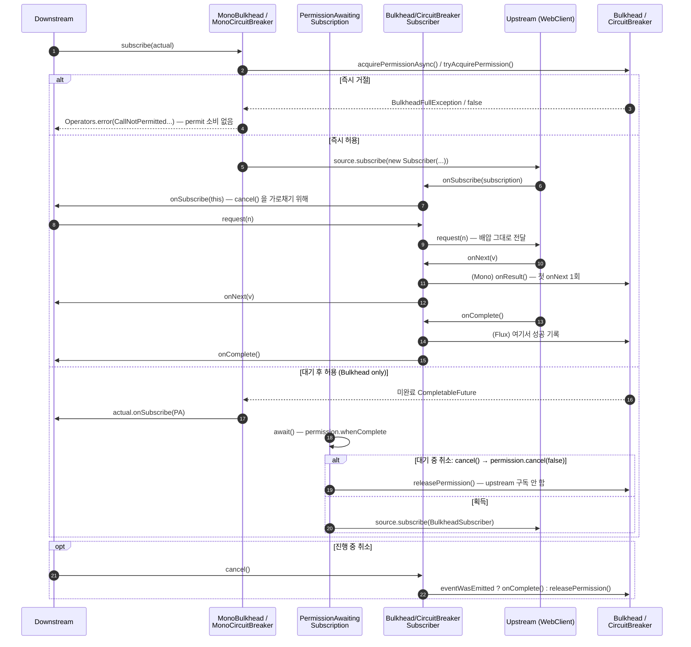

# Reactor 연동 — 배압과 취소를 지키는 오퍼레이터

`resilience4j-reactor` 는 각 컴포넌트를 Reactor 오퍼레이터로 감쌉니다. 핵심 난점은 두 가지 — **Flux 는 성공을 언제 기록하나**, 그리고 **구독이 취소되면 permit 을 어떻게 돌려주나**.

## 목차
- [1. 핵심 개념 (What)](#1-핵심-개념-what)
- [2. 왜 알아야 하는가 (Why)](#2-왜-알아야-하는가-why)
- [3. 내부 구현 분석 (How)](#3-내부-구현-분석-how)
- [4. 실전 예제](#4-실전-예제)
- [5. 정리](#5-정리)

---

## 1. 핵심 개념 (What)

모든 오퍼레이터가 `UnaryOperator<Publisher<T>>` 입니다. `apply()` 가 `publisher instanceof Mono` / `instanceof Flux` 를 판별해 `MonoCircuitBreaker` / `FluxCircuitBreaker` 같은 전용 구현으로 분기하고, 둘 다 아니면 `IllegalPublisherException` 을 던집니다. 구현 전략은 컴포넌트마다 다르고, 이 차이가 동작 차이로 직결됩니다.

| 컴포넌트 | 구현 방식 | 전용 Subscriber |
|---|---|---|
| CircuitBreaker | `MonoOperator`/`FluxOperator` 직접 구현 | `CircuitBreakerSubscriber` |
| Bulkhead | 동일 + **비동기 permission 대기** | `BulkheadSubscriber`, `PermissionAwaitingSubscription` |
| RateLimiter | 동일 + 구독 지연 | `RateLimiterSubscriber` (`CorePublisherRateLimiterOperator` 공용) |
| Timer | 동일 | `TimerSubscriber` |
| **Retry** / **TimeLimiter** | 기존 Reactor 오퍼레이터 조합 (`doOnNext`+`retryWhen` / `timeout`) | 없음 |

`AbstractSubscriber<T>` 는 `BaseSubscriber<T>` 를 상속한 얇은 기반 클래스로, 핵심은 한 줄입니다.

```java
protected void hookOnSubscribe(Subscription subscription) {
    downstreamSubscriber.onSubscribe(this);          // subscription 대신 this 를 넘긴다
}
```

`subscription` 대신 **`this`** 를 downstream 에 넘기는 게 요점입니다. `BaseSubscriber` 자체가 `Subscription` 이므로 downstream 의 `request(n)`·`cancel()` 이 이 Subscriber 를 거쳐 가고 **취소를 가로챌 수 있게** 됩니다. 배압(backpressure)은 `BaseSubscriber` 가 그대로 upstream 에 전달하므로 오퍼레이터가 배압을 깨지 않습니다.

---

## 2. 왜 알아야 하는가 (Why)

### `transform` 과 `transformDeferred` 를 틀리면 조용히 깨진다

Resilience4j 문서가 `transformDeferred` 를 쓰는 이유는 **구독마다 오퍼레이터를 새로 적용**해야 하기 때문입니다. `transform` 은 조립(assembly) 시점에 한 번만 적용합니다. CircuitBreaker 는 `MonoCircuitBreaker.subscribe()` 안에서 permission 을 얻으므로 `transform` 으로도 우연히 동작하지만, `RetryOperator` 는 **`apply()` 안에서** 상태 객체를 만듭니다.

```java
if (publisher instanceof Mono) {
    Context<T> context = new Context<>(retry.asyncContext());   // ← apply() 시점에 1개
    return ((Mono<T>) publisher).doOnNext(context::handleResult)
        .retryWhen(reactor.util.retry.Retry.withThrowable(errors -> errors.flatMap(context::handleErrors)))
        .doOnSuccess(t -> context.onComplete());
}
```

`transform` 을 쓰면 **모든 구독이 하나의 `Retry.AsyncContext` 를 공유**합니다. 시도 횟수가 누적되어 두 번째 구독은 재시도 예산을 다 쓴 상태로 시작합니다. 캐시된 `Mono` 를 여러 번 구독하는 코드에서 "재시도가 안 된다"는 증상이 여기서 나옵니다. **항상 `transformDeferred`.**

### 무한 스트림에 서킷을 걸면 안 되는 이유

`CircuitBreakerSubscriber` 는 Flux 일 때(`singleProducer = false`) **`hookOnComplete()` 에서만** 성공을 기록합니다. 무한 스트림(SSE, Kafka consumer, `Flux.interval`)은 complete 하지 않습니다. 결과는:

permission 은 구독 시 한 번 소비되고 **반납되지 않고**, 성공이 기록되지 않으므로 슬라이딩 윈도가 비어 있고, 에러가 날 때만 실패가 쌓여 **실패만 집계되는 서킷**이 됩니다. 서킷은 "짧은 요청/응답"을 전제로 설계된 장치입니다. 스트림 연결 자체에는 서킷이 아니라 재연결 백오프를 씁니다.

### WebClient 에는 타임아웃이 세 겹 있다

Reactor Netty `HttpClient.responseTimeout(...)`(소켓 레벨), TimeLimiter(논리적 호출 한계 + 지표·이벤트), Reactor `timeout()`(로컬 파이프라인). 1차 방어선은 **`responseTimeout`** 이어야 합니다 — 실제로 소켓을 닫고 커넥션 풀을 돌려주는 유일한 계층입니다. TimeLimiter 를 1차로 두면 Reactor 구독만 취소되고 Netty 커넥션 정리는 취소 전파에 의존합니다. 3절 끝에서 값 배치를 제시합니다.

---

## 3. 내부 구현 분석 (How)

### 신호 흐름과 permission 획득/반납 지점



### Mono 와 Flux 의 결정적 차이 — `singleProducer`

`MonoCircuitBreaker.subscribe()` 는 `singleProducer = true`, `FluxCircuitBreaker` 는 `false` 를 넘깁니다. 이 플래그가 `CircuitBreakerSubscriber` 의 기록 시점을 가릅니다.

```java
protected void hookOnNext(T value) {
    if (!isDisposed()) {
        if (singleProducer && successSignaled.compareAndSet(false, true)) {
            circuitBreaker.onResult(elapsed(), unit(), value);   // Mono 만
        }
        eventWasEmitted.set(true);
        downstreamSubscriber.onNext(value);
    }
}
protected void hookOnComplete() {
    if (successSignaled.compareAndSet(false, true)) {
        circuitBreaker.onSuccess(elapsed(), unit());             // Flux 는 여기서
    }
    downstreamSubscriber.onComplete();
}
public void hookOnCancel() {
    if (!successSignaled.get()) {
        if (eventWasEmitted.get()) circuitBreaker.onSuccess(elapsed(), unit());
        else                       circuitBreaker.releasePermission();
    }
}
protected void hookOnError(Throwable e) {
    circuitBreaker.onError(elapsed(), unit(), e);                // CAS 보호 없음
    downstreamSubscriber.onError(e);
}
```
(`circuitBreaker.getCurrentTimestamp() - start` 를 `elapsed()`, `getTimestampUnit()` 을 `unit()` 으로 줄여 인용)

- **Mono** — 첫 `onNext` 에서 `onResult(duration, unit, value)`. `onResult` 를 쓰는 이유는 `recordResultPredicate` 가 **값 자체를 보고 실패로 판정**할 수 있게 하려는 것입니다. 이후 `onComplete` 는 `successSignaled` CAS 가 막습니다.
- **Flux** — `hookOnNext` 에서 아무것도 기록하지 않고 `hookOnComplete` 에서 **스트림 전체를 성공 1건**으로 기록합니다. duration 은 구독~완료의 **전체 시간**이라, 원소 10만 개를 흘린 Flux 도 서킷에는 호출 1건입니다.
- **취소** — `eventWasEmitted` 로 갈립니다. 값을 하나라도 내보냈으면 성공으로, 전혀 못 내보냈으면 permit **반납**(`releasePermission()` 은 지표에 성공/실패를 남기지 않습니다).
- **에러는 즉시 기록**되고 CAS 보호가 없습니다. `onNext` 후 `onError` 면 Mono 는 성공 1건 + 실패 1건이 모두 기록됩니다.

### 취소 전파 — permit 누수를 막는 두 지점

Bulkhead 는 v2.4.0 에서 **비동기 permission 획득**으로 바뀌었습니다(커밋 `7e3ab525`, Issue #1592). 대기 중 취소라는 새 경계가 생겼고, `PermissionAwaitingSubscription.await()` 가 그것을 처리합니다.

```java
void await() {
    permission.whenComplete((granted, error) -> {
        if (error != null) {
            if (!(error instanceof CancellationException) && !isCancelled()) actual.onError(unwrap(error));
        } else if (isCancelled()) {
            // downstream cancelled while the permission was being granted -> release it
            bulkhead.releasePermission();
        } else {
            source.subscribe(new BulkheadSubscriber<>(bulkhead, this, singleProducer));
        }
    });
}

@Override
public void cancel() { super.cancel(); permission.cancel(false); }
```

- `cancel()` 은 들어온 subscription 을 끊고 **대기 중인 permission future 도 취소**합니다. `SemaphoreBulkhead.acquirePermissionAsync()` 의 `whenComplete` 콜백이 `pendingPermissions` 큐에서 자기를 제거하고, `CancellationException` 이면 `BulkheadOnCallRejectedEvent` 를 **발행하지 않습니다** — 거절이 아니라 철회이므로.
- permission 이 먼저 허용됐는데 그 사이 취소됐다면 `isCancelled()` 분기에서 `releasePermission()` 합니다. 주석이 이유를 말합니다 — upstream 을 구독하면 **subscribe-time 부작용**(HTTP 요청 발송)이 일어나는데 아무도 소비하지 않을 것이므로.

두 번째 지점은 `BulkheadSubscriber.hookOnCancel()` — `completedSignaled.compareAndSet(false, true)` 안에서 `eventWasEmitted` 면 `onComplete()`, 아니면 `releasePermission()` 입니다. 이 CAS 가 `onComplete`/`onError`/`cancel` 중 **정확히 한 번만** permit 을 돌려주도록 보장합니다. 없으면 완료 직후 오는 취소에서 double release 가 나 permit 이 늘어납니다.

### `AcquirePermissionCancelledException` 은 여기 안 나온다

이 예외를 Reactor 취소와 연결하는 설명을 종종 보는데, 소스는 다릅니다. 던지는 곳은 두 군데뿐이고 **둘 다 블로킹 경로**입니다 — `SemaphoreBulkhead.acquirePermission()`(`tryAcquirePermission()` 실패 후 `Thread.currentThread().isInterrupted()` 일 때)과 `RateLimiter.waitForPermission()`(대기 중 스레드 인터럽트, javadoc 명시). 메시지도 `"Thread was interrupted while waiting for a permission"` 입니다.

**Reactor 구독 취소는 스레드 인터럽트가 아니므로** 이 예외가 나오지 않습니다. 반응형 취소는 `CancellationException` 으로 표현되고, `PermissionAwaitingSubscription.await()` 이 그것을 삼켜 downstream 에 `onError` 를 보내지 않습니다(이미 취소한 구독자에게 에러를 보내는 건 스펙 위반).

### `PermissionAwaitingSubscription` 의 배압, 그리고 RateLimiter 의 다른 선택

이름 때문에 rate limit + 배압을 함께 다루는 클래스처럼 보이지만 패키지가 `reactor.bulkhead.operator` 입니다. 하는 일은 **permission 을 아직 못 얻은 상태의 Subscription 자리를 메우는 것**입니다. `Operators.DeferredSubscription` 을 상속했으므로 대기 중 downstream 이 보낸 `request(n)` 이 **누적**되고 실제 subscription 이 `set(s)` 로 들어올 때 한꺼번에 전달됩니다 — 배압 신호를 잃지 않으면서 구독만 미루는 구조이고, `onSubscribe(Subscription s)` 가 `set(s)` 한 줄인 이유입니다.

RateLimiter 쪽은 전혀 다른 방식입니다.

```java
void subscribe(CoreSubscriber<? super T> actual) {
    long waitDuration = rateLimiter.reservePermission(permits);
    if (waitDuration >= 0) {
        if (waitDuration > 0) delaySubscription(actual, waitDuration);
        else source.subscribe(new RateLimiterSubscriber<>(rateLimiter, actual));
    } else {
        Operators.error(actual, createRequestNotPermitted(rateLimiter));
    }
}

private void delaySubscription(CoreSubscriber<? super T> actual, long waitDuration) {
    Mono.delay(Duration.ofNanos(waitDuration))
        .subscribe(delay -> source.subscribe(new RateLimiterSubscriber<>(rateLimiter, actual)));
}
```

`reservePermission` 이 대기해야 할 나노초를 돌려주면 `Mono.delay` 로 구독을 미룹니다. **블로킹이 없습니다.** 음수면 timeout 안에 못 받는다는 뜻이라 `RequestNotPermitted` 입니다.

주의할 점 두 가지. 첫째, `delaySubscription` 은 `actual.onSubscribe(...)` 를 지연 전에 호출하지 않습니다. 대기 중 downstream 은 **Subscription 을 아직 받지 못한 상태**이고, 따라서 그 구간의 취소를 전달할 수단이 없어 예약된 permit 이 그대로 소비됩니다. Bulkhead 와 다른 지점입니다. 둘째, `RateLimiterSubscriber` 는 `hookOnNext` 에서 `rateLimiter.onResult(value)` 를 **원소마다** 호출합니다 — Flux 에서는 `drainPermissionsOnResult` 류의 판정이 원소마다 평가됩니다.

### Retry / TimeLimiter — 왜 Reactor 기본 오퍼레이터를 안 쓰고 이걸 쓰나

둘 다 내부적으로 Reactor 오퍼레이터(`retryWhen`, `timeout`)를 **씁니다.** 차이는 그 위에 얹힌 것입니다.

| 기준 | `RetryOperator` | Reactor `retryWhen` |
|---|---|---|
| 백오프 설정 | `RetryConfig`(`IntervalFunction`, 지터) — `application.yml` 외부화 | 하드코딩된 `RetrySpec` |
| **결과 기반 재시도** | `handleResult()` → `retryContext.onResult(result)`, 내부 예외 `RetryDueToResultException` 으로 변환해 `retryWhen` 에 태움 | `filter` + 예외 변환 직접 |
| 지표 / 이벤트 | `resilience4j.retry.calls`(`kind` 4종), `/actuator/retryevents` | 없음 |
| `Error` 처리 | `instanceof Error` 면 재던짐 — 재시도 안 함 | 기본적으로 재시도 대상 |

`TimeLimiterOperator` 는 더 얇습니다.

```java
private Publisher<T> withTimeout(Mono<T> upstream) {
    return upstream.timeout(getTimeout()).doOnSuccess(t -> timeLimiter.onSuccess()).doOnError(timeLimiter::onError);
}
private Publisher<T> withTimeout(Flux<T> upstream) {
    return upstream.timeout(getTimeout())
        .doOnNext(t -> timeLimiter.onSuccess())      // ← 원소마다
        .doOnComplete(timeLimiter::onSuccess).doOnError(timeLimiter::onError);
}
```

`timeout()` + 이벤트 기록이 전부입니다. 가치는 `timeoutDuration` 외부화와 `resilience4j.timelimiter.calls` 지표입니다. **단 Flux 쪽을 보세요.** `doOnNext` 와 `doOnComplete` 모두에서 `onSuccess()` 를 부르므로 원소 N개 Flux 가 성공 N+1 건으로 집계되고, `timeout()` 은 **원소 간 간격**에 적용되므로 "전체 소요 시간 제한"도 아닙니다. Flux 에 TimeLimiter 는 쓰지 않는 게 맞습니다.

### WebClient 와의 역할 분담

| 계층 | 값 예시 | 역할 |
|---|---|---|
| `HttpClient.responseTimeout` | `2s` | **1차 방어선.** 소켓을 닫고 커넥션을 풀에 반납 |
| TimeLimiter `timeoutDuration` | `2500ms` | 논리적 상한 + 지표/이벤트. responseTimeout 보다 길게 |
| CircuitBreaker `slowCallDurationThreshold` | `1s` | 느림 판정 — 타임아웃보다 **짧아야** 의미가 있다 |

TimeLimiter 를 `responseTimeout` 보다 **짧게** 잡으면 TimeLimiter 가 먼저 터지고 커넥션 정리는 취소 전파에 의존합니다. 전파가 되긴 하지만 한 겹을 더 거치므로, 바닥(Netty)을 먼저 때리게 두는 편이 안전합니다.

---

## 4. 실전 예제

### WebClient 호출에 CircuitBreaker + RateLimiter + TimeLimiter 를 올바른 순서로

```java
@Bean
WebClient catalogWebClient() {
    HttpClient httpClient = HttpClient.create()
        .option(ChannelOption.CONNECT_TIMEOUT_MILLIS, 1_000)
        .responseTimeout(Duration.ofSeconds(2));          // 1차 방어선
    return WebClient.builder()
        .baseUrl("https://catalog.internal")
        .clientConnector(new ReactorClientHttpConnector(httpClient))
        .build();
}

// CatalogGateway — circuitBreaker/rateLimiter/timeLimiter 는 각 Registry 에서 "catalog" 로 획득
public Mono<ProductResponse> lookup(String sku) {
    return webClient.get()
        .uri("/products/{sku}", sku)
        .retrieve()
        .bodyToMono(ProductResponse.class)
        // 안쪽 → 바깥쪽. 모두 transformDeferred
        .transformDeferred(TimeLimiterOperator.of(timeLimiter))        // 호출 시간 제한
        .transformDeferred(RateLimiterOperator.of(rateLimiter))        // 호출 자체를 허용할지
        .transformDeferred(CircuitBreakerOperator.of(circuitBreaker)); // 열렸으면 즉시 차단
}
```

**순서의 근거:**

1. `TimeLimiterOperator` 가 **가장 안쪽**이어야 타임아웃이 서킷의 실패로 기록됩니다. 바깥에 두면 `TimeoutException` 이 서킷 밖에서 발생해 `failureRate` 에 안 들어갑니다.
2. `RateLimiter` 는 서킷보다 **안쪽** — 반대면 차단될 호출이 permit 을 소비합니다.
3. `CircuitBreaker` 가 **가장 바깥** — 가장 싸게 거절하는 장치를 앞에 둡니다.

```yaml
resilience4j:
  circuitbreaker:
    instances:
      catalog:
        slidingWindowType: TIME_BASED
        slidingWindowSize: 60
        minimumNumberOfCalls: 20
        failureRateThreshold: 50
        slowCallDurationThreshold: 1s   # p99 × 2~3 (07-timer-module 참고)
        slowCallRateThreshold: 50
        waitDurationInOpenState: 10s
        permittedNumberOfCallsInHalfOpenState: 5
        recordExceptions: [java.util.concurrent.TimeoutException, java.io.IOException]
  ratelimiter:
    instances:
      catalog: { limitForPeriod: 200, limitRefreshPeriod: 1s, timeoutDuration: 50ms }
  timelimiter:
    instances:
      catalog: { timeoutDuration: 2500ms, cancelRunningFuture: true }
```

`ratelimiter.timeoutDuration` 은 반응형이므로 짧게 둡니다(`Mono.delay` 로 미뤄질 뿐 블로킹이 아님). `timelimiter.timeoutDuration` 은 `responseTimeout`(2s) 보다 길게.

`recordExceptions` 에 `TimeoutException` 을 넣어야 TimeLimiter 의 타임아웃이 서킷 실패로 집계됩니다. 빠뜨리면 느려지기만 하고 서킷이 열리지 않습니다.

### 취소 시 permit 반납을 검증하는 테스트

레포의 `BulkheadOperatorQueueingTest` 패턴입니다. 대기 중 취소와 진행 중 취소를 각각 확인합니다.

```java
@Test
@Timeout(5)
void shouldNotConsumePermitWhenWaitingSubscriberIsCancelled() {
    Bulkhead bulkhead = Bulkhead.of("test", BulkheadConfig.custom()
        .maxConcurrentCalls(1).maxWaitDuration(Duration.ofSeconds(10)).build());

    assertThat(bulkhead.tryAcquirePermission()).isTrue();      // permit 1개 미리 점유

    Disposable waiting = Mono.just("never")                    // 대기 큐에 들어간 구독을
        .transformDeferred(BulkheadOperator.of(bulkhead))
        .subscribe();
    waiting.dispose();                                         // 즉시 취소

    bulkhead.onComplete();                                     // 점유했던 permit 반납

    assertThat(bulkhead.getMetrics().getAvailableConcurrentCalls())
        .as("cancelled waiting subscription must not consume the released permit")
        .isEqualTo(1);

    StepVerifier.create(Mono.just("after").transformDeferred(BulkheadOperator.of(bulkhead)))
        .expectNext("after").verifyComplete();                 // 반납된 permit 으로 통과
}

@Test
void cancelBeforeFirstElementMustNotRecordCall() {
    CircuitBreaker cb = CircuitBreaker.ofDefaults("test");
    StepVerifier.create(Mono.<String>never().transformDeferred(CircuitBreakerOperator.of(cb)))
        .expectSubscription()
        .thenCancel()
        .verify(Duration.ofSeconds(5));
    // eventWasEmitted == false → releasePermission() → 호출로 집계되지 않는다
    assertThat(cb.getMetrics().getNumberOfBufferedCalls()).isZero();
}
```

### 안티패턴 — 무한 스트림에 서킷

```java
// 하지 마세요
return webClient.get().uri("/prices/stream").retrieve()
    .bodyToFlux(PriceTick.class)                                  // 종료되지 않는 SSE
    .transformDeferred(CircuitBreakerOperator.of(circuitBreaker)); // ← permit 영구 점유
```

구독 시 permission 하나를 소비하는데 `hookOnComplete` 가 영원히 안 오므로 **성공이 기록되지 않습니다.** 연결이 끊겨 `onError` 가 올 때만 실패 1건이 쌓이고, 재연결마다 실패만 누적되어 **성공 0 / 실패 N** 으로 서킷이 열립니다. 열린 뒤에는 재연결 자체가 `CallNotPermittedException` 으로 막혀 스트림이 복구되지 않습니다 — 서킷이 복구를 방해하는 꼴입니다.

올바른 형태는 서킷을 빼고 Reactor 재연결 전략을 쓰는 것입니다.

```java
.bodyToFlux(PriceTick.class)
.retryWhen(Retry.backoff(Long.MAX_VALUE, Duration.ofSeconds(1))
    .maxBackoff(Duration.ofSeconds(30))
    .jitter(0.5));
```

서킷을 꼭 쓰려면 **스트림이 아니라 연결 수립 단계**(세션 토큰을 받아오는 `Mono` 등)에만 감쌉니다.

같은 이유로 **Flux 에 TimeLimiter 를 걸지 마세요** — `timeout()` 이 원소 간 간격에 적용되고 `doOnNext` 마다 `onSuccess()` 가 불립니다.

---

## 5. 정리

| 질문 | 답 |
|---|---|
| `transform` vs `transformDeferred` | **항상 `transformDeferred`.** `RetryOperator.apply()` 가 `Retry.AsyncContext` 를 만들므로 `transform` 은 모든 구독이 재시도 예산을 공유 |
| 지원 타입 | `Mono`, `Flux` 만. 그 외는 `IllegalPublisherException`. `AbstractSubscriber` 는 `hookOnSubscribe` 에서 **`this`** 를 넘겨 `cancel()` 을 가로채고, 배압은 `BaseSubscriber` 가 그대로 전달 |
| 성공 기록 시점 | Mono = 첫 `onNext` 의 `onResult(duration, unit, value)`(`recordResultPredicate` 가 값을 본다) / Flux = **`hookOnComplete` 에서 1건**, duration 은 구독~완료 전체 |
| 무한 스트림 | complete 가 없어 permit 영구 점유 + 실패만 집계 → 서킷 걸지 않는다 |
| 취소 시 | CB·Bulkhead 모두 `eventWasEmitted` ? `onComplete()/onSuccess()` : `releasePermission()`. Bulkhead 는 `completedSignaled` CAS 로 정확히 1회 보장. 대기 중 취소는 `PermissionAwaitingSubscription.cancel()` → `permission.cancel(false)`, 허용이 먼저 왔으면 `isCancelled()` 분기에서 반납 |
| `AcquirePermissionCancelledException` | **블로킹 경로 전용** (`SemaphoreBulkhead.acquirePermission()`, `RateLimiter.waitForPermission()` 의 스레드 인터럽트). Reactor 취소에서는 나오지 않음 |
| `PermissionAwaitingSubscription` | Bulkhead 전용. `Operators.DeferredSubscription` 상속으로 대기 중 `request(n)` 을 누적해 배압 유지 |
| RateLimiter 대기 | `reservePermission()` → `Mono.delay()` 로 구독 지연. 음수면 `RequestNotPermitted`. **대기 구간의 취소는 전달되지 않아 permit 이 소비됨** |
| `RetryOperator` / `TimeLimiterOperator` vs 순수 Reactor | 설정 외부화 · 결과 기반 재시도(`RetryDueToResultException`) · 지표/이벤트 · `Error` 재시도 제외. `TimeLimiter` 는 **Flux 에는 쓰지 않는다** |
| WebClient 역할 분담 | `responseTimeout`(2s) **1차** → TimeLimiter(2.5s) 논리 상한 → `slowCallDurationThreshold`(1s) 느림 판정 || 올바른 체인 순서 | 안쪽 TimeLimiter → RateLimiter → 바깥 CircuitBreaker. `recordExceptions` 에 `TimeoutException` 필수 |

---

## 관련 문서
- 선행: [Timer 모듈 — 데코레이터로 들어온 관측](./07-timer-module.md)
- 후행: [Kotlin 코루틴 연동](./09-kotlin-coroutines.md)
- 참고: [TimeLimiter 와 조합](../main/12-timelimiter-and-composition.md) · [Bulkhead](../main/11-bulkhead.md) · [컨텍스트 전파](./10-context-propagation.md)

---
*Resilience4j v2.4.0 기준 · 소스 커밋 7e3ab525*
