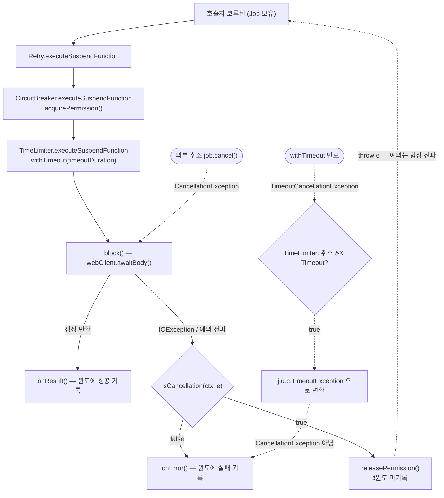

# Kotlin 코루틴·Flow 연동 — suspend 함수를 감싸는 방법

`resilience4j-kotlin` 은 Java 데코레이터를 코루틴 규약에 맞게 다시 포장한 확장 함수(extension function) 모음입니다. 핵심은 "취소(cancellation)는 장애가 아니다" 를 어떻게 구분하느냐이고, 이걸 틀리면 멀쩡한 하류를 향해 서킷이 열립니다.

## 목차
- [1. 핵심 개념 (What)](#1-핵심-개념-what)
- [2. 왜 알아야 하는가 (Why)](#2-왜-알아야-하는가-why)
- [3. 내부 구현 분석 (How)](#3-내부-구현-분석-how)
- [4. 실전 예제](#4-실전-예제)
- [5. 정리](#5-정리)

---

## 1. 핵심 개념 (What)

이 모듈은 새 알고리즘을 만들지 않습니다. 기존 `CircuitBreaker`·`Retry`·`RateLimiter`·`Bulkhead`·`TimeLimiter`·`Timer` 를 코루틴 호출 규약에 맞게 감싸는 **얇은 층**이고, 제공물은 세 종류입니다.

| 종류 | 형태 | 예 |
|---|---|---|
| suspend 확장 함수 | `suspend fun <T> X.executeSuspendFunction(block: suspend () -> T): T` | `circuitBreaker.executeSuspendFunction { api.call() }` |
| Flow 연산자 | `fun <T> Flow<T>.x(instance: X): Flow<T>` | `flow.circuitBreaker(circuitBreaker)` |
| 설정 DSL | `inline fun XConfig(config: XConfig.Builder.() -> Unit): XConfig` | `CircuitBreakerConfig { failureRateThreshold(50f) }` |

`build.gradle` 에서 먼저 확인할 두 가지. 하나, 컴포넌트 모듈이 전부 `compileOnly(project(":resilience4j-circuitbreaker"))` 형태라 **이 모듈만 의존성에 넣으면 아무것도 동작하지 않습니다** — 쓸 컴포넌트를 런타임 의존성으로 직접 추가해야 합니다. 둘, `compileKotlin { jvmTarget = JVM_21 }` 이므로 JDK 21 이상을 요구합니다. 그리고 `ThreadPoolBulkhead` 용 suspend 확장 함수는 **없습니다**(설정 DSL 만 존재) — 코루틴에서 작업을 다른 스레드풀로 넘기는 건 이미 `Dispatchers` 의 일이니까요.

---

## 2. 왜 알아야 하는가 (Why)

Java 데코레이터를 코루틴에서 그대로 쓰면 두 가지가 깨집니다.

**첫째, 블로킹.** `executeCallable { }` 은 호출 스레드를 점유하고, `Bulkhead.acquirePermission()` 은 `maxWaitDuration` 동안 스레드를 블로킹합니다. 디스패처 스레드는 몇 개뿐이라 금방 말라붙습니다. **둘째, 취소 의미의 소실 — 이게 본질입니다.** 코루틴에서 취소는 일상입니다(호출자 스코프 종료, `withTimeout` 만료, 형제 코루틴 실패로 인한 `coroutineScope` 전체 취소, 클라이언트 연결 끊김). 이때 던져지는 `CancellationException` 은 **하류 장애가 아닙니다.** 그런데 Java 데코레이터는 `Throwable` 을 보면 전부 `onError()` 로 기록합니다.

> 롤링 배포로 인스턴스가 셧다운되며 in-flight 요청이 대량 취소 → 전부 `CircuitBreaker.onError()` → 실패율 급등 → **정상인 하류를 향해 서킷 OPEN** → 배포가 끝난 뒤에도 `waitDurationInOpenState` 동안 전면 차단.

원인 분석이 유난히 어려운 종류의 사고입니다. 하류 지표는 전부 정상이기 때문입니다. `resilience4j-kotlin` 이 `Cancellation.kt` 라는 파일을 따로 두는 이유가 정확히 이것입니다.

---

## 3. 내부 구현 분석 (How)

### 3.1 확장 함수 API 전체 목록

| 컴포넌트 | suspend API | Flow 연산자 | 취소 구분 |
|---|---|---|---|
| `CircuitBreaker` | `executeSuspendFunction(block)` / `executeSuspendFunction(ignoreThrowablePredicate, block)` / `executeSuspendFunctionAndRecordCancellationError(block)` / `decorateSuspendFunction(block)` | `Flow<T>.circuitBreaker(cb)` | O |
| `Retry` | `executeSuspendFunction` / `decorateSuspendFunction` | `Flow<T>.retry(retry)` | **X** |
| `RateLimiter` | `executeSuspendFunction` / `decorateSuspendFunction` | `Flow<T>.rateLimiter(rl)` | **X** |
| `Bulkhead` | `executeSuspendFunction` / `decorateSuspendFunction` | `Flow<T>.bulkhead(bh)` | O |
| `TimeLimiter` | `executeSuspendFunction` / `decorateSuspendFunction` | `Flow<T>.timeLimiter(tl)` | O (타임아웃만 예외) |
| `Timer` | `executeSuspendFunction` / `decorateSuspendFunction` | `Flow<T>.timer(timer)` | **X** |

모든 파일이 `executeFunction(block: () -> T)` / `decorateFunction` 이라는 **비(非)suspend** 짝도 함께 제공합니다. 이건 Java API 를 Kotlin 람다로만 감싼 것(`executeCallable(block)`)이라 코루틴 의미가 없습니다. 이름이 비슷해 실수하기 쉬우니 리뷰에서 구분해 보세요. 문법 포인트로, `block: suspend () -> T` 는 **suspend 람다를 받는 고차 함수**입니다. 람다 자체가 `suspend` 로 선언돼야 그 안에서 `delay()`·`awaitBody()` 를 부를 수 있습니다.

### 3.2 취소 판별의 전부 — `Cancellation.kt`

주석을 빼면 **7줄**인데, 모듈 전체의 정확성이 여기 달려 있습니다.

```kotlin
internal fun isCancellation(coroutineContext: CoroutineContext, error: Throwable? = null): Boolean {

    // If job is missing then there is no cancellation
    val job = coroutineContext[Job] ?: return false

    return job.isCancelled || (error != null && error is CancellationException)
}
```

- `coroutineContext[Job] ?: return false` — `Job` 이 없으면 취소라는 개념 자체가 없습니다. 안전하게 "취소 아님" 판정.
- `job.isCancelled` — **바깥쪽이 이미 취소된 경우.** 블록이 무슨 예외를 던졌든 그건 취소의 결과입니다.
- `error is CancellationException` — **예외 자체가 취소인 경우.** `java.util.concurrent.CancellationException` 을 import 하는데, `kotlinx.coroutines.CancellationException` 이 이 클래스의 `typealias` 라 둘은 같은 타입이고 `TimeoutCancellationException` 도 포함됩니다.

두 조건이 **OR** 인 게 핵심입니다 — 자식 스코프만 취소된 경우(`job.isCancelled == false`)는 예외 타입으로, 취소 후 블록이 다른 예외를 던진 경우는 `isCancelled` 로 잡아냅니다.

### 3.3 `CircuitBreaker.executeSuspendFunction()` — 공개 API 3개, 구현 1개

```kotlin
suspend fun <T> CircuitBreaker.executeSuspendFunction(
    block: suspend () -> T
): T = executeSuspendFunction({ t, c -> isCancellation(c, t) }, block)

@Suppress("UsePropertyAccessSyntax")
suspend fun <T> CircuitBreaker.executeSuspendFunction(
    ignoreThrowablePredicate: (Throwable, CoroutineContext) -> Boolean,
    block: suspend () -> T
): T {
    acquirePermission()
    val start = getCurrentTimestamp()
    try {
        val result = block()
        onResult(getCurrentTimestamp() - start, TimeUnit.NANOSECONDS, result)
        return result
    } catch (exception: Throwable) {
        if (ignoreThrowablePredicate(exception, coroutineContext)) {
            releasePermission()
        } else {
            onError(getCurrentTimestamp() - start, TimeUnit.NANOSECONDS, exception)
        }
        throw exception
    }
}

suspend fun <T> CircuitBreaker.executeSuspendFunctionAndRecordCancellationError(block: suspend () -> T): T =
    executeSuspendFunction({ _, _ -> false }, block)
```

- `acquirePermission()` — 서킷이 OPEN 이면 여기서 `CallNotPermittedException`. 블록은 실행되지 않습니다.
- `releasePermission()` vs `onError()` — **이 한 줄 차이가 전부입니다.** 전자는 점유한 허가만 반납하고 **슬라이딩 윈도에 아무 기록도 남기지 않습니다**(호출 횟수에도 미포함). 후자는 실패로 기록합니다.
- 마지막 `throw exception` — 취소든 실패든 예외는 **항상** 전파합니다. 취소를 "무시" 하는 게 아니라 **집계에서만 제외**합니다. 이 구분을 혼동하면 안 됩니다. (`@Suppress("UsePropertyAccessSyntax")` 는 매번 값이 바뀌는 `getCurrentTimestamp()` 를 프로퍼티로 바꾸라는 경고를 끈 것입니다. 발췌는 `durationInNanos` 지역 변수만 인라인했고 로직은 소스 그대로입니다.)
- `...AndRecordCancellationError` 는 술어를 `{ _, _ -> false }` 로 줘 "아무것도 무시하지 말라" 고 지시합니다. 소스의 `CoroutineCircuitBreakerTest.testCancellation()` 이 두 변형을 각각 `expectedNumberOfFailedCalls = 0` / `1` 로 검증합니다.

### 3.4 컴포넌트별 취소 처리는 **일관되지 않다**

| 함수 | 취소 시 | 근거 |
|---|---|---|
| `CircuitBreaker.executeSuspendFunction()` | `releasePermission()`, 미기록 | `isCancellation` 검사 O |
| `Bulkhead.executeSuspendFunction()` | `releasePermission()` (아니면 `onComplete()`) | 검사 O |
| `TimeLimiter.executeSuspendFunction()` | 타임아웃은 `onError`, 그 외 취소는 미기록 | 검사 O |
| `Retry.executeSuspendFunction()` | `retryContext.onError(e)` 로 **기록** | `catch (e: Exception)` — 검사 없음 |
| `RateLimiter.executeSuspendFunction()` | `onError(e)` 로 **기록** | `catch (e: Throwable)` — 검사 없음 |
| `Timer.decorateSuspendFunction()` | `context.onFailure(e)` 로 **기록** | 검사 없음 |

영향도는 다릅니다. `RateLimiter`·`Retry` 는 상태 전이가 없어 지표가 더러워지는 정도입니다. `Timer` 는 취소가 "실패" 로 집계되어 **대시보드 에러율이 부풀려집니다** — 알럿 임계값을 잡을 때 알고 있어야 합니다. `CircuitBreaker` 만 상태 전이가 있어 치명적이고, 그래서 거기만 꼼꼼히 막아둔 겁니다.

### 3.5 데코레이터 통과 흐름과 취소 신호 경로



### 3.6 `TimeLimiter` vs 코루틴 `withTimeout`

`TimeLimiter.kt` 는 사실 **`withTimeout` 의 래퍼**입니다.

```kotlin
suspend fun <T> TimeLimiter.executeSuspendFunction(block: suspend () -> T): T =
    try {
        withTimeout(timeLimiterConfig.timeoutDuration.toMillis()) {
            block().also { onSuccess() }
        }
    } catch (t: Throwable) {
        if (isCancellation(coroutineContext, t)) {
            if (t is TimeoutCancellationException) {
                val timeoutException = TimeLimiter.createdTimeoutExceptionWithName(name, t)
                onError(timeoutException)
                throw timeoutException
            }
            // if not a timeout, then do not record success or error on cancellation
        } else {
            onError(t)
        }
        throw t
    }
```

- 타임아웃 값만 `TimeLimiterConfig` 에서 읽고, 실제 시간 제한은 코루틴 메커니즘이 합니다. `TimeoutCancellationException` → `createdTimeoutExceptionWithName(name, t)` 로 **변환**하는 게 결정적입니다. 변환하지 않으면 바깥 `CircuitBreaker` 의 `isCancellation` 이 `true` 를 받아 타임아웃을 **실패로 세지 않습니다.**
- 변환 결과 타입을 확인하세요. `TimeLimiter.java` 는 `import java.util.concurrent.*` 를 쓰므로 이 `TimeoutException` 은 `java.util.concurrent.TimeoutException` = `java.lang.Exception` 의 하위 타입이고 `CancellationException` 과 **무관**합니다. 그래서 바깥 서킷이 정상적으로 실패로 기록합니다. (`TimeLimiter.kt` 의 KDoc 은 "`java.util.concurrent.CancellationException` 에서 파생된다" 고 적지만 실제 상속 관계는 그렇지 않습니다. 동작은 의도대로지만 주석이 낡았습니다.)
- KDoc 이 명시한 제약: **`cancelRunningFuture` 설정은 무시**되고, 블록은 **취소 가능한 중단 지점에서만** 멈춥니다. 블록 안에서 CPU 를 태우거나 블로킹 I/O 를 하면 타임아웃이 지나도 안 멈춥니다.

**어느 쪽을 쓰나?** 순수한 시간 제한만 필요하면 `withTimeout` 이 자연스럽습니다. `TimeLimiter` 를 쓸 이유는 ① 타임아웃 값의 중앙 관리·런타임 변경 ② 이벤트·Micrometer 지표 ③ **바깥 `CircuitBreaker` 가 타임아웃을 실패로 집계**해야 할 때인데, ③이 압도적으로 큽니다. 서킷 안쪽에서 날 `withTimeout` 을 쓰면 `TimeoutCancellationException` 이 올라가고 `isCancellation` 이 `true` 를 반환해 **타임아웃이 서킷에 전혀 집계되지 않습니다.** 하류가 전부 느려 타임아웃만 나는 상황에서 서킷이 영원히 CLOSED 로 남습니다.

> **리뷰 규칙**: `CircuitBreaker.executeSuspendFunction` 안쪽의 시간 제한은 날 `withTimeout` 이 아니라 `TimeLimiter.executeSuspendFunction` 으로. 꼭 `withTimeout` 을 쓰려면 바깥 서킷에 `ignoreThrowablePredicate` 를 직접 넘겨 타임아웃을 실패로 세게 해야 합니다.

### 3.7 Flow 확장 — 성공/실패를 **언제** 기록하는가

Reactor 편과 같은 문제입니다. Flow 는 값이 여러 개 흐르는데 복원성 컴포넌트는 "한 번의 호출" 단위로 기록합니다. `FlowCircuitBreaker.kt` 의 답은 **`onCompletion` — 스트림 전체가 끝날 때 1회** 입니다.

```kotlin
fun <T> Flow<T>.circuitBreaker(circuitBreaker: CircuitBreaker): Flow<T> =
    flow {
        circuitBreaker.acquirePermission()

        val start = System.nanoTime()
        val source = this@circuitBreaker.onCompletion { e ->
            when {
                isCancellation(coroutineContext, e) -> circuitBreaker.releasePermission()
                e == null -> circuitBreaker.onSuccess(System.nanoTime() - start, TimeUnit.NANOSECONDS)
                else -> circuitBreaker.onError(System.nanoTime() - start, TimeUnit.NANOSECONDS, e)
            }
        }

        emitAll(source)
    }
```

- `flow { }` 로 감싸 `acquirePermission()` 을 **수집(collect) 시점에** 실행합니다. Flow 는 cold 이므로 연산자를 붙이는 순간이 아니라 수집할 때 허가를 얻는 게 맞습니다.
- `this@circuitBreaker` — **수신 객체 레이블**입니다. `flow { }` 안의 `this` 는 `FlowCollector` 이므로, 원본 Flow 를 가리키려면 확장 함수 이름으로 레이블을 붙여야 합니다.
- `onCompletion { e }` — `e` 는 `null`(정상) / `CancellationException`(취소) / 그 외(실패). `when` 의 순서가 우선순위이고 **취소를 가장 먼저** 걸러냅니다. 측정되는 "호출 시간" 은 개별 값의 지연이 아니라 **스트림 전체의 수명**입니다. 10분간 열린 SSE 스트림에 붙이면 `slowCallDurationThreshold` 가 무슨 값이든 느린 호출로 집계되고, 허가 하나가 스트림 수명 내내 점유됩니다.

| 연산자 | 구현 | 기록 시점 |
|---|---|---|
| `Flow<T>.circuitBreaker(cb)`, `Flow<T>.bulkhead(bh)` | `flow` + `onCompletion` + `emitAll` | 수집 시작 시 허가, **완료 시 1회** 기록 |
| `Flow<T>.rateLimiter(rl)` | `onStart` | **시작 시 1회만** — 값마다 아님 |
| `Flow<T>.retry(retry)` | `onEach` + `retryWhen` + `onCompletion` | 값마다 결과 판정, 실패 시 **스트림 전체 재시작** |
| `Flow<T>.timeLimiter(tl)` / `Flow<T>.timer(timer)` | `channelFlow` + `executeSuspendFunction` / `onStart` + `onCompletion` | 스트림 전체 수집에 타임아웃 / 시작~완료 전 구간 측정 |

`FlowRateLimiter.kt` 는 정말 한 줄 — `onStart { rateLimiter.awaitPermission() }` 입니다. **값이 1000개 흘러도 허가는 1개만 소비합니다.** "초당 100건" 을 기대하고 붙였다면 완전히 잘못 쓴 겁니다. 값당 제한이 필요하면 `onEach { rateLimiter.awaitPermission() }` 을 직접 써야 합니다. 그리고 `FlowRetry.kt` 의 `retryWhen` 은 **업스트림 Flow 를 처음부터 다시 수집**합니다. 이미 내려보낸 값은 회수되지 않으므로 **소비자가 같은 값을 두 번 받을 수 있습니다** — 멱등하지 않은 소비자(저장·전송·결제)가 붙어 있으면 중복 처리됩니다.

### 3.8 설정 DSL — `inline fun` + 수신 객체 지정 람다 + `apply`

Kotlin 학습 중이라면 여기가 가장 배울 게 많습니다. `CircuitBreakerConfig.kt` 는 사실상 두 줄입니다.

```kotlin
@file:Suppress("FunctionName")

inline fun CircuitBreakerConfig(
    config: CircuitBreakerConfig.Builder.() -> Unit
): CircuitBreakerConfig {
    return CircuitBreakerConfig.custom().apply(config).build()
}
```

1. **`@file:Suppress("FunctionName")`** — Kotlin 함수명은 소문자로 시작하는 게 관례지만, Java 클래스 `CircuitBreakerConfig` 와 **똑같은 이름의 함수**를 만들어 생성자처럼 보이게 하려고 일부러 어기고 경고를 껐습니다.
2. **`config: CircuitBreakerConfig.Builder.() -> Unit`** — **수신 객체 지정 람다(lambda with receiver)**. 일반 람다 `(Builder) -> Unit` 과의 차이는 람다 안에서 **`this` 가 `Builder`** 라는 점입니다. 그래서 `it.failureRateThreshold(50f)` 가 아니라 `failureRateThreshold(50f)` 로 바로 씁니다. Kotlin DSL 의 거의 전부가 이 문법 하나입니다.
3. **`.apply(config)`** — 표준 라이브러리의 `apply`(`public inline fun <T> T.apply(block: T.() -> Unit): T`)는 받은 수신 객체 지정 람다를 **자기 자신 위에서 실행하고 자기를 반환**합니다. Java 빌더를 Kotlin DSL 로 바꾸는 가장 짧은 방법이고, `inline` 은 람다 객체 할당을 없애지만 설정은 시작 시 한 번뿐이니 성능보다 관용구입니다.

**중요 — 호출 문법은 프로퍼티 대입이 아니라 Java 빌더 메서드 호출입니다.**

```kotlin
val config = CircuitBreakerConfig {                 // ✅ 소스가 지원하는 실제 문법
    failureRateThreshold(50f)
    waitDurationInOpenState(Duration.ofSeconds(30))
}
val wrong = CircuitBreakerConfig { failureRateThreshold = 50f }  // ❌ Builder 에 var 프로퍼티 없음
```

Kotlin DSL 이라고 하면 `= 값` 대입을 떠올리기 쉽지만, 이 모듈은 Java 빌더를 **얇게 감싼 것**이라 메서드 호출입니다. 이름만 생성자처럼 보이는 거죠. 같은 패턴이 `RetryConfig.kt`·`TimeLimiterConfig.kt`·`BulkheadConfig.kt`·`ThreadPoolBulkheadConfig.kt`·`RateLimiterConfig.kt`·`TimerConfig.kt` 에 반복되고 각각 `XConfig.from(baseConfig).apply(config).build()` 2-인자 오버로드도 있습니다.

`RetryConfig.kt` 의 디테일 하나: `Builder<T>` 용과 `Builder<Any?>` 용 두 오버로드의 JVM 시그니처가 지워짐(erasure)으로 충돌하므로 후자에 `@JvmName("UntypedRetryConfig")` 를 붙여 분리했습니다. 덕분에 `RetryConfig<String> { retryOnResult { it == "ERROR" } }` 처럼 타입 인자를 주면 람다 파라미터가 `String` 으로 추론됩니다. 레지스트리 DSL 은 한 겹 더 쌓입니다 — `CircuitBreakerRegistry.Builder.withCircuitBreakerConfig(config: CircuitBreakerConfig.Builder.() -> Unit)` 는 **Java 빌더 메서드와 이름이 같은 확장 함수**로, 안에서 위의 `CircuitBreakerConfig(config)` 를 불러 람다를 객체로 바꿉니다. 이렇게 `addCircuitBreakerConfig("sharedConfig1") { ... }` 중첩 DSL 이 만들어집니다.

### 3.9 suspend 함수에 `@CircuitBreaker` 를 붙이면 — 사실대로

**동작하지 않습니다. 더 나쁜 건, 조용히 틀린 지표를 만듭니다.** 근거 셋입니다.

**① Kotlin 전용 AspectExt 가 없습니다.** `resilience4j-spring6/src`, `resilience4j-spring-boot3/src`, `resilience4j-spring-boot4/src` 전체를 `kotlin`·`Continuation` 으로 대소문자 무시 검색하면 **일치 파일 0개**이고, 존재하는 `*AspectExt` 구현은 Reactor·RxJava2·RxJava3 셋뿐입니다. **② 애스펙트는 반환 타입으로만 분기합니다** — `CircuitBreakerAspect.proceed()` 입니다.

```java
Class<?> returnType = method.getReturnType();   // circuitBreakerAroundAdvice() 에서 전달
for (CircuitBreakerAspectExt ext : circuitBreakerAspectExtList) {
    if (ext.canHandleReturnType(returnType)) { return ext.handle(proceedingJoinPoint, circuitBreaker, methodName); }
}
if (CompletionStage.class.isAssignableFrom(returnType)) { return handleJoinPointCompletableFuture(...); }
return defaultHandling(proceedingJoinPoint, circuitBreaker);   // → executeCheckedSupplier(jp::proceed)
```

`suspend fun foo(): String` 의 JVM 시그니처는 `Object foo(Continuation)` 입니다. 반환 타입이 `Object` 라 Reactor/RxJava 분기에도 걸리지 않고 `CompletionStage.class.isAssignableFrom(Object.class)` 도 `false` 이므로 **`defaultHandling()`** 으로 떨어집니다.

**③ 그래서 무슨 일이 벌어지나.** `proceed()` 는 코루틴이 **처음 중단되는 순간 즉시 반환**합니다 — 실제 값이 아니라 `COROUTINE_SUSPENDED` 마커를요. `executeCheckedSupplier` 는 그걸 보고 **"호출이 성공적으로 완료되었다"** 판정하고 `onSuccess()` 를 기록합니다. 결과적으로 ⑴ 실제 호출이 나중에 실패해도 서킷은 **성공으로 기록**(예외가 애스펙트 프레임을 통과하지 않음), ⑵ 측정 시간은 **첫 중단 지점까지**(보통 마이크로초), ⑶ `fallbackMethod` 미호출, ⑷ 서킷은 사실상 **절대 열리지 않음**. 지표가 아예 안 나오면 금방 알아챕니다. 전부 성공으로 찍히면 아무도 모릅니다. 이게 더 위험합니다.

> **리뷰 규칙**: `suspend` 함수에 `@CircuitBreaker`·`@Retry`·`@RateLimiter`·`@Bulkhead`·`@TimeLimiter` 가 붙어 있으면 **무조건 지적.** 확장 함수로 바꾸거나, 애너테이션을 꼭 써야 한다면 `future { }` 빌더로 `CompletionStage` 반환 메서드를 만들어 애스펙트의 `CompletionStage` 경로를 타게 해야 합니다.

---

## 4. 실전 예제

### 4.1 설정 — Kotlin DSL

```kotlin
@Configuration
class PaymentResilienceConfig {

    @Bean
    fun circuitBreakerRegistry(): io.github.resilience4j.circuitbreaker.CircuitBreakerRegistry =
        CircuitBreakerRegistry {                       // kotlin.circuitbreaker.CircuitBreakerRegistry
            withCircuitBreakerConfig {                 // 수신 객체 = CircuitBreakerConfig.Builder
                slidingWindowType(SlidingWindowType.TIME_BASED)
                slidingWindowSize(60)                  // 최근 60초
                minimumNumberOfCalls(20)               // 20건 미만이면 판단 보류 — 플래핑 방지
                failureRateThreshold(50f)
                slowCallDurationThreshold(Duration.ofMillis(800))
                waitDurationInOpenState(Duration.ofSeconds(20))
                // TimeLimiter 가 변환해 던지는 타입을 반드시 실패로 기록해야 한다 (3.6 참조)
                recordExceptions(IOException::class.java, TimeoutException::class.java)
            }
            withTags(mapOf("team" to "payments"))
        }

    @Bean
    fun retryRegistry(): RetryRegistry = RetryRegistry.of(RetryConfig {
        maxAttempts(3)
        intervalFunction(IntervalFunction.ofExponentialRandomBackoff(Duration.ofMillis(100), 2.0, 0.5))
        retryExceptions(IOException::class.java, TimeoutException::class.java)
        ignoreExceptions(CallNotPermittedException::class.java)   // 열린 서킷 재시도는 복구 방해
    })

    @Bean
    fun timeLimiterRegistry(): TimeLimiterRegistry =
        TimeLimiterRegistry.of(TimeLimiterConfig { timeoutDuration(Duration.ofMillis(900)) })
}
```

`TimeLimiter` 는 코루틴을 취소할 뿐 **소켓을 닫지 않습니다.** `WebClient` 쪽에 `HttpClient.create().responseTimeout(Duration.ofMillis(1500))` 과 `CONNECT_TIMEOUT_MILLIS = 500` 을 함께 걸어, 평시에는 `TimeLimiter`(900ms)가 먼저 끊고 클라이언트 타임아웃은 안전망으로만 동작하게 하세요.

### 4.2 호출 코드

```kotlin
@Service
class PaymentStatusClient(
    private val webClient: WebClient,
    private val circuitBreaker: CircuitBreaker,
    private val retry: Retry,
    private val timeLimiter: TimeLimiter,
) {
    private val log = LoggerFactory.getLogger(javaClass)

    /**
     * Retry(바깥) → CircuitBreaker → TimeLimiter → 실제 호출. 시도마다 서킷 허가를 새로 받고
     * 시도마다 독립 타임아웃이 걸리며, 타임아웃은 서킷이 실패로 센다. Retry 를 서킷 안쪽에 두면
     * 3회 재시도 전체가 서킷의 "1회 호출" 이 되어 호출 수가 1/3, 서킷 판단이 3배 늦어진다.
     */
    suspend fun fetch(orderId: String): PaymentStatus =
        retry.executeSuspendFunction {
            circuitBreaker.executeSuspendFunction {
                timeLimiter.executeSuspendFunction {
                    webClient.get()
                        .uri("/payments/{orderId}", orderId)
                        .retrieve()
                        .awaitBody<PaymentStatus>()
                }
            }
        }

    /** 폴백은 호출부에서. 폴백 안에서 또 외부 호출을 하지 않는다. */
    suspend fun fetchOrUnknown(orderId: String): PaymentStatus =
        runCatching { fetch(orderId) }
            .onFailure { e ->
                // runCatching 은 Throwable 을 전부 삼킨다. 취소를 삼키면 구조적 동시성이 깨진다
                if (e is CancellationException) throw e
                log.warn("payment status degraded orderId={} cause={}", orderId, e.toString())
            }
            .getOrElse { PaymentStatus(orderId, "UNKNOWN", 0L) }
}
```

### 4.3 검증 테스트 — 취소를 실패로 세지 않는가

```kotlin
class CancellationAccountingTest {

    @Test
    fun `취소는 서킷 집계에 들어가지 않는다`() = runTest {
        val cb = CircuitBreaker.ofDefaults("test")

        val job = launch { cb.executeSuspendFunction { awaitCancellation() } }
        runCurrent()                       // 블록이 중단 지점에 도달하게 한다
        job.cancelAndJoin()

        // releasePermission() 이 호출되므로 윈도에 아무 기록도 없다
        assertThat(cb.metrics.numberOfFailedCalls).isZero()
        assertThat(cb.metrics.numberOfBufferedCalls).isZero()
    }

    @Test
    fun `날 withTimeout 은 타임아웃이 서킷에 집계되지 않는다 — 안티패턴 증명`() = runTest {
        val cb = CircuitBreaker.ofDefaults("test")

        runCatching { cb.executeSuspendFunction { withTimeout(50) { delay(10_000) } } }

        // TimeoutCancellationException 은 CancellationException 이므로 releasePermission 된다
        assertThat(cb.metrics.numberOfFailedCalls).isZero()
    }
}
```

첫 테스트는 소스의 `CoroutineCircuitBreakerTest.testCancellation()` 구조를 `runTest` 로 옮긴 것입니다(소스는 `runBlocking` 사용). 같은 틀에서 두 개를 더 두세요 — `executeSuspendFunctionAndRecordCancellationError` 로 바꿔 `numberOfFailedCalls == 1` 을 확인하는 대조 테스트, 그리고 블록을 `tl.executeSuspendFunction { delay(10_000) }` 로 바꿔 예외가 `java.util.concurrent.TimeoutException` 이고 `numberOfFailedCalls == 1` 임을 확인하는 변환 테스트. 두 번째 테스트가 가장 값어치 있습니다 — **안티패턴이 왜 안티패턴인지를 테스트로 고정**해 두면, 나중에 누가 `TimeLimiter` 를 `withTimeout` 으로 "단순화" 하려 할 때 근거가 됩니다.

---

## 5. 정리

| 주제 | 핵심 사실 | 할 일 |
|---|---|---|
| 모듈 의존성 | 컴포넌트가 전부 `compileOnly`, `jvmTarget = JVM_21` | 쓸 컴포넌트를 런타임 의존성에 직접 추가 |
| 취소 판별 / 기록 | `isCancellation` = `job.isCancelled` **또는** `e is CancellationException`. `releasePermission()` 은 **윈도 미기록**, `onError()` 는 실패 기록 (예외는 둘 다 전파) | 취소 많은 경로에 서킷 걸 때 확인 |
| 취소 처리 비대칭 | CB·Bulkhead·TimeLimiter 는 구분 O / Retry·RateLimiter·Timer 는 **X** | Timer 에러율에 취소가 섞이는 걸 전제로 알럿 설정 |
| `TimeLimiter` vs `withTimeout` | 전자는 후자의 래퍼 + 타임아웃을 `j.u.c.TimeoutException` 으로 **변환** | 서킷 안쪽 시간 제한은 `TimeLimiter`. 날 `withTimeout` 금지 |
| `recordExceptions` | 변환된 타입이 기록 대상이어야 함 | `java.util.concurrent.TimeoutException` 포함 |
| Flow 기록 시점 | `circuitBreaker`/`bulkhead` 는 `onCompletion` 에서 **1회**. `rateLimiter` 는 **스트림당 허가 1개**, `retry` 는 업스트림 **처음부터 재수집** | 장수명 Flow 금지. 값당 제한은 `onEach`. 소비자 멱등성 확인 |
| 설정 DSL | `inline fun` + 수신 객체 지정 람다 + `apply` | **메서드 호출** 문법, 프로퍼티 대입 아님 |
| `suspend` + 애너테이션 | Kotlin AspectExt **없음** → `defaultHandling()` → 첫 중단 시점에 **성공 오기록** | 리뷰에서 무조건 지적. `runCatching` 은 `CancellationException` 까지 삼키니 `if (e is CancellationException) throw e` 필수 |

가장 짧게 요약하면 이렇습니다. **취소는 장애가 아니고, 타임아웃은 장애다.** `resilience4j-kotlin` 의 거의 모든 설계 결정이 이 한 문장에서 나왔고, `Cancellation.kt` 7줄과 `TimeLimiter.kt` 의 예외 변환 한 줄이 그 구현체입니다.

---

## 관련 문서
- 선행: [Reactor 연산자 — Mono·Flux 에 데코레이터 붙이기](./08-reactor-operators.md)
- 선행: [TimeLimiter 와 조합](../main/12-timelimiter-and-composition.md)
- 후행: [MDC·컨텍스트 전파 — 스레드가 바뀌면 사라지는 것들](./10-context-propagation.md)

---
*Resilience4j v2.4.0 기준 · 소스 커밋 7e3ab525*
