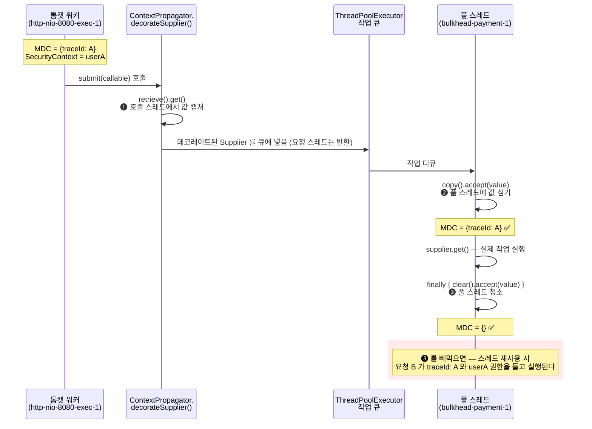

# MDC·컨텍스트 전파 — 스레드가 바뀌면 사라지는 것들

`ThreadPoolBulkhead`·`TimeLimiter`·`Retry` 는 호출 스레드가 아닌 풀 스레드에서 돕니다. 그 순간 `ThreadLocal` 에 있던 traceId·인증 정보·트랜잭션이 전부 사라지고, `ContextPropagator` 가 그 틈을 메우는 유일한 장치입니다.

## 목차
- [1. 핵심 개념 (What)](#1-핵심-개념-what)
- [2. 왜 알아야 하는가 (Why)](#2-왜-알아야-하는가-why)
- [3. 내부 구현 분석 (How)](#3-내부-구현-분석-how)
- [4. 실전 예제](#4-실전-예제)
- [5. 정리](#5-정리)

---

## 1. 핵심 개념 (What)

Resilience4j 에서 **스레드가 바뀌는 지점**은 정확히 세 군데입니다.

| 지점 | 실행 스레드 | 전파 메커니즘 |
|---|---|---|
| `ThreadPoolBulkhead.submit()` | `bulkhead-<name>-N` (`FixedThreadPoolBulkhead` 의 `ThreadPoolExecutor`) | `ThreadPoolBulkheadConfig.contextPropagator(...)` |
| `TimeLimiter`·`Retry` 애스펙트의 스케줄러 | `ContextAwareScheduledThreadPool-N` 또는 익명 풀 | `ContextAwareScheduledThreadPoolExecutor` 빈 등록 |
| `Hedge` 의 secondary 실행 | `ContextAwareScheduledThreadPool-N` | `HedgeConfig.withContextPropagators(...)` |

`io.github.resilience4j.core.ContextPropagator<T>` 는 **세 단계**를 요구합니다.

```java
public interface  ContextPropagator<T> {
    Supplier<Optional<T>> retrieve();   // 호출 스레드에서 값을 꺼낸다
    Consumer<Optional<T>> copy();       // 풀 스레드에서 값을 심는다
    Consumer<Optional<T>> clear();      // 풀 스레드에서 값을 지운다
}
```

세 단계로 쪼갠 이유가 전부입니다. `retrieve` 와 `copy`/`clear` 가 **서로 다른 스레드에서 실행**되므로 하나의 메서드로는 표현할 수 없습니다. 그리고 `clear` 는 선택이 아닙니다 — 빼면 **다른 요청의 컨텍스트가 섞입니다.**

---

## 2. 왜 알아야 하는가 (Why)

Java/Spring 5년차라면 `ThreadLocal` 기반 인프라를 이미 몸으로 알고 있습니다. 사라지는 것들의 목록입니다.

| 사라지는 것 | 저장소 | 증상 |
|---|---|---|
| SLF4J MDC (`traceId`, `userId`) | `MDC` → `ThreadLocal<Map>` | 비동기 블록 로그에 traceId 가 없다. 로그 추적이 **끊긴다** |
| Spring Security 인증 | `SecurityContextHolder` → `ThreadLocal` | `getContext().getAuthentication()` 이 `null` → `@PreAuthorize` 실패 또는 익명 처리 |
| 트랜잭션 | `TransactionSynchronizationManager` → `ThreadLocal` | `@Transactional` 미전파. 풀 스레드의 DB 작업이 **별도 트랜잭션** |
| HTTP 요청 | `RequestContextHolder` → `ThreadLocal` | `getRequestAttributes()` 가 `null` → 헤더·로케일 접근 실패 |
| Micrometer Tracing span | `ThreadLocal` | 스팬이 끊겨 분산 트레이싱 그래프가 조각난다 |

가장 자주 당하는 게 **MDC**, 가장 위험한 게 **트랜잭션** 입니다. `@Transactional` 메서드 안에서 `ThreadPoolBulkhead.submit()` 을 호출하면 풀 스레드에는 트랜잭션이 없고, 거기서 DB 를 건드리면 **별도 커넥션으로 별도 트랜잭션**이 열립니다. 바깥이 롤백돼도 안쪽은 이미 커밋돼 있습니다. 그리고 `TransactionSynchronizationManager` 를 `ContextPropagator` 로 억지로 복사하는 건 **하면 안 됩니다** — 커넥션은 한 스레드에 묶여 있고 JDBC 커넥션은 스레드 안전하지 않습니다. 트랜잭션은 전파 대상이 아니라 **경계를 다시 그려야 하는 문제**입니다.

**반대 방향의 위험이 하나 더 있습니다.** 스레드풀은 스레드를 **재사용**합니다. 요청 A 가 심어 둔 `ThreadLocal` 을 지우지 않고 끝나면, 같은 스레드를 집어든 요청 B 가 **A 의 컨텍스트를 들고 실행**됩니다. 로그에 남의 traceId 가 찍히는 건 그래도 양호합니다. `SecurityContextHolder` 가 새면 **다른 사용자 권한으로 동작**합니다. 이게 `clear()` 가 인터페이스에 들어 있는 이유입니다.

---

## 3. 내부 구현 분석 (How)

### 3.1 세 단계는 어느 스레드에서 실행되는가

`ContextPropagator.decorateSupplier(ContextPropagator, Supplier)` 가 정답을 알려줍니다.

```java
static <T> Supplier<T> decorateSupplier(ContextPropagator propagator,
                                        Supplier<T> supplier) {
    final Optional value = (Optional) propagator.retrieve().get();   // ← 지금, 여기서
    return () -> {
        try {
            propagator.copy().accept(value);                         // ← 나중에, 풀 스레드에서
            return supplier.get();
        } finally {
            propagator.clear().accept(value);                        // ← finally — 반드시
        }
    };
}
```

- `final Optional value = propagator.retrieve().get();` — **람다 바깥**, 즉 `decorateSupplier()` 를 호출한 **그 스레드에서 즉시** 실행됩니다(톰캣 워커). 값은 `final` 지역 변수에 담겨 람다에 캡처되고, 캡처된 값이 스레드 경계를 넘어갑니다. 람다 본문은 이 시점에 실행되지 않고 나중에 풀 스레드가 꺼내 실행합니다.
- `propagator.copy().accept(value)` — **풀 스레드에서** 캡처된 값을 그 스레드의 `ThreadLocal` 에 심습니다.
- `finally { propagator.clear().accept(value); }` — 작업이 성공하든 예외로 터지든 **반드시** 실행됩니다. 스레드를 다음 작업에 넘기기 전에 청소하는 것입니다.

즉 `retrieve()` 는 **호출 스레드에서 한 번**, `copy()`/`clear()` 는 **풀 스레드에서 작업당 한 번**입니다. `retrieve()` 가 무거우면 요청 스레드가, `copy()` 가 무거우면 풀 스레드가 느려집니다. 둘 다 `ThreadLocal` 읽기/쓰기 수준으로 유지하세요.

`List` 버전(`decorateSupplier(List<? extends ContextPropagator>, Supplier)`)도 구조는 같고, 값 수집만 `toMap(p -> p, p -> p.retrieve().get(), (first, second) -> second, HashMap::new)` 으로 바뀝니다. 소스 주석은 "identity map" 이라고 쓰지만 자료구조가 `HashMap` 이므로 **중복 판정은 `equals`/`hashCode` 기준**입니다. 보통의 전파기는 `equals` 를 재정의하지 않으니 사실상 인스턴스 동일성이고, 결과적으로 **같은 클래스의 서로 다른 인스턴스 두 개를 등록하면 둘 다 실행됩니다.** 전파기는 싱글턴 빈으로 하나만 등록하세요. 같은 패턴의 `decorateCallable`·`decorateRunnable` 오버로드가 함께 있고, 아무것도 하지 않는 `ContextPropagator.empty()`(`EmptyContextPropagator`)도 제공됩니다.

### 3.2 전파 시퀀스 — `clear` 를 빼먹으면 생기는 일



❸이 `finally` 에 있다는 게 설계의 핵심입니다. 다만 **`clear()` 구현을 비워 두면 라이브러리가 아무리 `finally` 로 불러줘도 소용이 없습니다** — `clear()` 를 빈 구현으로 두는 게 가장 흔한 버그입니다.

### 3.3 `ThreadPoolBulkhead` 가 전파를 끼우는 위치

`FixedThreadPoolBulkhead.submit(Callable)` 입니다.

```java
@Override
public <T> CompletableFuture<T> submit(Callable<T> callable) {
    final CompletableFuture<T> promise = new CompletableFuture<>();
    try {
        CompletableFuture.supplyAsync(ContextPropagator.decorateSupplier(config.getContextPropagator(), () -> {
            try {
                publishBulkheadEvent(() -> new BulkheadOnCallPermittedEvent(name));
                return callable.call();
            } catch (CompletionException e) { throw e;
            } catch (Exception e) { throw new CompletionException(e); }
        }), executorService).whenComplete((result, throwable) -> { /* ... */ });
    } catch (RejectedExecutionException rejected) {
        publishBulkheadEvent(() -> new BulkheadOnCallRejectedEvent(name));
        throw BulkheadFullException.createBulkheadFullException(this);
    }
    return promise;
}
```

`ContextPropagator.decorateSupplier(...)` 가 **`supplyAsync` 의 인자 위치에서** 평가됩니다. 즉 데코레이트는 `submit()` 을 호출한 스레드에서 일어나고 그 안의 `retrieve()` 도 거기서 실행됩니다 — 3.1 그대로입니다.

**반드시 알아야 할 사실: `ThreadPoolBulkhead` 는 MDC 를 자동으로 전파하지 않습니다.** `config.getContextPropagator()` 가 빈 리스트면 아무 일도 안 일어납니다. MDC 를 넘기려면 **직접 전파기를 구현해 등록**해야 합니다(4.1).

설정 경로는 `ThreadPoolBulkheadConfig.Builder` 의 두 오버로드 — `contextPropagator(Class<? extends ContextPropagator>...)` 와 `contextPropagator(ContextPropagator...)` 입니다. `build()` 에서 클래스 배열은 `ClassUtils.instantiateClassDefConstructor` 로 **기본 생성자로 인스턴스화**되고(그래서 `application.yml` 로 지정하는 전파기는 **public 기본 생성자**가 있어야 하며 Spring 빈 주입을 받을 수 없습니다), 이어서 인스턴스 배열이 `addAll` 됩니다. 소스 주석은 "setting bean of type context propagator overrides the class type" 이라고 적혀 있지만 코드는 `addAll` 을 두 번 하므로 실제로는 **둘 다 등록됩니다.** 두 방식을 섞으면 같은 전파기가 두 번 돌 수 있으니 하나만 쓰세요.

### 3.4 `ContextAwareScheduledThreadPoolExecutor` — MDC 는 내장, 그 외는 전파기

`TimeLimiter`·`Retry` 쪽은 다른 클래스를 씁니다. `ScheduledThreadPoolExecutor` 를 상속해 `schedule` 계열을 가로챕니다.

```java
@Override
public <V> ScheduledFuture<V> schedule(Callable<V> callable, long delay, TimeUnit unit) {
    Map<String, String> mdcContextMap = getMdcContextMap();              // 호출 스레드에서 스냅샷
    return super.schedule(ContextPropagator.decorateCallable(contextPropagators, () -> {
        try {
            setMDCContext(mdcContextMap);                                // 풀 스레드에 심기
            return callable.call();
        } finally {
            MDC.clear();                                                 // 풀 스레드 청소
        }
    }), delay, unit);
}

private Map<String, String> getMdcContextMap() {
    return Optional.ofNullable(MDC.getCopyOfContextMap()).orElse(Collections.emptyMap());
}

private void setMDCContext(Map<String, String> contextMap) {
    MDC.clear();                                                         // 잔여물 먼저 제거
    if (contextMap != null) { MDC.setContextMap(contextMap); }
}
```

- `getMdcContextMap()` 이 **`super.schedule()` 호출 전에, 호출 스레드에서** MDC 스냅샷을 뜹니다. `MDC.getCopyOfContextMap()` 은 `null` 일 수 있어 `Optional` 로 감싸 빈 맵으로 바꿉니다.
- 그 맵을 람다가 캡처하고 풀 스레드에서 심습니다. `setMDCContext` 가 **먼저 `MDC.clear()` 를 하고** `setContextMap` 을 하는 게 포인트 — 이전 작업의 잔여물을 먼저 치웁니다. 그리고 `finally { MDC.clear(); }` 로 3.1의 `clear()` 역할을 MDC 에 대해서만 **라이브러리가 대신** 해 줍니다.
- 이 전부를 `ContextPropagator.decorateCallable(contextPropagators, ...)` 로 한 번 더 감쌉니다. 즉 **MDC 는 내장 처리 + 사용자 전파기는 추가 처리**로 두 겹이고, 여기서는 MDC 전파기를 따로 등록할 필요가 없습니다.

**함정: `schedule`·`scheduleAtFixedRate`·`scheduleWithFixedDelay` 만 오버라이드되어 있습니다.** `execute()`·`submit()` 은 부모 구현을 그대로 쓰므로 **아무 전파도 일어나지 않습니다.** 이 풀을 일반 `ExecutorService` 로 넘겨 `submit()` 을 호출하면 전파가 조용히 사라집니다. 같은 이유로 `HedgeImpl` 도 `configuredHedgeExecutor.schedule(...)` 로 띄우는 **헤지 발사 타이머**는 전파 경로를 타지만, secondary 실행 자체는 `CompletableFuture.supplyAsync(..., configuredHedgeExecutor)` 즉 `execute()` 경로라서 `HedgeConfig.withContextPropagators(...)` 가 적용되지 않습니다.

### 3.5 Spring Boot 자동 설정 — 연결 고리

| 클래스 | 조건 | 역할 |
|---|---|---|
| `ContextAwareScheduledThreadPoolAutoConfiguration` | `@ConditionalOnProperty("resilience4j.scheduled.executor.core-pool-size")` | `ContextAwareScheduledThreadPoolExecutor` 빈 생성 |
| `ContextAwareScheduledThreadPoolProperties` | prefix `resilience4j.scheduled.executor` | `corePoolSize`, `contextPropagators`(Class 배열) |
| `Resilience4jThreadAutoConfiguration` | `@ConditionalOnProperty(prefix="resilience4j.thread", name="type")` | 생성자에서 시스템 프로퍼티 설정 |
| `ThreadMetricsAutoConfiguration` | `resilience4j.thread.metrics.enabled`(기본 on) + `MeterRegistry` 빈 | `ThreadMetrics` 빈 등록 |

**`core-pool-size` 를 설정하지 않으면 빈이 아예 만들어지지 않습니다.** 그러면 `TimeLimiterAspect`·`RetryAspect` 는 폴백 경로를 탑니다.

```java
this.timeLimiterExecutorService = contextAwareScheduledThreadPoolExecutor != null ?
    contextAwareScheduledThreadPoolExecutor :
    Executors.newScheduledThreadPool(Runtime.getRuntime().availableProcessors());
```

폴백은 평범한 `ScheduledThreadPoolExecutor` 라 **전파가 전혀 없습니다.** `@TimeLimiter` 를 붙여 놓고 traceId 가 끊긴다면 99% 이 이유입니다. `RetryAspect` 도 같은 구조입니다. 전파가 필요하면 `resilience4j.scheduled.executor.core-pool-size` 를 **반드시** 지정해야 합니다.

### 3.6 Java 21 가상 스레드 (`ThreadType`)

`ExecutorServiceFactory.getThreadType()` 의 결정 순서는 ① 시스템 프로퍼티 `resilience4j.thread.type`(`virtual`|`platform`) ② 환경 변수 `RESILIENCE4J_THREAD_TYPE` ③ 기본값 `platform` 입니다. `Resilience4jThreadAutoConfiguration` 은 `@AutoConfiguration(before = {CircuitBreaker·RateLimiter·Bulkhead·Retry·TimeLimiter AutoConfiguration})` 로 선언되고 **생성자에서** 시스템 프로퍼티를 세팅합니다.

```java
public Resilience4jThreadAutoConfiguration(ThreadTypeProperties properties) {
    // Transfer to system property only if not already specified
    if (System.getProperty("resilience4j.thread.type") == null) {
        System.setProperty("resilience4j.thread.type", properties.getType().toString());
    }
}
```

`application.yml` 의 `resilience4j.thread.type` 을 **전역 시스템 프로퍼티로 승격**시키는 어댑터이고, `before = {...}` 로 컴포넌트 자동 설정보다 먼저 돌게 해 풀 생성 시점에 값이 보이게 맞춘 것입니다. 이미 `-Dresilience4j.thread.type` 이 있으면 덮어쓰지 않습니다. `ThreadMetricsAutoConfiguration` 은 `resilience4j.thread.virtual_thread_enabled` 게이지(1.0/0.0)를 등록해 **실제로 virtual 로 떴는지**를 보여 주니 꼭 켜 두세요.

`virtual` 로 켜면 스레드 생성 방식도 바뀝니다. `NamingThreadFactory.newThread()` 는 VIRTUAL 이면 `Thread.ofVirtual().name(name, 0).unstarted(runnable)`, 아니면 `new Thread(group, runnable, name, 0)` 을 만들고 플랫폼 스레드에만 `daemon=false`·`NORM_PRIORITY` 를 강제합니다. `FixedThreadPoolBulkhead` 생성자도 같은 분기를 해서 VIRTUAL 이면 `Thread.ofVirtual().name("bulkhead-<name>-v-", 0).factory()`, 아니면 `BulkheadNamingThreadFactory(name)`(→ `NamingThreadFactory("bulkhead-<name>")`)를 씁니다. 그래서 **스레드 이름만 봐도 어느 모드인지 알 수 있습니다** — `bulkhead-payment-1` 은 플랫폼, `bulkhead-payment-v-0` 은 가상입니다. 참고로 `NamingThreadFactory` 는 `daemon=false` 로 강제하는데 `ExecutorServiceFactory.newPlatformThreadFactory()` 는 `.daemon(true)` 로 만듭니다 — 셧다운 동작이 경로에 따라 다르니 종료 지연을 디버깅할 때 기억해 두세요.

**가상 스레드와 `ContextPropagator` 의 궁합은 좋지 않습니다.** `ContextPropagator` JavaDoc 이 직접 경고합니다 — 가상 스레드 수만큼 `ThreadLocal` 복사본이 생겨 **메모리가 늘고**, `ThreadLocal` 접근 중에는 가상 스레드가 **캐리어 스레드에 핀(pinning)되어** 동시성 이득이 줄어듭니다. JDK 21+ 에서는 `ThreadLocal` 대신 Scoped Values(JEP 429)를 고려하라고도 적혀 있습니다. 가상 스레드 + 대량 `ContextPropagator` 조합은 부하 테스트로 검증한 뒤 쓰세요.

---

## 4. 실전 예제

### 4.1 MDC 전파기 — `clear` 포함 완전 구현

```java
/**
 * SLF4J MDC 를 스레드 경계 너머로 전파한다.
 * application.yml 로 클래스명을 지정해 쓸 수 있도록 public 기본 생성자를 유지한다.
 */
public class MdcContextPropagator implements ContextPropagator<Map<String, String>> {

    /** ❶ 호출 스레드에서 1회. 방어적 복사 — 원본 맵을 공유하면 두 스레드가 같은 맵을 만진다. */
    @Override
    public Supplier<Optional<Map<String, String>>> retrieve() {
        return () -> Optional.ofNullable(MDC.getCopyOfContextMap()).map(HashMap::new);
    }

    /** ❷ 풀 스레드에서 작업당 1회. 심기 전에 비워 이전 작업 잔여물을 제거한다. */
    @Override
    public Consumer<Optional<Map<String, String>>> copy() {
        return context -> {
            MDC.clear();
            context.filter(c -> !c.isEmpty())
                   .ifPresent(c -> MDC.setContextMap(Collections.unmodifiableMap(c)));
        };
    }

    /** ❸ finally 에서 호출된다. 비워 두면 스레드 오염 버그가 난다. */
    @Override
    public Consumer<Optional<Map<String, String>>> clear() {
        return context -> MDC.clear();
    }
}
```

### 4.2 SecurityContext 전파기

```java
public class SecurityContextPropagator implements ContextPropagator<SecurityContext> {

    @Override
    public Supplier<Optional<SecurityContext>> retrieve() {
        return () -> Optional.ofNullable(SecurityContextHolder.getContext())
            .filter(ctx -> ctx.getAuthentication() != null);   // 익명/미인증은 전파하지 않는다
    }

    @Override
    public Consumer<Optional<SecurityContext>> copy() {
        return ctx -> {
            SecurityContextHolder.clearContext();
            ctx.ifPresent(SecurityContextHolder::setContext);
        };
    }

    /**
     * clearContext() 를 반드시 호출한다. 빼먹으면 재사용된 스레드가 이전 요청의 인증을 들고
     * 실행되어 다른 사용자 권한으로 동작한다 — 로그 오염이 아니라 인가(authorization) 사고다.
     */
    @Override
    public Consumer<Optional<SecurityContext>> clear() {
        return ctx -> SecurityContextHolder.clearContext();
    }
}
```

### 4.3 등록 — `application.yml` + 자바 설정

```yaml
resilience4j:
  # ❗ core-pool-size 가 없으면 ContextAwareScheduledThreadPoolExecutor 빈이 생성되지 않고
  #    TimeLimiterAspect / RetryAspect 가 전파 없는 평범한 풀로 폴백한다 (3.5 참조)
  scheduled:
    executor:
      core-pool-size: 8
      context-propagators:
        - com.example.resilience.propagation.SecurityContextPropagator
        # MDC 는 ContextAwareScheduledThreadPoolExecutor 가 내장 처리 — 여기 넣지 않는다

  thread:
    type: platform          # virtual 로 바꾸기 전 3.6 의 핀(pinning) 주의사항을 읽을 것
    metrics: { enabled: true }   # resilience4j.thread.virtual_thread_enabled 게이지로 모드 확인

  thread-pool-bulkhead:
    instances:
      paymentApi:
        max-thread-pool-size: 16
        core-thread-pool-size: 8
        queue-capacity: 20
        # ThreadPoolBulkhead 는 MDC 를 자동 전파하지 않는다 — 직접 등록해야 한다 (3.3 참조)
        context-propagator:
          - com.example.resilience.propagation.MdcContextPropagator
          - com.example.resilience.propagation.SecurityContextPropagator
```

`yml` 로 지정하면 `ClassUtils.instantiateClassDefConstructor` 가 **기본 생성자**로 만들기 때문에 Spring 빈을 주입받을 수 없습니다. 의존성이 필요하면 코드로 등록하세요.

```java
@Bean
public ThreadPoolBulkheadRegistry threadPoolBulkheadRegistry(
    MdcContextPropagator mdc, SecurityContextPropagator security) {

    ThreadPoolBulkheadConfig config = ThreadPoolBulkheadConfig.custom()
        .maxThreadPoolSize(16).coreThreadPoolSize(8).queueCapacity(20)
        // 인스턴스 오버로드와 Class 오버로드를 섞으면 build() 가 둘 다 addAll 한다 (3.3 참조)
        .contextPropagator(mdc, security)
        .build();

    return ThreadPoolBulkheadRegistry.of(config);
}
```

### 4.4 before / after — 로그로 재현하고 고치기

로그 패턴에 traceId 를 넣어 둡니다. `%d{HH:mm:ss.SSS} [%thread] %-5level [%X{traceId}] %logger{20} - %msg%n`

**before — 전파기 미등록**

```
14:22:01.104 [http-nio-8080-exec-3]   INFO [a1b2c3d4] PaymentController - 조회 시작 orderId=ORD-991
14:22:01.361 [bulkhead-paymentApi-1]  WARN []         PaymentGateway    - 응답 지연 254ms  ← traceId 사라짐
14:22:01.362 [http-nio-8080-exec-3]   INFO [a1b2c3d4] PaymentController - 조회 완료
```

`[]` 가 비어 있어 **지연이 어느 요청의 것인지 추적이 불가능**합니다. 느린 요청 하나를 조사하려면 traceId 로 찾을 수밖에 없는데, 정작 느린 구간의 로그에 traceId 가 없습니다.

**after — `MdcContextPropagator` 등록**

```
14:31:44.210 [http-nio-8080-exec-3]   INFO [a1b2c3d4] PaymentController - 조회 시작 orderId=ORD-991
14:31:44.466 [bulkhead-paymentApi-1]  WARN [a1b2c3d4] PaymentGateway    - 응답 지연 253ms  ← 이어짐
14:31:44.467 [http-nio-8080-exec-3]   INFO [a1b2c3d4] PaymentController - 조회 완료
```

### 4.5 스레드 오염 버그를 잡는 테스트

`clear()` 를 빈 구현으로 두는 실수는 **단일 요청 테스트로는 절대 안 잡힙니다.** 같은 풀 스레드를 두 번 쓰게 강제해야 보입니다.

```java
class ThreadLocalLeakTest {

    /** 스레드 1개 풀로 순차 실행해, 두 번째 작업이 첫 번째의 컨텍스트를 보는지 확인한다. */
    @Test
    void 두번째_작업은_첫번째_작업의_MDC를_보지_못한다() throws Exception {
        ThreadPoolBulkhead bulkhead = ThreadPoolBulkhead.of("leakTest",
            ThreadPoolBulkheadConfig.custom()
                .coreThreadPoolSize(1)
                .maxThreadPoolSize(1)       // ← 반드시 1. 스레드 재사용을 강제한다
                .queueCapacity(10)
                .contextPropagator(new MdcContextPropagator())
                .build());

        MDC.put("traceId", "A");                                            // 요청 A
        String seenByA = bulkhead.submit(() -> MDC.get("traceId")).get();
        MDC.clear();

        String seenByB = bulkhead.submit(() -> MDC.get("traceId")).get();   // 요청 B — MDC 비움

        assertThat(seenByA).isEqualTo("A");
        assertThat(seenByB)
            .as("clear() 가 비어 있으면 B 가 A 의 traceId 를 본다 — 스레드 오염")
            .isNull();
    }
}
```

`maxThreadPoolSize(1)` 이 이 테스트의 전부입니다. 기본값(`Runtime.getRuntime().availableProcessors()`)으로 두면 매번 새 스레드가 뜰 수 있어 오염이 드러나지 않습니다. 같은 구조로 `SecurityContextPropagator` 테스트도 반드시 함께 두세요 — `UsernamePasswordAuthenticationToken` 을 세팅해 A 를 실행하고, `clearContext()` 후 B 를 실행해 `getAuthentication()` 이 `null` 임을 단정합니다. 인증 누수는 인가 사고이므로 이쪽이 더 중요합니다.

---

## 5. 정리

| 주제 | 핵심 사실 | 할 일 |
|---|---|---|
| 3단계 분리 이유 | `retrieve` 는 **호출 스레드**, `copy`/`clear` 는 **풀 스레드**. `clear()` 는 `decorateSupplier` 의 `finally` 에서 호출됨 | 세 메서드 모두 가볍게. `clear()` 를 **절대 비워 두지 말 것**(빈 구현 = 스레드 오염) |
| 스레드 오염의 급 | MDC 누수는 로그 오염, `SecurityContext` 누수는 **인가 사고** | `clearContext()` 반드시 호출 |
| `ThreadPoolBulkhead` | MDC **자동 전파 없음** | `contextPropagator(...)` 로 MDC 전파기 직접 등록 |
| `ContextAwareScheduledThreadPoolExecutor` | MDC **내장 처리** + 사용자 전파기 추가 적용 | 여기엔 MDC 전파기 중복 등록 불필요 |
| 오버라이드 범위 | `schedule` 계열만. `execute()`·`submit()` 은 **전파 없음** | 이 풀을 일반 `ExecutorService` 로 쓰지 말 것 |
| 자동 설정 조건 / 폴백 | `core-pool-size` 없으면 빈 미생성 → 애스펙트가 전파 없는 평범한 풀로 폴백. `yml` 로 지정한 전파기는 `ClassUtils.instantiateClassDefConstructor` 로 생성 | traceId 끊김의 1순위 원인 — **반드시** 지정. 전파기에 **public 기본 생성자** 필수(빈 주입 불가) |
| 중복 등록 | 주석과 달리 `build()` 가 `addAll` 두 번(둘 다 등록). `HashMap` 키 기준 중복 제거라 같은 클래스 다른 인스턴스는 둘 다 실행 | Class/인스턴스 중 한 방식만, 싱글턴 빈 하나로 |
| 트랜잭션 | `ContextPropagator` 로 전파하면 **안 됨** (커넥션은 스레드에 묶임) | 트랜잭션 경계를 풀 바깥으로 다시 그릴 것 |
| `ThreadType` | 시스템 프로퍼티 → 환경 변수 → `platform`. 스레드 이름으로 식별 가능 | `resilience4j.thread.virtual_thread_enabled` 게이지로 확인 |
| 가상 스레드 + ThreadLocal | JavaDoc 경고: 메모리 증가 + 캐리어 스레드 **핀(pinning)** | 부하 테스트로 검증 후 전환 |
| `Hedge` | 타이머는 `schedule()` 경로지만 secondary 실행은 `execute()` 경로 | `withContextPropagators` 가 secondary 에 미적용 |
| 테스트 | 오염은 **스레드 재사용 시에만** 드러남 | `maxThreadPoolSize(1)` 로 순차 실행 테스트 작성 |

한 줄로 요약하면, **전파는 `copy()` 가 아니라 `clear()` 가 어렵습니다.** 값을 옮기는 건 누구나 작성하고, 지우는 건 빼먹습니다. 그리고 빼먹은 대가는 "로그가 좀 이상하다" 가 아니라 "남의 권한으로 실행됐다" 입니다.

---

## 관련 문서
- 선행: [Kotlin 코루틴·Flow 연동 — suspend 함수를 감싸는 방법](./09-kotlin-coroutines.md)
- 선행: [Bulkhead — 자원 격리](../main/11-bulkhead.md)
- 후행: [Hedge — 느린 꼬리 지연을 두 번째 요청으로 자른다](./11-hedge.md)

---
*Resilience4j v2.4.0 기준 · 소스 커밋 7e3ab525*
