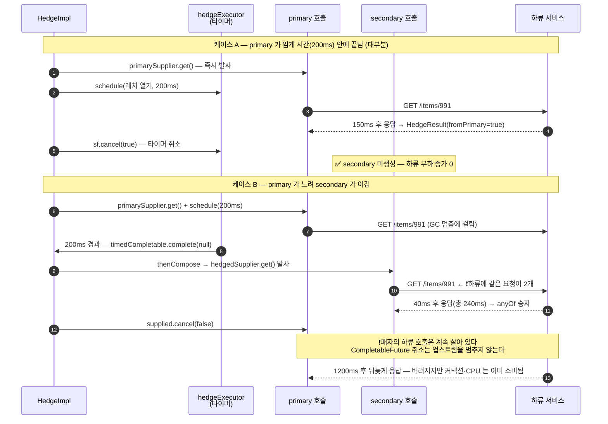

# Hedge — 느린 꼬리 지연을 두 번째 요청으로 자른다

요청이 임계 시간보다 느리면 **같은 요청을 한 번 더** 보내고 먼저 온 응답을 씁니다. p99 꼬리 지연(tail latency)을 깎는 강력한 기법이지만, 하류 부하를 최악 2배로 늘리고 비멱등 연산에 쓰면 중복 처리를 일으킵니다.

## 목차
- [1. 핵심 개념 (What)](#1-핵심-개념-what)
- [2. 왜 알아야 하는가 (Why)](#2-왜-알아야-하는가-why)
- [3. 내부 구현 분석 (How)](#3-내부-구현-분석-how)
- [4. 실전 예제](#4-실전-예제)
- [5. 정리](#5-정리)

---

## 1. 핵심 개념 (What)

### 1.1 먼저 — 이 모듈의 성숙도

다른 문서를 읽기 전에 이것부터 알아야 합니다. `resilience4j-hedge` 는 **사실상 미완성·미공개 모듈**입니다. 소스에서 확인한 근거입니다.

| 확인 항목 | 결과 |
|---|---|
| 레포 전체에서 `hedge` 를 언급하는 파일(모듈 자신 제외) | **`settings.gradle` 단 하나** |
| `README.adoc` / `RELEASENOTES.adoc` 언급 | **없음** |
| `resilience4j-all` 집합 모듈 포함 | **없음** (bulkhead·cache·circuitbreaker·micrometer·ratelimiter·retry·timelimiter 만) |
| `@Hedge` 애너테이션 / Spring 자동 설정·애스펙트 | **없음** (`resilience4j-annotations` 에는 6개뿐 — CircuitBreaker·RateLimiter·Retry·Timer·TimeLimiter·Bulkhead) |
| Micrometer `TaggedHedgeMetrics` | **없음** (`micrometer/tagged` 에 Hedge 용 클래스 부재) |
| 모듈 의존성 | `api(project(":resilience4j-core"))` 하나뿐 |
| 저작권 | `Copyright 2021: Matthew Sandoz` — 4년 넘게 정체 |

`build.gradle` 이나 JavaDoc 에 `@Experimental`·incubating 같은 **명시적 표시는 없습니다.** 하지만 문서화·배포 집합·프레임워크 통합·지표 통합이 **전부 빠져 있다**는 사실 자체가 더 강한 신호이고, 3.6에서 버그 수준의 날카로운 모서리 세 개를 소스로 확인합니다.

> **프로덕션 도입 판단 기준**: ⑴ Maven Central 에 이 artifact 가 실제로 올라가 있는지 직접 확인할 것 ⑵ 지표·설정 통합을 **전부 직접 작성**할 각오가 있는지 ⑶ 꼬리 지연 때문에 실제로 돈이나 사용자를 잃고 있는지 숫자로 증명됐는지. 셋 중 하나라도 아니면 **쓰지 마세요.** 대안은 많습니다 — 하류 자체를 빠르게 하거나, 캐시를 두거나, TimeLimiter + 폴백으로 끊는 쪽이 거의 항상 먼저입니다.

### 1.2 아이디어

Google 의 **"The Tail at Scale"**(Dean & Barroso, 2013)에서 온 개념입니다. 핵심 관찰은 이렇습니다.

> 분산 시스템에서 p99 지연은 "하류가 느리다" 가 아니라 **"운이 나빴다"** 인 경우가 많다. GC 멈춤, 한 노드의 디스크 지연, 커넥션 재협상, 리더 재선출 — 전부 **그 요청 하나**에만 생긴 일이다.

운이 나빴을 뿐이라면 해법은 간단합니다. **주사위를 한 번 더 굴립니다.** 임계 시간이 지나도 응답이 없으면 같은 요청을 한 번 더 보내고 먼저 온 쪽을 씁니다. 한 번의 호출이 느릴 확률이 1%면 두 번 모두 느릴 확률은 (독립이라면) 0.01% 입니다. **Retry 와의 차이가 결정적입니다.**

| | Retry | Hedge |
|---|---|---|
| 발동 조건 | 요청이 **실패한 뒤** | 요청이 **느릴 때** (아직 살아 있음) |
| 시간 관계 | 순차 (실패 확인 → 재시도) | **동시** (primary 와 secondary 가 함께 떠 있음) |
| 겨냥하는 것 | 일시적 오류(transient error) | 꼬리 지연(tail latency) |
| 하류 부하 | 실패율만큼 증가 | **느린 비율만큼 증가, 최악 2배** |
| 지연 개선 | 없음 (오히려 증가) | p99 감소 |

---

## 2. 왜 알아야 하는가 (Why)

### 2.1 꼬리 지연은 합성된다

마이크로서비스에서 하나의 요청이 하류 10개를 **순차로** 부르면 전체 지연은 10개의 합입니다. 각각이 p99 에서 1초라면 10개 중 하나라도 p99 에 걸릴 확률은 `1 - 0.99^10 ≈ 9.6%` — **개별 서비스는 99% 가 빠른데 전체 요청의 10%가 느립니다.** 이게 "꼬리 지연이 합성된다" 는 말의 뜻이고, 규모가 커질수록 p99 가 사실상 평균이 되는 이유입니다. Hedge 는 이 곱셈을 끊습니다.

### 2.2 그런데 왜 거의 안 쓰는가

세 가지 이유 때문이고, 전부 치명적일 수 있습니다.

**① 비멱등 연산에 쓰면 중복 처리.** 결제 승인 API 에 헤지를 걸면 primary 와 secondary 가 **둘 다 하류에 도달**합니다. 먼저 온 응답만 쓰지만 나중 요청은 취소되지 않습니다(3.5에서 소스로 확인). 결제가 두 번 됩니다. "느린 응답만 헤지하니까 괜찮다" 는 틀렸습니다 — 느린 이유가 하류의 처리 지연이면 **이미 처리 중인 요청에 똑같은 요청을 하나 더 보내는 것**입니다.

**② 부하가 높을 때 장애를 가속시킨다.** 가장 위험한 지점입니다. 하류가 부하로 느려지면 → 느린 비율 상승 → 헤지 비율 상승 → 하류 부하 상승 → 더 느려짐. **양의 피드백 루프(positive feedback loop)** 이고, CircuitBreaker 가 과부하에서 **부하를 줄이는** 것과 정반대입니다. 장애 상황에서 Hedge 는 소화기가 아니라 가솔린입니다.

**③ 득실 검증이 어렵다.** "p99 를 몇 ms 줄였고 하류 부하를 몇 % 늘렸는가" 를 숫자로 답할 수 없으면 도입할 이유가 없습니다. 그런데 3.7에서 보듯 이 모듈의 지표만으로는 **"헤지를 몇 번 쐈는가" 를 알 수조차 없습니다.** 그래서 Hedge 는 **읽기 전용·멱등·하류에 여유 용량이 있는** 조회 경로에만 쓸 수 있습니다.

---

## 3. 내부 구현 분석 (How)

### 3.1 공개 API

```java
public interface Hedge {
    static Hedge ofDefaults();                 // + ofDefaults(name), of(config), of(name, config, tags)
    static Hedge of(Duration hedgeDuration);   // preconfiguredDuration 바로가기

    <T> CompletableFuture<T> submit(Callable<T> callable, ExecutorService executorService);
    <T, F extends CompletionStage<T>> Supplier<CompletionStage<T>> decorateCompletionStage(Supplier<F> supplier);

    HedgeConfig getHedgeConfig();   HedgeDurationSupplier getDurationSupplier();   Duration getDuration();
    Metrics getMetrics();           EventPublisher getEventPublisher();
}
```

**동기 API 가 없습니다** — 두 호출을 동시에 띄우는 것이 본질이므로 블로킹 모델로는 표현할 수 없습니다. `Hedge.java` 의 클래스 주석이 적용 범위를 직접 못 박아 뒀습니다.

> Good candidates for Hedged calls include side-effect-free calls, calls which may have a long response time tail. Do not hedge non-idempotent inserts or other similar calls.

`HedgeRegistry` 는 `HedgeRegistry.builder()` → `InMemoryHedgeRegistry.Builder` 로 만들고 `hedge(name)`, `hedge(name, config)`, `hedge(name, configName)` 등 다른 컴포넌트와 같은 모양을 제공합니다.

### 3.2 임계 시간을 정하는 두 방식

`HedgeConfig.HedgeDurationSupplierType` 은 `PRECONFIGURED` 와 `AVERAGE_PLUS` 두 값이고, `HedgeDurationSupplier.fromConfig(config)` 가 분기합니다.

```java
static HedgeDurationSupplier fromConfig(HedgeConfig config) {
    if (config.getDurationSupplier() == HedgeConfig.HedgeDurationSupplierType.PRECONFIGURED) {
        return ofPreconfigured(config.getCutoff());
    } else {
        return ofAveragePlus(config.isShouldUseFactorAsPercentage(), config.getHedgeTimeFactor(),
            config.isShouldMeasureErrors(), config.getWindowSize());
    }
}
```

**`PreconfiguredDurationSupplier`** 는 고정값입니다 — `get()` 이 생성 시 받은 `cutoff` 를 그대로 돌려주고, `accept(type, duration)` 은 `//do nothing here - we ignore events in this case.` 로 비어 있습니다.

**`AverageDurationSupplier`** 는 관측된 평균에 적응합니다.

```java
@Override
public Duration get() {
    final Duration result;
    if (factor == 0) {
        result = getAverageResponseTime();
    } else if (shouldUseFactorAsPercentage) {
        result = getAverageResponseTime().multipliedBy(factor).dividedBy(100);   // ← 곱셈
    } else {
        result = getAverageResponseTime().plus(Duration.ofMillis(factor));       // ← 덧셈(ms)
    }
    return result;
}
// getAverageResponseTime() = metrics.getSnapshot().getAverageDuration()
//                            (metrics = FixedSizeSlidingWindowMetrics(windowSize))
```

줄 단위로 읽을 것이 많습니다.

- **"AveragePlus" 인데 percentage 모드는 덧셈이 아니라 곱셈입니다.** `multipliedBy(factor).dividedBy(100)` 이므로 `averagePlusPercentageDuration(150, ...)` 은 "평균 + 150%" 가 아니라 **평균의 150%**(= 평균 × 1.5)입니다. 메서드 이름이 오해를 부릅니다. `100` 을 주면 평균과 같아지고, `100` 미만을 주면 평균보다 **짧아집니다**(= 헤지 폭증).
- amount 모드는 진짜 덧셈이고 단위는 **밀리초**입니다. 그리고 `accept(type, duration)` 은 `switch` 로 `PRIMARY_SUCCESS` 와 (`shouldMeasureErrors` 일 때) `PRIMARY_FAILURE` 만 `metrics.record(...)` 하고 `SECONDARY_*` 는 `default: break` 로 버립니다. 즉 **`PRIMARY_*` 만 평균에 반영**되는데, 평균이 secondary 결과로 오염되면 임계 시간이 스스로 흔들리는 피드백 루프가 생기니 올바른 선택입니다. `shouldMeasureErrors`(기본 `true`)를 `false` 로 주면 실패한 primary 의 소요 시간이 평균에서 빠집니다.
- 창(window)은 **건수 기반만** 지원합니다(JavaDoc: `only supports fixed size window, not time-based`). 트래픽이 적은 서비스에서는 평균이 **오래된 데이터**로 계산됩니다. 또 `averagePlusPercentageDuration(percentage, shouldMeasureErrors)` 는 `windowSize` 를 받지 않아 기본값 **100** 으로 남으므로, 창 크기를 조절하려면 `averagePlusAmountDuration(amount, shouldMeasureErrors, windowSize)` 를 써야 합니다.

### 3.3 `HedgeConfig` 설정 항목 전체

| 필드 | 기본값 | 빌더 메서드 | 의미 |
|---|---|---|---|
| `durationSupplierType` | `PRECONFIGURED` | `preconfiguredDuration` / `averagePlus*Duration` | 임계 시간 결정 방식 |
| `cutoff` | **`null`** | `preconfiguredDuration(Duration)` | 고정 임계 시간 |
| `shouldUseFactorAsPercentage` | `false` | `averagePlusPercentageDuration` 이 `true` 로 설정 | factor 해석 방식 |
| `hedgeTimeFactor` | `0` | `averagePlus*Duration` 의 첫 인자 | 퍼센트 또는 밀리초 |
| `shouldMeasureErrors` | `true` | `averagePlus*Duration` 의 두 번째 인자 | 실패를 평균에 포함할지 |
| `windowSize` | `100` | `averagePlusAmountDuration` 의 세 번째 인자 | 건수 기반 창 크기 |
| `concurrentHedges` | `10` | `withMaxConcurrency(int)` | 헤지 실행 풀의 `corePoolSize` |
| `contextPropagators` | 빈 배열 | `withContextPropagators(...)` | 컨텍스트 전파 |

### 3.4 실행 흐름 — `HedgeImpl.decorateCaller()`

이 모듈의 전부가 이 메서드입니다.

```java
private <T, F extends CompletionStage<T>> Supplier<CompletionStage<T>> decorateCaller(
        Supplier<F> primarySupplier, Supplier<F> hedgedSupplier) {
    return () -> {
        long start = System.nanoTime();
        CompletableFuture<HedgeResult<T>> supplied = primarySupplier.get().toCompletableFuture()
            .handle((t, throwable) -> HedgeResult.of(t, true, Optional.ofNullable(throwable)));
        CompletableFuture<T> timedCompletable = new CompletableFuture<>();
        CompletableFuture<HedgeResult<T>> hedged = timedCompletable
            .thenCompose(t -> hedgedSupplier.get())
            .handle((t, throwable) -> HedgeResult.of(t, false, Optional.ofNullable(throwable)));
        ScheduledFuture<Boolean> sf = configuredHedgeExecutor.schedule(
            () -> timedCompletable.complete(null), durationSupplier.get().toNanos(), TimeUnit.NANOSECONDS);
        return CompletableFuture.anyOf(hedged, supplied).thenApply(s -> {
            HedgeResult<T> t = (HedgeResult<T>) s;
            long duration = System.nanoTime() - start;
            if (t.fromPrimary) {
                sf.cancel(true);
                hedged.cancel(false);
                if (t.throwable.isPresent()) {
                    onPrimaryFailure(Duration.ofNanos(duration), t.throwable.get());
                    throw (RuntimeException) t.throwable.get();
                } else { onPrimarySuccess(Duration.ofNanos(duration)); }
            } else { supplied.cancel(false); /* secondary 도 동일 구조 */ }
            return t.value;
        });
    };
}
```

- `primarySupplier.get()` — primary 를 **즉시** 띄우고 `.handle(...)` 로 성공·실패를 모두 `HedgeResult.of(t, true, ...)` 로 정규화합니다. `fromPrimary = true` 가 "이건 primary 결과" 라는 꼬리표입니다. `handle` 을 쓴 이유는 **실패도 `anyOf` 경쟁에 참가시키기** 위해서입니다 — `exceptionally` 라면 실패가 즉시 전파돼 경쟁이 성립하지 않습니다.
- `timedCompletable` 는 **발사 신호용 빈 래치**입니다. 아무 값도 담지 않고(`complete(null)`) `thenCompose(t -> hedgedSupplier.get())` 가 그 완료에 매달려 있어, **래치가 열릴 때까지 secondary 는 생성조차 되지 않습니다.** 래치를 여는 `schedule(...)` 이 `durationSupplier.get()` 을 **요청마다 호출**하므로 `AVERAGE_PLUS` 모드에서는 임계 시간이 요청마다 다릅니다.
- `CompletableFuture.anyOf(hedged, supplied)` 로 먼저 끝난 쪽을 채택하고 `t.fromPrimary` 로 분기합니다. primary 가 이기면 `sf.cancel(true)` 로 **아직 안 터진 타이머를 취소** — 이게 이 구현에서 가장 의미 있는 취소입니다. 임계 시간 전에 primary 가 끝나면 **secondary 는 아예 발사되지 않습니다.** 반대로 `hedged.cancel(false)` / `supplied.cancel(false)` 는 **패자 "취소"** 인데, 3.5에서 보듯 이름이 주는 기대와 실제가 다릅니다.
- `throw (RuntimeException) t.throwable.get();` — **무검사 캐스팅**입니다. `submit()` 경로는 `callableFuture` 가 예외를 `RuntimeException` 으로 감싸고 `supplyAsync` 가 `CompletionException` 으로 감싸므로 안전하지만, `decorateCompletionStage` 에 넘긴 `CompletionStage` 가 `Error` 나 검사 예외로 완료되면 여기서 **`ClassCastException`** 이 터져 원래 실패 원인을 잃습니다.

실행기(executor) 배치도 두 API 가 다릅니다.

```java
// submit(): primary 는 호출자의 실행기, secondary 는 configuredHedgeExecutor
return decorateCaller(() -> callableFuture(callable, primaryExecutor),
                      () -> callableFuture(callable, configuredHedgeExecutor)).get()...;

// decorateCompletionStage(): primary 와 secondary 가 같은 supplier
return decorateCaller(supplier, supplier);
```

`submit()` 은 primary 를 호출자가 준 실행기에, secondary 를 `configuredHedgeExecutor` 에 보냅니다. 반면 `decorateCompletionStage()` 는 **primary 와 secondary 에 같은 supplier** 를 쓰고 `configuredHedgeExecutor` 는 **타이머에만** 쓰입니다. 즉 `concurrentHedges`(`withMaxConcurrency`)로 헤지 동시 실행 수를 제한하려는 의도는 `decorateCompletionStage` 경로에서 **작동하지 않습니다.**

### 3.5 타임라인



**케이스 B 의 마지막 두 줄이 이 문서에서 가장 중요합니다.** `supplied.cancel(false)` 가 취소하는 것은 `primarySupplier.get().toCompletableFuture().handle(...)` 로 만들어진 **`CompletableFuture` 단계**이고, 그 뒤에서 돌고 있는 HTTP 호출이 아닙니다. `CompletableFuture.cancel()` 은 업스트림 작업에 전파되지 않습니다 — "결과를 더 이상 안 받겠다" 는 선언일 뿐입니다.

운영상 결론입니다.

- **하류 부하는 실제로 두 배가 되고, 비멱등 연산은 두 번 실행됩니다.** 패자를 취소해도 하류의 일은 끝까지 수행됩니다.
- 커넥션 풀 점유도 두 배입니다. 풀 크기를 늘리지 않으면 헤지가 **스스로 병목**을 만듭니다. 하류에 전파되는 실제 취소를 원하면 HTTP 클라이언트 레벨에서 끊어야 합니다(Reactor `Mono.timeout`, 코루틴 취소 등).

### 3.6 날카로운 모서리 세 개

**① `Hedge.ofDefaults()` 는 첫 호출에서 `NullPointerException`.**

`HedgeConfig.Builder` 의 기본값은 `hedgeDurationSupplierType = PRECONFIGURED` 인데 `cutoff` 는 초기화되지 않아 **`null`** 입니다. `HedgeConfigTest` 가 기대하는 `toString()` 문자열이 `...windowSize=100, cutoff=null}` 로 이를 증명합니다. 그래서 `Hedge.ofDefaults()` 는 객체 생성은 성공하지만 첫 호출에서 `durationSupplier.get().toNanos()` 가 `null.toNanos()` 가 되어 터집니다. **기본 설정이 사용 불가**라는 뜻이고, 그 자체로 모듈의 성숙도를 말해 줍니다. 반드시 `preconfiguredDuration(...)` 또는 `averagePlus*Duration(...)` 을 명시하세요.

**② `AVERAGE_PLUS` 는 콜드 스타트에 모든 요청을 헤지합니다.**

`FixedSizeSlidingWindowMetrics` 가 비어 있으면 `SnapshotImpl.getAverageDuration()` 이 `totalNumberOfCalls == 0` 분기를 타 **`Duration.ZERO`** 를 반환합니다. 임계 시간 0 → 타이머 즉시 발사 → **첫 요청부터 전부 헤지**. 배포 직후나 트래픽 급증 시점에 하류 부하가 **정확히 2배**로 뜁니다. 게다가 `Duration.ofMillis(totalDurationInMillis / totalNumberOfCalls)` 로 **밀리초 정수 나눗셈**이라 평균이 1ms 미만인 빠른 하류에서는 계속 `0ms` 로 계산되어 **영구히 전량 헤지**합니다. amount 모드로 하한(예: `averagePlusAmountDuration(50, true, 200)`)을 반드시 두세요.

**③ `Hedge` 인스턴스는 스레드풀을 누수합니다.**

`HedgeImpl` 생성자가 인스턴스마다 `ContextAwareScheduledThreadPoolExecutor` 를 만듭니다.

```java
this.configuredHedgeExecutor = ContextAwareScheduledThreadPoolExecutor
    .newScheduledThreadPool()
    .corePoolSize(hedgeConfig.getConcurrentHedges())
    .contextPropagators(hedgeConfig.getContextPropagators())
    .build();
```

그런데 `Hedge` 인터페이스에도 `HedgeImpl` 에도 **`shutdown()`·`close()` 가 없습니다.** `Hedge` 를 동적으로 만들면(테넌트별·요청별) 스레드풀이 쌓이니 반드시 **레지스트리로 이름당 하나씩만** 만들어 재사용하세요. 그리고 기본 `concurrentHedges = 10` 은 이 풀의 `corePoolSize` 이고 `submit()` 경로에서는 풀이 **타이머와 secondary 실행을 함께** 처리합니다. 10개 스레드가 secondary 로 꽉 차면 **타이머가 큐에서 대기**해 임계 시간이 늦게 발사됩니다. 헤지 비율이 높은 경로는 `withMaxConcurrency` 를 올리세요.

### 3.7 이벤트와 지표 — 득실을 어떻게 재는가

`HedgeEvent.Type` 은 4개이고, 승자에 대해 하나씩 발행됩니다.

| 이벤트 타입 | 이벤트 클래스 | 뜻 |
|---|---|---|
| `PRIMARY_SUCCESS` | `HedgeOnPrimarySuccessEvent` | primary 가 이기고 성공 — **헤지가 필요 없었던 정상 요청** |
| `PRIMARY_FAILURE` | `HedgeOnPrimaryFailureEvent` | primary 가 먼저 **실패**로 끝남 |
| `SECONDARY_SUCCESS` | `HedgeOnSecondarySuccessEvent` | secondary 가 이기고 성공 — **헤지가 실제로 구해 준 요청** |
| `SECONDARY_FAILURE` | `HedgeOnSecondaryFailureEvent` | secondary 가 먼저 실패로 끝남 |

`Hedge.Metrics` 는 네 개의 `AtomicLong` 카운터(`getPrimarySuccessCount` 등)와 `getCurrentHedgeDelay()`(현재 임계 시간), `getSecondaryPoolActiveCount()`(`configuredHedgeExecutor.getActiveCount()`)를 노출합니다. **가장 중요한 비율은 secondary 승률** — `(secondarySuccess + secondaryFailure) / 전체 호출` 입니다.

| secondary 승률 | 해석 | 조치 |
|---|---|---|
| ~0% | 헤지가 거의 안 쐈거나 쏴도 항상 늦음 | 헤지를 **제거**. 임계 시간이 너무 길거나 꼬리가 없는 하류 |
| 1~5% | 이상적 구간 | 유지. 하류 부하 증가도 작다 |
| 10% 이상 | 임계 시간이 너무 짧거나 하류가 전반적으로 느림 | 임계 시간 상향. 하류 부하 2배 위험 |
| 급상승 중 | **과부하 피드백 루프 진입 신호** | 즉시 헤지 비활성화 |

**그런데 측정에 큰 구멍이 있습니다.** 이벤트는 **승자에 대해서만** 발행됩니다. primary 가 이기면 secondary 는 이벤트를 남기지 않고, 임계 시간 전에 끝나면 secondary 는 **생성조차 되지 않습니다.** 그래서 이 지표들로는 **"헤지를 몇 번 쐈는가" 를 알 수 없습니다** — secondary 승률은 "쏜 것 중 이긴 비율" 이 아니라 "전체 호출 중 secondary 가 이긴 비율" 입니다. 하류 부하가 실제로 몇 % 늘었는지 알려면 **supplier 안에 직접 발사 카운터를 심어야 하고**(4.1), Micrometer 통합이 없으므로 `MeterRegistry` 연결도 직접 해야 합니다.

---

## 4. 실전 예제

### 4.1 읽기 전용 조회 API 에 적용

상품 상세 조회입니다. 멱등하고, 부작용이 없고, 하류에 여유 용량이 있습니다.

```java
@Bean
public Hedge itemDetailHedge() {
    // 임계 시간은 관측된 p95 에서 역산한다. 평시 p50=40ms, p95=180ms, p99=1.4s 라면
    // 220ms 로 잡아 전체의 약 5% 만 헤지한다 — 3.7 의 이상 구간(1~5%) 을 겨냥.
    // AVERAGE_PLUS 를 쓰지 않는 이유: 콜드 스타트에 평균이 ZERO 가 되어 전량 헤지한다 (3.6-②).
    HedgeConfig config = HedgeConfig.custom()
        .preconfiguredDuration(Duration.ofMillis(220))
        .withMaxConcurrency(32)                  // 타이머까지 공유하는 풀이므로 넉넉하게 (3.6-③)
        .withContextPropagators(new MdcContextPropagator())
        .build();

    // 반드시 레지스트리로 이름당 하나만. shutdown() 이 없어 인스턴스마다 풀이 누수된다 (3.6-③)
    return HedgeRegistry.builder().build().hedge("itemDetail", config);
}
```

```java
@Service
public class ItemDetailService {

    private final Hedge hedge;
    private final WebClient webClient;
    private final Counter hedgeFired;      // ❗3.7 의 측정 구멍을 직접 메운다

    public ItemDetailService(Hedge hedge, WebClient webClient, MeterRegistry registry) {
        this.hedge = hedge;
        this.webClient = webClient;
        this.hedgeFired = Counter.builder("hedge.secondary.fired").tag("name", hedge.getName())
            .description("secondary 가 실제로 하류에 발사된 횟수 (승패 무관)").register(registry);
        registerGauges(hedge, registry);   // Micrometer 통합이 없어 직접 연결한다
    }

    public CompletableFuture<ItemDetail> find(String itemId) {
        AtomicBoolean primaryStarted = new AtomicBoolean(false);

        Supplier<CompletionStage<ItemDetail>> call = () -> {
            // 첫 호출은 primary, 두 번째부터가 secondary — 발사 횟수를 여기서 센다
            if (!primaryStarted.compareAndSet(false, true)) {
                hedgeFired.increment();
            }
            return webClient.get().uri("/items/{id}", itemId)
                .retrieve().bodyToMono(ItemDetail.class)
                .timeout(Duration.ofSeconds(2))   // ❗패자 취소는 하류에 전파되지 않는다 (3.5).
                .toFuture();                      //   하류를 실제로 끊는 건 이 타임아웃뿐이다
        };

        return hedge.decorateCompletionStage(call).get().toCompletableFuture();
    }
}
```

`registerGauges()` 는 `hedge.getMetrics()` 의 네 카운터(`getPrimarySuccessCount` 등)와 `getCurrentHedgeDelay().toMillis()`, `getSecondaryPoolActiveCount()` 를 각각 `Gauge.builder(...).tags("name", hedge.getName()).register(registry)` 로 묶는 단순 반복문입니다. 카운터가 단조 증가하므로 `Gauge` 로 노출하고 PromQL 에서 `increase()` 로 미분하는 게 맞습니다. 그리고 `hedge.getEventPublisher().onSecondarySuccess(...)` 로 "헤지가 구해 준 호출" 을 로그로도 남겨 두면 사후 분석이 쉬워집니다.

### 4.2 사고 시나리오 — 멱등성 없는 API 에 적용했을 때

실제로 이렇게 번집니다.

```
T+0       쿠폰 발급 API(POST /coupons/issue) 의 p99 가 3초라는 지적. "조회 API 에서 효과
          봤으니 여기도" — 임계 시간 500ms 로 Hedge 적용. 리뷰 통과.
T+1일     평시엔 primary 가 500ms 안에 끝나 secondary 가 거의 안 뜬다. 승률 0.8%.
          "효과 미미하지만 해는 없다" 고 판단.
T+4일     쿠폰 이벤트 오픈. 하류 DB 쓰기 지연 800ms 로 상승
          → 거의 모든 요청이 500ms 초과 → 헤지 비율 ~90%
          → 쿠폰 서비스 유입 TPS 거의 2배 → 쓰기 지연 1.6s
          → 헤지 비율 100% → 피드백 루프 (2.2-②)
T+4일+3분  쿠폰이 1인당 2장씩 발급. 패자 취소가 하류에 전파되지 않아 primary·secondary
          양쪽 INSERT 가 모두 커밋된다 (3.5). 멱등 키가 없어 DB 제약도 안 걸린다.
T+4일+18분 CS 유입. 롤백 배포. 중복 발급 42,000건. 이미 사용된 쿠폰은 회수 불가 → 직접 손실.
```

문제 지점 네 개입니다. ⑴ **비멱등 쓰기 API 에 헤지**(`Hedge.java` 주석이 명시적으로 금지) ⑵ **멱등 키 없음**(있었다면 중복이 DB 에서 막혔습니다) ⑶ **헤지 비율 상한 없음**(모듈에 그 기능이 없어 애플리케이션이 직접 구현해야 합니다) ⑷ **평시 지표로 검증** — 헤지의 위험은 **부하 상승 구간**에서만 발현됩니다.

> **도입 전 체크리스트** (하나라도 ✗ 면 도입 금지)
> - [ ] 대상 연산이 **읽기 전용 또는 멱등**인가? 쓰기면 **멱등 키**가 DB 제약으로 강제되는가?
> - [ ] 하류에 **최소 2배의 여유 용량**과 2배 동시 호출을 감당할 커넥션 풀이 있는가? (헤지 비율이 100% 까지 갈 수 있다고 가정)
> - [ ] **헤지 비율 상한**이 구현돼 있는가? (예: `RateLimiter` 로 secondary 발사 제한) 승률 급상승 시 **즉시 끌 스위치**가 있는가?
> - [ ] 꼬리 지연이 **실제 손실로 이어진다는 숫자**가 있는가? 없으면 최적화할 이유가 없다
> - [ ] `preconfiguredDuration` 을 명시했는가? (`ofDefaults()` 는 NPE, 3.6-①)
> - [ ] **부하 상승 구간에서** 득실을 측정했는가? 평시 측정은 의미 없다

### 4.3 득실을 PromQL 로 판정

4.1에서 등록한 지표 기준입니다.

```promql
# ❶ secondary 승률 — 3.7 의 해석표로 판정한다. 1~5% 가 이상 구간
#    분모(전체 호출)는 기록 규칙 hedge:calls:increase5m 으로 미리 묶어 두면 쿼리가 짧아진다
(increase(hedge_secondary_success{name="itemDetail"}[5m])
 + increase(hedge_secondary_failure{name="itemDetail"}[5m]))
/ clamp_min(hedge:calls:increase5m{name="itemDetail"}, 1)

# ❷ 실제 하류 부하 증가율 — 직접 센 카운터를 쓴다 (3.7). 0.05 = 하류 호출 5% 증가
rate(hedge_secondary_fired_total{name="itemDetail"}[5m])
/ clamp_min(rate(http_client_requests_seconds_count{uri="/items/{id}"}[5m]), 1)

# ❸ 헤지가 실제로 p99 를 깎았는가 — 1일 전과 비교한다. 음수여야 득이다
histogram_quantile(0.99, sum by (le) (rate(item_detail_latency_seconds_bucket[5m])))
- histogram_quantile(0.99, sum by (le) (rate(item_detail_latency_seconds_bucket[5m] offset 1d)))

# ❹ 피드백 루프 진입 알럿 — ❶ > 0.15, for: 2m. 루프는 분 단위로 진행된다 (2.2-②)
# ❺ 헤지 풀 포화 — 타이머가 큐에서 밀려 임계 시간이 늦게 발사된다 (3.6-③)
hedge_pool_active{name="itemDetail"} / 32 > 0.8
```

판정 규칙은 단순합니다. **❶이 1~5% 안이고 ❸이 유의미한 음수**면 득, 그 밖이면 실입니다. ❸이 0 에 가까운데 ❷가 양수라면 **하류 부하만 늘리고 효과가 없는 상태**이므로 제거하세요.

---

## 5. 정리

| 주제 | 핵심 사실 | 실무 결론 |
|---|---|---|
| 모듈 성숙도 | 레포 전체에서 `settings.gradle` 만 언급. README·릴리스노트·`resilience4j-all`·애너테이션·Spring·Micrometer **전부 없음** | 주변 통합을 **전부 직접** 작성할 각오 필요 |
| Retry 와의 차이 | Retry 는 **실패 후 순차**, Hedge 는 **느릴 때 동시** | 대체 관계가 아니라 겨냥 대상이 다름 |
| API | `submit(Callable, ExecutorService)` / `decorateCompletionStage(Supplier)` — **동기 API 없음** | 비동기 스택에서만 사용 가능 |
| 임계 시간 | `PRECONFIGURED`(고정) vs `AVERAGE_PLUS`(평균 적응). percentage 모드는 이름과 달리 **곱셈**(`average × factor / 100`) | 프로덕션은 **고정값 권장**. `averagePlusPercentageDuration(150)` = 평균의 1.5배 |
| 평균 계산 | `FixedSizeSlidingWindowMetrics`(건수 기반만), **밀리초 정수 나눗셈**, `PRIMARY_*` 만 반영 | 저트래픽 서비스는 평균이 낡는다 |
| 발사·판정 | `timedCompletable` 래치 + `thenCompose`(임계 시간 전에 끝나면 secondary **미생성**), `HedgeResult.fromPrimary` + `anyOf` 로 승자 판정 | 평시 부하 증가는 0. `handle` 로 실패도 경쟁에 참가시킴 |
| **패자 취소** | `cancel(false)` 는 `CompletableFuture` 단계만 취소 — **하류 호출은 계속 실행**. 승자 예외는 `(RuntimeException)` 무검사 캐스팅 | 부하는 진짜 2배, 비멱등 연산은 진짜 두 번 실행. `Error` 완료 시 `ClassCastException` |
| `ofDefaults()` | `cutoff == null` → 첫 호출에서 **NPE** | `preconfiguredDuration` 또는 `averagePlus*` 를 **반드시** 명시 |
| `AVERAGE_PLUS` 콜드 스타트 | 빈 창 → 평균 `ZERO` → 임계 0 → **전량 헤지** | amount 모드로 하한 확보, 또는 고정값 사용 |
| 스레드풀 | 인스턴스마다 생성, `shutdown()`/`close()` **없음**. 기본 `concurrentHedges=10` 풀이 타이머와 secondary 실행을 **공유** | 레지스트리로 이름당 하나만. 포화 시 `withMaxConcurrency` 상향 |
| 이벤트 4종 / 판정 | **승자에 대해서만** 발행되므로 "몇 번 쐈는가" 는 알 수 없음. 득 판정은 승률 1~5% + p99 유의미 감소 | 발사 카운터 직접 심기. 승률 15% 초과는 **피드백 루프** 신호 → 즉시 중단 |
| 가장 큰 위험 | 과부하 시 **양의 피드백 루프** — 헤지가 장애를 가속 | 평시가 아니라 **부하 상승 구간**에서 검증 |

한 줄로 정리하면, **Hedge 는 여유가 있을 때만 쓸 수 있는 사치재**입니다. 하류에 여유가 있고 연산이 멱등이고 꼬리 지연이 실제 손실로 이어질 때, p99 를 깎는 가장 직접적인 수단입니다. 그 조건이 깨지는 순간 — 특히 하류가 과부하에 빠지는 순간 — 같은 메커니즘이 장애를 가속시킵니다. CircuitBreaker 가 과부하에서 **부하를 줄이는** 반면 Hedge 는 **늘립니다.** 그 비대칭을 이해하지 못한 채 쓰면 안 됩니다.

---

## 관련 문서
- 선행: [MDC·컨텍스트 전파 — 스레드가 바뀌면 사라지는 것들](./10-context-propagation.md)
- 선행: [Retry 내부 구현](../main/08-retry-internals.md)
- 후행: [운영 설계 — 어떤 컴포넌트를 어디에 걸까](./12-production-design.md)

---
*Resilience4j v2.4.0 기준 · 소스 커밋 7e3ab525*
