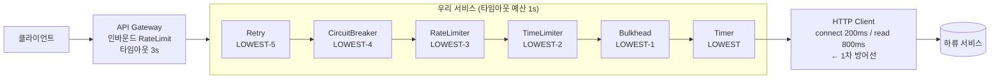

# 운영 설계 — 어떤 컴포넌트를 어디에 걸까

앞 23개 문서가 "어떻게 동작하는가"였다면 이 문서는 "그래서 내 서비스에 뭘 어떻게 거는가"다. 기본값을 그대로 쓰면 안 되는 이유와, 숫자를 지표에서 역산하는 절차를 다룬다.

## 목차
- [1. 핵심 개념 (What)](#1-핵심-개념-what)
- [2. 왜 알아야 하는가 (Why)](#2-왜-알아야-하는가-why)
- [3. 내부 구현 분석 (How)](#3-내부-구현-분석-how)
- [4. 실전 예제](#4-실전-예제)
- [5. 정리](#5-정리)

---

## 1. 핵심 개념 (What)

레질리언스 설계는 컴포넌트를 **고르는** 일이 아니라 **예산을 배분하는** 일이다. 호출 하나에 쓸 수 있는 시간·스레드·커넥션은 유한하고, 각 컴포넌트는 그 예산의 일부를 지키는 장치다.

### 막고 싶은 것 → 써야 할 컴포넌트

| 증상 | 컴포넌트 | 쓰면 안 되는 경우 |
|---|---|---|
| 하류가 죽었는데 계속 때려서 우리도 죽는다 | **CircuitBreaker** | 호출량이 적어 판단 근거가 안 모일 때 |
| 간헐적 네트워크 오류로 실패한다 | **Retry** | 멱등성이 없을 때. 하류가 이미 과부하일 때 |
| 외부 API 쿼터를 넘긴다 / 우리가 너무 빨리 보낸다 | **RateLimiter** | 분산 환경에서 전역 쿼터를 지켜야 할 때 (로컬 전용) |
| 한 느린 의존성이 전체 스레드를 잠식한다 | **Bulkhead** | 호출이 이미 짧고 동시성이 낮을 때 (오버헤드만) |
| 응답이 안 와서 스레드가 매달려 있다 | **TimeLimiter** | 동기 블로킹 호출 (`CompletionStage` 전용) |
| p99만 유독 느리다 | **Hedge** | 멱등성이 없을 때. 하류 여유 용량이 없을 때 |
| 임계값을 정할 근거가 없다 | **Timer** | — (측정은 항상 먼저) |

### 적용 위치

원칙은 **호출하는 쪽(client-side)** 이다. 서킷이 보호하는 건 하류가 아니라 **나 자신**이다. 하류가 죽었을 때 내 스레드가 거기 매달려 전부 소진되는 걸 막는 장치다.

예외는 RateLimiter다. "우리가 외부로 너무 빨리 보내는 것"을 막을 땐 client-side, "외부에서 우리에게 너무 빨리 들어오는 것"을 막을 땐 server-side 인바운드이고, 후자는 보통 API 게이트웨이가 할 일이다. 애플리케이션 RateLimiter로 인바운드를 막으면 인스턴스 수만큼 한도가 뻥튀기된다([`../main/10-ratelimiter-semaphore.md`](../main/10-ratelimiter-semaphore.md)).

---

## 2. 왜 알아야 하는가 (Why)

**기본값이 당신 서비스에 맞을 확률은 0이다.** 소스에서 확인한 실제 기본값을 보면 왜 그런지 분명해진다.

| 설정 | 기본값 | 그대로 쓰면 |
|---|---|---|
| `minimumNumberOfCalls` | **100** | 호출 100건이 쌓이기 전엔 서킷이 **절대 열리지 않는다** |
| `slidingWindowSize` | **100** (COUNT_BASED) | 초당 500 req 서비스에서는 0.2초치만 보고 판단 |
| `failureRateThreshold` | **50%** | 평시 에러율이 5%인 서비스엔 너무 느슨 |
| `slowCallRateThreshold` | **100%** | 전체 호출이 느려야 발동 — 실질적으로 꺼진 상태 |
| `slowCallDurationThreshold` | **60초** | 60초나 기다려야 "느리다"고 판정 |
| `waitDurationInOpenState` | **60초** | 하류가 5초 만에 복구돼도 55초를 더 막는다 |
| `maxAttempts` (Retry) | **3** | 재시도 3회가 아니라 **총 시도 3회**(최초 1 + 재시도 2) |
| `maxConcurrentCalls` (Bulkhead) | **25** | 근거 없는 숫자 |
| `queueCapacity` (ThreadPoolBulkhead) | **100** | 8코어 장비에서 8스레드 + 큐 100 = 최대 **108건 인플라이트** |
| `timeoutDuration` (TimeLimiter) | **1초** | 외부 결제 API에 1초는 대개 짧다 |
| `cancelRunningFuture` | **true** | Spring `@TimeLimiter` 경로에서는 **아무 효과 없음** (아래) |

특히 아래 두 조합이 "서킷을 걸었는데 안 열린다"는 신고의 대부분이다.

- `minimumNumberOfCalls=100` + 저트래픽 → 평생 CLOSED
- `slowCallRateThreshold=100%` + `slowCallDurationThreshold=60s` → 느린 호출 감지 사실상 비활성

---

## 3. 내부 구현 분석 (How)

### 3.1 호출 경로 위의 배치



### 3.2 순서는 설정이 아니라 코드에 박혀 있다

Spring AOP 애스펙트 기본 순서는 `*ConfigurationProperties` 의 필드 초기값이다.

```java
// RetryConfigurationProperties
private int retryAspectOrder = Ordered.LOWEST_PRECEDENCE - 5;
// CircuitBreakerConfigurationProperties → LOWEST_PRECEDENCE - 4
// RateLimiterConfigurationProperties   → LOWEST_PRECEDENCE - 3
// TimeLimiterConfigurationProperties   → LOWEST_PRECEDENCE - 2
// BulkheadConfigurationProperties      → LOWEST_PRECEDENCE - 1
// TimerConfigurationProperties         → LOWEST_PRECEDENCE   ← 가장 안쪽
```

`Ordered.LOWEST_PRECEDENCE` 는 `Integer.MAX_VALUE` 이고, 숫자가 **작을수록 바깥**이다. 따라서 Retry가 가장 바깥, Timer가 가장 안쪽이다. Bulkhead가 안쪽에 있는 이유는 `BulkheadConfigurationProperties` 주석이 밝힌다 — "to cover the async case of threadPool bulkhead".

프로그래밍 방식(`Decorators`)에서는 **반대로 써야 한다.** 각 `withX` 가 `stageSupplier = wrap(stageSupplier)` 이므로 **마지막에 부른 것이 가장 바깥**이 된다([`../main/12-timelimiter-and-composition.md`](../main/12-timelimiter-and-composition.md)).

### 3.3 Retry를 어디 끼우냐로 결과가 3배 달라진다

| 배치 | 서킷이 세는 호출 수 | 결과 |
|---|---|---|
| Retry가 CircuitBreaker **바깥** (기본값) | 재시도 3회 → **3건** | 서킷이 3배 빨리 열린다 |
| Retry가 CircuitBreaker **안쪽** | 재시도 전체 → **1건** | 서킷이 늦게 열린다. 재시도가 장애를 증폭 |

기본값(바깥)이 일반적으로 맞다. 하류가 죽었으면 재시도도 무의미하므로 빨리 차단하는 게 낫다.

### 3.4 타임아웃 예산

지켜야 할 부등식:

```
상위 타임아웃  >  시도 횟수 × 하위 타임아웃  +  백오프 합계  +  여유
```

`maxAttempts=3`, `waitDuration=500ms`, `TimeLimiter=1s` 를 그대로 쓰면:

```
3 × 1000ms + (500 + 750)ms = 4,250ms
```

`IntervalFunction.DEFAULT_MULTIPLIER` 가 1.5이므로 백오프는 500 → 750ms다. 게이트웨이 타임아웃이 3초면 **클라이언트가 먼저 끊고 나간다.** 우리 서버는 이미 포기한 요청을 계속 재시도한다.

| 계층 | 예산 | 근거 |
|---|---|---|
| 게이트웨이 | 3,000ms | 사용자 체감 상한 |
| 서비스 (Retry 포함 총합) | 2,400ms | 게이트웨이의 80% |
| 시도 1회 (TimeLimiter) | 800ms | (2400 - 백오프 300) ÷ 2회 ≈ 1,050 → 800 으로 보수적 |
| HTTP read timeout | 700ms | TimeLimiter보다 **짧게** |
| HTTP connect timeout | 200ms | |
| `maxAttempts` | 2 | 3회는 예산 초과 |
| 백오프 | 300ms 고정 + jitter | 지수 백오프는 예산 계산이 어려움 |

**HTTP 클라이언트 자체 타임아웃이 1차 방어선이다.** `cancelRunningFuture=true` 는 `Future.cancel(true)` 로 인터럽트를 보낼 뿐이고, 소켓 read에 블로킹된 스레드는 깨어나지 않는다. 게다가 소스를 보면 이 플래그는 `TimeLimiterImpl.decorateFutureSupplier()` 에서만 쓰인다 — `TimeLimiterAspect` 는 반환 타입이 `CompletionStage` 가 아니면 `IllegalReturnTypeException` 을 던지므로 항상 `decorateCompletionStage()` 경로를 타고, **Spring `@TimeLimiter` 에서 `cancel-running-future` 는 무효다.**

### 3.5 임계값 산정 — 추측하지 말고 역산한다

| 설정 | 산정식 | 예시 |
|---|---|---|
| `slowCallDurationThreshold` | 관측 p99 × 1.2 | p99 420ms → **500ms** |
| `failureRateThreshold` | 평시 에러율 × 3 (최소 10%) | 평시 2% → **10%** |
| `slidingWindowSize` (COUNT) | TPS × 판단 희망 시간(초) | 50 TPS × 10s → **500** |
| `minimumNumberOfCalls` | `slidingWindowSize` × 0.2 | 500 × 0.2 → **100** |
| `maxConcurrentCalls` | 리틀의 법칙 L = λW → TPS × 평균응답(초) × 1.5 | 50 × 0.4 × 1.5 → **30** |
| `limitForPeriod` | 외부 쿼터 ÷ 인스턴스 수 × 0.9 | 1000/s ÷ 4대 × 0.9 → **225** |
| `waitDurationInOpenState` | 하류 평균 복구 시간 | **10s** (60s는 과함) |

측정이 먼저다. Timer로 p99를 재고([`./07-timer-module.md`](./07-timer-module.md)) 그 값으로 임계값을 정하는 순환이 실무 루프다.

---

## 4. 실전 예제

### 4.1 성격별 설정 3종

```yaml
resilience4j:
  circuitbreaker:
    configs:
      default:
        sliding-window-type: COUNT_BASED
        sliding-window-size: 500          # 50 TPS × 10초
        minimum-number-of-calls: 100      # 윈도의 20%
        failure-rate-threshold: 10        # 평시 2% × 3, 최소 10
        slow-call-rate-threshold: 30
        slow-call-duration-threshold: 500ms   # p99 420ms × 1.2
        wait-duration-in-open-state: 10s      # 기본 60s는 과함
        permitted-number-of-calls-in-half-open-state: 20
        automatic-transition-from-open-to-half-open-enabled: true
        register-health-indicator: false      # 4.2 참조

    instances:
      # 결제 — 정합성 우선. 느슨하게 열고, 폴백 없음
      payment:
        base-config: default
        failure-rate-threshold: 40        # 쉽게 차단하면 매출 손실
        wait-duration-in-open-state: 5s
        slow-call-duration-threshold: 3s  # 결제는 원래 느리다
        ignore-exceptions:
          - com.example.payment.CardDeclinedException   # 카드 거절은 장애 아님

      # 추천 — 없어도 되는 기능. 빨리 차단하고 폴백
      recommendation:
        base-config: default
        failure-rate-threshold: 20
        slow-call-duration-threshold: 200ms
        wait-duration-in-open-state: 30s

      # 내부 검색 — 트래픽 많고 빠름
      search:
        base-config: default
        sliding-window-size: 2000         # 200 TPS × 10초
        minimum-number-of-calls: 400
        slow-call-duration-threshold: 100ms

  retry:
    configs:
      default:
        max-attempts: 2                   # 총 2회 (최초 1 + 재시도 1)
        wait-duration: 300ms
        enable-randomized-wait: true      # jitter 필수 — 재시도 폭풍 방지
        randomized-wait-factor: 0.5
        retry-exceptions:
          - java.io.IOException
          - java.util.concurrent.TimeoutException
    instances:
      recommendation: { base-config: default }
      search: { base-config: default }
      # payment 에는 Retry 를 걸지 않는다 — 멱등 키 없이는 중복 결제

  timelimiter:
    configs:
      default:
        timeout-duration: 800ms           # HTTP read 700ms 보다 길게
    instances:
      payment: { timeout-duration: 5s }
      recommendation: { timeout-duration: 300ms }

  bulkhead:
    configs:
      default:
        max-concurrent-calls: 30          # 리틀의 법칙 50 × 0.4 × 1.5
        max-wait-duration: 0              # 즉시 거절. 대기는 지연만 쌓는다
    instances:
      payment: { max-concurrent-calls: 10 }
      recommendation: { max-concurrent-calls: 20 }

  ratelimiter:
    instances:
      # 외부 쿼터 1000/s, 인스턴스 4대 → 225
      external-api:
        limit-for-period: 225
        limit-refresh-period: 1s
        timeout-duration: 0               # 대기 없이 즉시 거절
```

HTTP 클라이언트 쪽도 반드시 맞춘다.

```java
@Bean
WebClient paymentClient() {
    HttpClient http = HttpClient.create()
        .option(ChannelOption.CONNECT_TIMEOUT_MILLIS, 200)
        .responseTimeout(Duration.ofMillis(4_500));  // TimeLimiter 5s 보다 짧게
    return WebClient.builder()
        .clientConnector(new ReactorClientHttpConnector(http))
        .build();
}
```

### 4.2 HealthIndicator는 끄는 게 기본이다

서킷이 OPEN이면 health가 떨어지고, 쿠버네티스가 이 파드를 빼버린다. 그런데 서킷이 열린 원인은 **하류**이므로 **모든 파드가 동시에 빠진다.** 하류 장애 하나가 우리 서비스 전면 장애로 증폭된다.

소스에서 확인한 사실 둘이 이걸 뒷받침한다 — `management.health.circuitbreakers.enabled` 는 `matchIfMissing` 없이 걸려 있어 **기본 OFF**이고, OPEN일 때 반환하는 것도 `DOWN` 이 아니라 커스텀 상태 `CIRCUIT_OPEN` 이다. 라이브러리 저자도 같은 판단을 한 것이다.

```yaml
management:
  endpoint:
    health:
      group:
        readiness:
          include: db, diskSpace      # circuitBreakers 를 넣지 않는다
        liveness:
          include: ping
  health:
    circuitbreakers:
      enabled: false
```

서킷 상태는 health가 아니라 **지표와 알럿**으로 본다([`./06-micrometer-metrics.md`](./06-micrometer-metrics.md)).

### 4.3 Actuator 노출 최소화

```yaml
management:
  server:
    port: 9090                      # 서비스 포트와 분리
  endpoints:
    web:
      exposure:
        include: health, prometheus, circuitbreakers, retries
        # streamcircuitbreakerevents, hystrixstreamcircuitbreakerevents 는 제외
```

`POST /actuator/circuitbreakers/{name}` 은 서킷 상태를 외부에서 강제 전환할 수 있다. 게다가 내부적으로 `circuitBreakerRegistry.circuitBreaker(name)` 를 쓰므로 **이름을 오타내면 404가 아니라 새 인스턴스가 생긴다**([`../main/02-registry-and-config.md`](../main/02-registry-and-config.md)의 `computeIfAbsent` 패턴). 인증 없이 열어두면 안 된다.

### 4.4 안티패턴 10

| # | 안티패턴 | 결과 | 고치는 법 |
|---|---|---|---|
| 1 | 멱등성 없는 API에 Retry | 중복 결제·중복 주문 | 멱등 키(`Idempotency-Key`) 도입 후에만 |
| 2 | 같은 빈 안에서 `this.method()` 호출 | 애너테이션이 **아무 일도 안 함** | 빈 분리 ([`./02-aop-aspects.md`](./02-aop-aspects.md)) |
| 3 | 폴백에서 또 외부 호출 | 장애가 폴백으로 전파 | 캐시·기본값·빈 목록만 |
| 4 | HealthIndicator가 서킷을 따라감 | 전 파드 동시 이탈 | 4.2 |
| 5 | 모든 호출에 같은 설정 복붙 | 결제가 추천과 같은 기준으로 차단됨 | `configs` + `instances` |
| 6 | `minimumNumberOfCalls` 없이 작은 윈도 | 1건 실패로 OPEN, 플래핑 | 윈도의 20% 이상 |
| 7 | `queueCapacity` 를 크게 잡음 | 지연만 쌓이고 전부 타임아웃 | 큐는 작게, 거절은 빠르게 |
| 8 | 서킷은 걸었지만 지표·알럿 없음 | 열린 걸 아무도 모름 | 상태 전이 알럿 필수 |
| 9 | 로컬 RateLimiter로 전역 쿼터 방어 | 인스턴스 수만큼 초과 | 쿼터 ÷ 대수, 또는 Redis 기반 |
| 10 | 비멱등 API에 Hedge | 중복 처리 2배 | 읽기 전용에만 ([`./11-hedge.md`](./11-hedge.md)) |

### 4.5 장애 시나리오별 기대 동작

| 시나리오 | 작동해야 할 것 | 움직여야 할 지표 |
|---|---|---|
| 하류 지연 증가 (200ms → 2s) | TimeLimiter 타임아웃 → slow call 비율 상승 → 서킷 OPEN | `slow_call_rate`, `state` 전이 |
| 하류 완전 장애 | Retry 1회 후 서킷 OPEN → 폴백 | `failure_rate`, `not_permitted_calls` |
| 부분 실패 (10% 오류) | 임계값 미달로 CLOSED 유지, Retry가 흡수 | `retry.calls` |
| 복구 직후 thundering herd | HALF_OPEN 의 `permitted` 수로 유입 제한 | `state=half_open` 체류 시간 |

Toxiproxy로 지연·끊김을 주입하고 위 지표가 실제로 그렇게 움직이는지 확인한다. **설정을 넣었다고 작동하는 게 아니다.**

### 4.6 단계적 도입

1. **측정만** — Timer + Micrometer. 임계값 근거 수집. `METRICS_ONLY` 서킷으로 "열렸다면 언제였나"를 관찰
2. **타임아웃** — HTTP 클라이언트 타임아웃부터. 가장 효과 크고 부작용 적음
3. **서킷** — 1단계에서 얻은 숫자로 설정. 폴백 함께
4. **격리·제한** — Bulkhead, RateLimiter

측정 없이 3번부터 시작하면 임계값이 추측이 되고, 그 추측이 틀리면 장애를 만든다.

### 4.7 코드 리뷰 체크리스트

- [ ] 같은 빈 내부 호출(self-invocation)로 애너테이션이 무력화되지 않는가
- [ ] Retry가 걸린 호출이 멱등인가
- [ ] 타임아웃 예산 부등식이 성립하는가 (상위 > 시도 × 하위 + 백오프)
- [ ] HTTP 클라이언트 자체 타임아웃이 TimeLimiter보다 짧은가
- [ ] 임계값에 근거가 있는가 (p99·평시 에러율·TPS 기반인가)
- [ ] `minimumNumberOfCalls` 가 `slidingWindowSize` 대비 충분한가
- [ ] 폴백이 외부 호출을 하지 않는가
- [ ] 폴백이 실패를 조용히 성공으로 바꾸지 않는가 (결제·주문)
- [ ] HealthIndicator가 readiness에 들어가 있지 않은가
- [ ] 상태 전이 알럿이 걸려 있는가
- [ ] 인스턴스 이름이 테넌트·사용자별로 생성되어 태그 카디널리티를 폭발시키지 않는가
- [ ] `ThreadPoolBulkhead` 를 쓰는데 MDC·SecurityContext 전파가 되는가 ([`./10-context-propagation.md`](./10-context-propagation.md))

---

## 5. 정리

| 질문 | 답 |
|---|---|
| 어디에 거나 | 호출하는 쪽. 서킷은 하류가 아니라 나를 보호한다 |
| 순서는 | 기본값(Retry 바깥 ~ Timer 안쪽)이 대개 맞다. `Decorators` 는 역순으로 작성 |
| 숫자는 어떻게 정하나 | 지표에서 역산한다. p99·평시 에러율·TPS·리틀의 법칙 |
| 기본값 써도 되나 | 안 된다. `minimumNumberOfCalls=100` 과 `slowCallRateThreshold=100%` 가 서킷을 사실상 비활성화한다 |
| 가장 효과 큰 한 가지 | HTTP 클라이언트 타임아웃. 1차 방어선이다 |
| 가장 위험한 실수 | 멱등성 없는 호출에 Retry, 그리고 HealthIndicator를 readiness에 넣기 |
| 도입 순서 | 측정 → 타임아웃 → 서킷 → 격리 |

레질리언스는 설정 파일이 아니라 **예산과 근거**다. 숫자마다 "왜 이 값인가"를 답할 수 있으면 설계가 끝난 것이고, 답할 수 없으면 아직 추측 중인 것이다.

---

## 관련 문서
- 선행: [11. Hedge — 느린 꼬리 지연을 두 번째 요청으로 자른다](./11-hedge.md)
- 선행(전체): [main 트랙 01~12](../main/01-architecture-overview.md) · [advanced 01~11](./01-spring-boot-autoconfiguration.md)
- 함께 보기: [12. TimeLimiter와 조합 순서](../main/12-timelimiter-and-composition.md) · [06. Micrometer 지표](./06-micrometer-metrics.md) · [05. Actuator와 HealthIndicator](./05-actuator-and-health.md)

---
*Resilience4j v2.4.0 기준 · 소스 커밋 7e3ab525*
