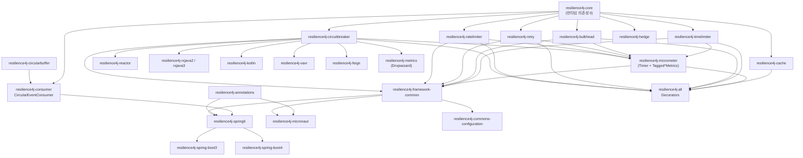
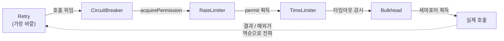

# Resilience4j 전체 구조와 모듈 지도

Resilience4j 는 "상속해서 커맨드를 만드는" 라이브러리가 아니라 "함수를 감싸는" 라이브러리다. 이 문서는 `settings.gradle` 과 각 모듈 `build.gradle` 을 실제로 읽어서 31개 모듈이 어떤 계층을 이루는지, 그리고 왜 `Supplier` 를 감싸는 설계를 택했는지를 정리한다.

## 목차
- [1. 핵심 개념 (What)](#1-핵심-개념-what)
- [2. 왜 알아야 하는가 (Why)](#2-왜-알아야-하는가-why)
- [3. 내부 구현 분석 (How)](#3-내부-구현-분석-how)
- [4. 실전 예제](#4-실전-예제)
- [5. 정리](#5-정리)

---

## 1. 핵심 개념 (What)

### 함수형 데코레이터(functional decorator)

Resilience4j 의 모든 컴포넌트는 "실행 가능한 것을 받아서, 같은 타입의 실행 가능한 것을 돌려준다". 예를 들어 `CircuitBreaker.decorateSupplier()` 의 시그니처는 이렇다.

```java
static <T> Supplier<T> decorateSupplier(CircuitBreaker circuitBreaker, Supplier<T> supplier)
```

`Supplier<T>` 가 들어가고 `Supplier<T>` 가 나온다. 반환 타입이 입력 타입과 같으므로 **합성(composition)이 공짜로 가능**하다. `Retry.decorateSupplier(retry, CircuitBreaker.decorateSupplier(cb, supplier))` 처럼 몇 겹이든 쌓을 수 있고, 타입 시스템이 조립 가능 여부를 보장한다.

감싸는 대상은 Java 표준 함수형 인터페이스(`Supplier`, `Function`, `Runnable`, `Callable`, `Consumer`, `CompletionStage`)와, 체크 예외를 던질 수 있도록 Resilience4j 가 직접 정의한 `core/functions/` 의 인터페이스들이다.

| 인터페이스 | 추상 메서드 | 용도 |
|---|---|---|
| `CheckedSupplier<T>` | `T get() throws Throwable` | 값을 반환하며 체크 예외를 던지는 호출 |
| `CheckedFunction<T, R>` | `R apply(T t) throws Throwable` | 입력을 받아 변환하는 호출 |
| `CheckedRunnable` | `void run() throws Throwable` | 반환값 없는 호출 |
| `CheckedConsumer<T>` | `void accept(T t) throws Throwable` | 입력만 받는 호출 |
| `Either<L, R>` | — | 성공/실패를 한 값으로 표현 (`Left`=예외, `Right`=결과) |

### 5개 핵심 컴포넌트가 각각 막는 것

| 컴포넌트 | 막는 것 | 판단 근거 | 거부 시 예외 |
|---|---|---|---|
| **CircuitBreaker** | 이미 죽은 상대를 계속 때리는 것 | 슬라이딩 윈도 안의 실패율·느린호출률 | `CallNotPermittedException` |
| **RateLimiter** | 상대가 허용한 속도를 넘는 것 | 갱신 주기당 허용 permit 수 | `RequestNotPermitted` |
| **Retry** | 일시적(transient) 실패로 요청을 버리는 것 | 예외/결과 predicate + 최대 시도 횟수 | 마지막 예외 또는 `MaxRetriesExceededException` |
| **Bulkhead** | 느린 의존성 하나가 전체 스레드를 먹는 것 | 동시 실행 수(세마포어) 또는 별도 스레드풀 | `BulkheadFullException` |
| **TimeLimiter** | 영원히 안 끝나는 호출 | `timeoutDuration` | `TimeoutException` |

기본값도 함께 외워두면 코드 리뷰에서 바로 쓸 수 있다.

| 컴포넌트 | 주요 기본값 (소스 상수) |
|---|---|
| CircuitBreaker | `DEFAULT_FAILURE_RATE_THRESHOLD = 50`(%), `DEFAULT_SLIDING_WINDOW_SIZE = 100`, `DEFAULT_MINIMUM_NUMBER_OF_CALLS = 100`, `DEFAULT_WAIT_DURATION_IN_OPEN_STATE = 60`(초), `DEFAULT_SLIDING_WINDOW_TYPE = COUNT_BASED` |
| RateLimiter | `Builder` 기본값 — `limitForPeriod = 50`, `limitRefreshPeriod = 500ns`, `timeoutDuration = 5s` |
| Retry | `DEFAULT_MAX_ATTEMPTS = 3`, `DEFAULT_WAIT_DURATION = 500`(ms) |
| Bulkhead | `DEFAULT_MAX_CONCURRENT_CALLS = 25`, `DEFAULT_MAX_WAIT_DURATION = 0s` |
| TimeLimiter | `timeoutDuration = 1s`, `cancelRunningFuture = true` |

> `DEFAULT_MINIMUM_NUMBER_OF_CALLS = 100` 은 리뷰에서 가장 자주 지적할 지점이다. 기본 설정으로는 **100번 호출이 모일 때까지 서킷이 절대 열리지 않는다.** 하루 수십 건 호출되는 배치성 API 에 기본값을 붙여놓고 "왜 안 열려요?" 하는 상황이 여기서 나온다.

## 2. 왜 알아야 하는가 (Why)

### Hystrix 와 무엇이 다른가

| 축 | Hystrix | Resilience4j |
|---|---|---|
| 적용 방식 | `HystrixCommand` 를 **상속**해서 `run()` 구현 | `Supplier`/`Function` 을 **감싸는** static 팩토리 |
| 스레드 격리 | 기본이 스레드풀 격리(강제) | 선택 — `SemaphoreBulkhead`(같은 스레드) 또는 `ThreadPoolBulkhead` |
| 조합 | 커맨드 안에 모든 정책이 섞여 있음 | 5개 컴포넌트를 독립적으로 켜고 끔 |
| 설정 소스 | Archaius | `Registry` + `Config` (불변 설정 객체 + 이름 기반 조회) |
| 외부 의존성 | Archaius, RxJava 등 | **코어는 의존성 0** |

마지막 줄이 핵심이다. `resilience4j-core/build.gradle` 의 `dependencies` 블록에는 **런타임 의존성이 한 줄도 없다**. 테스트 픽스처와 테스트 라이브러리뿐이다. v1 에서 코어가 들고 있던 vavr 는 v2 에서 떼어내 `resilience4j-vavr` 로 분리됐다. 그 흔적은 소스에 그대로 남아 있다 — `core/functions/CheckedSupplier.java` 의 라이선스 헤더는 아직 `Copyright 2014-2019 Vavr, http://vavr.io` 이고, `Either` 의 javadoc 에는 `This interface is similar to {@link io.vavr.control.Either}.` 라고 적혀 있다. vavr 타입(`Try`, `io.vavr.CheckedFunction0`)으로 데코레이트하고 싶으면 `resilience4j-vavr` 의 `VavrCircuitBreaker`, `VavrRetry`, `VavrDecorators` 를 쓴다.

### 실무에서 이게 왜 중요한가

1. **라이브러리 코드에 Resilience4j 를 넣어도 안전하다.** 코어가 의존성 0 이라 버전 충돌이 날 게 없다.
2. **AOP 없이도 쓸 수 있다.** Spring 밖(배치 스크립트, Kafka 컨슈머의 내부 루프, 테스트 코드)에서도 `Decorators` 한 줄로 끝난다. Spring 애너테이션만 알고 있으면 "AOP 가 안 걸리는 self-invocation 상황"에서 손이 묶인다.
3. **데코레이션 순서를 내가 정한다.** 순서에 따라 의미가 완전히 달라진다 (3절).

## 3. 내부 구현 분석 (How)

### 모듈 의존 그래프

`settings.gradle` 에 31개 모듈이 등록되어 있다. 각 모듈 `build.gradle` 의 `api`/`implementation`/`compileOnly` 선언을 따라가면 다음 계층이 나온다.



읽을 때 주의할 점 두 가지.

- **`resilience4j-micrometer` 는 단순 부가 모듈이 아니다.** `resilience4j-framework-common/build.gradle` 이 `api(project(":resilience4j-micrometer"))` 를 선언한다. 지표 바인딩(`TaggedCircuitBreakerMetrics`)만 주는 게 아니라 `Timer` 라는 **6번째 데코레이터**를 제공하기 때문이다. `Decorators` 의 모든 빌더에 `withTimer(Timer timer)` 가 있다.
- **어댑터 모듈들은 `compileOnly` 를 적극적으로 쓴다.** `resilience4j-kotlin/build.gradle` 은 5개 컴포넌트를 전부 `compileOnly` 로 잡는다. Kotlin 확장함수만 쓰는 사람에게 안 쓰는 컴포넌트가 끌려오지 않게 하려는 의도다. `resilience4j-spring6` 도 Spring·AspectJ·Reactor·RxJava 를 전부 `compileOnly` 로 둔다.

### `decorateSupplier()` 안쪽: 데코레이터 하나의 전체 모습

`CircuitBreaker.decorateSupplier()` 가 하는 일은 20줄이 안 된다. 이 20줄이 Resilience4j 전체의 설계 패턴이다.

```java
static <T> Supplier<T> decorateSupplier(CircuitBreaker circuitBreaker, Supplier<T> supplier) {
    return () -> {
        circuitBreaker.acquirePermission();
        final long start = circuitBreaker.getCurrentTimestamp();
        try {
            T result = supplier.get();
            long duration = circuitBreaker.getCurrentTimestamp() - start;
            circuitBreaker.onResult(duration, circuitBreaker.getTimestampUnit(), result);
            return result;
        } catch (Exception exception) {
            // Do not handle java.lang.Error
            long duration = circuitBreaker.getCurrentTimestamp() - start;
            circuitBreaker.onError(duration, circuitBreaker.getTimestampUnit(), exception);
            throw exception;
        }
    };
}
```

줄 단위로 보면:

- **`return () -> {...}`** — 즉시 실행이 아니다. 새 `Supplier` 를 만들어 돌려준다. 그래서 데코레이션 비용은 람다 객체 하나뿐이고, 애플리케이션 시작 시점에 미리 조립해 둘 수 있다.
- **`acquirePermission()`** — 통과 허가. OPEN 이면 여기서 `CallNotPermittedException` 이 던져지고 원본 `supplier.get()` 은 **호출조차 되지 않는다**. 서킷의 본질은 "호출을 안 하는 것"이다.
- **`getCurrentTimestamp()`** — `System.currentTimeMillis()` 가 아니라 설정 가능한 함수다. `CircuitBreakerConfig` 의 `DEFAULT_TIMESTAMP_FUNCTION = clock -> System.nanoTime()`, `DEFAULT_TIMESTAMP_UNIT = NANOSECONDS`. 테스트에서 시간을 가짜로 주입할 수 있는 이유.
- **`onResult(duration, unit, result)`** — 성공 경로에서도 `onSuccess` 가 아니라 `onResult` 를 부른다. `recordResultPredicate` 로 "200 OK 지만 body 가 에러인 응답"을 실패로 셀 수 있게 하려는 설계다.
- **`catch (Exception exception)`** — `Throwable` 이 아니라 `Exception`. 주석 그대로 `java.lang.Error`(OOM, StackOverflow)는 집계하지 않고 그냥 통과시킨다. OOM 때문에 서킷이 열려 서비스 전체가 멈추는 걸 막는다.
- **`throw exception`** — 삼키지 않는다. 데코레이터는 관찰하고 기록할 뿐, 예외 변환은 `withFallback` 의 몫이다.

5개 컴포넌트의 `decorateXxx()` 는 전부 이 구조의 변형이다. 그래서 하나를 읽으면 나머지가 다 읽힌다.

### 데코레이터 체인과 순서

`Decorators` 의 javadoc 이 순서 규칙을 명시한다.

> Decorators are applied in the order of the builder chain. ... This results in the following composition when executing the supplier: `Fallback(Retry(CircuitBreaker(Supplier)))` ... Each Decorator makes its own determination whether an exception represents a failure.

즉 **빌더에서 나중에 호출한 것이 바깥**이다. 체인을 그려보면:



이 순서는 Spring Boot 의 AOP 기본값과 일치한다. `resilience4j-spring6` 의 `*ConfigurationProperties` 에 박혀 있는 값이다.

| 애스펙트 | 기본 order | 위치 |
|---|---|---|
| `RetryAspect` | `LOWEST_PRECEDENCE - 5` | 가장 바깥 |
| `CircuitBreakerAspect` | `LOWEST_PRECEDENCE - 4` | |
| `RateLimiterAspect` | `LOWEST_PRECEDENCE - 3` | |
| `TimeLimiterAspect` | `LOWEST_PRECEDENCE - 2` | |
| `BulkheadAspect` | `LOWEST_PRECEDENCE - 1` | |
| `TimerAspect` | `LOWEST_PRECEDENCE` | 가장 안쪽 |

`Ordered` 값이 작을수록 우선순위가 높고 바깥에 온다. **Retry 가 CircuitBreaker 보다 바깥**이라는 점이 중요하다. 재시도가 서킷 바깥이면 "서킷이 OPEN 인데도 재시도가 계속 돌아 `CallNotPermittedException` 을 3번 받는" 동작이 된다. 반대로 Retry 를 안쪽에 두면 재시도 전체가 한 번의 서킷 호출로 집계되어, 실패율이 과소 집계된다. 둘 다 정답이 있는 게 아니라 **의도적으로 선택해야 하는 지점**이고, 리뷰에서 "왜 이 순서냐"를 물을 수 있어야 한다.

## 4. 실전 예제

### 예제 1 — 5개 컴포넌트를 모두 엮기 (프레임워크 없음)

TimeLimiter 는 비동기 호출에만 의미가 있으므로 `Decorators.ofCompletionStage()` 로 시작한다. `DecorateSupplier` 에는 `withTimeLimiter` 가 없다 — `withTimeLimiter(TimeLimiter, ScheduledExecutorService)` 는 `DecorateCompletionStage` 에만 선언되어 있다. 리뷰에서 자주 보는 실수다.

```java
package com.example.resilience;

import io.github.resilience4j.bulkhead.Bulkhead;
import io.github.resilience4j.bulkhead.BulkheadConfig;
import io.github.resilience4j.circuitbreaker.CallNotPermittedException;
import io.github.resilience4j.circuitbreaker.CircuitBreaker;
import io.github.resilience4j.circuitbreaker.CircuitBreakerConfig;
import io.github.resilience4j.decorators.Decorators;
import io.github.resilience4j.ratelimiter.RateLimiter;
import io.github.resilience4j.ratelimiter.RateLimiterConfig;
import io.github.resilience4j.retry.Retry;
import io.github.resilience4j.retry.RetryConfig;
import io.github.resilience4j.timelimiter.TimeLimiter;
import io.github.resilience4j.timelimiter.TimeLimiterConfig;

import java.io.IOException;
import java.time.Duration;
import java.util.List;
import java.util.concurrent.*;
import java.util.function.Supplier;

public final class PaymentGateway {

    private final Supplier<CompletionStage<String>> decorated;

    public PaymentGateway(Supplier<CompletionStage<String>> remoteCall,
                          ScheduledExecutorService scheduler) {

        CircuitBreaker circuitBreaker = CircuitBreaker.of("payment", CircuitBreakerConfig.custom()
            .slidingWindowType(CircuitBreakerConfig.SlidingWindowType.COUNT_BASED)
            .slidingWindowSize(200)
            .minimumNumberOfCalls(20)          // 기본값 100 은 저트래픽에서 영원히 안 열린다
            .failureRateThreshold(50f)
            .slowCallDurationThreshold(Duration.ofSeconds(2))
            .slowCallRateThreshold(60f)
            .waitDurationInOpenState(Duration.ofSeconds(10))
            .permittedNumberOfCallsInHalfOpenState(5)
            .ignoreExceptions(IllegalArgumentException.class)   // 400 류는 서버 장애가 아니다
            .build());

        RateLimiter rateLimiter = RateLimiter.of("payment", RateLimiterConfig.custom()
            .limitForPeriod(100)
            .limitRefreshPeriod(Duration.ofSeconds(1))
            .timeoutDuration(Duration.ZERO)    // 대기 없이 즉시 거부
            .build());

        Bulkhead bulkhead = Bulkhead.of("payment", BulkheadConfig.custom()
            .maxConcurrentCalls(30).maxWaitDuration(Duration.ZERO).build());

        TimeLimiter timeLimiter = TimeLimiter.of("payment", TimeLimiterConfig.custom()
            .timeoutDuration(Duration.ofSeconds(3)).cancelRunningFuture(true).build());

        Retry retry = Retry.of("payment", RetryConfig.custom()
            .maxAttempts(3)
            .intervalFunction(io.github.resilience4j.core.IntervalFunction
                .ofExponentialRandomBackoff(Duration.ofMillis(200), 2.0))
            .retryExceptions(IOException.class, TimeoutException.class)
            .ignoreExceptions(CallNotPermittedException.class)  // OPEN 이면 재시도 무의미
            .build());

        // 빌더 순서 = 안쪽부터. 결과 체인:
        // Fallback( Retry( CircuitBreaker( RateLimiter( TimeLimiter( Bulkhead(call) ) ) ) ) )
        this.decorated = Decorators.ofCompletionStage(remoteCall)
            .withBulkhead(bulkhead)
            .withTimeLimiter(timeLimiter, scheduler)
            .withRateLimiter(rateLimiter)
            .withCircuitBreaker(circuitBreaker)
            .withRetry(retry, scheduler)
            .withFallback(List.of(CallNotPermittedException.class, TimeoutException.class),
                throwable -> "DEGRADED")
            .decorate();
    }

    public CompletionStage<String> charge() {
        return decorated.get();
    }
}
```

주목할 점:

- `withRetry(retry, scheduler)` — `DecorateCompletionStage` 의 Retry 는 **스케줄러를 요구한다**. 비동기 경로에서 `Thread.sleep()` 백오프는 이벤트 루프 스레드를 잡아먹으므로, 내부적으로 `Retry.decorateCompletionStage(retry, scheduler, stageSupplier)` 가 스케줄러에 재시도를 예약한다.
- `ignoreExceptions(CallNotPermittedException.class)` — OPEN 이라 거부된 건을 재시도하면 OPEN 기간 내내 똑같이 거부된다. 무의미한 지연만 늘어난다.
- `withFallback(List.of(...), ...)` — 전체를 삼키면(`withFallback(e -> ...)`) 실제 버그가 조용히 묻힌다.

### 예제 2 — 순수 Java, 동기 호출 한 줄 조립

Spring 밖(배치, CLI, 테스트)에서 쓰는 최소 형태.

```java
package com.example.resilience;

import io.github.resilience4j.circuitbreaker.CircuitBreaker;
import io.github.resilience4j.circuitbreaker.CircuitBreakerRegistry;
import io.github.resilience4j.decorators.Decorators;
import io.github.resilience4j.retry.Retry;
import io.github.resilience4j.retry.RetryRegistry;

import java.util.function.Supplier;

public final class LegacySoapClientRunner {

    // Registry 는 애플리케이션당 하나. 인스턴스를 매번 new 하면 윈도가 초기화된다.
    private static final CircuitBreakerRegistry CB_REGISTRY = CircuitBreakerRegistry.ofDefaults();
    private static final RetryRegistry RETRY_REGISTRY = RetryRegistry.ofDefaults();

    public static void main(String[] args) {
        CircuitBreaker cb = CB_REGISTRY.circuitBreaker("legacy-soap");
        Retry retry = RETRY_REGISTRY.retry("legacy-soap");

        // 이벤트 구독은 동기 호출이다 — 여기서 블로킹하면 호출 경로가 막힌다 (03 문서 참조)
        cb.getEventPublisher().onStateTransition(e ->
            System.out.printf("[CB] %s -> %s%n", e.getStateTransition().getFromState(),
                                                 e.getStateTransition().getToState()));

        // decorate() 는 조립된 Supplier 를 반환. 시작 시 한 번 만들어 필드에 보관하는 게 정석.
        Supplier<String> guarded = Decorators.ofSupplier(LegacySoapClientRunner::callLegacy)
            .withCircuitBreaker(cb)
            .withRetry(retry)
            .withFallback(throwable -> "cached-value")
            .decorate();

        for (int i = 0; i < 500; i++) {
            System.out.println(guarded.get());
        }
    }

    private static String callLegacy() {
        if (Math.random() < 0.3) {
            throw new IllegalStateException("SOAP fault");
        }
        return "ok";
    }
}
```

## 5. 정리

| 항목 | 내용 |
|---|---|
| 설계 철학 | 상속·프록시가 아니라 `Supplier`/`Function` 을 감싸는 함수형 데코레이터 |
| 핵심 시그니처 | `static <T> Supplier<T> decorateSupplier(CircuitBreaker, Supplier<T>)` — 입력 타입 = 반환 타입이라 무한 합성 가능 |
| 체크 예외 대응 | `core/functions/` 의 `CheckedSupplier`, `CheckedFunction`, `CheckedRunnable`, `CheckedConsumer`, `Either` |
| 코어 의존성 | 0개. v1 의 vavr 의존은 `resilience4j-vavr` 로 분리 |
| 모듈 계층 | core → 5개 컴포넌트 → micrometer → framework-common → spring6/spring-boot3·4/micronaut, 별도로 어댑터(reactor/rxjava/kotlin/vavr)와 부가(metrics/cache/feign/hedge/circularbuffer/consumer) |
| 데코레이션 순서 | 빌더에서 **나중에 호출한 것이 바깥**. Spring AOP 기본은 Retry(-5) → CircuitBreaker(-4) → RateLimiter(-3) → TimeLimiter(-2) → Bulkhead(-1) → Timer |
| `Error` 처리 | `decorateSupplier` 는 `catch (Exception)` — `java.lang.Error` 는 집계하지 않고 통과 |
| 가장 흔한 함정 | `minimumNumberOfCalls` 기본값 100. 저트래픽 API 에서 서킷이 영원히 안 열림 |
| 두 번째 함정 | `withTimeLimiter` 는 `DecorateCompletionStage` 에만 있음. 동기 `Supplier` 에는 타임아웃을 걸 수 없다 |

---

## 관련 문서
- 선행: 없음 (이 문서가 시작점)
- 후행: [Registry와 설정 해석 — 인스턴스는 어디서 오는가](./02-registry-and-config.md)
- 참고: [Spring Boot 자동 설정](../advanced/01-spring-boot-autoconfiguration.md), [AOP 애스펙트](../advanced/02-aop-aspects.md), [TimeLimiter와 조합](./12-timelimiter-and-composition.md)
---
*Resilience4j v2.4.0 기준 · 소스 커밋 7e3ab525*
