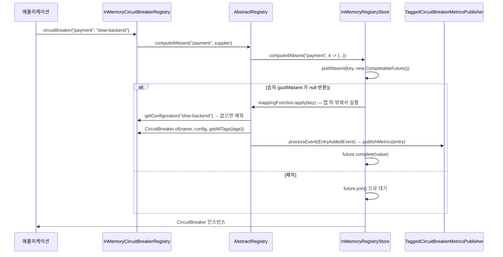

# Registry와 설정 해석 — 인스턴스는 어디서 오는가

`circuitBreakerRegistry.circuitBreaker("payment")` 한 줄 뒤에서 무슨 일이 벌어지는지 끝까지 따라간다. `AbstractRegistry` 의 `computeIfAbsent` 패턴, 설정 해석 규칙, v2.4.0 에서 가상 스레드(virtual thread) 때문에 바뀐 `InMemoryRegistryStore` 구현까지.

## 목차
- [1. 핵심 개념 (What)](#1-핵심-개념-what)
- [2. 왜 알아야 하는가 (Why)](#2-왜-알아야-하는가-why)
- [3. 내부 구현 분석 (How)](#3-내부-구현-분석-how)
- [4. 실전 예제](#4-실전-예제)
- [5. 정리](#5-정리)

---

## 1. 핵심 개념 (What)

Registry 는 세 가지를 동시에 한다. ① **이름 → 인스턴스 캐시** — 같은 이름으로 몇 번 불러도 같은 객체가 나온다(안 그러면 슬라이딩 윈도가 매번 초기화되어 서킷이 절대 열리지 않는다). ② **이름 → 설정 해석** — `"default"` 를 포함한 여러 설정을 이름으로 들고 있고 생성 시점에 고른다. ③ **생명주기 이벤트 발행** — 인스턴스가 생기고/지워지고/교체될 때 이벤트를 쏜다. Micrometer 지표 자동 등록이 전부 이 메커니즘 위에 있다.

관련 타입은 세 개뿐이다.

| 타입 | 위치 | 역할 |
|---|---|---|
| `Registry<E, C>` | `core/Registry.java` | 공용 인터페이스. `E`=인스턴스, `C`=설정 |
| `AbstractRegistry<E, C>` | `core/registry/AbstractRegistry.java` | 5개 컴포넌트 Registry 가 모두 상속하는 구현 |
| `RegistryStore<E>` / `InMemoryRegistryStore<E>` | `core/RegistryStore.java`, `core/registry/` | 인스턴스 저장소 추상화(교체 가능)와 기본 구현 |

`Registry<E, C>` 인터페이스가 선언하는 건 `addConfiguration`, `removeConfiguration`, `getConfiguration`, `getDefaultConfig`, `find`, `remove`, `replace`, `getTags`, `getEventPublisher` 뿐이다.

눈에 띄는 건 **`E get(String name)` 같은 조회 메서드가 없다**는 점이다. 조회는 각 컴포넌트 Registry 가 자기 이름으로 선언한다 — `CircuitBreakerRegistry.circuitBreaker(name)`, `RetryRegistry.retry(name)`, `BulkheadRegistry.bulkhead(name)` 처럼. 반환 타입이 `Optional` 이 아니라 구체 타입인 이유도 여기 있다. **없으면 만들기** 때문이다.

## 2. 왜 알아야 하는가 (Why)

**(1) 인스턴스를 매번 새로 만드는 코드.** 가장 흔한 버그다.

```java
// 잘못된 코드 — 호출마다 새 CircuitBreaker. 윈도가 항상 비어 있다.
public String call() {
    CircuitBreaker cb = CircuitBreaker.ofDefaults("payment");
    return cb.executeSupplier(this::remote);
}
```

`CircuitBreaker.ofDefaults()` 는 Registry 를 거치지 않는 직접 생성이다. 이러면 `minimumNumberOfCalls` 조건을 영원히 못 채운다. 리뷰에서 `CircuitBreaker.of(...)`/`ofDefaults(...)` 가 메서드 바디 안에 있으면 일단 의심해야 한다.

**(2) 테넌트/파티션별 동적 인스턴스.** 테넌트가 런타임에 늘어나면 `application.yml` 에 전부 적어둘 수 없다. 이름으로 동적 생성하고 Registry 이벤트로 지표를 자동 등록해야 한다.

**(3) 메모리 누수.** (2)를 하면 저장소 맵과 Micrometer 미터가 무한히 쌓인다. `RegistryStore` 커스텀 구현이 필요해지는 지점이다.

## 3. 내부 구현 분석 (How)

### 조회 흐름



### `AbstractRegistry.computeIfAbsent()`

```java
protected E computeIfAbsent(String name, Supplier<E> supplier) {
    return entryMap.computeIfAbsent(Objects.requireNonNull(name, NAME_MUST_NOT_BE_NULL), k -> {
        E entry = supplier.get();
        eventProcessor.processEvent(new EntryAddedEvent<>(entry));
        return entry;
    });
}
```

- **`entryMap`** 은 `RegistryStore<E>` 타입이다. `ConcurrentHashMap` 이 아니라 인터페이스라는 점이 중요하다 — 교체할 수 있다.
- **`supplier.get()` 안에서 설정이 해석된다.** 즉 설정 해석은 **인스턴스가 실제로 없을 때만** 일어난다. 이미 있으면 설정 이름이 틀려도 예외가 안 난다.
- **`EntryAddedEvent` 는 매핑 함수 안에서, "저장소에 들어가기 직전"에 정확히 한 번 발행된다.**

### 설정 해석 — `configurations` 맵과 `DEFAULT_CONFIG`

```java
protected static final String DEFAULT_CONFIG = "default";
protected final ConcurrentHashMap<String, C> configurations;
// 생성자: this.configurations.put(DEFAULT_CONFIG, requireNonNull(defaultConfig, ...));
```

`"default"` 는 예약어다. `addConfiguration(configName, ...)` 과 `removeConfiguration(configName)` 둘 다 첫 줄에서 `configName.equals(DEFAULT_CONFIG)` 를 검사해 `IllegalArgumentException` 을 던진다. 반면 생성자로는 들어갈 수 있다 — `InMemoryCircuitBreakerRegistry(Map<String, CircuitBreakerConfig> configs)` 는 `configs.getOrDefault(DEFAULT_CONFIG, CircuitBreakerConfig.ofDefaults())` 로 맵에서 `"default"` 키를 꺼내 기본 설정으로 쓴다. Spring Boot 의 `resilience4j.circuitbreaker.configs.default.*` 가 동작하는 경로다.

### 이름 기반 조회 세 갈래

`InMemoryCircuitBreakerRegistry` 의 오버로드들은 **설정을 어디서 얻는지만** 다르고, 전부 `computeIfAbsent(name, supplier)` 로 끝난다.
```java
// 설정 이름으로 조회하는 형태 — 설정이 없으면 여기서 터진다
@Override
public CircuitBreaker circuitBreaker(String name, String configName, Map<String, String> tags) {
    return computeIfAbsent(name, () -> CircuitBreaker.of(name, getConfiguration(configName)
        .orElseThrow(() -> new ConfigurationNotFoundException(configName)), getAllTags(tags)));
}
```

설정 객체를 직접 받는 형태는 `getConfiguration(...)` 대신 `Objects.requireNonNull(config, CONFIG_MUST_NOT_BE_NULL)` 을, `Supplier` 를 받는 형태는 `supplier.get()` 결과를 같은 식으로 검사해 넘긴다. 나머지는 동일하다.

| 형태 | 언제 쓰는가 | 주의 |
|---|---|---|
| `circuitBreaker(name)` | 기본 설정으로 충분할 때 (`getDefaultConfig()` 로 위임) | — |
| `circuitBreaker(name, config)` | 코드에서 설정을 조립할 때 | 인스턴스가 이미 있으면 `config` 는 **무시된다** |
| `circuitBreaker(name, configName)` | yml 에 정의한 공유 설정(`configs.slow-backend`)을 쓸 때 | 설정 이름 오타 → `ConfigurationNotFoundException` |
| `circuitBreaker(name, Supplier<Config>)` | 설정 조립이 비싸거나(DB 조회 등) 호출 시점에 결정될 때 | 인스턴스가 이미 있으면 Supplier 가 **호출조차 안 된다** |

마지막 두 줄이 리뷰 포인트다. `computeIfAbsent` 이므로 **두 번째 호출부터는 설정 인자 전체가 무시된다.** `registry.circuitBreaker("payment", custom().waitDurationInOpenState(dynamicDuration).build())` 를 매 요청마다 호출해도 반영되는 건 첫 호출의 값뿐이다. 런타임에 설정을 바꾸려면 `replace()` 를 써야 한다.

### `ConfigurationNotFoundException`

`core/ConfigurationNotFoundException.java` 는 `RuntimeException` 을 상속하고 메시지가 `"Configuration with name '%s' does not exist"` 뿐이다. 중요한 건 던져지는 **시점**이다 — `computeIfAbsent` 의 supplier 안에서 평가되므로 **인스턴스가 처음 생성될 때만** 터진다. yml 설정 이름 오타가 부팅 시점이 아니라 **첫 요청이 들어온 순간** 발견되는 이유다.

### `InMemoryRegistryStore` — FutureHashMap 패턴

v2.4.0 의 기본 저장소는 `ConcurrentHashMap.computeIfAbsent()` 를 쓰지 않는다. 소스 주석이 이유를 직접 설명한다.

```java
private final ConcurrentHashMap<String, CompletableFuture<E>> entryMap;   // 값이 future 다
@Override
public E computeIfAbsent(String key, Function<? super String, ? extends E> mappingFunction) {
    CompletableFuture<E> created = new CompletableFuture<>();
    CompletableFuture<E> future = entryMap.putIfAbsent(key, created);

    if (future == null) { // I am the winner
        future = created;
        try {
            E value = mappingFunction.apply(key);     // ***Compute outside map lock*** (no pinning)
            Objects.requireNonNull(value, "Mapping function must not return null for key: " + key);
            future.complete(value);
        } catch (Throwable t) {
            // Only cleanup if I'm the first to complete exceptionally → retry possible
            if (future.completeExceptionally(t)) {
                entryMap.remove(key, future);
            }
            throw t;
        }
    }
    return future.join(); // Losers wait (VT friendly - no carrier thread blocking)
}
```

줄 단위로:

- **값 타입이 `E` 가 아니라 `CompletableFuture<E>`** 다. 맵에는 "미래에 채워질 약속"을 먼저 넣고 `putIfAbsent` 로 경쟁한다. `null` 이 돌아오면 승자다.
- **승자만 `mappingFunction.apply(key)` 를 실행하고, 그 실행은 `ConcurrentHashMap` 세그먼트 락 밖에서 일어난다.** 이게 설계 목적이다 — `computeIfAbsent` 안에서 블로킹하면 가상 스레드가 캐리어 스레드에 **pinning** 되어 플랫폼 스레드를 점유한다.
- **패자는 `future.join()`** 으로 기다린다. `join()` 은 내부적으로 `LockSupport.park()` 를 쓰므로 가상 스레드가 캐리어를 놓아준다. `synchronized` 블로킹과 다르다.
- **실패 시 `completeExceptionally(t)` 가 true 를 반환한 스레드만 맵에서 제거**한다. 그래야 다음 호출이 재시도할 수 있다. 실패한 future 를 남겨두면 영구히 실패하는 엔트리가 생긴다.
- **소스 주석이 못을 박아뒀다**: "This is a performance optimization for virtual thread environments and should NOT be 'simplified' to standard computeIfAbsent in future JDK versions, as it would reintroduce the pinning issue."

`find()`, `values()` 는 `isSuccessfullyCompleted(future)` — `future != null && future.isDone() && !future.isCompletedExceptionally()` — 를 통과한 것만 돌려준다. **생성 중인 인스턴스는 `find()` 에 보이지 않는다.**

### `replace()`, `remove()`, tags

```java
@Override
public Optional<E> replace(String name, E newEntry) {
    Optional<E> replacedEntry = entryMap.replace(name, newEntry);
    replacedEntry.ifPresent(
        oldEntry -> eventProcessor.processEvent(new EntryReplacedEvent<>(oldEntry, newEntry)));
    return replacedEntry;
}
```

`replace()` 는 **키가 없으면 아무것도 하지 않고 `Optional.empty()`** 를 돌려준다. 새 인스턴스를 넣지 않는다. 그리고 **기존 인스턴스의 상태(슬라이딩 윈도, 서킷 상태)를 버린다.** 운영 중 설정을 바꾸면 윈도가 비워지므로, 바꾼 직후 서킷은 `minimumNumberOfCalls` 를 다시 채울 때까지 열리지 않는다. `remove()` 도 같은 모양으로 `EntryRemovedEvent` 를 발행한다.

`getAllTags(tags)` 는 `new HashMap<>(registryTags)` 에 `allTags.putAll(tags)` 를 한다 — 즉 **인스턴스 태그가 Registry 태그를 덮어쓴다** (`putAll` 이 나중). Registry 태그는 `CircuitBreakerRegistry.custom().withTags(...)` 로 준다. Micrometer 지표의 라벨이 되므로 `region`/`cluster` 같은 전역 태그는 Registry 에, `tenant` 같은 인스턴스별 태그는 조회 시점에 주는 게 맞다.

### Registry 이벤트 — 실무에서 뭘 하나

`RegistryEventConsumer<E>` 는 메서드 세 개(`onEntryAddedEvent`, `onEntryRemovedEvent`, `onEntryReplacedEvent`)다. Resilience4j 자체가 이걸로 Micrometer 연동을 한다. `core/metrics/MetricsPublisher<E>` 가 `RegistryEventConsumer<E>` 를 상속하고 default 메서드로 매핑한다.

```java
public interface MetricsPublisher<E> extends RegistryEventConsumer<E> {
    void publishMetrics(E entry);
    void removeMetrics(E entry);

    @Override
    default void onEntryAddedEvent(EntryAddedEvent<E> entryAddedEvent) {
        publishMetrics(entryAddedEvent.getAddedEntry());
    }

    @Override
    default void onEntryReplacedEvent(EntryReplacedEvent<E> entryReplacedEvent) {
        removeMetrics(entryReplacedEvent.getOldEntry());
        publishMetrics(entryReplacedEvent.getNewEntry());
    }
    // onEntryRemovedEvent → removeMetrics(entryRemoveEvent.getRemovedEntry())
}
```

`TaggedCircuitBreakerMetricsPublisher` 가 이 인터페이스의 구현이다. 그래서 **런타임에 동적 생성한 CircuitBreaker 도 지표가 자동으로 붙는다.** `onEntryReplacedEvent` 가 `removeMetrics(old)` → `publishMetrics(new)` 순서인 것도 봐두면 좋다 — 미터 중복 등록을 피하는 순서다.

소비자가 여럿이면 `CompositeRegistryEventConsumer<E>` 로 묶는다. 생성자에서 방어적 복사를 하고 각 메서드에서 `delegates.forEach(...)` 로 순차 호출하므로, **소비자 하나가 예외를 던지면 뒤의 소비자는 호출되지 않는다.**

### 구현체는 `AbstractRegistry` 를 어떻게 확장하나

`InMemoryCircuitBreakerRegistry` 는 `AbstractRegistry<CircuitBreaker, CircuitBreakerConfig>` 를 상속하고 `CircuitBreakerRegistry` 를 구현한다. 제네릭 두 개를 고정하고, `protected computeIfAbsent(name, supplier)` 를 타입별 조회 메서드 안에서 호출하는 게 전부다. `getAllCircuitBreakers()` 는 `new HashSet<>(entryMap.values())` — 스냅샷이다. 그리고 **`final` 클래스**다. 확장하지 말고 `RegistryStore` 를 교체하라는 신호다. `InMemoryRetryRegistry`, `InMemoryBulkheadRegistry`, `InMemoryRateLimiterRegistry`, `InMemoryTimeLimiterRegistry` 가 동일한 모양이라 하나를 읽으면 다섯 개를 읽은 셈이다.

## 4. 실전 예제

### 예제 1 — 테넌트별 CircuitBreaker 동적 생성 + 지표 자동 등록

```java
package com.example.resilience;

import io.github.resilience4j.circuitbreaker.CircuitBreaker;
import io.github.resilience4j.circuitbreaker.CircuitBreakerConfig;
import io.github.resilience4j.circuitbreaker.CircuitBreakerRegistry;
import io.github.resilience4j.micrometer.tagged.TaggedCircuitBreakerMetricsPublisher;
import io.micrometer.core.instrument.MeterRegistry;
import org.springframework.context.annotation.*;
import org.springframework.stereotype.Component;

import java.time.Duration;
import java.util.Map;
import java.util.function.Supplier;

@Configuration
class TenantCircuitBreakerConfig {

    /** addRegistryEventConsumer 로 지표 퍼블리셔를 걸어두면 동적 생성 인스턴스도 자동 등록된다. */
    @Bean
    CircuitBreakerRegistry tenantCircuitBreakerRegistry(MeterRegistry meterRegistry) {
        return CircuitBreakerRegistry.custom()
            .withCircuitBreakerConfig(CircuitBreakerConfig.custom()
                .slidingWindowType(CircuitBreakerConfig.SlidingWindowType.COUNT_BASED)
                .slidingWindowSize(200).minimumNumberOfCalls(20).failureRateThreshold(50f)
                .waitDurationInOpenState(Duration.ofSeconds(15)).build())
            // 공유 설정: yml 의 configs.<name> 과 같은 역할
            .addCircuitBreakerConfig("slow-backend", CircuitBreakerConfig.custom()
                .slowCallDurationThreshold(Duration.ofSeconds(5))
                .slowCallRateThreshold(70f).minimumNumberOfCalls(10).build())
            .addRegistryEventConsumer(new TaggedCircuitBreakerMetricsPublisher(meterRegistry))
            .withTags(Map.of("region", "ap-northeast-2"))   // 모든 인스턴스에 붙는 전역 태그
            .build();
    }
}

@Component
class TenantAwareClient {

    private final CircuitBreakerRegistry registry;

    TenantAwareClient(CircuitBreakerRegistry registry) {
        this.registry = registry;
        // 설정 이름 오타를 부팅 시점에 잡는다. 안 하면 첫 요청에서 터진다.
        registry.getConfiguration("slow-backend").orElseThrow(
            () -> new IllegalStateException("shared config 'slow-backend' 가 없습니다"));
    }

    public String call(String tenantId, Supplier<String> remote) {
        // 이름은 테넌트별로, 설정은 공유 설정 "slow-backend", 태그는 인스턴스별로.
        // 두 번째 호출부터는 캐시 적중 — 설정 해석도 태그 계산도 일어나지 않는다.
        return registry.circuitBreaker("backend-" + tenantId, "slow-backend",
            Map.of("tenant", tenantId)).executeSupplier(remote);
    }

    /** 테넌트 해지 시. EntryRemovedEvent → removeMetrics() 로 미터까지 정리된다. */
    public void evict(String tenantId) {
        registry.remove("backend-" + tenantId);
    }
}
```

### 예제 2 — TTL 기반 `RegistryStore` 커스텀 구현

테넌트가 수천 개 생기고 대부분이 하루에 몇 번만 호출되는 상황이면 미사용 인스턴스를 정리해야 한다. 직접 맵을 다루는 대신 `InMemoryRegistryStore` 에 **위임(delegate)** 하고 접근 시각만 따로 기록하는 쪽이 안전하다. FutureHashMap 의 pinning 회피 로직을 재구현하지 않아도 되고, 상류 구현이 개선되면 그대로 따라간다.

```java
package com.example.resilience;

import io.github.resilience4j.core.RegistryStore;
import io.github.resilience4j.core.registry.InMemoryRegistryStore;

import java.time.Duration;
import java.util.*;
import java.util.concurrent.*;
import java.util.function.Consumer;
import java.util.function.Function;

/**
 * 마지막 접근 이후 ttl 이 지난 엔트리를 주기적으로 솎아내는 RegistryStore.
 * 저장은 InMemoryRegistryStore 에 위임하고(FutureHashMap 로직 재구현 안 함),
 * sweep 은 evictionListener → Registry.remove() 로 위임한다(이벤트/미터 정리 때문).
 */
public final class TtlRegistryStore<E> implements RegistryStore<E> {

    private final RegistryStore<E> delegate = new InMemoryRegistryStore<>();
    private final ConcurrentHashMap<String, Long> lastAccessNanos = new ConcurrentHashMap<>();
    private final long ttlNanos;
    private final Consumer<String> evictionListener;

    public TtlRegistryStore(Duration ttl, Duration sweepInterval,
                            Consumer<String> evictionListener) {
        this.ttlNanos = ttl.toNanos();
        this.evictionListener = evictionListener;
        long periodMs = sweepInterval.toMillis();
        Executors.newSingleThreadScheduledExecutor(r -> {
            Thread t = new Thread(r, "r4j-registry-store-ttl");
            t.setDaemon(true);
            return t;
        }).scheduleAtFixedRate(this::sweep, periodMs, periodMs, TimeUnit.MILLISECONDS);
    }

    private <T> T touch(String key, T value) {
        lastAccessNanos.put(key, System.nanoTime());
        return value;
    }

    // --- 순수 위임 + 접근 시각 기록 ---
    @Override public E computeIfAbsent(String k, Function<? super String, ? extends E> fn) {
        return touch(k, delegate.computeIfAbsent(k, fn));
    }
    @Override public E putIfAbsent(String k, E v) { return touch(k, delegate.putIfAbsent(k, v)); }
    @Override public Optional<E> find(String k) { return touch(k, delegate.find(k)); }
    @Override public Optional<E> replace(String n, E e) { return touch(n, delegate.replace(n, e)); }
    @Override public Collection<E> values() { return delegate.values(); }

    @Override public Optional<E> remove(String name) {
        lastAccessNanos.remove(name);
        return delegate.remove(name);
    }

    private void sweep() {
        long cutoff = System.nanoTime() - ttlNanos;
        lastAccessNanos.entrySet().stream()
            .filter(e -> e.getValue() < cutoff)
            .map(Map.Entry::getKey)
            .toList()
            .forEach(evictionListener);   // Registry.remove() 로 위임 → 이벤트 발행
    }
}
```

Registry 에 꽂는 쪽. `withRegistryStore()` 가 `CircuitBreakerRegistry.Builder` 에만 있다는 점을 기억하자 — `InMemoryCircuitBreakerRegistry` 는 `final` 이라 이 경로밖에 없다.
```java
@Bean
CircuitBreakerRegistry ttlCircuitBreakerRegistry(MeterRegistry meterRegistry) {
    // evictionListener 가 registry.remove() 를 호출해야 EntryRemovedEvent 가 발행된다.
    var holder = new java.util.concurrent.atomic.AtomicReference<CircuitBreakerRegistry>();
    var store = new TtlRegistryStore<CircuitBreaker>(
        Duration.ofMinutes(30), Duration.ofMinutes(5),
        name -> Optional.ofNullable(holder.get()).ifPresent(r -> r.remove(name)));

    CircuitBreakerRegistry registry = CircuitBreakerRegistry.custom()
        .withCircuitBreakerConfig(CircuitBreakerConfig.ofDefaults())
        .addRegistryEventConsumer(new TaggedCircuitBreakerMetricsPublisher(meterRegistry))
        .withRegistryStore(store)
        .build();
    holder.set(registry);
    return registry;
}
```

## 5. 정리

| 항목 | 내용 |
|---|---|
| 조회 = 생성 | `circuitBreaker(name)` 은 없으면 만든다(`computeIfAbsent`). 그래서 인스턴스가 이미 있으면 두 번째 호출의 설정 인자/Supplier 는 **전혀 평가되지 않는다** |
| `"default"` | 예약어. `addConfiguration`/`removeConfiguration` 둘 다 `IllegalArgumentException`. 설정 이름 오타는 `ConfigurationNotFoundException` 으로 **첫 호출 시점**에만 터진다 |
| 저장소 | `RegistryStore<E>` 인터페이스. 기본 `InMemoryRegistryStore`, `Builder.withRegistryStore()` 로 교체 |
| FutureHashMap | 맵 값이 `CompletableFuture<E>`. 생성 함수를 맵 락 밖에서 실행 → 가상 스레드 pinning 회피. 소스 주석이 "단순화 금지"를 명시 |
| tags | `getAllTags()` — 인스턴스 태그가 Registry 태그를 덮어쓴다 |
| 이벤트 3종 | `EntryAddedEvent`(생성 시), `EntryRemovedEvent`(`remove()`), `EntryReplacedEvent`(`replace()`). `MetricsPublisher<E> extends RegistryEventConsumer<E>` → `TaggedCircuitBreakerMetricsPublisher` 가 지표 자동 등록/제거 |
| 여러 소비자 | `CompositeRegistryEventConsumer` 로 묶음. 하나가 예외 던지면 **뒤의 소비자는 호출 안 됨** |
| `replace()` / `find()` | `replace()` 는 키 없으면 `Optional.empty()`, 추가하지 않음 — 기존 윈도/상태는 버려진다. `find()` 는 생성 중(미완료 future)인 인스턴스를 보여주지 않는다 |

---

## 관련 문서
- 선행: [Resilience4j 전체 구조와 모듈 지도](./01-architecture-overview.md)
- 후행: [이벤트 파이프라인 — EventProcessor는 어떻게 동작하나](./03-event-processor.md)
- 참고: [설정 계층](../advanced/04-config-hierarchy.md), [Micrometer 지표](../advanced/06-micrometer-metrics.md)
---
*Resilience4j v2.4.0 기준 · 소스 커밋 7e3ab525*
