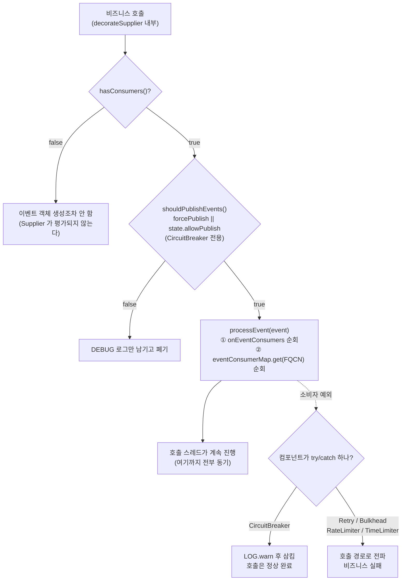

# 이벤트 파이프라인 — EventProcessor는 어떻게 동작하나

`circuitBreaker.getEventPublisher().onStateTransition(e -> slack.send(e))` 한 줄이 어디서 호출되는지 안다면, 그 람다 안에 HTTP 호출을 넣으면 안 되는 이유도 알게 된다. `EventProcessor` 는 60줄짜리지만, 이 60줄을 모르면 서킷브레이커가 장애를 **만드는** 쪽이 될 수 있다.

## 목차
- [1. 핵심 개념 (What)](#1-핵심-개념-what)
- [2. 왜 알아야 하는가 (Why)](#2-왜-알아야-하는가-why)
- [3. 내부 구현 분석 (How)](#3-내부-구현-분석-how)
- [4. 실전 예제](#4-실전-예제)
- [5. 정리](#5-정리)

---

## 1. 핵심 개념 (What)

등장인물은 셋이다. 전부 `resilience4j-core` 에 있고, 선언이 한 줄씩이다.

```java
@FunctionalInterface public interface EventConsumer<T> { void consumeEvent(T event); }
public interface EventPublisher<T> { void onEvent(EventConsumer<T> onEventConsumer); }
public class EventProcessor<T> implements EventPublisher<T> { ... }   // 위 인터페이스의 유일한 구현
```

각 컴포넌트는 `EventProcessor` 를 상속한 내부 클래스를 하나 갖는다. `CircuitBreakerStateMachine` 안의 `private class CircuitBreakerEventProcessor extends EventProcessor<CircuitBreakerEvent> implements EventConsumer<CircuitBreakerEvent>, CircuitBreaker.EventPublisher` 가 `onSuccess(...)`, `onError(...)`, `onStateTransition(...)` 같은 **타입별 등록 메서드**를 제공하면서 `EventProcessor.registerConsumer(className, consumer)` 로 위임한다. `AbstractRegistry.RegistryEventProcessor` 도 같은 패턴이다 (02 문서 참조).

### 두 종류의 소비자

| 종류 | 등록 방법 | 저장 위치 | 받는 이벤트 |
|---|---|---|---|
| 전역 | `getEventPublisher().onEvent(c)` | `onEventConsumers` (`CopyOnWriteArraySet`) | 그 컴포넌트의 **모든** 이벤트 |
| 타입별 | `getEventPublisher().onStateTransition(c)` 등 | `eventConsumerMap` (`ConcurrentHashMap<String, CopyOnWriteArraySet<...>>`) | 키가 일치하는 **한 종류**만 |

> v2.4.0 의 필드명은 위 표 그대로다. 과거 버전 문서에서 보던 `onEventConsumerMap`, `consumerRegistered` 플래그는 이 버전에 **없다** — 플래그 대신 `hasConsumers()` 가 컬렉션을 직접 들여다본다. 컬렉션도 `CopyOnWriteArrayList` 가 아니라 `CopyOnWriteArraySet` 이다.

## 2. 왜 알아야 하는가 (Why)

이벤트 소비자는 **호출 스레드에서 동기로 실행된다.** 별도 디스패처 스레드도, 큐도, 비동기 처리도 없다. `EventProcessor.processEvent()` 는 그냥 for 루프다. 결과는 세 가지다. ① 소비자에서 Slack webhook 을 호출하면 **그 지연이 사용자 요청 레이턴시에 그대로 더해진다** — 실패율이 올라 이벤트가 쏟아지는, 즉 가장 바쁜 순간에. ② 소비자에서 예외를 던지면 **대부분의 컴포넌트에서 호출 경로로 전파된다** — CircuitBreaker 만 잡아주고 Retry·Bulkhead·RateLimiter·TimeLimiter 는 안 잡는다(아래에서 소스로 확인). ③ 소비자가 락을 잡으면 그 경합이 비즈니스 호출 전체로 번진다.

반대로 이 구조를 알면 아주 저렴한 관측(observability)을 만들 수 있다. 소비자 안에서 `LongAdder` 를 올리거나 `BlockingQueue.offer()` 를 하는 건 수십 나노초다.

## 3. 내부 구현 분석 (How)

### `EventProcessor` 전문 — 진짜 이게 전부다
```java
public class EventProcessor<T> implements EventPublisher<T> {
    final Set<EventConsumer<T>> onEventConsumers = new CopyOnWriteArraySet<>();
    final ConcurrentHashMap<String, CopyOnWriteArraySet<EventConsumer<T>>> eventConsumerMap
        = new ConcurrentHashMap<>();

    public boolean hasConsumers() {
        return !onEventConsumers.isEmpty() || !eventConsumerMap.isEmpty();
    }
    @SuppressWarnings("unchecked")
    public void registerConsumer(String className, EventConsumer<? extends T> eventConsumer) {
        CopyOnWriteArraySet<EventConsumer<T>> set =
            eventConsumerMap.computeIfAbsent(className, k -> new CopyOnWriteArraySet<>());
        set.add((EventConsumer<T>) eventConsumer);
    }
    public <E extends T> boolean processEvent(E event) {
        boolean consumed = false;
        if (!onEventConsumers.isEmpty()) {
            for (EventConsumer<T> c : onEventConsumers) c.consumeEvent(event);
            consumed = true;
        }
        CopyOnWriteArraySet<EventConsumer<T>> set = eventConsumerMap.get(event.getClass().getName());
        if (set != null && !set.isEmpty()) {
            for (EventConsumer<T> c : set) c.consumeEvent(event);
            consumed = true;
        }
        return consumed;
    }
    @Override
    public void onEvent(EventConsumer<T> onEventConsumer) {
        onEventConsumers.add(onEventConsumer);   // requireNonNull 생략해 인용
    }
}
```

줄 단위 해설:

- **`registerConsumer(String className, ...)`** — 키가 `Class` 객체가 아니라 **FQCN 문자열**이다. 호출부는 `registerConsumer(CircuitBreakerOnStateTransitionEvent.class.getName(), consumer)` 처럼 쓴다.
- **디스패치 규칙**: 전역 소비자 전부 → 그 다음 `event.getClass().getName()` 으로 조회한 타입별 소비자 전부. **순서가 보장되는 건 이 두 그룹 간의 순서뿐**이고, 같은 그룹 안의 순서는 `CopyOnWriteArraySet` 의 순회 순서다.
- **`event.getClass().getName()` 은 정확 일치다.** 상속 계층을 타지 않는다. `CircuitBreakerEvent` 인터페이스로 등록해도 `CircuitBreakerOnErrorEvent` 가 안 걸린다. "모든 이벤트"를 받으려면 `onEvent()` 를 써야 한다.
- **반환값 `boolean consumed`** 는 "받은 소비자가 하나라도 있었나". 활용하는 호출부는 거의 없고 주 용도는 테스트·디버깅이다.
- **`try/catch 가 없다.`** 소비자가 던진 예외는 `processEvent()` 를 그대로 뚫고 나가고, **앞의 소비자가 던지면 뒤의 소비자는 호출되지 않는다.**

**왜 `CopyOnWriteArraySet` 인가.** 이벤트 소비자는 **시작 시 몇 개 등록하고 그 후로는 읽기만** 하는 read-mostly 컬렉션인데, `processEvent()` 는 **모든 호출마다** 순회된다. `CopyOnWriteArraySet` 은 쓰기 시 배열 전체를 복사하므로 등록이 비싸지만 읽기는 락도 volatile 쓰기도 없는 순수 배열 순회다. 반대 선택(`synchronizedSet`)이라면 모든 비즈니스 호출마다 모니터를 잡아야 한다. 등록은 수십 번, 순회는 수십억 번 — 이 비대칭이 선택의 근거다. `eventConsumerMap` 쪽은 키(이벤트 타입 FQCN)가 유한하므로 `ConcurrentHashMap` + `computeIfAbsent` 로 충분하다.

### `hasConsumers()` 가 성능의 핵심
이벤트 객체 생성 자체가 비용이다. `AbstractCircuitBreakerEvent` 생성자는 `ZonedDateTime.now()` 를 호출한다. 구독자가 없으면 이 객체는 쓰레기다. 그래서 각 컴포넌트는 발행 전에 `hasConsumers()` 로 가드하고 **이벤트 생성을 `Supplier` 로 지연시킨다.**

```java
// RetryImpl.publishRetryEvent — SemaphoreBulkhead.publishBulkheadEvent 도 동일 패턴
private void publishRetryEvent(Supplier<RetryEvent> event) {
    if (eventProcessor.hasConsumers()) {
        eventProcessor.consumeEvent(event.get());
    }
}
```

구독자가 없으면 `event.get()` 이 호출되지 않아 `ZonedDateTime.now()` 비용조차 안 든다. "이벤트 발행이 성능에 영향 없나요?" 라는 질문에 대한 답이 이 네 줄이다.

### 함정 ① — 소비자 예외가 호출 경로를 뚫는다

CircuitBreaker 는 막아준다.
```java
// CircuitBreakerStateMachine.publishEvent
private void publishEvent(CircuitBreakerEvent event) {
    if (shouldPublishEvents(event)) {
        try {
            eventProcessor.consumeEvent(event);
            LOG.debug("Event {} published: {}", event.getEventType(), event);
        } catch (Throwable t) {
            LOG.warn("Failed to handle event {}", event.getEventType(), t);
        }
    }   // else: "Publishing not allowed" DEBUG 로그만
}
```

`catch (Throwable t)` 로 전부 잡고 `LOG.warn` 만 남긴다. **CircuitBreaker 이벤트 소비자에서 NPE 가 나도 비즈니스 호출은 성공한다.** 대신 조용히 묻힌다 — WARN 로그를 보지 않으면 소비자가 죽어 있는 걸 모른다. 하지만 나머지 넷은 안 막는다. `RetryImpl.publishRetryEvent`, `SemaphoreBulkhead.publishBulkheadEvent`, `AtomicRateLimiter.publishRateLimiterAcquisitionEvent`, `TimeLimiterImpl.publishEvent` 모두 `try/catch` 없이 `eventProcessor.consumeEvent(...)` 를 직접 부른다.

예컨대 `AtomicRateLimiter.publishRateLimiterAcquisitionEvent(boolean, int)` 는 `if (!eventProcessor.hasConsumers()) return;` 다음 줄에서 바로 `eventProcessor.consumeEvent(new RateLimiterOnSuccessEvent(name, permits))` 를 부른다. 감싸는 것이 없다.

즉 **Retry 소비자에서 예외를 던지면 그 예외가 비즈니스 호출의 예외가 된다.** 재시도 성공했는데 알림 코드의 NPE 때문에 500 이 나가는 상황이 가능하다. 소비자 안에서는 반드시 직접 try/catch 하라 — 컴포넌트에 따라 안전망이 있고 없다는 사실에 기대지 말 것.

### 함정 ② — 상태에 따라 발행이 막힌다 (CircuitBreaker 전용)
`CircuitBreakerEvent.Type` 은 다른 컴포넌트와 달리 enum 에 `public final boolean forcePublish` 필드가 있고, 각 상수가 이 값을 생성자로 받는다 — `STATE_TRANSITION(true)`, `RESET(true)` 두 개만 `true` 이고 나머지 8개는 `false` 다. 상태별 게이트는 `CircuitBreakerStateMachine.CircuitBreakerState.shouldPublishEvents()` 의 default 구현 한 줄이다 — `return event.getEventType().forcePublish || getState().allowPublish;`

`DISABLED` 상태(`transitionToDisabledState()`)에서는 `allowPublish` 가 false 라서 SUCCESS/ERROR 이벤트가 나오지 않는다. 하지만 `STATE_TRANSITION` 과 `RESET` 은 `forcePublish = true` 이므로 **어떤 상태에서도 발행된다** — 상태 전이 알림이 끊기지 않는 이유다. 내부 전이 필터링이 하나 더 있다.

```java
private void publishStateTransitionEvent(final StateTransition stateTransition) {
    if (StateTransition.isInternalTransition(stateTransition)) return;   // 원본은 블록 형태
    publishEventIfHasConsumer(new CircuitBreakerOnStateTransitionEvent(name, stateTransition));
}
```

`isInternalTransition` 은 `transition.getToState() == transition.getFromState()` 다. `CLOSED_TO_CLOSED`, `OPEN_TO_OPEN` 같은 자기 전이는 이벤트를 쏘지 않는다. "OPEN 상태가 계속 유지되는데 알림이 안 온다"는 건 버그가 아니라 설계다.

### 전체 흐름


### 컴포넌트별 이벤트 타입과 발행 시점
**CircuitBreaker** — `event/` 에 이벤트 클래스 9개, `Type` enum 값은 10개다 (`FORCED_OPEN`, `DISABLED` 는 `Type` 에만 있고 전용 이벤트 클래스가 없다). 공통 접근자는 `getCircuitBreakerName()`, `getEventType()`, `getCreationTime()`. 아래 표의 `...` 은 `CircuitBreaker` 접두사.

| 이벤트 클래스 | `Type` | `forcePublish` | 발행 시점 |
|---|---|---|---|
| `...OnSuccessEvent` | SUCCESS | false | 호출 성공을 윈도에 기록한 직후 |
| `...OnErrorEvent` | ERROR | false | `recordExceptionPredicate` 통과한 예외를 실패로 기록 |
| `...OnIgnoredErrorEvent` | IGNORED_ERROR | false | `ignoreExceptions` 에 걸려 집계에서 제외됨 |
| `...OnCallNotPermittedEvent` | NOT_PERMITTED | false | OPEN/FORCED_OPEN 에서 `acquirePermission()` 거부 |
| `...OnStateTransitionEvent` | STATE_TRANSITION | **true** | 상태 전이. 단 `isInternalTransition` 이면 생략 |
| `...OnResetEvent` | RESET | **true** | `reset()` 호출 |
| `...OnFailureRateExceededEvent` | FAILURE_RATE_EXCEEDED | false | 실패율이 임계값 초과로 판정된 순간 |
| `...OnSlowCallRateExceededEvent` | SLOW_CALL_RATE_EXCEEDED | false | 느린호출률이 임계값 초과로 판정된 순간 |

> `FAILURE_RATE_EXCEEDED` 는 상태 전이와 **별개**다. 임계값 초과 판정이 날 때마다 발행되므로 OPEN 전이 뒤에도 또 나올 수 있다. "서킷이 열렸다"를 세려면 `STATE_TRANSITION`, "위험하다"를 조기 경보하려면 `FAILURE_RATE_EXCEEDED` 를 봐라.

**Retry** — 4종. 공통 접근자는 `getName()`, `getNumberOfRetryAttempts()`, `getLastThrowable()`, `getCreationTime()`.

| 이벤트 | `Type` | 발행 시점 (`RetryImpl` 기준) |
|---|---|---|
| `RetryOnRetryEvent` | RETRY | `waitIntervalAfterException/RuntimeException` 에서 대기 간격이 0 이상일 때. `getWaitInterval()` 로 대기 시간을 알 수 있다 |
| `RetryOnSuccessEvent` | SUCCESS | `onComplete()` 에서 `0 < numOfAttempts < maxAttempts` — 즉 **재시도를 한 번이라도 한 뒤** 성공 |
| `RetryOnErrorEvent` | ERROR | 시도 횟수가 `maxAttempts` 에 도달, 또는 `IntervalFunction` 이 음수를 반환해 재시도 중단 |
| `RetryOnIgnoredErrorEvent` | IGNORED_ERROR | `exceptionPredicate.test()` 실패 — 재시도 대상이 아닌 예외 |

> **`RetryOnSuccessEvent` 는 "첫 시도에 성공"했을 때 발행되지 않는다.** `onComplete()` 의 조건이 `currentNumOfAttempts > 0` 이기 때문이다. 재시도 없이 성공하면 `succeededWithoutRetryCounter` 만 올라간다. "성공 이벤트 수 / 전체 호출 수" 지표를 만들면 틀린다.

**나머지 세 컴포넌트** — 각각 3종. 전부 `get<이름>Name()`, `getEventType()`, `getCreationTime()` 을 갖는다.

| 컴포넌트 | 이벤트 / `Type` | 발행 시점 |
|---|---|---|
| RateLimiter | `RateLimiterOnSuccessEvent`/SUCCESSFUL_ACQUIRE, `...OnFailureEvent`/FAILED_ACQUIRE, `...OnDrainedEvent`/DRAINED | permit 획득 성공 / timeout 내 실패 / `drainPermissions()` 호출. `getNumberOfPermits()` 추가 제공 |
| Bulkhead | `BulkheadOnCallPermittedEvent`/CALL_PERMITTED, `...OnCallRejectedEvent`/CALL_REJECTED, `...OnCallFinishedEvent`/CALL_FINISHED | 세마포어 획득 / 획득 실패(→`BulkheadFullException`) / 반납 |
| TimeLimiter | `TimeLimiterOnSuccessEvent`/SUCCESS, `...OnTimeoutEvent`/TIMEOUT, `...OnErrorEvent`/ERROR | 제한 시간 내 완료 / `timeoutDuration` 초과 / 그 외 예외 |

### 최근 N건을 보관하는 길 — `consumer` + `circularbuffer`
Actuator 의 `/actuator/circuitbreakerevents` 가 최근 이벤트를 보여주는 건 이 두 모듈 덕분이다.

```java
// resilience4j-consumer/CircularEventConsumer.java — 본문의 전부
public class CircularEventConsumer<T> implements EventConsumer<T> {
    private final CircularFifoBuffer<T> eventCircularFifoBuffer;   // = ConcurrentCircularFifoBuffer<>(capacity)

    @Override
    public void consumeEvent(T event) {
        eventCircularFifoBuffer.add(event);     // 이게 전부다
    }
    // getBufferedEvents() → buffer.toList(), getBufferedEventsStream() → buffer.toStream()
}
```

`consumeEvent` 가 버퍼에 넣는 것 하나뿐 — **동기 소비자를 올바르게 쓰는 모범**이다. 백킹 구조는 `resilience4j-circularbuffer` 의 `ConcurrentEvictingQueue` 로, javadoc 에 따르면 용량이 차면 가장 오래된 head 를 쫓아내고 tail 에 새 요소를 넣으며 동시성은 `StampedLock` 의 낙관적 읽기(optimistic read)로 처리한다. 인스턴스별 버퍼는 `DefaultEventConsumerRegistry.createEventConsumer(id, bufferSize)` 가 `ConcurrentHashMap` 에 담아 관리한다. `resilience4j-spring6` 이 `resilience4j-consumer` 를 `api` 로 의존하는 이유가 이것이다 — Spring Boot 가 `EntryAddedEvent` 를 받아 인스턴스마다 버퍼를 만들어 붙이고 Actuator 엔드포인트가 `getBufferedEvents()` 를 읽는다. 크기는 `resilience4j.circuitbreaker.instances.<name>.eventConsumerBufferSize` 로 조절한다.

## 4. 실전 예제

### 예제 1 — 상태 전이만 골라 Slack 알림 (올바른 비동기 패턴)
소비자는 큐에 넣기만 하고 HTTP 호출은 별도 데몬 스레드가 한다. 큐가 가득 차면 **버린다** — 알림이 밀려 메모리가 터지는 게 알림 몇 건 누락보다 나쁘다.

```java
package com.example.resilience;

import io.github.resilience4j.circuitbreaker.CircuitBreaker;
import io.github.resilience4j.circuitbreaker.event.CircuitBreakerOnStateTransitionEvent;
import io.github.resilience4j.core.registry.*;
import org.slf4j.*;

import java.util.concurrent.*;
import java.util.concurrent.atomic.LongAdder;

/**
 * CircuitBreaker 상태 전이를 Slack 으로 알린다.
 *
 * 설계 원칙:
 *  1) consumeEvent 안에서는 offer() 만 한다 — 수십 ns. 호출 레이턴시에 영향 없음.
 *  2) offer() 실패 시 조용히 버린다. put() 으로 블로킹하면 비즈니스 스레드가 멈춘다.
 *  3) 소비자 안에서 모든 Throwable 을 잡는다. Retry/Bulkhead 는 예외를 막아주지 않는다.
 *  4) 디스패치 스레드는 데몬. 애플리케이션 종료를 막지 않는다.
 */
public final class SlackStateTransitionNotifier implements AutoCloseable {

    private static final Logger log = LoggerFactory.getLogger(SlackStateTransitionNotifier.class);

    public interface SlackClient { void post(String text); }

    private record Notification(String breaker, String from, String to, String at) {}

    private final BlockingQueue<Notification> queue;
    private final ExecutorService dispatcher;
    private final SlackClient slack;
    private final LongAdder dropped = new LongAdder();   // 버린 알림 수 → 지표로 올려둘 값
    private volatile boolean running = true;

    public SlackStateTransitionNotifier(SlackClient slack, int queueCapacity) {
        this.slack = slack;
        this.queue = new ArrayBlockingQueue<>(queueCapacity);
        this.dispatcher = Executors.newSingleThreadExecutor(r -> {
            Thread t = new Thread(r, "r4j-slack-notifier");
            t.setDaemon(true);   // 애플리케이션 종료를 막지 않는다
            return t;
        });
        this.dispatcher.submit(this::drainLoop);
    }
    /** Registry 에 꽂으면 런타임 생성 인스턴스에도 자동으로 붙는다. */
    public RegistryEventConsumer<CircuitBreaker> asRegistryConsumer() {
        return new RegistryEventConsumer<>() {
            @Override public void onEntryAddedEvent(EntryAddedEvent<CircuitBreaker> e) { attach(e.getAddedEntry()); }
            @Override public void onEntryReplacedEvent(EntryReplacedEvent<CircuitBreaker> e) { attach(e.getNewEntry()); }
            @Override public void onEntryRemovedEvent(EntryRemovedEvent<CircuitBreaker> e) { }
        };
    }
    public void attach(CircuitBreaker circuitBreaker) {
        // onStateTransition = 타입별 소비자. 이 타입만 받는다.
        // onEvent() 를 쓰면 SUCCESS/ERROR 까지 전부 받아 큐가 즉시 터진다.
        circuitBreaker.getEventPublisher().onStateTransition(this::onStateTransition);
    }
    private void onStateTransition(CircuitBreakerOnStateTransitionEvent event) {
        try {
            Notification n = new Notification(event.getCircuitBreakerName(),
                event.getStateTransition().getFromState().name(),
                event.getStateTransition().getToState().name(),
                event.getCreationTime().toString());
            if (!queue.offer(n)) dropped.increment();   // 절대 put() 을 쓰지 않는다
        } catch (Throwable t) {
            // 여기서 새는 예외는 컴포넌트에 따라 호출 경로로 전파될 수 있다
            log.warn("failed to enqueue circuit breaker notification", t);
        }
    }
    private void drainLoop() {
        while (running || !queue.isEmpty()) {
            try {
                Notification n = queue.poll(1, TimeUnit.SECONDS);
                if (n == null) continue;
                slack.post(":rotating_light: *%s* %s -> %s (%s)"
                    .formatted(n.breaker(), n.from(), n.to(), n.at()));
            } catch (InterruptedException e) {
                Thread.currentThread().interrupt();
                return;
            } catch (Throwable t) {
                log.warn("slack dispatch failed", t);   // 루프를 죽이지 않는다
            }
        }
    }
    public long droppedCount() { return dropped.sum(); }
    @Override
    public void close() {
        running = false;
        dispatcher.shutdown();
        try {
            if (!dispatcher.awaitTermination(5, TimeUnit.SECONDS)) dispatcher.shutdownNow();
        } catch (InterruptedException e) {
            Thread.currentThread().interrupt();
            dispatcher.shutdownNow();
        }
    }
}
```

조립은 `CircuitBreakerRegistry.custom().addRegistryEventConsumer(notifier.asRegistryConsumer()).build()` 로 한 번만 한다. 주목할 점 둘. **(1) `EventProcessor` 에는 소비자 해제 API 가 없다** — `onEvent()`/`registerConsumer()` 는 있지만 `removeConsumer()` 가 없으므로, 요청마다 소비자를 등록하는 코드는 `CopyOnWriteArraySet` 이 무한히 커지는 **확정된 메모리 누수**다. 리뷰에서 반드시 잡아야 한다. **(2) 중복 제거에 기대지 마라** — `CopyOnWriteArraySet` 이라 같은 객체를 두 번 등록하면 한 번만 들어가지만, `this::onStateTransition` 같은 메서드 참조는 매번 새 객체가 될 수 있다. 등록 지점을 한 곳으로 모으는 게 답이다.

### 예제 2 — 이벤트를 저렴하게 세는 소비자 + 최근 N건 보관
HTTP 도 로그도 없이 카운터만 올리고 버퍼에 넣는다. 이 정도는 동기로 해도 안전하다.

```java
package com.example.resilience;

import io.github.resilience4j.circuitbreaker.CircuitBreaker;
import io.github.resilience4j.circuitbreaker.event.CircuitBreakerEvent;
import io.github.resilience4j.consumer.*;

import java.util.*;
import java.util.concurrent.atomic.LongAdder;

/**
 * 전역 소비자(onEvent)로 모든 이벤트 타입을 카운트하고, Actuator 와 같은 방식으로
 * 최근 N건도 보관한다. 전역 소비자는 타입별 8개 등록을 아껴주지만 모든 이벤트에 대해
 * 호출되므로, 여기서 무거운 일을 하면 모든 비즈니스 호출이 느려진다.
 */
public final class CircuitBreakerObservability {

    private final Map<CircuitBreakerEvent.Type, LongAdder> counters =
        new EnumMap<>(CircuitBreakerEvent.Type.class);
    private final EventConsumerRegistry<CircuitBreakerEvent> buffers =
        new DefaultEventConsumerRegistry<>();

    public CircuitBreakerObservability() {   // 미리 채워 put 경합을 없앤다
        for (CircuitBreakerEvent.Type t : CircuitBreakerEvent.Type.values()) {
            counters.put(t, new LongAdder());
        }
    }
    public void attach(CircuitBreaker circuitBreaker, int bufferSize) {
        CircularEventConsumer<CircuitBreakerEvent> buffer =
            buffers.createEventConsumer(circuitBreaker.getName(), bufferSize);
        // onEvent 는 void 를 반환한다(core.EventPublisher). 체이닝이 안 되므로 두 문장으로.
        CircuitBreaker.EventPublisher publisher = circuitBreaker.getEventPublisher();
        publisher.onEvent(this::count);   // LongAdder.increment() 하나 — 수십 ns
        publisher.onEvent(buffer);        // ConcurrentEvictingQueue.add() 하나
    }
    private void count(CircuitBreakerEvent event) {
        counters.get(event.getEventType()).increment();
    }
    public long count(CircuitBreakerEvent.Type type) { return counters.get(type).sum(); }

    /** FAILURE_RATE_EXCEEDED 는 열리기 전에 먼저 나온다 — 조기 경보용. */
    public long nearMissCount() {
        return count(CircuitBreakerEvent.Type.FAILURE_RATE_EXCEEDED)
            + count(CircuitBreakerEvent.Type.SLOW_CALL_RATE_EXCEEDED);
    }
    public List<CircuitBreakerEvent> recentStateTransitions(String name) {
        CircularEventConsumer<CircuitBreakerEvent> buffer = buffers.getEventConsumer(name);
        return buffer == null ? List.of() : buffer.getBufferedEventsStream()
            .filter(e -> e.getEventType() == CircuitBreakerEvent.Type.STATE_TRANSITION)
            .toList();
    }
}
```

> 타입별 등록 메서드(`onStateTransition`, `onError` 등)는 `CircuitBreaker.EventPublisher` 를 반환해 체이닝이 되지만 **`onEvent` 은 `core.EventPublisher` 선언을 그대로 물려받아 `void`** 다. 이 비대칭을 모르면 컴파일 에러에서 헤맨다.

## 5. 정리

| 항목 | 내용 |
|---|---|
| 핵심 클래스 | `core/EventProcessor.java` — 약 60줄. 필드 두 개(`onEventConsumers`, `eventConsumerMap`) |
| 과거 버전과 차이 | `onEventConsumerMap`, `consumerRegistered` 플래그 없음 → `hasConsumers()` 가 컬렉션 직접 검사. `CopyOnWriteArrayList` → `CopyOnWriteArraySet` |
| 디스패치 규칙 | 전역 소비자 전부 → `event.getClass().getName()` 으로 조회한 타입별 소비자 전부. **정확 타입 일치**, 상속 계층 안 탐. 실행은 **완전 동기** — 호출 스레드에서 직접, 큐도 스레드풀도 없다 |
| 예외 전파 | `EventProcessor` 는 try/catch 없음. `CircuitBreakerStateMachine.publishEvent` 만 `catch (Throwable)` + `LOG.warn`. 나머지 넷은 **전파** |
| 성능 가드 | `hasConsumers()` 가드 + 이벤트를 `Supplier` 로 지연 생성. 소비자 **해제 API 는 없다** — 요청마다 등록하면 메모리 누수 |
| CircuitBreaker 전용 게이트 | `Type.forcePublish`(STATE_TRANSITION, RESET 만 true) + `State.allowPublish`. `isInternalTransition` 인 자기 전이는 발행 안 함 |
| 이벤트 개수 | CircuitBreaker 9 클래스 / `Type` 10값, Retry 4, RateLimiter·Bulkhead·TimeLimiter 각 3. `RetryOnSuccessEvent` 는 **재시도 후 성공**만 — 첫 시도 성공은 이벤트가 없다 |
| 최근 N건 | `CircularEventConsumer`(consumer) + `ConcurrentEvictingQueue`(circularbuffer, `StampedLock` 기반). Actuator 엔드포인트의 백킹 |
| 올바른 비동기 패턴 | 소비자에서 `queue.offer()` 만(`put()` 금지), 별도 데몬 스레드가 디스패치, 소비자 안에서 `catch (Throwable)` |

---

## 관련 문서
- 선행: [Registry와 설정 해석 — 인스턴스는 어디서 오는가](./02-registry-and-config.md)
- 후행: [슬라이딩 윈도 ① 횟수 기반](./04-sliding-window-count.md)
- 참고: [CircuitBreaker 상태 머신](./06-circuitbreaker-state-machine.md), [Actuator와 헬스](../advanced/05-actuator-and-health.md)
---
*Resilience4j v2.4.0 기준 · 소스 커밋 7e3ab525*
