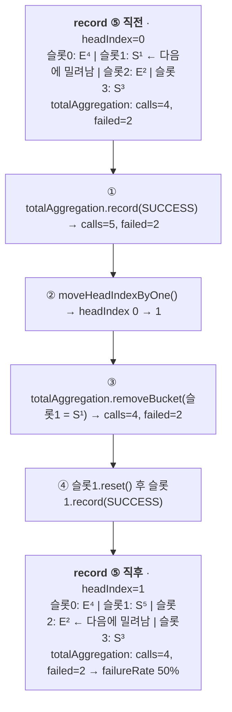

# 슬라이딩 윈도 ① 횟수 기반 — 전체 호출을 기억하지 않고 센다

`slidingWindowSize=2000` 이라고 적으면 2000건의 호출 기록이 메모리에 쌓일까? 아니다. 슬롯마다 `int` 4개와 `long` 1개가 전부다. 원형 배열과 subtract-on-evict, lock-free 구현의 `PackedAggregation` 배열 레이아웃까지 소스로 확인한다.

## 목차
- [1. 핵심 개념 (What)](#1-핵심-개념-what)
- [2. 왜 알아야 하는가 (Why)](#2-왜-알아야-하는가-why)
- [3. 내부 구현 분석 (How)](#3-내부-구현-분석-how)
- [4. 실전 예제](#4-실전-예제)
- [5. 정리](#5-정리)
---

## 1. 핵심 개념 (What)

횟수 기반(count-based) 슬라이딩 윈도는 "최근 N 번의 호출"만 보고 실패율을 판단한다. `core/metrics/Metrics.java` 가 계약 전부다.

```java
public interface Metrics {
    Snapshot record(long duration, TimeUnit durationUnit, Outcome outcome);
    Snapshot getSnapshot();
    enum Outcome { SUCCESS, ERROR, SLOW_SUCCESS, SLOW_ERROR }
}
```

`Outcome` 이 4개인 게 핵심 설계다. 실패(`ERROR`)와 느림(`SLOW_SUCCESS`)이 **직교하는 두 축**이고 둘 다 해당하면 `SLOW_ERROR` 다. 그래서 `failureRateThreshold` 와 `slowCallRateThreshold` 를 독립적으로 건다.

### v2.4.0 에는 횟수 기반 구현이 두 개 있다
| 구현 | 동시성 제어 | 집계 자료구조 | 선택 방법 |
|---|---|---|---|
| `FixedSizeSlidingWindowMetrics` | `ReentrantLock` | 원형 배열 `Measurement[]` + `TotalAggregation` | `SlidingWindowSynchronizationStrategy.SYNCHRONIZED` (기본값) |
| `LockFreeFixedSizeSlidingWindowMetrics` | `VarHandle` CAS | 링크드 리스트 노드 + `PackedAggregation` | `SlidingWindowSynchronizationStrategy.LOCK_FREE` |

`CircuitBreakerMetrics.buildCountBasedMetrics(int, SlidingWindowSynchronizationStrategy)` 가 `strategy == SYNCHRONIZED` 면 `new FixedSizeSlidingWindowMetrics(slidingWindowSize)`, 아니면 `new LockFreeFixedSizeSlidingWindowMetrics(slidingWindowSize)` 를 돌려주는 2분기로 끝난다.

> **이름에 속지 말 것.** enum 값 이름은 `SYNCHRONIZED` 지만 `FixedSizeSlidingWindowMetrics` 의 실제 구현은 `synchronized` 키워드가 아니라 `private final ReentrantLock lock = new ReentrantLock();` 이다. 가상 스레드에서 `synchronized` 블로킹이 pinning 을 유발하기 때문이다 (`ReentrantLock` 은 `LockSupport.park()` 를 쓰므로 캐리어 스레드를 놓아준다). enum 이름만 하위 호환으로 남았다.

`CircuitBreakerConfig` 의 관련 기본값: `DEFAULT_SLIDING_WINDOW_TYPE = COUNT_BASED`, `DEFAULT_SLIDING_WINDOW_SIZE = 100`, `DEFAULT_MINIMUM_NUMBER_OF_CALLS = 100`, `DEFAULT_SLIDING_WINDOW_SYNCHRONIZATION_STRATEGY = SYNCHRONIZED`.
## 2. 왜 알아야 하는가 (Why)

**(1) `slidingWindowSize` 를 감으로 정하면 안 된다.** 이 값은 "서킷이 몇 초 분량의 과거를 보고 판단하는가"를 결정한다. 윈도가 작으면 플래핑(flapping), 크면 장애 감지가 늦으므로 트래픽량으로 역산해야 한다.

**(2) `minimumNumberOfCalls` 는 횟수 기반에서만 윈도 크기로 상한이 걸린다.** `CircuitBreakerMetrics` 생성자가 타입에 따라 갈린다.

```java
if (slidingWindowType == CircuitBreakerConfig.SlidingWindowType.COUNT_BASED) {
    this.metrics = buildCountBasedMetrics(slidingWindowSize, ...);
    this.minimumNumberOfCalls = Math
        .min(circuitBreakerConfig.getMinimumNumberOfCalls(), slidingWindowSize);
} else {
    this.metrics = buildTimeBasedMetrics(...);
    this.minimumNumberOfCalls = circuitBreakerConfig.getMinimumNumberOfCalls();
}
```

횟수 기반에서는 윈도보다 큰 `minimumNumberOfCalls` 가 조용히 윈도 크기로 잘린다. **시간 기반에는 이 보정이 없다** — 실제 트래픽보다 큰 값을 적으면 서킷이 영원히 안 열린다.

**(3) HALF_OPEN 은 항상 횟수 기반이다.** `CircuitBreakerMetrics.forHalfOpen(permittedNumberOfCallsInHalfOpenState, config)` 가 두 번째 인자로 `SlidingWindowType.COUNT_BASED` 를 못 박아 넘긴다. `slidingWindowType=TIME_BASED` 로 설정했어도 HALF_OPEN 구간은 `permittedNumberOfCallsInHalfOpenState` 크기의 횟수 기반 윈도를 쓴다. 이 문서는 시간 기반을 쓰는 사람에게도 절반은 해당된다.
## 3. 내부 구현 분석 (How)

### 집계만 유지한다 — `AbstractAggregation`
모든 집계 자료구조의 베이스다. 필드가 5개뿐이다.

```java
abstract class AbstractAggregation implements CumulativeMeasurement {
    long totalDurationInMillis = 0;
    int numberOfSlowCalls = 0, numberOfSlowFailedCalls = 0;   // 원본은 각 줄에 하나씩 선언
    int numberOfFailedCalls = 0, numberOfCalls = 0;

    public void record(long duration, TimeUnit durationUnit, Metrics.Outcome outcome) {
        this.numberOfCalls++;
        this.totalDurationInMillis += durationUnit.toMillis(duration);
        switch (outcome) {
            case SLOW_SUCCESS: numberOfSlowCalls++; break;
            case SLOW_ERROR:   numberOfSlowCalls++; numberOfFailedCalls++;
                               numberOfSlowFailedCalls++; break;
            case ERROR:        numberOfFailedCalls++; break;
            default:           break;   // SUCCESS — numberOfCalls 만 올라간다
        }
    }
}
```

- **`SUCCESS` 는 `default:` 로 빠진다.** 성공은 `numberOfCalls` 만 올리는 가장 싼 경로다.
- **`SLOW_ERROR` 는 세 카운터를 동시에 올린다.** 이 중복 집계 덕분에 `Snapshot` 이 "느린 성공 호출 수"를 `numberOfSlowCalls - numberOfSlowFailedCalls` 로 역산한다.
- **타임스탬프가 없다.** `totalDurationInMillis` 는 누적 합계일 뿐, 개별 호출의 시각·소요 시간은 어디에도 남지 않는다. p99 같은 분위수는 못 뽑고 평균만 가능하다(`getAverageDuration()`).

여기서 파생되는 두 구현체가 서로 반대 방향으로 쓰인다. `Measurement` 는 원형 배열의 각 슬롯이고 재사용을 위한 `reset()`(5개 필드를 전부 0 으로)만 추가한다. `TotalAggregation` 은 윈도 전체 합계로, 밀려난 슬롯을 빼는 메서드를 추가한다.

```java
// TotalAggregation.java
class TotalAggregation extends AbstractAggregation {
    void removeBucket(AbstractAggregation bucket) {
        this.totalDurationInMillis -= bucket.totalDurationInMillis;
        this.numberOfSlowCalls -= bucket.numberOfSlowCalls;
        this.numberOfSlowFailedCalls -= bucket.numberOfSlowFailedCalls;
        this.numberOfFailedCalls -= bucket.numberOfFailedCalls;
        this.numberOfCalls -= bucket.numberOfCalls;
    }
}
```

`record()` 로 더하고 `removeBucket()` 으로 뺀다. 이 두 메서드가 **subtract-on-evict** 의 전부다. `FixedSizeSlidingWindowMetrics` 의 클래스 javadoc 이 그대로 설명한다.

> When the oldest measurement is evicted, the measurement is subtracted from the total aggregation. (Subtract-on-Evict) ... The time to retrieve a Snapshot is constant 0(1), since the Snapshot is pre-aggregated and is independent of the window size. The space requirement (memory consumption) of this implementation should be O(n).

### `FixedSizeSlidingWindowMetrics` — 핵심 메서드
생성자는 `measurements = new Measurement[windowSize]` 를 만들고 루프로 **슬롯을 전부 미리 할당**한 뒤 `headIndex = 0`, `totalAggregation = new TotalAggregation()` 으로 끝난다. 런타임에는 객체를 만들지 않고 슬롯을 `reset()` 으로 재사용하므로 `slidingWindowSize=2000` 이면 부팅 시 2000개를 만들고 끝이다.

```java
@Override
public Snapshot record(long duration, TimeUnit durationUnit, Outcome outcome) {
    lock.lock();                                  // private final ReentrantLock lock
    try {
        totalAggregation.record(duration, durationUnit, outcome);
        moveWindowByOne().record(duration, durationUnit, outcome);
        return new SnapshotImpl(totalAggregation);
    } finally {
        lock.unlock();
    }
}
private Measurement moveWindowByOne() {
    moveHeadIndexByOne();                         // headIndex = (headIndex + 1) % windowSize
    Measurement latestMeasurement = getLatestMeasurement();   // measurements[headIndex]
    totalAggregation.removeBucket(latestMeasurement);
    latestMeasurement.reset();
    return latestMeasurement;
}
```

(`getSnapshot()` 도 같은 락을 잡고 `new SnapshotImpl(totalAggregation)` 만 돌려준다.)

- **`record()` 의 순서**: 더하기 → 밀기 → 기록 → 스냅샷. **`totalAggregation.record()` 가 `moveWindowByOne()` 보다 먼저**인 게 중요하다. 반대였다면 새로 기록할 값이 바로 다음에 밀려날 슬롯과 섞인다.
- **`moveWindowByOne()` 4줄**: ① `headIndex` 한 칸 전진 ② 그 위치의 슬롯(= 가장 오래된 슬롯) 획득 ③ 그 슬롯의 집계를 `totalAggregation` 에서 **뺌** ④ 슬롯을 비우고 반환 — 호출자가 그 빈 슬롯에 새 값을 기록한다.
- **`new SnapshotImpl(totalAggregation)`** 은 락 안에서 만드는 불변 스냅샷이다. 생성자가 5개 필드를 `final` 로 복사하므로 락을 놓은 뒤에도 값이 변하지 않는다 — `checkIfThresholdsExceeded(snapshot)` 가 락 밖에서 안전하게 판정할 수 있는 이유다.

### 원형 배열이 전진하는 과정 추적
`windowSize=4` 로 7번 기록해보자. S(성공), E(실패).

| 호출 | `headIndex` | 밀려난 슬롯 | `total.numberOfCalls` | 윈도 내용 (슬롯 0~3) |
|---|---|---|---|---|
| 초기 | 0 | — | 0 | `[ -, -, -, - ]` |
| ① S | 0 → 1 | 슬롯1 (빈 상태) | 1 | `[ -, S¹, -, - ]` |
| ② E | 1 → 2 | 슬롯2 (빈 상태) | 2 | `[ -, S¹, E², - ]` |
| ③ S | 2 → 3 | 슬롯3 (빈 상태) | 3 | `[ -, S¹, E², S³ ]` |
| ④ E | 3 → 0 | 슬롯0 (빈 상태) | 4 | `[ E⁴, S¹, E², S³ ]` ← 윈도 가득 |
| ⑤ S | 0 → 1 | 슬롯1 (**S¹ 제거**) | 4 | `[ E⁴, S⁵, E², S³ ]` |
| ⑥ S | 1 → 2 | 슬롯2 (**E² 제거**) | 4 | `[ E⁴, S⁵, S⁶, S³ ]` |
| ⑦ E | 2 → 3 | 슬롯3 (**S³ 제거**) | 4 | `[ E⁴, S⁵, S⁶, E⁷ ]` |



관찰 포인트 셋. **(1)** 워밍업 구간(첫 `windowSize` 번)에는 빈 슬롯을 밀어내 `removeBucket()` 이 사실상 no-op 이므로 `total.numberOfCalls` 가 1,2,3,4 로 올라가다 가득 찬 뒤 4 로 고정된다. **(2)** `headIndex` 는 "가장 최근에 기록된 슬롯"을 가리킨다 — 전진 후의 슬롯이 곧 가장 오래된 슬롯이라는 게 원형 배열의 성질이다. **(3)** 각 슬롯이 담는 호출 수는 정확히 1 이다. `moveWindowByOne()` 이 매 호출마다 불리기 때문. 같은 `AbstractAggregation` 코드를 시간 기반(`SlidingTimeWindowMetrics`)이 재사용할 때는 한 슬롯이 1초 분량의 여러 호출을 담는다 — 그래서 `PartialAggregation` 에만 `epochSecond` 필드가 있다.

### `Snapshot` 계산식
`SnapshotImpl` 은 5개 값을 복사해 보관하고 나머지는 전부 그 자리에서 계산한다.

| 메서드 | 계산식 | 주의 |
|---|---|---|
| `getFailureRate()` | `failed * 100.0f / total` | **퍼센트**(0~100). 0.5 가 아니라 50 — `failureRateThreshold(50f)` 와 같은 스케일 |
| `getSlowCallRate()` | `slow * 100.0f / total` | 퍼센트. 느린 실패도 분자에 포함 |
| `getTotalDuration()` | `Duration.ofMillis(totalDurationInMillis)` | **밀리초 정밀도** — 기록 시 `durationUnit.toMillis(duration)` 로 잘린다 |
| `getAverageDuration()` | `Duration.ofMillis(totalDurationInMillis / totalNumberOfCalls)` | 정수 나눗셈. 1ms 미만 호출은 0 으로 집계되어 평균이 0 이 될 수 있다 |
| `getNumberOfSuccessfulCalls()` / `getNumberOfSlowSuccessfulCalls()` | `total - failed` / `slow - slowFailed` | 별도 카운터가 없다. 뒤쪽은 이중 집계의 결과물 |

앞의 네 개는 모두 `if (totalNumberOfCalls == 0) return 0;`(또는 `Duration.ZERO`) 가드로 시작한다. 하지만 서킷이 "호출 0건 = 실패율 0%" 로 판단하는 건 아니다 — `CircuitBreakerMetrics.getFailureRate(Snapshot)` 가 한 겹 더 감싸, `bufferedCalls == 0 || bufferedCalls < minimumNumberOfCalls` 면 `-1.0f` 를 돌려준다. 이 `-1.0f` 가 "판단 보류"의 센티넬이고 `checkIfThresholdsExceeded()` 가 받아 `Result.BELOW_MINIMUM_CALLS_THRESHOLD` 로 바꾼다. **`Snapshot` 레벨의 0 과 `CircuitBreakerMetrics` 레벨의 -1 을 혼동하지 말 것.**

### `PackedAggregation` — lock-free 구현의 배열 레이아웃
`LOCK_FREE` 를 고르면 집계 타입이 `PackedAggregation` 으로 바뀐다. 필드가 두 개의 원시 배열이다.

```java
public class PackedAggregation implements CumulativeMeasurement {
    private long[] durations = new long[2];   // [0]=윈도 전체 합계, [1]=이 슬롯 몫
    private int[] counts = new int[8];        // [0..3]=전체, [4..7]=이 슬롯 몫

    // 상수: TOTAL_DURATION=0, DURATION=1 / TOTAL_{SLOW_CALLS,FAILED_SLOW_CALLS,FAILED_CALLS,CALLS}=0..3
    //      / {SLOW_CALLS,FAILED_SLOW_CALLS,FAILED_CALLS,CALLS}=4..7

    void discard(PackedAggregation discarded) {
        // 밀려날 노드의 "슬롯 몫"(홀수/4~7 인덱스)을 내 "전체 합계"(0~3)에서 뺀다
        durations[TOTAL_DURATION_INDEX] -= discarded.durations[DURATION_INDEX];
        counts[TOTAL_SLOW_CALLS_INDEX] -= discarded.counts[SLOW_CALLS_INDEX];
        counts[TOTAL_FAILED_SLOW_CALLS_INDEX] -= discarded.counts[FAILED_SLOW_CALLS_INDEX];
        counts[TOTAL_FAILED_CALLS_INDEX] -= discarded.counts[FAILED_CALLS_INDEX];
        counts[TOTAL_CALLS_INDEX] -= discarded.counts[CALLS_INDEX];
        // 그리고 내 슬롯 몫은 전부 0 으로 초기화 (durations[1], counts[4..7])
    }

    PackedAggregation copy() { return new PackedAggregation(durations.clone(), counts.clone()); }
}
```

핵심은 **하나의 객체가 "윈도 전체 합계"와 "이 슬롯 몫" 두 벌을 동시에 들고 있다**는 점이다. `record()` 도 `counts[TOTAL_CALLS_INDEX]++; counts[CALLS_INDEX]++;` 처럼 전체/슬롯 쌍을 함께 올린다. 그리고 `discard()` 는 **"밀려날 노드의 슬롯 몫"을 "내 전체 합계"에서 뺀다** — `removeBucket()` 과 같은 일인데, 합계를 공유 객체 하나가 아니라 **매 노드가 자기 버전으로** 들고 있다는 점이 다르다.

왜 이 레이아웃인가. 클래스 javadoc 이 "being **cache friendly**, benefiting from cache locality when counting/discarding" 와 "metrics can also be **quickly cloned**, which is important for the lock-free algorithms which are operating with immutable objects" 두 가지를 댄다.

5개 `int` 필드를 흩어진 객체 필드로 두는 대신 `int[8]` 하나로 모으면 32바이트, 캐시 라인 하나에 들어간다. `discard()` 가 8개 값을 연속으로 건드리므로 캐시 미스가 한 번뿐이다. 그리고 `clone()` 은 `System.arraycopy` 로 내려가는 intrinsic 이라 필드별 복사보다 빠르다 — lock-free 는 "복제해서 수정하고 CAS 로 갈아끼우는" 패턴이라 복제 비용이 핫패스에 있다.

`LockFreeFixedSizeSlidingWindowMetrics.record()` 의 핵심부가 이걸 쓴다 — `tail.next` 가 비어 있으면 `PackedAggregation nextStats = tail.stats.copy()` 로 **복제**하고, `nextStats.discard(head.stats)` 로 가장 오래된 슬롯 몫을 빼고, `nextStats.record(...)` 로 새 값을 더한 `Node` 를 만들어 `NEXT.compareAndSet(tail, null, nextNode)` 로 잇는다. 성공하면 `HEAD.weakCompareAndSet` → `TAIL.weakCompareAndSet` 으로 두 포인터를 밀고 `new SnapshotImpl(nextNode.stats)` 를 반환한다.

**트레이드오프가 명확하다.** 락이 없어 스레드가 서로를 막지 않지만, 호출마다 `PackedAggregation` + `Node` 객체가 새로 생긴다. `CircuitBreakerConfig.SlidingWindowSynchronizationStrategy` 의 javadoc 이 그대로 적어뒀다 — `LOCK_FREE` 는 "preferable in cases of high concurrency ... It has the disadvantage of **allocating more objects** as they cannot be mutated in place", `SYNCHRONIZED` 는 "This option **does not allocate extra memory**, but threads can block each other".

즉 **기본값(`SYNCHRONIZED`)이 할당 0, `LOCK_FREE` 가 할당 많음**이다. "lock-free 가 항상 빠르다"는 직관과 반대 방향의 비용이 있다. 자세한 알고리즘은 05 문서에서 시간 기반 버전과 함께 다룬다.

### 왜 이 설계인가 — 호출 기록을 안 들고 있는 이점
슬롯 하나(`Measurement`)는 객체 헤더 + `long` 1개 + `int` 4개로, 64비트 JVM + 압축 OOP 에서 대략 **슬롯당 40바이트 내외**다. 인스턴스 하나당 `slidingWindowSize=100` 이면 약 4KB, 2,000 이면 약 80KB, 10,000 이면 약 400KB — 전부 생성 시 1회 할당이고 **런타임 할당이 0** 이다(`record()` 가 만드는 건 짧은 수명의 `SnapshotImpl` 하나).

| 축 | 집계만 유지 (Resilience4j) | 호출 기록 보관 방식 |
|---|---|---|
| 메모리 / 런타임 할당 | 윈도 크기에 비례(O(n)), 호출량과 무관 / 0(`SYNCHRONIZED`), 호출당 2객체(`LOCK_FREE`) | 윈도 크기 × 레코드 크기 / 호출당 레코드 1개 이상 |
| GC 압력 | 거의 없음 | young gen 압력, 장애 시 폭증 |
| `getSnapshot()` | **O(1)** — 미리 집계된 합계를 복사 | O(n) — 버킷 순회 합산 |
| 뽑을 수 있는 정보 | 개수, 합계, 평균 | 분위수(p99), 개별 호출 추적 |

마지막 줄이 trade-off 다. **p99 는 못 구한다.** 그 대신 장애 상황 — 호출이 폭증하고 실패가 쏟아지는 순간 — 에 GC 가 멈추지 않는다. 서킷브레이커가 가장 필요한 순간에 서킷브레이커 자신이 장애 원인이 되지 않는 것이 이 설계의 목적이다. 분위수는 `resilience4j-micrometer` 의 `Timer` 데코레이터로 따로 얻어라.

**락이 보호하는 지점과 그 비용.** `record()` 와 `getSnapshot()` 둘 다 같은 `ReentrantLock` 을 잡는다. 락 구간 안의 작업은 산술 연산 열 몇 개와 작은 객체 할당 하나 — 수십 나노초다. 하지만 **CircuitBreaker 인스턴스 하나에 모든 호출 스레드가 몰리므로** 초당 수만 요청이 한 인스턴스를 통과하면 이 락이 직렬화 지점(serialization point)이 된다. `getSnapshot()` 까지 락을 잡는 이유는 5개 필드를 읽는 동안 다른 스레드의 `record()` 가 찢어진 값(torn read)을 만들 수 있기 때문 — Micrometer scrape 주기를 과하게 짧게 잡지 말아야 하는 숨은 이유다.

판단 기준: 인스턴스당 초당 수천 호출 이하면 기본값(`SYNCHRONIZED`)으로 충분하다(락 경합보다 GC 가 더 비싸다). 초당 수만 호출 + 코어 많은 머신이면 `LOCK_FREE` 를 측정해볼 가치가 있는데, **측정 없이 바꾸지 말 것** — 할당 증가가 GC 를 통해 되돌아온다. 어느 쪽이든 이름이 같은 CircuitBreaker 를 과하게 공유하고 있는 게 아닌지부터 확인해라. 백엔드별로 쪼개면 락 경합도 같이 쪼개진다.

## 4. 실전 예제

### 예제 1 — 트래픽량으로부터 `slidingWindowSize` 를 역산하기
공식은 하나다. `slidingWindowSize = (초당 요청 수) × (판단에 쓰고 싶은 관측 구간, 초)`

| 상황 | 초당 요청 | 관측 구간 | `slidingWindowSize` | `minimumNumberOfCalls` |
|---|---|---|---|---|
| 핵심 결제 API | 200 | 10초 | 2,000 | 200 (1초 분량) |
| 내부 조회 API | 50 | 20초 | 1,000 | 100 |
| 저트래픽 배치 연동 | 0.5 | — | **시간 기반을 써라** | 5~10 |

**저트래픽에는 횟수 기반을 쓰면 안 된다.** 초당 0.5 요청에 `slidingWindowSize=100` 이면 윈도가 **200초 분량의 과거**를 들고 있어, 3분 전에 복구된 장애가 아직도 실패율에 반영된다.

```java
package com.example.resilience;

import io.github.resilience4j.circuitbreaker.CircuitBreakerConfig;

import java.time.Duration;

/** 트래픽 특성으로부터 윈도 설정을 계산한다. 감으로 적는 대신 이걸 쓰면 근거를 댈 수 있다. */
public final class SlidingWindowSizing {

    /** rps=피크 시 인스턴스당 초당 요청, observationSeconds=관측 구간(보통 5~15),
     *  minimumObservationSeconds=판단에 필요한 최소 분량(보통 1~2) */
    public static CircuitBreakerConfig countBased(double rps, int observationSeconds,
                                                  int minimumObservationSeconds) {
        int windowSize = (int) Math.ceil(rps * observationSeconds);
        int minimumCalls = (int) Math.ceil(rps * minimumObservationSeconds);

        // CircuitBreakerMetrics 가 Math.min(minimumCalls, windowSize) 로 자동 보정하지만,
        // 설정이 조용히 잘리는 건 좋지 않으므로 여기서 명시적으로 막는다.
        if (minimumCalls > windowSize) {
            throw new IllegalArgumentException(
                "minimumNumberOfCalls(%d) > slidingWindowSize(%d) — 윈도 크기로 잘립니다"
                    .formatted(minimumCalls, windowSize));
        }
        if (windowSize < 50) {   // 너무 작으면 플래핑한다. 예제 2 참고.
            throw new IllegalArgumentException(
                "slidingWindowSize=%d 는 너무 작습니다. TIME_BASED 를 검토하세요".formatted(windowSize));
        }

        return CircuitBreakerConfig.custom()
            .slidingWindowType(CircuitBreakerConfig.SlidingWindowType.COUNT_BASED)
            .slidingWindowSize(windowSize).minimumNumberOfCalls(minimumCalls)
            .failureRateThreshold(50f)
            .slowCallDurationThreshold(Duration.ofSeconds(2)).slowCallRateThreshold(70f)
            .waitDurationInOpenState(Duration.ofSeconds(10))
            // HALF_OPEN 은 무조건 횟수 기반 윈도를 쓴다 (CircuitBreakerMetrics.forHalfOpen)
            .permittedNumberOfCallsInHalfOpenState(Math.max(5, (int) Math.ceil(rps)))
            .build();
    }

    /** 저트래픽용. 호출이 드물면 횟수 기반 윈도는 너무 오래된 과거를 들고 있게 된다. */
    public static CircuitBreakerConfig timeBasedForLowTraffic(int windowSeconds, int minimumCalls) {
        return CircuitBreakerConfig.custom()
            .slidingWindowType(CircuitBreakerConfig.SlidingWindowType.TIME_BASED)
            .slidingWindowSize(windowSeconds)       // TIME_BASED 에서는 단위가 '초'
            .minimumNumberOfCalls(minimumCalls)     // 여기엔 Math.min 보정이 없다!
            .failureRateThreshold(50f)
            .waitDurationInOpenState(Duration.ofSeconds(30))
            .permittedNumberOfCallsInHalfOpenState(3).build();
    }
}
```

> `TIME_BASED` 에서 `slidingWindowSize` 의 단위는 **초**다. 같은 프로퍼티 이름이 타입에 따라 "건수"와 "초"로 바뀐다. 리뷰에서 `slidingWindowType` 과 `slidingWindowSize` 를 항상 짝으로 봐야 하는 이유다.

### 예제 2 — 윈도가 너무 작을 때의 플래핑 재현
같은 실패 패턴을 윈도 크기만 바꿔 흘려보내 상태 전이 횟수를 센다.

```java
package com.example.resilience;

import io.github.resilience4j.circuitbreaker.*;

import java.time.Duration;
import java.util.Random;
import java.util.concurrent.atomic.AtomicInteger;

/** 작은 윈도: 실패가 우연히 몰리면 순간 실패율이 임계값을 넘겨 OPEN → 플래핑.
 *  큰 윈도: 같은 패턴이 평균으로 희석되어 CLOSED 유지. */
public final class FlappingDemo {

    private static final double FAILURE_PROBABILITY = 0.10;   // 평균 10% 실패
    private static final int TOTAL_CALLS = 5_000;

    public static void main(String[] args) {
        run(10); run(100); run(1_000);   // 너무 작은 / 기본값 / 충분히 큰 윈도
    }

    private static void run(int windowSize) {
        CircuitBreakerConfig config = CircuitBreakerConfig.custom()
            .slidingWindowType(CircuitBreakerConfig.SlidingWindowType.COUNT_BASED)
            .slidingWindowSize(windowSize)
            // COUNT_BASED 라 Math.min(minimumNumberOfCalls, slidingWindowSize) 보정이 걸린다
            .minimumNumberOfCalls(windowSize)
            .failureRateThreshold(20f)                 // 평균 실패율(10%)의 2배
            .waitDurationInOpenState(Duration.ofMillis(50))
            .permittedNumberOfCallsInHalfOpenState(3)
            .build();

        CircuitBreaker cb = CircuitBreaker.of("flap-" + windowSize, config);
        AtomicInteger transitions = new AtomicInteger();
        AtomicInteger rejected = new AtomicInteger();
        cb.getEventPublisher().onStateTransition(e -> transitions.incrementAndGet());
        Random random = new Random(42);   // 동일 시드로 공정 비교

        for (int i = 0; i < TOTAL_CALLS; i++) {
            try {
                cb.executeRunnable(() -> {
                    if (random.nextDouble() < FAILURE_PROBABILITY) {
                        throw new IllegalStateException("transient failure");
                    }
                });
            } catch (CallNotPermittedException e) {
                rejected.incrementAndGet();
                sleepQuietly(1);                  // OPEN 구간을 지나가게 한다
            } catch (RuntimeException ignored) {
                // 의도된 실패
            }
        }

        CircuitBreaker.Metrics m = cb.getMetrics();
        System.out.printf("windowSize=%5d → 전이 %3d회, 거부 %5d건, 최종 %-9s rate=%5.1f%%, buffered=%d%n",
            windowSize, transitions.get(), rejected.get(), cb.getState(),
            m.getFailureRate(), m.getNumberOfBufferedCalls());
    }

    private static void sleepQuietly(long millis) {
        try { Thread.sleep(millis); }
        catch (InterruptedException e) { Thread.currentThread().interrupt(); }
    }
}
```

왜 이렇게 되는지는 통계로 설명된다. 평균 실패율 10%, 윈도 크기 n 일 때 윈도 내 실패 비율의 표준편차는 대략 `sqrt(0.1 × 0.9 / n)` 이다.

| `slidingWindowSize` | 실패율 표준편차 | 임계값 20% 까지 | 결과 |
|---|---|---|---|
| 10 | 약 9.5%p | 약 1.1σ | **자주 넘는다** → 플래핑 |
| 100 | 약 3.0%p | 약 3.3σ | 드물게 넘음 |
| 1,000 | 약 0.95%p | 약 10σ | 사실상 안 넘음 |

실무 규칙: **`failureRateThreshold` 는 평상시 실패율의 최소 2배 이상**, **`slidingWindowSize` 는 최소 100 이상**(그보다 작아야 할 트래픽이면 `TIME_BASED`). 플래핑이 의심되면 `CircuitBreakerOnStateTransitionEvent` 를 카운트해 지표로 올려라(03 문서 예제 2). OPEN 전이가 분당 여러 번이면 설정 문제다.

## 5. 정리

| 항목 | 내용 |
|---|---|
| 핵심 아이디어 | 호출 기록을 보관하지 않고 **집계값만** 유지. 더하기(`record`) + 밀려난 것 빼기(`removeBucket`) = subtract-on-evict |
| 구현 2종 | `FixedSizeSlidingWindowMetrics`(`ReentrantLock`, 기본) / `LockFreeFixedSizeSlidingWindowMetrics`(`VarHandle` CAS). enum 값 이름은 `SYNCHRONIZED` 지만 실제 구현은 `ReentrantLock` — 가상 스레드 pinning 회피 목적 |
| 집계 필드 | `AbstractAggregation` 의 `totalDurationInMillis`, `numberOfSlowCalls`, `numberOfSlowFailedCalls`, `numberOfFailedCalls`, `numberOfCalls` — 5개가 전부 |
| 자료구조 | `Measurement[] measurements` 원형 배열 + `headIndex = (headIndex + 1) % windowSize`. 생성자에서 슬롯 전부 미리 할당해 런타임 할당은 `SnapshotImpl` 하나뿐(`SYNCHRONIZED`) |
| `moveWindowByOne()` | ① headIndex 전진 ② 그 슬롯(=가장 오래된 것) 획득 ③ `totalAggregation.removeBucket()` ④ `reset()` 후 반환 |
| `Snapshot` 계산 | `getFailureRate() = failed * 100.0f / total` — **퍼센트 스케일**, 호출 0건이면 0. 반면 `CircuitBreakerMetrics.getFailureRate(snapshot)` 는 `-1.0f`(판단 보류) → `Result.BELOW_MINIMUM_CALLS_THRESHOLD` |
| `PackedAggregation` | `long[2]` + `int[8]`. 인덱스 0~3 이 윈도 전체 합계, 4~7 이 이 슬롯 몫. 캐시 지역성 + `clone()` 속도 목적 |
| `LOCK_FREE` 대가 | 락 경합은 없지만 호출당 `PackedAggregation` + `Node` 할당(javadoc 이 명시). 어느 쪽이든 분위수(p99)는 못 구한다 — 타임스탬프를 보관하지 않으므로 평균만. 필요하면 Micrometer `Timer` 병행 |
| `minimumNumberOfCalls` | 횟수 기반은 `Math.min(min, windowSize)` 로 보정, **시간 기반은 보정 없음**. HALF_OPEN 은 설정과 무관하게 **항상 횟수 기반**이고 크기는 `permittedNumberOfCallsInHalfOpenState` |
| 사이징·플래핑 | `slidingWindowSize = 초당 요청 수 × 관측 구간(초)`, 최소 100 이상(그 이하면 `TIME_BASED`). `failureRateThreshold` 는 평상시 실패율의 2배 이상 |

---

## 관련 문서
- 선행: [이벤트 파이프라인 — EventProcessor는 어떻게 동작하나](./03-event-processor.md)
- 후행: [슬라이딩 윈도 ② 시간 기반 — lock-free 구현](./05-sliding-window-time.md)
- 참고: [CircuitBreaker 상태 머신](./06-circuitbreaker-state-machine.md), [프로덕션 설계](../advanced/12-production-design.md)
---
*Resilience4j v2.4.0 기준 · 소스 커밋 7e3ab525*
