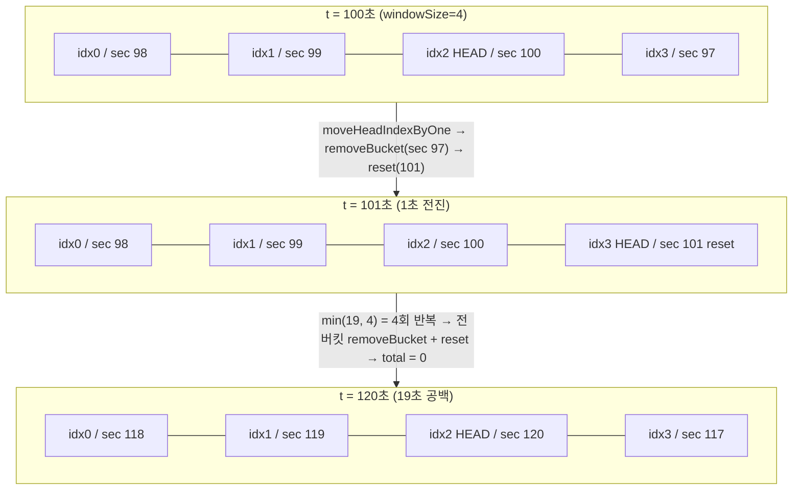
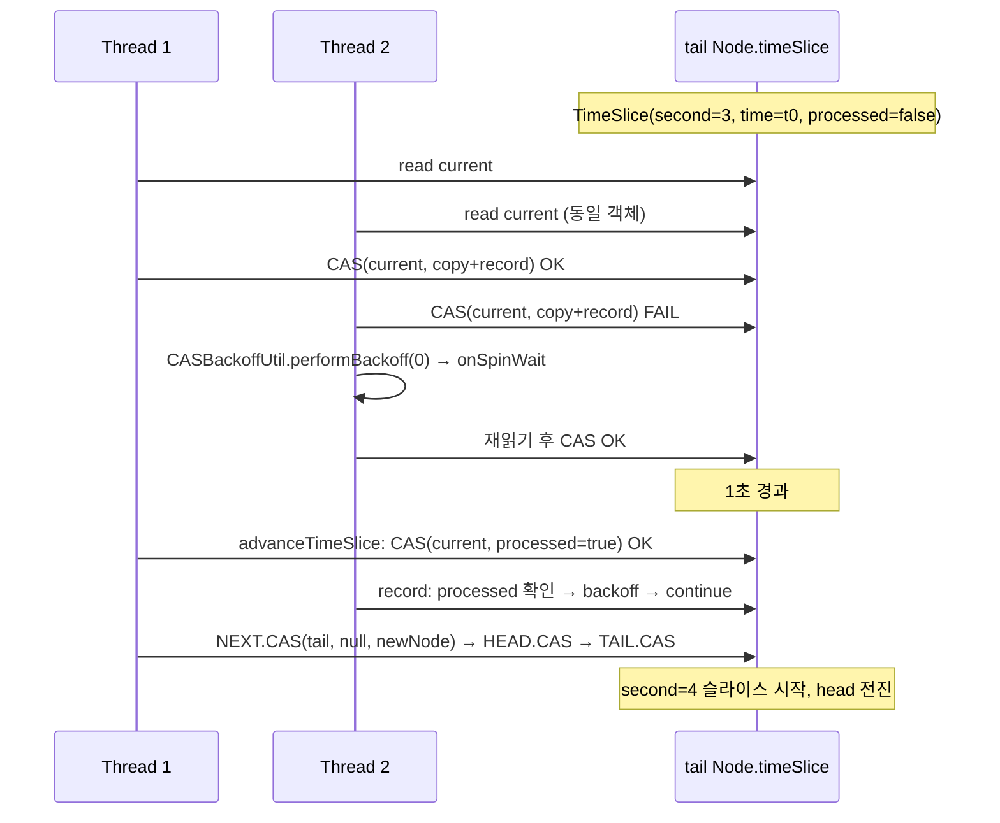

# 슬라이딩 윈도 ② 시간 기반과 lock-free 구현

시간 기반(TIME_BASED) 윈도는 "최근 N초"를 1초 버킷으로 쪼개 집계한다. 버킷 재사용 메커니즘, 저트래픽에서 윈도가 비어가는 이유, 그리고 락 없이 돌아가는 lock-free 구현의 트레이드오프를 소스로 추적한다.

## 목차
- [1. 핵심 개념 (What)](#1-핵심-개념-what)
- [2. 왜 알아야 하는가 (Why)](#2-왜-알아야-하는가-why)
- [3. 내부 구현 분석 (How)](#3-내부-구현-분석-how)
- [4. 실전 예제](#4-실전-예제)
- [5. 정리](#5-정리)

---

## 1. 핵심 개념 (What)

`SlidingTimeWindowMetrics` 의 클래스 주석이 설계를 거의 다 설명한다.

```java
 * The sliding time window is implemented with a circular array of {@code N} partial aggregations
 * (buckets). If the time window size is 10 seconds, the circular array has always 10 partial
 * aggregations (buckets). Every bucket aggregates the outcome of all calls which happen in a
 * certain epoch second. ... When the oldest bucket is evicted, the partial
 * total aggregation of that bucket is subtracted from the total aggregation. (Subtract-on-Evict)
```

| 구성요소 | 타입 | 역할 |
|---|---|---|
| `partialAggregations` | `PartialAggregation[]` | 길이 = `slidingWindowSize`(초). 초당 버킷 1개 |
| `headIndex` | `int` | "현재 초" 버킷의 인덱스 |
| `totalAggregation` | `TotalAggregation` | 윈도 전체 누적. 스냅샷은 여기서 바로 나온다 |
| `clock` | `java.time.Clock` | `clock.instant().getEpochSecond()` |

성질 두 가지가 중요하다.

1. **호출을 개별 저장하지 않는다.** 버킷은 `numberOfCalls`, `numberOfFailedCalls`, `numberOfSlowCalls`, `numberOfSlowFailedCalls`, `totalDurationInMillis` 다섯 숫자만 들고 있다(`AbstractAggregation`). 메모리는 윈도 크기에만 비례한다.
2. **스냅샷은 O(1)** 이다. `getSnapshot()` 은 버킷 N개를 순회하지 않고 `totalAggregation` 을 복사해 `SnapshotImpl` 로 감싼다 — 버킷 축출 시 `TotalAggregation.removeBucket()` 으로 미리 빼놨기 때문이다(Subtract-on-Evict).

v2.4.0에는 윈도 종류 × 동기화 전략으로 **네 개 구현체**가 있다.

| | SYNCHRONIZED (기본) | LOCK_FREE |
|---|---|---|
| COUNT_BASED | `FixedSizeSlidingWindowMetrics` | `LockFreeFixedSizeSlidingWindowMetrics` |
| TIME_BASED | `SlidingTimeWindowMetrics` | `LockFreeSlidingTimeWindowMetrics` |

---

## 2. 왜 알아야 하는가 (Why)

### 저트래픽 + TIME_BASED = 서킷 무력화

판정 게이트는 `CircuitBreakerMetrics.getFailureRate()` 에 있다.

```java
private float getFailureRate(Snapshot snapshot) {
    int bufferedCalls = snapshot.getTotalNumberOfCalls();
    if (bufferedCalls == 0 || bufferedCalls < minimumNumberOfCalls) {
        return -1.0f;
    }
    return snapshot.getFailureRate();
}
```

`-1.0f` 이면 `Result.BELOW_MINIMUM_CALLS_THRESHOLD` 가 되어 전이가 일어나지 않는다. **윈도 안 호출 수가 `minimumNumberOfCalls` 미만이면 실패율 100%여도 CLOSED를 유지한다.**

횟수 기반은 호출이 느리게 들어와도 최근 N건이 누적된다. 시간 기반은 1초가 지나면 그 초의 기록을 **버린다.** 분당 20건(0.33 RPS) 들어오는 배치 API에 `TIME_BASED size=10, minimumNumberOfCalls=10` 을 걸면 10초에 평균 3.3건만 쌓여 영원히 판정되지 않는다. 서킷이 장식이 된다.

### lock-free 는 "그냥 빠른 것"이 아니다

`SlidingWindowSynchronizationStrategy` enum 주석이 트레이드오프를 직접 적어뒀다.

```java
    LOCK_FREE,   // "preferable in cases of high concurrency ... disadvantage of allocating
                 //  more objects as they cannot be mutated in place"
    SYNCHRONIZED // "does not allocate extra memory, but threads can block each other"
```

lock-free 는 **호출마다 통계 객체를 복사한다**(`PackedAggregation.copy()` → `long[2].clone()` + `int[8].clone()`). 초당 수만 건 경로에서는 그대로 GC 압력이 된다. 리뷰에서 "동시성 높으니 LOCK_FREE" 라는 말이 나오면 되물을 질문은 "그 경로 QPS가 얼마고, allocation rate 증가를 감당할 힙인가?" 다.

### yml 로는 lock-free 를 켤 수 없다

`CommonCircuitBreakerConfigurationProperties.InstanceProperties` 에는 `slidingWindowType`, `slidingWindowSize` 는 있지만 `slidingWindowSynchronizationStrategy` 필드가 **없다**. `application.yml` 로 선택할 방법이 없고 `CircuitBreakerConfigCustomizer` 빈이 필수다. 이걸 모르면 yml 에 없는 키를 넣고 반나절을 보낸다.

---

## 3. 내부 구현 분석 (How)

### 3.1 버킷 회전

```java
@Override
public Snapshot record(long duration, TimeUnit durationUnit, Outcome outcome) {
    lock.lock();
    try {
        totalAggregation.record(duration, durationUnit, outcome);
        moveWindowToCurrentEpochSecond(getLatestPartialAggregation())
                .record(duration, durationUnit, outcome);
        return new SnapshotImpl(totalAggregation);
    } finally {
        lock.unlock();
    }
}
```

- 3행: `synchronized` 가 아니라 `ReentrantLock` 이다. `synchronized` 블록은 가상 스레드를 캐리어에 pin 할 수 있어 교체된 흔적이다.
- 5~7행: total 에 먼저 더하고, 윈도를 현재 초로 밀어 반환된 버킷에 **또** 더한다. total/bucket 이중 기록 구조다.
- 8행: 스냅샷은 total 의 복사본 — O(1).

심장은 윈도를 미는 로직이다.

```java
private PartialAggregation moveWindowToCurrentEpochSecond(
    PartialAggregation latestPartialAggregation) {
    long currentEpochSecond = clock.instant().getEpochSecond();
    long differenceInSeconds = currentEpochSecond - latestPartialAggregation.getEpochSecond();
    if (differenceInSeconds == 0) {
        return latestPartialAggregation;
    }
    long secondsToMoveTheWindow = Math.min(differenceInSeconds, timeWindowSizeInSeconds);
    PartialAggregation currentPartialAggregation;
    do {
        secondsToMoveTheWindow--;
        moveHeadIndexByOne();
        currentPartialAggregation = getLatestPartialAggregation();
        totalAggregation.removeBucket(currentPartialAggregation);
        currentPartialAggregation.reset(currentEpochSecond - secondsToMoveTheWindow);
    } while (secondsToMoveTheWindow > 0);
    return currentPartialAggregation;
}
```

- **5~7행**: 같은 초면 아무것도 안 한다. 1초에 1만 건이 와도 이 분기로 빠지니 핫패스는 정수 증가 두 번뿐이다.
- **8행**: `Math.min(차이, 윈도크기)`. **5분간 호출이 없었어도 버킷을 300번 돌리지 않는다.** 어차피 전부 비워지므로 윈도 크기만큼만 돈다. 긴 유휴 후 첫 호출의 지연이 윈도 크기에 bounded 된다.
- **12~16행**: 한 바퀴가 "한 초 전진"이다. head 를 옮기고 → 그 자리의(가장 오래된) 버킷을 total 에서 빼고 → 새 초로 `reset()`. **배열을 재할당하지 않고 가장 오래된 버킷을 재사용한다.** `removeBucket()` → `reset()` 순서가 뒤바뀌면 0을 빼게 되어 total 이 영원히 줄지 않는다.

여기서 저트래픽의 정체가 드러난다. `SlidingTimeWindowMetrics.getSnapshot()` 도 `moveWindowToCurrentEpochSecond()` 를 호출한다 — **호출이 없어도 지표를 조회하는 순간 윈도가 전진하며 과거가 사라진다.** 반면 `FixedSizeSlidingWindowMetrics.getSnapshot()` 은 윈도를 전혀 움직이지 않는다. 이 비대칭이 두 윈도의 성격을 결정한다.



### 3.2 lock-free: CAS 로 노드를 교체한다

구조부터 다르다. 원형 배열이 아니라 **단방향 연결 리스트**이고, `headRef`/`tailRef`/`Node.next` 를 `AtomicReference` 가 아닌 **`VarHandle`**(`MethodHandles.lookup().findVarHandle(...)`)로 CAS 한다 — 래퍼 객체를 줄이고 `weakCompareAndSet` 같은 완화 변종을 고를 수 있다. `LockFreeFixedSizeSlidingWindowMetrics.record()` 의 핵심부를 보자.

```java
if (tailNext == null) {
    int nextId = (tail.id + 1) % windowSize;
    PackedAggregation nextStats = tail.stats.copy();
    nextStats.discard(head.stats);
    nextStats.record(duration, durationUnit, outcome);
    Node nextNode = new Node(nextId, nextStats, null);

    if (NEXT.compareAndSet(tail, null, nextNode)) {
        if (HEAD.weakCompareAndSet(this, head, headNext)) {
            TAIL.weakCompareAndSet(this, tail, nextNode);
        }
        return new SnapshotImpl(nextNode.stats);
    }
} else if (tailNext.id == head.id) {
    if (HEAD.compareAndSet(this, head, headNext)) {
        TAIL.compareAndSet(this, tail, tailNext);
    }
} else {
    TAIL.compareAndSet(this, tail, tailNext);
}
```

- **3행**: 꼬리의 누적 통계를 **복사**한다. 제자리 수정이 불가능하므로 불변 스냅샷을 새로 만든다 — LOCK_FREE 의 allocation 비용.
- **4행**: `discard(head.stats)` 로 가장 오래된 몫을 뺀다(락 버전의 `removeBucket()` 과 같은 역할).
- **8행**: 진짜 경쟁 지점. `tail.next` 를 null→새 노드로 CAS. **성공한 스레드 하나만 윈도를 전진시킨다.**
- **9~10행**: head/tail 전진은 `weakCompareAndSet` — 주석대로 "spuriously fail 해도 다음 스레드가 마무리한다". 그래서 tail 이 뒤처질 수 있고, `getSnapshot()` 이 `Objects.requireNonNullElse(tailNext, tail).stats` 로 보정한다.

루프 선두의 `if (head != headRef) continue;` 는 ABA 방지가 아니라 **stale-read 방지**다. head 를 읽은 뒤 선점당한 사이 다른 스레드가 head 를 전진시키면, 리스트에서 떨어진 노드로 `discard()` 를 해버린다.

시간 기반(`LockFreeSlidingTimeWindowMetrics`)에서는 노드 ID가 `(second+1) % windowSize` 로 순환하므로 **ABA 문제가 정면으로 등장한다.** 해법은 `TimeSlice.time` 이다.

```java
int nextSecond = (tailTimeSlice.second + 1) % windowSize;

// This guarantees that only one thread advances the time slice.
// The time functions as a modification counter, helping us to avoid the ABA problem.
if (second != nextSecond || time < tailTimeSlice.time) {
    return;
}
```

`time` 은 `Clock.monotonicTime()`(= `System.nanoTime()`)에서 온 단조 증가값이라 **버전 카운터** 역할을 한다. 두 번째 장치는 `processed` 플래그다. `advanceTimeSlice()` 가 현재 슬라이스를 `processed=true` 로 CAS 교체하면, `record()` 는 그것을 보고 기록을 거부하고 재시도한다 — **지나간 초에 기록이 섞여 유실되는 것**을 막는다. 락 하나로 공짜로 얻는 보장을, lock-free 는 플래그 + CAS + 재시도로 사서 쓴다.

대가는 재시도 비용이고, 그래서 `CASBackoffUtil.performBackoff()` 가 필요하다.

```java
public static int performBackoff(int spinCount) {
    if (spinCount < MAX_SPIN_COUNT) {          // 100
        Thread.onSpinWait();
        return spinCount + 1;
    } else {
        long threadId = Thread.currentThread().threadId();
        int threadOffset = (int) (Math.abs(threadId) % JITTER_RANGE);  // 0~10
        long parkTime = MIN_PARK_NANOS + threadOffset * PARK_STEP_NANOS;  // 1~11µs
        LockSupport.parkNanos(parkTime);
        return 0;
    }
}
```

100회까지 `Thread.onSpinWait()`(컨텍스트 스위치 없는 CPU 힌트), 그 뒤 `LockSupport.parkNanos()`(가상 스레드가 캐리어를 점유하지 않고 내려갈 수 있는 유일한 길). park 시간에 **스레드 ID 기반 지터(1~11µs)** 를 섞어 동시 기상을 막는다. `ThreadLocal` 을 안 쓰는 이유도 주석에 있다 — 가상 스레드 수백만 개에서는 메모리 폭탄이니까.



### 3.3 어떤 설정이 어떤 구현을 고르는가

선택은 `CircuitBreakerMetrics` 생성자에서 끝난다.

```java
private Metrics buildTimeBasedMetrics(
    int slidingWindowSize, Clock clock,
    SlidingWindowSynchronizationStrategy slidingWindowSynchronizationStrategy) {
    if (slidingWindowSynchronizationStrategy == SlidingWindowSynchronizationStrategy.SYNCHRONIZED) {
        return new SlidingTimeWindowMetrics(slidingWindowSize, clock);
    } else {
        return new LockFreeSlidingTimeWindowMetrics(slidingWindowSize,
            io.github.resilience4j.core.Clock.SYSTEM);
    }
}
```

**함정: lock-free 경로는 `circuitBreakerConfig.getClock()` 을 무시하고 `Clock.SYSTEM` 을 하드코딩한다.** `java.time.Clock` 은 벽시계이고 `io.github.resilience4j.core.Clock` 은 `monotonicTime()` 을 요구하는 별도 인터페이스라 끼울 수 없다. 결과적으로 **테스트에서 `clock(Clock.fixed(...))` 로 시간을 조작하는 기법이 LOCK_FREE + TIME_BASED 에서는 통하지 않는다.**

기본값은 보수적이고(`DEFAULT_SLIDING_WINDOW_SYNCHRONIZATION_STRATEGY = SYNCHRONIZED`), 빌더에 검증이 하나 더 있다.

```java
if(slidingWindowType == SlidingWindowType.TIME_BASED
   && slidingWindowSynchronizationStrategy == SlidingWindowSynchronizationStrategy.LOCK_FREE
   && slidingWindowSize < 2) {
    throw new IllegalArgumentException(
        "For TIME_BASED with LOCK_FREE strategy, slidingWindowSize must be at least 2");
}
```

연결 리스트에서 head 와 tail 이 분리돼야 `discard(headTimeSlice.stats)` 가 의미를 가지므로 크기 1은 불가능하다.

---

## 4. 실전 예제

### 4.1 COUNT_BASED vs TIME_BASED 결정 표

기준은 하나다. **윈도 기간 안에 `minimumNumberOfCalls` 를 여유 있게 채울 수 있는가?** 안전계수 2를 두면:

```
RPS × slidingWindowSize(초) ≥ 2 × minimumNumberOfCalls
```

| 트래픽 | 예시 | 권장 | 이유 |
|---|---|---|---|
| < 1 RPS | 야간 배치, 관리 API | **COUNT_BASED** (size 20~50, min 10~20) | 시간 윈도는 최소 호출 수를 영원히 못 채운다 |
| 1~10 RPS | 백오피스, 저빈도 외부 API | **COUNT_BASED** (size 50~100, min 20~50) | 시간 윈도를 쓰려면 size 를 60초 이상 늘려야 하고 반응이 둔해진다 |
| 10~100 RPS | 일반 서비스 API | **TIME_BASED** (size 10~30s, min 20~50) | 10 RPS × 10s = 100건 ≥ 2×50. "최근 10초"가 운영 직관과 일치 |
| > 100 RPS | 주요 경로, 게이트웨이 | **TIME_BASED** (size 10s, min 100) | 횟수 기반은 100건이 1초도 안 되어 소진돼 윈도가 과도하게 짧아진다 |
| > 10,000 RPS | 코어 경로 | TIME_BASED + **LOCK_FREE** 검토 | 락 경합이 측정될 수준. allocation 증가를 먼저 확인 |

반대 실패 모드도 있다. 1,000 RPS 경로에 `COUNT_BASED size=100` 이면 윈도가 **0.1초**를 의미한다. 스파이크 하나로 서킷이 열리고 운영자는 원인을 지표에서 찾을 수 없다.

### 4.2 저트래픽(COUNT_BASED)과 고트래픽(TIME_BASED + LOCK_FREE) 설정

```java
package com.example.resilience.config;

import io.github.resilience4j.circuitbreaker.CircuitBreakerConfig.SlidingWindowSynchronizationStrategy;
import io.github.resilience4j.circuitbreaker.CircuitBreakerConfig.SlidingWindowType;
import io.github.resilience4j.common.circuitbreaker.configuration.CircuitBreakerConfigCustomizer;
import org.springframework.context.annotation.Bean;
import org.springframework.context.annotation.Configuration;

import java.time.Duration;

@Configuration
public class SlidingWindowProfiles {

    /**
     * 분당 20건(0.33 RPS) 수준의 정산 배치.
     *
     * - COUNT_BASED: 호출이 뜸해도 최근 30건은 반드시 누적된다.
     * - minimumNumberOfCalls=10: 1건 실패로 OPEN 되는 사고를 막는다.
     * - permittedNumberOfCallsInHalfOpenState=3: HALF_OPEN 의 최소 호출 수는
     *   min(minimumNumberOfCalls, permitted) 로 축소되므로(CircuitBreakerMetrics.forHalfOpen)
     *   3건만 보고 판정한다. 10으로 두면 HALF_OPEN 에 수십 분 머문다.
     */
    @Bean
    public CircuitBreakerConfigCustomizer settlementBatchCustomizer() {
        return CircuitBreakerConfigCustomizer.of("settlementBatch", builder -> builder
            .slidingWindow(30, 10, SlidingWindowType.COUNT_BASED)
            .failureRateThreshold(50f)
            .slowCallDurationThreshold(Duration.ofSeconds(5))
            .slowCallRateThreshold(80f)                 // 기본값 100 은 사실상 비활성
            .waitDurationInOpenState(Duration.ofMinutes(2))
            .permittedNumberOfCallsInHalfOpenState(3)
            .writableStackTraceEnabled(false)
        );
    }

    /**
     * 초당 수만 건이 지나가는 상품 조회 경로.
     *
     * LOCK_FREE 는 application.yml 로 설정할 수 없다 —
     * CommonCircuitBreakerConfigurationProperties 에 해당 필드가 없으므로 Customizer 필수.
     * 10초 × 10,000 RPS = 100,000 건이므로 minimumNumberOfCalls=500 은 즉시 충족된다.
     */
    @Bean
    public CircuitBreakerConfigCustomizer productQueryCustomizer() {
        return CircuitBreakerConfigCustomizer.of("productQuery", builder -> builder
            .slidingWindow(
                10, 500,
                SlidingWindowType.TIME_BASED,
                SlidingWindowSynchronizationStrategy.LOCK_FREE)   // size >= 2 필수
            .failureRateThreshold(20f)
            .slowCallDurationThreshold(Duration.ofMillis(300))
            .slowCallRateThreshold(50f)
            .waitDurationInOpenState(Duration.ofSeconds(5))
            .permittedNumberOfCallsInHalfOpenState(50)
            .writableStackTraceEnabled(false)
        );
    }
}
```

LOCK_FREE 도입 전 확인할 세 가지: ① JFR/async-profiler 로 `SlidingTimeWindowMetrics.record` 의 락 경합(park/unpark)이 **실제로** 잡히는지(안 잡히면 바꿀 이유가 없다), ② 전환 후 allocation rate(GC 로그)가 허용 범위인지(호출당 `long[2]` + `int[8]` + `TimeSlice` 추가), ③ 시간 조작 테스트가 깨지지 않는지(3.3절 — 커스텀 `Clock` 무시).

---

## 5. 정리

| 항목 | COUNT_BASED | TIME_BASED |
|---|---|---|
| 락 구현체 | `FixedSizeSlidingWindowMetrics` | `SlidingTimeWindowMetrics` |
| lock-free 구현체 | `LockFreeFixedSizeSlidingWindowMetrics` | `LockFreeSlidingTimeWindowMetrics` |
| 단위 | 호출 1건 = 슬롯 1개 (`Measurement`) | 1초 = 버킷 1개 (`PartialAggregation`) |
| 윈도 전진 | `record()` 마다 1칸 | 초가 바뀔 때, 최대 `windowSize` 칸 |
| 호출이 없을 때 | 과거 기록 유지 | **비어간다** (`getSnapshot()` 도 전진) |
| `minimumNumberOfCalls` 상한 | `min(값, slidingWindowSize)` 로 축소 | 제한 없음 (달성 불가 설정도 통과) |

| 비교축 | SYNCHRONIZED (기본) | LOCK_FREE |
|---|---|---|
| 동기화 | `ReentrantLock` | `VarHandle` CAS + 불변 스냅샷 교체 |
| 구조 | 원형 배열 + 제자리 수정 | 연결 리스트 + 노드 교체 |
| 호출당 할당 | 없음 | `PackedAggregation.copy()` 등 |
| 경합 시 | 블로킹 대기 | 스핀 100회 → `parkNanos` 1~11µs 지터 |
| ABA 대응 | 불필요 | `TimeSlice.time`(monotonic nanos)을 수정 카운터로 |
| 유실 방지 | 락으로 자연히 보장 | `TimeSlice.processed` 플래그 + 재시도 |
| 설정 경로 | yml 가능 | **Customizer 만** |
| 커스텀 Clock | 반영 | **무시** (`Clock.SYSTEM` 하드코딩) |
| 제약 | 없음 | TIME_BASED 는 `slidingWindowSize >= 2` |

리뷰에서 바로 쓸 세 줄:

1. **TIME_BASED + 저트래픽 = 서킷 무력화.** `RPS × windowSize ≥ 2 × minimumNumberOfCalls` 를 계산해보라고 요구하라.
2. **LOCK_FREE 는 프로파일 근거가 있을 때만.** allocation 과 테스트 가능성(커스텀 Clock)을 같이 잃는다.
3. **`minimumNumberOfCalls` 는 TIME_BASED 에서 검증되지 않는다.** 빌더가 막지 않으니 사람이 막아야 한다.

---

## 관련 문서
- 선행: [슬라이딩 윈도 ① 횟수 기반과 원형 배열](./04-sliding-window-count.md)
- 후행: [CircuitBreaker 상태 머신 — 전이는 어떻게 일어나는가](./06-circuitbreaker-state-machine.md)
- 참고: [Registry와 Config 계층](./02-registry-and-config.md), [Micrometer 지표](../advanced/06-micrometer-metrics.md)

---
*Resilience4j v2.4.0 기준 · 소스 커밋 7e3ab525*
