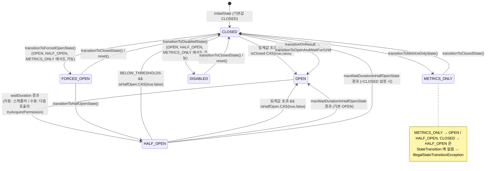

# CircuitBreaker 상태 머신 — 전이는 어떻게 일어나는가

`CircuitBreakerStateMachine` 은 6개 상태를 `AtomicReference` 하나로 관리하는 유한 상태 머신이다. 각 상태에서 무엇이 켜지고 꺼지는지, 전이가 어떤 원자적 연산으로 일어나는지, 여러 스레드가 동시에 임계값을 넘겼을 때 왜 전이가 한 번만 발생하는지를 소스로 확인한다.

## 목차
- [1. 핵심 개념 (What)](#1-핵심-개념-what)
- [2. 왜 알아야 하는가 (Why)](#2-왜-알아야-하는가-why)
- [3. 내부 구현 분석 (How)](#3-내부-구현-분석-how)
- [4. 실전 예제](#4-실전-예제)
- [5. 정리](#5-정리)

---

## 1. 핵심 개념 (What)

`CircuitBreaker.State` enum 은 각 상태에 `order`(고정 정렬값)와 `allowPublish`(이벤트 발행 허용)를 준다 — `CLOSED(0, true)`, `OPEN(1, true)`, `HALF_OPEN(2, true)`, `DISABLED(3, false)`, `FORCED_OPEN(4, false)`, `METRICS_ONLY(5, true)`. `order` 주석이 "ordinal() 로도 되지만 enum 선언 순서를 바꾸면 값이 변하니 고정 정수를 쓴다"고 설명한다 — 지표 레이블로 노출되는 값이라 안정성이 필요했던 것이다.

| 상태 | 호출 허용 | 지표 기록 | 상태 전이 | 이벤트 발행 | 구현 클래스 |
|---|---|---|---|---|---|
| **CLOSED** | 전부 | O | O (→ OPEN) | O | `ClosedState` |
| **OPEN** | 전부 거부 | 거부 카운트 + 늦게 온 결과 | O (→ HALF_OPEN) | O | `OpenState` |
| **HALF_OPEN** | `permittedNumberOfCallsInHalfOpenState` 개만 | O | O (→ CLOSED/OPEN) | O | `HalfOpenState` |
| **DISABLED** | 전부 | **X (noOp)** | **X** | **X** (`allowPublish=false`) | `DisabledState` |
| **FORCED_OPEN** | 전부 거부 | 거부 카운트 | **X** | **X** | `ForcedOpenState` |
| **METRICS_ONLY** | 전부 | O | **X** | O (임계값 초과 포함) | `MetricsOnlyState` |

`DisabledState.onError()`/`onSuccess()` 는 진짜로 비어 있어서(`// noOp`) **지표가 멈춘다.** 반면 `MetricsOnlyState` 는 기록도 하고 임계값 초과 이벤트도 쏘지만 전이만 안 한다 — "새 서킷을 넣기 전에 실제로 열릴지 관찰하는" 모드다. 전이는 세 장치로 통제된다. ① 상태는 `AtomicReference<CircuitBreakerState> stateReference` 에 보관, ② 모든 전이는 `stateTransition(State, UnaryOperator<CircuitBreakerState>)` 단일 관문을 지남, ③ 미등록 전이는 `StateTransition.transitionBetween()` 이 `IllegalStateTransitionException` 으로 막는다.

---

## 2. 왜 알아야 하는가 (Why)

### 허용되지 않는 전이가 실제로 있다

`StateTransition` enum 에 없는 조합은 예외다. 그리고 빠진 조합이 있다.

- **`CLOSED → HALF_OPEN` 이 없다.** `CLOSED_TO_{CLOSED, OPEN, DISABLED, METRICS_ONLY, FORCED_OPEN}` 뿐이다.
- **`METRICS_ONLY → OPEN`, `METRICS_ONLY → HALF_OPEN` 이 없다.** `METRICS_ONLY_TO_{METRICS_ONLY, CLOSED, FORCED_OPEN, DISABLED}` 네 개뿐 — 관찰 모드에서 강제로 열려면 **FORCED_OPEN** 으로 가야 한다.
- 그래서 운영 API로 `/circuitbreaker/{name}/half-open` 을 만들어 두고 CLOSED 상태에서 호출했다가 500이 나는 사고가 생긴다.

### duration 은 어디로 가고, 왜 평균이 0으로 보이는가

데코레이터는 `StopWatch` 를 쓰지 않는다. `io.github.resilience4j.core.StopWatch` 클래스는 존재하지만 CircuitBreaker 경로에는 쓰이지 않고, `getCurrentTimestamp()` 로 직접 측정한다.

```java
circuitBreaker.acquirePermission();
final long start = circuitBreaker.getCurrentTimestamp();
try {
    T result = supplier.get();
    long duration = circuitBreaker.getCurrentTimestamp() - start;
    circuitBreaker.onResult(duration, circuitBreaker.getTimestampUnit(), result);
    return result;
} catch (Exception exception) {               // java.lang.Error 는 처리하지 않는다
    circuitBreaker.onError(circuitBreaker.getCurrentTimestamp() - start,
        circuitBreaker.getTimestampUnit(), exception);
    throw exception;
}
```

기본값은 `DEFAULT_TIMESTAMP_FUNCTION = clock -> System.nanoTime()`, `DEFAULT_TIMESTAMP_UNIT = NANOSECONDS` 다. 이 값의 쓰임이 두 갈래로 갈린다. **느린 호출 판정**은 `CircuitBreakerMetrics.onSuccess()` 에서 `durationUnit.toNanos(duration) > slowCallDurationThresholdInNanos` 로 나노 정밀도를 그대로 쓰고, **누적 duration**은 `AbstractAggregation.record()` 에서 `totalDurationInMillis += durationUnit.toMillis(duration)` — **밀리초로 내림된다.** 따라서 1ms 미만 호출은 누적 duration에 **0** 으로 들어간다. 평균 200µs 인 캐시 조회에서 `getMetrics().getAverageDuration()` 이 0ms 로 나오는 이유다. 느린 호출 판정은 정상이지만, 이 지표를 응답시간 모니터링으로 쓰면 틀린 그림을 본다. 레이턴시는 Micrometer 타이머로 따로 봐야 한다.

### `releasePermission()` 누락이 HALF_OPEN 을 영구 고착시킨다

허가 수는 `AtomicInteger` 하나이고 `releasePermission()` 만 복구시킨다. v2.4.0 에는 이 누수를 막는 방어 코드가 들어가 있다.

```java
/**
 * Evaluates a user-supplied predicate, making sure a permission that was previously acquired is
 * not leaked if the predicate throws. ... leaving the CircuitBreaker with a
 * permanently lost permit (most visibly wedging the HALF_OPEN state).
 */
private <T> boolean evaluatePredicate(Predicate<T> predicate, T value) {
    try {
        return predicate.test(value);
    } catch (Exception predicateException) {
        releasePermission();
        throw predicateException;
    }
}
```

`recordExceptionPredicate` 안의 NPE 하나로 HALF_OPEN 이 영구 고착될 수 있었다는 뜻이다. **predicate 는 절대 예외를 던지지 않게 작성하라**는 리뷰 포인트가 여기서 나온다.

---

## 3. 내부 구현 분석 (How)

### 3.1 전체 전이도



### 3.2 `stateTransition()` — 전이의 단일 관문

```java
private void stateTransition(State newState,
    UnaryOperator<CircuitBreakerState> newStateGenerator) {
    CircuitBreakerState previousState = stateReference.getAndUpdate(currentState -> {
        StateTransition.transitionBetween(getName(), currentState.getState(), newState);
        currentState.preTransitionHook();
        return newStateGenerator.apply(currentState);
    });
    publishStateTransitionEvent(
        StateTransition.transitionBetween(getName(), previousState.getState(), newState));
}
```

- **3행**: `getAndUpdate()` — CAS 실패 시 람다를 **재실행**한다.
- **4행**: 전이 유효성 검증. 반환값은 버리고 예외만 쓴다. 불법 전이면 예외가 `getAndUpdate` 밖으로 전파되고 **상태는 바뀌지 않는다.**
- **5~6행**: 떠나는 상태의 정리 훅(`OpenState` 는 예약된 HALF_OPEN 전이를, `HalfOpenState` 는 `maxWaitDuration` 타이머를 취소) 후 새 상태 객체 생성. `currentState.attempts()` 를 이어받아 백오프를 계산한다.
- **8~9행**: 같은 상태로의 전이(`CLOSED_TO_CLOSED` 등)는 `isInternalTransition()` 으로 걸러져 발행되지 않는다.

**리뷰 포인트:** 람다가 재실행될 수 있는데 그 안에 부수효과가 두 개 있다 — `preTransitionHook()` 과 새 상태 객체 생성. 특히 `OpenState` 생성자는 자동 전이가 켜져 있으면 **생성 시점에 스케줄러 작업을 등록한다**(`scheduledExecutorService.schedule(this::toHalfOpenState, waitDurationInMillis, MILLISECONDS)`). 따라서 두 스레드가 동시에 `transitionToOpenState()` 를 호출해 CAS 경쟁이 나면 버려진 `OpenState` 가 예약 작업을 남길 수 있다. 자동 전이의 진입점이 3.4절의 1회성 CAS로 보호되어 실무에서 잘 드러나지 않지만, **`transitionToOpenState()` 를 운영 API로 노출한다면 애플리케이션 레벨에서 직렬화**해두는 편이 안전하다.

### 3.3 호출 한 건의 생애

| 순서 | 호출 | 하는 일 |
|---|---|---|
| 1 | `acquirePermission()` / `tryAcquirePermission()` | 상태 객체에 위임. 거부 시 `CallNotPermittedException` 또는 `false` + `CallNotPermittedEvent` |
| 2~4 | `start = getCurrentTimestamp()` → 보호 대상 실행 → `duration = getCurrentTimestamp() - start` | 데코레이터가 직접 측정 |
| 5a | `onResult(duration, unit, result)` | `recordResultPredicate` 참이면 `state.onError()`, 아니면 `onSuccess()` + `handlePossibleTransition(Either.left(result))` |
| 5b | `onError(duration, unit, throwable)` | ignore → `releasePermission()` + 이벤트 후 return / record → `state.onError()` / 둘 다 아니면 `state.onSuccess()`, 마지막에 `handlePossibleTransition(Either.right(t))` |
| 6 | `CircuitBreakerMetrics` → `Result` | `ABOVE_THRESHOLDS` 등을 상태 객체에 반환 |
| 7 | 상태 객체의 `checkIfThresholdsExceeded()` | 1회성 CAS 후 `transitionToOpenState()` |

`tryAcquirePermission()` 은 `boolean` 을 돌려주고 거부 시 이벤트만 발행한다. `acquirePermission()` 은 예외를 잡아 이벤트를 발행한 뒤 다시 던진다. 전자가 필요한 이유는 **비동기/리액티브 경로**다 — 예외 대신 `promise.completeExceptionally()` 로 넘기려면 boolean 이 필요하다(`CircuitBreaker.decorateCompletionStage()` 참고). 각 상태의 `acquirePermission()` 구현은 대부분 `if (!tryAcquirePermission()) throw ...` 형태다.

### 3.4 OPEN → HALF_OPEN: 자동 전이 vs 지연 평가

`automaticTransitionFromOpenToHalfOpenEnabled` 기본값은 **false** 다. 끈 경우, 전이는 호출이 올 때 평가된다.

```java
@Override                                     // OpenState
public boolean tryAcquirePermission() {
    // Thread-safe
    if (clock.instant().isAfter(retryAfterWaitDuration)) {
        toHalfOpenState();
        // Check if the call is allowed to run in HALF_OPEN state after state transition
        boolean callPermitted = stateReference.get().tryAcquirePermission();
        if (!callPermitted) {
            publishCallNotPermittedEvent();
            circuitBreakerMetrics.onCallNotPermitted();
        }
        return callPermitted;
    }
    circuitBreakerMetrics.onCallNotPermitted();
    return false;
}
```

**호출이 와야 전이가 평가된다.** 트래픽이 0이면 OPEN 에 무한정 머문다 — "OPEN 상태가 설정한 60초보다 훨씬 길게 유지됨"은 버그가 아니라 설계다. 켠 경우에는 `SchedulerFactory` 싱글톤이 관리하는 **단일 스레드 스케줄러를 JVM 전체가 공유한다**(`newSingleThreadScheduledExecutor("CircuitBreakerAutoTransitionThread", ...)`). 전이 작업 자체는 가볍지만 `transitionToHalfOpenState()` → 이벤트 컨슈머 실행까지 이 스레드에서 돈다. **컨슈머에서 블로킹 I/O(알림 전송 등)를 하면 다른 모든 서킷의 자동 전이가 지연된다.**

자동/수동 양쪽은 같은 진입점을 공유하며 `ReentrantLock` + 1회성 CAS 로 보호된다 — `toHalfOpenState()` 안에서 `if (isOpen.compareAndSet(true, false)) transitionToHalfOpenState();`.

### 3.5 동시성: 1회성 `AtomicBoolean`

CLOSED 상태의 핵심.

```java
private void checkIfThresholdsExceeded(Result result) {
    if (Result.hasExceededThresholds(result) && isClosed.compareAndSet(true, false)) {
        publishCircuitThresholdsExceededEvent(result, circuitBreakerMetrics);
        transitionToOpenState();
    }
}
```

100개 스레드가 동시에 `ABOVE_THRESHOLDS` 를 받아도 `isClosed.compareAndSet(true, false)` 에 성공하는 스레드는 **정확히 하나**다. 전이도, 임계값 초과 이벤트도 1회만 발생한다. 같은 패턴이 모든 전이 지점에 복제돼 있다.

| 상태 | 플래그 | 보호 대상 |
|---|---|---|
| `ClosedState` | `isClosed` | CLOSED → OPEN 1회 |
| `OpenState` | `isOpen` | OPEN → HALF_OPEN 1회 (스케줄러 vs 사용자 스레드) |
| `HalfOpenState` | `isHalfOpen` | HALF_OPEN → OPEN/CLOSED 1회, 타이머 전이와의 경쟁 |
| `MetricsOnlyState` | `isFailureRateExceeded`, `isSlowCallRateExceeded` | 임계값 초과 이벤트를 종류별 1회 |

`MetricsOnlyState` 가 플래그를 둘로 나눈 이유는 전이가 없어 상태 객체가 교체되지 않기 때문이다 — 하나면 실패율 이벤트가 나간 뒤 느린호출율 이벤트가 영구히 막힌다.

**비대칭 주의:** `ClosedState.tryAcquirePermission()` 은 `isClosed.get()` 을 반환하지만 `acquirePermission()` 은 `// noOp` 이다. 정상 흐름에서는 `isClosed=false` 직후 상태 객체가 교체되므로 창이 짧다. 그런데 `ClosedState.handlePossibleTransition()` 은 `isClosed` 를 false 로 바꾼 **뒤에** `waitDuration`/`waitUntil` 이 둘 다 null 이면 `IllegalArgumentException` 을 던진다. 즉 `TransitionCheckResult.transitionToOpen()`(둘 다 null)을 쓰면 **상태는 CLOSED 인데 `isClosed=false` 로 남는다.** javadoc 은 "`transitionToOpenState()` 를 호출한다"고 적었지만 구현은 그렇지 않다 — **`transitionToOpenAndWaitFor(Duration)` 또는 `transitionToOpenAndWaitUntil(Instant)` 를 써야 한다**(상세: [07번 문서](./07-circuitbreaker-config.md) 3.5절).

### 3.6 HALF_OPEN 의 허가 관리

```java
@Override
public boolean tryAcquirePermission() {
    if (permittedNumberOfCalls.getAndUpdate(current -> current == 0 ? current : --current)
        > 0) {
        return true;
    }
    circuitBreakerMetrics.onCallNotPermitted();
    return false;
}
```

"0이면 그대로, 아니면 1 감소"를 원자적으로 수행하고 **감소 전 값**으로 판정한다. 음수로 내려가지 않으므로 초과 호출은 전부 거부되고 `onCallNotPermitted()` 로 집계된다. 호출자는 OPEN 때와 동일하게 `CallNotPermittedException` 을 받지만 메시지에 현재 상태가 들어가므로 구분은 가능하다. 복구는 `releasePermission()`(`incrementAndGet()`)뿐이다. 판정은 CLOSED와 달리 **양방향**이다 — `HalfOpenState.checkIfThresholdsExceeded()` 는 임계값 초과면 `isHalfOpen` CAS 후 `transitionToOpenState()`, `result == BELOW_THRESHOLDS` 면 같은 CAS 후 `transitionToClosedState()` 를 호출한다. `BELOW_MINIMUM_CALLS_THRESHOLD` 는 두 조건 모두에 안 걸린다 — **허가를 다 쓸 때까지 HALF_OPEN 에 머문다.** HALF_OPEN 지표는 항상 COUNT_BASED 이고 윈도 크기 = `permittedNumberOfCallsInHalfOpenState` 이므로(`CircuitBreakerMetrics.forHalfOpen()`) 최소 호출 수도 `min(minimumNumberOfCalls, permitted)` 로 축소된다. 그래도 교착이 가능한 경우의 탈출구가 `maxWaitDurationInHalfOpenState`(기본 0 = 비활성)다.

---

## 4. 실전 예제

### 4.1 상태 전이를 로그와 지표로 남기기

```java
package com.example.resilience.observability;

import io.github.resilience4j.circuitbreaker.CircuitBreaker;
import io.github.resilience4j.circuitbreaker.CircuitBreakerRegistry;
import io.github.resilience4j.circuitbreaker.event.CircuitBreakerOnStateTransitionEvent;
import io.micrometer.core.instrument.Counter;
import io.micrometer.core.instrument.MeterRegistry;
import jakarta.annotation.PostConstruct;
import org.slf4j.Logger;
import org.slf4j.LoggerFactory;
import org.springframework.stereotype.Component;

/**
 * 모든 CircuitBreaker 의 상태 전이를 구조화 로그 + 카운터로 남긴다.
 * - onEntryAdded/onEntryReplaced 를 함께 구독한다. 서킷은 lazy 생성이 기본이라 기동 시점
 *   순회만으로는 나중에 만들어진 것을 놓친다.
 * - 컨슈머는 절대 블로킹하지 않는다. automaticTransitionFromOpenToHalfOpen 이 켜져 있으면
 *   이 컨슈머가 JVM 공유 단일 스레드 스케줄러에서 실행될 수 있다(3.4절).
 */
@Component
public class CircuitBreakerTransitionRecorder {

    private static final Logger log =
        LoggerFactory.getLogger(CircuitBreakerTransitionRecorder.class);

    private final CircuitBreakerRegistry registry;
    private final MeterRegistry meterRegistry;

    public CircuitBreakerTransitionRecorder(CircuitBreakerRegistry registry,
                                            MeterRegistry meterRegistry) {
        this.registry = registry;
        this.meterRegistry = meterRegistry;
    }

    @PostConstruct
    void init() {
        registry.getAllCircuitBreakers().forEach(this::subscribe);
        registry.getEventPublisher()
            .onEntryAdded(event -> subscribe(event.getAddedEntry()))
            .onEntryReplaced(event -> subscribe(event.getNewEntry()));
    }

    private void subscribe(CircuitBreaker cb) {
        cb.getEventPublisher().onStateTransition(this::record);
    }

    private void record(CircuitBreakerOnStateTransitionEvent event) {
        CircuitBreaker.State from = event.getStateTransition().getFromState();
        CircuitBreaker.State to = event.getStateTransition().getToState();
        String msg = "circuit_transition name={} from={} to={}";

        // OPEN 진입은 장애 신호다. WARN 으로 올려 알림 룰에 걸리게 한다.
        if (to == CircuitBreaker.State.OPEN || to == CircuitBreaker.State.FORCED_OPEN) {
            log.warn(msg, event.getCircuitBreakerName(), from, to);
        } else {
            log.info(msg, event.getCircuitBreakerName(), from, to);
        }
        Counter.builder("app.circuitbreaker.transition")
            .tag("name", event.getCircuitBreakerName())
            .tag("from", from.name()).tag("to", to.name())
            .register(meterRegistry)
            .increment();
    }
}
```

### 4.2 수동 전이를 운영 스위치로 쓰기 (배포 중 특정 의존성 차단)

3.1절의 불법 전이와 3.2절의 동시 호출 문제를 둘 다 막는 운영 레버다.

```java
package com.example.resilience.admin;

import io.github.resilience4j.circuitbreaker.CircuitBreaker;
import io.github.resilience4j.circuitbreaker.CircuitBreakerRegistry;
import io.github.resilience4j.circuitbreaker.IllegalStateTransitionException;
import org.slf4j.Logger;
import org.slf4j.LoggerFactory;
import org.springframework.stereotype.Service;

import java.util.Map;
import java.util.concurrent.ConcurrentHashMap;
import java.util.concurrent.locks.ReentrantLock;
import java.util.function.Consumer;

/**
 * 설계 근거:
 * - stateTransition() 의 getAndUpdate 람다는 CAS 실패 시 재실행되며 부수효과를 포함한다.
 *   운영 API 는 호출 빈도가 낮으니 이름별 락으로 직렬화해 경쟁 자체를 없애는 편이 싸다.
 * - FORCED_OPEN 은 어느 상태에서든 진입 가능하다. 반대로 HALF_OPEN 진입은
 *   CLOSED/METRICS_ONLY 에서 불법이므로 아예 제공하지 않는다.
 */
@Service
public class CircuitBreakerOpsSwitch {

    private static final Logger log = LoggerFactory.getLogger(CircuitBreakerOpsSwitch.class);

    private final CircuitBreakerRegistry registry;
    private final Map<String, ReentrantLock> locks = new ConcurrentHashMap<>();

    public CircuitBreakerOpsSwitch(CircuitBreakerRegistry registry) {
        this.registry = registry;
    }

    /** 점검 중 전면 차단(FORCED_OPEN: 지표·이벤트 정지). 자동 복구되지 않는다. */
    public void block(String name, String reason) {
        apply(name, "block", reason, CircuitBreaker::transitionToForcedOpenState);
    }

    /** 차단 해제. CLOSED 로 복귀하며 지표 윈도는 새로 시작된다. */
    public void unblock(String name) {
        apply(name, "unblock", "-", CircuitBreaker::transitionToClosedState);
    }

    /** 오탐으로 서비스가 막힐 때의 비상 탈출구(DISABLED: 전부 통과, 지표 정지). */
    public void bypass(String name, String reason) {
        apply(name, "bypass", reason, CircuitBreaker::transitionToDisabledState);
    }

    private void apply(String name, String op, String reason, Consumer<CircuitBreaker> action) {
        CircuitBreaker cb = registry.circuitBreaker(name);
        ReentrantLock lock = locks.computeIfAbsent(name, k -> new ReentrantLock());
        lock.lock();
        try {
            log.warn("ops_circuit_{} name={} previousState={} reason={}",
                op, name, cb.getState(), reason);
            action.accept(cb);
        } catch (IllegalStateTransitionException e) {
            log.error("ops_circuit_illegal_transition name={} from={} to={}",   // 상태는 그대로다
                e.getName(), e.getFromState(), e.getToState());
            throw e;
        } finally {
            lock.unlock();
        }
    }
}
```

운영 체크리스트: `block()` → `unblock()` 쌍을 런북에 기록한다(FORCED_OPEN 은 시간 기반 탈출 경로가 없다). `bypass()`(DISABLED)는 지표가 멈춰 대시보드가 "평온해 보이는" 착시를 만들므로 DISABLED 상태 자체를 감지하는 알림 룰이 필요하다. 전이 이벤트는 발행되지만 대상이 DISABLED/FORCED_OPEN 이면 그 **이후** 이벤트는 `allowPublish=false` 로 막힌다.

---

## 5. 정리

| 상태 | 호출 | 지표 | 전이 | 이벤트 | 탈출 |
|---|---|---|---|---|---|
| CLOSED | 허용 | 기록 | → OPEN | O | 임계값 초과 시 자동 |
| OPEN | 거부 | 거부 카운트 + 늦게 온 결과 | → HALF_OPEN | O | `waitDuration` 후 다음 호출 또는 스케줄러 |
| HALF_OPEN | N개만 | 기록 | → CLOSED/OPEN | O | 허가 소진 후 판정 또는 `maxWaitDurationInHalfOpenState` |
| DISABLED / FORCED_OPEN | 허용 / 거부 | 없음 / 거부 카운트 | **없음** | **없음** | 수동 전이만 |
| METRICS_ONLY | 허용 | 기록 | **없음** | O | 수동 전이만 (OPEN/HALF_OPEN 은 불법) |

| 메커니즘 | 코드 | 역할 |
|---|---|---|
| 상태 보관 / 전이 관문 | `AtomicReference<CircuitBreakerState>` + `stateTransition()` | 상태 객체 통째 교체, 검증 + preTransitionHook + 이벤트 |
| 전이 검증 | `StateTransition.transitionBetween()` | 미등록 조합은 `IllegalStateTransitionException` |
| 중복 전이 방지 | 상태별 `AtomicBoolean` 1회성 CAS | 100스레드 동시 초과 → 전이 1회 |
| HALF_OPEN 허가 | `AtomicInteger.getAndUpdate(c -> c == 0 ? c : --c)` | 음수 방지 + 원자적 감소 |
| 자동 OPEN→HALF_OPEN | `SchedulerFactory` 싱글톤 단일 스레드 | JVM 전역 공유. 컨슈머 블로킹 금지 |
| duration 측정 | `getCurrentTimestamp()` (기본 `System.nanoTime()`) | 느린호출 판정은 나노, 누적은 ms 내림 |

리뷰에서 바로 지적할 것들:

1. **`automaticTransitionFromOpenToHalfOpenEnabled` 기본값은 false.** 트래픽이 없으면 OPEN 에서 안 나온다.
2. **`transitionOnResult` 에 `transitionToOpen()` 금지.** `transitionToOpenAndWaitFor(...)` 를 써야 한다.
3. **predicate 에서 예외를 던지지 말 것.** 허가 누수는 막아주지만 예외는 호출자에게 전파된다.
4. **CLOSED/METRICS_ONLY → HALF_OPEN 운영 API 는 만들 수 없다.** 그리고 **자동 전이 + 블로킹 이벤트 컨슈머 = 전역 장애 요인**이다.

---

## 관련 문서
- 선행: [슬라이딩 윈도 ② 시간 기반과 lock-free 구현](./05-sliding-window-time.md)
- 후행: [CircuitBreakerConfig 전 항목 — 숫자를 어떻게 정하나](./07-circuitbreaker-config.md)
- 참고: [EventProcessor 와 이벤트 발행](./03-event-processor.md), [Actuator 와 헬스 인디케이터](../advanced/05-actuator-and-health.md)

---
*Resilience4j v2.4.0 기준 · 소스 커밋 7e3ab525*
