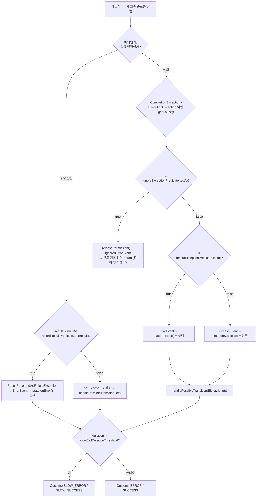

# CircuitBreakerConfig 전 항목 — 숫자를 어떻게 정하나

모든 옵션을 소스의 기본값 상수와 검증 규칙까지 정리하고, 가장 많이 틀리는 **예외 분류 우선순위**를 `PredicateCreator` 와 `CircuitBreakerStateMachine.handleThrowable()` 을 같이 읽어 확정한다. 마지막으로 성격별 설정 3종과 p99 기반 임계값 산정 절차를 제시한다.

## 목차
- [1. 핵심 개념 (What)](#1-핵심-개념-what)
- [2. 왜 알아야 하는가 (Why)](#2-왜-알아야-하는가-why)
- [3. 내부 구현 분석 (How)](#3-내부-구현-분석-how)
- [4. 실전 예제](#4-실전-예제)
- [5. 정리](#5-정리)

---

## 1. 핵심 개념 (What)

기본값 상수는 `CircuitBreakerConfig` 최상단에 `DEFAULT_*` 로 몰려 있고, 아래 표의 기본값은 모두 그 상수에서 확인한 값이다. 눈여겨볼 것은 predicate 기본값 세 개 — `DEFAULT_RECORD_EXCEPTION_PREDICATE = throwable -> true`(모든 예외가 실패), `DEFAULT_IGNORE_EXCEPTION_PREDICATE = throwable -> false`(무시 없음), `DEFAULT_RECORD_RESULT_PREDICATE = (Object object) -> false`(결과 기반 실패 판정 비활성).

| 옵션 | 타입 | 기본값 | 검증 | 의미 |
|---|---|---|---|---|
| `failureRateThreshold` / `slowCallRateThreshold` | `float` | **50** % / **100** % | 둘 다 `0 < x <= 100` | 실패율 / 느린 호출 비율이 **이상**(`>=`)이면 OPEN. 후자 기본 100 = 사실상 비활성 |
| `slowCallDurationThreshold` | `Duration` | **60초** | `toNanos() >= 1` | **초과**(`>`)면 느린 호출 |
| `permittedNumberOfCallsInHalfOpenState` | `int` | **10** | `>= 1` | HALF_OPEN 탐색 호출 수 |
| `slidingWindowSynchronizationStrategy` | enum | **SYNCHRONIZED** | - | 락 / lock-free ([05번](./05-sliding-window-time.md)) |
| `maxWaitDurationInHalfOpenState` | `Duration` | **0 (비활성)** | `>= 0ms` | HALF_OPEN 최대 체류. 0이면 판정될 때까지 무한 |
| `transitionToStateAfterWaitDuration` | `State` | **OPEN** | `OPEN`/`CLOSED` 만 | 위 타임아웃 시 갈 상태 |
| `slidingWindowType` / `slidingWindowSize` | enum / `int` | **COUNT_BASED** / **100** | size `>= 1` (TIME_BASED+LOCK_FREE 는 `>= 2`) | 윈도 종류와 크기(건수 또는 초) |
| `minimumNumberOfCalls` | `int` | **100** | `>= 1`. COUNT_BASED 는 `min(값, size)` 로 축소 | 미만이면 **판정 자체를 안 한다** |
| `waitDurationInOpenState` / `waitIntervalFunctionInOpenState` | `Duration` / `IntervalFunction` | **60초** / `of(60s)` | **동시 사용 시 `IllegalStateException`** | OPEN 체류 시간 / 시도 횟수별 백오프 |
| `automaticTransitionFromOpenToHalfOpenEnabled` / `initialState` | `boolean` / `State` | **false** / **CLOSED** | - | 스케줄러로 OPEN→HALF_OPEN / 생성 직후 상태 |
| `recordExceptions` / `ignoreExceptions` | `Class[]` | **빈 배열** | null → 빈 배열 | 실패로 셀 예외 / 무시할 예외 (둘 다 상속 포함) |
| `recordExceptionPredicate` / `ignoreExceptionPredicate` | `Predicate<Throwable>` | **`t -> true`** / **`t -> false`** | - | 커스텀 실패 / 무시 판정 |
| `recordResultPredicate` / `transitionOnResult` | `Predicate<Object>` / `Function<Either<Object,Throwable>, TransitionCheckResult>` | **`o -> false`** / `noTransition()` | - | **정상 반환값**을 실패로 셀지 / 결과를 보고 즉시 OPEN 요청 |
| `writableStackTraceEnabled` / `ignoreExceptionsPrecedenceEnabled` | `boolean` | **true** / **false** | - | 스택트레이스 생성 여부(프로덕션은 false 권장) / `getRecordExceptionPredicate()` 가 ignore 반영 여부 |
| `clock` | `java.time.Clock` | `Clock.systemUTC()` | null → 기본값 | OPEN 만료 판정, TIME_BASED(SYNCHRONIZED) 윈도 |
| `currentTimestampFunction` + `timestampUnit` | `Function<Clock,Long>` + `TimeUnit` | `System.nanoTime()`, `NANOSECONDS` | - | 호출 duration 측정 |

---

## 2. 왜 알아야 하는가 (Why)

### `slidingWindowSize` 만 바꾸면 `minimumNumberOfCalls` 는 100으로 남는다

`slidingWindowSize(int)` 단독 세터는 `minimumNumberOfCalls` 를 건드리지 않고 `build()` 도 보정하지 않는다. 보정은 **`slidingWindow(size, min, type)` 오버로드에서만** 일어나고, 그것도 COUNT_BASED 한정이다 — `if (slidingWindowType == COUNT_BASED) this.minimumNumberOfCalls = Math.min(minimumNumberOfCalls, slidingWindowSize); else this.minimumNumberOfCalls = minimumNumberOfCalls;`. 다행히 런타임에 `CircuitBreakerMetrics` 생성자가 COUNT_BASED 에 한해 한 번 더 `Math.min` 을 적용해 동작은 한다. 하지만 `config.getMinimumNumberOfCalls()` 를 읽어 대시보드에 표시하면 **100으로 적히고 실제로는 10으로 동작한다** — 설정 검증 테스트가 여기에 걸린다. 반대로 `minimumNumberOfCalls=1` 로 낮추면 **첫 호출 1건 실패로 실패율 100% → OPEN** 이다. 배포 직후 커넥션 풀 워밍업 중 타임아웃 한 건으로 전체 트래픽이 차단되는 사고가 여기서 나온다. 최소 10, 권장 20 이상이다.

### `slowCallRateThreshold` 기본값 100의 함정

`slowCallDurationThreshold(Duration.ofMillis(500))` 만 설정하고 끝내는 코드를 자주 본다. 기본 `slowCallRateThreshold=100` 이면 **윈도 안 호출이 전부 500ms를 넘겨야** OPEN 된다 — 사실상 느린 호출 보호가 꺼진 상태다. 두 옵션은 반드시 쌍으로 설정한다.

### `writableStackTraceEnabled=false` 가 왜 성능 옵션인가

`CallNotPermittedException` 의 private 생성자는 `super(message, null, false, writableStackTrace)` — 즉 `RuntimeException(message, cause, enableSuppression, writableStackTrace)` 생성자를 쓴다. `writableStackTrace=false` 면 JVM이 `fillInStackTrace()` 를 **아예 호출하지 않는다.** Spring MVC/WebFlux 요청 스택은 수십~수백 프레임이고, 이 예외는 OPEN 상태에서 **거부되는 모든 호출마다** 생성된다 — 1,000 RPS 경로가 OPEN 되면 초당 1,000개의 스택트레이스를 떠서 버리는 셈이다. 담긴 정보는 "서킷이 열렸다"는 이미 알려진 사실뿐이고, javadoc 도 "the cause of the exceptions is already known" 라고 적어뒀다. **프로덕션 기본값으로 `false` 를 권한다.**

---

## 3. 내부 구현 분석 (How)

### 3.1 한 호출의 분류 결정 흐름



런타임 순서는 **ignore → record → (둘 다 아니면) success** 다.

```java
private void handleThrowable(long duration, TimeUnit durationUnit, Throwable throwable) {
    if (evaluatePredicate(circuitBreakerConfig.getIgnoreExceptionPredicate(), throwable)) {
        releasePermission();
        publishCircuitIgnoredErrorEvent(name, duration, durationUnit, throwable);
        return;
    }
    if (evaluatePredicate(circuitBreakerConfig.getRecordExceptionPredicate(), throwable)) {
        publishCircuitErrorEvent(name, duration, durationUnit, throwable);
        stateReference.get().onError(duration, durationUnit, throwable);
    } else {                                  // record 가 false 면 "성공"으로 기록된다
        publishSuccessEvent(duration, durationUnit);
        stateReference.get().onSuccess(duration, durationUnit);
    }
    handlePossibleTransition(Either.right(throwable));
}
```

- **2행**: ignore 가 **무조건 먼저**다. 설정 플래그와 무관하다.
- **3행 `releasePermission()`**: ignore 된 호출은 HALF_OPEN 탐색 호출 1건으로 소비되지 않는다.
- **5행 `return`**: 윈도에 들어가지 않고 `handlePossibleTransition()` 도 건너뛴다 — **`transitionOnResult` 는 ignore 예외에서 동작하지 않는다.**
- **11~14행**: record 가 false 면 **성공으로 기록된다.** "실패도 성공도 아니게" 하려면 ignore 를 써야 한다.

### 3.2 "`recordExceptions` 에 넣었는데 왜 안 세나" — 원인 세 가지

```java
// PredicateCreator — 클래스 목록과 predicate 를 OR 로 결합한다
public static Optional<Predicate<Throwable>> createExceptionsPredicate(
    Predicate<Throwable> exceptionPredicate, Class<? extends Throwable>... exceptions) {
    return PredicateCreator.createExceptionsPredicate(exceptions)
        .map(predicate -> exceptionPredicate == null ? predicate : predicate.or(exceptionPredicate))
        .or(() -> Optional.ofNullable(exceptionPredicate));
}

private static Predicate<Throwable> makePredicate(Class<? extends Throwable> exClass) {
    return (Throwable e) -> exClass.isAssignableFrom(e.getClass());   // cause 는 보지 않는다
}
```

**원인 ① ignore 가 먼저 걸렀다.** `ignoreExceptions(RuntimeException.class)` + `recordExceptions(Exception.class)` 면 `RuntimeException` 은 1단계에서 빠져 2단계에 도달하지 않는다 — javadoc 의 "Ignoring an exception has priority over recording an exception" 은 정확하다.

**원인 ② 예외가 래핑돼 있다.** `makePredicate()` 는 `exClass.isAssignableFrom(e.getClass())` — **cause 를 따라가지 않는다.** `onError()` 진입부에서 벗겨지는 것은 `if (throwable instanceof CompletionException || throwable instanceof ExecutionException)` 두 종류뿐이다. Feign 의 `RetryableException`, Spring 의 `UncategorizedDataAccessException`, 직접 만든 `ServiceException` 래핑은 **벗겨지지 않는다** — 원본 타입을 `recordExceptions` 에 넣어도 매칭 실패다(해결: 4.3절).

**원인 ③ `recordExceptions` 를 설정하는 순간 "나머지는 전부 성공"이 된다.** 설정 전에는 `DEFAULT_RECORD_EXCEPTION_PREDICATE = throwable -> true` 로 모든 예외가 실패다. `recordExceptions(TimeoutException.class)` 를 넣으면 화이트리스트가 되어 DB 커넥션 고갈 예외 같은 것들이 **성공으로 집계**된다 — 서킷이 안 열리는 가장 흔한 이유다. **`ignoreExceptions` 블랙리스트**(비즈니스 예외만 제외)를 기본으로 권한다.

### 3.3 `ignoreExceptionsPrecedenceEnabled` 의 실제 효과

```java
private Predicate<Throwable> createRecordExceptionPredicate() {
    Predicate<Throwable> baseRecordExceptionPredicate =
        PredicateCreator.createExceptionsPredicate(recordExceptionPredicate, recordExceptions)
            .orElse(DEFAULT_RECORD_EXCEPTION_PREDICATE);
    if (ignoreExceptionsPrecedenceEnabled) {
        return throwable -> !createIgnoreFailurePredicate().test(throwable)
            && baseRecordExceptionPredicate.test(throwable);
    }
    return baseRecordExceptionPredicate;
}
```

런타임 분류 순서(3.1)는 이 플래그와 **무관하게** ignore 가 먼저다. 플래그가 바꾸는 것은 **`getRecordExceptionPredicate()` 가 반환하는 predicate 자체의 값**이다. 소스 테스트(`CircuitBreakerConfigTest`)가 차이를 보여준다 — `recordExceptions(Exception.class)` + `ignoreExceptions(RuntimeException.class, ...)` 에서 `recordExceptionPredicate.test(new RuntimeException())` 이 플래그 ON 이면 `false`, OFF(기본)면 `true` 다. 서킷브레이커 본체의 동작 결과는 두 경우 모두 같고, **차이가 나는 건 이 predicate 를 직접 읽는 코드**(설정 검증 테스트, 커스텀 지표, predicate 를 재사용하는 공통 라이브러리)다.

### 3.4 `recordResultPredicate` — 정상 반환값을 실패로

```java
@Override
public void onResult(long duration, TimeUnit durationUnit, @Nullable Object result) {
    if (result != null && evaluatePredicate(circuitBreakerConfig.getRecordResultPredicate(), result)) {
        ResultRecordedAsFailureException failure = new ResultRecordedAsFailureException(name, result);
        publishCircuitErrorEvent(name, duration, durationUnit, failure);
        stateReference.get().onError(duration, durationUnit, failure);
    } else {
        onSuccess(duration, durationUnit);
        if (result != null) handlePossibleTransition(Either.left(result));
    }
}
```

- **3행 `result != null`**: **null 반환은 절대 실패로 분류되지 않는다.** 그리고 이 경로는 ignore/record 예외 predicate 를 **거치지 않고** `handlePossibleTransition()` 도 호출되지 않는다.
- **4행**: 합성 예외 `ResultRecordedAsFailureException` 이 만들어진다. `getResult()` 로 원래 값을 꺼낼 수 있어 이벤트 리스너에서 "어떤 응답이 실패로 집계됐는지" 로깅이 가능하다.

### 3.5 `transitionOnResult` — 결과를 보고 즉시 OPEN

소스 전체에서 소비 지점은 `CircuitBreakerStateMachine.handlePossibleTransition()` 단 한 곳이다 — `stateReference.get().handlePossibleTransition(circuitBreakerConfig.getTransitionOnResult().apply(result))` 한 줄이다. 호출 시점은 ① `handleThrowable()` 의 마지막(ignore 제외), ② `onResult()` 에서 성공 분류된 non-null 결과 두 곳이고, 실제로 반응하는 상태는 **`ClosedState` 하나뿐**이다 — 나머지 다섯 상태의 `handlePossibleTransition()` 은 모두 `// noOp` 이다. 용도는 **"지표 임계값과 무관하게, 특정 응답을 보면 즉시 차단"** 이다. 전형적인 예가 HTTP 429 + `Retry-After` — 서버가 "n초 뒤에 오라"고 알려줬으면 윈도를 채울 필요 없이 그 시간만큼 OPEN 하는 게 맞다.

**반드시 `waitDuration` 또는 `waitUntil` 을 담아야 한다.** `ClosedState.handlePossibleTransition()` 은 `isClosed.compareAndSet(true, false)` 에 성공한 뒤 `getWaitDuration() != null` 이면 `transitionToOpenStateFor()`, `getWaitUntil() != null` 이면 `transitionToOpenStateUntil()` 을 호출하고, **둘 다 null 이면 `IllegalArgumentException("Transition check resulted in open request but now wait attribute was set? This should never happen")` 을 던진다.**

`TransitionCheckResult.transitionToOpen()` 은 둘 다 null 이라 바로 그 마지막 분기로 떨어진다 — 그것도 `isClosed` 를 false 로 바꾼 뒤에. javadoc 은 "`transitionToOpenState()` 를 호출한다"고 적었지만 구현은 그렇지 않다. 쓸 수 있는 팩토리는 `transitionToOpenAndWaitFor(Duration)`, `transitionToOpenAndWaitUntil(Instant)`, `noTransition()` 세 개뿐이다.

### 3.6 `waitDurationInOpenState` 와 `waitIntervalFunctionInOpenState` 는 공존 불가

```java
public Builder waitDurationInOpenState(Duration waitDurationInOpenState) {
    long waitDurationInMillis = waitDurationInOpenState.toMillis();
    if (waitDurationInMillis < 1) {
        throw new IllegalArgumentException("waitDurationInOpenState must be at least 1[ms]");
    }
    this.waitIntervalFunctionInOpenState = IntervalFunction.of(waitDurationInMillis);
    createWaitIntervalFunctionCounter++;      // waitIntervalFunctionInOpenState() 도 증가시킨다
    return this;
}

private IntervalFunction validateWaitIntervalFunctionInOpenState() {
    if (createWaitIntervalFunctionCounter > 1) {   // build() 에서 호출된다
        throw new IllegalStateException("The waitIntervalFunction was configured multiple times ...");
    }
    return waitIntervalFunctionInOpenState;
}
```

둘이 같은 필드를 쓰고 호출 횟수를 센다. **카운터가 2 이상이면 `build()` 가 터진다** — 같은 메서드를 두 번 호출해도 마찬가지이고, Spring 프로퍼티와 Customizer 양쪽에서 각각 설정하면 이 예외를 본다. `IntervalFunction` 의 인자 `attempts` 는 상태 객체를 거쳐 누적된다 — `transitionToOpenState()` 가 `new OpenState(currentState.attempts() + 1, currentState.getMetrics())` 를 만든다. `ClosedState.attempts()` 가 0이므로 CLOSED→OPEN 은 항상 `attempts=1` 이고, HALF_OPEN→OPEN 은 누적된 값을 물려받는다. 즉 **복구 실패가 반복될 때만 백오프가 길어지고, CLOSED 진입 후에는 1로 리셋된다.** 이게 OPEN 대기에 지수 백오프를 쓰는 설계 의도다.

---

## 4. 실전 예제

### 4.1 `slowCallDurationThreshold` 를 p99 로부터 산정하는 절차

**① 레이턴시 분포 실측** — 평상시 7일치 p50/p95/p99 를 뽑는다.

```promql
histogram_quantile(0.99,
  sum by (le) (rate(http_client_requests_seconds_bucket{clientName="payment-api"}[7d])))
```

**② p99 × 1.5~2.0 을 기준점으로.** 느린 호출 판정은 장애 징후를 잡는 것이고 정상 꼬리 구간(p99~p99.9)을 전부 셀 필요는 없다. 예: p50=80ms, p95=250ms, p99=600ms → **1000ms**(p99 × 1.67). **③ 호출 타임아웃보다 반드시 작게** — `slowCallDurationThreshold < readTimeout`, 권장은 `readTimeout × 0.3~0.5`. 타임아웃 3초에 임계값 4초면 느린 호출로 집계되기 전에 타임아웃 예외가 나서 보호가 무의미해진다.

**④ `slowCallRateThreshold` 를 짝으로.** 평상시 임계값 초과율을 `100 * (1 - (sum(rate(..._bucket{le="1.0"}[7d])) / sum(rate(..._count[7d]))))` 로 먼저 재고 그 2~3배를 잡는다. 평상시 2%라면 `30f` 정도. **기본값 100 을 그대로 두면 안 된다.**

**⑤ 윈도 안에서 통계적 의미 확인.** `minimumNumberOfCalls=20` + `slowCallRateThreshold=30%` 면 느린 호출 6건으로 열린다 — 이 민감도가 적절한지 판단하고 아니면 최소 호출 수를 올린다.

### 4.2 성격별 설정 3종

```java
package com.example.resilience.config;

import io.github.resilience4j.circuitbreaker.CircuitBreaker.State;
import io.github.resilience4j.circuitbreaker.CircuitBreakerConfig;
import io.github.resilience4j.circuitbreaker.CircuitBreakerConfig.SlidingWindowType;
import io.github.resilience4j.circuitbreaker.CircuitBreakerRegistry;
import io.github.resilience4j.core.IntervalFunction;
import org.springframework.context.annotation.Bean;
import org.springframework.context.annotation.Configuration;
import java.time.Duration;

@Configuration
public class CircuitBreakerProfiles {

    /**
     * ① 결제 — 저~중 트래픽, 멱등성 없음, 오탐 비용 > 미탐 비용 → 보수적으로. COUNT_BASED 라야
     * 트래픽이 꾸준하지 않아도 판정되고, minimumNumberOfCalls=30 이 한두 건 실패로 결제 전체가
     * 막히는 것을 막는다. 카드 거절/한도 초과는 장애가 아니므로 ignore.
     */
    @Bean
    public CircuitBreakerConfig paymentConfig() {
        return CircuitBreakerConfig.custom()
            .slidingWindow(100, 30, SlidingWindowType.COUNT_BASED)
            .failureRateThreshold(60f)
            .slowCallDurationThreshold(Duration.ofSeconds(2))   // readTimeout 5s 가정
            .slowCallRateThreshold(50f)
            .waitIntervalFunctionInOpenState(IntervalFunction.ofExponentialBackoff(
                Duration.ofSeconds(30), 2.0, Duration.ofMinutes(5)))
            .permittedNumberOfCallsInHalfOpenState(5)
            .maxWaitDurationInHalfOpenState(Duration.ofSeconds(60))
            .transitionToStateAfterWaitDuration(State.OPEN)      // OPEN 또는 CLOSED 만 허용
            .ignoreExceptions(PaymentDeclinedException.class, InvalidCardException.class)
            .writableStackTraceEnabled(false)
            .build();
    }
    /**
     * ② 추천 — 고트래픽, 폴백 완비, 미탐 비용 > 오탐 비용 → 공격적으로. TIME_BASED 10초면
     * 충분히 쌓이고, failureRateThreshold=30 은 "70%가 성공해도 차단"이다(폴백이 더 빠르다).
     */
    @Bean
    public CircuitBreakerConfig recommendationConfig() {
        return CircuitBreakerConfig.custom()
            .slidingWindow(10, 50, SlidingWindowType.TIME_BASED)
            .failureRateThreshold(30f)
            .slowCallDurationThreshold(Duration.ofMillis(200))   // 느리면 안 보여주는 게 낫다
            .slowCallRateThreshold(40f)
            .waitDurationInOpenState(Duration.ofSeconds(10))
            .permittedNumberOfCallsInHalfOpenState(20)
            .maxWaitDurationInHalfOpenState(Duration.ofSeconds(10))
            .writableStackTraceEnabled(false)
            .build();
    }
    /**
     * ③ 내부 gRPC — 초고트래픽, 레이턴시 수 ms. recordExceptions 화이트리스트를 쓰지 않고
     * ignoreExceptions 로 비즈니스 예외만 제외한다(3.2절 원인 ③). automaticTransition 은
     * 트래픽이 끊겨도 복구 탐색이 돌게 하기 위함이다.
     */
    @Bean
    public CircuitBreakerConfig internalGrpcConfig() {
        return CircuitBreakerConfig.custom()
            .slidingWindow(5, 100, SlidingWindowType.TIME_BASED)
            .failureRateThreshold(50f)
            .slowCallDurationThreshold(Duration.ofMillis(50))
            .slowCallRateThreshold(30f)
            .waitDurationInOpenState(Duration.ofSeconds(5))
            .automaticTransitionFromOpenToHalfOpenEnabled(true)
            .permittedNumberOfCallsInHalfOpenState(10)
            .ignoreExceptions(NotFoundException.class, ValidationException.class)
            .writableStackTraceEnabled(false)
            .build();
    }
    @Bean   // 추천 설정을 default 로 두고 나머지는 이름으로 매핑한다
    public CircuitBreakerRegistry circuitBreakerRegistry() {
        return CircuitBreakerRegistry.custom()
            .withCircuitBreakerConfig(recommendationConfig())
            .addCircuitBreakerConfig("payment", paymentConfig())
            .addCircuitBreakerConfig("internalGrpc", internalGrpcConfig())
            .build();
    }
}
```

| 축 | ① 결제 | ② 추천 | ③ 내부 gRPC |
|---|---|---|---|
| 윈도 / `minimumNumberOfCalls` | COUNT_BASED 100 / 30 | TIME_BASED 10s / 50 | TIME_BASED 5s / 100 |
| `failureRateThreshold` / `slowCallDurationThreshold` | 60%(둔감) / 2s | 30%(민감) / 200ms | 50% / 50ms |
| OPEN 대기 / 자동 전이 | 지수 백오프 30s→5m / X | 고정 10s / X | 고정 5s / **O** |
| 예외 분류 | ignore 블랙리스트 | 기본(전부 실패) | ignore 블랙리스트 |
| 우선순위 | 오탐 회피 | 미탐 회피 | 레이턴시 민감도 |

### 4.3 래핑된 예외를 뚫는 커스텀 `recordExceptionPredicate`

3.2절 원인 ②의 해결책이다. `PredicateCreator.makePredicate()` 는 cause 를 보지 않고 `onError()` 는 `CompletionException`/`ExecutionException` 만 언래핑하므로, 체인 탐색을 직접 해야 한다.

```java
package com.example.resilience.predicate;
// import: java.io.IOException, java.net.{ConnectException, SocketTimeoutException,
//   UnknownHostException}, java.util.{IdentityHashMap, Map, Set},
//   java.util.concurrent.TimeoutException, java.util.function.Predicate

/**
 * predicate 에서 예외가 나면 호출자에게 전파되므로(evaluatePredicate 는 허가 누수만 막는다)
 * 내부에서 어떤 예외도 던지지 않도록 방어했다. 순환 cause 체인에 대비해 방문 집합과
 * depth 상한을 둔다.
 */
public final class InfrastructureFailurePredicate implements Predicate<Throwable> {

    private static final int MAX_DEPTH = 16;
    private static final Set<Class<? extends Throwable>> INFRA_FAILURES = Set.of(
        SocketTimeoutException.class, ConnectException.class,
        UnknownHostException.class, TimeoutException.class, IOException.class);

    @Override
    public boolean test(Throwable throwable) {
        Map<Throwable, Boolean> visited = new IdentityHashMap<>();
        Throwable current = throwable;
        int depth = 0;
        while (current != null && depth++ < MAX_DEPTH
               && visited.put(current, Boolean.TRUE) == null) {
            if (matches(current)) {
                return true;
            }
            current = current.getCause();
        }
        return false;
    }

    private boolean matches(Throwable t) {
        for (Class<? extends Throwable> type : INFRA_FAILURES) {
            if (type.isAssignableFrom(t.getClass())) return true;
        }
        String message = t.getMessage();        // 타입으로 구분 안 되는 드라이버 예외 대응
        return message != null
            && (message.contains("Connection reset") || message.contains("connection pool"));
    }
}
```

적용할 때 `recordException(Predicate)` 와 `recordExceptions(Class[])` 를 같이 쓰면 `PredicateCreator` 가 **OR 로 결합**한다. 비즈니스 예외는 `ignoreExceptions` 로 빼서 "성공으로 집계"되는 것까지 함께 막는다 — `builder.recordException(new InfrastructureFailurePredicate()).ignoreExceptions(BusinessRuleViolationException.class)` 형태다.

---

## 5. 정리

### 예외/결과 분류 우선순위 (확정)

| 순서 | 판정 | 결과 | 윈도 기록 | 비고 |
|---|---|---|---|---|
| 0 | `recordResultPredicate` (정상 반환, non-null) | **실패** | O | 예외 predicate 들을 건너뛴다 |
| 1 | `ignoreExceptionPredicate` (= `ignoreExceptions` ∪ `ignoreException(p)`) | **무시** | X | `releasePermission()`, `transitionOnResult` 생략 |
| 2 | `recordExceptionPredicate` (= `recordExceptions` ∪ `recordException(p)`) | **실패** | O | 기본값은 `t -> true` |
| 3 | 어느 것도 아님 | **성공** | O | `recordExceptions` 설정 시 나머지가 전부 여기로 |

- 클래스 목록과 predicate 는 **OR 결합**되고, cause 체인은 **추적하지 않는다**(`CompletionException`/`ExecutionException` 만 언래핑). `ignoreExceptionsPrecedenceEnabled` 는 런타임 순서를 바꾸지 않고 `getRecordExceptionPredicate()` 의 **반환값**만 바꾼다.

### 숫자 정하는 기준

| 옵션 | 출발점 / 조정 방향 |
|---|---|
| 윈도 타입/크기 | `RPS × size(초) ≥ 2 × minimumNumberOfCalls` 확인. 저트래픽 → COUNT_BASED, 고트래픽 → TIME_BASED |
| `minimumNumberOfCalls` / `failureRateThreshold` | **최소 20**(10 아래 금지) / 50% 에서 출발. 폴백이 좋으면 ↓(30), 오탐 비용이 크면 ↑(60~70) |
| `slowCallDurationThreshold` | `p99 × 1.5~2.0`, 단 `< readTimeout × 0.5` |
| `slowCallRateThreshold` | 평상시 초과율 × 2~3. **기본값 100 은 비활성과 같다** |
| `waitDurationInOpenState` / `permittedNumberOfCallsInHalfOpenState` | 10~60초(복구 실패가 반복되면 `ofExponentialBackoff()`) / `min(minimumNumberOfCalls, 10)`, 저트래픽은 3~5 |
| `maxWaitDurationInHalfOpenState` | 0(비활성) → **대기 시간의 1~2배 권장.** HALF_OPEN 교착 탈출구 |
| `writableStackTraceEnabled` | **false**(프로덕션). 디버깅 시에만 true |

### 리뷰 체크리스트

1. `slowCallDurationThreshold` 만 있고 `slowCallRateThreshold` 가 없다 → 느린 호출 보호가 꺼져 있다.
2. `recordExceptions` 화이트리스트 → 목록 밖 예외가 **성공으로 집계**된다. `ignoreExceptions` 로 바꿀지 검토.
3. `slidingWindowSize` 만 바꿨다 → `minimumNumberOfCalls` 는 100으로 남는다. `slidingWindow(size, min, type)` 사용.
4. `transitionOnResult` + `transitionToOpen()` → `IllegalArgumentException`. `transitionToOpenAndWaitFor(...)` 로. `waitDurationInOpenState` 와 `waitIntervalFunctionInOpenState` 를 둘 다 설정하면 `build()` 에서 `IllegalStateException`. `writableStackTraceEnabled` 가 기본값(true)이면 OPEN 시 거부 호출마다 스택트레이스를 뜬다.

---

## 관련 문서
- 선행: [CircuitBreaker 상태 머신 — 전이는 어떻게 일어나는가](./06-circuitbreaker-state-machine.md)
- 후행: [Retry와 백오프 — 재시도가 장애를 키우지 않게](./08-retry-internals.md)
- 참고: [Registry와 Config 계층](./02-registry-and-config.md) · [설정 계층 구조](../advanced/04-config-hierarchy.md) · [Fallback 처리](../advanced/03-fallback.md)

---
*Resilience4j v2.4.0 기준 · 소스 커밋 7e3ab525*
