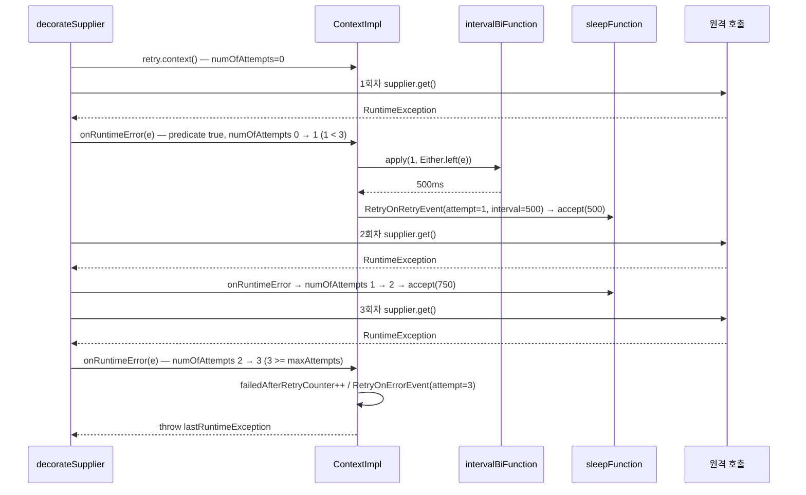

# Retry와 백오프 — 재시도가 장애를 키우지 않게

재시도는 가장 쉽게 넣고 가장 쉽게 장애를 증폭시키는 장치다. `RetryImpl.ContextImpl` 의 생명주기를 따라가며 `maxAttempts` 의 정확한 의미, `IntervalFunction` 전종의 실제 수식, 지터 없을 때의 재시도 폭풍, CircuitBreaker와의 조합 순서를 소스로 확정한다.

## 목차
- [1. 핵심 개념 (What)](#1-핵심-개념-what)
- [2. 왜 알아야 하는가 (Why)](#2-왜-알아야-하는가-why)
- [3. 내부 구현 분석 (How)](#3-내부-구현-분석-how)
- [4. 실전 예제](#4-실전-예제)
- [5. 정리](#5-정리)

---

## 1. 핵심 개념 (What)

### `maxAttempts` 는 "재시도 횟수"가 아니라 "총 시도 횟수"다

`RetryConfig` 의 기본값은 `DEFAULT_WAIT_DURATION = 500`, `DEFAULT_MAX_ATTEMPTS = 3` 이다. `maxAttempts=3` 은 **최초 호출 1회 + 재시도 2회 = 총 3회 실행**이다. 근거는 `ContextImpl.throwOrSleepAfterException()` 이다.

```java
private void throwOrSleepAfterException() throws Exception {
    int currentNumOfAttempts = numOfAttempts.incrementAndGet();
    Exception throwable = lastException.get();
    if (currentNumOfAttempts >= maxAttempts) {
        failedAfterRetryCounter.increment();
        publishRetryEvent(() -> new RetryOnErrorEvent(getName(), currentNumOfAttempts, throwable));
        throw throwable;                      // 마지막 예외를 그대로 다시 던진다
    }
    waitIntervalAfterException(currentNumOfAttempts, Either.left(throwable));
}
```

`numOfAttempts` 는 0에서 시작해 실패 1건당 1 증가하고, `>= maxAttempts` 면 마지막 예외를 다시 던진다. 1회차 실패 → `1 >= 3` 아님 → 대기, 2회차 실패 → 대기, 3회차 실패 → `3 >= 3` → **throw**. **실행 3회, 대기 2회.** `maxAttempts=1` 이면 재시도가 아예 없다.

### `RetryConfig` 전 항목

| 옵션 | 타입 | 기본값 | 의미 |
|---|---|---|---|
| `maxAttempts` | `int` | **3** | **총 시도 횟수**. `>= 1` |
| `waitDuration` | `Duration` | (없음) | 고정 대기. 내부적으로 `intervalBiFunction` 을 설정한다. `toMillis() >= 0` |
| `intervalFunction` / `intervalBiFunction` | `IntervalFunction` / `IntervalBiFunction<T>` | 고정 500ms (`ofDefaults()`) | 시도 횟수 → 대기 ms / (시도 횟수, 결과\|예외) → 대기 ms |
| `retryOnResultPredicate` | `Predicate<T>` | **null (비활성)** | 정상 반환값을 보고 재시도할지 |
| `retryExceptions` / `ignoreExceptions` | `Class[]` | **빈 배열** | 재시도할 / 재시도하지 않을 예외(상속 포함) |
| `retryOnExceptionPredicate` | `Predicate<Throwable>` | **null** | 커스텀 재시도 판정 |
| `failAfterMaxAttempts` / `writableStackTraceEnabled` | `boolean` | **false** / **true** | 결과 기반 재시도 소진 시 `MaxRetriesExceededException` 던질지 / 그 예외의 스택트레이스 생성 여부 |
| `consumeResultBeforeRetryAttempt` | `BiConsumer<Integer, T>` | **null** | 재시도 직전 결과로 할 일(리소스 정리 등) |

`intervalFunction` 과 `intervalBiFunction` 은 **상호 배타적**이다. Builder 메서드가 서로를 null 로 밀어내고, `build()` 에도 `if (intervalFunction != null && intervalBiFunction != null) throw new IllegalStateException("The intervalFunction was configured twice ...")` 방어가 있다.

---

## 2. 왜 알아야 하는가 (Why)

### 지터 없으면 재시도가 장애를 복제한다

1,000개 스레드/인스턴스가 같은 다운스트림을 호출하는데 t=0 에 그것이 5초간 죽는다고 하자.

**고정 간격 500ms (`ofDefaults()`)** — 실패 시점이 같으면 재시도 시점도 같다. t=500ms, t=1000ms 에 **1,000개가 같은 밀리초에** 도착하고, 다운스트림이 겨우 살아나는 순간 다시 죽는다. 이게 **thundering herd / retry storm** 이다. **지수 백오프만 추가(`ofExponentialBackoff(500, 1.5)`)** 하면 간격은 500 → 750 → 1125ms 로 벌어지지만 **동기화는 그대로다** — 총 재시도 압력은 줄고 순간 피크는 줄지 않는다. 많은 팀이 여기서 멈춘다.

**지터 추가 (`ofExponentialRandomBackoff(500, 1.5, 0.5)`)** — `randomizationFactor=0.5` 면 기준값 ±50% 로 흩어진다. 1회차는 500ms 기준 약 250~751ms(분산 폭 501ms), 2회차는 750ms 기준 약 375~1,126ms(751ms), 3회차는 1,125ms 기준 약 563~1,688ms(1,125ms)다. 1,000개가 501ms 구간에 균등 분포하면 피크는 약 **2 req/ms** — 동시 1,000 대비 500배 완화다. **지터는 선택이 아니라 필수다.**

### 멱등성 없는 API 에 Retry 를 걸면 중복 결제가 난다

서버가 결제를 **성공적으로 처리하고** 응답만 늦게 보내면 클라이언트는 `SocketTimeoutException` 을 받는다. Retry 는 이걸 실패로 보고 재시도하고, 서버는 두 번째 결제를 또 처리한다. **고객 카드에 두 번 청구된다.** 라이브러리는 그 호출이 멱등인지 알 수 없으므로 막아주지 않는다 — 방어는 애플리케이션 책임이다(4.2절). 판단 기준은 멱등성이다. GET/조회와 PUT(전체 교체)은 안전하고, DELETE 는 "이미 삭제됨"을 404로 돌려주는 경우만 처리하면 대체로 안전하다. POST(생성/결제)는 **멱등 키 없이는 금지**이고, PATCH 의 증감 연산(`balance += 100`)은 애초에 멱등이 아니라 재시도 대상이 아니다.

### `CASBackoffUtil` 은 Retry 가 쓰지 않는다

레포 전체에서 참조는 세 곳뿐이다 — `LockFreeFixedSizeSlidingWindowMetrics`, `LockFreeSlidingTimeWindowMetrics`, 그리고 자신의 테스트. **Retry 와 무관하다.**

이름이 비슷해 혼동하기 쉽지만 역할이 완전히 다르다. `CASBackoffUtil` 은 lock-free 윈도의 CAS 재시도 루프에서 **마이크로초(1~11µs)** 단위로 `Thread.onSpinWait()` → `LockSupport.parkNanos()` 를 써 JVM 내 스레드 경합을 완화한다. `IntervalFunction` 은 Retry/CircuitBreaker OPEN 대기에서 **밀리초** 단위로 `Thread.sleep()` 또는 스케줄러를 써 원격 의존성의 회복을 기다린다. 다만 **지터로 thundering herd 를 막는 원리는 동일**하다. `CASBackoffUtil` 도 스레드 ID 기반 지터를 쓰고, 주석에 "Thundering herd prevention: Threads don't wake up simultaneously" 라고 명시돼 있다. 스케일만 다른 같은 문제, 같은 해법이다.

---

## 3. 내부 구현 분석 (How)

### 3.1 재시도 루프는 데코레이터에 있다

```java
static <T> Supplier<T> decorateSupplier(Retry retry, Supplier<T> supplier) {
    return () -> {
        Retry.Context<T> context = retry.context();
        do {
            try {
                T result = supplier.get();
                final boolean validationOfResult = context.onResult(result);
                if (!validationOfResult) {
                    context.onComplete();
                    return result;
                }
            } catch (RuntimeException runtimeException) {
                context.onRuntimeError(runtimeException);
            }
        } while (true);
    };
}
```

- **3행**: `retry.context()` 는 **호출마다 새 `ContextImpl` 을 만든다.** `Retry` 인스턴스는 공유되지만 `numOfAttempts` 는 호출 단위로 격리된다.
- **7행**: `onResult()` 가 `true` 면 "재시도 필요"다. 이름은 `onResult` 지만 실제로는 **"재시도할까?"를 묻는 메서드**다.
- **11행 + `while (true)`**: `onRuntimeError()` 는 **예외를 다시 던지거나(종료) 조용히 반환한다(= 대기 완료, 계속)**. 종료 조건이 루프에 없고 전부 Context 가 결정한다.

`decorateCheckedSupplier()` 는 `catch (Exception)` + `onError()` 를, `decorateSupplier()`/`decorateRunnable()`/`decorateFunction()`/`decorateConsumer()` 는 `catch (RuntimeException)` + `onRuntimeError()` 를 쓴다 — 체크 예외를 재시도하려면 `decorateCheckedSupplier()` 가 필요하다.



### 3.2 예외 분류: 단일 predicate 로 합성된다

`ContextImpl.onError()` 는 `exceptionPredicate.test(exception)` 이 참이면 `lastException` 에 담고 `throwOrSleepAfterException()` 으로 넘기고, 거짓이면 `failedWithoutRetryCounter++` 후 `RetryOnIgnoredErrorEvent` 를 쏘고 **대기 없이 즉시 예외를 전파**한다. 그 `exceptionPredicate` 합성 로직이 `RetryConfig.Builder` 에 있다.

```java
private Predicate<Throwable> createExceptionPredicate() {
    return createRetryOnExceptionPredicate()
        .and(PredicateCreator.createNegatedExceptionsPredicate(ignoreExceptions)
            .orElse(DEFAULT_RECORD_FAILURE_PREDICATE));
}

private Predicate<Throwable> createRetryOnExceptionPredicate() {   // retryExceptions ∪ predicate
    return PredicateCreator.createExceptionsPredicate(retryOnExceptionPredicate, retryExceptions)
        .orElse(DEFAULT_RECORD_FAILURE_PREDICATE);
}
```

**(retryExceptions ∪ retryOnExceptionPredicate) AND NOT ignoreExceptions** 다. `createNegatedExceptionsPredicate()` 가 `Predicate::negate` 를 적용해 `ignoreExceptions` 를 후단 AND 조건으로 붙이므로 **ignore 가 항상 우선**이다. CircuitBreakerConfig 와 다른 점 두 가지:

1. Retry 에는 **ignore 쪽 predicate 버전이 없다.** 클래스 목록만 지원한다. 조건부 무시가 필요하면 `retryOnException(Predicate)` 안에서 부정 조건을 직접 써야 한다.
2. 기본값이 `DEFAULT_RECORD_FAILURE_PREDICATE = throwable -> true` → **아무 설정도 안 하면 모든 예외를 재시도한다.** `IllegalArgumentException` 처럼 "절대 성공하지 않을" 예외까지 3번 시도한다. `retryExceptions` 또는 `ignoreExceptions` 중 하나는 반드시 설정해야 한다.

`onError(Exception)` 과 `onRuntimeError(RuntimeException)` 은 저장 필드만 다르며(`lastException` / `lastRuntimeException`) `onComplete()` 가 두 필드를 모두 확인한다.

### 3.3 결과 기반 재시도와 `onComplete()`

```java
@Override
public boolean onResult(T result) {
    if (null != resultPredicate && resultPredicate.test(result)) {
        totalAttemptsCounter.increment();
        int currentNumOfAttempts = numOfAttempts.incrementAndGet();
        if (currentNumOfAttempts >= maxAttempts) return false;   // 마지막 결과를 그대로 반환
        if (consumeResultBeforeRetryAttempt != null) {
            consumeResultBeforeRetryAttempt.accept(currentNumOfAttempts, result);
        }
        waitIntervalAfterRuntimeException(currentNumOfAttempts, Either.right(result));
        return true;
    }
    return false;                             // resultPredicate 가 null 이면 항상 여기
}
```

- **3행**: `resultPredicate` 가 null(기본)이면 즉시 `false` — 결과 기반 재시도는 **옵트인**이다.
- **6행**: 시도 소진 시 `false` 반환 → 데코레이터가 `onComplete()` 를 부르고 **마지막 결과를 그대로 반환한다.** 예외가 아니라 "불만족스러운 값"이 호출자에게 간다. 이걸 바꾸는 게 `failAfterMaxAttempts` 다.
- **7~9행**: `consumeResultBeforeRetryAttempt` 는 **대기 전에** 호출된다. HTTP 응답 바디/커넥션 정리 자리이고, 안 하면 재시도 3번에 스트림 3개가 누수된다.

`onComplete()` 의 세 갈래: `0 < attempts < maxAttempts` 면 `succeededAfterRetry++` + `RetryOnSuccessEvent`, `attempts >= maxAttempts` 면 `failedAfterRetry++` + `RetryOnErrorEvent`(그리고 `failAfterMaxAttempts` 면 `MaxRetriesExceededException` throw), `attempts == 0` 이면 `succeededWithoutRetry++`.

**`attempts >= maxAttempts` 로 진입하는 경로는 결과 기반 재시도뿐이다.** 예외 기반은 `throwOrSleepAfterException()` 에서 이미 예외를 던져 데코레이터를 탈출하므로 `onComplete()` 에 도달하지 않는다. 따라서 **`failAfterMaxAttempts(true)` 는 `retryOnResult` 와 같이 쓸 때만 의미가 있다** — javadoc 도 그렇게 적었다. 클래스가 둘인 것도 헷갈린다. `MaxRetriesExceeded extends RuntimeException` 은 실제 예외가 없을 때 `RetryOnErrorEvent` 에 넣는 **플레이스홀더**이고, 실제로 던져지는 것은 `writableStackTraceEnabled` 를 반영하는 `MaxRetriesExceededException` 이다.

### 3.4 대기: 동기는 블로킹, 비동기는 스케줄러

동기 경로의 수면은 **JVM 전역 static** 을 통한다 — `/*package*/ static CheckedConsumer<Long> sleepFunction = Thread::sleep;` 와 `public static void setSleepFunction(...)`.

- `Thread::sleep` — **호출 스레드를 블로킹한다.** 톰캣 워커에서 `maxAttempts=3` + 500ms 면 스레드 하나가 최악 1초를 자며 점유된다. 100 RPS 경로에서 다운스트림이 죽으면 워커 풀이 순식간에 마른다 — **Retry 를 넣고 오히려 전체 서비스가 죽는 메커니즘이다.**
- `setSleepFunction()` 은 테스트 훅인데 `public static` 이라, 프로덕션 코드나 병렬 테스트에서 호출하면 다른 모든 Retry 에 영향을 준다.

음수 간격의 의미도 소스에서만 보인다.

```java
private void waitIntervalAfterException(int currentNumOfAttempts, Either<Throwable, T> either) throws Exception {
    long interval = intervalBiFunction.apply(numOfAttempts.get(), either);
    // interval < 0 이면 RetryOnErrorEvent, 아니면 RetryOnRetryEvent 를 쏜다 (publishRetryEvent)
    try {
        sleepFunction.accept(interval);       // 그런데 음수여도 호출된다
    } catch (InterruptedException ex) {
        Thread.currentThread().interrupt();
        throw lastException.get();
    } catch (Throwable ex) {
        throw lastException.get();            // Thread.sleep(-1) 의 IAE 가 여기로 온다
    }
}
```

"음수 = 중단"이 **예외 경유로** 구현돼 있는 셈이다. 주의: 결과 기반 경로(`Either.right(result)`)에서는 `lastRuntimeException` 이 null 이라 `IllegalStateException("Unexpected exception during retry wait interval", ex)` 이 나간다. **`retryOnResult` + 커스텀 `intervalBiFunction` 조합에서 음수를 반환하면 안 된다.**

비동기는 전혀 다르다. `AsyncContext` 는 지연을 **반환**하고 `AsyncRetryBlock` 이 `delay < 0` 이면 `promise.completeExceptionally(t)`, 아니면 `scheduler.schedule(this, delay, MILLISECONDS)` 로 재실행한다.

두 Context 의 계약이 다르다. 동기 `Context` 는 `onResult` 가 `boolean`(true = 재시도), `onError` 는 `void` 에 재시도 불가면 throw, `onRuntimeError` 가 존재하고, 대기 중 스레드를 점유한다. 비동기 `AsyncContext` 는 `onResult`/`onError` 가 모두 `long` ms 지연(`-1` = 중단)을 반환하고, `onRuntimeError` 가 **없으며**, 스케줄러가 재실행하므로 대기 중 스레드를 점유하지 않는다. WebFlux / `CompletableFuture` 기반이라면 `decorateCompletionStage(scheduler, supplier)` 를 써야 하는 이유다.

### 3.5 `IntervalFunction` 전종의 실제 수식

상수는 `io.github.resilience4j.core.IntervalFunction` 의 `DEFAULT_INITIAL_INTERVAL = 500`, `DEFAULT_MULTIPLIER = 1.5`, `DEFAULT_RANDOMIZATION_FACTOR = 0.5` 다. 지수 백오프는 `Math.pow` 가 아니다.

```java
static IntervalFunction of(long intervalMillis, Function<Long, Long> backoffFunction) {
    checkInterval(intervalMillis);
    requireNonNull(backoffFunction);
    return (attempt) -> {
        checkAttempt(attempt);
        return LongStream.iterate(intervalMillis, n -> backoffFunction.apply(n))
            .skip(attempt - 1L).findFirst().getAsLong();      // Math.pow 가 아닌 반복 적용
    };
}

static IntervalFunction ofExponentialBackoff(long initial, double multiplier) {
    return of(initial, x -> (long) (x * multiplier));         // 매 단계 소수부 버림
}
```

매 단계 `(long)` 캐스팅으로 소수부가 버려지므로 순수 수식과 미세하게 달라진다. `ofExponentialBackoff(500, 1.5)` 는 attempt 4에서 `(long)(1125 × 1.5) = 1687`(순수 1687.5), attempt 5에서 `2530`(순수 2531.25), attempt 6에서 `3795`(순수 3796.875)다. 지터는 `IntervalFunctionCompanion.randomize()` 로 `[current × (1-f), current × (1+f)]` 균등 분포에 `Math.max(1.0, ...)` 최소 1ms 클램프를 건다.

| 팩토리 | 수식 | 지터 | 상한 | 프로덕션 |
|---|---|---|---|---|
| `ofDefaults()` / `of(d)` | 고정 | X | - | X (재시도 폭풍) |
| `of(interval, backoffFn)` | `backoffFn^(attempt-1)(interval)` | 설계에 따름 | - | - |
| `ofRandomized(d, f)` | `randomize(d, f)` | O | - | 고정 간격이 필요할 때만 |
| `ofExponentialBackoff(i, m)` / `(i, m, max)` | 반복 곱 / `min(지수값, max)` | X | X / O | X / 부분적 |
| `ofExponentialRandomBackoff(i, m, f)` | `randomize(지수값, f)` | O | **X** | X |
| `ofExponentialRandomBackoff(i, m, f, max)` | `min(randomize(지수값, f), max)` | O | O | **O** |

상한 적용 지점이 중요하다 — `Math.min(interval, maxIntervalMillis)` 가 **지터를 적용한 뒤에** 걸린다. 지수값이 상한을 크게 넘으면 지터가 사라지고 모든 재시도가 `maxInterval` 에 수렴해 **다시 동기화된다**(해법: 4.1절). 그리고 `ofExponentialRandomBackoff(500, 2.0)` 처럼 상한 없는 오버로드는 `maxAttempts=10` 에서 9번째 대기가 `500 × 2^8 = 128초` 다 — **상한 인자가 있는 오버로드를 쓰라.**

**참고:** `resilience4j-retry` 모듈에도 `io.github.resilience4j.retry.IntervalFunction` 파일(42줄)이 있는데 내용은 package-private `IntervalFunctionCompanion` 뿐이고 레포 전체에 참조가 없다. 과거 deprecated 인터페이스의 잔해이고, 그 `checkInterval()` 은 `< 10ms` 를 거부해 core 버전(`< 1ms`)과 기준도 다르다. `import` 가 `core` 쪽인지 확인하라.

### 3.6 CircuitBreaker 와의 조합 순서

Spring AOP 기본 순서는 각 `*ConfigurationProperties` 의 기본값으로 확정된다 — `retryAspectOrder = LOWEST_PRECEDENCE - 5`, `circuitBreakerAspectOrder = -4`, `rateLimiterAspectOrder = -3`, `timeLimiterAspectOrder = -2`, `bulkheadAspectOrder = -1`. order 값이 작을수록 바깥이므로 기본 중첩은 `Retry ( CircuitBreaker ( RateLimiter ( TimeLimiter ( Bulkhead ( 실제 호출 ) ) ) ) )` 이다. **Retry 가 바깥, CircuitBreaker 가 안쪽**이고, 이게 맞는 선택이다.

기본 순서(Retry 바깥 / CB 안쪽)에서는 CB 윈도가 **물리 시도 1건당 1회** 기록하므로 실제 실패 횟수가 그대로 반영되고, 서킷이 열린 뒤 남은 재시도는 즉시 `CallNotPermittedException` 을 받아 **fail fast** 한다 — 서킷이 열리면 재시도 자체가 차단된다. 반대로 CB 를 바깥에 두면 논리 호출 1건당 1회만 기록되어 3번 실패가 1건으로 희석되고, 서킷이 열려도 안쪽 Retry 는 계속 돌아 폭풍이 길어진다.

핵심은 **"서킷브레이커는 다운스트림의 실제 부하를 봐야 한다"** 는 것이다. 재시도 3번은 다운스트림 입장에서 요청 3개다. 그걸 1건으로 세면 서킷은 실제보다 3배 둔감해진다. 단, 기본 순서에는 반드시 따라오는 설정이 있다 — **Retry 가 `CallNotPermittedException` 을 재시도하지 않게** `ignore-exceptions` 에 넣어야 한다. 자세한 조합 설계는 [12번 문서](./12-timelimiter-and-composition.md)에서 다룬다.

---

## 4. 실전 예제

### 4.1 지수 백오프 + 지터 (프로덕션 기본형)

```java
package com.example.resilience.config;

import io.github.resilience4j.circuitbreaker.CallNotPermittedException;
import io.github.resilience4j.core.IntervalFunction;
import io.github.resilience4j.retry.RetryConfig;
import io.github.resilience4j.retry.RetryRegistry;
import org.springframework.context.annotation.Bean;
import org.springframework.context.annotation.Configuration;
import java.net.ConnectException;
import java.net.SocketTimeoutException;
import java.time.Duration;
import java.util.concurrent.TimeoutException;

@Configuration
public class RetryProfiles {

    /**
     * 외부 HTTP API 기본 재시도. maxAttempts=3 → 총 3회 실행(최초 1 + 재시도 2).
     * - 상한 인자가 있는 ofExponentialRandomBackoff 오버로드를 쓴다(3.5절).
     * - retryExceptions 로 일시적 장애만 화이트리스트. 기본값은 "전부 재시도"다.
     * - ignoreExceptions 에 CallNotPermittedException: Retry 가 CB 보다 바깥(기본 order)이라
     *   서킷이 열린 뒤 재시도는 백오프 시간만 낭비한다. 즉시 폴백으로 보낸다.
     *
     * 최악 소요: 호출 3회 + 대기 [100,301] + [200,601] = 대기 최대 902ms.
     * readTimeout 2s 라면 최악 약 6.9s — 상위 TimeLimiter / SLA 와 반드시 검산하라.
     */
    @Bean
    public RetryConfig externalApiRetryConfig() {
        return RetryConfig.custom()
            .maxAttempts(3)
            .intervalFunction(IntervalFunction.ofExponentialRandomBackoff(
                Duration.ofMillis(200), 2.0, 0.5, Duration.ofSeconds(2)))
            .retryExceptions(
                SocketTimeoutException.class, ConnectException.class, TimeoutException.class)
            .ignoreExceptions(CallNotPermittedException.class)
            .failAfterMaxAttempts(false)      // 마지막 예외를 그대로 전파
            .writableStackTraceEnabled(false)
            .build();
    }

    @Bean   // 기본 설정으로 레지스트리를 구성한다
    public RetryRegistry retryRegistry() {
        return RetryRegistry.custom().withRetryConfig(externalApiRetryConfig()).build();
    }
}
```

재시도 5회 이상이면 상한 구간의 동기화(3.5절)를 직접 풀어야 한다. `IntervalFunction` 은 함수형 인터페이스이므로 조합이 간단하다 — `attempt -> IntervalFunction.ofRandomized(Math.min(exponential.apply(attempt), capMillis), 0.5).apply(1)` 처럼 상한을 먼저 걸고 그 위에 지터를 다시 얹으면 된다.

`retryOnResultPredicate` 로 특정 응답코드만 재시도하려면 같은 빌더에 아래를 더한다. `onResult()` 가 `true` 를 반환하면 "재시도"이므로 predicate 에는 **재시도할 조건**을 쓴다. 시도가 소진되면 마지막 응답이 그대로 반환되므로 예외로 받으려면 `failAfterMaxAttempts(true)` 가 필요하다. `IntervalBiFunction<T>` 의 타입은 `BiFunction<Integer, Either<Throwable, T>, Long>` — **왼쪽이 Throwable, 오른쪽이 결과**이고, `Either<Object, Throwable>` 를 쓰는 CircuitBreaker 의 `transitionOnResult` 와 좌우가 반대다.

```java
RetryConfig.<ResponseEntity<String>>custom()        // RetryConfig 자체는 제네릭이 아니다
    .maxAttempts(4)
    .retryOnResult(r -> r != null && Set.of(429, 502, 503, 504).contains(r.getStatusCode().value()))
    // 대기 전에 호출된다 — 응답 바디/커넥션 정리 자리. 안 하면 재시도마다 리소스가 샌다.
    .consumeResultBeforeRetryAttempt((attempt, r) ->
        log.warn("retry_on_status attempt={} status={}", attempt, r.getStatusCode().value()))
    // 음수를 반환하면 안 된다 — 결과 기반 경로에서 IllegalStateException 이 난다(3.4절).
    .intervalBiFunction((attempt, resultOrError) -> IntervalFunction
        .ofExponentialRandomBackoff(Duration.ofMillis(300), 2.0, 0.5, Duration.ofSeconds(5))
        .apply(attempt))
    .failAfterMaxAttempts(true)                     // 끝까지 5xx 면 MaxRetriesExceededException
    .build();
```

### 4.2 멱등 키 패턴 — 중복 결제 방어

핵심은 **재시도 전체가 같은 멱등 키를 공유하는 것**이다. 키 생성을 데코레이트되는 람다 **밖**에 둔다.

```java
package com.example.payment;

import io.github.resilience4j.retry.Retry;
import org.slf4j.Logger;
import org.slf4j.LoggerFactory;
import org.springframework.stereotype.Service;
import java.util.UUID;
import java.util.function.Supplier;

@Service
public class PaymentService {

    private static final Logger log = LoggerFactory.getLogger(PaymentService.class);

    private final PaymentApiClient client;
    private final Retry retry;

    public PaymentService(PaymentApiClient client, Retry paymentRetry) {
        this.client = client;
        this.retry = paymentRetry;
    }

    /**
     * 멱등 키를 재시도 루프 "밖"에서 한 번만 생성한다. decorateSupplier 의 루프는 넘겨준
     * Supplier 를 그대로 재호출하므로, Supplier 안에서 UUID 를 만들면 시도마다 키가 달라져
     * 멱등성이 깨진다. 밖에서 만들면 1·2·3회차가 동일 키로 요청하고 서버는 "이미 처리한 키"를
     * 보고 기존 결과를 돌려준다.
     *
     * 서버 측 요구사항(이것 없이는 클라이언트 재시도가 안전해지지 않는다): 멱등 키를 유니크
     * 인덱스로 저장하고 중복 요청에는 기존 결과를 반환한다. 보존 기간은 클라이언트 최대
     * 재시도 소요 시간보다 길게(최소 24시간).
     */
    public PaymentResult pay(PaymentCommand command) {
        String idempotencyKey = command.clientRequestId() != null
            ? command.clientRequestId()           // 상위 계층이 준 키를 우선
            : UUID.randomUUID().toString();       // 없으면 여기서 한 번만 생성

        Supplier<PaymentResult> decorated = Retry.decorateSupplier(retry,
            () -> client.charge(idempotencyKey, command));
        try {
            return decorated.get();
        } catch (RuntimeException e) {
            // 재시도를 모두 소진했다. 결제 성공 여부를 "알 수 없는" 상태다.
            // 조회 API 로 최종 상태를 확인하는 보상 작업을 반드시 큐에 넣는다.
            log.error("payment_exhausted key={} orderId={}", idempotencyKey, command.orderId(), e);
            throw new PaymentUncertainException(idempotencyKey, e);
        }
    }

    public record PaymentCommand(String orderId, long amount, String clientRequestId) {}
    public record PaymentResult(String paymentId, String status) {}
    public interface PaymentApiClient {
        PaymentResult charge(String idempotencyKey, PaymentCommand command);
    }

    /** 실패가 아니라 "미확정"임을 타입으로 드러낸다. 보상 작업이 getIdempotencyKey() 로 확정한다. */
    public static class PaymentUncertainException extends RuntimeException {
        private final String idempotencyKey;
        public PaymentUncertainException(String key, Throwable cause) {
            super("Payment outcome unknown for idempotencyKey=" + key, cause);
            this.idempotencyKey = key;
        }
        public String getIdempotencyKey() { return idempotencyKey; }
    }
}
```

재시도를 소진했을 때 **"실패"가 아니라 "알 수 없음"** 으로 처리하는 것이 요점이다. 마지막 시도가 타임아웃이었다면 결제는 성공했을 수도 있다. 멱등 키를 남기고 조회로 확정하는 보상 흐름이 없으면 멱등 키를 써도 고객 문의가 끊이지 않는다.

---

## 5. 정리

| 메서드 | 호출 시점 | 동기 / 비동기 |
|---|---|---|
| `context()` / `asyncContext()` | 호출 1건 시작 | 새 `ContextImpl`(`numOfAttempts=0`) / 새 `AsyncContextImpl` |
| `onResult(T)` | 정상 반환 직후 | `true` = 재시도(대기 포함), `false` = 종료 / `long` ms, `-1` = 종료 |
| `onError(Exception)` | 체크 예외 포착 | 가능하면 대기 후 반환, 불가면 throw / `long` ms, `-1` = 종료 |
| `onRuntimeError(RuntimeException)` | 런타임 예외 포착 | `lastRuntimeException` 에 저장 후 동일 / **없음** |
| `onComplete()` | 재시도 종료 후 | 지표·이벤트 확정, `failAfterMaxAttempts` 면 throw (동일) |

| 옵션 | 기본값 → 프로덕션 권장 |
|---|---|
| `maxAttempts` | 3(= 총 3회 실행) → 2~3. 5 이상은 상위 SLA 와 검산 |
| `intervalFunction` | 고정 500ms → `ofExponentialRandomBackoff(init, m, f, **maxInterval**)` |
| `retryExceptions` / `ignoreExceptions` | 빈 배열(= **전부 재시도**) → 일시적 장애만 화이트리스트 / `CallNotPermittedException` 필수 |
| `failAfterMaxAttempts` / `consumeResultBeforeRetryAttempt` | false / null → 둘 다 `retryOnResult` 를 쓸 때만 의미 있음(후자는 리소스 정리용) |
| `writableStackTraceEnabled` | true → false |

리뷰 체크리스트:

1. **`maxAttempts` 를 "재시도 횟수"로 오해하지 않았는지.** 3은 총 3회 실행이다.
2. **지터가 있는지.** `ofExponentialBackoff` 만으로는 재시도 시점이 동기화된다.
3. **상한(`maxInterval`)이 있는지.** 없는 오버로드는 대기가 분 단위로 커진다.
4. **`retryExceptions`/`ignoreExceptions` 중 하나라도 설정했는지.** 기본값은 "모든 예외 재시도"다.
5. **`CallNotPermittedException` 을 `ignoreExceptions` 에 넣었는지.** 그리고 **멱등성 없는 쓰기에 Retry 가 걸려 있지 않은지** — 걸려 있다면 멱등 키가 루프 밖에서 생성되는지.
6. **동기 블로킹 비용을 계산했는지.** `Thread::sleep` 이 워커 스레드를 점유한다. 가능하면 `decorateCompletionStage()`.
7. **`RetryImpl.setSleepFunction()` 호출이 프로덕션 코드에 없는지**(JVM 전역 static), **`io.github.resilience4j.core.IntervalFunction` 을 import 했는지**(`retry` 패키지 동명 파일은 잔해다).

---

## 관련 문서
- 선행: [CircuitBreakerConfig 전 항목 — 숫자를 어떻게 정하나](./07-circuitbreaker-config.md)
- 후행: [RateLimiter ① AtomicRateLimiter 내부](./09-ratelimiter-atomic.md)
- 참고: [TimeLimiter와 조합 설계](./12-timelimiter-and-composition.md) · [AOP Aspect 와 적용 순서](../advanced/02-aop-aspects.md) · [프로덕션 설계](../advanced/12-production-design.md)

---
*Resilience4j v2.4.0 기준 · 소스 커밋 7e3ab525*
