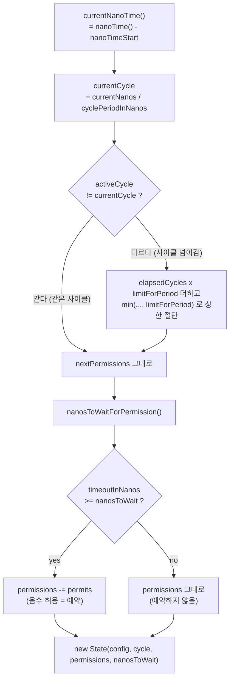

# RateLimiter ① AtomicRateLimiter — 락 없이 나노초로 센다

`AtomicRateLimiter`는 토큰을 실제로 저장하지 않습니다. "지금이 몇 번째 사이클의 몇 나노초인지"만 계산해서 허용 여부를 결정하고, 불변 `State` 객체를 `AtomicReference`로 교체하는 CAS 루프로 동시성을 처리합니다.

## 목차
- [1. 핵심 개념 (What)](#1-핵심-개념-what)
- [2. 왜 알아야 하는가 (Why)](#2-왜-알아야-하는가-why)
- [3. 내부 구현 분석 (How)](#3-내부-구현-분석-how)
- [4. 실전 예제](#4-실전-예제)
- [5. 정리](#5-정리)

---

## 1. 핵심 개념 (What)

토큰 버킷(token bucket)을 구현하라고 하면 대부분 이렇게 씁니다. 버킷 객체를 만들고, 스케줄러가 주기마다 토큰을 채우고, 요청이 오면 하나 꺼낸다. `AtomicRateLimiter`는 그 중 **채우는 과정을 아예 없앱니다.**

`AtomicRateLimiter`의 전체 상태는 숫자 3개입니다. `AtomicRateLimiter.State`를 보세요.

```java
private static class State {

    private final RateLimiterConfig config;

    private final long activeCycle;
    private final int activePermissions;
    private final long nanosToWait;
    ...
}
```

- `activeCycle` — 마지막으로 계산에 쓰인 사이클 번호
- `activePermissions` — 그 시점의 남은 허용량. **음수가 될 수 있습니다**
- `nanosToWait` — 마지막 호출자가 기다려야 했던 나노초

사이클(cycle)은 `nanoTimeStart` 이후의 경과 시간을 `limitRefreshPeriod`로 나눈 몫입니다. `limitRefreshPeriod=1s`면 1초마다 사이클 번호가 1 증가하고, 사이클이 바뀐 것을 발견하면 "그 사이에 몇 사이클 지났는지 × `limitForPeriod`"만큼을 한 번에 더해버립니다. 스케줄러도, 백그라운드 스레드도 없습니다. 아무도 호출하지 않는 동안에는 아무 일도 일어나지 않고, 다음 호출자가 계산으로 따라잡습니다.

클래스 Javadoc이 그 설명을 직접 하고 있습니다.

> By contract on start of each cycle `AtomicRateLimiter` should set `State#activePermissions` to `RateLimiterConfig#getLimitForPeriod`. For the `AtomicRateLimiter` callers it is really looks so, but under the hood there is some optimisations that will skip this refresh if `AtomicRateLimiter` is not used actively.

### 설정값 (`RateLimiterConfig`)

| 옵션 | 기본값 | 의미 |
|---|---|---|
| `limitForPeriod` | `50` | 한 주기에 허용할 호출 수. 1 미만이면 `IllegalArgumentException` |
| `limitRefreshPeriod` | `Duration.ofNanos(500)` | 주기 길이. 1ns 미만이면 `IllegalArgumentException` |
| `timeoutDuration` | `Duration.ofSeconds(5)` | 허용량이 없을 때 **기다려줄** 최대 시간. 음수 금지 |
| `drainPermissionsOnResult` | `any -> false` | 호출 결과를 보고 남은 허용량을 전부 버릴지 결정하는 `Predicate<Either<? extends Throwable, ?>>` |
| `writableStackTraceEnabled` | `true` | `false`면 `RequestNotPermitted`의 스택트레이스가 빈 배열 |

기본값 조합을 계산해 보세요. 500ns에 50개면 **초당 1억 회**입니다. `RateLimiterConfig.ofDefaults()`는 사실상 제한이 없는 설정입니다. 프로덕션에서 `limitForPeriod`만 바꾸고 `limitRefreshPeriod`를 그대로 두면 아무것도 제한하지 않습니다. 코드 리뷰에서 이 둘은 항상 같이 보세요.

### 음수 permission = 예약

`timeoutDuration`이 0보다 크면 `AtomicRateLimiter`는 허용량을 **미리 당겨씁니다.** 지금 남은 게 0인데 다음 사이클까지 300ms 남았고 `timeoutDuration`이 1초라면, `activePermissions`를 `-1`로 만들고 호출자에게 "300ms 기다려"라고 알려줍니다. 호출자는 그 시간 동안 `parkNanos`로 자고, 깨면 그냥 진행합니다. 다시 확인하지 않습니다. 자리를 **이미 예약해 두었기** 때문입니다.

이게 `AtomicRateLimiter`가 "대기 가능한(waiting) rate limiter"가 되는 방식이고, `SemaphoreBasedRateLimiter`가 `reservePermission()`에서 `UnsupportedOperationException`을 던지는 이유입니다.

---

## 2. 왜 알아야 하는가 (Why)

**첫째, 이게 기본 구현입니다.** `RateLimiter.of(...)`, `RateLimiter.ofDefaults(...)` 전부 `new AtomicRateLimiter(...)`를 반환합니다. `InMemoryRateLimiterRegistry`의 `computeIfAbsent`도 `new AtomicRateLimiter(name, ...)`입니다. Spring Boot 설정으로 `resilience4j.ratelimiter`를 쓰면 여러분이 돌리고 있는 건 이 클래스입니다. `SemaphoreBasedRateLimiter`는 직접 `new`로 만들지 않으면 쓰이지 않습니다.

**둘째, 외부 API 쿼터는 돈과 계정 정지로 이어집니다.** "초당 10회" 같은 제약은 지키지 못하면 429를 받고, 반복되면 키가 막힙니다. Retry와 CircuitBreaker는 *실패한 뒤에* 동작하지만 RateLimiter는 *실패하기 전에* 막습니다. 성격이 다릅니다.

**셋째, lock-free라는 선택의 비용과 이득을 알아야 합니다.** `SemaphoreBasedRateLimiter`는 `Semaphore.tryAcquire(timeout)`에서 스레드를 블로킹하고, 별도 스케줄러 스레드가 주기마다 permit을 반납합니다. `AtomicRateLimiter`는 CAS 한 번으로 상태를 갱신하고 끝냅니다. 허용량이 남아 있으면 **스레드가 전혀 멈추지 않습니다.** 대신 경합이 심하면 CAS가 실패해 재시도합니다 — 그래서 `compareAndSet()` 안에 `parkNanos(1)` back-off가 들어 있습니다. 즉 고TPS·짧은 주기에 유리하고, 코어 수를 크게 넘는 스레드가 동시에 몰리면 CAS 재시도 비용이 생깁니다.

**넷째, 인스턴스 로컬입니다.** 서버 N대면 실제 한도는 N배입니다. 이건 두 구현의 공통 한계이고, [RateLimiter ② Semaphore 방식과 둘의 선택 기준](./10-ratelimiter-semaphore.md)에서 계산까지 다룹니다.

---

## 3. 내부 구현 분석 (How)

### 3.1 시간 → 사이클 → 허용량

핵심은 `AtomicRateLimiter.calculateNextState()`입니다. 이름대로 **부수효과가 없는(side-effect-free)** 순수 함수이고, 그래서 CAS 루프 안에서 몇 번이고 다시 호출해도 안전합니다.

```java
private State calculateNextState(final int permits, final long timeoutInNanos,
                                 final State activeState) {
    long cyclePeriodInNanos = activeState.config.getLimitRefreshPeriod().toNanos();
    int permissionsPerCycle = activeState.config.getLimitForPeriod();

    long currentNanos = currentNanoTime();
    long currentCycle = currentNanos / cyclePeriodInNanos;

    long nextCycle = activeState.activeCycle;
    int nextPermissions = activeState.activePermissions;
    if (nextCycle != currentCycle) {
        long elapsedCycles = currentCycle - nextCycle;
        long accumulatedPermissions = elapsedCycles * permissionsPerCycle;
        nextCycle = currentCycle;
        nextPermissions = (int) min(nextPermissions + accumulatedPermissions,
            permissionsPerCycle);
    }
    long nextNanosToWait = nanosToWaitForPermission(
        permits, cyclePeriodInNanos, permissionsPerCycle, nextPermissions, currentNanos,
        currentCycle
    );
    State nextState = reservePermissions(activeState.config, permits, timeoutInNanos, nextCycle,
        nextPermissions, nextNanosToWait);
    return nextState;
}
```

줄 단위로 읽어 봅니다.

- `currentNanoTime()`은 `nanoTimeSupplier.get() - nanoTimeStart`입니다. **벽시계가 아니라 생성 시점 기준 상대 시간**이고, `nanoTimeStart`는 생성자에서 한 번 찍습니다. NTP가 시계를 당겨도, 서버 시간을 바꿔도 영향이 없습니다. `System.nanoTime()`을 주입 가능하게 만든 생성자(`Supplier<Long> nanoTimeSupplier`)가 있어서 테스트에서 시간을 직접 조작할 수 있습니다.
- `currentCycle = currentNanos / cyclePeriodInNanos` — 정수 나눗셈 한 번이 전부입니다. 이게 "토큰을 채우지 않는다"의 실체입니다.
- `if (nextCycle != currentCycle)` — 사이클이 바뀌었으면 `elapsedCycles × permissionsPerCycle`을 더합니다. 10초 동안 아무도 호출하지 않았다면 `elapsedCycles`가 10이지만...
- `min(nextPermissions + accumulatedPermissions, permissionsPerCycle)` — **상한이 `limitForPeriod`로 잘립니다.** 쉰 만큼 쌓아두는 구조가 아닙니다. 버스트 허용량은 언제나 최대 `limitForPeriod`입니다. 토큰 버킷의 버킷 크기가 `limitForPeriod`로 고정된 것과 같습니다.
- `nanosToWaitForPermission(...)` — 지금 당장 허용 못 하면 얼마나 기다려야 하는지 계산
- `reservePermissions(...)` — 기다릴 수 있는 범위면 허용량을 깎아서(=예약) 새 `State`를 만듭니다



### 3.2 얼마나 기다려야 하는가

`AtomicRateLimiter.nanosToWaitForPermission()`입니다.

```java
private long nanosToWaitForPermission(final int permits, final long cyclePeriodInNanos,
                                      final int permissionsPerCycle,
                                      final int availablePermissions, final long currentNanos, final long currentCycle) {
    if (availablePermissions >= permits) {
        return 0L;
    }
    long nextCycleTimeInNanos = (currentCycle + 1) * cyclePeriodInNanos;
    long nanosToNextCycle = nextCycleTimeInNanos - currentNanos;
    int permissionsAtTheStartOfNextCycle = availablePermissions + permissionsPerCycle;
    int fullCyclesToWait = divCeil(-(permissionsAtTheStartOfNextCycle - permits), permissionsPerCycle);
    return (fullCyclesToWait * cyclePeriodInNanos) + nanosToNextCycle;
}
```

- `availablePermissions >= permits`면 0. 흔한 경로가 분기 하나로 끝납니다.
- `nanosToNextCycle` — 다음 사이클 시작까지 남은 시간. **사이클 경계는 절대 좌표**라서, 사이클 중간에 들어온 호출자는 다음 경계까지만 기다립니다.
- `permissionsAtTheStartOfNextCycle = availablePermissions + permissionsPerCycle` — 다음 경계에서 받게 될 허용량. `availablePermissions`가 이미 음수(예약이 쌓인 상태)면 이 값도 작아집니다.
- `fullCyclesToWait = divCeil(-(permissionsAtTheStartOfNextCycle - permits), permissionsPerCycle)` — 다음 경계 허용량으로도 부족하면 **추가로 몇 사이클을 더 기다려야 하는지**를 올림 나눗셈으로 구합니다. 예약이 많이 쌓이면 대기 시간이 선형으로 늘어나고, 결국 `timeoutDuration`을 넘겨 거절됩니다. 큐가 무한히 자라지 않게 막는 장치가 바로 `timeoutDuration`입니다.

`divCeil(x, y)`는 `(x + y - 1) / y`입니다. Javadoc에 `x`, `y` 모두 0보다 커야 한다고 명시돼 있고, 위 호출 지점에서는 `availablePermissions < permits`가 보장된 뒤라 그 전제가 성립합니다.

### 3.3 예약은 "깎아두는 것"이 전부

```java
private State reservePermissions(final RateLimiterConfig config, final int permits,
                                 final long timeoutInNanos,
                                 final long cycle, final int permissions, final long nanosToWait) {
    boolean canAcquireInTime = timeoutInNanos >= nanosToWait;
    int permissionsWithReservation = permissions;
    if (canAcquireInTime) {
        permissionsWithReservation -= permits;
    }
    return new State(config, cycle, permissionsWithReservation, nanosToWait);
}
```

세 줄이지만 이 메서드가 설계의 중심입니다.

- 기다려서 받을 수 있으면(`canAcquireInTime`) 허용량을 깎습니다. 음수가 되어도 그대로 둡니다. **음수는 "이미 미래 몫을 가져간 사람이 있다"는 뜻**입니다.
- 못 받을 상황이면 깎지 않습니다. 거절될 호출이 다른 호출자의 자리를 먹으면 안 되니까요.
- `nanosToWait`는 두 경우 모두 그대로 담깁니다. 호출자는 이 값으로 "기다릴까 / 거절할까"를 판단합니다.

### 3.4 CAS 루프와 back-off

```java
private State updateStateWithBackOff(final int permits, final long timeoutInNanos) {
    AtomicRateLimiter.State prev;
    AtomicRateLimiter.State next;
    do {
        prev = state.get();
        next = calculateNextState(permits, timeoutInNanos, prev);
    } while (!compareAndSet(prev, next));
    return next;
}

private boolean compareAndSet(final State current, final State next) {
    if (state.compareAndSet(current, next)) {
        return true;
    }
    parkNanos(1); // back-off
    return false;
}
```

- `prev = state.get()` → 계산 → CAS. 실패하면 **처음부터 다시 계산합니다.** `calculateNextState()`가 순수 함수라서 재계산이 안전하고, 시간도 다시 읽으므로 재시도 중 사이클이 넘어가면 그 사실이 자연스럽게 반영됩니다.
- `AtomicReference.updateAndGet()`을 쓰지 않은 이유는 `compareAndSet()`의 `parkNanos(1)`입니다. CAS가 실패했다는 건 다른 스레드와 부딪혔다는 뜻이고, 곧바로 재시도하면 또 부딪힙니다. 1나노초만 양보해도 경합이 크게 줄어듭니다. Javadoc이 근거 논문(arXiv 1305.5800)과 "showed great results ... in benchmark tests"를 명시하고 있습니다.
- `parkNanos(1)`은 실제로 1ns를 자는 게 아니라 OS 타이머 해상도만큼(보통 수십 µs) 멈춥니다. 양보 시간이 생각보다 길다는 걸 알고 보세요. 극단적 경합에서 지연 꼬리(tail latency)로 나타납니다.

```mermaid
sequenceDiagram
    participant T1 as Thread A
    participant T2 as Thread B
    participant S as AtomicReference&lt;State&gt;

    T1->>S: state.get() → S0
    T2->>S: state.get() → S0
    T1->>T1: calculateNextState(S0) → S1
    T2->>T2: calculateNextState(S0) → S1'
    T1->>S: compareAndSet(S0, S1) ✅
    T2->>S: compareAndSet(S0, S1') ❌
    T2->>T2: parkNanos(1) back-off
    T2->>S: state.get() → S1 (재조회)
    T2->>T2: calculateNextState(S1) → S2
    T2->>S: compareAndSet(S1, S2) ✅
```

### 3.5 대기: `parkNanos`와 인터럽트

```java
private boolean waitForPermission(final long nanosToWait) {
    waitingThreads.incrementAndGet();
    long deadline = currentNanoTime() + nanosToWait;
    boolean wasInterrupted = false;
    while (currentNanoTime() < deadline && !wasInterrupted) {
        long sleepBlockDuration = deadline - currentNanoTime();
        parkNanos(sleepBlockDuration);
        wasInterrupted = Thread.interrupted();
    }
    waitingThreads.decrementAndGet();
    if (wasInterrupted) {
        currentThread().interrupt();
    }
    return !wasInterrupted;
}
```

- `while` 루프로 감싼 이유는 `parkNanos`가 **spurious wakeup**을 허용하기 때문입니다. 데드라인까지 남은 시간을 매번 다시 계산해 다시 park합니다.
- `Thread.interrupted()`는 **플래그를 읽고 지웁니다.** 그래서 루프를 빠져나온 뒤 `currentThread().interrupt()`로 다시 세워 호출자에게 전달합니다. `InterruptedException`을 던지지 않고 인터럽트 상태만 보존하는, 라이브러리로서 올바른 처리입니다.
- 인터럽트되면 `false`를 반환하고, `acquirePermission()`은 그 값으로 `RateLimiterOnFailureEvent`를 발행합니다. 호출 쪽에서는 `RateLimiter.waitForPermission(rateLimiter, permits)` 정적 메서드가 인터럽트 상태를 먼저 확인해 `AcquirePermissionCancelledException`을, 그 외에는 `RequestNotPermitted`를 던집니다. **거절(RequestNotPermitted)과 취소(AcquirePermissionCancelledException)를 구분해야 합니다.** 전자는 재시도 대상이고 후자는 아닙니다.

`waitForPermissionIfNecessary()`의 마지막 분기도 눈여겨보세요.

```java
if (canAcquireImmediately) {
    return true;
}
if (canAcquireInTime) {
    return waitForPermission(nanosToWait);
}
waitForPermission(timeoutInNanos);
return false;
```

거절이 확정된 호출자도 `timeoutInNanos`만큼 **기다렸다가** `false`를 받습니다. 즉시 실패하지 않습니다. `timeoutDuration=5s`(기본값)로 두면 거절되는 요청도 5초를 붙잡고 있다가 실패합니다. 웹 요청 스레드에서 이 설정은 사고입니다.

### 3.6 세 가지 획득 방식

| 메서드 | 블로킹 | 반환 | 용도 |
|---|---|---|---|
| `acquirePermission(int permits)` | `timeoutDuration`까지 park | `boolean` | 동기 호출. 내부에서 대기까지 끝내줌 |
| `reservePermission(int permits)` | **하지 않음** | 즉시 가능 `0`, 가능하지만 대기 필요 `nanosToWait`, 불가 `-1` | 비동기/논블로킹. 대기는 호출자가 스케줄링 |
| `drainPermissions()` | 하지 않음 | `void` | 남은 허용량을 즉시 0으로 (서버가 429를 주면 남은 주기 포기) |

`reservePermission()`은 상태를 똑같이 갱신(=예약)하지만 park하지 않고 "몇 나노초 뒤에 오라"는 숫자만 돌려줍니다. 이벤트 루프나 Reactor 스케줄러에서 `Mono.delay(...)`로 바꿔 쓰기에 알맞습니다.

`drainPermissions()`는 `calculateNextState(prev.activePermissions, 0, prev)`로 남은 양만큼을 스스로 소비해 0으로 만듭니다. 발행하는 이벤트의 permit 수가 `Math.min(prev.activePermissions, 0)`이라 **항상 0 이하**인 반면, `SemaphoreBasedRateLimiter.drainPermissions()`는 `semaphore.drainPermits()`의 양수 결과를 그대로 넣습니다. 두 구현에서 `RateLimiterOnDrainedEvent.getNumberOfPermits()`의 의미가 다릅니다. 이 숫자로 알람을 만들지 마세요. 드레인이 일어났다는 사실만 쓰십시오.

### 3.7 메트릭은 상태를 바꾸지 않는다

```java
@Override
public int getAvailablePermissions() {
    State currentState = state.get();
    State estimatedState = calculateNextState(1, -1, currentState);
    return estimatedState.activePermissions;
}
```

`timeoutInNanos`에 `-1`을 넘기는 게 핵심입니다. `reservePermissions()`에서 `canAcquireInTime = (-1 >= nanosToWait)`는 `nanosToWait >= 0`인 한 항상 `false`이므로 **예약이 발생하지 않습니다.** 그리고 결과를 CAS하지 않으니 `state`도 그대로입니다. 순수 함수 하나를 계산용·조회용으로 같이 쓰는 깔끔한 재사용입니다.

`getDetailedMetrics()`로 받는 `AtomicRateLimiterMetrics`에는 `getNanosToWait()`, `getCycle()`이 추가로 있습니다. `RateLimiter.Metrics` 인터페이스에는 `getAvailablePermissions()`, `getNumberOfWaitingThreads()` 둘만 있으니, 상세 지표가 필요하면 `AtomicRateLimiter`로 캐스팅해야 합니다.

### 3.8 이벤트

`acquirePermission()` / `reservePermission()`은 결과에 따라 `RateLimiterOnSuccessEvent`(`Type.SUCCESSFUL_ACQUIRE`) 또는 `RateLimiterOnFailureEvent`(`Type.FAILED_ACQUIRE`)를, `drainPermissions()`는 `RateLimiterOnDrainedEvent`(`Type.DRAINED`)를 발행합니다. 셋 다 `eventProcessor.hasConsumers()` 가드 뒤에 있어서 **구독자가 없으면 객체를 아예 만들지 않습니다.**

주의할 점: `RateLimiter.EventPublisher`에는 `onSuccess(...)`, `onFailure(...)`만 있습니다. **`onDrained(...)`는 없습니다.** 드레인을 잡으려면 `onEvent(...)`로 전체를 받아 타입으로 걸러야 합니다.

```java
rateLimiter.getEventPublisher()
    .onEvent(event -> {
        if (event.getEventType() == RateLimiterEvent.Type.DRAINED) {
            log.warn("rate limiter {} drained", event.getRateLimiterName());
        }
    });
```

---

## 4. 실전 예제

### 4-1. 외부 API 쿼터 "초당 10회"

```java
@Configuration
public class PaymentApiRateLimiterConfig {

    /** 결제 PG 쿼터: 10 req/s. 버스트도 10을 넘지 않는다. */
    @Bean
    RateLimiter paymentApiRateLimiter(RateLimiterRegistry registry) {
        RateLimiterConfig config = RateLimiterConfig.custom()
            .limitForPeriod(10)
            .limitRefreshPeriod(Duration.ofSeconds(1))
            // 웹 요청 스레드에서 쓰므로 대기는 짧게. 기본 5초는 절대 쓰지 않는다.
            .timeoutDuration(Duration.ofMillis(200))
            .writableStackTraceEnabled(false) // 거절 로그 스팸 방지
            .build();
        return registry.rateLimiter("paymentApi", config);
    }
}
```

`limitRefreshPeriod`를 1초로 두면 초 경계에서 10개가 한 번에 열립니다. 상대 API가 더 촘촘한 평활화를 요구하면 `limitForPeriod(1)` + `limitRefreshPeriod(Duration.ofMillis(100))`로 쪼개세요. 같은 10 req/s지만 버스트가 1로 줄어듭니다. **같은 평균 레이트라도 버킷 크기는 전혀 다릅니다.**

### 4-2. `timeoutDuration=0` 즉시 거절 vs 대기 허용

```java
@Service
public class QuoteClient {

    private static final RateLimiterConfig FAIL_FAST = RateLimiterConfig.custom()
        .limitForPeriod(10)
        .limitRefreshPeriod(Duration.ofSeconds(1))
        .timeoutDuration(Duration.ZERO)          // 예약 없음 → 남은 게 없으면 즉시 거절
        .writableStackTraceEnabled(false)
        .build();

    private static final RateLimiterConfig WAIT_UP_TO_300MS = RateLimiterConfig.custom()
        .limitForPeriod(10)
        .limitRefreshPeriod(Duration.ofSeconds(1))
        .timeoutDuration(Duration.ofMillis(300)) // 300ms 안에 자리가 나면 예약 후 대기
        .writableStackTraceEnabled(false)
        .build();

    private final RateLimiter failFast = RateLimiter.of("quote-ff", FAIL_FAST);
    private final RateLimiter waiting = RateLimiter.of("quote-wait", WAIT_UP_TO_300MS);

    /** 사용자 대기 화면: 빨리 실패하고 폴백을 보여주는 쪽이 낫다. */
    public Quote fetchForUser(String symbol) {
        return failFast.executeSupplier(() -> http.getQuote(symbol));
    }

    /** 배치 적재: 조금 기다려도 되니 처리량을 챙긴다. */
    public Quote fetchForBatch(String symbol) {
        return waiting.executeSupplier(() -> http.getQuote(symbol));
    }
}
```

`timeoutDuration=0`이면 `reservePermissions()`의 `canAcquireInTime`이 `nanosToWait > 0`인 순간 `false`가 되어 예약이 생기지 않고, `waitForPermissionIfNecessary()`도 `waitForPermission(0)`을 지나 바로 `false`를 반환합니다. 즉 **`activePermissions`가 음수로 내려가지 않습니다.** 반대로 0보다 크게 두면 예약이 쌓이고, 쌓인 만큼 뒤에 온 호출자의 `nanosToWait`가 길어집니다.

리뷰 체크포인트: **동기 웹 요청 경로에서 `timeoutDuration`은 그 엔드포인트의 SLA보다 작아야 합니다.** 그렇지 않으면 rate limiter가 장애를 막는 대신 스레드를 붙잡아 장애를 만듭니다.

### 4-3. `reservePermission()`으로 논블로킹 대기

```java
@Component
public class ReactiveQuoteClient {

    private final RateLimiter rateLimiter;
    private final WebClient webClient;

    public Mono<Quote> fetch(String symbol) {
        return Mono.defer(() -> {
            long nanos = rateLimiter.reservePermission(1);
            if (nanos < 0) {
                return Mono.error(RequestNotPermitted.createRequestNotPermitted(rateLimiter));
            }
            Mono<Quote> call = webClient.get()
                .uri("/quotes/{s}", symbol)
                .retrieve()
                .bodyToMono(Quote.class);
            // 이미 자리는 예약됐다. 이벤트 루프를 막지 않고 시간만 흘려보낸다.
            return nanos == 0 ? call : Mono.delay(Duration.ofNanos(nanos)).then(call);
        });
    }
}
```

`reservePermission()`은 스레드를 park하지 않습니다. 이벤트 루프 스레드에서 `acquirePermission()`을 호출하면 루프 전체가 멈추니, Reactor/코루틴 경로에서는 반드시 이 형태를 쓰세요. 실제 Reactor 연산자(`RateLimiterOperator`)도 같은 방식입니다 — [advanced/08-reactor-operators](../advanced/08-reactor-operators.md).

### 4-4. 지표 감시

```java
@Component
@RequiredArgsConstructor
public class RateLimiterGauges {

    private final MeterRegistry meterRegistry;
    private final RateLimiterRegistry rateLimiterRegistry;

    @PostConstruct
    void bind() {
        rateLimiterRegistry.getAllRateLimiters().forEach(rl -> {
            Gauge.builder("app.ratelimiter.available.permissions",
                    rl, r -> r.getMetrics().getAvailablePermissions())
                .tag("name", rl.getName())
                .register(meterRegistry);

            Gauge.builder("app.ratelimiter.waiting.threads",
                    rl, r -> r.getMetrics().getNumberOfWaitingThreads())
                .tag("name", rl.getName())
                .register(meterRegistry);

            if (rl instanceof AtomicRateLimiter atomic) {
                Gauge.builder("app.ratelimiter.nanos.to.wait",
                        atomic, a -> a.getDetailedMetrics().getNanosToWait())
                    .tag("name", rl.getName())
                    .register(meterRegistry);
            }
        });
    }
}
```

읽는 법:

- `availablePermissions`가 **음수로 머문다** → 예약이 쌓이고 있음. 유입이 한도를 넘었다는 신호
- `waitingThreads`가 0보다 크게 유지된다 → `timeoutDuration` 때문에 스레드가 붙잡혀 있음. 스레드풀 포화로 번질 수 있음
- `FAILED_ACQUIRE` 이벤트 비율이 상승 → 한도를 올릴지, 큐를 둘지, 상류를 줄일지 결정할 시점

`Micrometer` 바인딩을 직접 쓰면 `resilience4j.ratelimiter.available.permissions` 등 표준 이름으로 나옵니다 — [advanced/06-micrometer-metrics](../advanced/06-micrometer-metrics.md).

### 4-5. 서버가 429를 주면 남은 주기를 포기

```java
RateLimiterConfig config = RateLimiterConfig.custom()
    .limitForPeriod(10)
    .limitRefreshPeriod(Duration.ofSeconds(1))
    .timeoutDuration(Duration.ofMillis(100))
    .drainPermissionsOnResult(either -> either.isLeft()
        && either.getLeft() instanceof TooManyRequestsException)
    .build();
```

`drainPermissionsOnResult`는 `RateLimiter.drainIfNeeded(...)`에서 평가되고, `onError/onSuccess/onResult`를 통해 호출됩니다. 즉 **`decorate*`로 감싼 호출에서만 동작합니다.** `acquirePermission()`을 직접 부르고 비즈니스 로직을 따로 실행하면 결과를 알려주지 않으므로 드레인이 일어나지 않습니다. 내 추정보다 상대 서버의 판정이 정확하다는 걸 받아들이는 장치입니다.

---

## 5. 정리

| 질문 | 답 |
|---|---|
| 토큰을 어디에 저장하나 | 저장하지 않는다. `currentNanos / cyclePeriodInNanos`로 사이클을 계산한다 |
| 상태는 무엇인가 | 불변 `State(config, activeCycle, activePermissions, nanosToWait)` 하나 |
| 동시성 처리 | `AtomicReference` CAS 루프 + 실패 시 `parkNanos(1)` back-off |
| 재계산이 안전한 이유 | `calculateNextState()`가 부수효과 없는 순수 함수 |
| 음수 `activePermissions` | 미래 허용량을 당겨쓴 **예약**. `reservePermissions()`에서 발생 |
| 예약이 생기는 조건 | `timeoutDuration >= nanosToWait` |
| 버스트 상한 | 항상 `limitForPeriod`. `min(..., permissionsPerCycle)`로 절단 |
| 거절도 기다리는가 | 그렇다. `waitForPermissionIfNecessary()`가 `timeoutInNanos`만큼 park 후 `false` |
| 인터럽트 처리 | `InterruptedException` 대신 플래그 재설정. 호출부에서 `AcquirePermissionCancelledException` |
| 기본 구현인가 | 그렇다. `RateLimiter.of*`, `InMemoryRateLimiterRegistry` 모두 `AtomicRateLimiter` |
| `EventPublisher`에 `onDrained`가 있나 | 없다. `onEvent()` + `Type.DRAINED`로 걸러야 한다 |
| 가장 흔한 설정 사고 | `limitForPeriod`만 바꾸고 기본 `limitRefreshPeriod(500ns)`를 남겨둠 / 웹 스레드에 기본 `timeoutDuration(5s)` |
| 한계 | 인스턴스 로컬. 서버 N대면 실제 한도 N배 |

---

## 관련 문서
- 선행: [Retry 내부 구현](./08-retry-internals.md)
- 후행: [RateLimiter ② Semaphore 방식과 둘의 선택 기준](./10-ratelimiter-semaphore.md)

---
*Resilience4j v2.4.0 기준 · 소스 커밋 7e3ab525*
