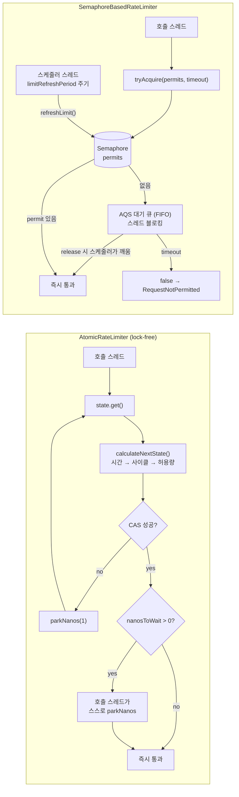

# RateLimiter ② Semaphore 방식과 둘의 선택 기준

`SemaphoreBasedRateLimiter`는 `Semaphore` + `ScheduledExecutorService`로 주기마다 permit을 보충하는, 교과서적인 토큰 버킷입니다. 이 문서는 `AtomicRateLimiter`와 무엇이 다른지, 왜 기본값이 아닌지, 그리고 두 구현 모두가 공유하는 치명적 한계를 다룹니다.

## 목차
- [1. 핵심 개념 (What)](#1-핵심-개념-what)
- [2. 왜 알아야 하는가 (Why)](#2-왜-알아야-하는가-why)
- [3. 내부 구현 분석 (How)](#3-내부-구현-분석-how)
- [4. 실전 예제](#4-실전-예제)
- [5. 정리](#5-정리)

---

## 1. 핵심 개념 (What)

`AtomicRateLimiter`가 "계산으로 따라잡는" 방식이라면 `SemaphoreBasedRateLimiter`는 "진짜로 채워 넣는" 방식입니다. 클래스 Javadoc이 구조를 그대로 말합니다.

> A RateLimiter implementation that consists of `Semaphore` and scheduler that will refresh permissions after each `RateLimiterConfig#getLimitRefreshPeriod()`, you can invoke `SemaphoreBasedRateLimiter#shutdown()` to close the limiter.

필드만 봐도 설계가 드러납니다.

```java
private final String name;
private final AtomicReference<RateLimiterConfig> rateLimiterConfig;
private final ScheduledExecutorService scheduler;
private final Semaphore semaphore;
private final SemaphoreBasedRateLimiterMetrics metrics;
private final Map<String, String> tags;
private final RateLimiterEventProcessor eventProcessor;
private final ScheduledFuture<?> scheduledFuture;
```

- `semaphore` — 허용량이 곧 permit 개수. 생성 시 `new Semaphore(limitForPeriod, true)`
- `scheduler` — `limitRefreshPeriod` 주기로 `refreshLimit()`을 돌리는 **전용 스레드**
- `scheduledFuture` — 그 스케줄 작업의 핸들. `shutdown()`에서 취소

`Semaphore`를 `fair=true`로 만든 점이 중요합니다. 대기 스레드가 FIFO로 깨어나므로 기아(starvation)가 없습니다. 대신 매 획득마다 큐를 거치므로 비공정(unfair) 세마포어보다 처리량이 낮습니다.

### 기본은 어느 쪽인가

소스로 확인하면 논쟁할 여지가 없습니다.

```java
// RateLimiter.java
static RateLimiter of(String name, RateLimiterConfig rateLimiterConfig,
    Map<String, String> tags) {
    return new AtomicRateLimiter(name, rateLimiterConfig, tags);
}

static RateLimiter ofDefaults(String name) {
    return new AtomicRateLimiter(name, RateLimiterConfig.ofDefaults());
}
```

```java
// InMemoryRateLimiterRegistry.java
public RateLimiter rateLimiter(final String name, final RateLimiterConfig config) {
    return computeIfAbsent(name, () -> new AtomicRateLimiter(name,
        Objects.requireNonNull(config, CONFIG_MUST_NOT_BE_NULL), getAllTags(emptyMap())));
}
```

`RateLimiter`의 모든 정적 팩토리, `RateLimiterRegistry`의 모든 `rateLimiter(...)` 오버로드가 `AtomicRateLimiter`를 만듭니다. **`SemaphoreBasedRateLimiter`는 직접 `new`로 생성하지 않으면 절대 쓰이지 않습니다.** Spring Boot 자동설정으로는 선택할 수 없습니다.

그러면 왜 남아 있냐고요? 2016년부터 있던 원래 구현이고, API 호환을 위해 유지됩니다. 그리고 `Semaphore` 의미론을 그대로 쓰기 때문에 "제한이 실제로 지켜지는지"를 추론하기가 훨씬 쉽습니다. 교육용·검증용으로는 여전히 가치가 있습니다.

---

## 2. 왜 알아야 하는가 (Why)

**첫째, 두 구현을 비교해 보면 `AtomicRateLimiter`의 설계 의도가 선명해집니다.** 예약(reservation)이 왜 필요했는지, 왜 스케줄러를 없앴는지는 없는 쪽을 봐야 이해됩니다.

**둘째, `reservePermission()`을 쓰는 코드는 구현을 바꾸면 깨집니다.** `SemaphoreBasedRateLimiter`는 이 메서드에서 `UnsupportedOperationException`을 던집니다. Reactor/코루틴 연산자가 내부적으로 `reservePermission()`을 쓰므로, 커스텀 구현을 끼우는 순간 런타임에 터집니다.

**셋째, 그리고 가장 중요한 것 — 둘 다 인스턴스 로컬입니다.** 여기서 사고가 납니다. "외부 API 쿼터 초당 100회"에 맞춰 `limitForPeriod(100)`을 설정하고 Pod 4개로 배포하면 실제 유출은 초당 400회입니다. 쿼터는 그날 밤에 터집니다. 이건 설정 실수가 아니라 **구조적 한계**이고, 라이브러리가 해결해 주지 않습니다.

**넷째, `RateLimiter`와 `Bulkhead`를 혼동하는 코드가 정말 많습니다.** 전자는 **유입 속도**(초당 몇 건)를, 후자는 **동시 실행 수**(동시에 몇 개)를 제한합니다. "느린 의존성이 스레드를 잠식하는 문제"를 RateLimiter로 막으려는 시도는 실패합니다 — 응답이 10초 걸리면 초당 10건만 받아도 100개가 동시에 떠 있게 되니까요.

---

## 3. 내부 구현 분석 (How)

### 3.1 permit 보충: `refreshLimit()`

```java
private ScheduledFuture<?> scheduleLimitRefresh() {
    return scheduler.scheduleAtFixedRate(
        this::refreshLimit,
        this.rateLimiterConfig.get().getLimitRefreshPeriod().toNanos(),
        this.rateLimiterConfig.get().getLimitRefreshPeriod().toNanos(),
        TimeUnit.NANOSECONDS
    );
}

void refreshLimit() {
    int permissionsToRelease =
        this.rateLimiterConfig.get().getLimitForPeriod() - semaphore.availablePermits();
    if (permissionsToRelease > 0) {
        semaphore.release(permissionsToRelease);
    } else if (permissionsToRelease < 0) {
        semaphore.tryAcquire(-permissionsToRelease);
    }
}
```

- `permissionsToRelease`는 "더해야 할 양"이 아니라 **목표값까지의 차이**입니다. `limitForPeriod(10)`이고 3개 쓰였으면 `availablePermits()`는 7, 차이는 3 → 3개만 반납합니다. 그러므로 **쓰지 않은 허용량이 쌓이지 않습니다.** `AtomicRateLimiter`의 `min(nextPermissions + accumulated, permissionsPerCycle)`과 결과가 같습니다. 접근은 달라도 "버스트 상한 = `limitForPeriod`"라는 계약은 동일합니다.
- 음수일 때 `tryAcquire(-permissionsToRelease)`로 **초과분을 회수합니다.** `changeLimitForPeriod()`로 한도를 내렸을 때 세마포어를 줄이는 유일한 경로입니다. `tryAcquire`라서 지금 당장 회수 못 하면 조용히 넘어가고 다음 tick에 다시 시도합니다.
- 이 메서드는 `package-private`입니다. 테스트에서 직접 호출해 시간 흐름을 재현할 수 있게 만든 설계입니다.

여기서 바로 눈에 걸려야 하는 것: `limitRefreshPeriod` 기본값은 **500나노초**입니다. 그 상태로 `SemaphoreBasedRateLimiter`를 만들면 `scheduleAtFixedRate`가 500ns 주기로 걸립니다. 스케줄러 스레드가 CPU를 태우며 돌게 됩니다(실제로는 OS 타이머 해상도 때문에 tick이 밀리고, `scheduleAtFixedRate` 특성상 밀린 실행이 몰려서 돕니다). **이 구현을 쓰려면 `limitRefreshPeriod`를 밀리초 단위 이상으로 반드시 올리세요.**

### 3.2 획득: 그냥 `tryAcquire`

```java
@Override
public boolean acquirePermission(int permits) {
    try {
        boolean success = semaphore
            .tryAcquire(permits, rateLimiterConfig.get().getTimeoutDuration().toNanos(),
                TimeUnit.NANOSECONDS);
        publishRateLimiterAcquisitionEvent(success, permits);
        return success;
    } catch (InterruptedException e) {
        Thread.currentThread().interrupt();
        publishRateLimiterAcquisitionEvent(false, permits);
        return false;
    }
}
```

`AtomicRateLimiter.acquirePermission()`과 비교해 보세요. `AtomicRateLimiter`는 CAS로 상태를 갱신하고 `LockSupport.parkNanos`로 **스스로** 기다립니다. 여기서는 `Semaphore`의 AQS 큐에 스레드를 **등록하고 블로킹**합니다. 차이는 세 가지입니다.

1. 대기 중인 스레드는 세마포어 대기 큐에 들어가고, permit이 반납될 때 **스케줄러 스레드가 깨웁니다** → 컨텍스트 스위치 한 번이 추가됩니다.
2. `fair=true`라 **FIFO 순서가 보장됩니다.** `AtomicRateLimiter`는 순서를 보장하지 않습니다(park 후 그냥 진행).
3. 예약이 없으므로 "대기 큐에 자리를 미리 잡는" 개념이 없습니다. permit이 돌아올 때까지 순수하게 기다립니다.

`InterruptedException`은 삼키고 인터럽트 플래그만 복원합니다. `AtomicRateLimiter.waitForPermission()`의 처리와 동일한 철학입니다.

### 3.3 예약은 지원하지 않는다

```java
@Override
public long reservePermission() {
    throw new UnsupportedOperationException(
        "Reserving permissions is not supported in the semaphore based implementation");
}
```

Javadoc의 설명이 정확합니다 — "Semaphores are totally blocking by it's nature. So this non-blocking API isn't supported." 세마포어의 permit은 "있다/없다"뿐이고, 음수로 내려가는 개념이 없습니다. 미래 몫을 당겨쓸 자리가 구조적으로 없습니다.

### 3.4 드레인과 종료

```java
@Override
public void drainPermissions() {
    int permits = semaphore.drainPermits();
    if (eventProcessor.hasConsumers()) {
        eventProcessor.consumeEvent(new RateLimiterOnDrainedEvent(name, permits));
    }
}
```

`drainPermits()`는 남은 permit 전부를 가져오고 **가져온 개수(양수)**를 반환합니다. `AtomicRateLimiter`가 `Math.min(prev.activePermissions, 0)`(항상 0 이하)을 넣는 것과 정반대입니다. 같은 이벤트의 같은 필드인데 부호 체계가 다릅니다. `RateLimiterOnDrainedEvent.getNumberOfPermits()`로 대시보드를 만들면 구현을 바꾸는 순간 그래프가 뒤집힙니다.

그리고 `shutdown()`이 있습니다.

```java
public void shutdown()  {
    if (!this.scheduledFuture.isCancelled()) {
        this.scheduledFuture.cancel(true);
    }
}
```

Javadoc이 이유를 못 박습니다 — 스케줄 작업이 `this`를 참조하므로, 취소하지 않으면 **참조를 놓아도 GC되지 않습니다.** 인스턴스를 수백만 개 만들면 메모리 누수입니다(issue #1683). `AtomicRateLimiter`에는 `shutdown()`이 없습니다. 필요가 없으니까요. **라이프사이클 관리 책임이 추가로 생긴다는 점**이 이 구현의 숨은 비용입니다.

### 3.5 두 구현의 permit 수급 흐름



왼쪽은 참여 스레드가 호출 스레드 하나입니다. 오른쪽은 스케줄러 스레드가 항상 하나 더 돌고, 대기가 발생하면 깨우는 쪽과 깨어나는 쪽이 분리됩니다.

### 3.6 비교표

| 항목 | `AtomicRateLimiter` | `SemaphoreBasedRateLimiter` |
|---|---|---|
| permit 보충 | **계산**. 호출 시점에 `currentNanos / cyclePeriodInNanos` | **스케줄**. `scheduleAtFixedRate(this::refreshLimit, ...)` |
| 상태 저장소 | 불변 `State` + `AtomicReference` (CAS) | `Semaphore`(fair) |
| 추가 스레드 | 없음 | **전용 스케줄러 스레드 1개 / 인스턴스** |
| 대기 방식 | 호출 스레드가 `LockSupport.parkNanos` | `Semaphore.tryAcquire(timeout)` — AQS 큐 블로킹 |
| 예약(`reservePermission`) | 지원. 음수 permission | **`UnsupportedOperationException`** |
| 대기 순서 보장 | 없음 | **FIFO** (`fair=true`) |
| 유휴 시 비용 | 0 (아무 일도 안 일어남) | tick마다 `refreshLimit()` 실행 |
| 정밀도 | 나노초 단위 계산. 사이클 경계가 절대 좌표 | 스케줄러 tick 해상도에 종속 |
| 라이프사이클 | 불필요 | **`shutdown()` 필수**(안 하면 누수, #1683) |
| `limitForPeriod` 변경 | `State`의 config 교체로 즉시 반영 | config만 교체 → 세마포어는 **다음 tick의 `refreshLimit()`에서 보정** |
| 메모리 | `State` 객체 1개(+CAS 실패 시 임시) | `Semaphore` + AQS 노드 + 스케줄 작업 |
| 기본 구현 | **그렇다** | 아니다. 직접 `new` 해야 함 |
| 적합한 상황 | 고TPS, 짧은 주기, 논블로킹 경로 | 낮은 TPS + FIFO 순서가 요구사항일 때 |

### 3.7 이벤트는 언제 발행되나

두 구현 모두 `RateLimiterEventProcessor`를 그대로 공유합니다.

```java
public class RateLimiterEventProcessor extends
    io.github.resilience4j.core.EventProcessor<RateLimiterEvent> implements
    EventConsumer<RateLimiterEvent>, RateLimiter.EventPublisher {
    ...
    public RateLimiter.EventPublisher onSuccess(
        EventConsumer<RateLimiterOnSuccessEvent> onSuccessEventConsumer) {
        registerConsumer(RateLimiterOnSuccessEvent.class.getName(), onSuccessEventConsumer);
        return this;
    }
    ...
}
```

| 이벤트 | `Type` | `AtomicRateLimiter` | `SemaphoreBasedRateLimiter` |
|---|---|---|---|
| `RateLimiterOnSuccessEvent` | `SUCCESSFUL_ACQUIRE` | `acquirePermission()`이 `true`(대기 후 통과 포함), `reservePermission()`이 `0`/양수 반환 | `semaphore.tryAcquire(...)`가 `true` |
| `RateLimiterOnFailureEvent` | `FAILED_ACQUIRE` | 타임아웃 초과 또는 대기 중 인터럽트 | `tryAcquire` 타임아웃 또는 `InterruptedException` |
| `RateLimiterOnDrainedEvent` | `DRAINED` | `drainPermissions()`. permit 수 = `Math.min(prev.activePermissions, 0)` | `drainPermissions()`. permit 수 = `semaphore.drainPermits()` (양수) |

두 가지를 기억하세요.

1. **성공 이벤트는 "호출이 성공했다"가 아니라 "허용량을 얻었다"입니다.** 비즈니스 호출이 그 뒤에 실패해도 이 이벤트는 이미 나갔습니다.
2. **`EventPublisher`에 `onDrained(...)`가 없습니다.** `onSuccess`, `onFailure` 둘뿐입니다. 드레인은 `onEvent(...)` + `getEventType() == Type.DRAINED`로 잡으세요.

---

## 4. 실전 예제

### 4-1. 구현 선택 결정표

```java
/**
 * 기본은 AtomicRateLimiter(= RateLimiter.of)다. 아래 조건에 하나도 걸리지 않으면
 * 굳이 SemaphoreBasedRateLimiter를 꺼낼 이유가 없다.
 */
public final class RateLimiterChoice {

    // 1) 기본: 거의 항상 이것
    static RateLimiter standard(String name, int perSecond) {
        return RateLimiter.of(name, RateLimiterConfig.custom()
            .limitForPeriod(perSecond)
            .limitRefreshPeriod(Duration.ofSeconds(1))
            .timeoutDuration(Duration.ofMillis(200))
            .writableStackTraceEnabled(false)
            .build());
    }

    // 2) "먼저 온 요청이 먼저 통과해야 한다"가 명시적 요구사항일 때만
    static SemaphoreBasedRateLimiter fifoOrdered(String name, int perSecond,
                                                 ScheduledExecutorService sharedScheduler) {
        return new SemaphoreBasedRateLimiter(name, RateLimiterConfig.custom()
            .limitForPeriod(perSecond)
            // 기본값 500ns를 그대로 쓰면 스케줄러가 CPU를 태운다. 반드시 올린다.
            .limitRefreshPeriod(Duration.ofSeconds(1))
            .timeoutDuration(Duration.ofMillis(200))
            .build(),
            // 스케줄러를 주입해 인스턴스당 스레드 1개 생성을 막는다
            sharedScheduler);
    }
}
```

| 질문 | `AtomicRateLimiter` | `SemaphoreBasedRateLimiter` |
|---|---|---|
| Reactor / 코루틴 / 이벤트 루프에서 쓰는가 | ✅ (`reservePermission()` 필요) | ❌ 예외 발생 |
| TPS가 수천 이상인가 | ✅ | ⚠️ 블로킹 + 컨텍스트 스위치 |
| 대기 순서(FIFO)가 요구사항인가 | ❌ 보장 없음 | ✅ |
| 인스턴스를 동적으로 많이 만드는가 (테넌트별 등) | ✅ | ❌ 스레드 + 누수 위험 |
| Spring Boot 설정으로 쓰는가 | ✅ 자동 | ❌ 수동 `new` |

`fifoOrdered`에서 스케줄러를 외부에서 주입한 걸 보세요. `SemaphoreBasedRateLimiter`는 스케줄러를 주지 않으면 `configureScheduler()`가 `"SchedulerForSemaphoreBasedRateLimiterImpl-" + name` 이름으로 **단일 스레드 스케줄러를 하나 새로 만듭니다.** 테넌트 100개면 스레드 100개입니다. 공유하고, 쓰고 나면 `shutdown()`을 부르세요.

### 4-2. 분산 환경: 서버 수로 나누기와 그 한계

```java
@Configuration
public class DistributedQuotaConfig {

    /** PG사 계약 쿼터: 전체 합산 초당 100회 */
    private static final int GLOBAL_QUOTA_PER_SECOND = 100;

    /**
     * 인스턴스 수를 환경변수로 주입받아 한도를 나눈다.
     * 운영상 안전 계수를 곱해 경계에서의 겹침을 흡수한다.
     */
    @Bean
    RateLimiter pgRateLimiter(
        @Value("${app.replica-count}") int replicaCount,
        @Value("${app.quota-safety-factor:0.8}") double safetyFactor) {

        int perInstance = Math.max(1,
            (int) Math.floor((double) GLOBAL_QUOTA_PER_SECOND / replicaCount * safetyFactor));

        return RateLimiter.of("pg", RateLimiterConfig.custom()
            .limitForPeriod(perInstance)              // 100 / 4 * 0.8 = 20
            .limitRefreshPeriod(Duration.ofSeconds(1))
            .timeoutDuration(Duration.ofMillis(150))
            .writableStackTraceEnabled(false)
            .build());
    }
}
```

계산은 이렇습니다.

| 전체 쿼터 | 레플리카 | 안전계수 | 인스턴스당 `limitForPeriod` | 이론상 최대 유출 |
|---|---|---|---|---|
| 100/s | 4 | 1.0 | 25 | 100/s |
| 100/s | 4 | 0.8 | 20 | 80/s |
| 100/s | 4 → 8 (스케일아웃, 설정 미반영) | 0.8 | 20 | **160/s → 쿼터 초과** |

**이 방식이 깨지는 지점을 정확히 알고 쓰세요.**

1. **스케일아웃/인** — HPA가 Pod를 늘리면 합산 한도가 그만큼 늘어납니다. `replicaCount`가 설정값이면 자동으로 따라오지 않습니다.
2. **롤링 배포** — 구버전과 신버전이 동시에 떠 있는 구간에서는 레플리카가 일시적으로 `N+1`입니다.
3. **불균등 로드밸런싱** — 트래픽이 한 인스턴스로 몰리면 그 인스턴스는 자기 몫(20)에서 거절하는데 전체로는 80에 못 미칩니다. **한도를 다 쓰지 못하면서 거절**하는, 최악의 조합입니다.
4. **사이클 경계 비정렬** — 각 인스턴스의 `nanoTimeStart`가 서로 다르므로 사이클 경계가 어긋납니다. 짧은 구간(수십 ms)만 보면 순간 유출이 합산 한도를 넘을 수 있습니다.

**외부 API 쿼터를 실제로 지켜야 한다면 분산 rate limiter가 필요합니다.** Redis 기반 구현(Bucket4j의 `RedisBackedProxyManager`, Redis Cell 모듈, 또는 직접 구현한 Lua 스크립트 토큰 버킷)으로 카운터를 공유해야 합니다. Resilience4j에는 분산 RateLimiter가 없습니다 — 라이브러리가 하려는 일의 범위 밖입니다.

현실적인 절충안:

```java
// 1차 방어: 분산 카운터로 전체 쿼터를 지킨다 (Bucket4j + Redis)
// 2차 방어: 로컬 RateLimiter로 Redis 장애 시 폭주를 막고, Redis 왕복 자체를 줄인다
Quote quote = localRateLimiter.executeSupplier(() ->
    distributedBucket.tryConsume(1)
        ? pgClient.fetch(symbol)
        : fallback(symbol));
```

로컬 limiter를 "전체 쿼터"로 착각하지 말고 **"이 인스턴스가 낼 수 있는 최대 부하 상한"**으로 쓰는 겁니다. 역할을 분리하면 둘 다 의미가 있습니다.

### 4-3. `RateLimiter` vs `Bulkhead` — 혼동하지 않는 기준

```java
/**
 * 외부 추천 API: 쿼터 초당 50회, p99 응답 1.2초, 커넥션 풀 20
 *
 * - RateLimiter: 유입 속도를 50/s로 제한   → 쿼터(계약) 보호
 * - Bulkhead:    동시 실행을 20으로 제한    → 커넥션 풀/스레드 보호
 * 둘은 서로를 대체하지 못한다. 보호 대상이 다르다.
 */
@Configuration
public class RecommendationResilienceConfig {

    @Bean
    RateLimiter recommendationRateLimiter() {
        return RateLimiter.of("recommendation", RateLimiterConfig.custom()
            .limitForPeriod(50)
            .limitRefreshPeriod(Duration.ofSeconds(1))
            .timeoutDuration(Duration.ofMillis(100))
            .build());
    }

    @Bean
    Bulkhead recommendationBulkhead() {
        return Bulkhead.of("recommendation", BulkheadConfig.custom()
            .maxConcurrentCalls(20)                      // 커넥션 풀 크기와 맞춤
            .maxWaitDuration(Duration.ofMillis(50))
            .build());
    }
}
```

둘이 왜 모두 필요한지 숫자로 확인해 봅시다. 리틀의 법칙(Little's Law) `L = λW`입니다.

- 유입 `λ = 50/s`, 응답 시간 `W = 1.2s` → 동시 실행 `L = 60`
- **RateLimiter만 두면 동시 60개가 뜹니다.** 커넥션 풀 20을 세 배로 초과합니다.
- 반대로 **Bulkhead만 두면** 동시 20개로 눌리지만, 응답이 50ms로 빨라지는 날엔 유입이 초당 400건까지 나가 쿼터를 깹니다.

| 구분 | `RateLimiter` | `Bulkhead` |
|---|---|---|
| 제한 대상 | 단위 시간당 **유입 건수** (λ) | 동시 **실행 수** (L) |
| 보호 대상 | 상대방의 쿼터·계약, 상대 서비스 과부하 | 내 스레드·커넥션·메모리 |
| 응답 시간에 영향받는가 | 아니다 | 그렇다 (느려지면 즉시 포화) |
| 예외 | `RequestNotPermitted` | `BulkheadFullException` |
| 설정 근거 | 계약서/문서상 쿼터 | 리틀의 법칙 + 풀 크기 |

Bulkhead 쪽 상세는 [Bulkhead — 두 가지 격리와 스레드풀의 함정](./11-bulkhead.md)에서 이어집니다.

---

## 5. 정리

| 질문 | 답 |
|---|---|
| 기본 구현은 | `AtomicRateLimiter`. `RateLimiter.of*`와 `InMemoryRateLimiterRegistry` 전부 이것을 만든다 |
| `SemaphoreBasedRateLimiter`를 쓰는 방법 | 직접 `new`. 자동설정으로는 선택 불가 |
| permit 보충 방식 | `scheduleAtFixedRate(this::refreshLimit, period, period, NANOSECONDS)` |
| `refreshLimit()`의 의미 | `limitForPeriod - availablePermits()` 차이만큼 보충/회수 → 허용량이 쌓이지 않음 |
| 추가 스레드 | 인스턴스당 스케줄러 1개. 주입하지 않으면 새로 만든다 |
| `reservePermission()` | `UnsupportedOperationException`. Reactor/코루틴 경로에서 사용 불가 |
| FIFO 보장 | `new Semaphore(limit, true)`로 보장. `AtomicRateLimiter`는 보장 없음 |
| `shutdown()` | 필수. 안 부르면 스케줄 작업이 인스턴스를 붙잡아 GC 안 됨(#1683) |
| `limitRefreshPeriod` 기본값 함정 | 500ns. 이 구현에서는 스케줄러가 폭주한다. 반드시 ms 이상으로 |
| `RateLimiterOnDrainedEvent`의 permit 수 | Atomic은 0 이하, Semaphore는 양수. 구현마다 다르니 값으로 지표 만들지 말 것 |
| `onDrained` 리스너 | 없다. `onEvent()` + `Type.DRAINED` |
| 공통 한계 | **인스턴스 로컬.** 서버 N대 = 실제 한도 N배 |
| 분산 환경 해법 | 레플리카 수로 나누기는 임시방편(스케일·LB 편중에 깨짐). 실제로는 Redis 기반(Bucket4j 등) 필요 |
| RateLimiter vs Bulkhead | 유입 속도(λ) 제한 vs 동시 실행(L) 제한. `L = λW`로 둘 다 필요한지 판단 |

---

## 관련 문서
- 선행: [RateLimiter ① AtomicRateLimiter — 락 없이 나노초로 센다](./09-ratelimiter-atomic.md)
- 후행: [Bulkhead — 두 가지 격리와 스레드풀의 함정](./11-bulkhead.md)

---
*Resilience4j v2.4.0 기준 · 소스 커밋 7e3ab525*
