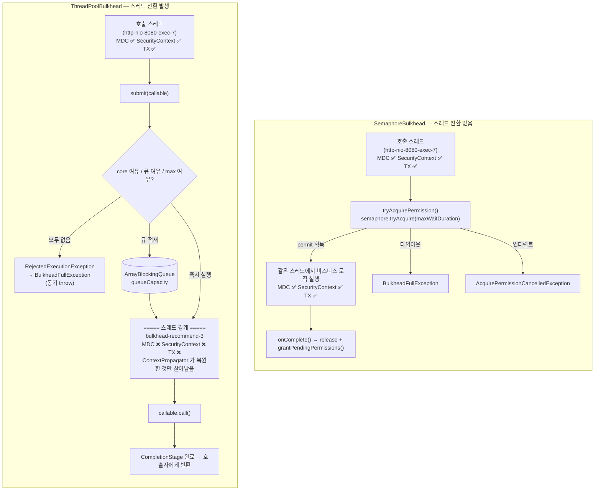

# Bulkhead — 두 가지 격리와 스레드풀의 함정

Resilience4j의 Bulkhead는 이름이 하나지만 구현이 둘입니다. `SemaphoreBulkhead`는 동시 실행 수만 세고, `ThreadPoolBulkhead`는 호출을 다른 스레드로 넘깁니다. 후자를 고르는 순간 MDC·SecurityContext·트랜잭션이 끊기고 반환 타입이 `CompletionStage`로 바뀝니다.

## 목차
- [1. 핵심 개념 (What)](#1-핵심-개념-what)
- [2. 왜 알아야 하는가 (Why)](#2-왜-알아야-하는가-why)
- [3. 내부 구현 분석 (How)](#3-내부-구현-분석-how)
- [4. 실전 예제](#4-실전-예제)
- [5. 정리](#5-정리)

---

## 1. 핵심 개념 (What)

Bulkhead는 선박의 **격벽**입니다. 배 안을 여러 칸으로 나눠 놓으면 한 칸에 물이 들어와도 배 전체가 가라앉지 않습니다. 타이타닉이 가라앉은 이유가 격벽이 천장까지 닿지 않아 물이 칸을 넘어 번졌기 때문이라는 설명을 들어 봤을 겁니다. 소프트웨어에서 막으려는 것도 정확히 같습니다.

전형적인 장애 시나리오입니다.

```
Tomcat 스레드풀 200개
├── /orders        → 주문 DB (정상, 20ms)
├── /recommend     → 추천 API (장애, 30초 타임아웃)  ← 여기만 느려짐
└── /health        → 응답 없음

추천 API에 초당 10건 유입 × 30초 응답 = 동시 300건
→ Tomcat 스레드 200개 전부 추천 API 대기 중
→ 주문도, 헬스체크도 응답 못 함 → 전체 장애
```

**한 느린 의존성이 공유 스레드풀을 전부 잠식합니다.** 추천 기능만 죽어야 하는데 서비스가 죽습니다. Bulkhead는 "추천 API는 최대 20개까지만"이라고 칸을 나눠서, 나머지 180개를 지킵니다.

### 두 가지 격리

| | `SemaphoreBulkhead` | `ThreadPoolBulkhead` (`FixedThreadPoolBulkhead`) |
|---|---|---|
| 실행 스레드 | **호출 스레드 그대로** | 전용 `ThreadPoolExecutor`의 스레드 |
| 제한 수단 | `Semaphore`로 동시 진입 수 | 풀 크기 + 큐 용량 |
| 반환 타입 | 원래 타입(동기 가능) | **`CompletionStage`** |
| 인터페이스 | `Bulkhead` | `ThreadPoolBulkhead` (별개 인터페이스) |
| 컨텍스트 전파 | 자연스러움(같은 스레드) | **끊긴다.** `ContextPropagator` 필요 |
| 큐잉 | `maxWaitDuration` 동안 대기 | `queueCapacity`만큼 큐에 적재 |
| 거절 예외 | `BulkheadFullException` | `BulkheadFullException` |

핵심 차이는 "스레드가 바뀌는가"입니다. 그 한 줄에서 나머지 모든 차이가 파생됩니다.

### 설정값

`BulkheadConfig` (세마포어 방식):

| 옵션 | 기본값 | 의미 |
|---|---|---|
| `maxConcurrentCalls` | `25` | 동시 실행 허용 수. 0도 허용(전면 차단) |
| `maxWaitDuration` | `Duration.ofSeconds(0)` | 자리가 없을 때 기다릴 시간 |
| `writableStackTraceEnabled` | `true` | `false`면 `BulkheadFullException` 스택트레이스가 빈 배열 |
| `fairCallHandlingEnabled` | `true` | `Semaphore`의 fair/unfair. true면 FIFO 보장 |

`ThreadPoolBulkheadConfig` (스레드풀 방식):

| 옵션 | 기본값 | 의미 |
|---|---|---|
| `maxThreadPoolSize` | `availableProcessors()` | 최대 스레드 수 |
| `coreThreadPoolSize` | `availableProcessors() - 1` (최소 1) | 코어 스레드 수 |
| `queueCapacity` | `100` | 대기 큐 크기. `0`이면 `SynchronousQueue` |
| `keepAliveDuration` | `Duration.ofMillis(20)` | 코어 초과 유휴 스레드 생존 시간 |
| `writableStackTraceEnabled` | `true` | 위와 동일 |
| `contextPropagators` | `[]` | 스레드 간 컨텍스트 전파기 |
| `rejectedExecutionHandler` | `ThreadPoolExecutor.AbortPolicy` | 거절 정책 |

`build()`에서 `maxThreadPoolSize < coreThreadPoolSize`면 `IllegalArgumentException`입니다.

---

## 2. 왜 알아야 하는가 (Why)

**첫째, Bulkhead는 CircuitBreaker가 못 막는 걸 막습니다.** CircuitBreaker는 실패율/느린호출율이 임계치를 넘어야 열립니다. 그 임계치에 도달하기 **전까지의 구간** — 아직 실패는 아니고 그냥 느린 구간 — 에서 스레드는 이미 잠식됩니다. Bulkhead는 첫 번째 호출부터 상한을 걸어 이 구간을 지웁니다. 둘은 경쟁 관계가 아니라 보완 관계입니다.

**둘째, `ThreadPoolBulkhead`를 잘못 고르면 더 큰 사고가 납니다.** 스레드가 바뀌므로 MDC의 traceId가 사라져 로그 추적이 끊기고, `SecurityContextHolder`가 비어 인증이 날아가고, `@Transactional`의 커넥션이 전파되지 않아 트랜잭션 밖에서 DB를 건드립니다. 이건 "나중에 고치자"가 아니라 **아키텍처 결정**입니다.

**셋째, `queueCapacity`를 크게 잡는 게 왜 위험한지 아는 사람이 적습니다.** 큐가 길면 거절이 줄어드니 좋아 보입니다. 실제로는 요청이 큐에서 썩고, 클라이언트는 이미 타임아웃으로 떠났고, 서버는 아무도 기다리지 않는 응답을 만들고 있습니다. 거절을 큐로 바꾸면 **빠른 실패가 느린 실패로 바뀔 뿐**입니다.

**넷째, v2.4.0에서 바뀐 게 있습니다.** 커밋 7e3ab525(Issue #1592)가 `Bulkhead#acquirePermissionAsync()`를 추가하고 Reactor Bulkhead 연산자를 논블로킹으로 만들었습니다. 이전에는 이벤트 루프 스레드에서 `maxWaitDuration > 0`을 쓰면 루프가 멈췄습니다. 이 제약이 사라졌습니다. 이것도 뒤에서 소스로 봅니다.

---

## 3. 내부 구현 분석 (How)

### 3.1 `SemaphoreBulkhead` — 세마포어 하나가 전부

```java
public SemaphoreBulkhead(String name, @Nullable BulkheadConfig bulkheadConfig,
    Map<String, String> tags) {
    this.name = name;
    this.config = requireNonNull(bulkheadConfig, CONFIG_MUST_NOT_BE_NULL);
    this.tags = requireNonNull(tags, TAGS_MUST_NOTE_BE_NULL);
    // init semaphore
    this.semaphore = new Semaphore(config.getMaxConcurrentCalls(), config.isFairCallHandlingEnabled());
    ...
}

boolean tryEnterBulkhead() {
    long timeout = config.getMaxWaitDuration().toMillis();

    try {
        return semaphore.tryAcquire(timeout, TimeUnit.MILLISECONDS);
    } catch (InterruptedException ex) {
        Thread.currentThread().interrupt();
        return false;
    }
}
```

- `new Semaphore(maxConcurrentCalls, fair)` — permit이 곧 동시 실행 티켓입니다. `maxWaitDuration=0`이어도 `tryAcquire(0, MILLISECONDS)`는 permit이 있으면 즉시 성공합니다.
- **`toMillis()`에 주의하세요.** `maxWaitDuration(Duration.ofMicros(500))`처럼 1ms 미만을 주면 블로킹 경로에서는 **0으로 절삭**됩니다. 의도한 "0.5ms 대기"가 "대기 없음"이 됩니다. 비동기 경로는 뒤에서 보듯 나노초를 그대로 씁니다.
- `InterruptedException`은 플래그만 복원하고 `false`를 반환합니다. 그래서 `acquirePermission()`이 예외를 구분합니다.

```java
@Override
public void acquirePermission() {
    boolean permitted = tryAcquirePermission();
    if (permitted) {
        return;
    }
    if (Thread.currentThread().isInterrupted()) {
        throw new AcquirePermissionCancelledException();
    }
    throw BulkheadFullException.createBulkheadFullException(this);
}
```

**거절(`BulkheadFullException`)과 취소(`AcquirePermissionCancelledException`)를 구분합니다.** Retry 설정에서 `BulkheadFullException`을 재시도 대상에 넣을지는 논의할 가치가 있지만, `AcquirePermissionCancelledException`은 절대 아닙니다. 호출자가 떠난 것이니까요.

반납은 `onComplete()` 또는 `releasePermission()`입니다. 둘 다 `semaphore.release()` 후 `grantPendingPermissions()`를 호출합니다. 차이는 `onComplete()`가 `BulkheadOnCallFinishedEvent`를 추가로 발행한다는 것뿐입니다. **`decorate*`로 감싸지 않고 직접 획득했다면 `finally`에서 반납을 보장해야 합니다.** 빠뜨리면 permit이 영구 누수되어 Bulkhead가 서서히 잠깁니다.

### 3.2 v2.4.0의 논블로킹 획득 (커밋 7e3ab525, Issue #1592)

기존 `tryAcquirePermission()`은 `Semaphore.tryAcquire(timeout)`에서 **호출 스레드를 블로킹**합니다. 이벤트 루프에서 쓰면 안 되니, `BulkheadConfig.maxWaitDuration()` Javadoc은 "이벤트 루프에서는 0을 쓰라"고 안내해 왔습니다. 커밋 7e3ab525가 이 Javadoc까지 함께 고쳤습니다.

```java
// BulkheadConfig.Builder#maxWaitDuration Javadoc (v2.4.0)
 * Note: for threads running on an event-loop or equivalent (rx computation pool, etc),
 * blocking the thread must be avoided. Callers which use the blocking
 * {@link Bulkhead#acquirePermission()} or {@link Bulkhead#tryAcquirePermission()} on such
 * threads should set maxWaitDuration to 0. {@link Bulkhead#acquirePermissionAsync()} and
 * the Reactor Bulkhead operator wait for a permission without blocking the calling
 * thread, so they can be combined with a non-zero maxWaitDuration on an event-loop. The
 * RxJava 2 and RxJava 3 Bulkhead operators still acquire the permission with the blocking
 * {@link Bulkhead#tryAcquirePermission()}.
```

마지막 문장이 중요합니다. **Reactor 연산자만 논블로킹이 되었고, RxJava 2/3 연산자는 여전히 블로킹**입니다. 섞어 쓰는 코드베이스라면 구분해야 합니다.

새 메서드는 `Bulkhead`의 `default`로 추가되어 기존 커스텀 구현을 깨지 않습니다.

```java
default CompletableFuture<Void> acquirePermissionAsync() {
    CompletableFuture<Void> permission = new CompletableFuture<>();
    try {
        acquirePermission();
        permission.complete(null);
    } catch (Throwable throwable) {
        permission.completeExceptionally(throwable);
    }
    return permission;
}
```

Javadoc이 "The default implementation is a blocking bridge ... It only exists for backwards compatibility"라고 못 박습니다. **기본 구현은 논블로킹이 아닙니다.** 진짜 구현은 `SemaphoreBulkhead`의 오버라이드입니다.

```java
@Override
public CompletableFuture<Void> acquirePermissionAsync() {
    if (pendingPermissions.isEmpty() && semaphore.tryAcquire()) {
        publishBulkheadEvent(() -> new BulkheadOnCallPermittedEvent(name));
        return CompletableFuture.completedFuture(null);
    }
    Duration maxWaitDuration = config.getMaxWaitDuration();
    if (maxWaitDuration.isZero()) {
        publishBulkheadEvent(() -> new BulkheadOnCallRejectedEvent(name));
        return CompletableFuture
            .failedFuture(BulkheadFullException.createBulkheadFullException(this));
    }
    PendingPermission permission = new PendingPermission();
    ScheduledFuture<?> timeoutTask;
    try {
        timeoutTask = SchedulerFactory.getInstance().getScheduler().schedule(() -> {
            if (permission.tryExpire()) {
                permission.completeExceptionally(
                    BulkheadFullException.createBulkheadFullException(this));
            }
        }, toNanosSaturated(maxWaitDuration), TimeUnit.NANOSECONDS);
    } catch (RejectedExecutionException e) {
        // The scheduler was shut down concurrently. Fail before queueing the request, otherwise
        // a request nobody holds would be granted a permit later and leak it.
        return CompletableFuture.failedFuture(e);
    }
    pendingPermissions.offer(permission);
    ...
    grantPendingPermissions();
    return permission;
}
```

- 첫 분기 `pendingPermissions.isEmpty() && semaphore.tryAcquire()` — **대기 큐가 비어 있을 때만** 바로 집습니다. 큐에 사람이 있으면 새치기하지 않습니다. FIFO 공정성을 비동기 경로에서도 지키는 장치입니다.
- `maxWaitDuration.isZero()` → 큐에 넣지 않고 즉시 실패. 블로킹 경로와 의미가 일치합니다.
- 타임아웃은 `SchedulerFactory`의 공유 스케줄러에 `toNanosSaturated(maxWaitDuration)`로 예약합니다. **블로킹 경로의 `toMillis()` 절삭이 여기엔 없습니다.** 커밋 메시지의 "queue sub-millisecond wait durations"가 이걸 말합니다.
- `RejectedExecutionException` 처리 주석이 좋은 교보재입니다. 타임아웃을 못 걸면 **큐에 넣기 전에** 실패시킵니다. 넣어 버리면 아무도 소유하지 않는 요청이 나중에 permit을 받아 **영구 누수**가 됩니다.

`PendingPermission`은 네 상태의 작은 상태 기계입니다.

```java
private static final class PendingPermission extends CompletableFuture<Void> {

    private static final int PENDING = 0;
    private static final int GRANTED = 1;
    private static final int EXPIRED = 2;
    private static final int CANCELLED = 3;

    private final AtomicInteger state = new AtomicInteger(PENDING);

    boolean tryGrant() {
        return state.compareAndSet(PENDING, GRANTED);
    }

    boolean tryExpire() {
        return state.compareAndSet(PENDING, EXPIRED);
    }

    @Override
    public boolean cancel(boolean mayInterruptIfRunning) {
        if (state.compareAndSet(PENDING, CANCELLED)) {
            return super.cancel(mayInterruptIfRunning);
        }
        return isCancelled();
    }
}
```

부여·만료·취소가 모두 `PENDING`에서 CAS로 벗어나므로 **승자가 정확히 하나**입니다. 세 경로가 동시에 들어와도 permit이 두 번 나가거나 새어 나가지 않습니다.

그리고 드레인 루프입니다.

```java
private void grantPendingPermissions() {
    if (grantsInProgress.getAndIncrement() != 0) {
        return;
    }
    RuntimeException consumerFailure = null;
    int missed = 1;
    do {
        while (!pendingPermissions.isEmpty() && semaphore.tryAcquire()) {
            PendingPermission permission = pendingPermissions.poll();
            if (permission == null || !permission.tryGrant()) {
                semaphore.release();
                continue;
            }
            try {
                publishBulkheadEvent(() -> new BulkheadOnCallPermittedEvent(name));
            } catch (RuntimeException e) {
                if (consumerFailure == null) {
                    consumerFailure = e;
                } else {
                    consumerFailure.addSuppressed(e);
                }
            } finally {
                permission.complete(null);
            }
        }
        missed = grantsInProgress.addAndGet(-missed);
    } while (missed != 0);
    if (consumerFailure != null) {
        throw consumerFailure;
    }
}
```

- `grantsInProgress.getAndIncrement() != 0`이면 즉시 반환 — Reactive Streams 구현에서 흔한 **work-stealing 직렬화(missed 카운터)** 패턴입니다. 이미 누군가 루프를 돌고 있으면 카운터만 올리고 떠나고, 돌고 있는 쪽이 그만큼 더 돕니다. 재진입과 동시 호출이 재귀 없이 접힙니다.
- `!permission.tryGrant()`면 `semaphore.release()` — 이미 만료/취소된 요청에 잡아둔 permit을 **반드시 되돌립니다.** 누수 방지의 핵심 한 줄입니다.
- 이벤트 소비자가 던진 예외를 모아두고 **루프를 끝까지 돈 뒤** 던집니다. 중간에 탈출하면 큐가 멈춥니다. 소스 주석이 "A failing event consumer never leaves the loop early, otherwise the drain could get stuck"로 의도를 설명합니다.
- `BulkheadOnCallPermittedEvent`를 `permission.complete(null)` **전에** 발행합니다. `complete()`가 의존 액션을 부여 스레드에서 실행하므로, 그 액션이 호출을 끝내 버리면 Permitted가 Finished보다 늦게 나갈 수 있기 때문입니다.

### 3.3 `FixedThreadPoolBulkhead` — 스레드를 갈아탄다

```java
this.executorService = new ThreadPoolExecutor(config.getCoreThreadPoolSize(),
    config.getMaxThreadPoolSize(),
    config.getKeepAliveDuration().toMillis(), TimeUnit.MILLISECONDS,
    config.getQueueCapacity() == 0 ? new SynchronousQueue<>() : new ArrayBlockingQueue<>(config.getQueueCapacity()),
    threadFactory,
    config.getRejectedExecutionHandler());
```

```java
@Override
public <T> CompletableFuture<T> submit(Callable<T> callable) {
    final CompletableFuture<T> promise = new CompletableFuture<>();
    try {
        CompletableFuture.supplyAsync(ContextPropagator.decorateSupplier(config.getContextPropagator(),() -> {
            try {
                publishBulkheadEvent(() -> new BulkheadOnCallPermittedEvent(name));
                return callable.call();
            } catch (CompletionException e) {
                throw e;
            } catch (Exception e){
                throw new CompletionException(e);
            }
        }), executorService).whenComplete((result, throwable) -> {
            publishBulkheadEvent(() -> new BulkheadOnCallFinishedEvent(name));
            ...
        });
    } catch (RejectedExecutionException rejected) {
        publishBulkheadEvent(() -> new BulkheadOnCallRejectedEvent(name));
        throw BulkheadFullException.createBulkheadFullException(this);
    }
    return promise;
}
```

- 작업은 `ContextPropagator.decorateSupplier(...)`로 감싸집니다. **컨텍스트 전파가 여기서, 설정한 만큼만 일어납니다.** `contextPropagators`가 비어 있으면 아무것도 전파되지 않습니다.
- `BulkheadOnCallPermittedEvent`가 **풀 스레드 안에서** 발행됩니다. 즉 큐에서 꺼내져 실제로 실행이 시작된 시점입니다. 제출 시점이 아닙니다. 이 이벤트를 "진입"으로 읽으면 큐 대기 시간이 보이지 않습니다. 큐는 `Metrics.getQueueDepth()`로 보세요.
- `RejectedExecutionException`을 잡아 `BulkheadFullException`으로 바꿉니다. 단, **이 예외는 `submit()` 호출자에게 동기적으로 던져집니다.** `CompletionStage`로 전달되지 않습니다. `ThreadPoolBulkhead.executeSupplier(...)`를 `try/catch` 없이 쓰고 `.exceptionally(...)`만 붙여 두면 Bulkhead 포화를 놓칩니다. 리뷰에서 자주 보이는 실수입니다.

스레드 이름은 `BulkheadNamingThreadFactory`가 `"bulkhead-" + name` 접두사로 붙입니다(Javadoc: `bulkhead-$name-%d`). 가상 스레드 모드(`ExecutorServiceFactory.getThreadType() == ThreadType.VIRTUAL`)면 `bulkhead-<name>-v-N`이 됩니다. **스레드 덤프에서 어느 Bulkhead가 막혔는지 이름으로 바로 찾을 수 있습니다.** 운영에서 제일 요긴한 기능입니다.

### 3.4 큐 포화: `ThreadPoolExecutor`의 반직관적 동작

여기서 많이 틀립니다. `ThreadPoolExecutor`는 **큐가 꽉 차야 코어 이상으로 스레드를 늘립니다.**

```
작업 제출
 ├─ 실행 중 스레드 < corePoolSize      → 새 스레드 생성
 ├─ 아니면 큐에 offer 성공             → 큐에서 대기  ← 여기서 대부분 멈춤
 ├─ 큐 full & 스레드 < maxPoolSize     → 새 스레드 생성
 └─ 큐 full & 스레드 == maxPoolSize    → RejectedExecutionException
```

기본값이 `coreThreadPoolSize = CPU-1`, `maxThreadPoolSize = CPU`, `queueCapacity = 100`입니다. 8코어 서버라면 core 7, max 8, 큐 100입니다. **큐 100개가 다 차기 전에는 8번째 스레드가 절대 생기지 않습니다.** `maxThreadPoolSize`를 32로 올려도 결과가 거의 달라지지 않습니다 — 큐가 먼저 100개를 받으니까요.

그래서 `queueCapacity`를 크게 잡으면 이렇게 됩니다.

| `queueCapacity` | 동시 실행 | 큐 대기 | p99 지연 | 거절 |
|---|---|---|---|---|
| `0` (`SynchronousQueue`) | core~max | 없음 | 낮음 | 즉시, 많음 |
| `10` | core (큐 찰 때만 max) | 최대 10건 | 중간 | 중간 |
| `100` (기본값) | 대개 core 고정 | 최대 100건 | **매우 높음** | 드묾 |
| `10000` | core 고정 | 사실상 무제한 | 클라이언트 타임아웃 후에도 처리 | 거의 없음 |

응답이 1초 걸리는 의존성에 core 7, 큐 100이면 큐 끝 요청은 **14초를 기다립니다.** 클라이언트는 3초에 떠났습니다. 서버는 11초간 **아무도 받지 않을 응답**을 만듭니다. 그 사이 스레드는 계속 점유됩니다.

**지침: `queueCapacity`는 "순간 버스트를 흡수할 만큼"만 둡니다.** 상한 계산법은 `queueCapacity × 평균응답시간 / coreThreadPoolSize ≤ 클라이언트 타임아웃`입니다. 이 부등식을 못 지키는 큐 길이는 거절보다 나쁩니다. `rejectedExecutionHandler`로 `AbortPolicy`(기본) 대신 `CallerRunsPolicy`를 넣고 싶어지는데, 그건 **호출 스레드에서 실행**하므로 Bulkhead의 격리를 스스로 깨는 선택입니다. 하지 마세요.

### 3.5 두 방식의 호출 경로



`D6`의 점선이 모든 문제의 출발점입니다.

### 3.6 컨텍스트가 끊긴다

`ThreadPoolBulkhead`에서 스레드가 바뀌면 **ThreadLocal에 들어 있던 모든 것**이 사라집니다.

| 잃는 것 | 담긴 곳 | 증상 |
|---|---|---|
| traceId / requestId | `MDC` (`ThreadLocal<Map>`) | 로그에서 요청 추적 불가. 로그가 고아가 됨 |
| 인증 정보 | `SecurityContextHolder` | `getPrincipal()`이 `null` → 403 또는 NPE |
| 트랜잭션/커넥션 | `TransactionSynchronizationManager` | 트랜잭션 밖에서 DB 접근. 롤백 안 됨 |
| 테넌트/로케일 | 애플리케이션 `ThreadLocal` | 다른 테넌트 데이터 조회 — **보안 사고** |

해법은 `ThreadPoolBulkheadConfig.contextPropagator(...)`입니다. `FixedThreadPoolBulkhead.submit()`이 `ContextPropagator.decorateSupplier(config.getContextPropagator(), ...)`로 작업을 감싸므로, 등록한 전파기만 복원됩니다. 자세한 구현과 Spring 연동은 [advanced/10-context-propagation](../advanced/10-context-propagation.md)에서 다룹니다.

**트랜잭션은 `ContextPropagator`로 "전파"하면 안 됩니다.** JDBC 커넥션은 스레드에 묶인 자원이고, 두 스레드가 같은 커넥션을 쓰면 정의되지 않은 동작입니다. 트랜잭션 경계 안에서는 `ThreadPoolBulkhead`를 쓰지 않는 것이 정답입니다. `SemaphoreBulkhead`를 쓰세요.

---

## 4. 실전 예제

### 4-1. 의존성별로 칸 나누기

```java
@Configuration
public class BulkheadTopology {

    /**
     * DB: HikariCP 풀(20)보다 작게. 커넥션 고갈 전에 Bulkhead가 먼저 거절해야
     *     "커넥션 대기 30초" 대신 "즉시 거절"이 된다.
     *     트랜잭션 안에서 쓰므로 반드시 Semaphore 방식.
     */
    @Bean
    Bulkhead orderDbBulkhead() {
        return Bulkhead.of("order-db", BulkheadConfig.custom()
            .maxConcurrentCalls(16)                    // pool 20의 80%
            .maxWaitDuration(Duration.ofMillis(100))   // 짧은 버스트만 흡수
            .writableStackTraceEnabled(false)
            .build());
    }

    /**
     * 외부 추천 API: 느려질 것을 전제로 한다. 리틀의 법칙으로 산정(4-2 참고).
     *     응답을 기다리는 동안 호출 스레드를 잡고 있어도 되는 경로라면 Semaphore로 충분하다.
     */
    @Bean
    Bulkhead recommendApiBulkhead() {
        return Bulkhead.of("recommend-api", BulkheadConfig.custom()
            .maxConcurrentCalls(20)
            .maxWaitDuration(Duration.ZERO)            // 즉시 거절 → 폴백으로
            .writableStackTraceEnabled(false)
            .build());
    }

    /**
     * 캐시(Redis): 빠르고 많이 호출된다. 한도를 넉넉히, 대기는 0.
     *     fairCallHandling을 끄면 경합 시 처리량이 올라간다(순서 보장 포기).
     */
    @Bean
    Bulkhead cacheBulkhead() {
        return Bulkhead.of("cache", BulkheadConfig.custom()
            .maxConcurrentCalls(64)
            .maxWaitDuration(Duration.ZERO)
            .fairCallHandlingStrategyEnabled(false)
            .writableStackTraceEnabled(false)
            .build());
    }

    /**
     * 리포트 생성: 오래 걸리고, 호출 스레드를 점유하면 안 된다 → ThreadPool 방식.
     *     트랜잭션/보안 컨텍스트가 필요 없는 순수 계산 작업에만 쓴다.
     */
    @Bean
    ThreadPoolBulkhead reportBulkhead() {
        return ThreadPoolBulkhead.of("report", ThreadPoolBulkheadConfig.custom()
            .coreThreadPoolSize(4)
            .maxThreadPoolSize(8)
            .queueCapacity(8)                          // 100(기본)은 절대 쓰지 않는다
            .keepAliveDuration(Duration.ofSeconds(30))
            .writableStackTraceEnabled(false)
            .build());
    }
}
```

`queueCapacity(8)`에 주목하세요. core 4 + 큐 8 + max 8이면, 큐가 차는 순간 스레드가 8까지 늘고 그 다음은 거절입니다. 최악 대기 시간이 `8 × 평균응답 / 4`로 제한됩니다. 기본값 100을 그대로 두면 이 상한이 25배가 됩니다.

### 4-2. `maxConcurrentCalls`를 리틀의 법칙으로 산정하기

리틀의 법칙(Little's Law)은 `L = λW`입니다. `L` = 시스템 내 평균 건수, `λ` = 평균 도착률, `W` = 평균 체류 시간.

**절차:**

1. **측정한다.** 추측하지 않습니다. `http_server_requests_seconds_count` / `_sum`이나 APM에서 해당 의존성 호출의 `λ`(초당 호출 수)와 `W`(p95 응답 시간)를 꺼냅니다.
2. **정상 상태의 L을 구한다.** `L = λ × W`
3. **열화 시나리오의 L을 구한다.** 응답이 몇 배 느려질 때까지 버틸지 정합니다. `W_degraded = W × k` (보통 `k = 3~5`)
4. **상한을 확인한다.** 하류 자원(커넥션 풀, 상대 서비스의 동시 허용)과 내 스레드풀 여유를 넘지 않는지 봅니다.
5. **둘 중 작은 값을 고른다.** `maxConcurrentCalls = min(L_degraded, 자원상한)`
6. **거절률을 관찰하고 조정한다.** `BulkheadOnCallRejectedEvent`가 정상 트래픽에서 발생하면 과소 설정입니다.

**계산 예 — 추천 API:**

| 단계 | 값 | 근거 |
|---|---|---|
| λ (측정) | 40 req/s | APM 기준 피크 |
| W (측정, p95) | 250 ms | 같은 기간 |
| L (정상) | 40 × 0.25 = **10** | `L = λW` |
| W 열화 (k=4) | 1,000 ms | 1초까지는 버틴다고 결정 |
| L 열화 | 40 × 1.0 = **40** | 이만큼 동시에 쌓인다 |
| 자원 상한 | Tomcat 200 중 추천에 20% 할당 = **40** | 다른 엔드포인트 보호 |
| HTTP 커넥션 풀 | **20** | WebClient/Apache HC 설정값 |
| **결론** | `maxConcurrentCalls = 20` | `min(40, 40, 20)` |

여기서 커넥션 풀이 진짜 병목이라는 걸 알 수 있습니다. **Bulkhead 한도를 커넥션 풀보다 크게 잡으면 Bulkhead는 통과시키고 커넥션 풀에서 대기합니다.** 그 대기는 Bulkhead 지표에 안 보이므로 장애 원인을 못 찾습니다. 항상 **가장 희소한 자원에 맞추세요.**

검증 코드:

```java
@Test
void maxConcurrentCalls_should_not_exceed_http_connection_pool() {
    int bulkheadLimit = bulkheadRegistry.bulkhead("recommend-api")
        .getBulkheadConfig().getMaxConcurrentCalls();
    int connectionPoolSize = httpClientProperties.getMaxConnectionsPerRoute();

    // Bulkhead가 커넥션 풀보다 느슨하면 병목이 보이지 않는 곳으로 옮겨간다
    assertThat(bulkheadLimit).isLessThanOrEqualTo(connectionPoolSize);
}
```

이 테스트 하나가 설정 드리프트를 막습니다.

### 4-3. `ThreadPoolBulkhead`에서 MDC가 사라지는 걸 재현하기

```java
@SpringBootTest
class ThreadPoolBulkheadMdcLossTest {

    private static final Logger log =
        LoggerFactory.getLogger(ThreadPoolBulkheadMdcLossTest.class);

    @Test
    void mdc_is_lost_when_the_thread_changes() throws Exception {
        ThreadPoolBulkhead bulkhead = ThreadPoolBulkhead.of("mdc-demo",
            ThreadPoolBulkheadConfig.custom()
                .coreThreadPoolSize(1)
                .maxThreadPoolSize(1)
                .queueCapacity(1)
                .build());   // contextPropagator 를 등록하지 않았다

        MDC.put("traceId", "trace-0001");
        log.info("caller thread={} traceId={}",
            Thread.currentThread().getName(), MDC.get("traceId"));
        // caller thread=main traceId=trace-0001

        CompletionStage<String> stage = bulkhead.executeSupplier(() -> {
            String insideThread = Thread.currentThread().getName();
            String insideTraceId = MDC.get("traceId");   // ← null
            log.info("bulkhead thread={} traceId={}", insideThread, insideTraceId);
            // bulkhead thread=bulkhead-mdc-demo-1 traceId=null
            return insideTraceId;
        });

        String traceIdInsideBulkhead = stage.toCompletableFuture().get(2, TimeUnit.SECONDS);

        assertThat(Thread.currentThread().getName()).isEqualTo("main");
        assertThat(MDC.get("traceId")).isEqualTo("trace-0001");  // 호출 스레드는 그대로
        assertThat(traceIdInsideBulkhead).isNull();              // 풀 스레드는 비어 있다
    }

    @Test
    void mdc_survives_with_a_context_propagator() throws Exception {
        ThreadPoolBulkhead bulkhead = ThreadPoolBulkhead.of("mdc-propagated",
            ThreadPoolBulkheadConfig.custom()
                .coreThreadPoolSize(1)
                .maxThreadPoolSize(1)
                .queueCapacity(1)
                .contextPropagator(new MdcContextPropagator())   // 등록
                .build());

        MDC.put("traceId", "trace-0002");
        String inside = bulkhead
            .executeSupplier(() -> MDC.get("traceId"))
            .toCompletableFuture()
            .get(2, TimeUnit.SECONDS);

        assertThat(inside).isEqualTo("trace-0002");
    }
}
```

전파기 구현은 `ContextPropagator` 세 메서드(`retrieve` / `copy` / `clear`)를 채우면 됩니다 — 호출 스레드에서 꺼내고, 풀 스레드에서 심고, 끝나면 지웁니다. 지우지 않으면 **풀 스레드가 재사용되면서 이전 요청의 traceId가 다음 요청에 섞입니다.** 테넌트 ID라면 보안 사고입니다. 전체 구현은 [advanced/10-context-propagation](../advanced/10-context-propagation.md)을 보세요.

### 4-4. 포화를 눈으로 보기

```java
@Component
@RequiredArgsConstructor
public class BulkheadObservability {

    private final MeterRegistry meterRegistry;

    @PostConstruct
    void bindThreadPool(ThreadPoolBulkheadRegistry registry) {
        registry.getAllBulkheads().forEach(b -> {
            ThreadPoolBulkhead.Metrics m = b.getMetrics();
            Gauge.builder("app.bulkhead.queue.depth", m,
                    ThreadPoolBulkhead.Metrics::getQueueDepth)
                .tag("name", b.getName()).register(meterRegistry);
            Gauge.builder("app.bulkhead.queue.remaining", m,
                    ThreadPoolBulkhead.Metrics::getRemainingQueueCapacity)
                .tag("name", b.getName()).register(meterRegistry);
            Gauge.builder("app.bulkhead.thread.active", m,
                    ThreadPoolBulkhead.Metrics::getActiveThreadCount)
                .tag("name", b.getName()).register(meterRegistry);
        });
    }

    @PostConstruct
    void bindSemaphore(BulkheadRegistry registry) {
        registry.getAllBulkheads().forEach(b ->
            Gauge.builder("app.bulkhead.available.calls", b,
                    x -> x.getMetrics().getAvailableConcurrentCalls())
                .tag("name", b.getName()).register(meterRegistry));

        registry.getAllBulkheads().forEach(b ->
            b.getEventPublisher().onCallRejected(e ->
                meterRegistry.counter("app.bulkhead.rejected",
                    "name", e.getBulkheadName()).increment()));
    }
}
```

읽는 법:

- `available.calls`가 0에 붙어 있다 → 하류가 느려졌다는 **선행 지표**. CircuitBreaker가 열리기 전에 먼저 보입니다
- `queue.depth`가 계속 양수 → 큐가 지연을 쌓고 있음. `queueCapacity`를 줄이고 거절을 받아들이는 쪽이 낫습니다
- `rejected`가 평시에 발생 → 한도가 너무 낮거나, 하류가 이미 느려짐. 4-2로 돌아가 재계산
- `thread.active`가 `coreThreadPoolSize`에 붙어 있고 `queue.depth`도 양수 → 3.4에서 설명한 "큐가 차기 전엔 스레드가 안 늘어난다" 상태. 큐를 줄이거나 core를 늘려야 합니다

---

## 5. 정리

| 질문 | 답 |
|---|---|
| Bulkhead가 막는 것 | 한 느린 의존성이 공유 스레드풀을 전부 잠식하는 상황 |
| CircuitBreaker와의 차이 | CB는 임계치 도달 후 차단. Bulkhead는 **첫 호출부터** 동시 실행 상한 |
| `SemaphoreBulkhead` 실행 스레드 | 호출 스레드 그대로. 컨텍스트 전파가 자연스러움 |
| `ThreadPoolBulkhead` 반환 타입 | `CompletionStage`. 동기 호출 체인에 그대로 끼울 수 없음 |
| `maxWaitDuration` 함정 | 블로킹 경로는 `toMillis()`로 **절삭**. 1ms 미만은 0이 됨 |
| v2.4.0 새 기능 | `Bulkhead#acquirePermissionAsync()` (커밋 7e3ab525, Issue #1592). `SemaphoreBulkhead`가 FIFO 대기 큐 + 공유 스케줄러로 논블로킹 구현 |
| 그 기본 구현 | `acquirePermission()`을 부르는 **블로킹 브리지**. 하위 호환용일 뿐 |
| Reactor / RxJava | Reactor 연산자는 논블로킹. **RxJava 2/3는 여전히 블로킹** |
| 큐가 차면 | `RejectedExecutionException` → `BulkheadFullException`을 **동기적으로 throw**. `CompletionStage`로 오지 않음 |
| `queueCapacity`를 크게 잡으면 | `ThreadPoolExecutor`는 큐가 꽉 차야 max까지 스레드를 늘린다 → 큐가 길면 스레드는 core에 고정되고 지연만 쌓임 |
| 큐 길이 상한 | `queueCapacity × 평균응답 / core ≤ 클라이언트 타임아웃` |
| `CallerRunsPolicy` | 호출 스레드에서 실행 = 격리 파괴. 쓰지 말 것 |
| 스레드 이름 | `bulkhead-<name>-N` (가상 스레드면 `bulkhead-<name>-v-N`). 덤프 분석의 핵심 |
| 끊기는 것 | MDC, `SecurityContextHolder`, 트랜잭션, 테넌트 ThreadLocal |
| 해법 | `ThreadPoolBulkheadConfig.contextPropagator(...)`. **트랜잭션은 전파 대상이 아님** — `SemaphoreBulkhead`를 쓸 것 |
| `maxConcurrentCalls` 산정 | `L = λW`로 열화 시 L을 구하고, 커넥션 풀 등 **가장 희소한 자원**과 min |
| permit 누수 | `decorate*` 없이 직접 획득했다면 `finally`에서 `onComplete()` 보장 |

---

## 관련 문서
- 선행: [RateLimiter ② Semaphore 방식과 둘의 선택 기준](./10-ratelimiter-semaphore.md)
- 후행: [TimeLimiter와 조합 순서 — 데코레이터를 거꾸로 끼우면 안 되는 이유](./12-timelimiter-and-composition.md)

---
*Resilience4j v2.4.0 기준 · 소스 커밋 7e3ab525*
