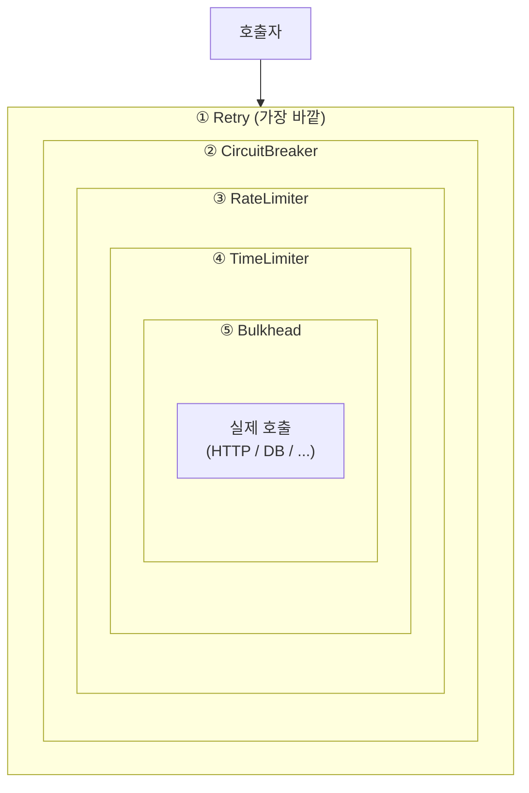
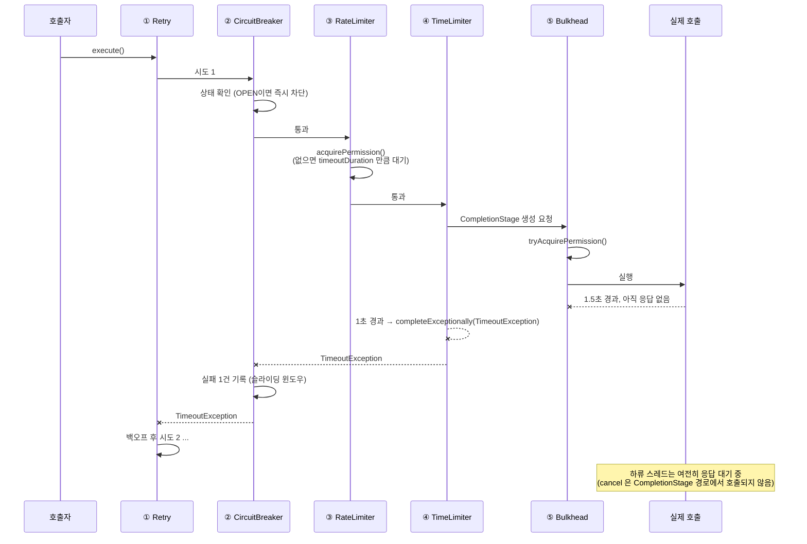

# TimeLimiter와 조합 순서 — 데코레이터를 거꾸로 끼우면 안 되는 이유

TimeLimiter는 `Future`/`CompletionStage`에만 붙습니다. 그리고 다섯 개 데코레이터를 어떤 순서로 겹치느냐에 따라 서킷이 열리는 시점, 재시도 횟수, 실제 최대 지연이 전부 달라집니다. 순서는 취향이 아니라 계산의 대상입니다.

## 목차
- [1. 핵심 개념 (What)](#1-핵심-개념-what)
- [2. 왜 알아야 하는가 (Why)](#2-왜-알아야-하는가-why)
- [3. 내부 구현 분석 (How)](#3-내부-구현-분석-how)
- [4. 실전 예제](#4-실전-예제)
- [5. 정리](#5-정리)

---

## 1. 핵심 개념 (What)

### TimeLimiter가 하는 일

`TimeLimiterConfig`는 옵션이 둘뿐입니다.

| 옵션 | 기본값 | 의미 |
|---|---|---|
| `timeoutDuration` | `Duration.ofSeconds(1)` | 제한 시간 |
| `cancelRunningFuture` | `true` | 타임아웃 시 `Future.cancel(true)`를 부를지 |

그리고 메서드가 둘입니다.

```java
<T, F extends Future<T>> Callable<T> decorateFutureSupplier(Supplier<F> futureSupplier);

<T, F extends CompletionStage<T>> Supplier<CompletionStage<T>> decorateCompletionStage(
    ScheduledExecutorService scheduler, Supplier<F> supplier);
```

둘 다 **이미 비동기로 돌고 있는 작업**을 받습니다. `Future`든 `CompletionStage`든, 작업은 다른 스레드에서 진행 중이고 TimeLimiter는 "결과를 얼마나 기다릴지"만 정합니다.

그래서 **동기 블로킹 호출에는 적용할 수 없습니다.** `restTemplate.getForObject(...)`처럼 그냥 값을 반환하는 호출은 반환되는 순간 이미 끝났습니다. 기다릴 대상이 없으니 제한할 것도 없습니다. 필요하면 `CompletableFuture.supplyAsync(..., executor)`나 `ThreadPoolBulkhead`로 먼저 비동기로 만들어야 하고, 그러면 스레드 전환에 따르는 비용과 컨텍스트 유실을 받아들여야 합니다 — [Bulkhead](./11-bulkhead.md) 참고.

### 조합 순서

데코레이터는 양파처럼 겹칩니다. 바깥 레이어는 안쪽 레이어의 **결과와 예외**를 보고, 안쪽은 바깥을 모릅니다. 그래서 "Retry가 CircuitBreaker 바깥인가 안쪽인가"는 "재시도 3회가 서킷에 3건으로 기록되는가 1건으로 기록되는가"를 결정합니다. 같은 설정, 같은 트래픽인데 서킷이 열리는 시점이 달라집니다.

Resilience4j가 제시하는 기본 순서는 Spring AOP 애스펙트의 `@Order` 기본값에 박혀 있습니다. 바깥에서 안쪽으로:

```
Retry → CircuitBreaker → RateLimiter → TimeLimiter → Bulkhead → Timer
```

---

## 2. 왜 알아야 하는가 (Why)

**첫째, `cancelRunningFuture=true`를 믿으면 안 됩니다.** `Future.cancel(true)`는 스레드에 인터럽트를 보내는 것이 전부입니다. 소켓 read에 블로킹된 스레드는 인터럽트로 깨지 않습니다. `InterruptedIOException`은 `InputStream.read()`가 아니라 NIO `InterruptibleChannel`에서만 나옵니다. 즉 **TimeLimiter가 타임아웃을 선언해도 하류 스레드는 응답이 오거나 TCP가 끊길 때까지 계속 점유됩니다.** 스레드가 새는 걸 못 보고 "타임아웃 걸어 뒀는데요"라고 말하는 장애 회고를 여러 번 봤습니다.

**둘째, 조합 순서를 잘못 짜면 각 컴포넌트가 서로를 무력화합니다.** Retry를 CircuitBreaker 안쪽에 두면 서킷은 "3번 다 실패한 묶음"을 1건으로 보기 때문에 실패율이 희석되어 늦게 열립니다. 반대로 TimeLimiter를 Retry 바깥에 두면 첫 시도가 예산을 다 쓰고 재시도는 실행조차 못 합니다.

**셋째, 타임아웃 예산이 안 맞으면 모든 복원력 설정이 무의미해집니다.** 게이트웨이가 3초에 끊는데 서비스가 "1초 × 3회 + 백오프"로 3.4초를 쓰도록 설정돼 있으면, 클라이언트는 재시도 결과를 절대 못 봅니다. 서버만 헛일을 합니다.

---

## 3. 내부 구현 분석 (How)

### 3.1 `decorateFutureSupplier()` — `cancelRunningFuture`가 동작하는 유일한 곳

```java
@Override
public <T, F extends Future<T>> Callable<T> decorateFutureSupplier(Supplier<F> futureSupplier) {
    return () -> {
        Future<T> future = futureSupplier.get();
        try {
            T result = future.get(getTimeLimiterConfig().getTimeoutDuration().toMillis(),
                TimeUnit.MILLISECONDS);
            onSuccess();
            return result;
        } catch (TimeoutException e) {
            TimeoutException timeoutException = TimeLimiter.createdTimeoutExceptionWithName(name, e);
            onError(timeoutException);
            if (getTimeLimiterConfig().shouldCancelRunningFuture()) {
                future.cancel(true);
            }
            throw timeoutException;
        } catch (ExecutionException e) {
            Throwable t = e.getCause();
            if (t == null) {
                onError(e);
                throw e;
            }
            onError(t);
            if (t instanceof Error) {
                throw (Error) t;
            }
            throw (Exception) t;
        }
    };
}
```

- `future.get(timeout, MILLISECONDS)` — **호출 스레드가 블로킹됩니다.** TimeLimiter 자체는 "작업을 비동기로 만드는" 장치가 아닙니다. 이미 비동기인 작업의 대기 시간을 자릅니다.
- `toMillis()` — `Duration.ofMicros(500)` 같은 설정은 0으로 절삭됩니다. `TimeLimiterConfig`에는 `limitRefreshPeriod`처럼 하한 검증도 없습니다(`checkTimeoutDuration()`은 `requireNonNull`만 합니다). 밀리초 미만을 쓰지 마세요.
- `shouldCancelRunningFuture()` → `future.cancel(true)`. **`mayInterruptIfRunning=true`는 "실행 중 스레드에 인터럽트를 보내라"는 뜻입니다.** 작업을 중단시키는 게 아니라 중단 요청을 보내는 것뿐입니다.
- `ExecutionException`은 **원인을 풀어서** 다시 던집니다. `Error`는 `Error`로, 나머지는 `Exception`으로. 그래서 바깥 레이어의 `recordException` 조건자가 원래 예외 타입을 그대로 봅니다. 래핑된 `ExecutionException`이 올라오지 않는다는 점을 기억하세요.

### 3.2 `decorateCompletionStage()` — `cancelRunningFuture`가 **무시되는** 곳

```java
@Override
public <T, F extends CompletionStage<T>> Supplier<CompletionStage<T>> decorateCompletionStage(
    ScheduledExecutorService scheduler, Supplier<F> supplier) {

    return () -> {
        CompletableFuture<T> future = supplier.get().toCompletableFuture();
        ScheduledFuture<?> timeoutFuture =
            Timeout
                .of(future, scheduler, name, getTimeLimiterConfig().getTimeoutDuration().toMillis(),
                    TimeUnit.MILLISECONDS);

        return future.whenComplete((result, throwable) -> {
            if (throwable == null) {
                if (!timeoutFuture.isDone()) {
                    timeoutFuture.cancel(false);
                }
                onSuccess();
            }
            ...
        });
    };
}

static final class Timeout {
    static ScheduledFuture<?> of(
        CompletableFuture<?> future, ScheduledExecutorService scheduler, String name, long delay,
        TimeUnit unit) {
        return scheduler.schedule(() -> {
            if (future != null && !future.isDone()) {
                future.completeExceptionally(TimeLimiter.createdTimeoutExceptionWithName(name, null));
            }
        }, delay, unit);
    }
}
```

소스 전체를 훑어도 이 경로에는 `shouldCancelRunningFuture()` 호출이 **없습니다.** `grep`으로 확인하면 `TimeLimiterImpl` 내 유일한 사용처는 `decorateFutureSupplier`의 한 줄이고, 나머지는 `TimeLimiterConfig`의 getter와 `TimeLimiterAspect`의 **디버그 로그**입니다.

```
TimeLimiterImpl.java:53          if (getTimeLimiterConfig().shouldCancelRunningFuture()) {
TimeLimiterConfig.java:49        public boolean shouldCancelRunningFuture() {
TimeLimiterAspect.java:121       ..., timeLimiterConfig.shouldCancelRunningFuture(), methodName
```

`Timeout.of()`가 하는 일은 `future.completeExceptionally(TimeoutException)`뿐입니다. 하류 작업에는 아무 신호도 가지 않습니다. **`CompletionStage` 경로에서 `cancelRunningFuture`는 어떤 값이든 동작이 같습니다.**

그리고 Spring AOP는 이 경로만 씁니다.

```java
// TimeLimiterAspect
if (!CompletionStage.class.isAssignableFrom(returnType)) {
    throw new IllegalReturnTypeException(returnType, methodName,
        "CompletionStage expected.");
}
return handleJoinPointCompletableFuture(proceedingJoinPoint, timeLimiter);
```

```java
private Object handleJoinPointCompletableFuture(
        ProceedingJoinPoint proceedingJoinPoint, TimeLimiter timeLimiter) throws Throwable {
    return timeLimiter.executeCompletionStage(timeLimiterExecutorService, () -> { ... });
}
```

정리하면:

| 사용 경로 | `cancelRunningFuture` 효과 |
|---|---|
| `timeLimiter.decorateFutureSupplier(...)` | `Future.cancel(true)` 호출 (= 인터럽트 요청) |
| `timeLimiter.decorateCompletionStage(...)` | **없음** |
| `Decorators.ofCompletionStage(...).withTimeLimiter(...)` | **없음** (위와 같은 경로) |
| Spring `@TimeLimiter` | **없음** (반환 타입이 `CompletionStage`여야 하고, 항상 위 경로) |

즉 `@TimeLimiter`에 `cancel-running-future: true`를 써 놓고 "중단되고 있다"고 믿는 설정은 전부 착각입니다. 코드 리뷰에서 바로 지적할 수 있는 지점입니다.

### 3.3 그래서 HTTP 클라이언트 타임아웃이 1차 방어선

`cancel(true)`가 효과가 있다고 가정해도 한계는 똑같습니다.

```
TimeLimiter: 1초 → TimeoutException → 호출자에게 반환
하류 스레드: 소켓 read 블로킹 중
            ├─ interrupt 플래그 세팅됨
            ├─ read()는 깨지 않음 (InterruptibleChannel이 아니면)
            └─ 서버가 30초 뒤 응답 → 그때까지 스레드·커넥션 점유
```

TimeLimiter는 **호출자를 풀어주는 장치**입니다. 자원을 회수하는 장치가 아닙니다. 자원 회수는 전송 계층에서만 됩니다.

```java
// 1차 방어선 — 소켓이 직접 끊어야 자원이 돌아온다
HttpClient httpClient = HttpClient.create()
    .option(ChannelOption.CONNECT_TIMEOUT_MILLIS, 300)
    .responseTimeout(Duration.ofMillis(800))               // ★ 핵심
    .doOnConnected(conn -> conn
        .addHandlerLast(new ReadTimeoutHandler(800, TimeUnit.MILLISECONDS))
        .addHandlerLast(new WriteTimeoutHandler(800, TimeUnit.MILLISECONDS)));

WebClient webClient = WebClient.builder()
    .clientConnector(new ReactorClientHttpConnector(httpClient))
    .build();

// 2차 방어선 — 클라이언트 타임아웃이 안 먹는 경우(DNS 지연, 로컬 큐잉 등)의 안전망
TimeLimiterConfig timeLimiter = TimeLimiterConfig.custom()
    .timeoutDuration(Duration.ofSeconds(1))   // 800ms보다 조금 길게
    .build();
```

**TimeLimiter의 `timeoutDuration`은 HTTP 클라이언트 타임아웃보다 약간 길게 둡니다.** 더 짧게 두면 TimeLimiter가 항상 먼저 터지고, 하류 스레드는 계속 쌓입니다. 자원 회수가 안 되는 쪽이 먼저 발동하게 설정하면 안 됩니다.

### 3.4 `Decorators` 빌더: 마지막에 부른 것이 가장 바깥

`io.github.resilience4j.decorators.Decorators`(모듈 `resilience4j-all`)의 각 `withX`는 현재 supplier를 **다시 감쌉니다.**

```java
public DecorateCompletionStage<T> withBulkhead(Bulkhead bulkhead) {
    stageSupplier = Bulkhead.decorateCompletionStage(bulkhead, stageSupplier);
    return this;
}

public DecorateCompletionStage<T> withTimeLimiter(TimeLimiter timeLimiter,
    ScheduledExecutorService scheduler) {
    stageSupplier =  timeLimiter.decorateCompletionStage(scheduler, stageSupplier);
    return this;
}
```

`stageSupplier = wrap(stageSupplier)`. 즉 **나중에 호출한 `withX`가 더 바깥 레이어가 됩니다.** 체인을 읽을 때 바깥→안쪽 순서는 **코드의 역순**입니다. 이게 순서 실수가 가장 많이 나는 지점입니다.

`DecorateCompletionStage`가 제공하는 레이어는 `withTimer`, `withCircuitBreaker`, `withRetry(retry, scheduler)`, `withBulkhead`, `withTimeLimiter(timeLimiter, scheduler)`, `withRateLimiter`, `withFallback(...)`이고, `decorate()` 또는 `get()`으로 마감합니다. `withThreadPoolBulkhead`는 `DecorateCompletionStage`에 없습니다 — `DecorateSupplier`/`DecorateCallable`/`DecorateRunnable`에 있고, 호출하면 **반환형이 `DecorateCompletionStage`로 바뀝니다.** 스레드풀 Bulkhead는 항상 체인의 가장 안쪽입니다.

### 3.5 Spring AOP 애스펙트의 기본 `@Order`

`org.springframework.core.Ordered.LOWEST_PRECEDENCE`는 `Integer.MAX_VALUE`이고, **값이 작을수록 우선순위가 높아 더 바깥에서 감쌉니다.**

| 애스펙트 | 프로퍼티 클래스 | 기본값 | 상대 순서 |
|---|---|---|---|
| `RetryAspect` | `RetryConfigurationProperties` | `LOWEST_PRECEDENCE - 5` | **가장 바깥** |
| `CircuitBreakerAspect` | `CircuitBreakerConfigurationProperties` | `LOWEST_PRECEDENCE - 4` | ↓ |
| `RateLimiterAspect` | `RateLimiterConfigurationProperties` | `LOWEST_PRECEDENCE - 3` | ↓ |
| `TimeLimiterAspect` | `TimeLimiterConfigurationProperties` | `LOWEST_PRECEDENCE - 2` | ↓ |
| `BulkheadAspect` | `BulkheadConfigurationProperties` | `LOWEST_PRECEDENCE - 1` | ↓ |
| `TimerAspect` | `TimerConfigurationProperties` | `LOWEST_PRECEDENCE` | **가장 안쪽** |

소스의 주석이 의도를 확인해 줍니다.

```java
// RetryConfigurationProperties
/**
 * As of release 0.16.0 as we set an implicit spring aspect order now which is retry then
 * circuit breaker then rate limiter then bulkhead but the user can override it still if he has
 * different use case but bulkhead will be first aspect all the time due to the implicit order
 * we have it for bulkhead
 */
```

```java
// BulkheadConfigurationProperties
/**
 * As of release 0.16.0 as we set an implicit spring aspect order for bulkhead to cover the
 * async case of threadPool bulkhead but user can override it still if he has different use case
 */
```

Bulkhead가 가장 안쪽인 이유가 바로 "to cover the async case of threadPool bulkhead"입니다. `ThreadPoolBulkhead`가 메서드를 다른 스레드로 넘겨 `CompletionStage`를 만들고, 그 바로 바깥의 TimeLimiter가 그 `CompletionStage`에 제한을 겁니다. Bulkhead가 TimeLimiter 바깥이면 TimeLimiter가 제한할 `CompletionStage`가 아직 존재하지 않습니다.

`application.yml`에서 바꿀 수 있습니다. 바꾸기 전에 왜 바꾸는지 적어 두세요.

```yaml
resilience4j:
  retry:
    retry-aspect-order: 2147483642      # Integer.MAX_VALUE - 5 (기본값)
  circuitbreaker:
    circuit-breaker-aspect-order: 2147483643
```

### 3.6 양파 구조와 통과 흐름



예외가 거꾸로 올라오는 경로를 따라가 봅니다.



마지막 `Note`가 3.2~3.3의 결론입니다. 재시도가 돌 때마다 **하류 스레드가 하나씩 더 쌓입니다.** 그래서 Bulkhead가 반드시 필요합니다.

### 3.7 순서별 결과 차이

**(A) Retry가 CircuitBreaker 바깥 (기본, 권장)**

```
Retry( CircuitBreaker( call ) )
시도1 실패 → CB에 실패 1건
시도2 실패 → CB에 실패 2건
시도3 실패 → CB에 실패 3건
→ 호출 1건당 CB 기록 3건. 서킷이 빨리 열린다.
```

슬라이딩 윈도우 100, 실패율 임계치 50%라면 실질적으로 **약 17건의 논리 호출**(17×3≒51건)로 열립니다. 하류가 아프면 빨리 손을 떼는 쪽이 맞습니다.

**(B) Retry가 CircuitBreaker 안쪽**

```
CircuitBreaker( Retry( call ) )
시도1,2,3 모두 실패 → CB에 실패 1건 (묶음 전체가 1건)
→ 호출 1건당 CB 기록 1건. 서킷이 3배 늦게 열린다.
```

같은 윈도우·임계치에서 **약 51건의 논리 호출**이 필요합니다. 그 사이 하류는 153번 맞습니다. 게다가 CB의 `slowCallDurationThreshold` 판정도 "재시도 전체 시간"으로 측정되므로 느린호출 비율이 왜곡됩니다.

예외: **재시도가 자체 실패가 아니라 "묶음의 성공/실패"로만 의미가 있는 경우**(예: 멱등하지 않아 사실상 1회성인 작업)에는 (B)가 맞을 수 있습니다. 의도적으로 고르는 것과 모르고 그렇게 되는 것은 다릅니다.

**(C) TimeLimiter가 Retry 안쪽 (= 시도별 예산)**

```
Retry( TimeLimiter(1s)( call ) )
시도1: 최대 1s → 타임아웃
백오프 200ms
시도2: 최대 1s → 타임아웃
백오프 400ms
시도3: 최대 1s → 타임아웃
총 최대 3.6s
```

**각 시도가 공평하게 1초씩** 받습니다. 총 시간이 길어집니다.

**(D) TimeLimiter가 Retry 바깥 (= 전체 예산)**

```
TimeLimiter(1s)( Retry( call ) )
전체 1s 안에 재시도까지 끝내야 한다
시도1이 1s를 다 쓰면 → 시도2는 실행조차 못 함
→ Retry 설정이 사실상 무효
```

**전체가 1초**입니다. 상위 타임아웃을 지키는 데는 확실하지만, 첫 시도가 느리면 재시도는 의미가 없어집니다.

| 배치 | 예산 성격 | 최대 지연 | Retry 유효성 | 언제 |
|---|---|---|---|---|
| (C) TimeLimiter 안쪽 | 시도별 | `n × T + Σbackoff` | 완전 | 상위 예산이 넉넉할 때 |
| (D) TimeLimiter 바깥 | 전체 | `T` | 첫 시도가 느리면 무효 | 상위 SLA가 엄격할 때 |

**둘 다 쓰는 게 정답입니다.** 안쪽에 시도별 TimeLimiter, 바깥에 전체 데드라인(Spring MVC의 `AsyncRequestTimeout`이나 게이트웨이 타임아웃)을 둡니다.

### 3.8 타임아웃 예산(timeout budget)

지켜야 하는 부등식입니다.

```
상위 타임아웃 > (시도 수 × 하위 타임아웃) + 백오프 합 + 바깥 레이어 대기 + 오버헤드
```

"바깥 레이어 대기"를 빼먹는 경우가 많습니다. 기본 순서에서 **RateLimiter는 TimeLimiter보다 바깥**입니다. `RateLimiter.decorateCompletionStage()`는 `waitForPermission(...)`을 먼저 호출해 `timeoutDuration`까지 블로킹하고 **그 다음에** 안쪽 stage를 만듭니다. 그 대기 시간은 TimeLimiter의 예산에 포함되지 않고 **더해집니다.**

계산 예 — 게이트웨이 3초:

| 레이어 | 설정 | 최악 기여 |
|---|---|---|
| 게이트웨이 (상위) | 3,000 ms | 예산 |
| RateLimiter `timeoutDuration` | 100 ms | +100 ms (TimeLimiter 밖) |
| Retry `maxAttempts` | 3 | — |
| Retry 백오프 (200ms, ×2, 지수 2배) | 200 + 400 | +600 ms |
| TimeLimiter `timeoutDuration` (시도별) | 800 ms × 3 | +2,400 ms |
| Bulkhead `maxWaitDuration` | 50 ms × 3 | +150 ms (TimeLimiter 안이므로 각 시도의 800ms에 포함) |
| 네트워크·직렬화 오버헤드 | ~50 ms | +50 ms |
| **합계** | | **3,100 ms > 3,000 ms ❌** |

초과했습니다. 조정안:

| 조정 | 결과 |
|---|---|
| `maxAttempts` 3 → 2 | 100 + 200 + 1,600 + 50 = **1,950 ms ✅** (여유 1,050 ms) |
| TimeLimiter 800 → 600 ms 유지 3회 | 100 + 600 + 1,800 + 50 = **2,550 ms ✅** (여유 450 ms) |
| 백오프 200 → 100 ms, 시도 3회 | 100 + 300 + 2,400 + 50 = **2,850 ms ✅** (여유 150 ms, 빡빡함) |

**여유는 상위 타임아웃의 20% 이상 남기세요.** GC 정지, 커넥션 획득 지연, 스레드 스케줄링은 예산표에 없는데 실제로는 발생합니다.

---

## 4. 실전 예제

### 4-1. 다섯 개를 올바른 순서로 엮기

```java
@Configuration
public class RecommendationPipeline {

    /**
     * 데코레이터는 "나중에 부른 withX 가 더 바깥"이다.
     * 따라서 코드 순서는 안쪽 → 바깥, 즉 권장 순서의 역순으로 쓴다.
     *
     *   Retry ( CircuitBreaker ( RateLimiter ( TimeLimiter ( Bulkhead ( call ) ) ) ) )
     *   ↑ 마지막 withRetry                                    ↑ 첫 withBulkhead
     */
    @Bean
    Supplier<CompletionStage<Recommendation>> recommendationCall(
        RecommendationClient client,
        Bulkhead bulkhead,
        TimeLimiter timeLimiter,
        RateLimiter rateLimiter,
        CircuitBreaker circuitBreaker,
        Retry retry,
        @Qualifier("resilienceScheduler") ScheduledExecutorService scheduler) {

        return Decorators
            // ⑤ 가장 안쪽: 동시 실행 상한 (하류 커넥션 풀 보호)
            .ofCompletionStage(client::fetchAsync)
            .withBulkhead(bulkhead)
            // ④ 시도별 시간 예산. Bulkhead 대기 시간까지 이 예산에 포함된다
            .withTimeLimiter(timeLimiter, scheduler)
            // ③ 유입 속도 제한 (상대 쿼터 보호). 이 대기는 ④의 예산 '밖'이다
            .withRateLimiter(rateLimiter)
            // ② 실패/느린호출 누적 → 차단. 각 시도가 개별 기록된다
            .withCircuitBreaker(circuitBreaker)
            // ① 가장 바깥: 재시도
            .withRetry(retry, scheduler)
            // 폴백은 모든 레이어 바깥에서 받는다
            .withFallback(List.of(
                    TimeoutException.class,
                    CallNotPermittedException.class,
                    RequestNotPermitted.class,
                    BulkheadFullException.class),
                throwable -> Recommendation.empty())
            .decorate();
    }

    @Bean("resilienceScheduler")
    ScheduledExecutorService resilienceScheduler() {
        // Retry 백오프와 TimeLimiter 타임아웃 예약에 쓰인다.
        // 블로킹 작업을 올리지 않는 전용 풀로 분리한다.
        ScheduledThreadPoolExecutor executor = new ScheduledThreadPoolExecutor(2,
            r -> {
                Thread t = new Thread(r, "resilience-sched");
                t.setDaemon(true);
                return t;
            });
        executor.setRemoveOnCancelPolicy(true);  // 취소된 타임아웃 작업이 큐에 쌓이지 않게
        return executor;
    }
}
```

`setRemoveOnCancelPolicy(true)`를 짚고 넘어갑니다. `TimeLimiterImpl.decorateCompletionStage()`는 정상 완료 시 `timeoutFuture.cancel(false)`를 부르지만, `ScheduledThreadPoolExecutor`의 기본 설정에서는 **취소된 작업이 큐에서 즉시 제거되지 않습니다.** 고TPS에서 이 큐가 수십만 건까지 자라는 것을 실제로 보게 됩니다.

### 4-2. 잘못된 순서 ① — Retry가 CircuitBreaker 안쪽

```java
// ❌ 나쁜 예: withRetry 를 먼저 불러서 Retry 가 안쪽으로 들어갔다
Supplier<CompletionStage<Recommendation>> wrong1 = Decorators
    .ofCompletionStage(client::fetchAsync)
    .withRetry(retry, scheduler)              // ← 안쪽
    .withCircuitBreaker(circuitBreaker)       // ← 바깥
    .decorate();
// 실제 구조: CircuitBreaker( Retry( call ) )
```

증상과 영향:

| 항목 | 올바른 순서 | `wrong1` |
|---|---|---|
| 논리 호출 1건당 CB 기록 | 3건 | **1건** |
| 윈도우 100 / 임계치 50%에서 열리는 시점 | 약 17건 | **약 51건** |
| 그때까지 하류가 받은 호출 수 | 약 51회 | **약 153회** |
| `slowCallDurationThreshold` 판정 대상 | 시도 1회 시간 | **재시도 전체 시간**(항상 느림으로 집계) |
| 서킷이 OPEN일 때 | 재시도 전에 즉시 차단 | 재시도가 먼저 다 돌고 나서 차단 판단 |

마지막 줄이 특히 나쁩니다. OPEN 상태에서 차단은 정상적으로 됩니다 — CB가 가장 바깥이니까요. 문제는 HALF_OPEN입니다. 허용된 시험 호출 1건이 **안쪽 Retry를 거쳐 하류에 3회 호출**로 나갑니다. 겨우 일어나는 중인 서비스를 세 배로 때리는 셈입니다. 복구 구간에 가장 하고 싶지 않은 행동입니다.

### 4-3. 잘못된 순서 ② — Bulkhead가 TimeLimiter 바깥

```java
// ❌ 나쁜 예: TimeLimiter 를 먼저 불러서 Bulkhead 가 바깥으로 나갔다
Supplier<CompletionStage<Recommendation>> wrong2 = Decorators
    .ofCompletionStage(client::fetchAsync)
    .withTimeLimiter(timeLimiter, scheduler)  // ← 안쪽
    .withBulkhead(bulkhead)                   // ← 바깥
    .decorate();
// 실제 구조: Bulkhead( TimeLimiter( call ) )
```

무엇이 깨지나:

1. **Bulkhead 대기 시간이 TimeLimiter 예산에서 빠집니다.** `maxWaitDuration=500ms` + `timeoutDuration=1s`면 실제 최대 지연이 1.5초입니다. 예산표가 틀리기 시작합니다.
2. **permit 반납 시점이 늦어집니다.** TimeLimiter가 1초에 타임아웃을 선언해도 `Bulkhead.decorateCompletionStage()`의 `whenComplete`에서 `onComplete()`가 불리는 건 안쪽 stage가 완료될 때입니다. 이 경우엔 TimeLimiter가 `completeExceptionally`로 완료시키므로 반납은 되지만, **하류 스레드는 여전히 살아 있습니다.** Bulkhead가 "비어 있다"고 보고하는데 실제로는 하류 스레드가 계속 쌓이는, 지표와 현실이 어긋나는 상태가 됩니다.
3. `ThreadPoolBulkhead`를 쓰는 경우에는 아예 **구성이 불가능**합니다. TimeLimiter가 제한할 `CompletionStage`를 Bulkhead가 만들어 주는 구조이므로, Bulkhead가 바깥이면 안쪽에 감쌀 `CompletionStage`가 없습니다. Spring AOP가 Bulkhead 애스펙트를 가장 안쪽(`LOWEST_PRECEDENCE - 1`)으로 고정한 이유입니다.

### 4-4. 예산표를 설정으로 옮기기

```yaml
# 게이트웨이 타임아웃 3s 기준. 합계 1,950ms (여유 35%)
resilience4j:
  retry:
    instances:
      recommendation:
        max-attempts: 2                      # 3 → 2 로 줄여 예산을 맞춤
        wait-duration: 200ms
        enable-exponential-backoff: true
        exponential-backoff-multiplier: 2
        retry-exceptions:
          - java.util.concurrent.TimeoutException
          - java.io.IOException
        ignore-exceptions:                   # 재시도해도 소용없는 것들
          - io.github.resilience4j.ratelimiter.RequestNotPermitted
          - io.github.resilience4j.bulkhead.BulkheadFullException
          - io.github.resilience4j.circuitbreaker.CallNotPermittedException

  circuitbreaker:
    instances:
      recommendation:
        sliding-window-type: COUNT_BASED
        sliding-window-size: 100
        failure-rate-threshold: 50
        slow-call-duration-threshold: 600ms  # TimeLimiter(800ms)보다 짧게
        slow-call-rate-threshold: 60
        wait-duration-in-open-state: 10s
        permitted-number-of-calls-in-half-open-state: 5

  ratelimiter:
    instances:
      recommendation:
        limit-for-period: 40
        limit-refresh-period: 1s
        timeout-duration: 100ms              # TimeLimiter 예산 '밖'. 합계에 더해야 함

  timelimiter:
    instances:
      recommendation:
        timeout-duration: 800ms              # 시도별 예산
        cancel-running-future: true          # CompletionStage 경로에서는 효과 없음 (3.2 참고)

  bulkhead:
    instances:
      recommendation:
        max-concurrent-calls: 20
        max-wait-duration: 50ms
```

검산:

```
RateLimiter 대기        100 ms
+ 시도1 (TimeLimiter)   800 ms   (Bulkhead 대기 50ms 포함)
+ 백오프                200 ms
+ 시도2 (TimeLimiter)   800 ms
+ 오버헤드               50 ms
---------------------------------
= 1,950 ms  <  3,000 ms  ✅  여유 1,050 ms (35%)
```

`slow-call-duration-threshold: 600ms`를 TimeLimiter의 800ms보다 **짧게** 둔 것에 주목하세요. 그래야 타임아웃으로 끝나기 전에 "느려지고 있다"는 신호가 서킷에 쌓입니다. 둘을 같게 두면 느린호출 판정이 사실상 타임아웃 판정과 겹쳐 선행 지표의 가치를 잃습니다.

이 계산을 테스트로 고정해 두면 설정 드리프트를 막을 수 있습니다.

```java
@Test
void timeout_budget_must_fit_in_the_gateway_deadline() {
    Duration gatewayDeadline = Duration.ofSeconds(3);

    int attempts = retryRegistry.retry("recommendation")
        .getRetryConfig().getMaxAttempts();
    Duration perAttempt = timeLimiterRegistry.timeLimiter("recommendation")
        .getTimeLimiterConfig().getTimeoutDuration();
    Duration rateLimiterWait = rateLimiterRegistry.rateLimiter("recommendation")
        .getRateLimiterConfig().getTimeoutDuration();
    Duration backoffSum = Duration.ofMillis(200);   // attempts=2 → 백오프 1회

    Duration worstCase = perAttempt.multipliedBy(attempts)
        .plus(backoffSum)
        .plus(rateLimiterWait)
        .plus(Duration.ofMillis(50));               // 오버헤드 여유

    // 상위 데드라인의 80% 안에 들어와야 한다
    assertThat(worstCase).isLessThan(gatewayDeadline.multipliedBy(80).dividedBy(100));
}
```

---

## 5. 정리

| 질문 | 답 |
|---|---|
| TimeLimiter를 동기 호출에 붙일 수 있나 | 못 붙인다. `Future` / `CompletionStage`만 받는다 |
| `timeoutDuration` 기본값 | `Duration.ofSeconds(1)`. `toMillis()`로 쓰이므로 ms 미만은 절삭 |
| `cancelRunningFuture` 기본값 | `true` |
| `cancelRunningFuture`가 실제로 동작하는 곳 | **`decorateFutureSupplier()`뿐.** `decorateCompletionStage()`와 Spring `@TimeLimiter`에서는 효과 없음 |
| `Future.cancel(true)`가 하는 일 | 인터럽트 요청. **소켓 read에 블로킹된 스레드는 깨지 않는다** |
| 그래서 1차 방어선은 | HTTP 클라이언트의 connect/response/read 타임아웃. TimeLimiter는 호출자를 풀어주는 2차 방어선 |
| TimeLimiter와 클라이언트 타임아웃의 관계 | TimeLimiter를 **약간 더 길게**. 짧으면 자원 회수 없이 호출자만 떠나고 하류 스레드가 쌓인다 |
| Spring `@TimeLimiter` 반환 타입 | `CompletionStage` 필수. 아니면 `IllegalReturnTypeException` |
| `Decorators`의 순서 규칙 | `stageSupplier = wrap(stageSupplier)` — **마지막 `withX`가 가장 바깥.** 코드는 권장 순서의 역순으로 쓴다 |
| Spring AOP 기본 순서 (바깥→안쪽) | Retry(MAX-5) → CircuitBreaker(MAX-4) → RateLimiter(MAX-3) → TimeLimiter(MAX-2) → Bulkhead(MAX-1) → Timer(MAX) |
| Bulkhead가 가장 안쪽인 이유 | 소스 주석: "to cover the async case of threadPool bulkhead". `CompletionStage`를 만드는 쪽이 안쪽이어야 TimeLimiter가 감쌀 수 있다 |
| Retry가 CB 바깥 | 재시도 3회 = CB 기록 3건 → **빨리 열린다** (권장) |
| Retry가 CB 안쪽 | 재시도 전체 = CB 기록 1건 → 3배 늦게 열리고, 느린호출 판정도 왜곡 |
| TimeLimiter가 Retry 안쪽 | **시도별 예산.** 최대 `n × T + Σbackoff` |
| TimeLimiter가 Retry 바깥 | **전체 예산.** 첫 시도가 다 쓰면 재시도 무효 |
| 예산 부등식 | 상위 타임아웃 > (시도 수 × 하위 타임아웃) + 백오프 합 + **TimeLimiter 밖 레이어 대기** + 오버헤드 |
| 자주 빠뜨리는 항목 | RateLimiter `timeoutDuration`(TimeLimiter 밖이므로 더해진다), GC/스케줄링 여유 |
| 권장 여유 | 상위 타임아웃의 20% 이상 |
| 스케줄러 운영 팁 | `ScheduledThreadPoolExecutor.setRemoveOnCancelPolicy(true)`. 취소된 타임아웃 작업이 큐에 쌓이는 것을 막는다 |

---

## 관련 문서
- 선행: [Bulkhead — 두 가지 격리와 스레드풀의 함정](./11-bulkhead.md)
- 후행: [Spring Boot 자동설정](../advanced/01-spring-boot-autoconfiguration.md), [AOP 애스펙트](../advanced/02-aop-aspects.md), [프로덕션 설계](../advanced/12-production-design.md)

---
*Resilience4j v2.4.0 기준 · 소스 커밋 7e3ab525*
