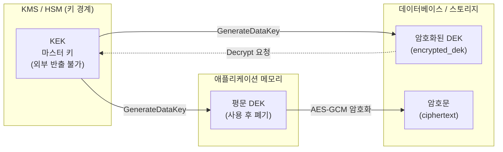

# 키 관리와 봉투 암호화 (Key Management & Envelope Encryption)

암호화 시스템의 실패는 알고리즘이 아니라 **키 관리(Key Management)** 에서 발생합니다. DEK/KEK 2단계 구조인 봉투 암호화(Envelope Encryption)와 KMS 연동, 키 로테이션 전략을 실무 관점에서 정리합니다.

## 목차
- [1. 핵심 개념 (What)](#1-핵심-개념-what)
- [2. 왜 알아야 하는가 (Why)](#2-왜-알아야-하는가-why)
- [3. 내부 구현 분석 (How)](#3-내부-구현-분석-how)
- [4. 실전 예제](#4-실전-예제)
- [5. 정리](#5-정리)

---

## 1. 핵심 개념 (What)

### 1.1 암호화의 진짜 문제는 알고리즘이 아니다

AES-256-GCM을 쓰는 것 자체는 어렵지 않습니다. `Cipher.getInstance("AES/GCM/NoPadding")` 한 줄이면 끝납니다. 문제는 그 다음입니다.

```
"AES-256으로 암호화했습니다" → 그래서 그 키는 어디 있나요?
```

**케르크호프스의 원리(Kerckhoffs's principle)**: 암호 시스템의 안전성은 알고리즘의 비밀성이 아니라 **오직 키의 비밀성**에만 의존해야 한다. 즉 알고리즘은 공개되어도 안전해야 하고, 실제 방어선은 전부 키에 걸려 있습니다.

키 관리가 답해야 하는 질문들:

| 질문 | 실무에서의 의미 |
|------|----------------|
| 키를 **어디에** 저장하는가 | 소스코드 / 환경변수 / KMS / HSM |
| 키에 **누가** 접근 가능한가 | IAM 정책, 최소 권한 원칙 |
| 키를 **언제** 바꾸는가 | 로테이션 주기, 유출 시 즉시 |
| 키가 바뀌면 **기존 암호문**은 | 키 버전 관리, 재암호화 전략 |
| 키 사용을 **감사**할 수 있는가 | CloudTrail, Vault audit device |

### 1.2 봉투 암호화 (Envelope Encryption)

**데이터는 DEK로 암호화하고, DEK는 KEK로 암호화한다.**

- **DEK (Data Encryption Key)**: 실제 데이터를 암호화하는 대칭키. 레코드/파일/테넌트 단위로 생성.
- **KEK (Key Encryption Key)**: DEK를 암호화하는 마스터키. KMS/HSM 밖으로 **절대 나오지 않음**.



```
[암호화] KMS.GenerateDataKey(KEK) → {DEK, EncryptedDEK}
         ciphertext = AES-GCM(DEK, plaintext)
         DEK 즉시 소거 → DB 저장: (EncryptedDEK, iv, ciphertext, tag)

[복호화] DB 로드 → KMS.Decrypt(EncryptedDEK) → DEK
         plaintext = AES-GCM-Decrypt(DEK, iv, ciphertext) → DEK 소거
```

### 1.3 왜 2단계인가

| 문제 | 단일 키 방식 | 봉투 암호화 |
|------|-------------|------------|
| 대용량 데이터를 KMS로 암호화 | 4KB 제한, 네트워크 왕복 | 로컬 AES로 무제한/고속 |
| 키 교체 | 전체 데이터 재암호화 | **EDEK만 재암호화** (ReEncrypt) |
| 키 유출 범위 | 전체 데이터 | 해당 DEK 범위만 |
| 마스터키 노출 | 애플리케이션 메모리에 상주 | KMS 밖으로 안 나옴 |

가장 중요한 이점은 **키 교체 비용**입니다. 1억 건 데이터의 KEK를 바꿀 때 재암호화 대상은 1억 건의 데이터가 아니라 DEK 몇 개뿐입니다.

---

## 2. 왜 알아야 하는가 (Why)

### 2.1 실제 유출 사고 유형

**유형 1 — 소스코드 하드코딩**

```kotlin
// 안티패턴: 실제로 자주 발견되는 코드
object CryptoUtil {
    private const val SECRET_KEY = "mycompany-secret-key-2024-aes256"  // NO
    private const val IV = "0123456789abcdef"                          // NO (고정 IV)
}
```

문제점이 세 가지 겹칩니다. (1) 키가 Git 히스토리에 영구 기록됨, (2) 저장소 접근 권한이 곧 복호화 권한, (3) 고정 IV로 GCM을 쓰면 nonce 재사용으로 **키 자체가 복구 가능**해집니다([../main/04-iv-and-nonce.md](../main/04-iv-and-nonce.md) 참고).

**유형 2 — Git 커밋 후 삭제**: `git rm application-prod.yml` 로 지워도 히스토리에는 그대로 남습니다. `git log -p`, `git show <old-commit>` 로 누구나 복구 가능합니다. 공개 저장소라면 봇이 수 분 내에 스캔합니다. **한 번 커밋된 키는 유출된 키**입니다 — 제거가 아니라 **로테이션**이 정답입니다.

**유형 3 — 로그/에러 메시지 노출**: `logger.error("복호화 실패: key=$secretKey")` 같은 코드 한 줄로 키가 로그 수집기에 영구 적재됩니다.

**유형 4 — 과도한 IAM 권한**: `kms:Decrypt` 를 `Resource: "*"` 로 준 역할이 EC2 인스턴스에 붙어 있으면, SSRF 한 방으로 메타데이터 서비스에서 자격증명을 탈취해 모든 암호문을 복호화할 수 있습니다.

### 2.2 규제 요구사항

개인정보보호법(안전성 확보조치 기준)은 고유식별정보·비밀번호·생체정보의 암호화 저장과 함께 **암호키 관리 절차 수립**을 별도로 명시하고, GDPR Art.32도 암호화를 적절한 기술적 조치로 규정합니다. 감사에서 실제로 묻는 것은 "암호화했습니까?"가 아니라 **"키는 누가 관리하고, 언제 바꿨고, 접근 이력은 남습니까?"** 입니다.

---

## 3. 내부 구현 분석 (How)

### 3.1 KMS 3종 비교

| 항목 | AWS KMS | GCP KMS | HashiCorp Vault |
|------|---------|---------|-----------------|
| 키 저장 | AWS 관리 HSM (FIPS 140-3 L3) | Google HSM/소프트웨어 | 자체 운영 (Transit 엔진) |
| 봉투 암호화 API | `GenerateDataKey` | `Encrypt`/`Decrypt` + 자체 DEK | `transit/datakey/plaintext` |
| 자동 로테이션 | 연 1회(기본) / 90일~ 설정 가능 | 주기 설정 가능 | `rotate` 호출 (수동/자동) |
| 구 키 자동 보관 | O (버전으로 유지) | O | O (min_decryption_version) |
| 인증 | IAM Role / IRSA | Workload Identity | AppRole / K8s Auth |
| 감사 | CloudTrail | Cloud Audit Logs | Audit Device |
| 멀티클라우드 | X | X | **O** |
| 운영 부담 | 없음 | 없음 | **높음** (HA, unseal, 백업) |

선택 기준: AWS 단일 클라우드면 KMS가 압도적으로 편합니다. 온프레미스 혼재/멀티클라우드/동적 시크릿(DB 자격증명 자동 발급)까지 필요하면 Vault를 검토합니다.

### 3.2 키 로테이션 전략

키 로테이션은 두 층위를 구분해야 합니다.

```
KEK 로테이션  → EDEK만 재암호화 (kms:ReEncrypt), 데이터 무변경. 저렴.
DEK 로테이션  → 데이터 재암호화 필요. 비쌈.
```

**AWS KMS 자동 로테이션의 함정**: KMS가 자동으로 KEK를 로테이션해도 **기존 암호문은 옛 버전 키로 계속 복호화**됩니다. 즉 "자동 로테이션 켰으니 안전"이 아니라, 과거 키가 계속 살아 있다는 뜻입니다. 유출 대응용으로는 부족합니다.

DEK 재암호화 전략 비교:

| 전략 | 방식 | 장점 | 단점 |
|------|------|------|------|
| **전체 재암호화** | 배치로 전 레코드 복호화→재암호화 | 명확한 완료 시점 | 대용량 시 수 시간~일, DB 부하 |
| **Lazy re-encryption** | 읽을 때 구 버전이면 새 키로 다시 저장 | 무중단, 부하 분산 | 완료 시점 불명확, 콜드 데이터 영구 잔존 |
| **하이브리드** | Lazy + 잔여분 배치 정리 | 실무 최적 | 구현 복잡도 |

실무 권장은 **하이브리드**입니다. 평소엔 lazy로 흡수하고, N일 뒤 `key_version < current` 인 잔여 레코드만 배치로 처리합니다.

### 3.3 암호문에 키 버전 메타데이터 심기

키 버전을 별도 컬럼으로 두는 대신 **암호문 문자열 자체에 포함**시키면 스키마 변경 없이 이식성이 좋아집니다.

```
v1:aG9uZXN0aXY=:Y2lwaGVydGV4dCtnY210YWc=
│  │            └─ Base64(ciphertext || GCM tag)
│  └─────────────── Base64(IV, 12 bytes)
└────────────────── 키 버전 식별자
```

설계 원칙:
- **버전 접두사는 평문**이어야 한다 — 복호화 전에 어떤 키를 쓸지 알아야 하므로.
- **AAD(Additional Authenticated Data)에 버전을 넣는다** — 공격자가 `v2:` 를 `v1:` 로 바꿔치기하는 **다운그레이드 공격**을 GCM 태그 검증으로 차단.
- 알고리즘까지 넣으면(`v1.aesgcm:`) 향후 알고리즘 교체가 쉬워집니다.

### 3.4 키 유출 시 대응 절차

```
1. [격리]   해당 키의 IAM 정책을 즉시 Deny로 전환 (키 삭제 X — 복호화 불가능해짐)
2. [영향]   CloudTrail 로 kms:Decrypt 호출 주체/시각/횟수 확인
3. [교체]   새 키 버전 생성 → 신규 쓰기는 즉시 새 키 사용
4. [재암호화] 기존 데이터 재암호화 (하이브리드 전략)
5. [폐기]   재암호화 완료 확인 후 구 키 비활성화(Disable) → 대기 → 삭제
6. [신고]   개인정보 유출 시 72시간 내 신고 의무 확인
```

**핵심 주의**: 유출됐다고 키를 바로 삭제하면 **정상 데이터도 전부 복호화 불가**가 됩니다. 순서는 항상 `Deny → 재암호화 → Disable → Delete` 입니다. AWS KMS도 삭제에 최소 7일 대기 기간을 강제합니다.

### 3.5 로컬 개발 환경의 키 관리

KMS 없이 개발하려면 `KeyProvider` 같은 **인터페이스를 추상화**하고 프로파일별 구현을 주입합니다. `local` 프로파일은 고정 시드에서 파생한 로컬 키(또는 LocalStack), `dev/prod` 는 AWS KMS 구현을 씁니다(4.4 예제).

절대 하면 안 되는 것: **운영 키를 개발 환경에 복사**. 개발 PC는 통제 밖입니다. 더 근본적으로는 **운영 데이터 자체를 개발에 쓰지 않는 것**이 원칙입니다.

---

## 4. 실전 예제

### 4.1 봉투 암호화 서비스 (Kotlin + AWS KMS SDK v2)

```kotlin
package com.example.security.crypto
// import software.amazon.awssdk.services.kms.*, javax.crypto.* 등 생략

private const val GCM_IV_LENGTH = 12      // NIST SP 800-38D 권장
private const val GCM_TAG_BITS = 128

data class DataKey(val plaintext: ByteArray, val encrypted: ByteArray)

/**
 * 봉투 암호화 기반 암호화 서비스.
 * 포맷: {version}:{base64(edek)}:{base64(iv)}:{base64(ciphertext||tag)}
 */
class EnvelopeEncryptionService(
    private val kms: KmsClient,
    private val kekArn: String,
    private val keyVersion: String = "v1",
) {
    // SecureRandom은 스레드 안전하며 재사용해도 된다. Cipher는 스레드 안전하지 않다.
    private val random = SecureRandom()

    fun encrypt(plaintext: String, context: Map<String, String> = emptyMap()): String {
        val dek = generateDataKey(context)
        try {
            val iv = ByteArray(GCM_IV_LENGTH).also(random::nextBytes)
            val cipher = Cipher.getInstance("AES/GCM/NoPadding")   // 매 호출 새 인스턴스
            cipher.init(
                Cipher.ENCRYPT_MODE,
                SecretKeySpec(dek.plaintext, "AES"),
                GCMParameterSpec(GCM_TAG_BITS, iv),
            )
            // 버전을 AAD로 묶어 다운그레이드 공격 차단
            cipher.updateAAD(keyVersion.toByteArray())

            val ct = cipher.doFinal(plaintext.toByteArray(Charsets.UTF_8))
            val b64 = Base64.getEncoder()
            return "$keyVersion:${b64.encodeToString(dek.encrypted)}:" +
                "${b64.encodeToString(iv)}:${b64.encodeToString(ct)}"
        } finally {
            dek.plaintext.fill(0)   // 평문 DEK 즉시 소거
        }
    }

    fun decrypt(encoded: String, context: Map<String, String> = emptyMap()): String {
        val parts = encoded.split(":")
        require(parts.size == 4) { "잘못된 암호문 포맷" }
        val (version, edekB64, ivB64, ctB64) = parts

        val b64 = Base64.getDecoder()
        val dekPlain = decryptDataKey(b64.decode(edekB64), context)
        try {
            val cipher = Cipher.getInstance("AES/GCM/NoPadding")
            cipher.init(
                Cipher.DECRYPT_MODE,
                SecretKeySpec(dekPlain, "AES"),
                GCMParameterSpec(GCM_TAG_BITS, b64.decode(ivB64)),
            )
            cipher.updateAAD(version.toByteArray())
            return String(cipher.doFinal(b64.decode(ctB64)), Charsets.UTF_8)
        } finally {
            dekPlain.fill(0)
        }
    }

    /** 현재 키 버전으로 작성된 암호문인지 판별 — lazy re-encryption 판단용 */
    fun isCurrentVersion(encoded: String): Boolean =
        encoded.substringBefore(':') == keyVersion

    private fun generateDataKey(context: Map<String, String>): DataKey {
        val res = kms.generateDataKey(
            GenerateDataKeyRequest.builder()
                .keyId(kekArn)
                .keySpec(DataKeySpec.AES_256)
                .encryptionContext(context)     // 무결성 바인딩 (예: tenantId)
                .build()
        )
        return DataKey(res.plaintext().asByteArray(), res.ciphertextBlob().asByteArray())
    }

    private fun decryptDataKey(edek: ByteArray, context: Map<String, String>): ByteArray =
        kms.decrypt(
            DecryptRequest.builder()
                .ciphertextBlob(SdkBytes.fromByteArray(edek))
                .encryptionContext(context)
                .keyId(kekArn)                  // 키 혼동 공격 방지: 반드시 명시
                .build()
        ).plaintext().asByteArray()
}
```

> Kotlin 표준 라이브러리는 `List` 에 `component1()`~`component5()` 확장을 제공하므로 위의 4-요소 구조 분해가 그대로 동작합니다.

> **Encryption Context**: KMS의 AAD입니다. `{"tenantId": "42"}` 로 암호화한 EDEK는 같은 컨텍스트 없이는 복호화되지 않습니다. 테넌트 A의 암호문을 테넌트 B가 복호화하는 사고를 KMS 레벨에서 차단합니다. CloudTrail 로그에도 남아 감사에 유용합니다.

### 4.2 DEK 캐싱 — KMS 호출 비용 문제

레코드마다 `GenerateDataKey` 를 부르면 **KMS 요청 비용과 레이턴시(10~30ms)** 가 그대로 처리량 상한이 됩니다. TTL과 사용 횟수를 제한한 캐시로 완화합니다.

```kotlin
class CachingKeyProvider(
    private val kms: KmsClient,
    private val kekArn: String,
    private val maxUsesPerKey: Int = 10_000,
) {
    private class CachedKey(val key: DataKey) { val uses = AtomicInteger(0) }

    private val cache = Caffeine.newBuilder()
        .expireAfterWrite(Duration.ofMinutes(5))   // 시간 제한
        .maximumSize(100)
        .build<String, CachedKey>()

    fun acquire(tenantId: String): DataKey {
        while (true) {
            val cached = cache.get(tenantId) { CachedKey(newDataKey(tenantId)) }
            // 사용 횟수 제한: 한 DEK로 암호화하는 메시지 수를 묶어 GCM 안전 한계 확보
            if (cached.uses.incrementAndGet() <= maxUsesPerKey) return cached.key
            cache.invalidate(tenantId)
        }
    }

    private fun newDataKey(tenantId: String): DataKey { /* KMS GenerateDataKey */ TODO() }
}
```

캐싱 시 반드시 지킬 것:
- **시간 + 사용횟수 이중 제한** (AWS Encryption SDK의 캐싱 CMM과 동일한 설계)
- 평문 DEK가 힙에 상주하므로 **힙 덤프 유출**이 곧 키 유출 — 프로덕션 힙 덤프 정책을 함께 점검
- 테넌트별로 키를 분리해 **블라스트 반경(blast radius)** 축소

### 4.3 Lazy re-encryption 적용

```kotlin
@Service
class UserPiiService(
    private val repo: UserRepository,
    private val crypto: EnvelopeEncryptionService,
) {
    @Transactional
    fun readPhone(userId: Long): String {
        val user = repo.findById(userId).orElseThrow()
        val phone = crypto.decrypt(user.encryptedPhone)

        // 구 버전 키로 저장된 값이면 읽는 김에 새 키로 갱신
        if (!crypto.isCurrentVersion(user.encryptedPhone)) {
            user.encryptedPhone = crypto.encrypt(phone)
        }
        return phone
    }
}
```

주의: 읽기 트랜잭션에 쓰기가 섞이므로 **읽기 전용 복제본 라우팅**과 충돌할 수 있습니다. 실무에서는 재암호화를 별도 큐로 던져 비동기 처리하는 편이 안전합니다.

### 4.4 로컬/운영 프로파일 분리

```kotlin
@Configuration
class CryptoConfig {
    @Bean @Profile("!local & !test")
    fun kmsEncryptionService(@Value("\${app.crypto.kek-arn}") kekArn: String) =
        EnvelopeEncryptionService(KmsClient.create(), kekArn)

    @Bean @Profile("local | test")
    fun localEncryptionService(): EnvelopeEncryptionService {
        // LocalStack KMS 엔드포인트로 대체 — 운영 키는 절대 복사하지 않는다
        val kms = KmsClient.builder().endpointOverride(URI.create("http://localhost:4566")).build()
        return EnvelopeEncryptionService(kms, "alias/local-kek")
    }
}
```

---

## 5. 정리

| 개념 | 요약 | 실무 판단 |
|------|------|----------|
| **DEK** | 데이터를 암호화하는 대칭키 | 테넌트/레코드 단위 분리로 blast radius 축소 |
| **KEK** | DEK를 암호화하는 마스터키 | KMS/HSM 밖으로 반출 금지 |
| **봉투 암호화** | DEK로 데이터, KEK로 DEK 암호화 | 대용량 + 저비용 키 교체 |
| **Encryption Context** | KMS의 AAD | 테넌트 격리, 감사 추적에 필수 |
| **KEK 로테이션** | EDEK만 재암호화 | 저렴, 자주 수행 가능 |
| **DEK 로테이션** | 데이터 재암호화 필요 | 하이브리드(lazy + 배치) 권장 |
| **버전 접두사** | `v1:edek:iv:ct` | AAD에 버전 포함해 다운그레이드 차단 |
| **유출 대응** | Deny → 재암호화 → Disable → Delete | 즉시 삭제는 데이터 손실 |
| **DEK 캐싱** | TTL + 사용횟수 이중 제한 | KMS 비용/지연 완화, 힙 덤프 주의 |

**안티패턴 체크리스트**

- [ ] 소스코드/설정 파일에 키 하드코딩
- [ ] 고정 IV 사용 (GCM에서는 치명적)
- [ ] `kms:Decrypt` 를 `Resource: "*"` 로 부여
- [ ] 키 버전 메타데이터 없이 암호문 저장 (로테이션 불가)
- [ ] 로그/예외 메시지에 키 또는 평문 출력
- [ ] 운영 키를 개발 환경에 복사
- [ ] 유출 감지 즉시 키 삭제 (복구 불가)

> **핵심 포인트**: 암호화 시스템의 강도는 알고리즘이 아니라 키 관리 수준에서 결정된다. 봉투 암호화는 "데이터는 로컬 DEK로 빠르게, DEK는 KMS의 KEK로 안전하게"라는 분업으로 성능·비용·보안을 동시에 만족시키는 표준 패턴이다. 실무에서 반드시 챙겨야 할 것은 세 가지다 — (1) 평문 키가 KMS 경계 밖에 영속되지 않게 할 것, (2) 암호문에 키 버전을 심어 로테이션 가능한 구조로 시작할 것(나중에 추가하려면 전체 마이그레이션이 필요하다), (3) 유출 대응 절차를 데이터 손실 없이 수행할 수 있도록 `Deny → 재암호화 → Disable → Delete` 순서를 미리 문서화해 둘 것.

---

## 관련 문서

```
security/01-backend-security-fundamentals.md  (기존)
security/02-jwt-jwk-oauth-comparison.md       (기존)
security/main/01-encryption-fundamentals.md ~ 08-asymmetric-crypto-and-signature.md
security/advanced/01-key-management-envelope-encryption.md   ← 현재 문서
security/advanced/02-database-field-encryption.md
security/advanced/03-spring-boot-encryption-practice.md
security/advanced/04-tls-and-transport-security.md
```

- [../main/01-encryption-fundamentals.md](../main/01-encryption-fundamentals.md) — 대칭/비대칭 암호화 기초
- [../main/04-iv-and-nonce.md](../main/04-iv-and-nonce.md) — IV/nonce 재사용 위험
- [../main/06-aead-authenticated-encryption.md](../main/06-aead-authenticated-encryption.md) — AAD로 키 버전을 묶는 근거
- [02-database-field-encryption.md](02-database-field-encryption.md) — 이 문서의 DEK를 DB 필드에 적용
- [03-spring-boot-encryption-practice.md](03-spring-boot-encryption-practice.md) — 시크릿 주입과 Spring 통합
- [../01-backend-security-fundamentals.md](../01-backend-security-fundamentals.md) — 보안 전반

---
*참고: Java 17 / Spring Boot 3.x 기준*
