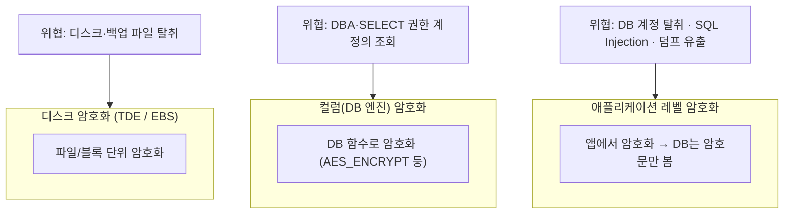

# DB 필드 암호화 실전 (Database Field Encryption)

TDE·컬럼·애플리케이션 암호화가 각각 방어하는 위협을 구분하고, JPA `AttributeConverter` 기반 투명 암호화와 **암호화된 컬럼을 검색하는 방법(blind index)** 을 실무 관점에서 정리합니다.

## 목차
- [1. 핵심 개념 (What)](#1-핵심-개념-what)
- [2. 왜 알아야 하는가 (Why)](#2-왜-알아야-하는가-why)
- [3. 내부 구현 분석 (How)](#3-내부-구현-분석-how)
- [4. 실전 예제](#4-실전-예제)
- [5. 정리](#5-정리)

---

## 1. 핵심 개념 (What)

### 1.1 암호화 계층 선택 — 각각 다른 위협을 막는다

"DB를 암호화했다"는 말은 세 가지 완전히 다른 것을 의미할 수 있습니다.



| 계층 | 암호화 주체 | 막는 위협 | 못 막는 위협 |
|------|-----------|----------|-------------|
| **TDE / 디스크** | 스토리지·DB 엔진 | 디스크 도난, 백업 파일 유출, 폐기 매체 | `SELECT` 하면 평문 그대로 보임 |
| **컬럼 암호화 (DB 함수)** | DB 엔진 | 파일 레벨 열람 | **키가 SQL에 등장** → 쿼리 로그·binlog 유출 |
| **애플리케이션 암호화** | 애플리케이션 | DB 덤프, DBA 조회, SQL Injection 결과 | 앱 서버 침해, 메모리 덤프 |

핵심 오해: **TDE는 "DB 계정이 털렸을 때"를 전혀 막지 못합니다.** RDS 암호화(EBS 레벨)를 켜놓고 "개인정보 암호화 완료"라고 보고하는 것이 가장 흔한 실무 사고입니다. 실제 유출 사고의 대다수는 디스크 도난이 아니라 애플리케이션 취약점을 통한 데이터 조회입니다.

따라서 **주민번호·계좌번호·연락처 같은 개인정보는 애플리케이션 레벨 암호화**가 기본선입니다.

### 1.2 결정적 vs 확률적 암호화

| 구분 | 결정적 (Deterministic) | 확률적 (Probabilistic) |
|------|----------------------|----------------------|
| 정의 | 같은 평문 → **항상 같은 암호문** | 같은 평문 → **매번 다른 암호문** |
| 구현 | 고정 IV, 또는 SIV 모드 | 랜덤 IV + GCM/CBC |
| 동등 비교 | **가능** (`WHERE col = ?`) | 불가능 |
| 인덱스 | 가능 (B-Tree 동등 매칭) | 무의미 |
| 정보 누출 | **평문의 동일성이 노출** | 없음 |
| 권장 | 검색이 반드시 필요할 때만 | **기본값** |

결정적 암호화의 누출은 생각보다 심각합니다. 성별 컬럼을 결정적으로 암호화하면 값이 2종류뿐이라 빈도 분석으로 즉시 복원됩니다. `등급`, `상태`, `지역` 같은 저-카디널리티 컬럼에 결정적 암호화를 쓰면 사실상 암호화하지 않은 것과 같습니다.

### 1.3 Blind Index

확률적 암호화를 유지하면서 동등 검색을 하려면 **검색 전용 파생값**을 별도 컬럼에 둡니다.

```
email_enc   = AES-GCM(랜덤 IV)  → 복호화용, 검색 불가
email_idx   = HMAC-SHA256(key, normalize(email))  → 검색용, 복호화 불가
```

```sql
SELECT * FROM users WHERE email_idx = ?;   -- 인덱스 사용 가능
```

HMAC은 단방향이므로 인덱스 컬럼이 유출돼도 평문은 복원되지 않습니다(키를 모르는 한). 대신 **같은 평문은 같은 인덱스 값**을 가지므로 결정적 암호화와 동일한 빈도 분석 위험이 남습니다 — 이는 뒤에서 다룹니다.

---

## 2. 왜 알아야 하는가 (Why)

### 2.1 규제가 요구하는 실제 수준

개인정보의 안전성 확보조치 기준은 **주민등록번호·여권번호 등 고유식별정보, 비밀번호, 생체정보**를 저장 시 암호화하도록 요구합니다. 여기서 실무 판단이 갈리는 지점:

| 항목 | 요구 수준 | 실무 구현 |
|------|----------|----------|
| 비밀번호 | **일방향 암호화** (복호화 불가) | bcrypt/Argon2 — 암호화 아님, 해시 |
| 고유식별정보 | 양방향 암호화 | AES-256-GCM + KMS |
| 계좌/카드번호 | 양방향 암호화 | 동일, 마지막 4자리만 별도 평문 보관 |
| 이메일/전화번호 | 상황에 따름(내부망 기준 등) | 암호화 + blind index |

GDPR은 알고리즘을 지정하지 않지만, 암호화된 데이터가 유출된 경우 **정보주체 통지 의무를 면제**받을 수 있습니다(Art.34(3)(a)). 즉 암호화는 사고 시 대응 비용을 극적으로 줄이는 투자입니다.

### 2.2 뒤늦게 붙이면 훨씬 비싸다

암호화를 처음부터 고려하지 않으면 나중에 다음이 전부 깨집니다.

- `VARCHAR(20)` 전화번호 컬럼 → 암호문은 100자 이상. **스키마 변경 필요**
- `WHERE phone LIKE '010-1234%'` → **동작 불가**
- `ORDER BY name` → 암호문 정렬은 무의미
- `JOIN ON a.email = b.email` → 확률적 암호화면 불가
- 통계 쿼리, 관리자 검색, 엑셀 다운로드 → 전부 재설계

그래서 "일단 평문으로 만들고 나중에 암호화"는 대부분 **나중에 못 합니다**.

### 2.3 성능 영향

| 연산 | 영향 | 대응 |
|------|------|------|
| 단건 암/복호화 | AES-GCM은 수 μs (AES-NI) — 무시 가능 | - |
| KMS 호출 | 10~30ms/회 | DEK 캐싱([01번 문서](01-key-management-envelope-encryption.md)) |
| 목록 조회 1000건 | 복호화 1000회 + 객체 할당 | 목록에는 마스킹값만, 상세에서만 복호화 |
| 인덱스 크기 | 암호문이 길어 인덱스 팽창 | blind index는 HMAC 앞 N바이트만 저장 |

실무에서 병목은 **AES 연산이 아니라 KMS 왕복과 N+1 복호화**입니다.

---

## 3. 내부 구현 분석 (How)

### 3.1 JPA AttributeConverter의 동작 지점

```
[영속화]  Entity 필드 → convertToDatabaseColumn() → JDBC 파라미터 바인딩
[조회]    ResultSet 값 → convertToEntityAttribute() → Entity 필드
```

Hibernate는 `BasicValueConverter` 로 감싸 `Type` 시스템에 등록합니다. 중요한 부수 효과:

- **더티 체킹(dirty checking)이 변환 후 값으로 수행**됩니다. 확률적 암호화는 매번 암호문이 달라지므로, 스냅샷 비교 방식에 따라 **변경이 없어도 UPDATE가 발생**할 수 있습니다. Hibernate 6은 엔티티 속성(평문) 기준으로 비교하므로 정상이지만, 커스텀 `equals` 나 `@Immutable` 설정과 얽히면 확인이 필요합니다.
- **JPQL에서 암호화 컬럼 비교가 불가능**합니다. `WHERE u.email = :email` 은 파라미터도 컨버터를 거치므로 결정적 암호화라면 동작하지만, 확률적이면 절대 매칭되지 않습니다.
- **네이티브 쿼리는 컨버터를 우회**합니다. 암호문 raw 값이 그대로 나옵니다.

### 3.2 부분 검색(LIKE)이 근본적으로 어려운 이유

암호문은 평문의 부분 구조를 보존하지 않도록 설계됩니다(확산·혼돈). `LIKE '%김%'` 를 지원하려면 이 성질을 깨야 하고, 그 순간 암호화의 의미가 사라집니다.

현실적 선택지:

| 방법 | 설명 | 트레이드오프 |
|------|------|------------|
| **n-gram blind index** | 평문을 2~3글자로 쪼개 각각 HMAC 저장 | 인덱스 테이블 폭증, 누출 증가 |
| **접두 인덱스** | 앞 N글자만 HMAC (전화번호 앞자리 등) | 접두 검색만 가능 |
| **검색 전용 필드 분리** | 마스킹된 평문(`홍*동`, `010-****-5678`)을 별도 컬럼에 평문 저장 | 실무 최다 채택 |
| **CSE/OPE 등 특수 암호** | 순서보존암호 등 | 누출 심각, 국내 규제 부적합 |
| **포기** | 정확 일치 검색만 제공 | 가장 안전 |

**실무 권장**: 관리자 화면의 부분 검색은 "정확 일치 + 마스킹 표시"로 요구사항을 재협상하는 것이 정답인 경우가 많습니다. 검색 편의를 위해 개인정보를 평문으로 남기는 순간, 암호화 전체가 무력화됩니다.

### 3.3 Blind Index의 정보 누출

이메일처럼 고유값이면 누출은 "두 레코드가 같은 이메일인가" 정도로 제한됩니다. 그러나:

- **저-카디널리티 컬럼**(성별, 등급, 지역): 빈도 분석으로 즉시 복원. blind index 금지.
- **사전 공격**: 전화번호는 경우의 수가 약 10^8. HMAC 키가 유출되면 전수 계산으로 역산 가능 → **HMAC 키는 암호화 키와 별도로 KMS 관리**.
- **부분 HMAC(truncation)**: 앞 8바이트만 저장하면 충돌이 발생해 오히려 누출이 줄어듭니다. 대신 후보를 복호화해 재확인하는 단계가 필요합니다. Bloom 필터 유사 효과.

```kotlin
// 충돌 허용 blind index: 앞 4바이트만 사용 → 의도적 false positive 생성
val idx = hmac(key, normalized).copyOf(4)
// 조회 후 애플리케이션에서 실제 복호화 값으로 필터링
```

### 3.4 무중단 마이그레이션 전략

기존 평문 컬럼을 암호화로 전환하는 4단계.

```
1단계 스키마 추가   phone_enc, phone_bidx 컬럼 추가 (nullable)
2단계 이중 쓰기     쓰기는 평문+암호문 모두, 읽기는 평문
3단계 백필          배치로 기존 행 암호화 (청크 단위, 재실행 가능)
4단계 읽기 전환     읽기를 암호문으로 → 검증 후 평문 컬럼 DROP
```

단계별 실무 포인트:

- **2단계**: 롤백 가능성을 위해 평문을 유지합니다. 이 기간이 가장 위험하므로 **최소화**합니다.
- **3단계 백필**: `WHERE phone_enc IS NULL LIMIT 1000` 으로 청크 처리. 전체 UPDATE는 락과 복제 지연을 유발합니다. 재실행 가능(idempotent)해야 합니다.
- **4단계 검증**: `SELECT COUNT(*) WHERE phone IS NOT NULL AND phone_enc IS NULL` 이 0인지 확인. 컬럼 DROP은 되돌릴 수 없으므로 **백업 후 최소 1주 관측**하고 수행합니다.

### 3.5 감사 로그와 마스킹

암호화한 데이터를 **로그에 평문으로 남기면 암호화가 무의미**해집니다. 실제로 유출 경로의 상당수가 로그입니다.

| 위치 | 위험 | 대응 |
|------|------|------|
| 애플리케이션 로그 | `logger.info("user=$user")` → `toString()` 노출 | data class `toString()` 오버라이드 |
| API 응답 | 관리자 API에서 전체 평문 반환 | 마스킹 DTO 분리 |
| 감사 로그 | "누가 무엇을 조회했나"를 남기려다 값까지 기록 | **식별자만** 기록 |
| DB 슬로우 쿼리 로그 | 바인딩 파라미터에 평문 | 앱 암호화면 암호문만 남음 (이점) |

감사 로그는 값이 아니라 **누가/언제/무엇을** 만 기록합니다.

```
2026-08-03T10:22:31 actor=admin@corp.com action=VIEW_PII target=user:12345 fields=[phone,ssn] ip=10.0.3.11
```

---

## 4. 실전 예제

### 4.1 AttributeConverter 구현 (Kotlin)

```kotlin
package com.example.security.persistence
// import jakarta.persistence.*, org.slf4j.LoggerFactory 등 생략

/** 확률적 암호화 컨버터. autoApply = false — 적용 대상을 필드마다 명시해 실수를 막는다. */
@Component
@Converter(autoApply = false)
class EncryptedStringConverter(
    private val crypto: EnvelopeEncryptionService,
) : AttributeConverter<String?, String?> {

    private val log = LoggerFactory.getLogger(javaClass)

    override fun convertToDatabaseColumn(attribute: String?): String? =
        attribute?.takeIf { it.isNotEmpty() }?.let(crypto::encrypt)

    override fun convertToEntityAttribute(dbData: String?): String? {
        if (dbData.isNullOrEmpty()) return null
        return try {
            crypto.decrypt(dbData)
        } catch (e: Exception) {
            // 절대 평문/키를 로그에 남기지 않는다. 식별 가능한 최소 정보만.
            log.error("복호화 실패 (len={}, prefix={})", dbData.length, dbData.take(3), e)
            throw DecryptionFailedException("암호화된 필드를 복호화할 수 없습니다", e)
        }
    }
}

class DecryptionFailedException(message: String, cause: Throwable) : RuntimeException(message, cause)
```

> **Spring Bean 주입**: Hibernate는 기본적으로 컨버터를 no-arg 생성자로 인스턴스화합니다. Spring Boot 3.x + `LocalContainerEntityManagerFactoryBean` 환경에서는 `SpringBeanContainer` 가 자동 등록되어 위처럼 **생성자 주입이 동작**합니다. 그렇지 않은 환경(순수 JPA, 일부 테스트 설정)에서는 정적 홀더나 `ApplicationContextAware` 폴백이 필요합니다.

### 4.2 Blind Index 컨버터

```kotlin
@Component
class BlindIndexEncoder(
    @Value("\${app.crypto.blind-index-key}") private val keyMaterial: String,
) {
    private val algorithm = "HmacSHA256"
    private val keySpec = SecretKeySpec(Base64.getDecoder().decode(keyMaterial), algorithm)

    /** Mac은 스레드 안전하지 않다. getInstance 비용이 HMAC 계산 대비 크므로 ThreadLocal 캐싱. */
    private val macHolder = ThreadLocal.withInitial {
        Mac.getInstance(algorithm).apply { init(keySpec) }
    }

    fun encode(value: String, bytes: Int = 16): String {
        val normalized = normalize(value)
        val mac = macHolder.get()
        mac.reset()
        val digest = mac.doFinal(normalized.toByteArray(Charsets.UTF_8))
        return HexFormat.of().formatHex(digest.copyOf(bytes))
    }

    /** 정규화가 없으면 "A@b.com"과 "a@b.com"이 다른 인덱스가 된다 */
    private fun normalize(value: String) = value.trim().lowercase()
}
```

### 4.3 엔티티 적용

```kotlin
@Entity
@Table(
    name = "users",
    indexes = [Index(name = "idx_users_email_bidx", columnList = "email_bidx")],
)
class User(
    @Id @GeneratedValue(strategy = GenerationType.IDENTITY)
    val id: Long = 0,

    /** 확률적 암호화 — 복호화 전용 */
    @Convert(converter = EncryptedStringConverter::class)
    @Column(name = "email_enc", length = 512, nullable = false)
    var email: String,

    /** HMAC blind index — 검색 전용, 애플리케이션이 채운다 */
    @Column(name = "email_bidx", length = 32, nullable = false)
    var emailBidx: String = "",

    @Convert(converter = EncryptedStringConverter::class)
    @Column(name = "phone_enc", length = 512)
    var phone: String? = null,

    /** 화면 표시용 마스킹값 — 평문이지만 식별 불가 수준 */
    @Column(name = "phone_masked", length = 20)
    var phoneMasked: String? = null,
) {
    // toString에 평문이 새는 것을 원천 차단 (data class를 쓰지 않은 이유이기도 하다)
    override fun toString(): String = "User(id=$id)"
}
```

### 4.4 저장/검색 서비스

```kotlin
@Service
class UserService(
    private val repo: UserRepository,
    private val bidx: BlindIndexEncoder,
) {
    @Transactional
    fun register(email: String, phone: String): Long {
        val user = User(email = email, phone = phone).apply {
            emailBidx = bidx.encode(email)              // 인덱스 동기화는 반드시 한 곳에서
            phoneMasked = maskPhone(phone)
        }
        return repo.save(user).id
    }

    /** 완전 일치 검색 — blind index 사용 */
    @Transactional(readOnly = true)
    fun findByEmail(email: String): User? =
        repo.findByEmailBidx(bidx.encode(email))
            // truncated HMAC 사용 시 충돌 가능 → 복호화로 최종 확인
            ?.takeIf { it.email.equals(email, ignoreCase = true) }

    private fun maskPhone(phone: String) =
        phone.replace(Regex("(\\d{3})-?\\d{3,4}-?(\\d{4})"), "$1-****-$2")
}
```

> **인덱스 동기화 사고**: `user.email = newEmail` 만 하고 `emailBidx` 를 갱신하지 않으면 검색이 조용히 실패합니다. 컴파일러가 잡아주지 않으므로, setter를 막고 `changeEmail(newEmail)` 같은 도메인 메서드로만 변경 가능하게 만드는 편이 안전합니다.

```kotlin
fun changeEmail(newEmail: String, bidx: BlindIndexEncoder) {
    this.email = newEmail
    this.emailBidx = bidx.encode(newEmail)   // 항상 함께 변경
}
```

### 4.5 무중단 백필 배치

```kotlin
@Component
class PhoneEncryptionBackfillJob(
    private val jdbc: JdbcTemplate,
    private val crypto: EnvelopeEncryptionService,
    private val bidx: BlindIndexEncoder,
) {
    private val log = LoggerFactory.getLogger(javaClass)

    /** 청크 단위 재실행 가능 백필. 실패해도 중단 지점부터 재개된다. */
    @Transactional
    fun runChunk(chunkSize: Int = 500): Int {
        val rows = jdbc.queryForList(
            """
            SELECT id, phone FROM users
             WHERE phone IS NOT NULL AND phone_enc IS NULL
             ORDER BY id LIMIT ?
            """.trimIndent(), chunkSize,
        )
        if (rows.isEmpty()) return 0

        val batch = rows.map { row ->
            val plain = row["phone"] as String
            arrayOf(crypto.encrypt(plain), bidx.encode(plain), row["id"] as Long)
        }
        jdbc.batchUpdate("UPDATE users SET phone_enc = ?, phone_bidx = ? WHERE id = ?", batch)
        log.info("백필 진행: {}건 처리", rows.size)
        return rows.size
    }
}
```

운영 시 유의점:
- `ORDER BY id LIMIT` + `IS NULL` 조건으로 **자연스럽게 커서가 전진**합니다.
- 청크 사이에 `Thread.sleep(100)` 정도의 페이싱을 넣어 복제 지연을 억제합니다.
- 백필 도중에도 신규 쓰기는 이중 쓰기 상태여야 누락이 없습니다.

---

## 5. 정리

| 주제 | 선택지 | 실무 권장 |
|------|--------|----------|
| **암호화 계층** | TDE / 컬럼 / 애플리케이션 | 개인정보는 **애플리케이션 레벨** (TDE는 보조) |
| **암호화 방식** | 결정적 / 확률적 | **확률적이 기본**, 검색 필요 시에만 예외 |
| **완전 일치 검색** | 결정적 암호화 / blind index | **blind index (HMAC)** |
| **부분 검색** | n-gram / 마스킹 컬럼 / 포기 | 마스킹 평문 컬럼 또는 요구사항 재협상 |
| **저-카디널리티 컬럼** | - | blind index **금지** (빈도 분석) |
| **HMAC 키** | 암호화 키와 공유 / 분리 | **반드시 분리**, KMS 관리 |
| **정렬/조인** | - | 암호화 컬럼으로 불가 → 설계 단계에서 배제 |
| **마이그레이션** | 일괄 / 이중 쓰기+백필 | **이중 쓰기 → 백필 → 읽기 전환 → DROP** |
| **로그** | - | 값 금지, 식별자만. `toString()` 오버라이드 |

**안티패턴 체크리스트**

- [ ] RDS 암호화(TDE)만 켜고 "개인정보 암호화 완료"로 처리
- [ ] 검색 편의를 위해 평문 컬럼을 함께 유지
- [ ] 성별·등급 같은 저-카디널리티 컬럼에 결정적 암호화/blind index
- [ ] blind index 키를 데이터 암호화 키와 동일하게 사용
- [ ] `email` 변경 시 `email_bidx` 갱신 누락
- [ ] `@Converter(autoApply = true)` 로 전역 적용 (의도치 않은 컬럼까지 암호화)
- [ ] 엔티티 `toString()`/Jackson 직렬화로 평문이 로그·응답에 노출
- [ ] 전체 테이블 단일 UPDATE로 백필 (락·복제 지연)

> **핵심 포인트**: DB 필드 암호화의 난이도는 암호화가 아니라 **검색**에 있다. 확률적 암호화를 기본으로 두고, 완전 일치가 필요한 컬럼에만 별도 HMAC blind index를 붙이는 것이 안전성과 실용성의 균형점이다. 부분 검색(LIKE)은 암호화와 원리적으로 양립하기 어려우므로, n-gram 인덱스로 억지로 구현해 정보를 흘리기보다 마스킹된 표시용 컬럼을 두거나 요구사항 자체를 조정하는 편이 낫다. 그리고 암호화 도입은 **처음부터 하는 것이 압도적으로 싸다** — 스키마·쿼리·검색 UX가 전부 얽히기 때문에, 나중에 붙이려면 이중 쓰기와 백필을 포함한 다단계 마이그레이션을 감수해야 한다.

---

## 관련 문서

```
security/01-backend-security-fundamentals.md  (기존)
security/02-jwt-jwk-oauth-comparison.md       (기존)
security/main/01-encryption-fundamentals.md ~ 08-asymmetric-crypto-and-signature.md
security/advanced/01-key-management-envelope-encryption.md
security/advanced/02-database-field-encryption.md            ← 현재 문서
security/advanced/03-spring-boot-encryption-practice.md
security/advanced/04-tls-and-transport-security.md
```

- [01-key-management-envelope-encryption.md](01-key-management-envelope-encryption.md) — 이 문서가 사용하는 DEK/KEK 구조
- [../main/03-block-cipher-modes.md](../main/03-block-cipher-modes.md) — 결정적/확률적 암호화의 근거인 IV와 모드
- [AEAD와 인증 암호화](../main/06-aead-authenticated-encryption.md) — blind index의 HMAC
- [해시 함수와 비밀번호 저장](../main/07-hashing-and-password-storage.md) — 비밀번호는 암호화가 아닌 해시
- [03-spring-boot-encryption-practice.md](03-spring-boot-encryption-practice.md) — 로그 마스킹과 직렬화 차단

---
*참고: Java 17 / Spring Boot 3.x 기준*
