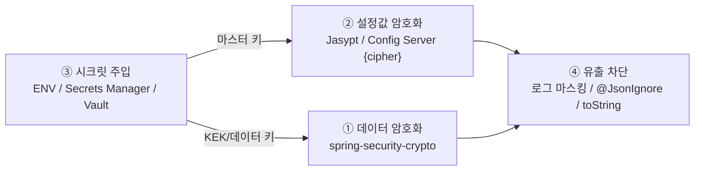

# Spring Boot 암호화 실무 (Spring Boot Encryption Practice)

Spring Security Crypto 모듈, Jasypt 설정값 암호화, 시크릿 주입 방식(ENV/Secrets Manager/Vault), 그리고 민감정보가 로그로 새는 경로를 차단하는 방법을 실무 관점에서 정리합니다.

## 목차
- [1. 핵심 개념 (What)](#1-핵심-개념-what)
- [2. 왜 알아야 하는가 (Why)](#2-왜-알아야-하는가-why)
- [3. 내부 구현 분석 (How)](#3-내부-구현-분석-how)
- [4. 실전 예제](#4-실전-예제)
- [5. 정리](#5-정리)

---

## 1. 핵심 개념 (What)

### 1.1 Spring이 제공하는 암호화 표면

Spring Boot 애플리케이션에서 "암호화"는 최소 네 군데에서 등장하며, 각각 다른 도구를 씁니다.



혼동하기 쉬운 지점: **② 설정값 암호화는 ③ 시크릿 주입 문제를 해결하지 못합니다.** Jasypt로 DB 비밀번호를 `ENC(...)` 로 감싸도, 그것을 푸는 마스터 키를 어딘가에서 주입해야 하므로 문제가 한 겹 이동할 뿐입니다. 이 사실을 인지하고 쓰는 것과 모르고 쓰는 것은 큰 차이입니다.

### 1.2 Spring Security Crypto 모듈

`spring-security-crypto` 는 JCE를 얇게 감싼 유틸리티입니다. 별도 의존성 없이 Spring Security를 쓰면 딸려 옵니다.

| API | 반환 | 알고리즘 |
|-----|------|---------|
| `Encryptors.text(password, salt)` | `TextEncryptor` | `standard()` 위임 → AES-256-**CBC** |
| `Encryptors.delux(password, salt)` | `TextEncryptor` | `stronger()` 위임 → AES-256-**GCM** |
| `Encryptors.stronger(password, salt)` | `BytesEncryptor` | AES-256-**GCM** |
| `Encryptors.standard(password, salt)` | `BytesEncryptor` | AES-256-**CBC** + HMAC |
| `Encryptors.noOpText()` | `TextEncryptor` | 없음 (테스트 전용) |

핵심 차이:

```
standard() → AES/CBC/PKCS5Padding  (인증 없음 → 별도 MAC 필요)
stronger() → AES/GCM/NoPadding     (AEAD, 인증 태그 포함)
```

**`stronger()` 를 쓰는 것이 기본**입니다. `standard()` 의 CBC는 인증이 없어 변조 탐지가 되지 않고, 패딩 오라클 공격 표면을 만듭니다([../main/03-block-cipher-modes.md](../main/03-block-cipher-modes.md)).

주의할 제약:
- `password`, `salt`(hex 문자열)로 **PBKDF2 키 파생**을 하므로 초기화가 느립니다 → 빈으로 만들어 재사용.
- 키 버전 개념이 없습니다 → 로테이션이 필요하면 [01번 문서](01-key-management-envelope-encryption.md)의 버전 접두사 패턴을 직접 구현해야 합니다.
- 대량 데이터/멀티테넌트에는 부적합합니다. 소규모 필드 암호화용입니다.

---

## 2. 왜 알아야 하는가 (Why)

### 2.1 실제 사고는 알고리즘이 아니라 배관에서 난다

| 사고 유형 | 발생 경로 |
|----------|----------|
| `application-prod.yml` 커밋 | Git 히스토리에 DB 비밀번호 영구 기록 |
| Actuator `/env` 노출 | 인증 없이 환경변수 전체 조회 |
| 예외 스택트레이스 응답 | 커넥션 URL에 비밀번호 포함되어 클라이언트로 전송 |
| `logger.info("req={}", dto)` | `data class` 의 자동 `toString()` 이 주민번호 출력 |
| API 응답에 엔티티 직접 반환 | 암호화 필드가 복호화되어 JSON에 노출 |
| 컨테이너 ENV | `docker inspect`, `/proc/<pid>/environ` 으로 조회 가능 |

전부 암호화 알고리즘과 무관하며, 전부 실무에서 반복적으로 발생합니다.

### 2.2 12-factor의 "config in environment"는 2011년 기준

12-factor App은 설정을 환경변수에 두라고 권고하지만, 이는 **시크릿 관리 도구가 보편화되기 전**의 지침입니다. 환경변수의 한계:

- **프로세스 전체에 상속**됩니다. 서브프로세스·크래시 리포터·APM 에이전트가 전부 읽고, `/proc/<pid>/environ` 으로 같은 호스트의 다른 프로세스도 읽습니다.
- **회전이 불가능**합니다. 값을 바꾸려면 프로세스를 재시작해야 합니다.
- Kubernetes `Secret` 은 기본이 **base64 인코딩일 뿐 암호화가 아닙니다**(etcd 암호화 별도 설정 필요).

현대적 해석: 환경변수에는 **"시크릿을 가져올 위치"** 만 넣고(`SECRET_ARN`, `VAULT_ROLE`), 실제 값은 런타임에 IAM/Workload Identity 기반으로 조회합니다.

---

## 3. 내부 구현 분석 (How)

### 3.1 Jasypt의 동작 지점

`jasypt-spring-boot-starter` 는 `EnableEncryptablePropertiesBeanFactoryPostProcessor` 로 `PropertySource` 를 래핑합니다.

```
application.yml  →  EncryptablePropertySource (프록시)
                        ↓ 값이 ENC(...) 패턴인가?
                    StringEncryptor.decrypt()  →  평문 반환
```

```yaml
spring.datasource.password: ENC(G6N718UuyPE5bHyWKyuLQSm02auQPUtm)
jasypt:
  encryptor:
    algorithm: PBEWITHHMACSHA512ANDAES_256   # 기본값(2.x+)
    iv-generator-classname: org.jasypt.iv.RandomIvGenerator
    pool-size: 4                             # 스레드 안전성 확보
```

**마스터 키 주입 방법 우선순위**: ① 명령행 인자(`--jasypt.encryptor.password=`)는 `ps` 로 노출되므로 **금지**, ② 환경변수 `JASYPT_ENCRYPTOR_PASSWORD` 는 최소 수준, ③ **커스텀 `StringEncryptor` 빈으로 KMS 연동**이 권장안입니다(4.2 예제).

**Jasypt의 한계를 명확히 인식할 것**:
- 마스터 키 하나로 전부 열립니다. 로테이션하려면 모든 `ENC()` 값을 다시 만들어야 합니다.
- `pool-size` 를 설정하지 않으면 `PooledPBEStringEncryptor` 가 아닌 단일 인스턴스가 되어 동시성 병목이 됩니다.
- **Actuator `/env`, `/configprops` 는 복호화된 값을 노출할 수 있습니다** — 반드시 노출 제한.

### 3.2 Spring Cloud Config Server의 `{cipher}`

Config Server는 `{cipher}` 접두사를 서버 측에서 복호화해 클라이언트에 **평문으로 전달**합니다.

```
# git 저장소의 app-prod.yml:  spring.datasource.password: '{cipher}AQBnLl3...'

Client → GET /app/prod → Config Server
                            ↓ encrypt.key 또는 keystore로 복호화
                         평문 응답 (반드시 TLS + 인증 필요)
```

Jasypt와의 차이:

| 항목 | Jasypt | Config Server `{cipher}` |
|------|--------|------------------------|
| 복호화 위치 | **각 애플리케이션** | **Config Server** |
| 키 배포 | 모든 앱에 마스터 키 배포 | Config Server에만 |
| 전송 구간 | 해당 없음 | **평문 전송** → mTLS 필수 |
| 로테이션 | 전체 앱 재배포 | Config Server만 + 값 재암호화 |

MSA에서 앱이 수십 개면 Config Server 방식이 키 배포 면에서 유리하지만, **Config Server가 단일 실패점이자 최고가치 공격 대상**이 됩니다. `/encrypt`, `/decrypt` 엔드포인트는 반드시 인증으로 막고, 클라이언트-서버 구간은 [04번 문서](04-tls-and-transport-security.md)의 mTLS로 보호해야 합니다.

### 3.3 시크릿 관리 방식 비교

| 방식 | 로테이션 | 감사 | 운영 부담 | 적합 |
|------|---------|------|----------|------|
| **환경변수** | 재시작 필요 | 없음 | 최소 | 로컬/소규모 |
| **파일 마운트** (K8s Secret) | 자동 반영 가능 | 없음 | 낮음 | K8s 기본 |
| **AWS Secrets Manager** | **자동 로테이션 지원** | CloudTrail | 낮음 | AWS 환경 |
| **AWS Parameter Store** | 수동 | CloudTrail | 최소 | 저비용 대안 |
| **HashiCorp Vault** | 동적 시크릿(단명 자격증명) | Audit device | **높음** | 멀티클라우드/고보안 |

**컨테이너 환경에서의 안전한 주입 순서**:

```
최악  → Dockerfile ENV / 이미지에 포함  (이미지 레이어에 영구 기록)
       → docker run -e SECRET=...       (docker inspect 로 노출)
       → K8s Secret → env               (etcd 평문 가능, /proc 노출)
       → K8s Secret → volumeMount 파일   (파일 권한으로 제한 가능)
최선  → IRSA/Workload Identity + 런타임 조회 (정적 시크릿 자체가 없음)
```

**IRSA(IAM Roles for Service Accounts)** 가 최선인 이유: 저장되는 시크릿이 아예 없습니다. 파드의 ServiceAccount 토큰이 STS를 통해 임시 자격증명으로 교환되고, 이 자격증명은 수 시간 뒤 만료됩니다. 유출돼도 수명이 짧습니다.

### 3.4 암호화 유틸리티의 스레드 안전성

가장 흔한 실무 버그는 `Cipher` 를 싱글턴 빈의 필드로 공유하는 것입니다.

```kotlin
@Component
class BrokenCryptoUtil {
    private val cipher = Cipher.getInstance("AES/GCM/NoPadding")  // NO — 멀티스레드에서 데이터 손상
    fun encrypt(s: String): String { cipher.init(...); return ... }
}
```

`Cipher` 는 내부에 버퍼 상태를 갖는 **stateful 객체**이며 스레드 안전하지 않습니다. 두 스레드가 동시에 `init`/`doFinal` 을 호출하면 예외가 나거나, **더 나쁘게는 조용히 잘못된 암호문이 생성**됩니다.

JCA 클래스별 스레드 안전성:

| 클래스 | 스레드 안전 | 권장 처리 |
|--------|-----------|----------|
| `Cipher` | **X** | 매 호출 `getInstance` 또는 `ThreadLocal` |
| `Mac` | **X** | `ThreadLocal` (init 비용 절감) |
| `MessageDigest` | **X** | 매 호출 `getInstance` |
| `SecureRandom` | **O** | 싱글턴 재사용 |
| `SecretKeySpec` | **O** (불변) | 재사용 |
| `KeyFactory` | O (일반적으로) | 재사용 |

성능 실측 감각: `Cipher.getInstance("AES/GCM/NoPadding")` 은 provider 조회를 포함해 대략 수 μs 수준이고, AES-NI가 있는 CPU에서 1KB GCM 암호화는 1μs 미만입니다. **초당 수만 건 미만이라면 매 호출 새 인스턴스를 만드는 것이 정답**입니다. ThreadLocal 최적화는 프로파일링으로 병목을 확인한 뒤에 합니다.

---

## 4. 실전 예제

### 4.1 프로덕션급 암호화 유틸리티

```kotlin
package com.example.security.crypto
// import javax.crypto.*, java.security.SecureRandom 등 생략

@Component
class AesGcmCryptoUtil(private val keyProvider: KeyProvider) {

    private companion object {
        const val TRANSFORMATION = "AES/GCM/NoPadding"; const val IV_LENGTH = 12; const val TAG_BITS = 128
    }

    // SecureRandom은 스레드 안전. 인스턴스 하나를 공유해도 된다.
    private val random = SecureRandom()

    fun encrypt(plaintext: String): String {
        val key = keyProvider.currentKey()
        val iv = ByteArray(IV_LENGTH).also(random::nextBytes)

        // Cipher는 스레드 안전하지 않다 → 매 호출 지역 변수로 생성
        val cipher = Cipher.getInstance(TRANSFORMATION)
        cipher.init(Cipher.ENCRYPT_MODE, key.secretKey, GCMParameterSpec(TAG_BITS, iv))
        cipher.updateAAD(key.version.toByteArray())

        val ct = cipher.doFinal(plaintext.toByteArray(Charsets.UTF_8))
        val enc = Base64.getEncoder()
        return "${key.version}:${enc.encodeToString(iv)}:${enc.encodeToString(ct)}"
    }

    fun decrypt(encoded: String): String {
        val parts = encoded.split(':', limit = 3)
        require(parts.size == 3) { "잘못된 암호문 포맷" }
        val (version, ivB64, ctB64) = parts

        val key = keyProvider.keyOf(version)
            ?: throw IllegalStateException("알 수 없는 키 버전: $version")

        val dec = Base64.getDecoder()
        val cipher = Cipher.getInstance(TRANSFORMATION)
        cipher.init(Cipher.DECRYPT_MODE, key.secretKey, GCMParameterSpec(TAG_BITS, dec.decode(ivB64)))
        cipher.updateAAD(version.toByteArray())
        return String(cipher.doFinal(dec.decode(ctB64)), Charsets.UTF_8)
    }
}

data class VersionedKey(val version: String, val secretKey: SecretKey)

interface KeyProvider {
    fun currentKey(): VersionedKey
    fun keyOf(version: String): VersionedKey?   // 구 버전 복호화 지원
}
```

> 예외 처리 원칙: `AEADBadTagException` 을 잡아 "복호화 실패"로 뭉뚱그리되, **평문·키·IV를 절대 메시지에 담지 않습니다.** 상세 원인은 내부 로그의 스택트레이스로만 남깁니다.

### 4.2 KMS 연동 Jasypt StringEncryptor

환경변수 마스터 키를 없애고 KMS로 대체하는 패턴입니다.

```kotlin
@Configuration
class JasyptConfig {
    /** 빈 이름이 jasypt.encryptor.bean 설정값과 일치해야 한다 (기본값: jasyptStringEncryptor) */
    @Bean("jasyptStringEncryptor")
    fun stringEncryptor(kms: KmsClient): StringEncryptor = KmsStringEncryptor(kms)
}

class KmsStringEncryptor(private val kms: KmsClient) : StringEncryptor {
    override fun encrypt(message: String): String = Base64.getEncoder().encodeToString(
        kms.encrypt { it.keyId(KEY).plaintext(SdkBytes.fromUtf8String(message)) }
            .ciphertextBlob().asByteArray()
    )

    override fun decrypt(encryptedMessage: String): String = kms.decrypt {
        it.ciphertextBlob(SdkBytes.fromByteArray(Base64.getDecoder().decode(encryptedMessage)))
          .keyId(KEY)
    }.plaintext().asUtf8String()

    private companion object { const val KEY = "alias/app-config" }
}
```

기동 시 프로퍼티 개수만큼 KMS를 호출하므로, 값이 많으면 부팅이 느려집니다. `ENC()` 대상은 **정말 민감한 값만**으로 제한합니다.

### 4.3 로그·직렬화 유출 차단

**(1) 엔티티/DTO 레벨**

```kotlin
data class UserResponse(
    val id: Long,
    val name: String,
    @field:JsonIgnore val ssn: String,                                    // 응답 JSON에서 제외
    @field:JsonProperty(access = READ_ONLY) val password: String? = null, // 요청만 허용
) {
    // data class의 자동 toString()은 모든 필드를 출력한다 → 반드시 오버라이드
    override fun toString(): String = "UserResponse(id=$id, name=$name, ssn=***)"
}
```

**(2) Logback 마스킹 컨버터** — 개발자 실수를 마지막에 잡는 안전망

```kotlin
class MaskingConverter : MessageConverter() {
    private companion object {
        // 주민번호, 카드번호, 이메일 로컬파트
        val PATTERNS = listOf(
            Regex("""\d{6}-[1-4]\d{6}""") to { m: String -> m.take(8) + "******" },
            Regex("""\d{4}-?\d{4}-?\d{4}-?\d{4}""") to { m: String -> m.take(4) + "-****-****-" + m.takeLast(4) },
            Regex("""[\w.\-]+@[\w.\-]+""") to { m: String -> m.take(2) + "***@" + m.substringAfter('@') },
        )
    }

    override fun convert(event: ILoggingEvent): String =
        PATTERNS.fold(super.convert(event)) { acc, (regex, replacer) ->
            regex.replace(acc) { replacer(it.value) }
        }
}
```

```xml
<conversionRule conversionWord="mask" converterClass="com.example.security.log.MaskingConverter"/>
<!-- appender의 pattern에서 %msg 대신 %mask 사용 -->
```

> **주의**: 정규식 마스킹은 **모든 로그 라인에 대해 실행**되므로 비용이 있습니다. 패턴을 3~5개로 제한하고, 고QPS 서비스에서는 벤치마크로 오버헤드를 확인하세요. 그리고 마스킹은 안전망일 뿐, **애초에 민감정보를 로그에 넣지 않는 것**이 1차 방어입니다.

**(3) Actuator 노출 차단**

```yaml
management:
  endpoints.web.exposure.include: health,info,prometheus   # env, configprops 제외
  endpoint.health.show-details: when-authorized
  endpoint.env.show-values: never                          # Boot 3.x
```

### 4.4 테스트 전략

암호화 코드의 테스트에서 지킬 원칙 세 가지: **운영 키를 쓰지 않는다 / 왕복(round-trip)을 검증한다 / 확률성을 검증한다.**

```kotlin
class AesGcmCryptoUtilTest {

    // 테스트 전용 고정 키. 운영 키를 절대 가져오지 않는다.
    private val testKey = VersionedKey("test", SecretKeySpec(ByteArray(32) { it.toByte() }, "AES"))
    private val util = AesGcmCryptoUtil(object : KeyProvider {
        override fun currentKey() = testKey
        override fun keyOf(version: String) = testKey.takeIf { version == "test" }
    })

    @Test
    fun `암호화 후 복호화하면 원문이 복원된다`() {
        assertThat(util.decrypt(util.encrypt("010-1234-5678"))).isEqualTo("010-1234-5678")
    }

    @Test
    fun `같은 평문이라도 매번 다른 암호문이 생성된다`() {   // 확률적 암호화
        assertThat(util.encrypt("동일한 값")).isNotEqualTo(util.encrypt("동일한 값"))
    }

    @Test
    fun `암호문을 변조하면 복호화가 실패한다`() {
        val encoded = util.encrypt("원문")
        val tampered = encoded.dropLast(2) + "AA"
        assertThatThrownBy { util.decrypt(tampered) }
            .isInstanceOf(AEADBadTagException::class.java)   // GCM 무결성 검증
    }

    @Test
    fun `동시 호출에서도 정확히 동작한다`() {
        val plains = (1..1000).map { "value-$it" }
        val results = plains.parallelStream()
            .map { util.decrypt(util.encrypt(it)) }
            .toList()
        assertThat(results).containsExactlyElementsOf(plains)   // 스레드 안전성 회귀 테스트
    }
}
```

**통합 테스트에서의 KMS**: LocalStack Testcontainers로 실제 KMS API를 흉내 내거나, `@TestConfiguration` 에서 `@Bean @Primary fun testKeyProvider(): KeyProvider = FixedKeyProvider(...)` 로 `KeyProvider` 를 교체합니다. 후자가 빠르고 CI에서 안정적입니다.

**절대 하지 말 것**: 테스트 픽스처에 실제 운영 데이터의 암호문을 하드코딩. 키가 로테이션되면 테스트가 깨지고, 무엇보다 저장소에 암호문이 남습니다.

---

## 5. 정리

| 주제 | 선택지 | 실무 권장 |
|------|--------|----------|
| **BytesEncryptor** | `standard()` (CBC) / `stronger()` (GCM) | **`stronger()`** — AEAD |
| **TextEncryptor** | `text()` / `delux()` / `noOpText()` | `delux()`, 테스트만 `noOpText()` |
| **설정값 암호화** | Jasypt / Config Server `{cipher}` | 앱 소수면 Jasypt, MSA면 Config Server |
| **Jasypt 마스터 키** | CLI 인자 / ENV / 커스텀 빈 | **커스텀 `StringEncryptor` + KMS** |
| **시크릿 저장** | ENV / 파일 / Secrets Manager / Vault | AWS면 **Secrets Manager + IRSA** |
| **컨테이너 주입** | 이미지/ENV/파일/IRSA | **IRSA (정적 시크릿 없음)** |
| **`Cipher` 재사용** | 필드 공유 / 지역 변수 / ThreadLocal | **지역 변수**, 병목 확인 후 ThreadLocal |
| **로그 차단** | 규율 / 마스킹 컨버터 | **둘 다** (마스킹은 안전망) |
| **테스트 키** | 운영 키 / 고정 테스트 키 | **고정 테스트 키 + `@Primary` 오버라이드** |

**안티패턴 체크리스트**

- [ ] `Cipher` 인스턴스를 싱글턴 빈의 필드로 공유
- [ ] `Encryptors.standard()` 를 인증 없이 사용
- [ ] `--jasypt.encryptor.password=...` 를 명령행으로 전달 (`ps` 노출)
- [ ] Actuator `/env`, `/configprops` 를 인증 없이 노출
- [ ] `data class` 기본 `toString()` 으로 민감정보 로깅
- [ ] 예외 메시지에 평문/키/커넥션 URL 포함
- [ ] 테스트에 운영 키 또는 운영 암호문 하드코딩
- [ ] Dockerfile `ENV` 로 시크릿 baking (이미지 레이어 영구 기록)
- [ ] Jasypt `pool-size` 미설정으로 동시성 병목

> **핵심 포인트**: Spring Boot에서 암호화 사고는 알고리즘 선택이 아니라 **배관(plumbing)** 에서 난다. `Encryptors.stronger()` 로 AEAD를 쓰고, `Cipher` 를 절대 공유하지 않으며, 시크릿은 환경변수가 아니라 IRSA/Workload Identity 기반 런타임 조회로 가져오는 것이 현대적 기본선이다. 그리고 암호화만큼 중요한 것이 **평문이 새는 경로를 막는 일**이다 — `toString()`, Jackson 직렬화, Actuator 엔드포인트, 예외 메시지, 로그 이 다섯 곳을 점검하지 않으면 DB를 아무리 잘 암호화해도 같은 데이터가 평문으로 로그 수집기에 쌓인다. 마스킹 컨버터는 마지막 안전망일 뿐, 1차 방어는 "민감정보를 로깅 대상 객체에 넣지 않는 설계"다.

---

## 관련 문서

```
security/01-backend-security-fundamentals.md  (기존)
security/02-jwt-jwk-oauth-comparison.md       (기존)
security/main/01-encryption-fundamentals.md ~ 08-asymmetric-crypto-and-signature.md
security/advanced/01-key-management-envelope-encryption.md
security/advanced/02-database-field-encryption.md
security/advanced/03-spring-boot-encryption-practice.md      ← 현재 문서
security/advanced/04-tls-and-transport-security.md
```

- [01-key-management-envelope-encryption.md](01-key-management-envelope-encryption.md) — `KeyProvider` 뒤의 KMS 구조
- [02-database-field-encryption.md](02-database-field-encryption.md) — 이 유틸리티를 JPA 컨버터에 적용
- [04-tls-and-transport-security.md](04-tls-and-transport-security.md) — Config Server 통신 구간 보호(mTLS)
- [../main/03-block-cipher-modes.md](../main/03-block-cipher-modes.md) — GCM vs CBC
- [../main/07-hashing-and-password-storage.md](../main/07-hashing-and-password-storage.md) — `PasswordEncoder` 와의 구분
- [../02-jwt-jwk-oauth-comparison.md](../02-jwt-jwk-oauth-comparison.md) — 토큰 서명 키 관리

---
*참고: Java 17 / Spring Boot 3.x 기준*
