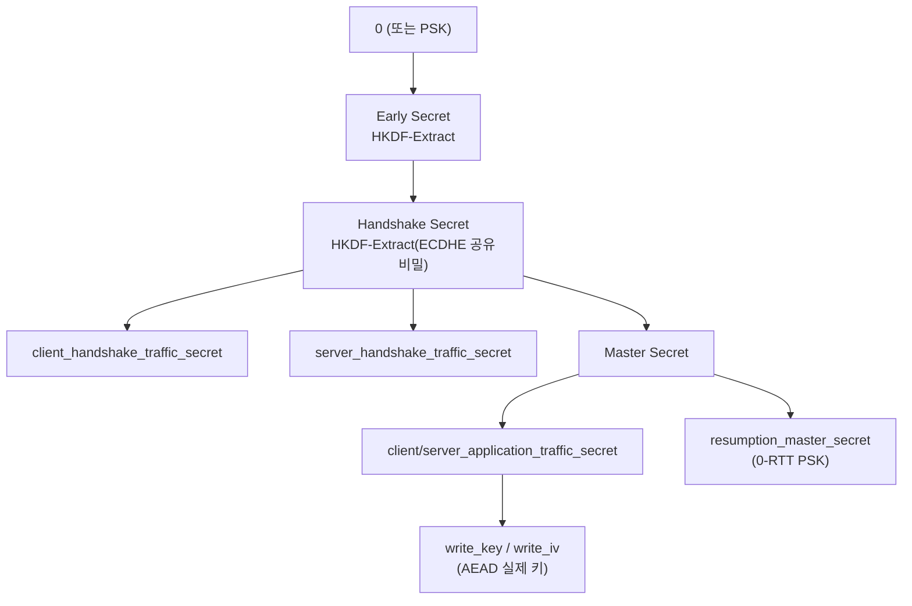

# TLS와 전송 구간 암호화 (TLS & Transport Security)

저장 데이터 암호화(at rest)와 구분되는 전송 구간 암호화를 다룹니다. TLS 1.3 키 스케줄 내부, mTLS를 이용한 MSA 내부 인증, Spring Boot 적용과 인증서 운영까지 정리합니다.

## 목차
- [1. 핵심 개념 (What)](#1-핵심-개념-what)
- [2. 왜 알아야 하는가 (Why)](#2-왜-알아야-하는가-why)
- [3. 내부 구현 분석 (How)](#3-내부-구현-분석-how)
- [4. 실전 예제](#4-실전-예제)
- [5. 정리](#5-정리)

---

## 1. 핵심 개념 (What)

### 1.1 at rest vs in transit — 서로를 대체하지 못한다

| 구분 | Encryption at Rest | Encryption in Transit |
|------|-------------------|----------------------|
| 대상 | 디스크에 저장된 데이터 | 네트워크를 흐르는 데이터 |
| 기술 | AES-GCM + KMS, TDE | TLS 1.3, mTLS |
| 막는 위협 | 디스크 탈취, DB 덤프, 백업 유출 | 도청(sniffing), MITM, 세션 하이재킹 |
| 키 수명 | 수개월~수년 | **연결 단위 (수 분)** |
| 실패 시 | 과거 데이터 전량 노출 | 해당 세션 노출 |

둘은 서로를 대체하지 않습니다. TLS로 아무리 잘 보호해도 DB에 평문으로 쌓이면 덤프 한 번에 끝나고, DB를 암호화해도 HTTP로 주고받으면 중간에서 그대로 읽힙니다. **애플리케이션은 두 축을 모두 채워야 합니다.**

TLS 기초(HTTP vs HTTPS, 핸드셰이크 개요, cipher suite 문자열 구조, PKI 기본)는 [../../network/10-http-vs-https.md](../../network/10-http-vs-https.md) 에 정리되어 있습니다. 이 문서는 그 위에서 **키가 실제로 어떻게 파생되는가, mTLS를 어떻게 운영하는가, Spring에서 무엇을 잘못 설정하는가**에 집중합니다.

### 1.2 Cipher Suite 문자열 다시 읽기

`TLS_ECDHE_RSA_WITH_AES_256_GCM_SHA384` 는 순서대로 키 교환(`ECDHE`) · 서버 인증 서명(`RSA`) · 대칭 암호와 AEAD 모드(`AES_256_GCM`) · 키 파생 해시(`SHA384`)를 뜻합니다. 실무적으로 중요한 것은 **각 부분이 실패했을 때 무엇을 잃는가** 입니다.

| 부분 | 역할 | 이 부분이 약하면 |
|------|------|----------------|
| `ECDHE` | 세션 키 합의 | **전방 비밀성 상실** — 과거 트래픽까지 소급 복호화 |
| `RSA` | 서버 신원 증명 | 서버 위장(MITM) 가능 |
| `AES_256_GCM` | 데이터 기밀성 + 무결성 | 도청 또는 변조 탐지 실패 |
| `SHA384` | 키 파생·핸드셰이크 무결성 | 다운그레이드/변조 탐지 실패 |

TLS 1.3에서는 문자열이 `TLS_AES_256_GCM_SHA384` 처럼 **대칭 암호와 해시만** 남습니다. 키 교환은 항상 (EC)DHE이고 서명 알고리즘은 별도 확장으로 협상하기 때문입니다. 즉 TLS 1.3은 **전방 비밀성이 없는 조합을 프로토콜 차원에서 제거**했습니다.

### 1.3 전방 비밀성 (Forward Secrecy)

```
[RSA 키 교환 — TLS 1.2 이하]
클라이언트 → RSA_공개키(pre-master secret) → 서버   (서버 개인키로만 복호화)
문제: 트래픽을 수년간 저장해 두었다가 나중에 서버 개인키를 입수하면
      → 저장된 모든 세션이 소급 복호화된다.

[ECDHE 키 교환]
클라이언트 (a, aG) ←→ 서버 (b, bG)
공유 비밀 = abG  ← 양측이 각자 계산, 네트워크에 흐르지 않음
a, b는 세션 종료 시 폐기 → 서버 개인키를 얻어도 복원 불가
```

여기서 서버의 장기 개인키(RSA/ECDSA)는 **키 교환이 아니라 "지금 응답하는 것이 진짜 서버"임을 서명으로 증명하는 용도**로만 쓰입니다. 역할이 분리되었기 때문에 개인키 유출이 과거 세션으로 번지지 않습니다. 이것이 "**Harvest Now, Decrypt Later**"(지금 수집, 나중에 복호화) 공격 모델에 대한 방어이며, 양자 컴퓨팅 논의에서도 핵심 쟁점입니다.

---

## 2. 왜 알아야 하는가 (Why)

### 2.1 실무 사고 사례

**사례 1 — `TrustAllX509TrustManager` 프로덕션 유입.** 개발 중 자체 서명 인증서 때문에 `SSLHandshakeException` 이 나자 검색으로 찾은 코드를 붙여넣고, 그대로 배포됩니다.

```kotlin
val trustAll = object : X509TrustManager {   // 안티패턴 — TLS의 인증 기능을 완전히 제거한다
    override fun checkServerTrusted(chain: Array<X509Certificate>, authType: String) {}  // 검증 안 함
    override fun checkClientTrusted(chain: Array<X509Certificate>, authType: String) {}
    override fun getAcceptedIssuers(): Array<X509Certificate> = arrayOf()
}
```

무엇을 잃는가: **암호화는 여전히 동작하므로 겉으로는 아무 문제가 없어 보입니다.** 잃는 것은 **인증(authentication)** 이고, 그 결과 중간자가 자기 인증서를 제시해도 통과하며 트래픽을 복호화·변조한 뒤 중계할 수 있습니다. 즉 **"HTTPS를 쓰는데 HTTP보다 위험한"** 상태가 됩니다 — 개발자가 안전하다고 믿기 때문입니다.

`HostnameVerifier { _, _ -> true }` 도 동일한 부류입니다. 체인은 검증하지만 **도메인 일치를 확인하지 않으므로**, 공격자가 정당하게 발급받은 `evil.com` 인증서로 `api.mybank.com` 을 위장할 수 있습니다.

**사례 2 — 인증서 만료로 전면 장애.** 예고된 장애인데도 가장 자주 발생합니다. 만료 시점에 **모든 클라이언트가 동시에** 연결 실패하며, 내부 서비스 간 인증서라면 장애가 연쇄합니다. 갱신 자동화보다 **만료 임박 알림**이 먼저입니다.

**사례 3 — LB 뒤 내부 구간 평문** (`Client --TLS--> ALB --HTTP(평문)--> ECS Task`). "HTTPS 적용 완료"로 보고되지만, VPC 내부 트래픽이 평문입니다. 같은 VPC의 침해된 인스턴스, 잘못 설정된 미러링 세션, 로그 수집 사이드카가 전부 평문을 봅니다. 개인정보를 다루면 이 구간도 암호화 대상입니다.

### 2.2 규제·컴플라이언스 관점

- PCI-DSS는 카드 데이터 전송 시 TLS 1.2 이상을 요구하며, 강한 암호화와 **신뢰할 수 있는 키/인증서만 허용**을 명시합니다.
- 개인정보보호법 관련 고시는 개인정보 송·수신 시 **안전한 전송 구간 암호화**를 요구합니다.
- 내부망이라는 이유로 예외를 두는 관행은 **제로 트러스트(Zero Trust)** 모델에서 인정되지 않습니다.

---

## 3. 내부 구현 분석 (How)

### 3.1 TLS 1.3 키 스케줄 — 세션 키는 어떻게 만들어지는가

핸드셰이크 메시지 흐름은 [network/10](../../network/10-http-vs-https.md) 에 있으므로, 여기서는 **그 결과로 어떤 키들이 생기는지**를 봅니다. TLS 1.3은 HKDF(HMAC-based Key Derivation Function)로 계층적 키 스케줄을 구성합니다.



읽어야 할 포인트:

- **방향별로 키가 다릅니다.** 클라이언트→서버와 서버→클라이언트가 서로 다른 키/IV를 씁니다. 한 방향 키가 노출돼도 반대 방향은 유지됩니다.
- **핸드셰이크 트래픽 키가 애플리케이션 키보다 먼저 만들어집니다.** 그래서 TLS 1.3은 `Certificate` 부터 **암호화해서 전송**합니다(TLS 1.2는 평문). 다만 SNI는 여전히 평문이며, ECH(Encrypted Client Hello)가 이를 해결하려는 확장입니다.
- **모든 파생에 transcript hash(지금까지의 핸드셰이크 메시지 해시)가 섞입니다.** 중간에 한 바이트라도 변조되면 양측의 키가 달라져 `Finished` 검증이 실패합니다. 이것이 **다운그레이드 공격 방어**의 핵심입니다.
- **resumption secret**에서 0-RTT용 PSK가 나옵니다. 0-RTT 데이터는 전방 비밀성이 없고 재전송(replay) 가능하므로, **멱등하지 않은 요청(POST 결제 등)에는 절대 허용하면 안 됩니다.**

### 3.2 인증서 체인 검증에서 실제로 확인하는 것

체인은 `End-Entity(api.example.com) → Intermediate CA → Root CA(트러스트 스토어)` 구조이며, JVM은 `PKIXValidator` 로 다음을 순서대로 확인합니다.

1. **서명 검증**: 각 인증서가 상위 인증서의 개인키로 서명되었는가
2. **체인 종결**: 최상위가 트러스트 스토어(`$JAVA_HOME/lib/security/cacerts`)의 Root CA에 도달하는가
3. **유효 기간**: `notBefore` ≤ 현재 ≤ `notAfter`
4. **`basicConstraints`**: 중간 인증서가 `CA:TRUE` 인가 (아니면 하위 서명 권한 없음)
5. **`keyUsage` / `extendedKeyUsage`**: `serverAuth`/`clientAuth` 목적에 맞는가
6. **호스트명 일치**: SAN(Subject Alternative Name)에 요청 호스트가 있는가 — **CN은 더 이상 사용되지 않습니다**
7. **폐기 확인**: CRL/OCSP (JVM 기본은 비활성, 명시 활성화 필요)

**자체 서명 인증서 문제**: 자기 자신이 자기를 서명하므로 2번(체인 종결)에서 실패합니다. 올바른 해법은 검증을 끄는 것이 아니라 **해당 인증서(또는 사설 CA)를 트러스트 스토어에 추가**하는 것입니다.

```bash
# 사설 CA를 애플리케이션 전용 트러스트 스토어에 추가 (cacerts 원본은 건드리지 않는다)
keytool -importcert -alias internal-ca -file internal-ca.crt \
        -keystore app-truststore.p12 -storetype PKCS12 -storepass "$TRUSTSTORE_PASSWORD"
```

### 3.3 mTLS — MSA 내부 인증 패턴

일반 TLS가 **클라이언트의 서버 검증**만 하는 데 비해, mTLS는 **서버의 클라이언트 검증**을 추가합니다.

```
일반 TLS: ClientHello → ← Certificate                        → Finished
mTLS    : ClientHello → ← Certificate + CertificateRequest
                       → Certificate + CertificateVerify(개인키 소유 증명) + Finished
```

MSA에서 mTLS가 갖는 의미: **서비스 신원(identity)이 인증서 자체**가 됩니다. JWT나 API Key와 비교하면,

| 방식 | 신원 근거 | 탈취 위험 | 회전 |
|------|----------|----------|------|
| API Key | 공유 비밀 문자열 | 로그·설정 유출로 즉시 도용 | 수동 |
| 서비스 JWT | 서명된 토큰 | 토큰 탈취 시 만료까지 도용 | 짧은 TTL |
| **mTLS** | **개인키 소유 증명** | 개인키가 네트워크에 흐르지 않음 | 자동(SPIFFE/메시) |

mTLS의 실무 난점은 암호학이 아니라 **인증서 수명 주기**입니다. 서비스 수십 개에 인증서를 수동 배포하면 만료 장애가 반드시 납니다. 그래서 실무에서는 세 갈래로 갑니다.

1. **서비스 메시**(Istio/Linkerd): 사이드카가 mTLS를 투명 처리하고 인증서를 자동 회전. 앱 코드 변경 없음.
2. **SPIFFE/SPIRE**: 워크로드 신원(SVID)을 수명 수 시간으로 자동 발급.
3. **애플리케이션 직접 구현**: 소규모에서만 현실적. 아래 4장 예제.

### 3.4 LB에서의 TLS 종료 판단

```
[A] 종료(Termination)    Client --TLS--> LB --HTTP--> App   구현 간단, 내부 평문
[B] 재암호화(Re-encrypt) Client --TLS--> LB --TLS--> App    L7 처리 + 내부 암호화. 실무 권장
[C] 통과(Passthrough)    Client -------TLS-------> App      E2E, LB는 L4만. WAF/라우팅 불가
```

판단 기준: 공개 웹 서비스에 개인정보가 없으면 **A**, 개인정보·결제 데이터를 다루면 **B**, 규제상 E2E가 요구되거나 클라이언트 인증서를 앱에서 직접 검증해야 하면 **C** 입니다. 단 WAF·경로 라우팅·헤더 조작이 필요하면 C는 선택지에서 빠집니다.

패턴 B에서 내부 구간은 사설 CA 인증서면 충분합니다. AWS ALB는 백엔드 인증서를 검증하지 않으므로(자체 서명도 허용), 운영 부담이 생각보다 작습니다.

---

## 4. 실전 예제

### 4.1 Spring Boot HTTPS 설정

```yaml
server:
  port: 8443
  ssl:
    enabled: true
    key-store: classpath:keystore.p12
    key-store-type: PKCS12
    key-store-password: ${KEYSTORE_PASSWORD}     # 절대 하드코딩하지 않는다
    key-alias: app
    enabled-protocols: TLSv1.3                   # 레거시 클라이언트가 있으면 TLSv1.2 추가
    ciphers: [TLS_AES_256_GCM_SHA384, TLS_AES_128_GCM_SHA256, TLS_CHACHA20_POLY1305_SHA256]
    # --- mTLS: 클라이언트 인증서 요구 ---
    client-auth: need                            # need(필수) | want(선택) | none
    trust-store: classpath:truststore.p12
    trust-store-type: PKCS12
    trust-store-password: ${TRUSTSTORE_PASSWORD}
```

`want` 와 `need` 의 차이는 운영에서 중요합니다. **점진적 도입 시 `want` 로 시작**해 인증서 없는 클라이언트를 로그로 파악한 뒤 `need` 로 전환합니다. 처음부터 `need` 로 켜면 누락된 클라이언트가 전부 즉시 실패합니다.

### 4.2 클라이언트 인증서 정보 활용

```kotlin
@RestController
class InternalController {
    private val allowedServices = setOf("order-service", "payment-service")

    /** mTLS로 접속한 상대 서비스의 신원을 인증서에서 추출 */
    @GetMapping("/internal/data")
    fun getData(request: HttpServletRequest): ResponseEntity<Data> {
        val certs = request.getAttribute("jakarta.servlet.request.X509Certificate")
            as? Array<X509Certificate>
            ?: return ResponseEntity.status(HttpStatus.UNAUTHORIZED).build()

        val clientCn = certs.first().subjectX500Principal.name
            .split(",").first { it.startsWith("CN=") }.removePrefix("CN=")

        // 인증(누구인가)은 TLS가 끝냈다. 여기서는 인가(무엇을 해도 되는가)만 판단한다.
        if (clientCn !in allowedServices) return ResponseEntity.status(HttpStatus.FORBIDDEN).build()
        return ResponseEntity.ok(loadData())
    }
}
```

### 4.3 RestClient / WebClient에 클라이언트 인증서 적용

```kotlin
@Configuration
class MutualTlsClientConfig {
    /** WebClient (Reactor Netty)에 클라이언트 인증서를 붙인다 */
    @Bean
    fun internalWebClient(
        @Value("\${app.mtls.keystore-path}") path: String,
        @Value("\${app.mtls.keystore-password}") password: String,
    ): WebClient {
        val keyStore = KeyStore.getInstance("PKCS12").apply {
            FileSystemResource(path).inputStream.use { load(it, password.toCharArray()) }
        }
        val kmf = KeyManagerFactory.getInstance(KeyManagerFactory.getDefaultAlgorithm())
            .apply { init(keyStore, password.toCharArray()) }

        // keyManager = 클라이언트 인증서 제시 / trustManager 미지정 = 시스템 기본 검증 유지
        val sslContext = SslContextBuilder.forClient().keyManager(kmf).protocols("TLSv1.3").build()
        val httpClient = HttpClient.create()
            .secure { it.sslContext(sslContext) }
            .responseTimeout(Duration.ofSeconds(3))

        return WebClient.builder().clientConnector(ReactorClientHttpConnector(httpClient)).build()
    }
}
```

> Spring Boot 3.1+ 에서는 **SSL Bundles** 로 이 보일러플레이트를 없앨 수 있습니다. `spring.ssl.bundle.jks.internal.*` (또는 `pem.*`)을 정의하고 `RestClient.Builder#apply(sslBundle)` / `WebClient` 커넥터에 주입하면, 인증서 파일 변경 시 **핫 리로드**까지 지원됩니다. 신규 프로젝트라면 SSL Bundles를 우선 검토하세요.

### 4.4 자체 서명 인증서를 "올바르게" 다루기

`TrustAll` 대신 해당 CA를 **추가로** 신뢰합니다. 주의할 함정: `KeyStore.load(null, null)` 로 만든 트러스트 스토어에 사설 CA만 넣으면 **공인 CA 검증이 통째로 사라집니다**(외부 API 호출이 전부 실패). 기본 검증을 유지하려면 두 TrustManager에 위임해야 합니다.

```kotlin
/** 시스템 기본 신뢰 + 사설 CA. 둘 다 실패해야 거부한다. */
class DelegatingTrustManager(caCertPath: String) : X509TrustManager {
    private val defaultTm = build(null)                    // JVM 기본 cacerts
    private val internalTm = build(KeyStore.getInstance(KeyStore.getDefaultType()).apply {
        load(null, null)
        setCertificateEntry("internal-ca", FileSystemResource(caCertPath).inputStream.use {
            CertificateFactory.getInstance("X.509").generateCertificate(it)
        })
    })

    override fun checkServerTrusted(chain: Array<X509Certificate>, authType: String) =
        try {
            defaultTm.checkServerTrusted(chain, authType)
        } catch (e: CertificateException) {
            internalTm.checkServerTrusted(chain, authType)   // 여기서도 실패하면 예외 전파 = 정상 거부
        }

    override fun checkClientTrusted(chain: Array<X509Certificate>, authType: String) =
        internalTm.checkClientTrusted(chain, authType)

    override fun getAcceptedIssuers() = defaultTm.acceptedIssuers + internalTm.acceptedIssuers

    private fun build(ks: KeyStore?): X509TrustManager =
        TrustManagerFactory.getInstance(TrustManagerFactory.getDefaultAlgorithm())
            .apply { init(ks) }
            .trustManagers.filterIsInstance<X509TrustManager>().first()
}
```

> **더 간단하고 안전한 대안**: 3.2의 `keytool` 로 **애플리케이션 전용 truststore 파일**을 만들어 공인 CA와 사설 CA를 함께 담고 `spring.ssl.bundle` 또는 `-Djavax.net.ssl.trustStore` 로 지정하는 방법입니다. 코드가 없어 실수 여지가 적고, 위 래퍼처럼 `X509ExtendedTrustManager` 의 호스트명 검증 경로를 잃을 위험도 없습니다. 실무에서는 이쪽을 먼저 검토하세요.

**금지 코드 목록** — 발견 시 머지 차단: `checkServerTrusted` 빈 구현, `HostnameVerifier { _, _ -> true }`, `NoopHostnameVerifier.INSTANCE`, 프로덕션의 `TrustSelfSignedStrategy()`, `-Dcom.sun.net.ssl.checkRevocation=false`. CI에 아래 정도의 검사만 넣어도 대부분 걸립니다.

```bash
grep -rn --include=*.kt --include=*.java -e "checkServerTrusted" \
  -e "NoopHostnameVerifier" -e "TrustAllStrategy" src/main \
  && echo "TLS 검증 우회 코드 발견" && exit 1
```

### 4.5 인증서 만료 모니터링

만료는 **자동 갱신보다 알림이 먼저**입니다 — 갱신 자동화도 실패할 수 있기 때문입니다.

```kotlin
@Component
class CertificateExpiryMonitor(
    private val meterRegistry: MeterRegistry,
    @Value("\${app.monitor.endpoints}") private val endpoints: List<String>,
) {
    private val log = LoggerFactory.getLogger(javaClass)

    /** 만료까지 남은 일수를 게이지로 노출 → Prometheus 알림 룰로 연결 */
    @Scheduled(cron = "0 0 9 * * *")
    fun checkAll() = endpoints.forEach { host ->
        runCatching { daysUntilExpiry(host) }
            .onSuccess { days ->
                meterRegistry.gauge("tls.cert.days_until_expiry", listOf(Tag.of("host", host)), days)
                if (days < 14) log.error("인증서 만료 임박: host={} days={}", host, days)
            }
            .onFailure { log.error("인증서 확인 실패: host={}", host, it) }
    }

    private fun daysUntilExpiry(host: String): Double {
        val (h, p) = host.split(":").let { it[0] to (it.getOrNull(1)?.toInt() ?: 443) }
        (SSLSocketFactory.getDefault().createSocket(h, p) as SSLSocket).use { socket ->
            socket.startHandshake()
            val cert = socket.session.peerCertificates.first() as X509Certificate
            return Duration.between(Instant.now(), cert.notAfter.toInstant()).toDays().toDouble()
        }
    }
}
```

Prometheus 알림 룰은 `tls_cert_days_until_expiry < 21` 을 warning, `< 7` 을 critical로 두면 충분합니다.

### 4.6 HSTS

```kotlin
@Bean
fun filterChain(http: HttpSecurity): SecurityFilterChain = http
    .headers { h ->
        h.httpStrictTransportSecurity {
            it.includeSubDomains(true).maxAgeInSeconds(31_536_000).preload(true)   // 1년
        }
    }
    .requiresChannel { it.anyRequest().requiresSecure() }
    .build()
```

> **HSTS 도입 주의**: `max-age` 를 크게 설정하면 브라우저가 해당 기간 동안 **HTTP 접속을 아예 거부**합니다. HTTPS 설정에 문제가 생겨도 되돌릴 수 없으므로, `max-age=300` 같은 짧은 값으로 시작해 안정성을 확인한 뒤 1년으로 올립니다. `preload` 목록 등재는 **제거에 수개월이 걸리므로** 도메인 전략이 확정된 뒤에 신청하세요.

### 4.7 Let's Encrypt 자동 갱신

`certbot renew` 를 cron으로 12시간마다 돌리면 만료 30일 이내인 인증서만 갱신되고, 성공 시 `--deploy-hook` 이 실행됩니다. 훅에서 PEM을 애플리케이션이 읽는 형식으로 변환하고 리로드합니다.

```bash
#!/usr/bin/env bash
# /etc/letsencrypt/renewal-hooks/deploy/rebuild-keystore.sh
set -euo pipefail
DOMAIN="api.example.com"
openssl pkcs12 -export -name app \
  -in "/etc/letsencrypt/live/$DOMAIN/fullchain.pem" \
  -inkey "/etc/letsencrypt/live/$DOMAIN/privkey.pem" \
  -out /opt/app/keystore.p12 -passout "pass:$KEYSTORE_PASSWORD"
chown app:app /opt/app/keystore.p12 && chmod 600 /opt/app/keystore.p12
systemctl reload app     # SSL Bundle 핫 리로드를 쓰면 재시작 불필요
```

갱신 실패를 감지하지 못하는 것이 실제 장애 원인이므로, 4.5의 만료 모니터링과 **반드시 함께** 운영합니다.

---

## 5. 정리

| 주제 | 핵심 | 실무 판단 |
|------|------|----------|
| **at rest vs in transit** | 서로 대체 불가 | 둘 다 필수 |
| **TLS 버전** | 1.3 권장, 1.2 하한 | 1.0/1.1 비활성화 |
| **키 교환** | (EC)DHE 필수 | RSA 키 교환 금지 (FS 없음) |
| **전방 비밀성** | 세션키가 장기키와 독립 | Harvest-Now-Decrypt-Later 방어 |
| **키 스케줄** | HKDF + transcript hash | 방향별 키 분리, 다운그레이드 방어 |
| **0-RTT** | 재전송 가능, FS 없음 | 멱등 요청만 허용 |
| **자체 서명** | 검증 우회가 아니라 CA 추가 | 전용 truststore |
| **mTLS** | 신원 = 개인키 소유 증명 | 도입은 `want` → `need` 순 |
| **인증서 수명주기** | 자동 회전이 핵심 난점 | 규모 크면 서비스 메시/SPIFFE |
| **LB TLS** | 종료/재암호화/통과 | 개인정보 취급 시 **재암호화** |
| **HSTS** | 되돌리기 어려움 | 짧은 max-age부터 단계적 |
| **인증서 만료** | 예고된 전면 장애 | 갱신 자동화 + 만료 메트릭 알림 |

**안티패턴 체크리스트**

- [ ] `checkServerTrusted` 빈 구현 (`TrustAllX509TrustManager`)
- [ ] `HostnameVerifier { _, _ -> true }` / `NoopHostnameVerifier`
- [ ] TLS 1.0/1.1 또는 RSA 키 교환 cipher suite 허용
- [ ] 결제·주문 API에 0-RTT 허용
- [ ] LB에서 종료 후 내부 구간 평문으로 개인정보 전송
- [ ] 키스토어 비밀번호를 `application.yml` 에 하드코딩
- [ ] 인증서 만료 모니터링 없이 자동 갱신만 신뢰
- [ ] 시스템 `cacerts` 원본에 사설 CA를 직접 추가 (JVM 업그레이드 시 소실)
- [ ] mTLS를 처음부터 `client-auth: need` 로 전면 적용

> **핵심 포인트**: TLS는 "켜면 안전한 스위치"가 아니라 **암호화(confidentiality)와 인증(authentication)이라는 두 기능의 조합**이며, 실무 사고는 거의 전부 두 번째 것을 꺼버리는 데서 발생한다. `TrustAllX509TrustManager` 는 암호화를 유지한 채 인증만 제거하기 때문에 겉으로는 정상 동작하는 것처럼 보이고, 그래서 가장 위험하다. 자체 서명 인증서 문제의 정답은 검증을 끄는 것이 아니라 해당 CA를 전용 truststore에 추가하는 것이다. 운영 관점에서는 두 가지가 실질적 리스크다 — 인증서 만료(갱신 자동화보다 **만료 알림**이 먼저다)와 LB 뒤 내부 구간의 평문 전송이다. 그리고 mTLS는 암호학적으로는 단순하지만 인증서 수명 주기 관리가 전부이므로, 서비스가 수십 개 규모를 넘으면 직접 구현보다 서비스 메시나 SPIFFE 같은 자동 발급·회전 체계를 선택하는 편이 낫다.

---

## 관련 문서

```
security/01-backend-security-fundamentals.md  (기존)
security/02-jwt-jwk-oauth-comparison.md       (기존)
security/main/01-encryption-fundamentals.md ~ 08-asymmetric-crypto-and-signature.md
security/advanced/01-key-management-envelope-encryption.md
security/advanced/02-database-field-encryption.md
security/advanced/03-spring-boot-encryption-practice.md
security/advanced/04-tls-and-transport-security.md            ← 현재 문서
```

- [../../network/10-http-vs-https.md](../../network/10-http-vs-https.md) — TLS 핸드셰이크 흐름, cipher suite 구조, PKI 기초 (**선행 문서**)
- [../main/08-asymmetric-crypto-and-signature.md](../main/08-asymmetric-crypto-and-signature.md) — ECDHE 키 교환과 인증서 서명의 배경
- [../main/06-aead-authenticated-encryption.md](../main/06-aead-authenticated-encryption.md) — TLS 레코드가 쓰는 AEAD
- [01-key-management-envelope-encryption.md](01-key-management-envelope-encryption.md) — 키스토어 비밀번호도 시크릿이다
- [03-spring-boot-encryption-practice.md](03-spring-boot-encryption-practice.md) — 시크릿 주입, Config Server 보호
- [../01-backend-security-fundamentals.md](../01-backend-security-fundamentals.md) — 보안 헤더 전반

---
*참고: Java 17 / Spring Boot 3.x 기준*
