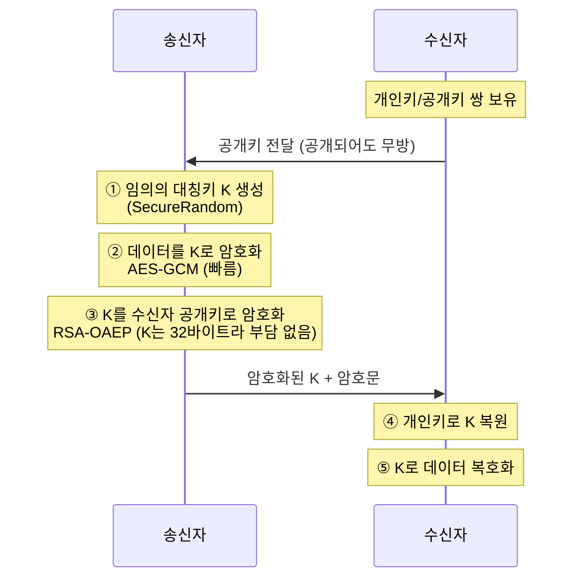

# 암호화 기초: 대칭키와 비대칭키

암호화가 실제로 무엇을 방어하는지(위협 모델), 대칭키와 비대칭키의 성능 차이가 왜 발생하는지, 그리고 실무에서 왜 둘을 섞어 쓰는지를 원리 수준에서 정리한다. 인코딩·해싱·암호화를 혼동해서 생기는 사고가 현업에서 가장 흔한 암호화 사고다.

## 목차
- [1. 핵심 개념 (What)](#1-핵심-개념-what)
- [2. 왜 알아야 하는가 (Why)](#2-왜-알아야-하는가-why)
- [3. 내부 구현 분석 (How)](#3-내부-구현-분석-how)
- [4. 실전 예제](#4-실전-예제)
- [5. 정리](#5-정리)

---

## 1. 핵심 개념 (What)

### 1.1 용어부터 정확히

암호학 문서를 읽을 때 용어가 흔들리면 논의 자체가 무너진다. 최소한 이 다섯 개는 정확하게 쓰자.

| 용어 | 정의 | 실무에서의 형태 |
|------|------|----------------|
| 평문(plaintext) | 암호화 대상 원본 데이터 | `byte[]`, `String`의 UTF-8 바이트 |
| 암호문(ciphertext) | 암호화 결과. 키 없이는 의미 없는 바이트열 | `byte[]`, DB 저장 시 Base64 문자열 |
| 키(key) | 암복호화에 쓰이는 비밀 값 | `SecretKey`(대칭), `KeyPair`(비대칭) |
| 블록 암호(block cipher) | 고정 크기 블록 단위로 변환하는 암호 | AES(16바이트 블록) |
| 스트림 암호(stream cipher) | 키스트림을 생성해 평문과 XOR | ChaCha20, AES-CTR |

여기에 하나 더. **암호학적 알고리즘은 공개되어 있고, 비밀은 오직 키뿐이다.** 이것을 케르크호프스의 원칙(Kerckhoffs's principle)이라 한다. "우리 회사만 아는 자체 암호화 로직"은 보안이 아니라 부채다. 알고리즘이 유출되는 순간 전부 무너지고, 검증받지 못한 알고리즘은 이미 깨져 있을 확률이 높다.

### 1.2 암호화가 방어하는 위협 모델

암호화를 "해커가 못 보게 하는 것"으로만 이해하면 절반만 아는 것이다. 위협은 세 가지로 나뉜다.

```
평문 전송 시 공격자가 할 수 있는 일

  [클라이언트] ---- "잔액 10000원" ----> [서버]
                      ↑
                 공격자(중간자)
                      │
     ┌────────────────┼────────────────┐
     │                │                │
  ① 도청           ② 변조           ③ 위장
 (Eavesdrop)      (Tamper)        (Impersonate)
  내용을 읽음    "10000"→"99999"   서버인 척 응답
     │                │                │
     ↓                ↓                ↓
  기밀성 침해      무결성 침해      인증 침해
```

| 위협 | 공격자 행위 | 방어 속성 | 방어 수단 |
|------|-----------|----------|----------|
| 도청(eavesdropping) | 오가는 데이터를 읽음 | 기밀성(Confidentiality) | 암호화 |
| 변조(tampering) | 데이터를 바꿔치기 | 무결성(Integrity) | MAC, 해시, 서명 |
| 위장(impersonation) | 상대방인 척 행세 | 인증(Authentication) | 인증서, 서명, MAC |

**여기서 가장 중요한 오해를 짚고 가자. 암호화는 기밀성만 보장한다. 무결성은 보장하지 않는다.**

AES-CBC로 암호화된 데이터를 공격자가 비트 단위로 뒤집어도, 복호화 자체는 "성공"한다. 이상한 평문이 나올 뿐이다. 그리고 그 "이상함"을 애플리케이션이 감지하지 못하면 공격이 성립한다. 이 틈을 노리는 것이 패딩 오라클 공격이고, 이를 원천 차단하기 위해 등장한 것이 AEAD(GCM 같은 인증 암호화)다.

> 면접 팁: "암호화하면 데이터가 변조되지 않나요?"라는 질문에 "아니요, 암호화는 기밀성만 보장합니다. 무결성까지 원하면 GCM 같은 AEAD 모드를 써야 합니다"라고 답할 수 있으면 기초가 잡혀 있다는 신호다.

### 1.3 대칭키(Symmetric Key)

암호화 키와 복호화 키가 **같은** 방식이다.

```
        키 K                      키 K
         │                         │
         ↓                         ↓
평문 ──[암호화]──> 암호문 ──[복호화]──> 평문
```

- 대표 알고리즘: AES, ChaCha20
- 장점: 매우 빠름. 데이터 길이에 비례해 선형 처리
- 단점: **키를 어떻게 상대에게 안전하게 전달할 것인가** (키 분배 문제)

키 분배 문제는 생각보다 심각하다. N명이 서로 통신하려면 키가 N(N-1)/2개 필요하다. 100명이면 4,950개다.

### 1.4 비대칭키(Asymmetric Key / Public Key)

공개키(public key)와 개인키(private key)가 쌍을 이룬다. 한쪽으로 암호화하면 다른 쪽으로만 풀린다.

```
용도 1: 기밀성 (수신자에게 비밀 전달)
  공개키(수신자)로 암호화 ──> 개인키(수신자)로만 복호화

용도 2: 인증/부인방지 (송신자 증명 = 전자서명)
  개인키(송신자)로 서명 ──> 공개키(송신자)로 누구나 검증
```

- 대표 알고리즘: RSA, ECDSA/ECDH(타원곡선), Ed25519
- 장점: 공개키는 공개해도 되므로 키 분배 문제가 해결됨
- 단점: **느리다.** 그리고 처리 가능한 데이터 크기에 제한이 있다

RSA-2048은 한 번에 최대 245바이트(OAEP 패딩 기준)밖에 암호화하지 못한다. 1MB 파일을 RSA로 암호화한다는 발상 자체가 성립하지 않는다.

---

## 2. 왜 알아야 하는가 (Why)

### 2.1 속도 차이의 근본 원인

"대칭키가 빠르고 비대칭키가 느리다"는 암기 사항이 아니라 **연산의 종류가 다르기 때문**이다.

| 구분 | 대칭키(AES) | 비대칭키(RSA) |
|------|------------|--------------|
| 기반 연산 | XOR, 바이트 치환(테이블 룩업), 시프트 | 거대 정수의 모듈러 거듭제곱 |
| 수학적 근거 | 혼돈(confusion)과 확산(diffusion)의 반복 | 소인수분해 / 이산로그의 계산 난이도 |
| 피연산자 크기 | 128비트 블록 | 2048~4096비트 정수 |
| 하드웨어 지원 | AES-NI (CPU 전용 명령어) | 없음(범용 정수 연산) |

핵심은 두 가지다.

**첫째, 연산의 무게 자체가 다르다.** AES는 XOR과 테이블 조회 같은 CPU가 가장 잘하는 연산을 반복한다. 반면 RSA는 2048비트 정수를 2048비트 지수로 거듭제곱한다. 이는 수천 번의 곱셈과 나머지 연산을 요구한다.

**둘째, 하드웨어 가속의 유무다.** 2010년 Intel Westmere부터 CPU에 AES-NI 명령어가 들어갔다. `AESENC` 한 명령어가 AES 라운드 하나를 통째로 처리한다. Java의 HotSpot JIT은 이를 intrinsic으로 자동 사용한다. 그래서 AES는 소프트웨어 구현 대비 5~10배 빨라졌지만, RSA는 그런 가속을 받지 못한다.

실측 감각으로는 대략 이렇다(단일 코어 기준, 환경에 따라 다름).

```
AES-256-GCM 암호화 :  약 1~3 GB/s   (AES-NI 사용 시)
RSA-2048 암호화    :  약 10,000 ops/s  (245바이트씩 → 약 2.4 MB/s)
RSA-2048 복호화    :  약 500 ops/s     (개인키 연산이 훨씬 무겁다)
```

**세 자릿수 이상의 차이다.** 이 숫자를 알고 있으면 "왜 하이브리드를 쓰는가"는 자동으로 답이 나온다.

### 2.2 하이브리드 암호화가 실무 표준인 이유

두 방식의 단점을 서로가 메워준다.

- 대칭키의 문제 = 키 분배 → 비대칭키로 해결
- 비대칭키의 문제 = 느림 + 크기 제한 → 대칭키로 해결

그래서 실무는 **비대칭키로 대칭키를 전달하고, 실제 데이터는 대칭키로 암호화**한다.



이 패턴은 이름만 다를 뿐 도처에 있다.

| 적용 사례 | 대칭키 전달 방식 | 데이터 암호화 |
|----------|----------------|--------------|
| TLS 1.3 | ECDHE 키 합의 + 인증서 서명 | AES-GCM / ChaCha20-Poly1305 |
| PGP/GPG 이메일 | 세션키를 수신자 공개키로 암호화 | AES-256 |
| AWS KMS 봉투 암호화 | 데이터 키를 KMS 마스터 키로 암호화 | AES-256-GCM |
| JWE (JSON Web Encryption) | CEK를 `alg`로 암호화 | `enc`로 지정된 AES-GCM 등 |

여기서 대칭키를 **세션키(session key)** 또는 **데이터 키(data key)**라 부른다. 이 구조를 클라우드 맥락으로 확장한 것이 봉투 암호화(envelope encryption)이며, [키 관리와 봉투 암호화](../advanced/01-key-management-envelope-encryption.md)에서 자세히 다룬다.

### 2.3 인코딩 ≠ 암호화 ≠ 해싱

**현업에서 가장 흔한 암호화 사고는 알고리즘 선택 실수가 아니라 이 셋을 혼동하는 것이다.**

| 구분 | 목적 | 키 필요? | 되돌릴 수 있나? | 예시 |
|------|------|---------|---------------|------|
| 인코딩(encoding) | 데이터 표현 형식 변환 | 아니오 | **예, 누구나** | Base64, URL 인코딩, UTF-8 |
| 암호화(encryption) | 기밀성 보장 | **예** | 예, 키가 있어야 | AES, RSA |
| 해싱(hashing) | 무결성/식별, 비밀번호 저장 | 아니오(또는 salt) | **아니오, 원리적으로** | SHA-256, bcrypt, Argon2 |

**Base64는 암호화가 아니다.** 이건 바이너리를 ASCII 텍스트로 옮기기 위한 표현 방식일 뿐이고, 키가 없으므로 누구나 즉시 되돌린다.

```bash
$ echo "cGFzc3dvcmQxMjMh" | base64 -d
password123!
```

실제 사고 사례들이다.

- **주민등록번호를 Base64로 "암호화"해 DB에 저장** — 국내 개인정보보호법 위반으로 과징금이 부과된 사례가 반복적으로 나온다. Base64는 암호화 조치로 인정되지 않는다.
- **JWT payload에 개인정보 저장** — JWT의 payload는 Base64URL 인코딩일 뿐 암호화가 아니다. jwt.io에 붙여넣으면 전부 보인다. 자세한 내용은 [JWT/JWK/OAuth 비교](../02-jwt-jwk-oauth-comparison.md) 참고.
- **비밀번호를 AES로 암호화해 저장** — 복호화가 가능하다는 것 자체가 문제다. DB와 키가 함께 유출되면 전 사용자 비밀번호가 평문으로 노출된다. 비밀번호는 암호화가 아니라 **해싱**해야 한다. 자세한 내용은 [해싱과 비밀번호 저장](./07-hashing-and-password-storage.md) 참고.

구분 기준은 단순한 질문 두 개로 충분하다.

```
Q1. 키가 필요한가?
    아니오 → 인코딩 또는 해싱
    예     → 암호화

Q2. 원본으로 되돌려야 하는가?
    예     → 암호화 (주민번호, 계좌번호, 전화번호)
    아니오 → 해싱   (비밀번호, 무결성 검증용 체크섬)
```

---

## 3. 내부 구현 분석 (How)

### 3.1 대칭키는 왜 안전한가 — 혼돈과 확산

섀넌(Claude Shannon)이 정의한 두 가지 원리가 현대 대칭키 암호의 뼈대다.

- **혼돈(confusion)**: 키와 암호문의 관계를 복잡하게 만든다. 암호문을 보고 키를 역추적할 수 없게. → AES의 SubBytes(S-Box) 단계
- **확산(diffusion)**: 평문 한 비트가 바뀌면 암호문의 절반 정도가 바뀌게 한다(눈사태 효과, avalanche effect). → AES의 ShiftRows + MixColumns 단계

이 두 연산을 여러 라운드 반복하면 통계적 분석이 불가능해진다. 구체적인 라운드 구조는 [AES 알고리즘 구조](./02-aes-algorithm-structure.md)에서 다룬다.

### 3.2 비대칭키는 왜 안전한가 — 일방향 함수

RSA의 안전성은 이 비대칭성에 기댄다.

```
쉬움  : 소수 p, q를 곱해 n = p × q 를 구한다        (밀리초)
어려움: n만 보고 p, q를 역산한다 (소인수분해)        (2048비트면 현존 기술로 불가능)
```

ECC(타원곡선)는 이산로그 문제에 기댄다. 곡선 위의 점 G를 k번 더한 결과 P는 쉽게 구하지만, G와 P만으로 k를 구하는 것은 어렵다. 같은 보안 강도를 훨씬 짧은 키로 달성한다.

| 보안 강도 | RSA 키 길이 | ECC 키 길이 |
|----------|------------|------------|
| 112비트 | 2048 | 224 |
| 128비트 | 3072 | 256 |
| 256비트 | 15360 | 512 |

RSA-3072와 ECC-256이 같은 강도인데 키 길이는 12배 차이다. 그래서 TLS 1.3, 모바일, IoT는 ECC로 갔다. 상세는 [비대칭 암호와 전자서명](./08-asymmetric-crypto-and-signature.md) 참고.

### 3.3 Java에서의 구조 — JCA/JCE

Java의 암호화는 **JCA(Java Cryptography Architecture)** 라는 제공자(Provider) 기반 구조 위에 있다.

```
애플리케이션 코드
      │
      │  Cipher.getInstance("AES/GCM/NoPadding")
      ↓
  JCA 표준 API  (javax.crypto.Cipher, java.security.*)
      │
      │  등록된 Provider를 우선순위대로 탐색
      ↓
  ┌───────────┬──────────────┬──────────────┐
  │ SunJCE    │ SunEC        │ BouncyCastle │  ← Provider 구현체
  └───────────┴──────────────┴──────────────┘
      │
      ↓
  네이티브 최적화 (AES-NI intrinsic 등)
```

애플리케이션은 인터페이스만 알고, 실제 구현은 Provider가 제공한다. 그래서 코드 변경 없이 Provider를 교체할 수 있다(예: FIPS 인증이 필요하면 BouncyCastle FIPS Provider로 교체).

```java
// 등록된 Provider 확인 — 디버깅 시 유용하다
for (Provider provider : Security.getProviders()) {
    System.out.println(provider.getName() + " v" + provider.getVersionStr());
}
// SunJCE v17, SunEC v17, SunRsaSign v17, ...
```

> 참고: Java 9 이후 JCE 무제한 강도 정책(Unlimited Strength Policy)이 기본 활성화되어, 예전처럼 policy jar를 따로 받을 필요가 없다. Java 8u161 이상도 마찬가지다. 레거시 문서에서 "policy 파일을 교체하라"는 안내를 보면 시대가 지난 내용이다.

---

## 4. 실전 예제

### 4.1 하이브리드 암호화 구현

RSA로 AES 키를 감싸고, AES-GCM으로 실제 데이터를 암호화하는 전체 흐름이다.

```java
package com.example.crypto;

import javax.crypto.Cipher;
import javax.crypto.KeyGenerator;
import javax.crypto.SecretKey;
import javax.crypto.spec.GCMParameterSpec;
import javax.crypto.spec.SecretKeySpec;
import java.nio.ByteBuffer;
import java.security.*;

/**
 * 하이브리드 암호화: 데이터는 AES-GCM, 데이터 키는 RSA-OAEP로 보호.
 * TLS, PGP, AWS KMS가 모두 이 구조를 따른다.
 */
public class HybridEncryptor {

    private static final String DATA_CIPHER = "AES/GCM/NoPadding";
    private static final String KEY_CIPHER  = "RSA/ECB/OAEPWithSHA-256AndMGF1Padding";
    private static final int GCM_IV_BYTES  = 12;   // GCM 권장 96비트
    private static final int GCM_TAG_BITS  = 128;

    /** 봉투 구조: [암호화된 데이터 키][IV][암호문 + 인증 태그] */
    public byte[] encrypt(byte[] plaintext, PublicKey recipientPublicKey) throws Exception {
        // ① 이번 메시지 전용 데이터 키 생성 — 재사용하지 않는다
        KeyGenerator keyGen = KeyGenerator.getInstance("AES");
        keyGen.init(256);
        SecretKey dataKey = keyGen.generateKey();

        // ② 데이터 키를 수신자 공개키로 봉인 (32바이트라 RSA로 충분)
        Cipher keyCipher = Cipher.getInstance(KEY_CIPHER);
        keyCipher.init(Cipher.WRAP_MODE, recipientPublicKey);
        byte[] wrappedKey = keyCipher.wrap(dataKey);

        // ③ 실제 데이터는 AES-GCM으로 (빠르고 무결성까지 보장)
        byte[] iv = new byte[GCM_IV_BYTES];
        SecureRandom.getInstanceStrong().nextBytes(iv);

        Cipher dataCipher = Cipher.getInstance(DATA_CIPHER);
        dataCipher.init(Cipher.ENCRYPT_MODE, dataKey, new GCMParameterSpec(GCM_TAG_BITS, iv));
        byte[] ciphertext = dataCipher.doFinal(plaintext);

        // ④ 봉투 포장 — 길이 프리픽스를 넣어 파싱 가능하게
        return ByteBuffer.allocate(4 + wrappedKey.length + GCM_IV_BYTES + ciphertext.length)
                .putInt(wrappedKey.length)
                .put(wrappedKey)
                .put(iv)
                .put(ciphertext)
                .array();
    }

    public byte[] decrypt(byte[] envelope, PrivateKey recipientPrivateKey) throws Exception {
        ByteBuffer buffer = ByteBuffer.wrap(envelope);

        byte[] wrappedKey = new byte[buffer.getInt()];
        buffer.get(wrappedKey);

        byte[] iv = new byte[GCM_IV_BYTES];
        buffer.get(iv);

        byte[] ciphertext = new byte[buffer.remaining()];
        buffer.get(ciphertext);

        // ① 개인키로 데이터 키 복원
        Cipher keyCipher = Cipher.getInstance(KEY_CIPHER);
        keyCipher.init(Cipher.UNWRAP_MODE, recipientPrivateKey);
        SecretKey dataKey = (SecretKey) keyCipher.unwrap(wrappedKey, "AES", Cipher.SECRET_KEY);

        // ② 데이터 키로 복호화 — 태그 검증 실패 시 AEADBadTagException
        Cipher dataCipher = Cipher.getInstance(DATA_CIPHER);
        dataCipher.init(Cipher.DECRYPT_MODE, dataKey, new GCMParameterSpec(GCM_TAG_BITS, iv));
        return dataCipher.doFinal(ciphertext);
    }
}
```

### 4.2 성능 차이를 직접 확인하기

말로만 "RSA가 느리다"고 하는 것보다 한 번 재보는 게 낫다.

```java
@Test
void 대칭키와_비대칭키_처리량_비교() throws Exception {
    byte[] data = new byte[1024 * 1024];   // 1MB
    new SecureRandom().nextBytes(data);

    // AES-256-GCM
    KeyGenerator kg = KeyGenerator.getInstance("AES");
    kg.init(256);
    SecretKey aesKey = kg.generateKey();
    byte[] iv = new byte[12];
    new SecureRandom().nextBytes(iv);

    long start = System.nanoTime();
    Cipher aes = Cipher.getInstance("AES/GCM/NoPadding");
    aes.init(Cipher.ENCRYPT_MODE, aesKey, new GCMParameterSpec(128, iv));
    aes.doFinal(data);
    long aesNanos = System.nanoTime() - start;

    // RSA-2048 — 1MB를 처리하려면 245바이트씩 약 4,300번 나눠야 한다
    KeyPairGenerator kpg = KeyPairGenerator.getInstance("RSA");
    kpg.initialize(2048);
    KeyPair pair = kpg.generateKeyPair();

    byte[] chunk = new byte[245];
    start = System.nanoTime();
    Cipher rsa = Cipher.getInstance("RSA/ECB/OAEPWithSHA-256AndMGF1Padding");
    rsa.init(Cipher.ENCRYPT_MODE, pair.getPublic());
    for (int i = 0; i < 100; i++) {     // 100번만 (약 24KB)
        rsa.doFinal(chunk);
    }
    long rsaNanos = System.nanoTime() - start;

    System.out.printf("AES 1MB : %.2f ms%n", aesNanos / 1_000_000.0);
    System.out.printf("RSA 24KB: %.2f ms%n", rsaNanos / 1_000_000.0);
    // 데이터량이 40배 이상 차이나는데도 RSA 쪽이 더 오래 걸리는 것을 보게 된다
}
```

### 4.3 안티패턴 모음

**안티패턴 1 — Base64를 암호화라고 부르기**

```java
// 잘못된 코드
public String encryptSsn(String ssn) {
    return Base64.getEncoder().encodeToString(ssn.getBytes());  // 암호화가 아니다
}
```

키가 등장하지 않는 "암호화" 함수를 보면 즉시 의심해야 한다. 암호화는 반드시 키를 받는다.

**안티패턴 2 — 하드코딩된 키**

```java
// 잘못된 코드
private static final String KEY = "MySecretKey12345";  // Git에 영구 박제된다
```

소스에 박힌 키는 커밋 히스토리에서 지워지지 않는다. 저장소가 private에서 public으로 바뀌는 순간, 혹은 퇴사자가 로컬 클론을 가진 순간 끝이다. 키는 환경변수, Vault, AWS Secrets Manager/KMS로 주입한다. [Spring Boot 암호화 실무](../advanced/03-spring-boot-encryption-practice.md) 참고.

**안티패턴 3 — 비밀번호를 복호화 가능하게 저장**

```java
// 잘못된 코드
user.setPassword(aesEncryptor.encrypt(rawPassword));
```

"비밀번호 찾기에서 원래 비밀번호를 알려드립니다"라는 서비스는 이 안티패턴을 자백하는 것이다. 정상적인 서비스는 재설정만 제공한다.

**안티패턴 4 — 자체 개발 암호화**

XOR 반복이나 문자 시프트로 만든 "회사 자체 암호화 알고리즘"은 몇 시간이면 분석된다. 표준 알고리즘을 쓰자.

**안티패턴 5 — `Random`으로 키/IV 생성**

```java
// 잘못된 코드
byte[] iv = new byte[12];
new Random().nextBytes(iv);   // 예측 가능한 의사난수
```

`java.util.Random`은 48비트 시드의 선형 합동 생성기다. 출력 두 개면 내부 상태가 복원되어 이후 전부 예측된다. 반드시 `SecureRandom`을 쓴다. 자세한 내용은 [IV와 Nonce](./04-iv-and-nonce.md) 참고.

---

## 5. 정리

### 대칭키 vs 비대칭키

| 항목 | 대칭키 (AES) | 비대칭키 (RSA/ECC) |
|------|-------------|-------------------|
| 키 구조 | 하나의 비밀 키 | 공개키 + 개인키 쌍 |
| 처리 속도 | 매우 빠름 (GB/s) | 느림 (RSA-2048 복호화 ~500 ops/s) |
| 속도 차이 원인 | XOR·치환 반복 + AES-NI 하드웨어 가속 | 거대 정수 모듈러 거듭제곱, 가속 없음 |
| 데이터 크기 제한 | 없음 | RSA-2048은 245바이트(OAEP) |
| 키 분배 | 어려움 (안전한 채널 필요) | 쉬움 (공개키는 공개) |
| 키 개수 (N명) | N(N-1)/2 | 2N |
| 주 용도 | 대량 데이터 암호화 | 키 교환, 전자서명, 인증 |

### 인코딩 · 암호화 · 해싱

| 구분 | 키 | 가역성 | 대표 | 오용 시 결과 |
|------|-----|-------|------|-------------|
| 인코딩 | 없음 | 누구나 복원 | Base64, URL 인코딩 | 개인정보 평문 노출 = 법적 제재 |
| 암호화 | 필요 | 키 있으면 복원 | AES-GCM, RSA-OAEP | 키 유출 시 전량 노출 |
| 해싱 | 없음/salt | 복원 불가 | SHA-256, bcrypt, Argon2 | 빠른 해시 사용 시 무차별 대입 |

### 보안 속성과 방어 수단

| 속성 | 방어하는 위협 | 수단 |
|------|-------------|------|
| 기밀성 | 도청 | AES 등 암호화 |
| 무결성 | 변조 | HMAC, GCM 인증 태그 |
| 인증 | 위장 | 전자서명, 인증서, MAC |
| 부인방지 | "나는 안 보냈다" | 전자서명(개인키 소유 증명) |

> **핵심 포인트**: 암호화는 기밀성만 보장하고 무결성은 보장하지 않는다 — 이 한 문장이 이후 모든 내용의 출발점이다. AES-CBC로 암호화한 데이터는 공격자가 조작해도 복호화가 "성공"하며, 이 틈이 패딩 오라클 공격의 입구다. 그래서 오늘날의 정답은 기밀성과 무결성을 함께 제공하는 AEAD(AES-GCM)다. 그리고 대칭키와 비대칭키는 경쟁 관계가 아니라 역할 분담 관계다. 비대칭키로 대칭키를 안전하게 전달하고, 실제 데이터는 대칭키로 빠르게 암호화하는 하이브리드 구조가 TLS부터 AWS KMS까지 모든 실무 시스템의 기본형이다. 마지막으로, Base64는 암호화가 아니다 — 키가 등장하지 않는 "암호화" 함수는 전부 가짜다.

---

## 관련 문서

- [백엔드 보안 기초](../01-backend-security-fundamentals.md) — 인증/인가 전반
- [JWT / JWK / OAuth 비교](../02-jwt-jwk-oauth-comparison.md) — JWT payload가 암호화가 아닌 이유
- [AES 알고리즘 구조](./02-aes-algorithm-structure.md) — 대칭키 암호가 내부에서 하는 일
- [블록 암호 운용 모드](./03-block-cipher-modes.md) — ECB, CBC, CTR, GCM
- [IV와 Nonce](./04-iv-and-nonce.md) — 초기화 벡터의 필수 속성
- [패딩과 오라클 공격](./05-padding-and-oracle-attack.md) — 무결성 없는 암호화가 뚫리는 과정
- [AEAD 인증 암호화](./06-aead-authenticated-encryption.md) — 기밀성 + 무결성
- [해싱과 비밀번호 저장](./07-hashing-and-password-storage.md) — 암호화가 아니라 해싱을 써야 하는 이유
- [비대칭 암호와 전자서명](./08-asymmetric-crypto-and-signature.md) — RSA, ECC, 서명
- [키 관리와 봉투 암호화](../advanced/01-key-management-envelope-encryption.md) — 하이브리드 구조의 클라우드 확장
- [DB 필드 암호화](../advanced/02-database-field-encryption.md) — 개인정보 컬럼 암호화
- [Spring Boot 암호화 실무](../advanced/03-spring-boot-encryption-practice.md) — 키 주입과 설정
- [TLS와 전송 계층 보안](../advanced/04-tls-and-transport-security.md) — 하이브리드 암호화의 대표 사례

---
*참고: Java 17 / Spring Boot 3.x 기준*
