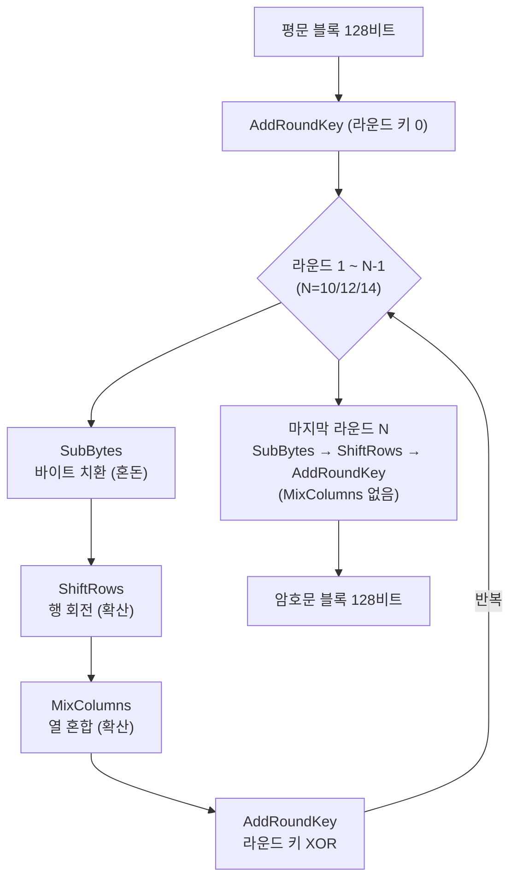

# AES 알고리즘 구조

AES(Advanced Encryption Standard)가 128비트 블록을 어떻게 뒤섞는지, 키 크기와 라운드 수는 왜 그렇게 정해졌는지, 그리고 `Cipher.getInstance("AES/GCM/NoPadding")` 문자열이 실제로 무엇을 지정하는지를 분해한다. AES-256이 항상 정답은 아니라는 판단 근거까지 정리한다.

## 목차
- [1. 핵심 개념 (What)](#1-핵심-개념-what)
- [2. 왜 알아야 하는가 (Why)](#2-왜-알아야-하는가-why)
- [3. 내부 구현 분석 (How)](#3-내부-구현-분석-how)
- [4. 실전 예제](#4-실전-예제)
- [5. 정리](#5-정리)

---

## 1. 핵심 개념 (What)

### 1.1 AES의 출신

AES는 1997년 NIST가 DES를 대체하기 위해 연 공개 공모전의 결과물이다. 벨기에 암호학자 두 명(Joan Daemen, Vincent Rijmen)이 제출한 **Rijndael**이 1차 후보 15개 중에서 선정되어 2001년 FIPS 197로 표준화되었다.

여기서 짚을 점은 **공개 검증 과정을 거쳤다**는 것이다. 3년간 전 세계 암호학자가 공격을 시도했고, 그 결과 살아남았다. 20년이 넘은 지금도 AES 전체 라운드에 대한 실용적 공격은 없다. 알려진 최선의 공격(biclique attack)조차 AES-128을 2^126 연산으로 깨는 수준으로, 전수 탐색(2^128) 대비 4배 개선에 불과하다.

> 면접 팁: "AES가 안전한 이유"를 물으면 "수학적으로 증명되어서"가 아니라 "20년 이상 전 세계 공개 검증을 견뎌내서"라고 답하는 것이 정확하다. 대칭키 암호의 안전성은 증명되지 않고 검증된다.

### 1.2 블록 암호란

AES는 **블록 암호(block cipher)**다. 정해진 크기의 데이터 덩어리를 한 번에 변환한다.

```
AES 블록 암호의 기본 형태

  128비트 평문 블록        128비트 암호문 블록
  ┌───────────────┐        ┌───────────────┐
  │ 16 bytes      │ ──AES──> │ 16 bytes    │
  └───────────────┘   ↑    └───────────────┘
                      │
                   키 (128/192/256비트)
```

수학적으로 AES는 **키에 의해 결정되는 치환(permutation)**이다. 2^128개의 가능한 입력 블록을 2^128개의 출력 블록으로 일대일 대응시킨다. 키가 바뀌면 완전히 다른 대응 관계가 만들어진다. 일대일 대응이므로 복호화(역치환)가 항상 가능하다.

**중요한 한계 두 가지가 여기서 나온다.**

1. AES 자체는 **정확히 16바이트만** 처리한다. 17바이트는 처리할 수 없다. → 운용 모드가 필요한 이유
2. 같은 키로 같은 평문 블록을 넣으면 **항상 같은 암호문 블록**이 나온다. → IV/nonce가 필요한 이유

이 두 한계가 [블록 암호 운용 모드](./03-block-cipher-modes.md)와 [IV와 Nonce](./04-iv-and-nonce.md) 문서의 존재 이유다.

### 1.3 왜 블록 크기가 128비트로 고정인가

Rijndael 원안은 128/192/256비트 블록을 모두 지원했지만, **AES 표준은 128비트 블록만 채택**했다. 이유는 세 가지다.

**첫째, 검증 범위를 좁히기 위해.** 블록 크기와 키 크기의 조합이 9가지가 되면 각각을 다 분석해야 한다. NIST는 표준화 대상을 줄여 검증 신뢰도를 높이는 쪽을 택했다.

**둘째, 128비트면 충분하다.** 블록 크기는 생일 역설(birthday paradox)로 인한 충돌 한계를 결정한다. n비트 블록 암호는 약 2^(n/2)개 블록을 처리하면 블록 충돌이 발생하기 시작한다.

```
64비트 블록 (DES, 3DES, Blowfish):
  2^32 블록 = 약 32 GB 처리 후 충돌 위험
  → 2016년 SWEET32 공격의 근거. 3DES/Blowfish가 TLS에서 퇴출된 이유

128비트 블록 (AES):
  2^64 블록 = 약 2억 5천만 TB 처리 후 충돌 위험
  → 하나의 키로 그만큼 쓸 일이 없다
```

**셋째, 구현 효율.** 128비트 = 16바이트 = 4×4 바이트 행렬. 32비트/64비트 아키텍처 모두에서 다루기 좋고, SIMD 레지스터(128비트) 하나에 정확히 들어간다. AES-NI 명령어가 128비트 레지스터를 그대로 쓰는 것도 이 덕분이다.

### 1.4 상태(State) 행렬

AES는 16바이트 블록을 **4×4 바이트 행렬**로 배치해 다룬다. 이를 상태(State)라 한다. **열 우선(column-major) 순서**로 채운다는 점이 중요하다.

```
입력 바이트: b0 b1 b2 b3 b4 b5 b6 b7 b8 b9 b10 b11 b12 b13 b14 b15

State 행렬 (열 우선):
      col0  col1  col2  col3
row0 [ b0    b4    b8    b12 ]
row1 [ b1    b5    b9    b13 ]
row2 [ b2    b6    b10   b14 ]
row3 [ b3    b7    b11   b15 ]
```

이 배치가 ShiftRows(행 단위 회전)와 MixColumns(열 단위 혼합)를 교차시켜 확산을 극대화하는 설계의 기반이다.

---

## 2. 왜 알아야 하는가 (Why)

### 2.1 키 크기와 라운드 수의 관계

| 이름 | 키 크기 | 라운드 수 | 키 확장 후 라운드 키 |
|------|--------|----------|-------------------|
| AES-128 | 128비트 (16B) | 10 | 11개 (초기 1 + 라운드 10) |
| AES-192 | 192비트 (24B) | 12 | 13개 |
| AES-256 | 256비트 (32B) | 14 | 15개 |

**왜 키가 길수록 라운드가 늘어나는가?**

라운드 수는 "알려진 공격을 견딜 만큼 + 안전 마진"으로 정해진다. 설계 당시 차분 공격(differential cryptanalysis)과 선형 공격(linear cryptanalysis)에 대해 AES는 **4라운드면 충분히 저항**하는 것으로 분석됐다. 여기에 넉넉한 마진을 얹은 것이 10라운드다.

키가 길어지면 키 확장(key schedule) 과정에서 공격자가 얻을 수 있는 정보의 구조가 달라지고, 관련키 공격(related-key attack) 표면이 넓어진다. 그래서 라운드를 늘려 마진을 유지한다.

**여기서 흥미로운 사실 하나.** AES-256은 AES-128보다 라운드가 4개 많으므로 **약 40% 느리다.** "키가 2배니까 2배 안전한데 40%만 느리다"가 아니라, 실제로는 아래에서 설명할 이유로 AES-128도 이미 충분하다.

### 2.2 AES-256이 항상 정답이 아닌 이유

실무에서 반사적으로 AES-256을 고르는 경우가 많은데, 판단 근거를 갖고 고르자.

**근거 1 — 128비트는 물리적으로 깰 수 없다**

2^128을 전수 탐색한다는 것이 어떤 규모인지 감을 잡아보자. 브루스 슈나이어(Bruce Schneier)의 계산이 유명하다. 란다우어 한계(Landauer limit)에 따르면 비트 하나를 뒤집는 데 필요한 최소 에너지가 있고, 2^128개의 카운터를 그냥 세기만 해도 **태양이 30년간 방출하는 전체 에너지**가 필요하다. 이는 알고리즘 개선의 문제가 아니라 열역학의 문제다.

**근거 2 — 성능 차이가 실재한다**

```
AES-128-GCM :  약 40% 빠름
AES-256-GCM :  기준
```

초당 수만 건의 암복호화가 일어나는 API 게이트웨이나 대용량 파일 스트리밍에서는 이 차이가 CPU 사용률과 비용으로 나타난다. TLS 1.3의 기본 cipher suite 목록에서 `TLS_AES_128_GCM_SHA256`이 첫 번째인 이유이기도 하다.

**근거 3 — 실제 공격은 알고리즘이 아니라 주변을 노린다**

AES 키를 무차별 대입으로 깬 사례는 없다. 사고는 전부 다른 데서 난다.

- 키를 소스코드에 하드코딩 → GitHub 유출
- 키를 로그에 출력
- ECB 모드 사용
- IV/nonce 재사용
- 인증 없는 모드 사용 → 패딩 오라클

**근거 4 — 그럼에도 AES-256을 골라야 할 때**

- 규제 요구사항(금융권 내부 기준, 정부 과제, FIPS 관련 요건)
- 장기 보관 데이터 — 양자 컴퓨터의 그로버 알고리즘(Grover's algorithm)은 대칭키 탐색을 제곱근으로 줄인다. AES-256은 양자 환경에서도 실질 128비트 강도를 유지하지만 AES-128은 64비트로 떨어진다. **10년 이상 보관할 데이터라면 AES-256이 합리적이다**
- 성능이 병목이 아닌 경우(대부분의 CRUD 서비스) — 그냥 256 써도 무방하다

**실무 결론**: 성능 민감 + 단기 데이터 → AES-128. 장기 보관 or 규제 대상 → AES-256. **어느 쪽이든 ECB를 안 쓰고 IV를 제대로 다루는 것이 키 길이보다 100배 중요하다.**

---

## 3. 내부 구현 분석 (How)

### 3.1 전체 라운드 구조



주의할 점 두 가지다.

- **시작 전에 AddRoundKey를 한 번 한다.** 이를 화이트닝(whitening)이라 한다. 이게 없으면 첫 라운드의 SubBytes가 키와 무관하게 계산되어 공격자에게 정보를 준다.
- **마지막 라운드에는 MixColumns가 없다.** 이유는 보안이 아니라 **대칭성**이다. MixColumns가 마지막에 있으면 복호화 구조가 암호화와 달라져 구현이 복잡해진다. 마지막 MixColumns는 AddRoundKey와 순서를 바꿔도 등가이므로 보안상 손실이 없다.

### 3.2 4단계 라운드 함수

#### SubBytes — 혼돈(Confusion) 담당

각 바이트를 S-Box라는 256개 항목의 치환 테이블로 바꾼다.

```
State의 각 바이트 b → S[b]

예: 0x53 → S-Box 조회 → 0xED
```

S-Box는 임의로 만든 표가 아니다. GF(2^8) 유한체에서의 **곱셈 역원**을 구한 뒤 아핀 변환(affine transformation)을 적용해 생성된다.

```
S(b) = AffineTransform( b^(-1) in GF(2^8) )
```

곱셈 역원은 매우 비선형이라 선형/차분 공격에 강하고, 아핀 변환은 대수적 구조가 너무 단순해지는 것을 막는다. **이것이 AES에서 유일한 비선형 연산이다.** 나머지 세 단계는 전부 선형 연산이며, 비선형성이 없으면 전체가 하나의 선형 방정식으로 풀려버린다.

#### ShiftRows — 확산(Diffusion) 담당, 행 방향

State의 각 행을 왼쪽으로 회전시킨다. 행 번호만큼 이동한다.

```
변환 전                  변환 후
[ a0 a4 a8  a12 ]       [ a0  a4  a8  a12 ]  행0: 이동 없음
[ a1 a5 a9  a13 ]  -->  [ a5  a9  a13 a1  ]  행1: 1칸 왼쪽
[ a2 a6 a10 a14 ]       [ a10 a14 a2  a6  ]  행2: 2칸 왼쪽
[ a3 a7 a11 a15 ]       [ a15 a3  a7  a11 ]  행3: 3칸 왼쪽
```

목적은 **같은 열에 있던 바이트를 서로 다른 열로 흩뜨리는 것**이다. 이게 없으면 MixColumns가 4개 열을 각각 독립적으로 처리하게 되어, AES가 사실상 32비트 암호 4개를 병렬로 돌리는 것과 다름없어진다.

#### MixColumns — 확산 담당, 열 방향

각 열(4바이트)을 GF(2^8) 위의 고정 행렬과 곱한다.

```
[ 02 03 01 01 ]   [ a0 ]     [ b0 ]
[ 01 02 03 01 ] × [ a1 ]  =  [ b1 ]
[ 01 01 02 03 ]   [ a2 ]     [ b2 ]
[ 03 01 01 02 ]   [ a3 ]     [ b3 ]
```

이 행렬은 MDS(Maximum Distance Separable) 성질을 가진다. **입력 1바이트만 바뀌어도 출력 4바이트가 모두 바뀐다**는 뜻이다.

ShiftRows와 MixColumns가 함께 작동하면 눈사태 효과(avalanche effect)가 폭발적으로 퍼진다.

```
평문 1비트 변경 시 영향 범위
라운드 1 : 1바이트  → MixColumns → 4바이트 (같은 열)
라운드 2 : ShiftRows로 4개 열에 분산 → MixColumns → 16바이트 전체
```

**단 2라운드 만에 전체 블록에 영향이 퍼진다.** AES가 10라운드를 도는 이유는 이 확산을 통계적으로 완전히 무작위해 보이게 만들 마진을 확보하기 위해서다.

#### AddRoundKey — 키를 섞는 유일한 단계

State와 라운드 키를 바이트 단위로 XOR한다.

```
State ⊕ RoundKey[i]
```

연산 자체는 XOR 하나로 가장 단순하지만, **키가 개입하는 유일한 지점**이다. 앞의 세 단계는 키와 무관한 공개 변환이므로, 이 단계가 없으면 누구나 복호화할 수 있다.

### 3.3 키 확장 (Key Schedule)

하나의 마스터 키에서 라운드마다 쓸 라운드 키를 만들어낸다. AES-128 기준으로 16바이트 키 → 176바이트(11개 × 16바이트)를 생성한다.

```
키를 4바이트 워드(W) 단위로 다룬다. AES-128은 W0~W43 (44워드 = 176바이트)

W0..W3   : 마스터 키 그대로
W4 이후  :
   if (i % 4 == 0):
       temp = SubWord( RotWord( W[i-1] ) ) XOR Rcon[i/4]
   else:
       temp = W[i-1]
   W[i] = W[i-4] XOR temp
```

각 요소의 역할이다.

- **RotWord**: 워드 내 바이트를 1칸 회전. 키 바이트가 특정 위치에 고정되는 것을 방지
- **SubWord**: S-Box 적용. 키 확장에도 비선형성 주입
- **Rcon (Round Constant)**: 라운드마다 다른 상수를 XOR. **이게 핵심이다.** 없으면 라운드 키들이 서로 대칭성을 가져 슬라이드 공격(slide attack)에 노출된다

> 면접 팁: "키 확장이 왜 필요한가"에 대한 답은 "모든 라운드에 같은 키를 쓰면 라운드 간 대칭성이 생겨 공격 표면이 열리기 때문"이다. Rcon의 존재 이유까지 말할 수 있으면 깊이가 드러난다.

### 3.4 JCE 구조와 변환 문자열 분해

Java에서 암호화는 `Cipher.getInstance(transformation)` 한 줄로 시작한다. 이 문자열이 세 가지를 지정한다.

```
Cipher.getInstance("AES/GCM/NoPadding")
                     ↑    ↑      ↑
                     │    │      └── 패딩(padding)
                     │    └───────── 운용 모드(mode of operation)
                     └────────────── 알고리즘(algorithm)
```

| 위치 | 값 | 의미 |
|------|-----|------|
| 알고리즘 | `AES` | 블록 암호 알고리즘. 키 길이는 `SecretKey`가 결정 |
| 모드 | `GCM` | 16바이트를 넘는 데이터를 어떻게 이어붙일지 |
| 패딩 | `NoPadding` | 블록 크기에 안 맞을 때 어떻게 채울지 |

**주의: 키 길이는 문자열에 없다.** `"AES/GCM/NoPadding"`은 AES-128인지 256인지 말하지 않는다. `SecretKeySpec`에 넘긴 바이트 배열의 길이(16/24/32)가 결정한다. 이걸 모르면 "AES-256 쓰고 있다"고 믿으면서 16바이트 키를 넘겨 AES-128을 돌리는 일이 생긴다.

**모드/패딩 조합의 의미**

| 변환 문자열 | 평가 |
|------------|------|
| `AES/GCM/NoPadding` | **권장.** 기밀성 + 무결성. GCM은 스트림처럼 동작해 패딩 불필요 |
| `AES/CBC/PKCS5Padding` | 레거시 호환용. 반드시 별도 HMAC 필요 |
| `AES/CTR/NoPadding` | 스트림 방식. 무결성 없음 |
| `AES/ECB/PKCS5Padding` | **절대 금지.** 패턴이 그대로 드러난다 |
| `AES` (모드 생략) | **위험.** SunJCE에서 `AES/ECB/PKCS5Padding`으로 해석된다 |

**마지막 줄이 가장 위험한 함정이다.**

```java
// 모드를 안 쓰면 ECB가 된다 — 실수로 가장 취약한 설정을 고르게 된다
Cipher cipher = Cipher.getInstance("AES");   // == "AES/ECB/PKCS5Padding"
```

코드 리뷰에서 `getInstance("AES")`를 보면 즉시 지적해야 한다. 왜 ECB가 치명적인지는 [블록 암호 운용 모드](./03-block-cipher-modes.md)에서 펭귄 이미지 사례로 다룬다.

---

## 4. 실전 예제

### 4.1 키 길이가 실제로 어디서 결정되는지 확인

```java
@Test
void 키_길이가_AES_변종을_결정한다() throws Exception {
    byte[] key128 = new byte[16];
    byte[] key256 = new byte[32];
    new SecureRandom().nextBytes(key128);
    new SecureRandom().nextBytes(key256);

    // 변환 문자열은 완전히 동일하다
    String transformation = "AES/GCM/NoPadding";

    byte[] iv = new byte[12];
    new SecureRandom().nextBytes(iv);

    Cipher c128 = Cipher.getInstance(transformation);
    c128.init(Cipher.ENCRYPT_MODE, new SecretKeySpec(key128, "AES"),
              new GCMParameterSpec(128, iv));

    Cipher c256 = Cipher.getInstance(transformation);
    c256.init(Cipher.ENCRYPT_MODE, new SecretKeySpec(key256, "AES"),
              new GCMParameterSpec(128, iv));

    // 같은 문자열, 다른 알고리즘. 키 바이트 길이가 유일한 구분자다.
    assertThat(new SecretKeySpec(key128, "AES").getEncoded().length).isEqualTo(16);
    assertThat(new SecretKeySpec(key256, "AES").getEncoded().length).isEqualTo(32);
}
```

키를 안전하게 생성할 때는 `KeyGenerator`를 쓴다. 내부적으로 `SecureRandom`을 사용한다.

```java
KeyGenerator keyGen = KeyGenerator.getInstance("AES");
keyGen.init(256);                        // 128 / 192 / 256
SecretKey key = keyGen.generateKey();
```

### 4.2 눈사태 효과 직접 확인하기

MixColumns와 ShiftRows의 확산이 실제로 어떤 결과를 내는지 눈으로 보자.

```java
@Test
void 평문_1비트_변경이_암호문_절반을_바꾼다() throws Exception {
    SecretKey key = new SecretKeySpec(new byte[16], "AES");   // 테스트용 고정 키

    byte[] a = "0000000000000000".getBytes(StandardCharsets.UTF_8);
    byte[] b = a.clone();
    b[0] ^= 0x01;                        // 딱 1비트만 뒤집는다

    // 단일 블록 변환을 관찰하기 위한 ECB — 실무에서는 절대 쓰지 않는다
    Cipher cipher = Cipher.getInstance("AES/ECB/NoPadding");
    cipher.init(Cipher.ENCRYPT_MODE, key);

    byte[] ca = cipher.doFinal(a);
    byte[] cb = cipher.doFinal(b);

    int diffBits = 0;
    for (int i = 0; i < ca.length; i++) {
        diffBits += Integer.bitCount((ca[i] ^ cb[i]) & 0xFF);
    }

    System.out.println("입력 차이: 1 bit / 출력 차이: " + diffBits + " bits / 128");
    // 대략 60~70비트. 이상적인 무작위 함수의 기댓값(64)에 근접한다.
    assertThat(diffBits).isBetween(45, 85);
}
```

이 테스트가 보여주는 것이 확산(diffusion)이다. 암호문에서 평문의 어떤 패턴도 추론할 수 없게 만드는 성질이다.

### 4.3 AES-NI 하드웨어 가속 확인

```bash
# macOS
sysctl -a | grep machdep.cpu.features | tr ' ' '\n' | grep -i aes
# AES

# Linux
grep -o aes /proc/cpuinfo | head -1
# aes
```

JVM이 실제로 intrinsic을 쓰는지 확인하려면 이렇게 한다.

```bash
java -XX:+UnlockDiagnosticVMOptions -XX:+PrintIntrinsics -jar app.jar 2>&1 \
  | grep -i aes
# @ 12 com.sun.crypto.provider.AESCrypt::implEncryptBlock (...) intrinsic
```

가속을 끄고 성능을 비교해보면 차이가 명확하다.

```bash
java -XX:-UseAES -XX:-UseAESIntrinsics -jar bench.jar   # 소프트웨어 구현
java -jar bench.jar                                      # 기본(가속 사용)
```

보통 5~10배 차이가 난다. **이 가속이 "왜 대칭키가 비대칭키보다 압도적으로 빠른가"의 실질적 답 중 하나다.**

### 4.4 Spring Boot 실무 컴포넌트

```java
package com.example.crypto;

import org.springframework.beans.factory.annotation.Value;
import org.springframework.stereotype.Component;

import javax.crypto.Cipher;
import javax.crypto.SecretKey;
import javax.crypto.spec.GCMParameterSpec;
import javax.crypto.spec.SecretKeySpec;
import java.nio.charset.StandardCharsets;
import java.security.SecureRandom;
import java.util.Base64;

@Component
public class AesGcmCipher {

    private static final String TRANSFORMATION = "AES/GCM/NoPadding";
    private static final int IV_LENGTH  = 12;    // GCM 권장 96비트
    private static final int TAG_LENGTH = 128;   // 인증 태그 비트 수

    private final SecretKey key;
    private final SecureRandom random = new SecureRandom();

    public AesGcmCipher(@Value("${app.crypto.aes-key}") String base64Key) {
        byte[] keyBytes = Base64.getDecoder().decode(base64Key);

        // 키 길이 검증 — 설정 실수로 의도치 않은 AES 변종을 쓰는 것을 막는다
        if (keyBytes.length != 16 && keyBytes.length != 24 && keyBytes.length != 32) {
            throw new IllegalStateException(
                "AES 키는 16/24/32바이트여야 합니다. 현재: " + keyBytes.length);
        }
        this.key = new SecretKeySpec(keyBytes, "AES");
    }

    public String encrypt(String plaintext) {
        try {
            byte[] iv = new byte[IV_LENGTH];
            random.nextBytes(iv);        // 매 호출 새 IV — 재사용은 GCM에서 치명적

            Cipher cipher = Cipher.getInstance(TRANSFORMATION);
            cipher.init(Cipher.ENCRYPT_MODE, key, new GCMParameterSpec(TAG_LENGTH, iv));
            byte[] ciphertext = cipher.doFinal(plaintext.getBytes(StandardCharsets.UTF_8));

            byte[] out = new byte[IV_LENGTH + ciphertext.length];
            System.arraycopy(iv, 0, out, 0, IV_LENGTH);
            System.arraycopy(ciphertext, 0, out, IV_LENGTH, ciphertext.length);
            return Base64.getEncoder().encodeToString(out);
        } catch (Exception e) {
            throw new IllegalStateException("암호화 실패", e);
        }
    }
}
```

`Cipher` 인스턴스는 **스레드 안전하지 않다.** 필드로 두고 공유하면 동시 요청에서 상태가 깨진다. 위 코드처럼 메서드 안에서 매번 생성하거나 `ThreadLocal`을 쓴다. `SecureRandom`은 스레드 안전하므로 공유해도 된다.

### 4.5 안티패턴

**안티패턴 1 — 모드 생략**

```java
Cipher.getInstance("AES");                      // → ECB. 절대 금지
Cipher.getInstance("AES/GCM/NoPadding");        // 명시적으로 쓴다
```

**안티패턴 2 — 비밀번호를 그대로 키로 사용**

```java
// 잘못된 코드: 문자열을 잘라서 키로 쓴다
byte[] keyBytes = "myPassword123456".getBytes();   // 엔트로피가 턱없이 부족
```

사람이 만든 비밀번호는 16바이트여도 실제 엔트로피는 30~40비트 수준이다. 비밀번호에서 키를 유도하려면 PBKDF2/Argon2 같은 KDF를 쓴다.

```java
SecretKeyFactory factory = SecretKeyFactory.getInstance("PBKDF2WithHmacSHA256");
KeySpec spec = new PBEKeySpec(password.toCharArray(), salt, 600_000, 256);
SecretKey key = new SecretKeySpec(factory.generateSecret(spec).getEncoded(), "AES");
```

**안티패턴 3 — 키 길이를 로그로 확인하지 않기**

Base64 디코딩 결과가 16바이트인데 AES-256을 쓴다고 믿는 경우가 실제로 흔하다. 4.4의 검증 코드처럼 시작 시점에 실패시키자.

**안티패턴 4 — `Cipher`를 싱글턴 필드로 공유**

```java
@Component
public class BadCipher {
    private final Cipher cipher = Cipher.getInstance("AES/GCM/NoPadding");  // 위험
}
```

---

## 5. 정리

### AES 변종 비교

| 항목 | AES-128 | AES-192 | AES-256 |
|------|---------|---------|---------|
| 키 크기 | 16바이트 | 24바이트 | 32바이트 |
| 라운드 수 | 10 | 12 | 14 |
| 라운드 키 개수 | 11 | 13 | 15 |
| 상대 성능 | 기준 (가장 빠름) | 약 -20% | 약 -40% |
| 양자 내성(그로버) | 실질 64비트 | 실질 96비트 | 실질 128비트 |
| 권장 상황 | 성능 민감, 단기 데이터 | 사실상 거의 안 씀 | 장기 보관, 규제 대상 |

### 라운드 함수 4단계

| 단계 | 대상 | 담당 성질 | 없으면 |
|------|------|----------|--------|
| SubBytes | 각 바이트 (S-Box) | 혼돈(confusion) | 전체가 선형 방정식으로 풀림 |
| ShiftRows | 각 행 회전 | 확산(열 간) | 32비트 암호 4개로 분해됨 |
| MixColumns | 각 열 × MDS 행렬 | 확산(열 내) | 눈사태 효과 소멸 |
| AddRoundKey | State ⊕ 라운드 키 | 키 주입 | 누구나 복호화 가능 |

### 변환 문자열 분해

| 문자열 | 알고리즘 | 모드 | 패딩 | 판정 |
|--------|---------|------|------|------|
| `AES/GCM/NoPadding` | AES | GCM | 없음 | 권장 |
| `AES/CBC/PKCS5Padding` | AES | CBC | PKCS#5 | HMAC 필수 |
| `AES/CTR/NoPadding` | AES | CTR | 없음 | 무결성 없음 |
| `AES/ECB/PKCS5Padding` | AES | ECB | PKCS#5 | 금지 |
| `AES` | AES | **ECB(암묵)** | PKCS#5 | 금지 |

> **핵심 포인트**: AES는 128비트 블록을 4×4 상태 행렬에 담고, SubBytes(혼돈) + ShiftRows·MixColumns(확산) + AddRoundKey(키 주입)를 10~14라운드 반복하는 구조다. 비선형 연산은 SubBytes 하나뿐이며, 이것이 없으면 전체가 선형 방정식으로 풀린다. 키 크기는 라운드 수를 결정하고, 라운드 수는 성능에 직결된다 — AES-256은 AES-128보다 약 40% 느리다. 128비트 전수 탐색은 열역학적으로 불가능하므로 성능이 중요하면 AES-128도 정당한 선택이고, 장기 보관·규제 대상이면 AES-256을 쓴다. 그러나 실제 사고는 키 길이가 아니라 모드 선택과 IV 관리에서 난다. 특히 `Cipher.getInstance("AES")`처럼 모드를 생략하면 **가장 취약한 ECB가 조용히 선택된다** — 코드 리뷰에서 반드시 잡아야 할 패턴이다.

---

## 관련 문서

- [백엔드 보안 기초](../01-backend-security-fundamentals.md) — 인증/인가 전반
- [JWT / JWK / OAuth 비교](../02-jwt-jwk-oauth-comparison.md) — 토큰 기반 인증
- [암호화 기초: 대칭키와 비대칭키](./01-encryption-fundamentals.md) — AES가 대칭키인 이유와 위협 모델
- [블록 암호 운용 모드](./03-block-cipher-modes.md) — 16바이트를 넘는 데이터 처리
- [IV와 Nonce](./04-iv-and-nonce.md) — 같은 평문이 같은 암호문이 되는 문제
- [패딩과 오라클 공격](./05-padding-and-oracle-attack.md) — PKCS#5 패딩이 열어주는 공격
- [AEAD 인증 암호화](./06-aead-authenticated-encryption.md) — GCM 인증 태그의 원리
- [해싱과 비밀번호 저장](./07-hashing-and-password-storage.md) — PBKDF2/Argon2 키 유도
- [비대칭 암호와 전자서명](./08-asymmetric-crypto-and-signature.md) — RSA/ECC 구조
- [키 관리와 봉투 암호화](../advanced/01-key-management-envelope-encryption.md) — AES 키를 어디에 둘 것인가
- [DB 필드 암호화](../advanced/02-database-field-encryption.md) — AES 적용 실무
- [Spring Boot 암호화 실무](../advanced/03-spring-boot-encryption-practice.md) — JCE 설정과 Provider
- [TLS와 전송 계층 보안](../advanced/04-tls-and-transport-security.md) — TLS cipher suite에서의 AES

---
*참고: Java 17 / Spring Boot 3.x 기준*
