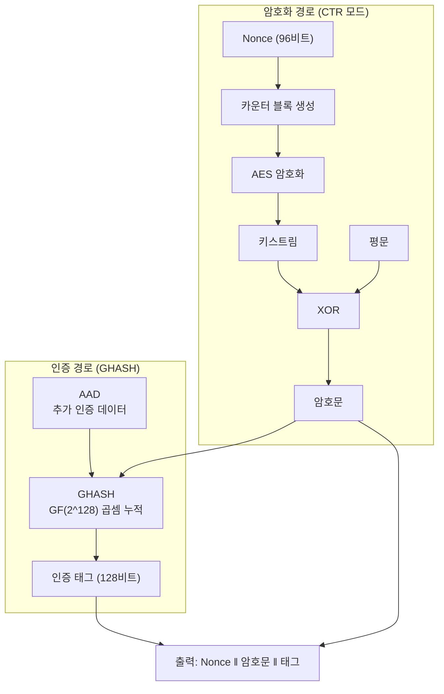
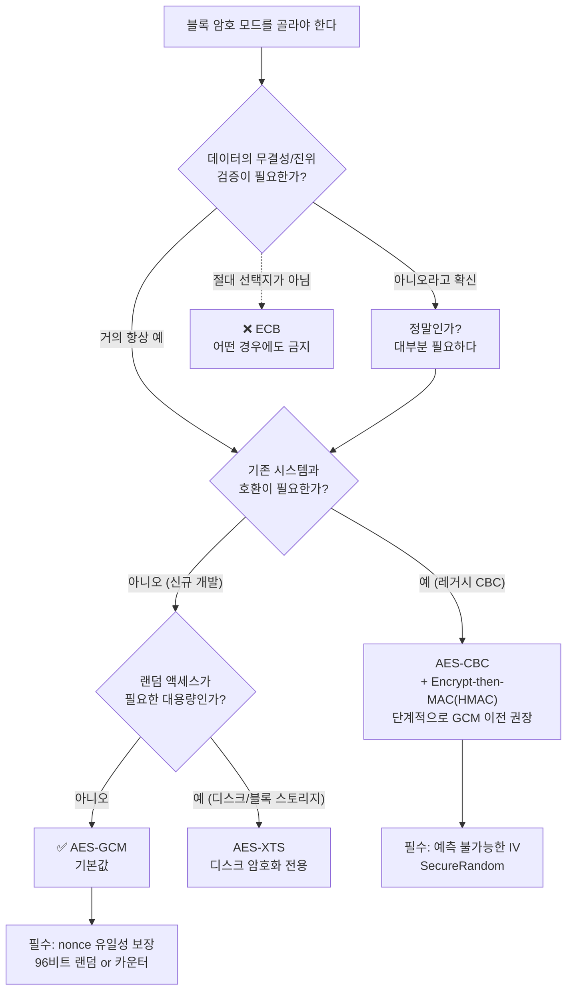

# 블록 암호 운용 모드: ECB, CBC, CTR, GCM

AES는 16바이트만 처리한다. 그보다 긴 데이터를 어떻게 이어붙일지 정하는 것이 운용 모드(mode of operation)이며, **알고리즘 선택보다 모드 선택에서 실제 사고가 훨씬 많이 난다.** ECB의 치명적 결함부터 오늘날 기본값인 GCM까지 정리한다.

## 목차
- [1. 핵심 개념 (What)](#1-핵심-개념-what)
- [2. 왜 알아야 하는가 (Why)](#2-왜-알아야-하는가-why)
- [3. 내부 구현 분석 (How)](#3-내부-구현-분석-how)
- [4. 실전 예제](#4-실전-예제)
- [5. 정리](#5-정리)

---

## 1. 핵심 개념 (What)

### 1.1 운용 모드가 왜 필요한가

[AES 알고리즘 구조](./02-aes-algorithm-structure.md)에서 봤듯 AES는 **정확히 128비트(16바이트) 블록 하나**를 다른 16바이트로 바꾸는 함수다. 그런데 실제 데이터는 이렇게 생겼다.

```
주민등록번호 암호화 : 13바이트  → 블록보다 짧다
JSON 응답 본문      : 4,382바이트 → 블록 273.875개
파일 업로드         : 50MB      → 블록 3,276,800개
```

여기서 두 가지 질문이 생긴다.

1. **긴 데이터를 어떻게 나눠서 처리할 것인가** → 운용 모드가 답한다
2. **블록 크기에 안 맞는 나머지는 어떻게 채울 것인가** → 패딩이 답한다 ([패딩과 오라클 공격](./05-padding-and-oracle-attack.md))

운용 모드는 "블록 암호라는 부품으로 실제 쓸 수 있는 암호 시스템을 조립하는 방법"이다. **그리고 이 조립을 잘못하면 AES-256을 쓰고도 데이터가 그대로 드러난다.**

### 1.2 모드 4종 개요

| 모드 | 정식 명칭 | 한 줄 요약 | 실무 판정 |
|------|----------|-----------|----------|
| ECB | Electronic Codebook | 블록마다 독립 암호화 | **절대 금지** |
| CBC | Cipher Block Chaining | 이전 암호문을 다음 블록에 XOR | 레거시 호환용 |
| CTR | Counter | 카운터를 암호화해 키스트림 생성 | 조건부 사용 |
| GCM | Galois/Counter Mode | CTR + 인증 태그 | **기본값** |

여기에 CFB, OFB, XTS(디스크 암호화), CCM, SIV 등이 더 있지만, 백엔드 애플리케이션 개발자가 실제 마주칠 일은 위 네 가지가 거의 전부다.

---

## 2. 왜 알아야 하는가 (Why)

### 2.1 ECB의 치명적 결함 — 펭귄이 보이는 이유

ECB는 가장 단순하다. 블록을 잘라서 각각 독립적으로 암호화한다.

```
평문:  [ P1 ][ P2 ][ P3 ][ P4 ]
         │     │     │     │
        AES   AES   AES   AES    ← 전부 같은 키, 서로 무관
         │     │     │     │
암호문: [ C1 ][ C2 ][ C3 ][ C4 ]
```

문제는 한 문장으로 요약된다. **같은 평문 블록은 항상 같은 암호문 블록이 된다.**

```
P1 == P3  이면  C1 == C3
```

이게 왜 치명적인지를 가장 극적으로 보여주는 것이 **"ECB 펭귄"**이다. 리눅스 마스코트 Tux 이미지를 ECB로 암호화하면 이런 일이 벌어진다.

```
   원본 이미지            ECB 암호화           CBC/GCM 암호화
 ┌──────────────┐      ┌──────────────┐     ┌──────────────┐
 │    ▄▄▄▄      │      │    ▄▄▄▄      │     │▓░▒█░▓▒█░▒▓█░▒│
 │   █ ●● █     │      │   ░ ▒▒ ░     │     │░█▒▓░█▒▓█░▒▓░█│
 │   █ ▼▼ █     │      │   ▒ ░░ ▒     │     │▒▓█░▒█▓░▒█▓░█▒│
 │  ██████████  │      │  ░▒░▒░▒░▒░▒  │     │█░▓▒█░▓▒░█▓▒█░│
 │   ██    ██   │      │   ▒░    ░▒   │     │▒█▓░█▒▓░█▒▓█░▓│
 └──────────────┘      └──────────────┘     └──────────────┘
     펭귄 보임          펭귄 여전히 보임        완전한 잡음

  각 픽셀은 바뀌었지만       패턴이 남아 있으므로
  같은 색 영역 = 같은 블록   윤곽이 그대로 드러난다
```

각 바이트 값은 전부 바뀌었다. 하지만 **"어디가 같고 어디가 다른지"의 패턴은 그대로 보존된다.** 배경이 흰색인 영역은 전부 같은 암호문 블록이 되므로, 이미지의 구조가 그대로 남는다.

이건 이미지에만 해당되는 문제가 아니다.

```java
// ECB로 암호화된 회원 등급 컬럼
grade_encrypted
─────────────────────────────
a3f9c2...   ← 이 값이 8,200번 등장 → 일반 등급
b7e1d4...   ← 이 값이 340번 등장   → VIP 등급
c5a8f1...   ← 이 값이 12번 등장    → 관리자
```

**키가 없어도 빈도 분석만으로 어느 행이 관리자인지 알 수 있다.** DB 덤프가 유출된 순간 등급, 성별, 지역 같은 저카디널리티 컬럼은 사실상 평문이다.

더 나아가 **블록 교체 공격(block swapping)**도 가능하다. 각 블록이 독립이므로 공격자가 자기 레코드의 암호문 블록을 남의 레코드에 붙여넣을 수 있다.

```
피해자 레코드: [ id=victim ][ grade=NORMAL ]
공격자 레코드: [ id=hacker ][ grade=NORMAL ]

공격자가 어딘가에서 [ grade=ADMIN ] 암호문 블록을 얻으면
              → [ id=hacker ][ grade=ADMIN ]  으로 조립 가능
```

> 면접 팁: "ECB를 쓰면 안 되는 이유"는 단골 질문이다. "같은 평문 블록이 같은 암호문 블록이 되어 패턴이 노출되고, 대표 사례가 ECB 펭귄"까지 말하고, 여기에 "블록 단위 재배열/교체도 가능하다"를 덧붙이면 확실하다.

### 2.2 실제 사고 사례

**Adobe 비밀번호 유출 (2013, 1억 5천만 계정)**

Adobe는 비밀번호를 해싱하지 않고 **3DES-ECB로 암호화**해 저장했다. 결과는 참혹했다.

- 같은 비밀번호 → 같은 암호문. 키 없이도 "누가 같은 비밀번호를 쓰는지" 즉시 파악
- 비밀번호 힌트가 평문으로 함께 유출 → 힌트 여러 개를 교차 분석해 원본 비밀번호 복원
- 가장 흔한 암호문 = "123456"임이 통계적으로 확정됨

키는 끝내 유출되지 않았지만 **ECB의 구조적 결함만으로 상당수 비밀번호가 복원**됐다. 애초에 비밀번호는 암호화가 아니라 해싱해야 했다 ([해싱과 비밀번호 저장](./07-hashing-and-password-storage.md)).

**Zoom E2E 암호화 논란 (2020)**

Zoom은 "종단간 암호화"를 광고했으나, 실제로는 AES-128-**ECB**를 사용하고 있었다. Citizen Lab이 이를 공개하면서 마케팅 표현까지 함께 문제가 됐고, 이후 AES-256-GCM으로 전환했다.

### 2.3 CBC — 체이닝으로 패턴을 없애다

CBC는 ECB의 문제를 **이전 블록의 암호문을 다음 평문에 XOR**하는 것으로 해결한다.

```
암호화
        IV        C1        C2
         │         │         │
   P1 ──⊕── AES ──┤   P2 ──⊕── AES ──┤   P3 ──⊕── AES ──> C3
                   └─> C1              └─> C2

   Ci = AES_K( Pi ⊕ C(i-1) ),   C0 = IV
```

첫 블록에는 이전 암호문이 없으므로 **초기화 벡터(Initialization Vector, IV)**를 대신 쓴다. IV가 매번 달라지면 같은 평문을 암호화해도 완전히 다른 암호문이 나온다.

CBC의 특성을 정리하면 이렇다.

| 특성 | 내용 |
|------|------|
| 암호화 병렬화 | **불가능.** C(i-1)이 있어야 Pi를 처리 가능 |
| 복호화 병렬화 | 가능. Pi = AES⁻¹(Ci) ⊕ C(i-1) — 필요한 암호문이 이미 다 있다 |
| IV 요구사항 | **예측 불가능해야 한다** (단순히 유일한 것으로는 부족) |
| 패딩 | 필요 (PKCS#7/PKCS#5) |
| 오류 전파 | 암호문 1비트 손상 → 해당 블록 전체 + 다음 블록의 대응 1비트 손상 |
| 무결성 | **없음.** 별도 HMAC 필요 |

**CBC의 실무 문제 두 가지**

첫째, **암호화 병렬화가 불가능**하다. 50MB 파일을 암호화할 때 멀티코어를 활용할 수 없다. 순차적으로 3백만 블록을 돌아야 한다.

둘째, 그리고 더 심각한 것 — **비트 플립 공격(bit-flipping attack)**에 취약하다.

```
복호화 식:  Pi = AES⁻¹(Ci) ⊕ C(i-1)

공격자가 C(i-1)의 특정 비트를 뒤집으면
        → Pi의 같은 위치 비트가 정확히 뒤집힌다
        → C(i-1)에 해당하는 평문은 쓰레기가 되지만, Pi는 공격자 뜻대로 조작됨
```

```
평문:      {"role":"user","id":1234}
공격자가 특정 위치 비트를 뒤집으면
평문:      {"role":"admin","id":1234}   ← 조작 성공
```

무결성 검증이 없으면 애플리케이션은 이 조작을 감지하지 못한다. 그리고 복호화 실패 여부를 응답으로 흘리면 **패딩 오라클 공격**으로 전체 평문이 복원된다 ([패딩과 오라클 공격](./05-padding-and-oracle-attack.md)).

**CBC를 꼭 써야 한다면 반드시 Encrypt-then-MAC 구조로 HMAC을 붙여야 한다.** 그럴 바에는 GCM을 쓰는 게 낫다.

### 2.4 CTR — 블록 암호를 스트림 암호로

CTR은 발상을 뒤집는다. **평문을 암호화하지 않고, 카운터를 암호화해 키스트림을 만든 뒤 평문과 XOR한다.**

```
   Nonce||Counter=1   Nonce||Counter=2   Nonce||Counter=3
          │                  │                  │
         AES                AES                AES        ← 평문과 무관!
          │                  │                  │
      keystream1         keystream2         keystream3
          │                  │                  │
   P1 ───⊕───> C1     P2 ───⊕───> C2     P3 ───⊕───> C3
```

이 구조가 주는 이점이 크다.

| 특성 | 내용 |
|------|------|
| 암호화 병렬화 | **가능.** 각 블록의 카운터가 독립적 |
| 복호화 병렬화 | **가능** |
| 랜덤 액세스 | **가능.** 5000번째 블록만 복호화 가능 (디스크 암호화에 유용) |
| 패딩 | **불필요.** 키스트림을 필요한 길이만큼만 쓰면 됨 |
| 암복호화 코드 | **동일.** 둘 다 XOR |
| 무결성 | **없음** |

패딩이 필요 없다는 점은 부수적 보안 이점도 준다. 패딩이 없으면 패딩 오라클 공격 자체가 성립하지 않는다.

**하지만 CTR에는 절대 어겨선 안 되는 규칙이 하나 있다. nonce를 재사용하면 안 된다.**

```
같은 키 K, 같은 nonce N으로 두 메시지를 암호화하면
  C1 = P1 ⊕ KS   (KS = keystream)
  C2 = P2 ⊕ KS

공격자가 C1, C2만 가지고
  C1 ⊕ C2 = P1 ⊕ P2      ← 키스트림이 소거된다!
```

두 평문의 XOR이 그대로 드러난다. 한쪽 평문을 조금이라도 알거나(HTTP 헤더, JSON 키 이름 등) 자연어의 통계적 성질을 이용하면 두 평문 모두 복원된다. 이를 **크립 드래깅(crib dragging)**이라 한다. 이 문제는 [IV와 Nonce](./04-iv-and-nonce.md)에서 실제 사고 사례와 함께 자세히 다룬다.

### 2.5 GCM — 현재의 기본값

GCM(Galois/Counter Mode)은 **CTR로 암호화하면서 동시에 GHASH로 인증 태그를 계산**한다.



GCM이 실무 기본값이 된 이유는 네 가지다.

**1. 기밀성 + 무결성을 한 번에 (AEAD)**

복호화 시 태그가 맞지 않으면 `AEADBadTagException`을 던지고 **평문을 반환하지 않는다.** 조작된 데이터가 애플리케이션 로직에 도달할 수 없다. 이것만으로 비트 플립 공격과 패딩 오라클 공격이 전부 무력화된다.

**2. AAD(Additional Authenticated Data) 지원**

암호화하지 않되 무결성은 보장해야 하는 데이터를 함께 묶을 수 있다.

```
AAD 예시:  레코드 ID, 테넌트 ID, 버전, HTTP 헤더
→ 암호문은 그대로 두고 AAD만 바꿔 다른 레코드에 붙이는 공격 차단
```

**3. 성능**

CTR 기반이라 병렬 처리가 가능하고, GHASH의 GF(2^128) 곱셈은 CPU의 `PCLMULQDQ` 명령어로 가속된다. **AES-CBC + HMAC-SHA256 조합보다 빠르다.** "무결성을 얻기 위해 성능을 희생한다"가 아니라 오히려 이득이다.

**4. 표준의 선택**

TLS 1.3은 AEAD 모드만 허용한다. CBC는 아예 제거됐다.

```
TLS 1.3 지원 cipher suite (전부 AEAD)
  TLS_AES_128_GCM_SHA256
  TLS_AES_256_GCM_SHA384
  TLS_CHACHA20_POLY1305_SHA256
  TLS_AES_128_CCM_SHA256
```

**GCM의 유일한 약점은 nonce 재사용이다.** CTR보다 훨씬 심각하다. 평문이 노출되는 것을 넘어 **인증 서브키가 복원되어 임의 메시지 위조가 가능해진다.** 이 부분은 [IV와 Nonce](./04-iv-and-nonce.md)의 핵심 주제다.

---

## 3. 내부 구현 분석 (How)

### 3.1 모드 선택 결정 트리



표로 정리하면 이렇다.

| 상황 | 선택 | 이유 |
|------|------|------|
| 신규 개발 전반 | **AES-GCM** | AEAD, 병렬 처리, 표준 기본값 |
| 스트리밍 / 대용량 파일 | **AES-GCM** (청크 단위) | 청크마다 다른 nonce, 각각 인증 |
| 디스크/블록 스토리지 | AES-XTS | 섹터 단위 랜덤 액세스 + 길이 보존 |
| 레거시 CBC 시스템 유지 | AES-CBC + HMAC (Encrypt-then-MAC) | 무결성 보강 후 점진적 이전 |
| ARM 등 AES-NI 없는 환경 | ChaCha20-Poly1305 | 소프트웨어 구현이 AES보다 빠르고 타이밍 안전 |
| 어떤 경우든 | **ECB 금지** | 패턴 노출 |

### 3.2 오류 전파 특성 비교

전송 중 암호문 1비트가 손상되면 각 모드에서 어떻게 되는지다. (실무에서는 GCM이 아예 거부하므로 학술적 비교에 가깝지만, 모드의 구조를 이해하는 데 도움이 된다.)

| 모드 | 손상된 비트의 영향 범위 |
|------|----------------------|
| ECB | 해당 블록만 전체 손상 (16바이트) |
| CBC | 해당 블록 전체(16B) + 다음 블록의 같은 위치 1비트 |
| CTR | 해당 1비트만 (XOR이므로 정확히 대응) |
| GCM | 태그 검증 실패 → **전체 거부, 평문 반환 안 함** |

**CTR의 "1비트만 손상"은 장점이 아니라 위험 신호다.** 공격자가 평문의 특정 비트를 정확히 원하는 대로 뒤집을 수 있다는 뜻이기 때문이다. 무결성 없는 CTR을 쓰면 안 되는 이유다.

### 3.3 각 모드의 파라미터 크기

| 모드 | Java 파라미터 클래스 | IV/Nonce 크기 | 부가 데이터 |
|------|-------------------|--------------|-----------|
| ECB | 없음 | 없음 | 없음 |
| CBC | `IvParameterSpec` | 16바이트 (블록 크기와 동일) | 패딩 최대 16B |
| CTR | `IvParameterSpec` | 16바이트 (nonce+counter 합계) | 없음 |
| GCM | `GCMParameterSpec` | **12바이트 권장** | 태그 16B |

**GCM의 nonce가 12바이트인 이유**를 알아두면 좋다. GCM 내부는 128비트 카운터 블록을 쓰는데, nonce가 정확히 96비트(12바이트)면 나머지 32비트를 카운터로 그대로 쓴다. 다른 길이면 GHASH를 한 번 더 돌려 96비트로 압축하는 추가 연산이 들어가고, **서로 다른 길이의 nonce가 같은 카운터 블록으로 충돌할 가능성**도 생긴다. 그래서 NIST SP 800-38D는 96비트를 강력히 권장한다.

---

## 4. 실전 예제

### 4.1 ECB 패턴 노출을 직접 확인

```java
@Test
void ECB는_같은_평문_블록을_같은_암호문_블록으로_만든다() throws Exception {
    SecretKey key = KeyGenerator.getInstance("AES").generateKey();

    // 16바이트 블록 세 개. 1번과 3번이 동일하다.
    byte[] plaintext = "AAAAAAAAAAAAAAAA"     // 블록 1
                     + "BBBBBBBBBBBBBBBB"     // 블록 2
                     + "AAAAAAAAAAAAAAAA"     // 블록 3 == 블록 1
                     .getBytes(StandardCharsets.UTF_8);

    Cipher ecb = Cipher.getInstance("AES/ECB/NoPadding");
    ecb.init(Cipher.ENCRYPT_MODE, key);
    byte[] c = ecb.doFinal(plaintext);

    byte[] block1 = Arrays.copyOfRange(c, 0, 16);
    byte[] block3 = Arrays.copyOfRange(c, 32, 48);

    // 암호화했는데 패턴이 그대로 남는다 — 이것이 ECB 펭귄의 원리
    assertThat(block1).isEqualTo(block3);
}

@Test
void GCM은_같은_평문_블록도_다르게_암호화한다() throws Exception {
    SecretKey key = KeyGenerator.getInstance("AES").generateKey();
    byte[] plaintext = ("AAAAAAAAAAAAAAAA" + "BBBBBBBBBBBBBBBB" + "AAAAAAAAAAAAAAAA")
            .getBytes(StandardCharsets.UTF_8);

    byte[] nonce = new byte[12];
    new SecureRandom().nextBytes(nonce);

    Cipher gcm = Cipher.getInstance("AES/GCM/NoPadding");
    gcm.init(Cipher.ENCRYPT_MODE, key, new GCMParameterSpec(128, nonce));
    byte[] c = gcm.doFinal(plaintext);

    assertThat(Arrays.copyOfRange(c, 0, 16))
            .isNotEqualTo(Arrays.copyOfRange(c, 32, 48));   // 패턴 사라짐
}
```

### 4.2 네 가지 모드 사용 예시 (Kotlin)

```kotlin
package com.example.crypto

import javax.crypto.Cipher
import javax.crypto.SecretKey
import javax.crypto.spec.GCMParameterSpec
import javax.crypto.spec.IvParameterSpec
import java.security.SecureRandom

object CipherModes {

    private val random = SecureRandom()

    /**
     * ECB — 학습·비교 목적으로만 존재한다. 프로덕션 사용 금지.
     * IV가 없다는 것 자체가 결함의 신호다.
     */
    @Deprecated("ECB는 평문 패턴을 노출한다", ReplaceWith("gcmEncrypt(key, plaintext)"))
    fun ecbEncrypt(key: SecretKey, plaintext: ByteArray): ByteArray =
        Cipher.getInstance("AES/ECB/PKCS5Padding").run {
            init(Cipher.ENCRYPT_MODE, key)
            doFinal(plaintext)
        }

    /**
     * CBC — IV는 예측 불가능해야 하며(SecureRandom), 무결성이 없으므로
     * 반드시 Encrypt-then-MAC으로 HMAC을 덧붙여야 한다.
     */
    fun cbcEncrypt(key: SecretKey, plaintext: ByteArray): ByteArray {
        val iv = ByteArray(16).also { random.nextBytes(it) }
        val cipher = Cipher.getInstance("AES/CBC/PKCS5Padding")
        cipher.init(Cipher.ENCRYPT_MODE, key, IvParameterSpec(iv))
        return iv + cipher.doFinal(plaintext)          // IV ‖ ciphertext
    }

    /**
     * CTR — 패딩 불필요, 병렬 처리 가능. 그러나 무결성이 없다.
     * nonce 재사용 시 두 평문의 XOR이 그대로 노출된다.
     */
    fun ctrEncrypt(key: SecretKey, plaintext: ByteArray): ByteArray {
        val iv = ByteArray(16).also { random.nextBytes(it) }
        val cipher = Cipher.getInstance("AES/CTR/NoPadding")
        cipher.init(Cipher.ENCRYPT_MODE, key, IvParameterSpec(iv))
        return iv + cipher.doFinal(plaintext)
    }

    /**
     * GCM — 실무 기본값. 기밀성 + 무결성 + AAD.
     * aad에는 암호화하지 않지만 위변조는 막고 싶은 값(레코드 ID 등)을 넣는다.
     */
    fun gcmEncrypt(key: SecretKey, plaintext: ByteArray, aad: ByteArray? = null): ByteArray {
        val nonce = ByteArray(12).also { random.nextBytes(it) }   // 96비트 권장
        val cipher = Cipher.getInstance("AES/GCM/NoPadding")
        cipher.init(Cipher.ENCRYPT_MODE, key, GCMParameterSpec(128, nonce))
        aad?.let { cipher.updateAAD(it) }
        return nonce + cipher.doFinal(plaintext)       // nonce ‖ ciphertext ‖ tag
    }

    fun gcmDecrypt(key: SecretKey, envelope: ByteArray, aad: ByteArray? = null): ByteArray {
        val nonce = envelope.copyOfRange(0, 12)
        val body  = envelope.copyOfRange(12, envelope.size)
        val cipher = Cipher.getInstance("AES/GCM/NoPadding")
        cipher.init(Cipher.DECRYPT_MODE, key, GCMParameterSpec(128, nonce))
        aad?.let { cipher.updateAAD(it) }
        // 변조 시 AEADBadTagException — 평문은 절대 반환되지 않는다
        return cipher.doFinal(body)
    }
}
```

### 4.3 GCM의 변조 탐지 확인

```java
@Test
void GCM은_1비트_변조도_거부한다() throws Exception {
    SecretKey key = KeyGenerator.getInstance("AES").generateKey();
    byte[] nonce = new byte[12];
    new SecureRandom().nextBytes(nonce);

    Cipher enc = Cipher.getInstance("AES/GCM/NoPadding");
    enc.init(Cipher.ENCRYPT_MODE, key, new GCMParameterSpec(128, nonce));
    byte[] ciphertext = enc.doFinal("{\"role\":\"user\"}".getBytes(UTF_8));

    ciphertext[3] ^= 0x01;    // 공격자가 1비트만 뒤집는다

    Cipher dec = Cipher.getInstance("AES/GCM/NoPadding");
    dec.init(Cipher.DECRYPT_MODE, key, new GCMParameterSpec(128, nonce));

    assertThatThrownBy(() -> dec.doFinal(ciphertext))
            .isInstanceOf(AEADBadTagException.class);
    // CBC였다면 예외 없이 조작된 평문이 반환됐을 것이다
}
```

### 4.4 AAD로 레코드 이식 공격 막기

암호문 자체는 정상이어도, 다른 레코드로 옮겨 붙이는 공격이 가능하다. AAD가 이를 차단한다.

```java
@Service
@RequiredArgsConstructor
public class MemberSsnService {

    private final SecretKey key;

    /** 회원 ID를 AAD로 묶어, 다른 회원 행으로 암호문을 옮길 수 없게 한다. */
    public String encryptSsn(Long memberId, String ssn) throws Exception {
        byte[] nonce = new byte[12];
        SecureRandom.getInstanceStrong().nextBytes(nonce);

        Cipher cipher = Cipher.getInstance("AES/GCM/NoPadding");
        cipher.init(Cipher.ENCRYPT_MODE, key, new GCMParameterSpec(128, nonce));
        cipher.updateAAD(("member:" + memberId).getBytes(UTF_8));   // 소유자 고정

        byte[] ct = cipher.doFinal(ssn.getBytes(UTF_8));
        byte[] out = ByteBuffer.allocate(12 + ct.length).put(nonce).put(ct).array();
        return Base64.getEncoder().encodeToString(out);
    }

    public String decryptSsn(Long memberId, String stored) throws Exception {
        byte[] all = Base64.getDecoder().decode(stored);
        Cipher cipher = Cipher.getInstance("AES/GCM/NoPadding");
        cipher.init(Cipher.DECRYPT_MODE, key,
                    new GCMParameterSpec(128, Arrays.copyOfRange(all, 0, 12)));
        cipher.updateAAD(("member:" + memberId).getBytes(UTF_8));

        // memberId가 암호화 시점과 다르면 AEADBadTagException
        return new String(cipher.doFinal(Arrays.copyOfRange(all, 12, all.length)), UTF_8);
    }
}
```

### 4.5 안티패턴

**안티패턴 1 — 모드 생략**

```java
Cipher.getInstance("AES");    // SunJCE에서 AES/ECB/PKCS5Padding으로 해석된다
```

가장 흔하고 가장 위험한 실수다. 코드 리뷰 체크리스트 1번에 넣자.

**안티패턴 2 — 고정 IV**

```java
// 잘못된 코드
private static final byte[] IV = new byte[16];              // 전부 0
private static final byte[] IV2 = "1234567890123456".getBytes();  // 하드코딩

cipher.init(ENCRYPT_MODE, key, new IvParameterSpec(IV));
```

IV가 고정이면 CBC도 ECB와 다를 바 없어진다. 같은 평문 → 같은 암호문이 되어 패턴이 그대로 드러난다. GCM에서는 훨씬 더 나쁘다 ([IV와 Nonce](./04-iv-and-nonce.md)).

**안티패턴 3 — CBC에 MAC 없이 사용**

```java
// 무결성 없음 → 비트 플립 + 패딩 오라클에 노출
Cipher.getInstance("AES/CBC/PKCS5Padding");
```

**안티패턴 4 — MAC-then-Encrypt 순서**

무결성을 붙이더라도 순서가 중요하다.

```
❌ MAC-then-Encrypt : 복호화를 먼저 해야 MAC을 볼 수 있다 → 패딩 오라클 노출
❌ Encrypt-and-MAC  : 평문 MAC이 노출됨
✅ Encrypt-then-MAC : 암호문 MAC을 먼저 검증하고 실패 시 복호화 자체를 안 함
```

**안티패턴 5 — 복호화 실패 원인을 응답으로 구분해서 알려주기**

```java
// 잘못된 코드
catch (BadPaddingException e)     { return ResponseEntity.badRequest().body("패딩 오류"); }
catch (IllegalBlockSizeException e) { return ResponseEntity.badRequest().body("블록 크기 오류"); }
```

공격자에게 오라클을 제공하는 것이다. 복호화 실패는 **원인 구분 없이 동일한 응답**으로 처리하고, 상세 내용은 서버 로그에만 남긴다.

---

## 5. 정리

### 모드 비교표

| 항목 | ECB | CBC | CTR | GCM |
|------|-----|-----|-----|-----|
| IV/Nonce | 없음 | 16B (예측 불가능) | 16B (유일) | **12B (유일)** |
| 패딩 | 필요 | 필요 | 불필요 | 불필요 |
| 암호화 병렬화 | 가능 | **불가능** | 가능 | 가능 |
| 복호화 병렬화 | 가능 | 가능 | 가능 | 가능 |
| 랜덤 액세스 | 가능 | 부분적 | **가능** | 가능 |
| 무결성 | 없음 | 없음 | 없음 | **있음 (태그)** |
| AAD 지원 | 없음 | 없음 | 없음 | **있음** |
| 평문 패턴 은닉 | **실패** | 성공 | 성공 | 성공 |
| 치명적 실수 | 사용 자체 | IV 예측 가능 | nonce 재사용 | nonce 재사용 |
| 실무 판정 | ❌ 금지 | ⚠️ HMAC 필수 | ⚠️ MAC 필수 | ✅ **기본값** |

### 실수의 결과

| 실수 | 결과 |
|------|------|
| `getInstance("AES")` | ECB로 동작 → 패턴 노출 |
| 고정 IV | 같은 평문 = 같은 암호문 → ECB와 동급 |
| CBC + MAC 없음 | 비트 플립 조작, 패딩 오라클로 전체 평문 복원 |
| CTR nonce 재사용 | 두 평문의 XOR 노출 → 크립 드래깅 |
| GCM nonce 재사용 | **인증 키 복원 → 임의 메시지 위조** |
| 복호화 오류 원인 노출 | 오라클 제공 |

> **핵심 포인트**: 운용 모드는 "블록 암호를 실제로 쓸 수 있게 만드는 조립 방법"이며, **알고리즘보다 모드에서 사고가 난다.** AES-256을 쓰더라도 ECB면 데이터가 사실상 드러난다 — 같은 평문 블록이 같은 암호문 블록이 되어 ECB 펭귄처럼 패턴이 그대로 남고, Adobe 1억 5천만 계정 유출이 바로 이 결함의 결과였다. CBC는 체이닝으로 패턴을 없애지만 병렬화가 불가능하고 무결성이 없어 비트 플립과 패딩 오라클에 노출된다. CTR은 스트림처럼 동작해 빠르고 유연하지만 역시 무결성이 없다. **결론은 단순하다: 신규 개발이라면 AES-GCM을 쓴다.** 기밀성과 무결성을 함께 주고, 병렬 처리가 되며, AAD로 소유권까지 묶을 수 있고, TLS 1.3이 채택한 표준이다. 단 하나의 조건 — nonce를 절대 재사용하지 않는 것 — 만 지키면 된다.

---

## 관련 문서

- [백엔드 보안 기초](../01-backend-security-fundamentals.md) — 인증/인가 전반
- [JWT / JWK / OAuth 비교](../02-jwt-jwk-oauth-comparison.md) — JWE의 `enc` 파라미터와 모드
- [암호화 기초: 대칭키와 비대칭키](./01-encryption-fundamentals.md) — 위협 모델과 무결성의 구분
- [AES 알고리즘 구조](./02-aes-algorithm-structure.md) — 왜 16바이트 블록만 처리하는가
- [IV와 Nonce](./04-iv-and-nonce.md) — 모드마다 다른 IV 요구사항
- [패딩과 오라클 공격](./05-padding-and-oracle-attack.md) — CBC가 뚫리는 구체적 과정
- [AEAD 인증 암호화](./06-aead-authenticated-encryption.md) — GCM 인증 태그와 GHASH
- [해싱과 비밀번호 저장](./07-hashing-and-password-storage.md) — Adobe 사고의 근본 원인
- [비대칭 암호와 전자서명](./08-asymmetric-crypto-and-signature.md) — RSA/ECC
- [키 관리와 봉투 암호화](../advanced/01-key-management-envelope-encryption.md) — 데이터 키 관리
- [DB 필드 암호화](../advanced/02-database-field-encryption.md) — 컬럼 암호화 시 모드 선택
- [Spring Boot 암호화 실무](../advanced/03-spring-boot-encryption-practice.md) — Converter와 예외 처리
- [TLS와 전송 계층 보안](../advanced/04-tls-and-transport-security.md) — TLS 1.3이 AEAD만 남긴 이유

---
*참고: Java 17 / Spring Boot 3.x 기준*
