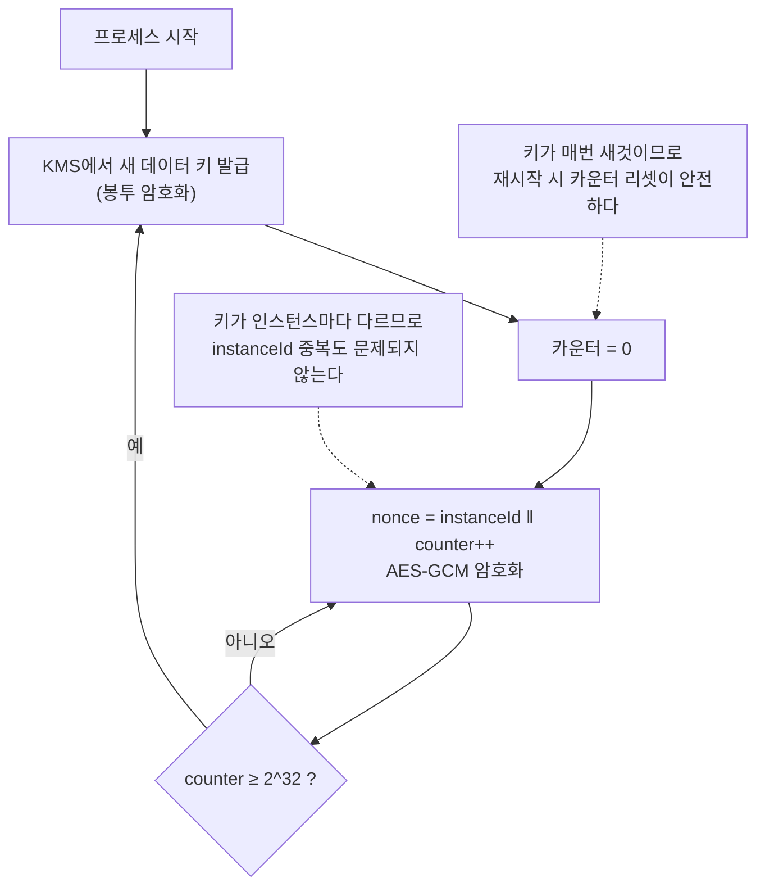

# IV와 Nonce: 초기화 벡터의 모든 것

IV(초기화 벡터)는 코드에서 12~16바이트짜리 별것 아닌 배열로 보이지만, **암호 시스템에서 가장 많은 사고가 나는 지점**이다. WEP, PS3, Zoom 모두 알고리즘이 아니라 IV/nonce 관리에서 무너졌다. 왜 필요한지, 모드마다 요구사항이 어떻게 다른지, 재사용하면 정확히 무엇이 깨지는지를 정리한다.

## 목차
- [1. 핵심 개념 (What)](#1-핵심-개념-what)
- [2. 왜 알아야 하는가 (Why)](#2-왜-알아야-하는가-why)
- [3. 내부 구현 분석 (How)](#3-내부-구현-분석-how)
- [4. 실전 예제](#4-실전-예제)
- [5. 정리](#5-정리)

---

## 1. 핵심 개념 (What)

### 1.1 IV와 Nonce의 정의

| 용어 | 풀네임 | 의미 | 사용 모드 |
|------|--------|------|----------|
| IV | Initialization Vector (초기화 벡터) | 암호화 시작 상태를 매번 다르게 만드는 초기값 | CBC, CFB, OFB |
| Nonce | Number used ONCE (한 번만 쓰는 수) | 같은 키로 절대 반복되면 안 되는 값 | CTR, GCM, ChaCha20 |

두 용어는 실무에서 자주 혼용되고, Java API도 CTR에서 `IvParameterSpec`을 쓴다. 하지만 **요구하는 성질이 다르다.**

```
IV   : 예측 불가능성(unpredictability)이 핵심   → 랜덤이어야 한다
Nonce: 유일성(uniqueness)이 핵심                → 반복만 안 되면 된다 (카운터도 OK)
```

이 차이를 모르면 "CBC에서 IV를 카운터로 써도 되지 않나?"라는 잘못된 결론에 도달한다. 답은 **안 된다**이고, 그 이유는 뒤에서 다룬다.

### 1.2 IV가 없으면 무슨 일이 생기는가

블록 암호는 결정적(deterministic) 함수다. 같은 키 + 같은 평문 = **항상 같은 암호문**.

```
IV 없이 (= ECB, 또는 고정 IV의 CBC)

  회원 A: grade="VIP"    → 암호화 → 8f3a2c...
  회원 B: grade="NORMAL" → 암호화 → 1b7e94...
  회원 C: grade="VIP"    → 암호화 → 8f3a2c...   ← A와 동일!
  회원 D: grade="NORMAL" → 암호화 → 1b7e94...   ← B와 동일!
```

공격자는 키가 없어도 이런 것들을 알아낸다.

- **어느 행과 어느 행이 같은 값인지** (등급, 성별, 지역, 질병 코드…)
- **각 값의 출현 빈도** → 빈도 분석으로 실제 값 추정
- **값이 언제 바뀌었는지** (같은 사용자의 시계열 데이터를 보면 등급 변경 시점이 드러남)

이를 암호학에서는 **IND-CPA(선택 평문 공격에 대한 구별 불가능성)를 만족하지 못한다**고 표현한다. 이상적인 암호는 "같은 평문을 두 번 암호화한 결과"와 "서로 다른 평문을 암호화한 결과"를 구별할 수 없어야 한다.

**IV는 이 결정성을 깨서 확률적 암호화(probabilistic encryption)를 만든다.**

```
IV 사용 시

  회원 A: grade="VIP" + IV1 → 8f3a2c...
  회원 C: grade="VIP" + IV2 → d41e7b...   ← 같은 평문인데 완전히 다르다
```

### 1.3 IV는 비밀이 아니다

가장 흔한 오해다. **IV는 비밀로 지킬 필요가 없다.** 암호문 앞에 붙여서 그대로 저장하고 전송한다.

이유는 두 가지다.

**첫째, 복호화에 필요하다.** CBC 복호화 식을 보면 명확하다.

```
P1 = AES⁻¹(C1) ⊕ IV
```

IV 없이는 첫 블록을 복호화할 수 없다. 그런데 IV를 비밀로 하려면 키처럼 안전하게 공유해야 하고, 메시지마다 달라지므로 사실상 불가능하다.

**둘째, 보안 모델이 IV 공개를 전제로 설계됐다.** AES-CBC와 AES-GCM의 안전성 증명은 "공격자가 IV를 알고 있다"는 가정 하에 이루어진다. IV가 공개돼도 키가 없으면 평문을 알 수 없다.

```
저장 형태
  ┌──────────┬────────────────────────┬────────┐
  │   IV     │       암호문            │  태그  │   ← 전부 공개해도 무방
  │  12~16B  │       가변 길이         │  16B   │
  └──────────┴────────────────────────┴────────┘
      ↑                                    ↑
   비밀 아님                            비밀 아님

  비밀인 것은 오직 키뿐이다.
```

**단, "비밀이 아니다"가 "아무래도 좋다"는 뜻은 절대 아니다.** IV는 공개돼도 되지만, 반드시 **매번 달라야 하고**, CBC에서는 추가로 **예측 불가능**해야 한다.

---

## 2. 왜 알아야 하는가 (Why)

### 2.1 모드마다 IV 요구사항이 다르다 — 이 문서의 핵심

같은 "IV"라는 이름을 쓰지만 요구 수준이 완전히 다르다.

| 모드 | 요구사항 | 카운터 사용 가능? | 생성 방법 |
|------|---------|-----------------|----------|
| **CBC** | 예측 불가능(unpredictable) + 유일 | ❌ **불가** | `SecureRandom` 필수 |
| **CTR** | 유일(unique) | ✅ 가능 | 랜덤 or 카운터 |
| **GCM** | 유일(unique) | ✅ 가능 (권장되기도 함) | 랜덤(96비트) or 카운터 |

**CBC는 왜 예측 불가능성까지 요구하는가?**

CBC 암호화 첫 블록은 이렇다.

```
C1 = AES_K( P1 ⊕ IV )
```

공격자가 **다음에 쓰일 IV를 미리 알 수 있고**, 동시에 자신이 원하는 평문을 암호화시킬 수 있다면(선택 평문 공격) 이런 일이 가능하다.

```
공격자의 목표: "P1이 정말 'admin'인지 확인하고 싶다"

① 과거에 관측한 암호문: C = AES_K(P_secret ⊕ IV_old)
② 다음 IV(IV_next)를 예측할 수 있다고 하자
③ 공격자는 이런 평문을 암호화 요청한다:
       P_guess = "admin" ⊕ IV_old ⊕ IV_next
④ 시스템이 계산하는 값:
       AES_K( P_guess ⊕ IV_next )
     = AES_K( "admin" ⊕ IV_old ⊕ IV_next ⊕ IV_next )
     = AES_K( "admin" ⊕ IV_old )
⑤ 이 결과가 ①의 C와 같다면 → P_secret == "admin" 확정
```

**추측을 검증할 수 있게 되는 것이다.** 이것이 2011년 TLS 1.0을 무너뜨린 **BEAST 공격**의 원리다. TLS 1.0은 이전 레코드의 마지막 암호문 블록을 다음 레코드의 IV로 재사용했는데, 그 값은 공격자가 이미 본 값이므로 완벽히 예측 가능했다. TLS 1.1이 레코드마다 명시적 랜덤 IV를 쓰도록 바뀐 이유다.

**CTR/GCM은 왜 유일성만 요구하는가?**

CTR 계열은 nonce를 **평문과 XOR하지 않는다.** 암호화 함수의 입력으로만 들어간다.

```
keystream_i = AES_K( nonce ‖ counter_i )
C_i = P_i ⊕ keystream_i
```

nonce가 예측 가능해도 AES 출력(키스트림)은 키 없이는 알 수 없다. 그래서 순차 카운터를 nonce로 써도 안전하다. **오히려 카운터가 랜덤보다 나은 경우도 있다** — 충돌 확률이 0이기 때문이다(뒤에서 설명).

> 면접 팁: "IV는 랜덤이어야 하나요?"라는 질문에 "모드에 따라 다릅니다. CBC는 예측 불가능해야 하고, GCM은 유일하기만 하면 되므로 카운터도 가능합니다"라고 답하면 원리를 이해하고 있다는 신호다.

### 2.2 GCM nonce 재사용 — 가장 치명적인 실수

CTR에서 nonce를 재사용하면 두 평문의 XOR이 노출된다. 나쁘다. 하지만 **GCM에서의 재사용은 차원이 다르다.**

```
GCM nonce 재사용의 2단계 붕괴

1단계: 기밀성 붕괴 (CTR과 동일)
   C1 ⊕ C2 = P1 ⊕ P2       ← 키스트림 소거

2단계: 무결성 붕괴 (GCM 고유, 훨씬 심각)
   같은 nonce로 만든 두 개의 (암호문, 태그) 쌍이 있으면
   GHASH의 인증 서브키 H = AES_K(0^128) 을 복원할 수 있다
        ↓
   공격자가 임의의 메시지에 대해 유효한 태그를 만들어낸다
        ↓
   위조(forgery) 가능 — 서버는 이를 정상 데이터로 받아들인다
```

**왜 H가 복원되는가?**

GHASH는 GF(2^128) 위의 다항식 평가다. 태그 T는 대략 이런 형태다.

```
T = (C_1·H^n + C_2·H^(n-1) + ... + L·H) ⊕ AES_K(nonce‖0)
                                            ↑ nonce가 같으면 이 항이 동일
```

같은 nonce로 만든 두 태그를 XOR하면 마지막 항이 소거되고, **H를 미지수로 하는 다항식 방정식**이 남는다. GF(2^128)에서 이 다항식의 근을 구하면 H가 나온다. 차수가 낮으면 순식간에 풀린다.

GCM은 무결성을 준다는 이유로 채택되는데, nonce를 재사용하면 **바로 그 무결성이 완전히 무너진다.** CBC의 IV 재사용이 "같은 평문인지 노출"에 그치고 CTR이 "평문 복원"까지 가는 데 비해, GCM은 거기에 **위조**가 더해진다. 암호화를 안 하느니만 못한 상황이 될 수 있다.

이 위험을 근본적으로 없애려는 것이 **AES-GCM-SIV**(nonce misuse-resistant)다. nonce가 재사용돼도 "같은 평문인지 노출"까지만 잃고 인증은 유지된다.

### 2.3 실제 사고 사례

**WEP (Wi-Fi, 2001) — IV 공간 고갈**

WEP는 RC4를 쓰면서 IV를 **24비트**로 잡았다.

```
IV 공간 = 2^24 = 약 1,677만 개
생일 역설로 인해 약 2^12 = 5,000개 패킷이면 충돌 확률이 유의미해진다
바쁜 AP에서는 몇 시간 만에 IV가 한 바퀴 돈다
```

게다가 IV가 평문으로 전송되고 키와 단순 연결(concatenation)되는 구조여서, 특정 "약한 IV"를 모으면 키 자체가 복원됐다(FMS 공격). **오늘날 WEP는 노트북으로 수 분 내에 뚫린다.** WPA2/WPA3로 대체된 이유다.

**Sony PlayStation 3 (2010) — ECDSA nonce 고정**

이건 암호화가 아니라 서명 쪽 사례지만, nonce 재사용의 파괴력을 가장 극적으로 보여준다.

ECDSA 서명은 매번 랜덤 nonce `k`를 생성해야 한다. **Sony는 `k`를 상수로 하드코딩했다.**

```
서명 두 개를 얻으면 (같은 k 사용):
  s1 = k⁻¹(z1 + r·d)
  s2 = k⁻¹(z2 + r·d)
        ↓ 연립방정식
  k = (z1 - z2) / (s1 - s2)
  d = (s1·k - z1) / r        ← 개인키 d 복원!
```

fail0verflow 팀이 27C3 컨퍼런스에서 이를 시연했고, **Sony의 마스터 서명 키가 복원**되어 누구나 PS3용 서명된 소프트웨어를 만들 수 있게 됐다. 같은 취약점이 2013년 안드로이드 비트코인 지갑에서도 재발해 실제 자금 도난으로 이어졌다.

**Zoom (2020) — ECB + 고정 키 유도**

앞선 [블록 암호 운용 모드](./03-block-cipher-modes.md) 문서에서 다룬 사례다. Zoom은 AES-128-ECB를 사용했는데, ECB는 아예 IV가 없는 모드다. **"IV가 없다"는 것 자체가 결함의 신호**라는 점을 기억하자.

**Microsoft Office / 여러 CVE — 고정 IV**

`new byte[16]` (전부 0)을 IV로 쓰는 코드는 놀라울 만큼 흔하다. 정적 분석 도구(SonarQube, SpotBugs Find Security Bugs)가 잡아내는 단골 항목이다.

### 2.4 SecureRandom vs Random

```java
// ❌ 절대 금지
byte[] iv = new byte[12];
new Random().nextBytes(iv);

// ❌ 더 나쁨
new Random(System.currentTimeMillis()).nextBytes(iv);

// ✅ 올바름
new SecureRandom().nextBytes(iv);
```

| 항목 | `java.util.Random` | `java.security.SecureRandom` |
|------|-------------------|----------------------------|
| 알고리즘 | 선형 합동 생성기(LCG) | OS 엔트로피 풀 기반 CSPRNG |
| 내부 상태 | **48비트** | 160비트 이상 |
| 예측 가능성 | **출력 2개면 상태 복원 → 이후 전량 예측** | 예측 불가 |
| 시드 | `nanoTime()` 기반 (추측 가능) | `/dev/urandom` 등 OS 엔트로피 |
| 스레드 안전 | 예 (경합 있음) | 예 |
| 용도 | 시뮬레이션, 게임, 테스트 | **키, IV, nonce, 토큰, salt** |

`Random`이 왜 위험한지 구체적으로 보자. LCG는 `seed = (seed * 0x5DEECE66D + 0xB) mod 2^48`로 상태를 갱신한다. **48비트는 현대 하드웨어로 전수 탐색이 가능한 크기**이고, 연속된 출력 두 개만 있으면 내부 상태가 특정된다. 그 순간 이후 생성될 모든 IV가 공개된다.

CBC에서 IV가 예측 가능하면 → BEAST 스타일 공격.
GCM에서 nonce가 예측 가능하면 → 충돌 유도 공격.

```java
// SecureRandom 생성 시 주의점
SecureRandom sr = new SecureRandom();                 // ✅ 권장. 논블로킹
SecureRandom strong = SecureRandom.getInstanceStrong(); // 상황에 따라 블로킹 가능

// Linux에서 getInstanceStrong()은 /dev/random에 매핑될 수 있다.
// 컨테이너처럼 엔트로피가 부족한 환경에서는 애플리케이션이 멈춘다.
// 대응: -Djava.security.egd=file:/dev/./urandom
```

**실무 권장: 장기 키 생성에는 `getInstanceStrong()`, 매 요청마다 만드는 IV/nonce에는 `new SecureRandom()`.** 후자도 암호학적으로 충분히 안전하며 블로킹되지 않는다.

---

## 3. 내부 구현 분석 (How)

### 3.1 IV 저장 관례 — `IV || ciphertext`

IV는 비밀이 아니므로 암호문과 함께 저장한다. 사실상의 표준은 **암호문 앞에 프리픽스로 붙이는 것**이다.

```
GCM 저장 레이아웃

byte[0..11]      byte[12 .. n-17]           byte[n-16 .. n-1]
┌──────────┬──────────────────────────────┬──────────────────┐
│  Nonce   │          Ciphertext          │   Auth Tag       │
│   12B    │          가변 길이            │      16B         │
└──────────┴──────────────────────────────┴──────────────────┘
     ↑                                              ↑
  직접 붙인다                          Java Cipher가 자동으로 붙여준다

전체를 Base64로 인코딩해 VARCHAR 컬럼에 저장
```

**Java에서 GCM 태그는 별도로 다룰 필요가 없다.** `doFinal()`이 암호문 뒤에 태그를 자동으로 이어붙이고, 복호화 시 자동으로 분리해 검증한다. 직접 관리해야 하는 것은 nonce뿐이다.

**왜 프리픽스인가?**

- 파싱이 단순하다 — 앞에서 고정 길이를 떼면 끝
- 스트리밍 처리가 가능하다 — 앞부분만 읽으면 복호화를 시작할 수 있다
- 별도 컬럼이 필요 없다 — DB 스키마가 단순해진다

**버전 바이트를 붙이는 것도 좋은 습관이다.** 나중에 알고리즘이나 키를 교체할 때 필수가 된다.

```
┌────┬──────────┬────────────┬──────┐
│ v  │  Nonce   │ Ciphertext │ Tag  │
│ 1B │   12B    │            │ 16B  │
└────┴──────────┴────────────┴──────┘
  ↑
  0x01 = AES-256-GCM, key v1
  0x02 = AES-256-GCM, key v2  (키 로테이션)
```

이 구조는 [DB 필드 암호화](../advanced/02-database-field-encryption.md)와 [키 관리와 봉투 암호화](../advanced/01-key-management-envelope-encryption.md)에서 더 자세히 다룬다.

### 3.2 랜덤 nonce의 충돌 확률

96비트 랜덤 nonce를 쓸 때 언제부터 위험해지는지 계산해보자. 생일 역설에 따르면 n개를 뽑았을 때 충돌 확률은 대략 `n² / 2^(k+1)`이다.

```
k = 96 (비트), 목표 충돌 확률 ≤ 2^-32 (NIST SP 800-38D 기준)

n² / 2^97 ≤ 2^-32
n² ≤ 2^65
n  ≤ 2^32.5 ≈ 약 60억 개
```

**하나의 키로 약 2^32개(43억) 메시지까지가 안전 한계다.** NIST SP 800-38D도 랜덤 nonce 사용 시 키당 2^32 메시지를 넘기지 말라고 명시한다.

감각을 잡아보자.

```
초당 1,000건 암호화 → 2^32건까지 약 50일
초당 10,000건       → 약 5일
```

**대용량 서비스에서는 생각보다 빨리 도달한다.** 두 가지 대응이 있다.

1. **키 로테이션** — 주기적으로 데이터 키를 교체 (봉투 암호화와 잘 맞는다)
2. **결정적 카운터 nonce** — 충돌 확률을 0으로 만든다

### 3.3 카운터 기반 nonce 관리 전략

랜덤 nonce는 확률적으로 충돌한다. 카운터는 **관리만 제대로 하면 충돌이 원리적으로 불가능**하다. NIST SP 800-38D가 제시하는 결정적 구성(deterministic construction)이다.

```
96비트 nonce 구성

┌──────────────────────┬────────────────────────┐
│   고정 필드 (32비트)   │   호출 카운터 (64비트)   │
│   인스턴스/샤드 ID     │   0, 1, 2, 3, ...      │
└──────────────────────┴────────────────────────┘

- 고정 필드: 인스턴스마다 서로 다른 값 (Pod ID, 샤드 번호 등)
- 카운터   : 인스턴스 내에서 단조 증가
→ 인스턴스가 서로 다르면 nonce가 절대 겹치지 않는다
```

**분산 환경에서의 핵심 위험**과 대응이다.

| 위험 | 시나리오 | 대응 |
|------|---------|------|
| 인스턴스 ID 중복 | 오토스케일링으로 같은 ID의 Pod가 두 개 뜸 | 중앙에서 유일 ID 발급 (etcd, DB 시퀀스) |
| 카운터 초기화 | 프로세스 재시작 시 0부터 다시 시작 | **재시작마다 새 데이터 키 발급** 또는 카운터 영속화 |
| VM 스냅샷 롤백 | 스냅샷 복원 시 카운터가 과거로 되돌아감 | 부팅 시 새 키 발급 |
| 카운터 오버플로 | 2^64 도달 | 그 전에 키 로테이션 |

**가장 현실적인 조합**은 "키 발급 + 카운터 리셋"을 묶는 것이다.



**단, 애플리케이션 레벨에서 카운터를 잘못 관리할 위험이 크다면 그냥 랜덤 96비트를 쓰는 편이 안전하다.** 43억 건 한계를 모니터링하고 주기적으로 키를 로테이션하면 충분하다. 대부분의 서비스에는 이쪽이 맞다.

---

## 4. 실전 예제

### 4.1 IV 없이 vs IV 사용 — 패턴 노출 확인

```java
@Test
void 고정_IV는_같은_평문을_같은_암호문으로_만든다() throws Exception {
    SecretKey key = KeyGenerator.getInstance("AES").generateKey();
    byte[] fixedIv = new byte[16];          // 안티패턴: 전부 0인 고정 IV

    byte[] a = encryptCbc(key, fixedIv, "grade=VIP");
    byte[] b = encryptCbc(key, fixedIv, "grade=VIP");

    // 키가 없어도 두 레코드가 같은 값임을 알 수 있다
    assertThat(a).isEqualTo(b);
}

@Test
void 랜덤_IV는_같은_평문도_매번_다르게_만든다() throws Exception {
    SecretKey key = KeyGenerator.getInstance("AES").generateKey();
    SecureRandom random = new SecureRandom();

    byte[] iv1 = new byte[16]; random.nextBytes(iv1);
    byte[] iv2 = new byte[16]; random.nextBytes(iv2);

    byte[] a = encryptCbc(key, iv1, "grade=VIP");
    byte[] b = encryptCbc(key, iv2, "grade=VIP");

    assertThat(a).isNotEqualTo(b);          // 패턴 노출 차단
}

private byte[] encryptCbc(SecretKey key, byte[] iv, String plaintext) throws Exception {
    Cipher cipher = Cipher.getInstance("AES/CBC/PKCS5Padding");
    cipher.init(Cipher.ENCRYPT_MODE, key, new IvParameterSpec(iv));
    return cipher.doFinal(plaintext.getBytes(StandardCharsets.UTF_8));
}
```

### 4.2 CTR nonce 재사용의 결과 — 평문 XOR 노출

```java
@Test
void CTR_nonce_재사용시_두_평문의_XOR이_노출된다() throws Exception {
    SecretKey key = KeyGenerator.getInstance("AES").generateKey();
    byte[] reusedIv = new byte[16];         // 같은 nonce를 두 번 사용

    byte[] c1 = encryptCtr(key, reusedIv, "attack at dawn!!");
    byte[] c2 = encryptCtr(key, reusedIv, "retreat at dusk!");

    // 공격자는 키 없이 C1 ⊕ C2 를 계산한다
    byte[] xorOfCiphertexts = xor(c1, c2);
    byte[] xorOfPlaintexts  = xor("attack at dawn!!".getBytes(UTF_8),
                                  "retreat at dusk!".getBytes(UTF_8));

    // 키스트림이 소거되어 평문끼리의 XOR이 그대로 드러난다
    assertThat(xorOfCiphertexts).isEqualTo(xorOfPlaintexts);

    // 한쪽 평문을 알면 다른 쪽이 즉시 복원된다
    byte[] recovered = xor(xorOfCiphertexts, "attack at dawn!!".getBytes(UTF_8));
    assertThat(new String(recovered, UTF_8)).isEqualTo("retreat at dusk!");
}

private byte[] xor(byte[] a, byte[] b) {
    byte[] r = new byte[Math.min(a.length, b.length)];
    for (int i = 0; i < r.length; i++) r[i] = (byte) (a[i] ^ b[i]);
    return r;
}
```

실무에서는 평문을 몰라도 된다. HTTP 헤더, JSON 키 이름(`{"userId":`), 상용구 같은 **알려진 평문 조각**을 대입해 나가는 크립 드래깅으로 양쪽 모두 복원한다.

### 4.3 안전한 IV/nonce 관리 컴포넌트

```java
package com.example.crypto;

import org.springframework.stereotype.Component;

import javax.crypto.Cipher;
import javax.crypto.SecretKey;
import javax.crypto.spec.GCMParameterSpec;
import java.nio.ByteBuffer;
import java.nio.charset.StandardCharsets;
import java.security.SecureRandom;
import java.util.Base64;

/**
 * IV || ciphertext || tag 레이아웃으로 저장하는 GCM 암호화 컴포넌트.
 *
 * 설계 원칙
 *  - nonce는 매 호출 새로 생성한다 (재사용 = 인증 키 노출)
 *  - nonce는 비밀이 아니므로 암호문에 그대로 붙인다
 *  - 버전 바이트로 키 로테이션·알고리즘 교체 여지를 남긴다
 */
@Component
public class VersionedGcmCipher {

    private static final byte VERSION_1 = 0x01;
    private static final int NONCE_LENGTH = 12;    // GCM 권장 96비트
    private static final int TAG_BITS = 128;

    /** SecureRandom은 스레드 안전하므로 인스턴스 공유 가능 */
    private final SecureRandom random = new SecureRandom();
    private final KeyProvider keyProvider;

    public VersionedGcmCipher(KeyProvider keyProvider) {
        this.keyProvider = keyProvider;
    }

    public String encrypt(String plaintext, String aad) {
        try {
            byte[] nonce = new byte[NONCE_LENGTH];
            random.nextBytes(nonce);          // 매번 새로 — 절대 캐싱하지 않는다

            SecretKey key = keyProvider.currentKey();

            Cipher cipher = Cipher.getInstance("AES/GCM/NoPadding");
            cipher.init(Cipher.ENCRYPT_MODE, key, new GCMParameterSpec(TAG_BITS, nonce));
            if (aad != null) {
                cipher.updateAAD(aad.getBytes(StandardCharsets.UTF_8));
            }
            byte[] body = cipher.doFinal(plaintext.getBytes(StandardCharsets.UTF_8));

            byte[] packed = ByteBuffer.allocate(1 + NONCE_LENGTH + body.length)
                    .put(VERSION_1)
                    .put(nonce)
                    .put(body)              // ciphertext + tag (Java가 태그를 붙여준다)
                    .array();

            return Base64.getEncoder().encodeToString(packed);
        } catch (Exception e) {
            // 예외 메시지에 평문이나 키가 섞이지 않도록 주의
            throw new IllegalStateException("암호화 실패", e);
        }
    }

    public String decrypt(String encoded, String aad) {
        try {
            ByteBuffer buffer = ByteBuffer.wrap(Base64.getDecoder().decode(encoded));

            byte version = buffer.get();
            SecretKey key = keyProvider.keyForVersion(version);   // 로테이션 대응

            byte[] nonce = new byte[NONCE_LENGTH];
            buffer.get(nonce);

            byte[] body = new byte[buffer.remaining()];
            buffer.get(body);

            Cipher cipher = Cipher.getInstance("AES/GCM/NoPadding");
            cipher.init(Cipher.DECRYPT_MODE, key, new GCMParameterSpec(TAG_BITS, nonce));
            if (aad != null) {
                cipher.updateAAD(aad.getBytes(StandardCharsets.UTF_8));
            }
            return new String(cipher.doFinal(body), StandardCharsets.UTF_8);

        } catch (Exception e) {
            // 실패 원인을 구분해 노출하지 않는다 — 오라클 제공 방지
            throw new IllegalStateException("복호화 실패", e);
        }
    }
}
```

### 4.4 카운터 기반 nonce 구현

세션/스트림 단위로 데이터 키를 새로 발급받는 경우에 쓰는 방식이다.

```kotlin
package com.example.crypto

import java.nio.ByteBuffer
import java.util.concurrent.atomic.AtomicLong

/**
 * NIST SP 800-38D 결정적 구성.
 *   [고정 필드 4B: 인스턴스 ID][카운터 8B]
 *
 * 전제: 이 인스턴스는 자신만의 데이터 키를 사용한다.
 *       (프로세스 시작 시 KMS에서 새로 발급)
 * 그래야 재시작으로 카운터가 0으로 돌아가도 nonce가 겹치지 않는다.
 */
class CounterNonceGenerator(
    private val instanceId: Int,
    private val maxInvocations: Long = 1L shl 32   // 이 지점에서 키 로테이션
) {
    private val counter = AtomicLong(0)

    fun next(): ByteArray {
        val n = counter.getAndIncrement()
        check(n < maxInvocations) {
            "nonce 카운터 한계 도달. 데이터 키를 로테이션해야 한다."
        }
        return ByteBuffer.allocate(12)
            .putInt(instanceId)     // 4바이트 고정 필드
            .putLong(n)             // 8바이트 카운터
            .array()
    }

    /** 남은 여유가 임계 이하인지 — 메트릭으로 노출해 사전 로테이션 트리거 */
    fun remainingRatio(): Double =
        (maxInvocations - counter.get()).toDouble() / maxInvocations
}
```

`remainingRatio()`를 Micrometer 게이지로 노출해두면 한계 도달 전에 키 로테이션을 자동 트리거할 수 있다.

### 4.5 안티패턴 총정리

**안티패턴 1 — 고정 IV**

```java
private static final byte[] IV = new byte[16];                       // 전부 0
private static final byte[] IV = "1234567890123456".getBytes();      // 하드코딩
private static final byte[] IV = key.getEncoded();                   // 키를 IV로
```

세 가지 모두 같은 결과다. 같은 평문 → 같은 암호문. 정적 분석 도구가 즉시 잡아낸다.

**안티패턴 2 — IV를 필드로 캐싱**

```java
// 잘못된 코드
@Component
public class BadCipher {
    private final byte[] iv = new byte[12];

    @PostConstruct
    void init() { new SecureRandom().nextBytes(iv); }   // 한 번만 생성 = 고정 IV
}
```

`SecureRandom`을 쓰긴 했지만 **한 번만 호출한다.** 애플리케이션 생애 동안 같은 IV가 쓰인다. 랜덤 생성 코드가 있다고 안심하면 안 되고, **호출 시점**을 봐야 한다.

**안티패턴 3 — `Random` 사용**

```java
new Random().nextBytes(iv);                            // 48비트 LCG
new Random(System.currentTimeMillis()).nextBytes(iv);  // 시드까지 추측 가능
ThreadLocalRandom.current().nextBytes(iv);             // 이것도 암호학적으로 안전하지 않다
```

**안티패턴 4 — IV를 키와 함께 설정 파일에 두기**

```yaml
app:
  crypto:
    aes-key: "base64키..."
    aes-iv: "base64IV..."     # ← IV가 설정에 있다 = 고정 IV라는 뜻
```

**설정 파일에 IV가 있다는 것 자체가 설계 결함의 증거다.** IV는 암호화할 때마다 생성되어 암호문에 담기는 값이지, 설정할 값이 아니다.

**안티패턴 5 — nonce 사용량을 모니터링하지 않기**

랜덤 96비트 nonce는 키당 2^32건이 한계인데, 이 카운트를 아무도 세지 않는 경우가 대부분이다. 키 로테이션 주기와 함께 메트릭으로 관리하자.

---

## 5. 정리

### 모드별 IV/Nonce 요구사항

| 모드 | 크기 | 요구 성질 | 카운터 가능 | 재사용 시 결과 |
|------|------|----------|-----------|--------------|
| ECB | 없음 | — | — | 모드 자체가 금지 |
| CBC | 16B | **예측 불가능** + 유일 | ❌ | 패턴 노출, BEAST 공격 |
| CTR | 16B | 유일 | ✅ | 평문 XOR 노출 → 평문 복원 |
| GCM | **12B** | 유일 | ✅ (권장) | **평문 복원 + 인증 키 노출 → 위조** |

### IV에 대한 오해와 사실

| 오해 | 사실 |
|------|------|
| IV는 비밀이어야 한다 | 아니다. 암호문과 함께 공개 저장/전송한다 |
| IV는 항상 랜덤이어야 한다 | CBC는 그렇다. CTR/GCM은 유일하기만 하면 된다 |
| IV가 없어도 키만 강하면 된다 | 아니다. 같은 평문이 같은 암호문이 되어 패턴이 샌다 |
| `Random`도 충분히 랜덤하다 | 아니다. 48비트 LCG는 출력 2개면 예측된다 |
| IV 재사용은 경미한 문제다 | GCM에서는 인증이 완전히 붕괴된다 |

### 실제 사고 사례

| 사례 | 원인 | 결과 |
|------|------|------|
| WEP (2001) | IV 24비트 → 공간 고갈 | 수 분 내 키 복원, 표준 폐기 |
| TLS 1.0 BEAST (2011) | 예측 가능한 CBC IV | 세션 쿠키 탈취 |
| PS3 (2010) | ECDSA nonce 상수 고정 | 마스터 개인키 복원 |
| 안드로이드 비트코인 지갑 (2013) | SecureRandom 결함으로 nonce 중복 | 실제 자금 도난 |
| Zoom (2020) | ECB 사용 (IV 자체가 없음) | E2E 암호화 주장 철회 |

### 체크리스트

| 확인 항목 | 기준 |
|----------|------|
| IV 생성기 | `SecureRandom` (`Random` 금지) |
| 생성 시점 | **매 암호화 호출마다** (필드 캐싱 금지) |
| GCM nonce 크기 | 12바이트 |
| 저장 방식 | `[버전][nonce][암호문+태그]` 프리픽스 |
| 설정 파일 | IV가 있으면 안 된다 |
| 사용량 모니터링 | 키당 2^32건 도달 전 로테이션 |
| 복호화 실패 응답 | 원인 구분 없이 동일 처리 |

> **핵심 포인트**: IV/nonce는 "암호문 앞에 붙는 랜덤 바이트"가 아니라 **결정적 암호화를 확률적 암호화로 바꾸는 장치**다. 없으면 같은 평문이 같은 암호문이 되어 키 없이도 패턴이 읽힌다. 요구사항은 모드마다 다르다 — **CBC는 예측 불가능해야 하고(BEAST 공격의 교훈), CTR/GCM은 유일하기만 하면 된다.** 그리고 IV는 비밀이 아니므로 `IV ‖ ciphertext` 형태로 함께 저장하는 것이 표준이다. 다만 "비밀이 아니다"가 "아무래도 좋다"는 뜻은 결코 아니다. **GCM에서 nonce를 재사용하면 평문이 노출되는 데 그치지 않고 GHASH 인증 서브키가 복원되어 공격자가 임의의 메시지를 위조할 수 있다** — 무결성을 얻으려고 선택한 모드가 무결성을 완전히 잃는다. WEP, PS3, 안드로이드 비트코인 지갑은 전부 알고리즘이 아니라 IV/nonce 관리에서 무너졌다. 마지막으로, IV 생성에는 반드시 `SecureRandom`을 쓰고, **호출 시점이 매 암호화마다인지** 확인하라. `@PostConstruct`에서 한 번 생성한 IV는 랜덤이 아니라 고정 IV다.

---

## 관련 문서

- [백엔드 보안 기초](../01-backend-security-fundamentals.md) — 인증/인가 전반
- [JWT / JWK / OAuth 비교](../02-jwt-jwk-oauth-comparison.md) — JWE의 IV 헤더 파라미터
- [암호화 기초: 대칭키와 비대칭키](./01-encryption-fundamentals.md) — 결정적 암호화의 문제
- [AES 알고리즘 구조](./02-aes-algorithm-structure.md) — 블록 암호가 결정적인 이유
- [블록 암호 운용 모드](./03-block-cipher-modes.md) — 모드별 IV 사용 구조
- [패딩과 오라클 공격](./05-padding-and-oracle-attack.md) — 복호화 실패 응답이 만드는 오라클
- [AEAD 인증 암호화](./06-aead-authenticated-encryption.md) — GHASH와 인증 서브키 H
- [해싱과 비밀번호 저장](./07-hashing-and-password-storage.md) — salt와 IV의 역할 비교
- [비대칭 암호와 전자서명](./08-asymmetric-crypto-and-signature.md) — ECDSA nonce와 PS3 사례
- [키 관리와 봉투 암호화](../advanced/01-key-management-envelope-encryption.md) — 키 로테이션으로 nonce 한계 관리
- [DB 필드 암호화](../advanced/02-database-field-encryption.md) — IV 프리픽스 저장 실무
- [Spring Boot 암호화 실무](../advanced/03-spring-boot-encryption-practice.md) — SecureRandom 설정과 엔트로피
- [TLS와 전송 계층 보안](../advanced/04-tls-and-transport-security.md) — TLS 1.1이 명시적 IV를 도입한 배경

---
*참고: Java 17 / Spring Boot 3.x 기준*
