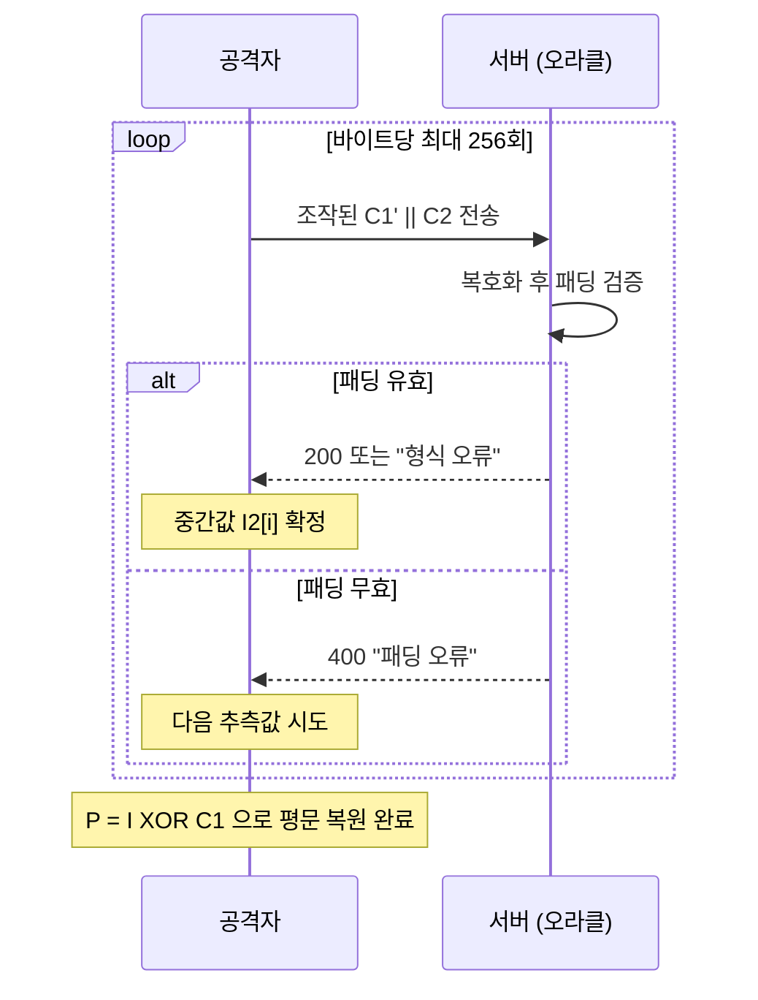

# 패딩과 패딩 오라클 공격

블록 암호가 평문을 블록 크기에 맞추기 위해 사용하는 패딩(padding)의 구조를 살펴보고, 서버의 사소한 응답 차이 하나가 어떻게 암호문 전체를 복호화하는 공격으로 이어지는지 단계별로 분석합니다.

## 목차
- [1. 핵심 개념 (What)](#1-핵심-개념-what)
- [2. 왜 알아야 하는가 (Why)](#2-왜-알아야-하는가-why)
- [3. 내부 구현 분석 (How)](#3-내부-구현-분석-how)
- [4. 실전 예제](#4-실전-예제)
- [5. 정리](#5-정리)

---

## 1. 핵심 개념 (What)

### 1.1 패딩이 필요한 이유

AES 같은 **블록 암호(block cipher)** 는 이름 그대로 고정 크기 블록 단위로만 동작합니다. AES의 블록 크기는 128비트(16바이트)로 고정되어 있습니다. 그런데 우리가 암호화하려는 데이터는 대부분 16의 배수가 아닙니다.

```
평문: "주민번호: 900101-1" → 18바이트
블록 분할: [16바이트][2바이트]  ← 두 번째 블록이 14바이트 모자람
```

이 남는 자리를 채우는 규칙이 **패딩(padding)** 입니다. 중요한 건 단순히 채우는 게 아니라, **복호화할 때 어디까지가 진짜 평문이고 어디부터가 채운 값인지 구분할 수 있어야 한다**는 점입니다. 0x00으로 채우면 원래 평문 끝이 0x00이었을 때 구분이 불가능해집니다.

### 1.2 PKCS#7 패딩

가장 널리 쓰이는 방식입니다. 규칙은 한 줄로 요약됩니다.

> **N바이트를 채워야 한다면, 값이 N인 바이트를 N개 붙인다.**

```
블록 크기 16바이트 기준

원본 13바이트 → 3바이트 부족 → 03 03 03 추가
[ 44 61 74 61 ... 41 ] [ 03 03 03 ]
                        └─ 패딩 3개

원본 15바이트 → 1바이트 부족 → 01 추가
원본 16바이트 → 0바이트 부족? → 아니오, 블록 하나를 통째로 추가
                 10 10 10 10 10 10 10 10 10 10 10 10 10 10 10 10 (0x10 = 16)
```

마지막 케이스가 핵심입니다. 평문 길이가 이미 블록 크기의 배수여도 **패딩 블록을 하나 더 붙입니다**. 그러지 않으면 복호화 측에서 "마지막 바이트가 우연히 0x03인 진짜 데이터"와 "패딩 3바이트"를 구분할 수 없기 때문입니다. 항상 패딩이 존재한다고 보장해야 모호함이 사라집니다.

복호화 시 절차는 이렇습니다.

1. 마지막 바이트 값을 읽는다 → `N`
2. `N`이 1~16 범위인지 확인한다
3. 마지막 `N`개 바이트가 모두 `N`인지 확인한다
4. 하나라도 어긋나면 → **패딩 오류(BadPaddingException)**

### 1.3 PKCS#5 vs PKCS#7

실무에서 자주 헷갈리는 부분입니다.

| 구분 | PKCS#5 | PKCS#7 |
|------|--------|--------|
| 정의된 블록 크기 | 8바이트 고정 (DES 시대) | 1~255바이트 가변 |
| AES(16바이트)에 적용 | 규격상 불가 | 가능 |
| Java 표기 | `AES/CBC/PKCS5Padding` | 사실상 동일 동작 |

Java의 `PKCS5Padding`은 이름만 PKCS#5이고 **실제 구현은 PKCS#7** 입니다. JCA가 초기 DES 시절 이름을 그대로 유지한 역사적 잔재라, AES에 `PKCS5Padding`을 써도 다른 언어의 PKCS#7과 완벽히 호환됩니다. 면접에서 "Java에서 AES에 PKCS5Padding 쓰는 게 맞나요?"라는 질문이 나오면 이 배경을 설명하면 됩니다.

### 1.4 NoPadding을 쓸 수 있는 조건

패딩이 필요 없는 경우도 있습니다. **스트림 모드(stream mode)** 로 동작하는 운용 모드가 그렇습니다.

| 모드 | 패딩 필요 | 이유 |
|------|----------|------|
| ECB, CBC | 필요 | 블록 단위로 암호화 |
| CTR, OFB, CFB | 불필요 | 키스트림과 XOR → 바이트 단위 처리 |
| GCM | 불필요 | 내부적으로 CTR 기반 |

CTR 계열은 블록 암호로 **키스트림(keystream)** 을 생성한 뒤 평문과 XOR합니다. 평문이 3바이트면 키스트림 3바이트만 잘라 쓰면 되므로 길이를 맞출 필요가 없습니다. 그래서 `AES/GCM/NoPadding`이 정상적인 조합입니다.

반대로 `AES/CBC/NoPadding`을 쓰면 평문 길이가 16의 배수가 아닐 때 `IllegalBlockSizeException`이 터집니다. 이걸 피하려고 애플리케이션에서 직접 0x00을 채우는 코드를 본 적이 있다면, 그게 바로 안티패턴입니다.

---

## 2. 왜 알아야 하는가 (Why)

### 2.1 패딩 오라클 공격의 실체

패딩 자체는 취약하지 않습니다. 문제는 **복호화 측이 패딩 검증 결과를 외부에 노출**할 때 발생합니다.

**오라클(oracle)** 이란 공격자의 질문에 예/아니오를 답해주는 존재를 말합니다. 서버가 이렇게 응답한다고 해봅시다.

```java
// 안티패턴 — 절대 이렇게 하지 마세요
try {
    String plain = decrypt(cipherText);
    return ResponseEntity.ok(process(plain));
} catch (BadPaddingException e) {
    return ResponseEntity.badRequest().body("패딩이 올바르지 않습니다");  // 오라클!
} catch (JsonParseException e) {
    return ResponseEntity.badRequest().body("데이터 형식 오류");           // 다른 응답!
}
```

공격자는 암호문을 변조해서 보낸 뒤, 응답이 "패딩 오류"인지 "형식 오류"인지만 보면 됩니다. **패딩이 맞았는지 아닌지를 1비트씩 알아내는 것만으로 평문 전체를 복원할 수 있습니다.**

### 2.2 실제 사고 사례

**MS10-070 (ASP.NET 패딩 오라클, 2010)**
ASP.NET이 ViewState와 `WebResource.axd`의 암호화된 파라미터를 처리할 때, 복호화 실패 유형에 따라 HTTP 500과 404를 다르게 반환했습니다. 공격자는 이 차이를 오라클로 삼아 머신 키를 복원하고, 결국 `web.config` 파일을 다운로드하거나 임의의 파일을 서버에 업로드할 수 있었습니다. Microsoft가 정규 패치 주기를 깨고 긴급 패치를 배포한 사건입니다.

**POODLE (CVE-2014-3566)**
SSL 3.0의 CBC 모드는 패딩 바이트의 **값을 검증하지 않고 마지막 바이트(길이)만 확인**했습니다. 공격자는 MITM 위치에서 브라우저가 SSL 3.0으로 다운그레이드하도록 유도한 뒤, 블록당 평균 256번의 요청으로 쿠키 1바이트씩을 복원했습니다. 해결책은 SSL 3.0 자체를 폐기하는 것이었습니다.

**Lucky Thirteen (CVE-2013-0169)**
TLS의 MAC-then-Encrypt 구조에서, 패딩 길이에 따라 HMAC 계산에 사용되는 블록 수가 달라진다는 점을 이용한 **타이밍 기반** 패딩 오라클입니다. 에러 메시지를 통일해도 **처리 시간의 미세한 차이**가 오라클이 될 수 있음을 보여준 사례입니다. 이름은 TLS 헤더 13바이트에서 유래했습니다.

### 2.3 백엔드 개발자에게 주는 교훈

이 세 사건의 공통점은 **암호 알고리즘 자체는 전혀 깨지지 않았다**는 것입니다. AES는 멀쩡했습니다. 깨진 건 그 주변의 에러 처리, 응답 코드, 처리 시간입니다.

실무에서 AES-CBC로 개인정보를 암호화해 DB에 저장하고, 클라이언트가 보낸 암호문을 복호화하는 API가 있다면 그 API는 잠재적 오라클입니다. "우리 서비스는 암호문을 클라이언트에 노출하지 않는다"고 해도, 쿠키·토큰·URL 파라미터 어딘가에 암호문이 있다면 대상이 됩니다.

---

## 3. 내부 구현 분석 (How)

### 3.1 CBC 복호화 구조 복습

패딩 오라클은 CBC의 복호화 구조를 그대로 이용합니다.

```
                C1                    C2
                │                     │
                ▼                     ▼
         ┌────────────┐        ┌────────────┐
         │  AES 복호화 │        │  AES 복호화 │
         └──────┬─────┘        └──────┬─────┘
                │ I1                  │ I2  ← 중간값(intermediate)
        IV ────▶⊕            C1 ─────▶⊕
                │                     │
                ▼                     ▼
                P1                    P2

P2 = I2 XOR C1        (I2 = AES_Decrypt(K, C2))
```

핵심은 **`P2 = D(C2) XOR C1`** 이라는 식입니다. 공격자는 `C1`을 마음대로 조작할 수 있고, `C2`는 그대로 두면 `I2 = D(C2)`는 변하지 않습니다. 즉 **`C1`을 바꾸면 `P2`가 원하는 대로 바뀝니다.**

### 3.2 공격 단계별 전개

목표: 마지막 블록 `C2`에 대응하는 평문 `P2`의 마지막 바이트를 알아내기.

공격자는 `C1'`(조작된 가짜 이전 블록)을 만들어 `C1' || C2`를 서버에 보냅니다.

```
[1단계] C1'의 마지막 바이트를 0x00부터 0xFF까지 전부 시도

  요청: C1'(15바이트 랜덤 + 1바이트 추측값 g) || C2
  서버: P2' = I2 XOR C1' 를 계산하고 패딩 검증

  256번 중 (거의) 정확히 1번, 서버가 "패딩 정상"을 반환한다.
  → 그 순간 P2'의 마지막 바이트는 0x01 (유효한 1바이트 패딩)

[2단계] 중간값 복원

  P2'[15] = I2[15] XOR C1'[15] = 0x01
  ∴ I2[15] = C1'[15] XOR 0x01     ← 서버 키 없이 중간값 획득!

[3단계] 진짜 평문 복원

  원래 암호문의 진짜 C1을 대입한다.
  P2[15] = I2[15] XOR C1[15]      ← 평문 마지막 바이트 확보

[4단계] 다음 바이트로 이동

  이번엔 패딩 0x02 0x02 를 노린다.
  C1'[15] = I2[15] XOR 0x02  (이미 I2[15]를 알므로 고정 가능)
  C1'[14] 를 0x00~0xFF 브루트포스 → 성공 시 I2[14] 획득

  ... 16바이트 반복
```

블록당 최대 `16 × 256 = 4096`번의 요청, 평균 2048번이면 한 블록이 완전히 복호화됩니다. 10블록짜리 암호문도 2~3만 요청이면 끝납니다. 초당 수백 요청을 보낼 수 있는 환경이면 몇 분 안에 완료됩니다.



### 3.3 오라클이 되는 신호들

에러 메시지만 문제가 아닙니다. 다음 중 **하나라도 다르면** 오라클입니다.

| 채널 | 예시 |
|------|------|
| HTTP 상태 코드 | 패딩 오류 500 vs 파싱 오류 400 |
| 응답 본문 | "복호화 실패" vs "잘못된 요청" |
| 응답 시간 | 패딩 실패 시 즉시 리턴, 성공 시 후속 로직 수행 → 수 ms 차이 |
| 응답 크기 | Content-Length 차이 |
| 로그/모니터링 | 외부에서 관측 가능한 메트릭 변화 |
| 커넥션 동작 | 특정 오류에서만 연결 종료 |

Lucky Thirteen이 증명했듯 **타이밍**이 가장 잡기 어렵습니다.

### 3.4 방어: 조합 순서가 답이다

암호화와 MAC(메시지 인증 코드)을 결합하는 순서는 세 가지입니다.

```
① MAC-then-Encrypt   : E(K, P || MAC(P))
   → 복호화(=패딩 검증)를 먼저 해야 MAC을 볼 수 있음. TLS 1.0~1.2의 CBC 조합.
     Lucky Thirteen이 여기를 뚫었다.

② Encrypt-and-MAC    : E(K, P) || MAC(P)
   → MAC이 평문에 대한 것이라 평문 정보가 새어나갈 수 있음. SSH에서 사용.

③ Encrypt-then-MAC   : C = E(K, P), C || MAC(C)   ← 권장
   → MAC을 먼저 검증. 실패하면 복호화 자체를 안 함 → 패딩 오라클 원천 차단.
```

**Encrypt-then-MAC**이 유일하게 "IND-CCA 안전"이 증명된 조합입니다. MAC 검증에 실패한 암호문은 복호화 루틴에 도달조차 하지 못하므로, 패딩 검증 결과가 외부로 새어나갈 경로가 사라집니다.

그리고 이걸 **직접 조립하지 말고 AEAD를 쓰는 것**이 근본 해결책입니다. AES-GCM은 Encrypt-then-MAC을 알고리즘 레벨에서 통합해 제공합니다. 자세한 내용은 [AEAD와 인증 암호화](./06-aead-authenticated-encryption.md)를 참고하세요.

---

## 4. 실전 예제

### 4.1 안티패턴: 오라클을 만드는 코드

```java
@RestController
public class TokenController {

    @PostMapping("/api/redeem")
    public ResponseEntity<String> redeem(@RequestBody String encryptedToken) {
        try {
            String plain = aesCbcDecrypt(encryptedToken);
            Token token = objectMapper.readValue(plain, Token.class);
            return ResponseEntity.ok(process(token));

        } catch (BadPaddingException e) {
            // 안티패턴 1: 패딩 오류를 별도 응답으로 노출
            return ResponseEntity.status(400).body("INVALID_PADDING");

        } catch (JsonProcessingException e) {
            // 안티패턴 2: 복호화는 성공했다는 사실이 드러남
            return ResponseEntity.status(422).body("MALFORMED_TOKEN");

        } catch (Exception e) {
            // 안티패턴 3: 스택트레이스 노출
            return ResponseEntity.status(500).body(e.toString());
        }
    }
}
```

이 코드는 400 / 422 / 500 세 가지 응답으로 공격자에게 완벽한 오라클을 제공합니다.

### 4.2 차선책: CBC를 유지해야 한다면 Encrypt-then-MAC

레거시 시스템이라 CBC를 버릴 수 없다면 최소한 이렇게 해야 합니다.

```java
@Component
public class EncryptThenMacCipher {

    private static final String CIPHER = "AES/CBC/PKCS5Padding";
    private static final String MAC_ALG = "HmacSHA256";
    private static final int IV_LEN = 16;

    private final SecretKey encKey;   // 암호화 키
    private final SecretKey macKey;   // MAC 키 — 반드시 분리할 것

    public byte[] encrypt(byte[] plain) throws GeneralSecurityException {
        byte[] iv = new byte[IV_LEN];
        SecureRandom.getInstanceStrong().nextBytes(iv);

        Cipher cipher = Cipher.getInstance(CIPHER);
        cipher.init(Cipher.ENCRYPT_MODE, encKey, new IvParameterSpec(iv));
        byte[] ct = cipher.doFinal(plain);

        // IV까지 MAC 범위에 포함해야 IV 변조를 막을 수 있다
        byte[] ivAndCt = concat(iv, ct);
        byte[] tag = hmac(ivAndCt);

        return concat(ivAndCt, tag);   // IV || CT || TAG
    }

    public byte[] decrypt(byte[] input) throws GeneralSecurityException {
        int tagLen = 32;  // HmacSHA256
        byte[] ivAndCt = Arrays.copyOfRange(input, 0, input.length - tagLen);
        byte[] tag     = Arrays.copyOfRange(input, input.length - tagLen, input.length);

        // 핵심 1: 복호화보다 MAC 검증이 먼저다
        // 핵심 2: MessageDigest.isEqual 은 상수 시간 비교를 보장한다
        if (!MessageDigest.isEqual(hmac(ivAndCt), tag)) {
            throw new SecurityException("integrity check failed");
        }

        byte[] iv = Arrays.copyOfRange(ivAndCt, 0, IV_LEN);
        byte[] ct = Arrays.copyOfRange(ivAndCt, IV_LEN, ivAndCt.length);

        Cipher cipher = Cipher.getInstance(CIPHER);
        cipher.init(Cipher.DECRYPT_MODE, encKey, new IvParameterSpec(iv));
        return cipher.doFinal(ct);   // 여기 도달했다면 이미 무결성이 검증된 상태
    }

    private byte[] hmac(byte[] data) throws GeneralSecurityException {
        Mac mac = Mac.getInstance(MAC_ALG);
        mac.init(macKey);
        return mac.doFinal(data);
    }
}
```

두 가지가 결정적입니다.

- `MessageDigest.isEqual()` 사용 — `Arrays.equals()`는 첫 불일치 바이트에서 즉시 반환하므로 타이밍 공격에 노출됩니다. Java 6 이후 `MessageDigest.isEqual`은 상수 시간으로 구현되어 있습니다.
- **암호화 키와 MAC 키를 반드시 분리** — 같은 키를 재사용하면 알고리즘 간 상호작용으로 취약점이 생길 수 있습니다. HKDF로 마스터 키에서 두 개를 파생하는 것이 표준적입니다.

### 4.3 정답: AEAD로 전환

```kotlin
@Component
class GcmCipher(private val key: SecretKey) {

    companion object {
        private const val TRANSFORMATION = "AES/GCM/NoPadding"  // 패딩 자체가 없다
        private const val IV_LENGTH = 12
        private const val TAG_BITS = 128
    }

    fun encrypt(plain: ByteArray): ByteArray {
        val iv = ByteArray(IV_LENGTH).also { SecureRandom().nextBytes(it) }
        val cipher = Cipher.getInstance(TRANSFORMATION).apply {
            init(Cipher.ENCRYPT_MODE, key, GCMParameterSpec(TAG_BITS, iv))
        }
        return iv + cipher.doFinal(plain)
    }

    fun decrypt(input: ByteArray): ByteArray {
        val iv = input.copyOfRange(0, IV_LENGTH)
        val ct = input.copyOfRange(IV_LENGTH, input.size)
        val cipher = Cipher.getInstance(TRANSFORMATION).apply {
            init(Cipher.DECRYPT_MODE, key, GCMParameterSpec(TAG_BITS, iv))
        }
        // 태그 검증 실패 시 AEADBadTagException — 평문은 절대 반환되지 않는다
        return cipher.doFinal(ct)
    }
}
```

GCM은 패딩이 없으므로 패딩 오라클이라는 개념 자체가 성립하지 않습니다.

### 4.4 예외 처리 통일

어떤 모드를 쓰든 컨트롤러 레벨에서는 예외를 하나로 뭉개야 합니다.

```java
@RestControllerAdvice
public class CryptoExceptionHandler {

    private static final Logger log = LoggerFactory.getLogger(CryptoExceptionHandler.class);

    // BadPaddingException, AEADBadTagException, IllegalBlockSizeException,
    // JSON 파싱 실패까지 전부 같은 응답으로 수렴시킨다
    @ExceptionHandler({
        GeneralSecurityException.class,
        SecurityException.class,
        JsonProcessingException.class
    })
    public ResponseEntity<ErrorResponse> handle(Exception e) {
        // 상세 원인은 내부 로그에만 (외부 응답에는 절대 포함하지 않음)
        log.warn("payload decryption failed", e);

        return ResponseEntity
                .status(HttpStatus.BAD_REQUEST)
                .body(new ErrorResponse("INVALID_REQUEST", "요청을 처리할 수 없습니다"));
    }
}
```

**주의할 점:** `AEADBadTagException`은 `BadPaddingException`의 하위 클래스입니다. `catch (BadPaddingException e)`로 잡으면 GCM의 태그 검증 실패까지 함께 잡히는데, 이 둘의 의미는 전혀 다릅니다. GCM에서 태그 검증 실패는 **누군가 암호문을 변조했다**는 강한 신호이므로, 로그 레벨을 높이고 보안 이벤트로 알림을 보내는 것이 맞습니다.

```java
catch (AEADBadTagException e) {
    // 변조 시도 — 보안 이벤트로 격상
    securityAuditLogger.tamperDetected(requestId, clientIp);
    throw new SecurityException("integrity violation");
}
```

### 4.5 타이밍 균일화

응답 시간 차이까지 막으려면 실패 경로에도 동일한 작업량을 부여합니다.

```java
public Result decryptSafely(byte[] input) {
    long start = System.nanoTime();
    Result result;
    try {
        result = Result.success(decrypt(input));
    } catch (GeneralSecurityException e) {
        result = Result.failure();
    }
    // 최소 응답 시간을 고정해 처리 시간 차이를 흡수
    sleepUntil(start + MIN_RESPONSE_NANOS);
    return result;
}
```

다만 이건 보조 수단입니다. 근본적으로는 **MAC 검증 실패 시점에서 이후 로직이 아예 실행되지 않도록** 설계하는 편이 훨씬 확실합니다.

---

## 5. 정리

| 항목 | 내용 |
|------|------|
| 패딩이 필요한 모드 | ECB, CBC (블록 단위 처리) |
| 패딩이 불필요한 모드 | CTR, GCM, ChaCha20 (스트림 방식) |
| PKCS#7 규칙 | N바이트 부족하면 값 N인 바이트 N개 추가, 길이가 딱 맞아도 전체 블록 추가 |
| Java의 PKCS5Padding | 이름만 PKCS#5, 실제 동작은 PKCS#7 |
| 패딩 오라클 조건 | 패딩 오류와 다른 오류를 구분 가능한 응답(코드/본문/시간/크기) |
| 공격 비용 | 블록당 평균 2048 요청으로 16바이트 전부 복원 |
| 대표 사고 | MS10-070(ASP.NET), POODLE(SSL 3.0), Lucky Thirteen(TLS 타이밍) |
| 조합 순서 | Encrypt-then-MAC만 안전. MAC-then-Encrypt는 Lucky Thirteen에 취약 |
| 근본 해결책 | AES-GCM / ChaCha20-Poly1305 등 AEAD 사용 |
| Java 주의점 | `AEADBadTagException ⊂ BadPaddingException`, `MessageDigest.isEqual`로 상수 시간 비교 |

> **핵심 포인트**: 패딩 오라클 공격은 AES를 깨는 공격이 아니라 **에러 처리를 깨는 공격**입니다. 암호 알고리즘은 완벽했지만 서버가 "패딩이 틀렸다"와 "형식이 틀렸다"를 구분해서 알려준 순간, 공격자는 키 없이도 평문을 한 바이트씩 뽑아낼 수 있게 됩니다. 실무에서 기억할 것은 세 가지입니다. 첫째, 복호화 관련 모든 실패는 **단일한 응답**으로 수렴시킬 것(상태 코드·메시지·처리 시간 모두). 둘째, CBC를 써야 한다면 반드시 **Encrypt-then-MAC**으로 무결성을 먼저 검증하고 복호화할 것. 셋째, 그리고 가장 확실한 방법은 **패딩이라는 개념이 없는 AEAD 모드(AES-GCM)로 갈아타는 것**입니다. 면접에서 "CBC와 GCM 중 무엇을 쓰겠느냐"는 질문의 정답은 GCM이며, 그 이유로 패딩 오라클과 무결성 검증 통합을 함께 설명할 수 있으면 충분합니다.

---

## 관련 문서

- [백엔드 개발자를 위한 보안 기초](../01-backend-security-fundamentals.md)
- [JWT/JWK/OAuth 비교](../02-jwt-jwk-oauth-comparison.md)
- [암호화 기초](./01-encryption-fundamentals.md)
- [AES 알고리즘 구조](./02-aes-algorithm-structure.md)
- [블록 암호 운용 모드](./03-block-cipher-modes.md)
- [IV와 Nonce](./04-iv-and-nonce.md)
- [AEAD와 인증 암호화](./06-aead-authenticated-encryption.md)
- [해시 함수와 비밀번호 저장](./07-hashing-and-password-storage.md)
- [비대칭키 암호와 전자서명](./08-asymmetric-crypto-and-signature.md)
- [키 관리와 봉투 암호화](../advanced/01-key-management-envelope-encryption.md)
- [데이터베이스 필드 암호화](../advanced/02-database-field-encryption.md)
- [Spring Boot 암호화 실무](../advanced/03-spring-boot-encryption-practice.md)
- [TLS와 전송 구간 암호화](../advanced/04-tls-and-transport-security.md)

---
*참고: Java 17 / Spring Boot 3.x 기준*
