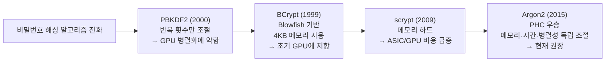

# 해시 함수와 비밀번호 저장

비밀번호는 왜 암호화가 아니라 해싱인지, SHA-256이 왜 오히려 위험한지, 그리고 BCrypt·PBKDF2·scrypt·Argon2 중 무엇을 어떤 파라미터로 골라야 하는지를 원리부터 정리합니다.

## 목차
- [1. 핵심 개념 (What)](#1-핵심-개념-what)
- [2. 왜 알아야 하는가 (Why)](#2-왜-알아야-하는가-why)
- [3. 내부 구현 분석 (How)](#3-내부-구현-분석-how)
- [4. 실전 예제](#4-실전-예제)
- [5. 정리](#5-정리)

---

## 1. 핵심 개념 (What)

### 1.1 해시 함수의 네 가지 성질

```
H: {0,1}* → {0,1}ⁿ     임의 길이 입력 → 고정 길이 출력
```

| 성질 | 의미 | 깨지면 생기는 일 |
|------|------|-----------------|
| **단방향성** (Pre-image resistance) | `h`가 주어졌을 때 `H(m)=h`인 `m`을 찾기 어렵다 | 해시에서 비밀번호 역산 가능 |
| **결정성** (Deterministic) | 같은 입력 → 항상 같은 출력 | 검증 자체가 불가능 |
| **눈사태 효과** (Avalanche effect) | 입력 1비트 변화 → 출력 절반가량 변화 | 유사한 입력 추론 가능 |
| **충돌 저항성** (Collision resistance) | `H(m₁)=H(m₂)`인 서로 다른 쌍 찾기 어렵다 | 다른 비밀번호로 로그인 가능 |

눈사태 효과를 직접 확인해 보면 감이 옵니다.

```
SHA-256("password")  = 5e884898da28047151d0e56f8dc6292773603d0d6aabbdd62a11ef721d1542d8
SHA-256("passworD")  = 6b3a55e0261b0304143f805a24924d0c1c44524821305f31d9277843b8a10f4e
                       └─ 마지막 글자 하나 바꿨을 뿐인데 완전히 다른 값
```

### 1.2 암호화 vs 해싱 — 비밀번호에 해싱을 쓰는 이유

| 구분 | 암호화 (Encryption) | 해싱 (Hashing) |
|------|--------------------|----------------|
| 방향 | 양방향 (복호화 가능) | 단방향 |
| 키 | 필요 | 불필요 |
| 목적 | 나중에 원본을 봐야 함 | 일치 여부만 확인하면 됨 |
| 예시 | 주민번호, 계좌번호, 카드번호 | 비밀번호 |

핵심 질문은 이겁니다. **"우리 서비스가 사용자의 비밀번호 원문을 알아야 할 이유가 있는가?"** 없습니다. 로그인 시 사용자가 입력한 값과 저장된 값이 같은지만 확인하면 됩니다. 그렇다면 원문을 복원할 수 있는 형태로 저장할 이유가 전혀 없습니다.

암호화로 저장하면 **키가 유출되는 순간 전체 비밀번호가 평문으로 노출**됩니다. 그리고 키는 결국 어딘가에 있어야 하므로(설정 파일, 환경변수, KMS) 유출 경로가 존재합니다. 해싱은 그 위험 자체를 제거합니다.

> 실무 신호: "비밀번호 찾기"에서 원래 비밀번호를 이메일로 보내주는 서비스는 비밀번호를 복원 가능한 형태로 저장하고 있다는 뜻입니다. 정상적인 서비스는 **재설정 링크**를 보냅니다.

### 1.3 그런데 SHA-256도 안 된다

"단방향이니까 SHA-256으로 해싱하면 되겠네"가 두 번째 함정입니다. SHA-256의 문제는 **너무 빠르다**는 것입니다.

```
SHA-256 처리 속도 (2024~2025년 기준 대략치)

  일반 서버 CPU 1코어    : 초당 약 1,000만 회
  RTX 4090 GPU 1장       : 초당 약 100억 회 (10 GH/s)
  ASIC (비트코인 채굴기)  : 초당 약 100조 회 (100 TH/s)
```

8자리 영문+숫자 비밀번호의 전체 경우의 수는 `62^8 ≈ 2.18 × 10^14` 입니다. RTX 4090 한 장이면 **약 6시간**, 여러 장이면 몇십 분입니다. 실제 사용자 비밀번호는 사전 단어 기반이 대부분이라 훨씬 빨리 뚫립니다.

해시 함수의 속도는 무결성 검증·파일 체크섬 용도에서는 **장점**이지만, 비밀번호 저장에서는 **치명적인 단점**입니다. 여기서 비밀번호 해싱이 일반 해싱과 갈라집니다.

### 1.4 레인보우 테이블과 salt

**레인보우 테이블(rainbow table)** 은 "흔한 비밀번호 → 해시값" 대응표를 미리 계산해둔 것입니다. 수 TB 크기의 테이블이 공개되어 있고, 조회는 O(1)에 가깝습니다.

**salt**는 비밀번호마다 다른 랜덤 값을 섞어 이 사전 계산을 무력화합니다.

```
salt 없음:
  user_a: SHA256("password123") = ef92b778...
  user_b: SHA256("password123") = ef92b778...   ← 같은 해시! 같은 비밀번호임이 드러남
  → 레인보우 테이블 한 번 조회로 둘 다 뚫림

salt 있음:
  user_a: SHA256("7Kx9mQ" + "password123") = a3f5...
  user_b: SHA256("pL2vNw" + "password123") = c81b...   ← 완전히 다름
  → 사용자마다 별도로 브루트포스해야 함. 사전 계산 무의미.
```

**salt는 비밀이 아닙니다.** DB에 해시와 나란히 평문으로 저장합니다. 검증하려면 반드시 필요한 값이기 때문입니다. salt의 목적은 "숨기는 것"이 아니라 **"사전 계산과 병렬 공격을 무력화하는 것"** 입니다. BCrypt·Argon2는 salt를 해시 문자열 안에 포함해서 저장합니다.

salt의 요건:
- **사용자마다 고유** (전역 공유 salt는 의미 없음)
- **암호학적 난수** (`SecureRandom`, `java.util.Random` 금지)
- **충분한 길이** (16바이트 이상 권장)
- 비밀번호 변경 시 **새로 생성**

### 1.5 pepper

**pepper**는 salt와 달리 **비밀로 관리하는 전역 시크릿**입니다.

| 구분 | salt | pepper |
|------|------|--------|
| 저장 위치 | DB (해시 옆) | 애플리케이션 시크릿 (KMS, Vault, 환경변수) |
| 비밀 여부 | 공개 | **비밀** |
| 범위 | 사용자별 고유 | 전역 공유 (또는 앱별) |
| 목적 | 사전 계산·병렬 공격 차단 | **DB만 유출됐을 때** 방어 |

pepper의 가치는 **DB 덤프 유출 시나리오**에 있습니다. SQL Injection이나 백업 파일 유출로 DB만 털렸다면, pepper를 모르는 공격자는 오프라인 브루트포스 자체를 시도할 수 없습니다.

```
저장:  hash = Argon2id(password + pepper, salt)
       └─ pepper는 DB에 없음. 애플리케이션 서버 메모리에만 존재.

DB 유출 → salt와 hash는 얻었지만 pepper를 모름 → 오프라인 공격 불가
```

pepper의 함정은 **로테이션이 어렵다**는 것입니다. 바꾸는 순간 기존 해시를 전부 검증할 수 없게 됩니다. 해결책은 HMAC 사전 처리 계층으로 분리하고 버전을 함께 저장하는 것입니다(4.3절 참고).

---

## 2. 왜 알아야 하는가 (Why)

### 2.1 실제 유출 사고들

| 사고 | 규모 | 저장 방식 | 결과 |
|------|------|----------|------|
| **LinkedIn** (2012) | 1억 6500만 | salt 없는 SHA-1 | 며칠 만에 90% 이상 복원 |
| **Adobe** (2013) | 1억 5천만 | 3DES-**ECB 암호화** + 단일 키 + 평문 힌트 | 힌트 대조로 대량 추측 |
| **Ashley Madison** (2015) | 3200만 | BCrypt(cost 12) **+ 레거시 MD5 경로** | 1100만 개가 며칠 만에 복원 |
| **Yahoo** (2013) | 30억 | salt 없는 MD5 | 사실상 전량 복원 |

특히 두 건이 중요합니다.

**Adobe**는 해싱이 아니라 **암호화**로 저장했고, 모든 사용자에게 같은 키를 썼으며, 비밀번호 힌트까지 평문으로 남겼습니다. ECB 특성상 같은 비밀번호는 같은 암호문이 되었으므로, 힌트를 대조하면 비밀번호가 추측됐습니다. "해싱 대신 암호화"의 교과서적 실패 사례입니다.

**Ashley Madison**은 BCrypt를 제대로 썼습니다. 그런데 레거시 코드에 `MD5(lowercase(username) + lowercase(password))`를 함께 저장하는 경로가 남아 있었고, 이 우회 경로 하나 때문에 전부 뚫렸습니다. **강한 알고리즘 하나보다 약한 경로 하나가 전체를 결정합니다.**

**유출은 언제든 일어난다고 가정하고, 유출 이후에도 시간을 벌 수 있는 저장 방식을 골라야 합니다.** 이게 비밀번호 해싱 설계의 전제입니다.

### 2.2 면접 관점

이 주제는 백엔드 면접의 단골입니다. 자주 나오는 질문 흐름은 이렇습니다.

1. "비밀번호를 DB에 어떻게 저장하나요?" → 해싱
2. "왜 암호화가 아니라 해싱인가요?" → 원문이 필요 없음 + 키 유출 위험
3. "SHA-256으로 해싱하면 되나요?" → **여기서 갈립니다.** 너무 빠르다는 답이 나와야 합니다
4. "salt는 어디에 저장하나요?" → DB에 평문으로. 비밀이 아님
5. "BCrypt와 Argon2 중 뭘 쓰겠습니까?" → 신규는 Argon2id, 근거는 메모리 하드니스
6. "알고리즘을 바꾸려면 기존 사용자는?" → `DelegatingPasswordEncoder`로 점진 마이그레이션

3번과 6번에서 대부분이 막힙니다.

---

## 3. 내부 구현 분석 (How)

### 3.1 키 스트레칭과 work factor

**키 스트레칭(key stretching)** 은 해시 계산을 의도적으로 느리게 만드는 기법입니다. 같은 연산을 수만~수십만 번 반복하거나 대량의 메모리를 요구하게 만듭니다.

```
  SHA-256 1회      : 0.00001ms  → 공격자가 초당 1억 회 시도 가능
  BCrypt cost=12   : ~250ms     → 공격자가 초당 4회 시도

  1억 배 차이. 6시간 걸릴 공격이 수십만 년이 된다.
```

**work factor**(비용 인자)는 이 반복량을 조절하는 파라미터로, 하드웨어가 빨라지면 값을 올려 방어력을 유지합니다. 이게 비밀번호 해싱이 일반 해시와 갈라지는 결정적 지점입니다. 기준은 **로그인 1회당 200~500ms** — 너무 높이면 로그인 API 자체가 DoS 표면이 됩니다.

### 3.2 알고리즘 비교



| 알고리즘 | 방어 대상 | 주요 파라미터 | 특징 |
|----------|----------|--------------|------|
| **PBKDF2** | CPU 시간 | 반복 횟수, 해시 알고리즘, salt 길이 | FIPS 140 승인. GPU 병렬화에 상대적으로 취약 |
| **BCrypt** | CPU 시간 + 소량 메모리 | cost (log₂ 반복) | 4KB 고정 메모리. **72바이트 입력 제한** |
| **scrypt** | CPU + **메모리** | N(비용), r(블록), p(병렬) | 메모리 하드. 파라미터 조합이 까다로움 |
| **Argon2id** | CPU + **메모리** + 병렬화 | m(메모리), t(반복), p(병렬도) | PHC 우승자. **현재 표준 권장** |

**왜 메모리가 중요한가?** GPU는 코어가 수천 개지만 코어당 사용 가능한 메모리는 적습니다. ASIC도 마찬가지로 메모리를 많이 넣으면 단가가 급등합니다. 알고리즘이 64MB를 요구하면, GPU가 아무리 코어가 많아도 동시에 돌릴 수 있는 인스턴스 수가 메모리에 의해 제한됩니다. **메모리 하드니스(memory-hardness)** 는 공격자의 하드웨어 우위를 직접 깎는 방어입니다.

**Argon2 변종**
- `Argon2d` — 데이터 의존적 메모리 접근. GPU 저항 최고지만 **사이드채널에 취약**
- `Argon2i` — 데이터 독립적 접근. 사이드채널 안전하지만 GPU 저항 약간 낮음
- `Argon2id` — 하이브리드(1차 패스는 i, 이후 d). **OWASP 권장**

### 3.3 파라미터 선택 기준 (OWASP 2024~2025 기준)

```
Argon2id  (1순위)
  m = 19456 KiB (19MiB), t = 2, p = 1     ← 최소 기준
  m = 46080 KiB (45MiB), t = 1, p = 1     ← 대안
  m = 65536 KiB (64MiB), t = 3, p = 4     ← 여유 있는 환경 권장

scrypt    (Argon2 불가 시)
  N = 2^17 (131072), r = 8, p = 1         ← 약 128MB 사용

BCrypt    (레거시/호환)
  cost = 10 이상, 2025년 기준 12 권장
  cost 12 ≈ 250ms, cost 13 ≈ 500ms (하드웨어에 따라 다름)

PBKDF2    (FIPS 준수가 필요할 때만)
  PBKDF2-HMAC-SHA256: 600,000회 이상
  PBKDF2-HMAC-SHA512: 210,000회 이상
```

**반드시 실측하세요.** 위 수치는 출발점일 뿐이고, 실제 운영 서버에서 벤치마크해서 200~500ms에 맞추는 것이 맞습니다.

### 3.4 BCrypt의 72바이트 함정

BCrypt는 **입력의 앞 72바이트만 사용합니다.** 나머지는 조용히 버려집니다.

```
"A"*72 + "1"  과  "A"*72 + "2"  → 같은 해시!
```

현실적으로 문제가 되는 상황들입니다.

1. **긴 패스프레이즈** — "correct horse battery staple..." 같은 문장형은 72바이트를 쉽게 넘습니다.
2. **한글 비밀번호** — UTF-8에서 한글 1자 = 3바이트. 24자면 이미 한계입니다.
3. **pepper 사전 결합** — `password + pepper`로 합치면 pepper 때문에 비밀번호 부분이 잘릴 수 있습니다.

BCrypt를 계속 써야 한다면 표준 회피책은 **SHA-256 사전 해싱 후 Base64 인코딩**입니다.

```java
// SHA-256(32바이트) → Base64(44바이트) → BCrypt 72바이트 한계 내
String pre = Base64.getEncoder().encodeToString(sha256(rawPassword));
String hash = bcrypt.encode(pre);
```

hex 인코딩(64자)은 pepper까지 붙이면 초과하므로 Base64(44자)를 쓰세요. raw 바이트를 그대로 넘겨서도 안 됩니다 — C 문자열 규약을 따르는 BCrypt 구현은 0x00에서 잘립니다. Spring Security의 `BCryptPasswordEncoder`는 Java 구현이라 null 바이트 문제는 없지만 **72바이트 절단은 그대로 발생합니다.**

### 3.5 상수 시간 비교와 타이밍 공격

해시 비교에서 `String.equals()`나 `Arrays.equals()`를 쓰면 **첫 불일치 바이트에서 즉시 반환**합니다. 공격자 입력이 정답과 앞부분이 일치할수록 비교가 아주 살짝 오래 걸리고, 이 차이를 수천 번 측정하면 한 바이트씩 알아낼 수 있습니다.

```java
if (storedHash.equals(computedHash)) { ... }                   // ❌ 타이밍 노출
if (MessageDigest.isEqual(a.getBytes(UTF_8), b.getBytes(UTF_8))) { ... }  // ✅ 상수 시간
```

다행히 **BCrypt/Argon2의 `matches()`는 내부적으로 상수 시간 비교를 하므로 대부분 자동 해결됩니다.** 직접 HMAC 태그나 API 키를 비교하는 코드에서 주의하면 됩니다.

**더 실질적인 타이밍 누출은 "사용자 존재 여부"입니다.**

```java
// ❌ 안티패턴: 사용자가 없으면 즉시 반환 → 응답 시간으로 계정 존재 여부가 새어나간다
User user = repository.findByEmail(email);
if (user == null) {
    return LoginResult.fail();            // 1ms
}
if (!encoder.matches(password, user.getHash())) {
    return LoginResult.fail();            // 250ms  ← 차이가 명확
}
```

공격자는 응답 시간만 보고 **어떤 이메일이 가입되어 있는지 열거(user enumeration)** 할 수 있습니다. 해결책은 사용자가 없어도 더미 해시로 검증을 수행하는 것입니다.

---

## 4. 실전 예제

### 4.1 Spring Security PasswordEncoder 설정

```java
@Configuration
public class PasswordConfig {

    /**
     * DelegatingPasswordEncoder:
     *   저장 형식이 {id}hash 라서, 해시만 보고 어떤 알고리즘인지 알 수 있다.
     *   예) {argon2}$argon2id$v=19$m=65536,t=3,p=4$c2FsdA$hash...
     *       {bcrypt}$2a$12$abcdefg...
     */
    @Bean
    public PasswordEncoder passwordEncoder() {
        String idForEncode = "argon2";

        Map<String, PasswordEncoder> encoders = new HashMap<>();

        // 신규 가입 · 재해싱에 사용
        encoders.put("argon2", new Argon2PasswordEncoder(
                16,      // saltLength (bytes)
                32,      // hashLength (bytes)
                4,       // parallelism (p)
                65536,   // memory (KiB) = 64MiB
                3        // iterations (t)
        ));

        // 기존 사용자 검증용 (마이그레이션 대상)
        encoders.put("bcrypt", new BCryptPasswordEncoder(12));
        encoders.put("pbkdf2", Pbkdf2PasswordEncoder.defaultsForSpringSecurity_v5_8());

        DelegatingPasswordEncoder encoder =
                new DelegatingPasswordEncoder(idForEncode, encoders);

        // {id} 접두사가 없는 초기 레거시 해시 대응 (예: 순수 bcrypt 문자열)
        encoder.setDefaultPasswordEncoderForMatches(new BCryptPasswordEncoder(10));

        return encoder;
    }
}
```

`Argon2PasswordEncoder`를 쓰려면 `org.bouncycastle:bcprov-jdk18on` 의존성이 필요합니다.

### 4.2 알고리즘 마이그레이션 — 로그인 시 자동 업그레이드

전체 사용자의 비밀번호를 한 번에 재해싱할 수는 없습니다(원문을 모르니까). 정답은 **로그인 성공 순간에 재해싱**하는 점진적 마이그레이션입니다.

```java
@Service
@RequiredArgsConstructor
public class AuthenticationService {

    private final UserRepository userRepository;
    private final PasswordEncoder passwordEncoder;

    // 사용자가 없을 때도 동일한 연산량을 쓰기 위한 더미 해시
    private static final String DUMMY_HASH =
            "{argon2}$argon2id$v=19$m=65536,t=3,p=4$RFhFVEg0eDlxUXc$" +
            "0000000000000000000000000000000000000000000";

    @Transactional
    public LoginResult login(String email, String rawPassword) {
        User user = userRepository.findByEmail(email).orElse(null);

        if (user == null) {
            // 타이밍 균일화 — 계정 열거(user enumeration) 방지
            passwordEncoder.matches(rawPassword, DUMMY_HASH);
            return LoginResult.fail("이메일 또는 비밀번호가 올바르지 않습니다");
        }

        if (!passwordEncoder.matches(rawPassword, user.getPasswordHash())) {
            loginAttemptService.recordFailure(email);
            // 실패 메시지는 항상 동일하게
            return LoginResult.fail("이메일 또는 비밀번호가 올바르지 않습니다");
        }

        // 핵심: 구식 알고리즘/약한 파라미터로 저장된 해시를 이 순간 갱신한다
        if (passwordEncoder.upgradeEncoding(user.getPasswordHash())) {
            user.updatePasswordHash(passwordEncoder.encode(rawPassword));
            log.info("password hash upgraded. userId={}", user.getId());
        }

        loginAttemptService.reset(email);
        return LoginResult.success(user);
    }
}
```

`upgradeEncoding()`이 이 패턴의 핵심입니다. `DelegatingPasswordEncoder`는 저장된 해시의 `{id}`가 현재 `idForEncode`와 다르면 `true`를 반환합니다. 로그인할 때마다 조금씩 마이그레이션이 진행되고, 몇 달 뒤 미전환 계정은 강제 재설정을 요구하면 됩니다.

```
마이그레이션 진행 예시

  1개월차: bcrypt 100% → argon2 45%   (MAU 비율만큼 자동 전환)
  3개월차: bcrypt  20% → argon2 80%
  6개월차: 잔여 계정에 비밀번호 재설정 안내 메일 → 전환 완료
```

### 4.3 pepper 적용 (버전 관리 포함)

```java
@Component
@RequiredArgsConstructor
public class PepperedPasswordEncoder {

    private final PasswordEncoder delegate;
    private final PepperKeyProvider pepperProvider;   // KMS/Vault에서 조회

    public String encode(String rawPassword) {
        return delegate.encode(applyPepper(rawPassword, pepperProvider.currentVersion()));
    }

    public boolean matches(String rawPassword, String storedHash, int pepperVersion) {
        return delegate.matches(applyPepper(rawPassword, pepperVersion), storedHash);
    }

    /**
     * HMAC으로 pepper를 적용한다.
     *  - 단순 문자열 결합보다 안전 (길이 확장/절단 이슈 회피)
     *  - Base64 출력 44바이트 → BCrypt 72바이트 제한 안쪽
     *  - 버전별 키로 pepper 로테이션 지원
     */
    private String applyPepper(String rawPassword, int version) {
        try {
            Mac mac = Mac.getInstance("HmacSHA256");
            mac.init(pepperProvider.key(version));
            return Base64.getEncoder()
                    .encodeToString(mac.doFinal(rawPassword.getBytes(StandardCharsets.UTF_8)));
        } catch (GeneralSecurityException e) {
            throw new IllegalStateException("pepper application failed", e);
        }
    }
}
```

pepper 버전은 `users.pepper_version` 컬럼에 함께 저장합니다. 로테이션 시 새 버전으로 저장하고, 기존 사용자는 로그인 시점에 새 버전으로 재해싱하면 4.2절과 같은 방식으로 전환됩니다.

**중요:** pepper는 **DB와 다른 신뢰 경계**에 있어야 의미가 있습니다. DB 접속 정보와 같은 설정 파일에 넣어두면 함께 유출되어 무의미합니다. AWS KMS, HashiCorp Vault, AWS Secrets Manager 등을 쓰세요. 자세한 내용은 [키 관리와 봉투 암호화](../advanced/01-key-management-envelope-encryption.md)를 참고하세요.

### 4.4 안티패턴 모음

```java
// ❌ 1. 암호화로 저장 (Adobe 사례)
String stored = aesEncrypt(password, GLOBAL_KEY);

// ❌ 2. 빠른 해시 (LinkedIn, Yahoo 사례)
String stored = DigestUtils.sha256Hex(password);
String stored = DigestUtils.md5Hex(password);

// ❌ 3. salt 없음 / 전역 salt
String stored = sha256("MY_FIXED_SALT" + password);

// ❌ 4. 예측 가능한 salt
String salt = String.valueOf(user.getId());          // 순차값
String salt = String.valueOf(System.currentTimeMillis());
String salt = new Random().toString();               // SecureRandom 아님

// ❌ 5. 자체 제작 스트레칭
String h = password;
for (int i = 0; i < 1000; i++) h = sha256(h);        // 충돌 위험 + 병렬화 방어 없음

// ❌ 6. 로그에 비밀번호 노출
log.debug("login attempt: email={}, password={}", email, rawPassword);

// ❌ 7. 응답 메시지로 계정 존재 여부 노출
if (user == null) return fail("등록되지 않은 이메일입니다");
if (!matches)     return fail("비밀번호가 일치하지 않습니다");

// ❌ 8. work factor를 너무 낮게
new BCryptPasswordEncoder(4);   // 기본 생성자는 10, 4는 거의 무방비

// ❌ 9. 비밀번호 최대 길이를 짧게 제한
@Size(max = 20)   // 패스프레이즈를 막는다. 최소 8, 최대 64~128이 권장
private String password;

// ❌ 10. 강한 알고리즘 옆에 약한 경로 존치 (Ashley Madison 사례)
// 레거시 검증 fallback 을 무기한 남겨두지 말 것
```

### 4.5 엔티티와 DTO 설계

```java
@Entity @Table(name = "users")
public class User {
    @Id @GeneratedValue private Long id;

    // {id} 접두사가 붙는 형식이라 넉넉히. Argon2 해시는 100자 내외
    @Column(name = "password_hash", nullable = false, length = 255)
    private String passwordHash;

    @Column(name = "pepper_version", nullable = false)
    private int pepperVersion;              // pepper 로테이션 추적용

    // toString에서 해시를 절대 노출하지 않는다
    @Override public String toString() { return "User{id=" + id + "}"; }
}

public record LoginRequest(
    @Email @NotBlank String email,
    @NotBlank @Size(min = 8, max = 128) String password   // 상한을 넉넉히
) {
    @Override public String toString() {
        return "LoginRequest{email='" + email + "', password='***'}";
    }
}
```

`record`의 기본 `toString()`은 모든 필드를 출력합니다. 디버그 로그나 예외 메시지에 요청 객체가 찍히는 순간 비밀번호가 평문으로 로그에 남으므로 **반드시 오버라이드하세요.** Lombok `@ToString`도 같은 함정입니다.

---

## 5. 정리

| 항목 | 내용 |
|------|------|
| 비밀번호 저장 방식 | 암호화 ❌ / 해싱 ✅ — 원문이 필요 없고 키 유출 위험도 제거 |
| SHA-256 부적합 이유 | 너무 빠름. GPU 초당 100억 회 → 8자리 비밀번호 수 시간 |
| salt | 사용자별 고유 랜덤값, **비밀 아님**, DB에 평문 저장, 16바이트 이상 |
| pepper | 전역 비밀 시크릿, DB 밖(KMS/Vault)에 보관, DB만 유출됐을 때 방어 |
| 키 스트레칭 | 계산을 의도적으로 느리게. 목표 **200~500ms/로그인** |
| PBKDF2 | CPU만 방어. FIPS 필요 시. SHA-256 기준 60만 회 이상 |
| BCrypt | cost 12 권장. **72바이트 절단 함정** |
| scrypt | 메모리 하드. N=2^17, r=8, p=1 |
| **Argon2id** | **현재 권장**. m=64MiB, t=3, p=4. 메모리·시간·병렬성 독립 조절 |
| 상수 시간 비교 | `MessageDigest.isEqual()`. `equals()` 금지 |
| 계정 열거 방지 | 사용자 없을 때도 더미 해시로 검증, 실패 메시지 통일 |
| 마이그레이션 | `DelegatingPasswordEncoder` + `upgradeEncoding()` 로 로그인 시 재해싱 |
| 대표 사고 | LinkedIn(salt 없는 SHA-1), Adobe(3DES-ECB 암호화), Ashley Madison(약한 레거시 경로), Yahoo(salt 없는 MD5) |

> **핵심 포인트**: 비밀번호 저장의 본질은 **"유출은 언젠가 일어난다고 가정하고, 유출 이후에 시간을 버는 것"** 입니다. 그래서 세 단계로 생각하면 됩니다. 첫째, **해싱**이지 암호화가 아닙니다 — 원문을 알 필요가 없는데 복원 가능한 형태로 두면 키 유출 하나로 전부 무너집니다(Adobe). 둘째, **느린 해시**여야 합니다 — SHA-256은 무결성 검증에는 훌륭하지만 비밀번호에는 재앙입니다(LinkedIn, Yahoo). 셋째, **사용자별 salt + 애플리케이션 pepper**로 사전 계산과 오프라인 공격을 동시에 막습니다. 알고리즘 선택은 신규라면 고민 없이 **Argon2id(m=64MiB, t=3, p=4)**, 레거시 호환이 필요하면 BCrypt cost 12이고, BCrypt를 쓴다면 **72바이트 절단**을 반드시 기억해야 합니다. 그리고 실무에서 가장 자주 놓치는 두 가지 — 마이그레이션은 `DelegatingPasswordEncoder`의 `upgradeEncoding()`으로 **로그인 시점에 점진적으로** 하고, 사용자가 없을 때도 더미 해시로 검증해서 **응답 시간으로 계정 존재 여부가 새어나가지 않게** 하세요. Ashley Madison이 증명했듯, 강한 알고리즘 하나를 도입하는 것보다 **약한 경로를 하나도 남기지 않는 것**이 더 중요합니다.

---

## 관련 문서

- [백엔드 개발자를 위한 보안 기초](../01-backend-security-fundamentals.md)
- [JWT/JWK/OAuth 비교](../02-jwt-jwk-oauth-comparison.md)
- [암호화 기초](./01-encryption-fundamentals.md)
- [AES 알고리즘 구조](./02-aes-algorithm-structure.md)
- [블록 암호 운용 모드](./03-block-cipher-modes.md)
- [IV와 Nonce](./04-iv-and-nonce.md)
- [패딩과 패딩 오라클 공격](./05-padding-and-oracle-attack.md)
- [AEAD와 인증 암호화](./06-aead-authenticated-encryption.md)
- [비대칭키 암호와 전자서명](./08-asymmetric-crypto-and-signature.md)
- [키 관리와 봉투 암호화](../advanced/01-key-management-envelope-encryption.md)
- [데이터베이스 필드 암호화](../advanced/02-database-field-encryption.md)
- [Spring Boot 암호화 실무](../advanced/03-spring-boot-encryption-practice.md)
- [TLS와 전송 구간 암호화](../advanced/04-tls-and-transport-security.md)

---
*참고: Java 17 / Spring Boot 3.x 기준*
