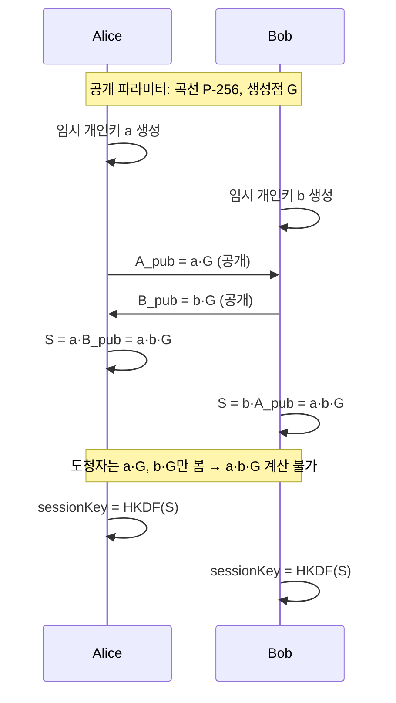

# 비대칭키 암호와 전자서명

공개키와 개인키가 왜 짝을 이루는지, RSA 암호화와 RSA 서명이 왜 키 사용이 반대인지, 그리고 JWT 서명 알고리즘을 고를 때 무엇을 봐야 하는지를 원리부터 실무 판단까지 정리합니다.

## 목차
- [1. 핵심 개념 (What)](#1-핵심-개념-what)
- [2. 왜 알아야 하는가 (Why)](#2-왜-알아야-하는가-why)
- [3. 내부 구현 분석 (How)](#3-내부-구현-분석-how)
- [4. 실전 예제](#4-실전-예제)
- [5. 정리](#5-정리)

---

## 1. 핵심 개념 (What)

### 1.1 대칭키의 한계에서 출발하기

AES는 빠르고 안전하지만 근본 문제가 있습니다. **키를 어떻게 상대방에게 전달할 것인가?** 안전한 채널이 있어야 키를 보낼 수 있는데, 그런 채널이 있다면 애초에 암호화가 필요 없습니다(키 배송 문제). 게다가 N명이 서로 통신하려면 `N(N-1)/2`개의 키가 필요합니다 — 1000명이면 499,500개입니다.

비대칭키 암호는 **수학적으로 연결되어 있지만 한쪽에서 다른 쪽을 계산할 수 없는 키 쌍**으로 이를 해결합니다.

```
공개키 (Public Key)  : 누구에게나 공개. 배포해도 됨
개인키 (Private Key) : 절대 공개 금지. 소유자만 보관

공개키로 암호화 → 개인키로만 복호화   (기밀성)
개인키로 서명   → 공개키로 검증      (인증/무결성/부인방지)
```

### 1.2 수학적 기반

```
[RSA — 소인수분해의 어려움]
  n = p × q (p, q는 큰 소수),  e = 65537,  d = e⁻¹ mod φ(n)
  공개키 = (n, e)   개인키 = (n, d)
  암호화: c = m^e mod n     복호화: m = c^d mod n

  n을 p, q로 분해할 수 있으면 d를 계산할 수 있다.
  2048비트(약 617자리) n은 현존 컴퓨터로 분해 불가.
  (공개 분해 최고 기록: RSA-250 = 829비트, 2020년)

[ECC — 타원곡선 이산로그의 어려움]
  곡선 y² = x³ + ax + b 위의 생성점 G와 정수 k에 대해  P = k·G
    k, G → P : 쉬움 (double-and-add)
    P, G → k : 매우 어려움 (ECDLP)
  개인키 = k,  공개키 = P = k·G
```

RSA의 소인수분해에는 **준지수 시간** 알고리즘(GNFS)이 있지만, 타원곡선 이산로그에는 **완전 지수 시간** 알고리즘(Pollard ρ)뿐입니다. 이 차이가 곧 키 길이 차이입니다.

### 1.3 RSA 암호화 vs RSA 서명 — 키 사용이 반대다

가장 헷갈리는 부분이자 면접 단골입니다.

```
[암호화] 목적: 나만 읽을 수 있게
  Alice ── E(Bob_공개키, m) ──▶ Bob ── D(Bob_개인키) ──▶ m
  누구나 보낼 수 있고, Bob만 읽을 수 있다.

[서명]   목적: 내가 썼다는 걸 증명
  Alice ── m, S(Alice_개인키, m) ──▶ 누구나 ── V(Alice_공개키) ──▶ OK
  Alice만 만들 수 있고, 누구나 확인할 수 있다.
```

| 구분 | 암호화 | 서명 |
|------|--------|------|
| 생성에 쓰는 키 | **수신자의 공개키** | **송신자의 개인키** |
| 검증/복원에 쓰는 키 | 수신자의 개인키 | 송신자의 공개키 |
| 만들 수 있는 사람 | 누구나 | 개인키 소유자만 |
| 확인할 수 있는 사람 | 개인키 소유자만 | 누구나 |
| 보장 | 기밀성 | 인증·무결성·부인방지 |

> "RSA는 암호화와 서명이 대칭이라 키만 바꿔 끼우면 된다"는 설명은 **개념적으로만** 맞습니다. 실제로는 패딩 스킴이 완전히 다르므로(OAEP vs PSS) 같은 키를 두 용도로 쓰면 안 됩니다.

### 1.4 전자서명이 보장하는 것

| 속성 | 의미 | HMAC으로도 가능? |
|------|------|-----------------|
| **인증** | 정당한 발신자가 만들었다 | ✅ |
| **무결성** | 내용이 변조되지 않았다 | ✅ |
| **부인방지** | "내가 안 했다"고 부인할 수 없다 | ❌ |

부인방지가 전자서명 고유의 속성입니다. HMAC은 송수신자가 **같은 키를 공유**하므로 수신자도 태그를 만들 수 있어 "네가 만든 거잖아"라는 반박이 가능합니다. 전자서명은 개인키를 서명자만 가지므로 이 반박이 성립하지 않습니다. 전자계약, 금융 거래 지시, 코드 서명, 감사 로그에서 결정적입니다.

### 1.5 왜 "해시 후 서명"인가

전자서명은 메시지 전체가 아니라 **해시에 서명**합니다: `sig = Sign(privateKey, SHA-256(message))`.

1. **성능** — RSA 서명은 느립니다. 10MB 파일 대신 32바이트 해시에 서명하면 크기와 무관하게 일정합니다.
2. **크기 제약** — RSA는 모듈러스 `n`보다 작은 값만 처리합니다(2048비트 키 = 256바이트).
3. **위조 방지** — raw RSA는 `Sign(m1) × Sign(m2) = Sign(m1×m2)`라는 **곱셈 준동형성**이 있어 유효한 서명을 조작해 만들 수 있습니다. 해시가 이 대수 구조를 깨뜨립니다.

---

## 2. 왜 알아야 하는가 (Why)

### 2.1 RSA 패딩 취약점

**Bleichenbacher 공격(1998)** — 서버가 PKCS#1 v1.5 패딩 검증 결과를 알려주면(오라클), 약 100만 건의 요청으로 개인키 없이 암호문을 복호화할 수 있습니다. 이 공격은 죽지 않고 20년 뒤 **ROBOT(2017)** 으로 부활해 Facebook, PayPal, Cisco의 TLS 구현이 여전히 취약함이 드러났습니다. 원인은 [패딩 오라클 공격](./05-padding-and-oracle-attack.md)과 동일한 구조 — 에러 응답의 차이입니다.

서명 쪽도 마찬가지로, PKCS#1 v1.5 서명 검증이 허술하면(특히 지수 `e=3`) 개인키 없이 유효해 보이는 서명을 위조할 수 있습니다(Bleichenbacher'06, BERserk). Firefox의 NSS와 OpenSSL이 반복적으로 겪었습니다.

| 용도 | 레거시 (취약) | 권장 | Java 표기 |
|------|--------------|------|----------|
| 암호화 | PKCS#1 v1.5 | **OAEP** (랜덤성+MGF1) | `"RSA/ECB/OAEPWithSHA-256AndMGF1Padding"` |
| 서명 | PKCS#1 v1.5 | **PSS** (salt로 확률적) | `Signature.getInstance("RSASSA-PSS")` |

두 방식 모두 형식적 안전성 증명이 있습니다. 암호화 표기의 `ECB`는 블록 모드가 아니라 JCA의 표기상 잔재입니다.

### 2.2 alg=none 취약점 (JWT)

JWT 역사상 가장 유명한 취약점입니다.

```
정상:   {"alg":"RS256"} . {"role":"user"}  . <RSA 서명>
조작:   {"alg":"none"}  . {"role":"admin"} . (빈 문자열)

→ 라이브러리가 헤더의 alg를 그대로 신뢰하면 서명 검증을 건너뛰고 통과시킨다
```

2015년 Auth0의 Tim McLean이 다수 라이브러리에서 발견해 공개했습니다. **근본 원인은 "검증 방법을 검증 대상이 지정한다"는 설계 결함**입니다.

형제 취약점인 **알고리즘 혼동(algorithm confusion)** 은 더 교묘합니다.

```
서버가 RS256으로 발급하고 공개키 P로 검증한다. 공개키는 공개되어 있다.

공격자: alg를 HS256으로 바꾸고, 공개키 P를 HMAC 키로 써서 서명한다.
서버:   "alg가 HS256이네" → HMAC 검증 → 키로 P 사용 → 통과!
        공개키가 대칭키로 둔갑한다.
```

**방어는 하나뿐입니다: 서버가 허용할 알고리즘을 코드에 고정하고, 토큰의 `alg` 헤더는 무시한다.**

### 2.3 전방 비밀성 (Forward Secrecy)

```
[없는 경우] RSA 키 교환 (TLS 1.2 이전)
  ① 클라이언트가 세션 키를 서버 공개키로 암호화해 전송
  ② 공격자가 트래픽을 수년간 녹화
  ③ 나중에 서버 개인키 유출
  ④ → 녹화된 과거 트래픽 전부 복호화 가능 ☠️

[있는 경우] ECDHE
  ① 매 세션마다 일회용(ephemeral) 키 쌍으로 DH 키 교환
  ② 세션 종료 시 일회용 키 폐기
  ③ 장기 개인키는 "이 공개키가 진짜 서버 것"임을 서명할 뿐
  ④ → 장기 개인키가 유출돼도 과거 세션은 안전 ✅
```

Snowden 폭로 이후 대형 서비스가 일제히 ECDHE로 전환했고, **TLS 1.3은 아예 RSA 키 교환을 제거**하고 (EC)DHE만 허용합니다. 자세한 내용은 [TLS와 전송 구간 암호화](../advanced/04-tls-and-transport-security.md)를 참고하세요.

---

## 3. 내부 구현 분석 (How)

### 3.1 ECC가 짧은 키로 같은 강도를 내는 이유

| 보안 강도 | 대칭키 | RSA | ECC |
|-----------|--------|-----|-----|
| 112비트 | 112 | 2048 | 224 |
| **128비트** | **128** | **3072** | **256** |
| 192비트 | 192 | 7680 | 384 |
| 256비트 | 256 | 15360 | 512 |

RSA는 보안 강도를 2배로 올리려면 키가 5배 이상 길어지지만, ECC는 거의 선형입니다. 준지수 공격(GNFS)이 존재하는 RSA는 키를 늘려도 공격 난이도가 그만큼 안 늘고, ECC는 키 1비트가 온전히 보안 강도에 기여하기 때문입니다.

| 항목 | RSA-3072 | ECDSA P-256 |
|------|----------|-------------|
| 공개키/서명 크기 | 384바이트 | **64바이트** |
| 서명 생성 | 느림 | **빠름(10~20배)** |
| 서명 검증 | **빠름**(e=65537) | 상대적으로 느림 |
| 키 생성 | 매우 느림(소수 탐색) | 거의 즉시 |

RSA는 검증이 빠르므로 **한 번 서명하고 여러 번 검증**하는 시나리오(인증서, JWT)에서는 여전히 경쟁력이 있습니다.

### 3.2 ECDSA의 nonce 함정과 EdDSA

```
ECDSA: 서명마다 랜덤 nonce k가 필요한데, k를 재사용하면 개인키가 즉시 노출된다.

  s1 = k⁻¹(h1 + r·d),  s2 = k⁻¹(h2 + r·d)   ← 같은 k
  → k = (h1 - h2) / (s1 - s2)
  → d = (s1·k - h1) / r                      ← 개인키 복원 완료

  실제 사고
   · Sony PS3 (2010): nonce를 상수로 고정 → 마스터 서명 키 유출.
                      해적 펌웨어가 정품처럼 서명 가능해짐
   · Android Bitcoin 지갑 (2013): SecureRandom 버그로 k 중복 → 지갑 도난
```

**EdDSA(Ed25519)** 는 nonce를 랜덤이 아니라 **개인키와 메시지에서 결정적으로 유도**(`k = H(prefix || message)`)해 이 함정을 구조적으로 제거했습니다. 난수 생성기 품질에 의존하지 않고, 구현이 단순해 사이드채널 취약점이 적으며, 곡선 파라미터가 투명하게 선택되었습니다(NIST 곡선의 백도어 의혹과 대비). **신규 시스템이라면 Ed25519가 가장 좋은 기본값입니다.** JDK 15+에서 지원합니다.

### 3.3 Diffie-Hellman과 ECDHE



두 가지가 중요합니다. 첫째, **공유 비밀 S를 그대로 대칭키로 쓰면 안 됩니다.** S는 곡선 위의 점이라 균등 분포가 아니므로 **HKDF**를 거쳐 파생해야 합니다. 둘째, DH 자체는 상대가 누구인지 확인하지 않아 **중간자 공격에 무방비**입니다. 그래서 TLS에서는 서버가 자신의 DH 공개값에 장기 개인키로 서명해 신원을 증명합니다 — 여기서 키 교환과 서명이 결합됩니다.

### 3.4 인증서와 PKI

비대칭키의 남은 문제: **"이 공개키가 정말 그 사람 것인가?"** 공격자가 "이게 우리은행 공개키입니다"라며 가짜를 뿌리면 그대로 뚫립니다. PKI는 이를 **신뢰 사슬(chain of trust)** 로 해결합니다.

```
  Root CA (self-signed)          ← OS/브라우저에 사전 탑재된 "신뢰의 앵커"
      │ Root 개인키로 서명
      ▼
  Intermediate CA                ← Root 개인키를 오프라인 보관하기 위한 계층
      │ Intermediate 개인키로 서명
      ▼
  End-entity Certificate
     Subject:    CN=api.example.com
     Public Key: <서버 공개키>
     Signature:  <Intermediate 서명>

  검증: 아래에서 위로 서명을 순차 검증 → Root가 신뢰 저장소에 있으면 통과
```

인증서(X.509)는 결국 **"이 공개키는 이 주체의 것"이라는 사실에 CA가 전자서명한 문서**입니다. 전자서명이 없으면 PKI도 없습니다.

CA가 뚫리면 전체가 무너집니다. **DigiNotar(2011)** 는 해킹당해 `*.google.com` 위조 인증서가 발급되었고, 이란 사용자 약 30만 명의 Gmail이 감청당한 것으로 추정됩니다. DigiNotar는 파산했고, 이후 **Certificate Transparency(CT) 로그**가 도입되어 모든 발급 인증서가 공개 감사 대상이 되었습니다.

### 3.5 JWT 서명 알고리즘 선택

| 알고리즘 | 종류 | 서명 크기 | 적합한 상황 |
|----------|------|----------|------------|
| **HS256** | 대칭 (HMAC-SHA256) | 32B | 발급자=검증자, 단일 서비스 |
| **RS256** | 비대칭 (RSA PKCS#1 v1.5) | 256B | OIDC 표준, 호환성 최고 |
| **PS256** | 비대칭 (RSA-PSS) | 256B | RS256보다 안전, 지원 확인 필요 |
| **ES256** | 비대칭 (ECDSA P-256) | 64B | 토큰 크기 중요, 모바일 |
| **EdDSA** | 비대칭 (Ed25519) | 64B | 신규 시스템 최선 |

```
Q1. 발급 주체와 검증 주체가 같은가?
    YES → HS256으로 충분 (키 관리가 단순)
    NO  → 비대칭 필수

Q2. 토큰 크기가 중요한가?
    YES → ES256 / EdDSA (RS256의 1/4)
    NO  → RS256 또는 PS256

Q3. MSA 환경인가?
    → 반드시 비대칭. 검증만 필요한 서비스에 서명 능력을 주면 안 된다.
```

MSA에서 HS256을 쓰면 **모든 마이크로서비스가 토큰을 발급할 수 있게 됩니다.** 서비스 하나가 뚫리면 관리자 토큰을 만들어낼 수 있습니다. 비대칭 서명은 인증 서버만 개인키를 갖고 나머지는 공개키로 검증만 하며, 공개키는 JWKS 엔드포인트로 배포합니다. 자세한 내용은 [JWT/JWK/OAuth 비교](../02-jwt-jwk-oauth-comparison.md)를 참고하세요.

---

## 4. 실전 예제

### 4.1 키 쌍 생성

```java
public class KeyPairFactory {

    /** RSA — 2048비트는 최소, 신규 시스템은 3072 권장 */
    public static KeyPair rsa() throws NoSuchAlgorithmException {
        KeyPairGenerator gen = KeyPairGenerator.getInstance("RSA");
        gen.initialize(3072, SecureRandom.getInstanceStrong());
        return gen.generateKeyPair();
    }

    /** ECDSA P-256 — RSA-3072과 동등한 128비트 보안 강도 */
    public static KeyPair ecP256() throws GeneralSecurityException {
        KeyPairGenerator gen = KeyPairGenerator.getInstance("EC");
        gen.initialize(new ECGenParameterSpec("secp256r1"), SecureRandom.getInstanceStrong());
        return gen.generateKeyPair();
    }

    /** Ed25519 — JDK 15+ */
    public static KeyPair ed25519() throws NoSuchAlgorithmException {
        return KeyPairGenerator.getInstance("Ed25519").generateKeyPair();
    }
}
```

RSA 3072비트 키 생성은 소수 탐색 때문에 수백 ms~수 초가 걸립니다. **요청마다 생성하면 안 되고** 시작 시 로드하거나 KMS에서 관리해야 합니다. EC 키 생성은 거의 즉시입니다.

### 4.2 서명과 검증 (PSS / ECDSA)

```java
// 알고리즘 문자열
//   RSA + PKCS#1 v1.5 : "SHA256withRSA"   (레거시 호환용)
//   RSA + PSS         : "RSASSA-PSS"      (권장)
//   ECDSA             : "SHA256withECDSA"        EdDSA : "Ed25519"

private static PSSParameterSpec pssSpec() {
    return new PSSParameterSpec("SHA-256", "MGF1", MGF1ParameterSpec.SHA256,
            32,   // salt 길이 — 해시 길이와 맞추는 것이 관례
            1);
}

public byte[] sign(PrivateKey privateKey, byte[] data) throws GeneralSecurityException {
    Signature signature = Signature.getInstance("RSASSA-PSS");
    signature.setParameter(pssSpec());
    signature.initSign(privateKey, SecureRandom.getInstanceStrong());
    signature.update(data);
    return signature.sign();
}

public boolean verify(PublicKey publicKey, byte[] data, byte[] sig)
        throws GeneralSecurityException {
    Signature signature = Signature.getInstance("RSASSA-PSS");
    signature.setParameter(pssSpec());
    signature.initVerify(publicKey);
    signature.update(data);
    return signature.verify(sig);   // 내부적으로 상수 시간 비교
}
```

`Signature`는 `Cipher`와 마찬가지로 **스레드 안전하지 않습니다.** 빈으로 등록해 공유하면 동시성 버그가 발생합니다.

### 4.3 RSA-OAEP — 봉투 암호화 용도로만

```java
private static final String TRANSFORMATION = "RSA/ECB/OAEPWithSHA-256AndMGF1Padding";

/** RSA로 대량 데이터를 직접 암호화하지 말 것. 대칭키(DEK)를 감싸는 용도로만 쓴다. */
public byte[] wrapKey(PublicKey publicKey, SecretKey dek) throws GeneralSecurityException {
    Cipher cipher = Cipher.getInstance(TRANSFORMATION);
    cipher.init(Cipher.WRAP_MODE, publicKey, oaepParams());
    return cipher.wrap(dek);
}

public SecretKey unwrapKey(PrivateKey privateKey, byte[] wrapped)
        throws GeneralSecurityException {
    Cipher cipher = Cipher.getInstance(TRANSFORMATION);
    cipher.init(Cipher.UNWRAP_MODE, privateKey, oaepParams());
    return (SecretKey) cipher.unwrap(wrapped, "AES", Cipher.SECRET_KEY);
}

private OAEPParameterSpec oaepParams() {
    // 문자열만으로 지정하면 MGF1 해시가 SHA-1로 떨어지는 구현이 있어
    // 파라미터를 명시적으로 넘기는 편이 안전하다
    return new OAEPParameterSpec("SHA-256", "MGF1",
            MGF1ParameterSpec.SHA256, PSource.PSpecified.DEFAULT);
}
```

RSA-3072으로 암호화 가능한 최대 평문은 OAEP-SHA256 기준 **318바이트**입니다. 실무에서 RSA는 거의 항상 대칭키를 감싸는 용도입니다. 자세한 패턴은 [키 관리와 봉투 암호화](../advanced/01-key-management-envelope-encryption.md)를 참고하세요.

### 4.4 JWT 검증 — alg를 서버가 고정한다

```java
@Component
@RequiredArgsConstructor
public class JwtVerifier {

    private final JwkProvider jwkProvider;   // JWKS 조회 + 캐싱

    public Claims verify(String token) {
        return Jwts.parser()
                // ① 핵심: 허용 알고리즘을 서버가 고정. 토큰 헤더의 alg를 신뢰하지 않는다
                //    → alg=none / 알고리즘 혼동 공격 차단
                .sig().add(Jwts.SIG.RS256).and()

                // ② kid로 공개키를 찾되, 알고리즘은 위에서 고정한 것만 허용
                .keyLocator(header -> {
                    String kid = (String) header.get("kid");
                    if (kid == null) throw new JwtException("kid header missing");
                    return jwkProvider.getPublicKey(kid);
                })

                // ③ 발급자·수신자 검증도 필수
                .requireIssuer("https://auth.example.com")
                .requireAudience("api.example.com")
                .clockSkewSeconds(30)

                .build()
                .parseSignedClaims(token)
                .getPayload();
    }
}
```

**안티패턴 모음**

```java
// ❌ 1. 토큰 헤더의 alg를 읽어서 검증 방식을 결정
String alg = decodeHeader(token).get("alg");
if ("none".equals(alg))  return decodePayload(token);        // alg=none
if ("HS256".equals(alg)) return verifyHmac(token, secret);   // 알고리즘 혼동

// ❌ 2. 서명 검증 없이 페이로드만 파싱
Jwts.parser().build().parseUnsecuredClaims(token);

// ❌ 3. Base64 디코딩만 하고 신뢰
String payload = new String(Base64.getUrlDecoder().decode(parts[1]));
User user = objectMapper.readValue(payload, User.class);      // 서명 검증 어디감?

// ❌ 4. JWKS를 매 요청마다 조회(DoS 유발) 또는 무기한 캐싱(키 로테이션 불가)

// ❌ 5. 개인키를 설정 파일·리소스에 평문 보관
@Value("${jwt.private-key}") private String privateKeyPem;
new ClassPathResource("keys/private.pem");   // 빌드 산출물과 Git에 남는다
```

### 4.5 키 로테이션과 KMS 위임

공개키는 RFC 7517 JWK Set 형식으로 `/.well-known/jwks.json`에 노출합니다. 로테이션 순서가 중요합니다.

```
1. 새 키 쌍 생성 → JWKS에 추가 (아직 서명에는 사용 안 함)
2. 검증자들의 캐시 TTL만큼 대기 (예: 10분)     ← 건너뛰면 401 폭증
3. 서명 키를 새 키로 전환
4. 기존 토큰의 최대 수명만큼 대기 (예: 1시간)
5. 구 키를 JWKS에서 제거
```

개인키 자체는 애플리케이션 메모리에 두지 않는 것이 최선입니다.

```java
public byte[] sign(byte[] data) {
    SignRequest request = SignRequest.builder()
            .keyId("arn:aws:kms:ap-northeast-2:...:key/abcd-1234")
            .message(SdkBytes.fromByteArray(sha256(data)))
            .messageType(MessageType.DIGEST)
            .signingAlgorithm(SigningAlgorithmSpec.RSASSA_PSS_SHA_256)
            .build();
    return kmsClient.sign(request).signature().asByteArray();
}
```

KMS/HSM 방식은 **개인키가 물리적으로 서비스 밖으로 나오지 않습니다.** 서버가 뚫려도 서명 요청은 가능하지만 키 자체는 탈취할 수 없고, 모든 서명 요청이 감사 로그로 남습니다.

---

## 5. 정리

| 항목 | 내용 |
|------|------|
| 비대칭키가 푸는 문제 | 키 배송 문제, 키 개수 폭발(N²) |
| RSA / ECC 기반 | 소인수분해 / 타원곡선 이산로그 |
| 키 길이 차이 이유 | RSA는 준지수 공격(GNFS) 존재, ECC는 완전 지수(Pollard ρ)만 존재 |
| 암호화 | **수신자 공개키**로 암호화 → 수신자 개인키로 복호화 |
| 서명 | **송신자 개인키**로 서명 → 누구나 공개키로 검증 |
| 서명 고유 속성 | **부인방지** — HMAC은 키를 공유하므로 불가 |
| 해시 후 서명 이유 | 성능 + 크기 제약 + 곱셈 준동형성 위조 방지 |
| RSA 패딩 | 암호화 **OAEP**, 서명 **PSS**. PKCS#1 v1.5는 Bleichenbacher/ROBOT에 취약 |
| ECDSA 함정 | nonce `k` 재사용 → 개인키 즉시 노출 (PS3, Android 지갑 사고) |
| EdDSA | 결정적 nonce로 함정 제거. 신규 시스템 최선 |
| 전방 비밀성 | ECDHE로 세션마다 일회용 키. TLS 1.3은 RSA 키 교환 제거 |
| PKI | 신뢰 사슬로 공개키 소유권 문제 해결. DigiNotar 사고 → CT 로그 도입 |
| JWT 알고리즘 | 발급=검증이면 HS256, MSA면 RS256/ES256/EdDSA 필수 |
| **alg=none** | 허용 알고리즘을 **코드에 고정**. 토큰 헤더의 alg 신뢰 금지 |
| 개인키 보관 | 설정 파일/리소스 금지. KMS/HSM 위임 권장 |

> **핵심 포인트**: 비대칭키를 이해하는 열쇠는 **"암호화와 서명은 키 사용 방향이 반대"** 라는 한 문장입니다. 암호화는 아무나 보낼 수 있고 한 사람만 읽어야 하므로 **수신자의 공개키**를 쓰고, 서명은 한 사람만 만들 수 있고 아무나 확인할 수 있어야 하므로 **송신자의 개인키**를 씁니다. 그리고 서명만이 **부인방지**를 제공한다는 점이 HMAC과의 결정적 차이입니다. 실무에서 기억할 것은 네 가지입니다. 첫째, **RSA는 대칭키를 감싸는 용도로만** 쓰고 대량 데이터를 직접 암호화하지 마세요(봉투 암호화). 둘째, RSA를 쓴다면 **암호화는 OAEP, 서명은 PSS** — PKCS#1 v1.5는 Bleichenbacher 계열 공격이 20년째 부활 중입니다. 셋째, 신규 시스템의 서명은 **Ed25519**가 가장 좋은 기본값입니다. PS3를 무너뜨린 ECDSA의 nonce 재사용 함정을 구조적으로 제거했기 때문입니다. 넷째, JWT 검증에서는 **반드시 서버 코드에서 허용 알고리즘을 고정**하세요. `alg=none`과 알고리즘 혼동 공격은 "검증 방법을 검증 대상이 지정한다"는 하나의 설계 결함에서 나오고, 방어책도 하나뿐입니다. 면접에서 "RS256과 HS256 중 뭘 쓰겠느냐"는 질문에는 "MSA에서 HS256을 쓰면 모든 서비스가 토큰을 발급할 수 있게 되므로 비대칭이 필수"라고 답하면 됩니다.

---

## 관련 문서

- [백엔드 개발자를 위한 보안 기초](../01-backend-security-fundamentals.md)
- [JWT/JWK/OAuth 비교](../02-jwt-jwk-oauth-comparison.md)
- [암호화 기초](./01-encryption-fundamentals.md)
- [AES 알고리즘 구조](./02-aes-algorithm-structure.md)
- [블록 암호 운용 모드](./03-block-cipher-modes.md)
- [IV와 Nonce](./04-iv-and-nonce.md)
- [패딩과 패딩 오라클 공격](./05-padding-and-oracle-attack.md)
- [AEAD와 인증 암호화](./06-aead-authenticated-encryption.md)
- [해시 함수와 비밀번호 저장](./07-hashing-and-password-storage.md)
- [키 관리와 봉투 암호화](../advanced/01-key-management-envelope-encryption.md)
- [데이터베이스 필드 암호화](../advanced/02-database-field-encryption.md)
- [Spring Boot 암호화 실무](../advanced/03-spring-boot-encryption-practice.md)
- [TLS와 전송 구간 암호화](../advanced/04-tls-and-transport-security.md)

---
*참고: Java 17 / Spring Boot 3.x 기준*
