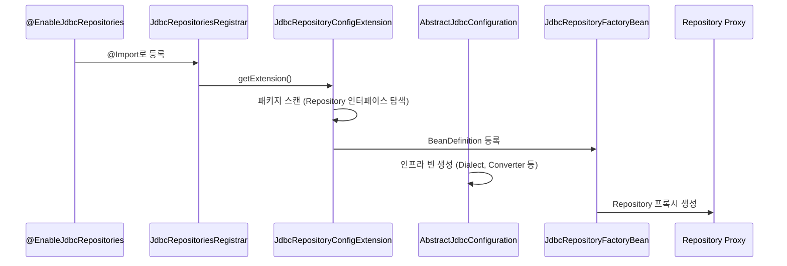
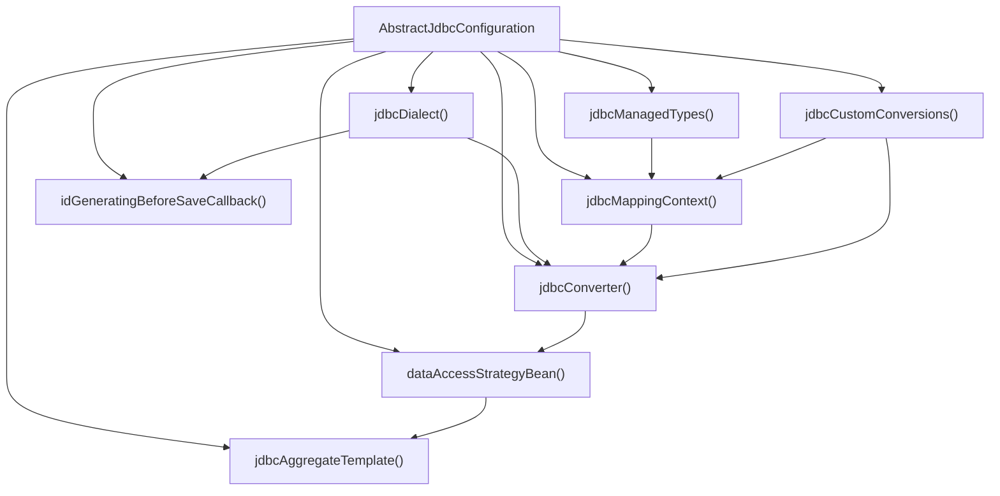

# Repository 설정과 부트스트래핑

Spring Data JDBC가 Repository를 인식하고 필요한 인프라 빈을 등록하는 전체 과정을 소스코드 수준에서 분석한다.

## 목차
- [1. 핵심 개념 (What)](#1-핵심-개념-what)
- [2. 왜 알아야 하는가 (Why)](#2-왜-알아야-하는가-why)
- [3. 내부 구현 분석 (How)](#3-내부-구현-분석-how)
- [4. 실전 예제](#4-실전-예제)
- [5. 정리](#5-정리)

---

## 1. 핵심 개념 (What)

Spring Data JDBC의 부트스트래핑은 "Repository 인터페이스를 스캔하여 프록시 빈을 생성하고, 이 과정에서 필요한 인프라 컴포넌트(Dialect, Converter, DataAccessStrategy 등)를 자동 등록하는 것"을 의미한다.

### 핵심 구성 요소

| 구성 요소 | 역할 |
|-----------|------|
| `@EnableJdbcRepositories` | Repository 스캔을 활성화하는 진입점 어노테이션 |
| `JdbcRepositoriesRegistrar` | `@EnableJdbcRepositories`를 감지하여 빈 등록 시작 |
| `JdbcRepositoryConfigExtension` | JDBC 모듈 고유의 확장 설정 (팩토리 빈, 트랜잭션 등) |
| `AbstractJdbcConfiguration` | 인프라 빈(@Bean)을 정의하는 Configuration 클래스 |
| `JdbcConfiguration` | 4.0에서 추가된 정적 팩토리 유틸리티 클래스 |

---

## 2. 왜 알아야 하는가 (Why)

- **다중 DataSource 환경**: 서로 다른 데이터베이스에 대해 별도의 Repository 그룹을 구성해야 할 때, `@EnableJdbcRepositories`의 속성을 정확히 이해해야 한다.
- **커스텀 Dialect/Converter**: 지원되지 않는 DB를 사용하거나, 특수한 타입 변환이 필요할 때 빈 등록 과정을 이해해야 올바르게 오버라이드할 수 있다.
- **디버깅**: Repository 빈이 생성되지 않거나 잘못된 DataSource를 참조하는 문제를 해결하려면 부트스트래핑 흐름을 알아야 한다.
- **성능 최적화**: 불필요한 엔티티 스캔을 줄이거나 Lazy 로딩 전략을 조정할 수 있다.

---

## 3. 내부 구현 분석 (How)

### 3.1 부트스트래핑 전체 흐름



### 3.2 @EnableJdbcRepositories 어노테이션

`@EnableJdbcRepositories`는 `@Import(JdbcRepositoriesRegistrar.class)`를 통해 부트스트래핑을 시작한다.

```java
// EnableJdbcRepositories.java
@Target(ElementType.TYPE)
@Retention(RetentionPolicy.RUNTIME)
@Documented
@Inherited
@Import(JdbcRepositoriesRegistrar.class)
public @interface EnableJdbcRepositories {

    String[] basePackages() default {};
    Class<?>[] basePackageClasses() default {};
    String repositoryImplementationPostfix() default "Impl";
    String jdbcAggregateOperationsRef() default "";  // 4.0 신규
    String transactionManagerRef() default "transactionManager";
    boolean enableDefaultTransactions() default true;
    // ...
}
```

주요 속성:

| 속성 | 기본값 | 설명 |
|------|--------|------|
| `basePackages` | 어노테이션 선언 클래스의 패키지 | Repository 스캔 대상 패키지 |
| `repositoryFactoryBeanClass` | `JdbcRepositoryFactoryBean` | Repository 프록시 생성 팩토리 |
| `queryLookupStrategy` | `CREATE_IF_NOT_FOUND` | 쿼리 탐색 전략 |
| `jdbcAggregateOperationsRef` | `""` | JdbcAggregateOperations 빈 참조 (4.0) |
| `transactionManagerRef` | `"transactionManager"` | 트랜잭션 매니저 빈 이름 |
| `enableDefaultTransactions` | `true` | 기본 트랜잭션 활성화 여부 (4.0) |

### 3.3 JdbcRepositoriesRegistrar

`RepositoryBeanDefinitionRegistrarSupport`를 상속하며, 어노테이션과 확장 클래스를 연결하는 브릿지 역할을 한다.

```java
// JdbcRepositoriesRegistrar.java
class JdbcRepositoriesRegistrar extends RepositoryBeanDefinitionRegistrarSupport {

    @Override
    protected Class<? extends Annotation> getAnnotation() {
        return EnableJdbcRepositories.class;
    }

    @Override
    protected RepositoryConfigurationExtension getExtension() {
        return new JdbcRepositoryConfigExtension();
    }
}
```

Spring의 `ImportBeanDefinitionRegistrar` 메커니즘을 통해, `@EnableJdbcRepositories`가 붙은 Configuration 클래스가 로드될 때 자동으로 실행된다.

### 3.4 JdbcRepositoryConfigExtension

`RepositoryConfigurationExtensionSupport`를 상속하며, JDBC 모듈 고유의 설정을 담당한다.

```java
// JdbcRepositoryConfigExtension.java
public class JdbcRepositoryConfigExtension
    extends RepositoryConfigurationExtensionSupport {

    @Override
    public String getModuleName() {
        return "JDBC";
    }

    @Override
    public String getRepositoryFactoryBeanClassName() {
        return JdbcRepositoryFactoryBean.class.getName();
    }

    @Override
    protected Collection<Class<? extends Annotation>> getIdentifyingAnnotations() {
        return Collections.singleton(Table.class);
    }
}
```

`postProcess()` 메서드에서 `BeanDefinitionBuilder`에 트랜잭션 매니저, JdbcAggregateOperations 등의 참조를 설정한다:

```java
@Override
public void postProcess(BeanDefinitionBuilder builder,
        RepositoryConfigurationSource source) {

    // enableDefaultTransactions 설정
    source.getAttribute(ENABLE_DEFAULT_TRANSACTIONS_ATTRIBUTE, Boolean.class)
        .ifPresent(it -> builder.addPropertyValue(
            ENABLE_DEFAULT_TRANSACTIONS_ATTRIBUTE, it));

    // transactionManagerRef 설정
    Optional<String> transactionManagerRef =
        source.getAttribute("transactionManagerRef");
    builder.addPropertyValue("transactionManager",
        transactionManagerRef.orElse(DEFAULT_TRANSACTION_MANAGER_BEAN_NAME));

    // jdbcAggregateOperationsRef (4.0 권장)
    Optional<String> jdbcAggregateOperationsRef =
        source.getAttribute("jdbcAggregateOperationsRef")
              .filter(StringUtils::hasText);

    if (jdbcAggregateOperationsRef.isPresent()) {
        builder.addPropertyReference("jdbcAggregateOperations",
            jdbcAggregateOperationsRef.get());
    } else {
        // 기본: JdbcAggregateOperations 타입으로 자동 참조
        builder.addPropertyValue("jdbcAggregateOperations",
            new RuntimeBeanReference(JdbcAggregateOperations.class));
    }
}
```

4.0부터 `jdbcOperationsRef`와 `dataAccessStrategyRef`는 deprecated되었으며, `jdbcAggregateOperationsRef`를 사용하는 것이 권장된다.

### 3.5 AbstractJdbcConfiguration의 빈 등록

`AbstractJdbcConfiguration`은 Spring Data JDBC가 동작하기 위한 핵심 빈들을 정의한다.



#### 빈 등록 순서와 의존관계

```java
// 1. Dialect 자동 감지
@Bean
public JdbcDialect jdbcDialect(NamedParameterJdbcOperations operations) {
    return DialectResolver.getDialect(operations.getJdbcOperations());
}

// 2. 관리 타입 스캔
@Bean
public RelationalManagedTypes jdbcManagedTypes() throws ClassNotFoundException {
    return RelationalManagedTypes.fromIterable(getInitialEntitySet());
}

// 3. MappingContext 생성
@Bean
public JdbcMappingContext jdbcMappingContext(
        Optional<NamingStrategy> namingStrategy,
        JdbcCustomConversions customConversions,
        RelationalManagedTypes jdbcManagedTypes) {
    return JdbcConfiguration.createMappingContext(
        jdbcManagedTypes, customConversions, namingStrategy.orElse(null));
}

// 4. JdbcConverter 생성
@Bean
public JdbcConverter jdbcConverter(
        JdbcMappingContext mappingContext,
        NamedParameterJdbcOperations operations,
        @Lazy RelationResolver relationResolver,
        JdbcCustomConversions conversions,
        JdbcDialect dialect) {
    return JdbcConfiguration.createConverter(
        mappingContext, operations, relationResolver, conversions, dialect);
}

// 5. DataAccessStrategy 생성
@Bean
public DataAccessStrategy dataAccessStrategyBean(
        NamedParameterJdbcOperations operations,
        JdbcConverter jdbcConverter,
        JdbcMappingContext context,
        JdbcDialect dialect) {
    return JdbcConfiguration.createDataAccessStrategy(
        operations, jdbcConverter, queryMappingConfiguration, dialect);
}

// 6. JdbcAggregateTemplate 생성
@Bean
public JdbcAggregateTemplate jdbcAggregateTemplate(
        ApplicationContext applicationContext,
        JdbcMappingContext mappingContext,
        JdbcConverter converter,
        DataAccessStrategy dataAccessStrategy) {
    return new JdbcAggregateTemplate(
        applicationContext, mappingContext, converter, dataAccessStrategy);
}
```

### 3.6 JdbcConfiguration 유틸리티 (4.0)

4.0에서 도입된 `JdbcConfiguration`은 정적 팩토리 메서드를 제공하여, `AbstractJdbcConfiguration`의 빈 생성 로직을 재사용 가능하게 분리했다.

```java
// JdbcConfiguration.java (since 4.0)
public final class JdbcConfiguration {

    public static JdbcCustomConversions createCustomConversions(
            JdbcDialect dialect, List<?> userConverters) { ... }

    public static JdbcMappingContext createMappingContext(
            RelationalManagedTypes jdbcManagedTypes,
            JdbcCustomConversions customConversions,
            @Nullable NamingStrategy namingStrategy) { ... }

    public static JdbcConverter createConverter(
            JdbcMappingContext mappingContext,
            NamedParameterJdbcOperations operations,
            RelationResolver relationResolver,
            JdbcCustomConversions conversions,
            JdbcDialect dialect) { ... }

    public static DataAccessStrategy createDataAccessStrategy(
            NamedParameterJdbcOperations operations,
            JdbcConverter jdbcConverter,
            @Nullable QueryMappingConfiguration mappingConfiguration,
            JdbcDialect dialect) { ... }
}
```

### 3.7 Dialect 자동 감지

`DialectResolver`는 Spring의 `SpringFactoriesLoader`를 통해 `JdbcDialectProvider` SPI 구현체를 로드하고, JDBC Connection의 메타데이터를 기반으로 적합한 Dialect를 결정한다.

```
spring.factories 로드 → JdbcDialectProvider 목록 획득
  → Connection.getMetaData().getDatabaseProductName()
  → 매칭되는 Dialect 반환
```

기본 지원 데이터베이스: H2, HSQL, PostgreSQL, MySQL/MariaDB, Oracle, SQL Server, DB2

---

## 4. 실전 예제

### 4.1 기본 설정 (Spring Boot)

Spring Boot 환경에서는 자동 구성이 대부분 처리된다:

```java
@SpringBootApplication
public class MyApplication {
    public static void main(String[] args) {
        SpringApplication.run(MyApplication.class, args);
    }
}

// application.yml
// spring:
//   datasource:
//     url: jdbc:postgresql://localhost:5432/mydb
//     username: user
//     password: pass
```

Spring Boot의 `JdbcRepositoriesAutoConfiguration`이 `@EnableJdbcRepositories`를 자동으로 활성화한다.

### 4.2 순수 Spring 환경에서의 수동 설정

```java
@Configuration
@EnableJdbcRepositories(basePackages = "com.example.repository")
public class JdbcConfig extends AbstractJdbcConfiguration {

    @Bean
    public DataSource dataSource() {
        return new HikariDataSource(hikariConfig());
    }

    @Bean
    public NamedParameterJdbcOperations namedParameterJdbcOperations(
            DataSource dataSource) {
        return new NamedParameterJdbcTemplate(dataSource);
    }

    @Bean
    public PlatformTransactionManager transactionManager(
            DataSource dataSource) {
        return new DataSourceTransactionManager(dataSource);
    }

    // 커스텀 NamingStrategy
    @Bean
    public NamingStrategy namingStrategy() {
        return new NamingStrategy() {
            @Override
            public String getTableName(Class<?> type) {
                return "tbl_" + NamingStrategy.super.getTableName(type);
            }
        };
    }

    // 커스텀 Converter 등록
    @Override
    protected List<?> userConverters() {
        return List.of(
            new MoneyToLongConverter(),
            new LongToMoneyConverter()
        );
    }
}
```

### 4.3 다중 DataSource 설정

```java
@Configuration
@EnableJdbcRepositories(
    basePackages = "com.example.order.repository",
    jdbcAggregateOperationsRef = "orderJdbcAggregateTemplate",
    transactionManagerRef = "orderTransactionManager"
)
public class OrderJdbcConfig extends AbstractJdbcConfiguration {

    @Bean("orderDataSource")
    public DataSource orderDataSource() {
        // 주문 DB DataSource
        return DataSourceBuilder.create()
            .url("jdbc:mysql://order-db:3306/orders")
            .build();
    }

    @Bean("orderJdbcOperations")
    public NamedParameterJdbcOperations orderJdbcOperations(
            @Qualifier("orderDataSource") DataSource ds) {
        return new NamedParameterJdbcTemplate(ds);
    }

    @Bean("orderTransactionManager")
    public PlatformTransactionManager orderTransactionManager(
            @Qualifier("orderDataSource") DataSource ds) {
        return new DataSourceTransactionManager(ds);
    }

    @Bean("orderJdbcAggregateTemplate")
    public JdbcAggregateTemplate orderJdbcAggregateTemplate(
            ApplicationContext ctx,
            JdbcMappingContext mappingContext,
            JdbcConverter converter,
            @Qualifier("orderDataAccessStrategy")
            DataAccessStrategy dataAccessStrategy) {
        return new JdbcAggregateTemplate(
            ctx, mappingContext, converter, dataAccessStrategy);
    }
}
```

### 4.4 커스텀 DialectProvider 등록

```java
// META-INF/spring.factories
org.springframework.data.jdbc.core.dialect.DialectResolver$JdbcDialectProvider=\
  com.example.dialect.CockroachDialectProvider

// CockroachDialectProvider.java
public class CockroachDialectProvider
    implements DialectResolver.JdbcDialectProvider {

    @Override
    public Optional<JdbcDialect> getDialect(JdbcOperations operations) {
        return Optional.ofNullable(operations.execute(
            (Connection con) -> {
                DatabaseMetaData meta = con.getMetaData();
                if (meta.getDatabaseProductName().contains("CockroachDB")) {
                    return JdbcPostgresDialect.INSTANCE;
                }
                return null;
            }
        ));
    }
}
```

---

## 5. 정리

| 단계 | 클래스 | 역할 |
|------|--------|------|
| 1. 진입점 | `@EnableJdbcRepositories` | `@Import`로 Registrar 활성화 |
| 2. 등록자 | `JdbcRepositoriesRegistrar` | 어노테이션 감지, Extension 위임 |
| 3. 확장 | `JdbcRepositoryConfigExtension` | BeanDefinition 후처리, 팩토리 빈 설정 |
| 4. 인프라 빈 | `AbstractJdbcConfiguration` | Dialect, Converter, DataAccessStrategy 등 등록 |
| 5. 팩토리 유틸 | `JdbcConfiguration` (4.0) | 정적 팩토리 메서드로 빈 생성 로직 분리 |
| 6. Dialect | `DialectResolver` | SpringFactoriesLoader 기반 SPI 감지 |
| 7. 프록시 | `JdbcRepositoryFactoryBean` | Repository 인터페이스 -> 프록시 빈 변환 |

**핵심 포인트:**
- Spring Boot 환경에서는 대부분 자동 구성이 처리되지만, 다중 DataSource나 커스텀 Dialect가 필요하면 수동 설정이 필수적이다.
- 4.0부터 `jdbcAggregateOperationsRef`가 권장되며, `jdbcOperationsRef`와 `dataAccessStrategyRef`는 deprecated되었다.
- `AbstractJdbcConfiguration`을 상속하여 `userConverters()`, `getMappingBasePackages()` 등을 오버라이드하면 된다.

---
*참고: Spring Data JDBC 3.x / Spring Boot 3.x 기준*
