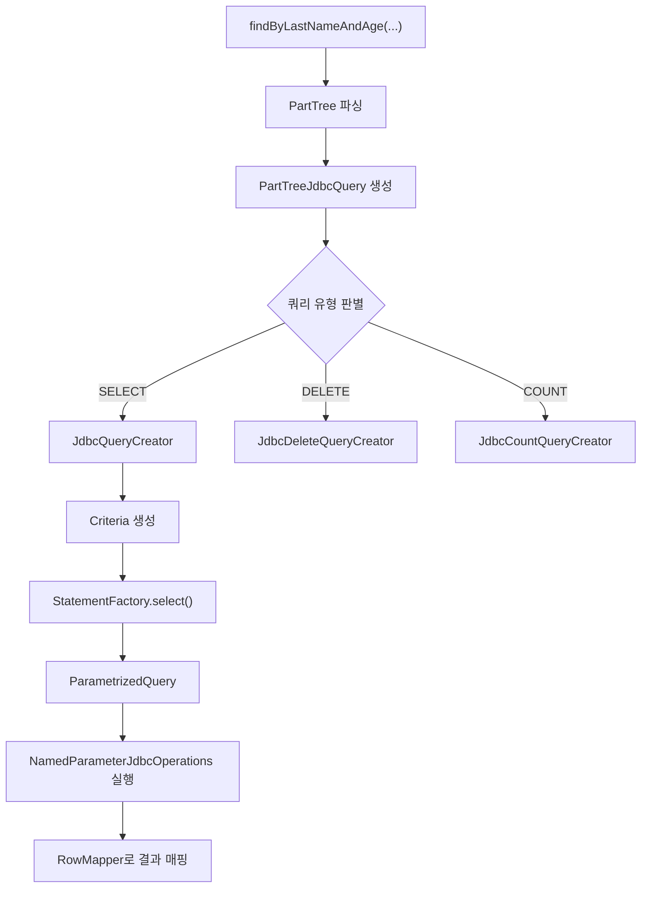

# 파생 쿼리 메커니즘 (Derived Queries)

Spring Data JDBC에서 메서드 이름으로부터 SQL 쿼리를 자동 생성하는 파생 쿼리(Derived Query)의 내부 동작을 소스코드 수준에서 분석한다.

## 목차
- [1. 핵심 개념 (What)](#1-핵심-개념-what)
- [2. 왜 알아야 하는가 (Why)](#2-왜-알아야-하는가-why)
- [3. 내부 구현 분석 (How)](#3-내부-구현-분석-how)
- [4. 실전 예제](#4-실전-예제)
- [5. 정리](#5-정리)

---

## 1. 핵심 개념 (What)

파생 쿼리란 Repository 인터페이스의 메서드 이름을 파싱하여, 자동으로 SQL 쿼리를 생성하는 메커니즘이다. `@Query` 어노테이션 없이도 메서드 시그니처만으로 조회, 삭제, 카운트 등의 쿼리를 만들 수 있다.

```java
interface UserRepository extends CrudRepository<User, Long> {
    List<User> findByLastNameAndAge(String lastName, int age);
    // -> SELECT ... FROM "USER" WHERE "LAST_NAME" = ? AND "AGE" = ?
}
```

### 핵심 클래스 구조

| 클래스 | 역할 |
|--------|------|
| `PartTree` | 메서드 이름을 파싱하여 트리 구조로 변환 (Spring Data Commons) |
| `JdbcQueryCreator` | `PartTree` -> `Criteria` -> SQL 변환 |
| `PartTreeJdbcQuery` | 파생 쿼리의 실행을 관리 |
| `StatementFactory` | SQL SELECT/COUNT/EXISTS/DELETE 문 생성 |
| `ParametrizedQuery` | 생성된 SQL과 파라미터를 캡슐화 |

---

## 2. 왜 알아야 하는가 (Why)

- **지원 범위 파악**: Spring Data JDBC의 파생 쿼리는 JPA만큼 다양하지 않다. 특히 **중첩 엔티티 쿼리, 다중 값 프로퍼티(Collection), 2단계 이상 경로 탐색**이 제한되므로, 한계를 알고 있어야 불필요한 시행착오를 줄일 수 있다.
- **디버깅**: 쿼리가 예상과 다르게 생성되거나, 지원되지 않는 키워드로 인한 오류를 빠르게 진단할 수 있다.
- **성능 고려**: Pageable, Slice, Count 쿼리가 내부적으로 어떻게 처리되는지 알면 성능 최적화 전략을 세울 수 있다.

---

## 3. 내부 구현 분석 (How)

### 3.1 전체 처리 흐름



### 3.2 PartTree 파싱

`PartTree`(Spring Data Commons)는 메서드 이름을 구조적으로 분해한다:

```
findByLastNameAndAgeGreaterThanOrderByLastNameAsc
  └─ subject: find
  └─ predicate:
      └─ OrPart[0]:
          └─ Part: lastName (IS)
          └─ Part: age (GREATER_THAN)
      └─ orderBy: lastName ASC
```

`PartTreeJdbcQuery` 생성자에서 파싱이 이루어진다:

```java
// PartTreeJdbcQuery 생성자
this.tree = new PartTree(
    queryMethod.getName(),
    queryMethod.getResultProcessor()
               .getReturnedType()
               .getDomainType()
);
JdbcQueryCreator.validate(this.tree, this.parameters,
    this.converter.getMappingContext());
```

### 3.3 validate() - 파생 쿼리 제약 검증

`JdbcQueryCreator.validate()`는 JDBC 모듈의 특수 제약을 검증한다:

```java
// JdbcQueryCreator.validate()
static void validate(PartTree tree, Parameters<?, ?> parameters,
        RelationalMappingContext context) {

    RelationalQueryCreator.validate(tree, parameters);

    for (PartTree.OrPart parts : tree) {
        for (Part part : parts) {
            PersistentPropertyPath<?> propertyPath =
                context.getPersistentPropertyPath(part.getProperty());
            AggregatePath path = context.getAggregatePath(propertyPath);
            path.forEach(JdbcQueryCreator::validateProperty);
        }
    }
}

private static void validateProperty(AggregatePath path) {
    // 2단계 이상 중첩 불가 (embedded 제외)
    if (!path.getParentPath().isEmbedded() && path.getLength() > 2) {
        throw new IllegalArgumentException(
            "Cannot query by nested property: " + path.toDotPath());
    }
    // Collection/Map 프로퍼티 불가
    if (path.isMultiValued() || path.isMap()) {
        throw new IllegalArgumentException(
            "Cannot query by multi-valued property: " + ...);
    }
    // 중첩 엔티티 불가 (embedded 제외)
    if (!path.isEmbedded() && path.isEntity()) {
        throw new IllegalArgumentException(
            "Cannot query by nested entity: " + path.toDotPath());
    }
}
```

### 3.4 JdbcQueryCreator의 Criteria 변환

`JdbcQueryCreator`는 `RelationalQueryCreator`를 상속하며, `PartTree`의 각 `Part`를 `Criteria` 객체로 변환한다.

`complete()` 메서드에서 최종 SQL을 생성한다:

```java
// JdbcQueryCreator.complete()
@Override
protected ParametrizedQuery complete(@Nullable Criteria criteria, Sort sort) {

    RelationalPersistentEntity<?> entity = entityMetadata.getTableEntity();
    MapSqlParameterSource parameterSource = new MapSqlParameterSource();

    StatementFactory.SelectionBuilder selection = getSelection(entity);

    selection.page(accessor.getPageable())
             .filter(criteria)
             .orderBy(sort);

    if (this.lockMode.isPresent()) {
        selection.lock(this.lockMode.get().value());
    }

    String sql = selection.build(parameterSource);
    return new ParametrizedQuery(sql, parameterSource,
        criteria != null ? criteria : Criteria.empty());
}
```

### 3.5 지원 키워드

Spring Data JDBC가 지원하는 파생 쿼리 키워드:

| 키워드 | 예제 | 생성되는 조건 |
|--------|------|-------------|
| `Is`, `Equals` | `findByName(String)` | `name = ?` |
| `Not` | `findByNameNot(String)` | `name != ?` |
| `IsNull` | `findByNameIsNull()` | `name IS NULL` |
| `IsNotNull` | `findByNameIsNotNull()` | `name IS NOT NULL` |
| `LessThan` | `findByAgeLessThan(int)` | `age < ?` |
| `LessThanEqual` | `findByAgeLessThanEqual(int)` | `age <= ?` |
| `GreaterThan` | `findByAgeGreaterThan(int)` | `age > ?` |
| `GreaterThanEqual` | `findByAgeGreaterThanEqual(int)` | `age >= ?` |
| `Between` | `findByAgeBetween(int, int)` | `age BETWEEN ? AND ?` |
| `Like` | `findByNameLike(String)` | `name LIKE ?` |
| `NotLike` | `findByNameNotLike(String)` | `name NOT LIKE ?` |
| `StartingWith` | `findByNameStartingWith(String)` | `name LIKE ?%` |
| `EndingWith` | `findByNameEndingWith(String)` | `name LIKE %?` |
| `Containing` | `findByNameContaining(String)` | `name LIKE %?%` |
| `In` | `findByNameIn(Collection)` | `name IN (?, ?, ...)` |
| `NotIn` | `findByNameNotIn(Collection)` | `name NOT IN (?, ?, ...)` |
| `True` | `findByActiveTrue()` | `active = true` |
| `False` | `findByActiveFalse()` | `active = false` |
| `And` | `findByNameAndAge(...)` | `name = ? AND age = ?` |
| `Or` | `findByNameOrAge(...)` | `name = ? OR age = ?` |
| `OrderBy` | `findByAgeOrderByNameAsc()` | `ORDER BY name ASC` |
| `Top`/`First` | `findTop3ByAge(int)` | `LIMIT 3` |

### 3.6 쿼리 유형별 분기

`PartTreeJdbcQuery.execute()` 에서 쿼리 유형에 따라 분기한다:

```java
// PartTreeJdbcQuery.execute()
@Override
public Object execute(Object[] values) {

    RelationalParametersParameterAccessor accessor = ...;

    if (tree.isDelete()) {
        JdbcQueryExecution<?> execution = createModifyingQueryExecutor();
        List<ParametrizedQuery> queries = createDeleteQueries(accessor);
        Object result = null;
        for (ParametrizedQuery query : queries) {
            result = execution.execute(query.getQuery(),
                query.getParameterSource(dialect.getLikeEscaper()));
        }
        return result;
    }

    // SELECT 계열
    ResultProcessor processor = getQueryMethod()
        .getResultProcessor().withDynamicProjection(accessor);
    ParametrizedQuery query = createQuery(accessor,
        processor.getReturnedType());
    JdbcQueryExecution<?> execution = getQueryExecution(
        processor, accessor);
    return execution.execute(query.getQuery(),
        query.getParameterSource(dialect.getLikeEscaper()));
}
```

### 3.7 반환 타입별 실행 전략

`getQueryExecution()` 메서드에서 반환 타입에 따라 실행 전략을 선택한다:

```java
// PartTreeJdbcQuery.getQueryExecution()
private JdbcQueryExecution<?> getQueryExecution(
        ResultProcessor processor,
        RelationalParametersParameterAccessor accessor) {

    if (getQueryMethod().isSliceQuery()) {
        return new SliceQueryExecution<>(
            collectionQuery, accessor.getPageable());
    }

    if (getQueryMethod().isPageQuery()) {
        return new PageQueryExecution<>(
            collectionQuery, accessor.getPageable(),
            () -> {  // count 쿼리 Supplier
                JdbcCountQueryCreator queryCreator = ...;
                ParametrizedQuery countQuery =
                    queryCreator.createQuery(Sort.unsorted());
                // ...
            });
    }

    return getJdbcQueryExecution(extractor, rowMapper);
}
```

| 반환 타입 | 실행 클래스 | 설명 |
|----------|------------|------|
| `List<T>` | `collectionQuery` | `RowMapperResultSetExtractor` 사용 |
| `Stream<T>` | `streamQuery` | `queryForStream()` 사용 |
| `T` (단일) | `singleObjectQuery` | `queryForObject()`, null 허용 |
| `Page<T>` | `PageQueryExecution` | 별도 count 쿼리 자동 생성 |
| `Slice<T>` | `SliceQueryExecution` | pageSize + 1로 hasNext 판단 |
| `boolean`/`Boolean` | exists projection | `ResultSet::next` 사용 |
| `long`/`Long` (count) | count projection | `SingleColumnRowMapper` 사용 |

---

## 4. 실전 예제

### 4.1 기본 CRUD 파생 쿼리

```java
public interface ProductRepository extends CrudRepository<Product, Long> {

    // 단일 조건
    List<Product> findByCategory(String category);

    // 복합 조건
    List<Product> findByCategoryAndPriceGreaterThan(
        String category, BigDecimal price);

    // 정렬
    List<Product> findByCategoryOrderByPriceDesc(String category);

    // 결과 제한
    List<Product> findTop5ByCategoryOrderByCreatedAtDesc(
        String category);

    // 존재 여부
    boolean existsByName(String name);

    // 카운트
    long countByCategory(String category);

    // 삭제
    int deleteByCategory(String category);
}
```

### 4.2 Embedded 객체를 통한 쿼리

```java
// 도메인 모델
public class Customer {
    @Id
    private Long id;
    private String name;
    @Embedded(onEmpty = Embedded.OnEmpty.USE_NULL)
    private Address address;
}

public class Address {
    private String city;
    private String street;
}

// Repository - embedded 속성은 경로 탐색 가능
public interface CustomerRepository extends CrudRepository<Customer, Long> {
    List<Customer> findByAddressCity(String city);
    // -> SELECT ... FROM "CUSTOMER" WHERE "CITY" = ?
}
```

### 4.3 Page/Slice 쿼리

```java
public interface OrderRepository extends PagingAndSortingRepository<Order, Long> {

    // Page - count 쿼리가 자동 생성됨
    Page<Order> findByStatus(String status, Pageable pageable);

    // Slice - count 쿼리 없이 hasNext만 판단
    Slice<Order> findByCustomerId(Long customerId, Pageable pageable);
}

// 사용
Page<Order> page = orderRepository.findByStatus("PENDING",
    PageRequest.of(0, 20, Sort.by("createdAt").descending()));

System.out.println("총 건수: " + page.getTotalElements());
System.out.println("총 페이지: " + page.getTotalPages());
```

### 4.4 동적 Sort 파라미터

```java
public interface ArticleRepository extends CrudRepository<Article, Long> {

    List<Article> findByPublished(boolean published, Sort sort);
}

// 사용
List<Article> articles = articleRepository.findByPublished(true,
    Sort.by(Sort.Order.desc("viewCount"),
            Sort.Order.asc("title")));
```

---

## 5. 정리

| 항목 | 내용 |
|------|------|
| 파싱 엔진 | `PartTree` (Spring Data Commons) |
| SQL 생성 | `JdbcQueryCreator` -> `StatementFactory` -> `ParametrizedQuery` |
| 실행 | `PartTreeJdbcQuery` -> `AbstractJdbcQuery` -> `NamedParameterJdbcOperations` |
| 제약 사항 | 2단계 이상 중첩 경로 불가, Collection/Map 프로퍼티 불가, 중첩 엔티티 불가 |
| Page vs Slice | Page는 추가 count 쿼리 실행, Slice는 pageSize+1 전략 |
| Lock 지원 | `@Lock` 어노테이션으로 비관적 잠금 가능 (파생 쿼리 한정) |

**핵심 포인트:**
- 파생 쿼리는 간단한 조건에 최적화되어 있으며, 복잡한 JOIN이나 서브쿼리가 필요하면 `@Query`를 사용해야 한다.
- `JdbcQueryCreator.validate()`에서 지원 불가능한 경로 탐색은 즉시 예외를 던지므로, 애플리케이션 시작 시점에 문제를 감지할 수 있다.
- Slice 쿼리는 count 쿼리를 생략하여 성능상 이점이 있으므로, 전체 개수가 필요 없는 무한 스크롤 UI에 적합하다.

---
*참고: Spring Data JDBC 3.x / Spring Boot 3.x 기준*
