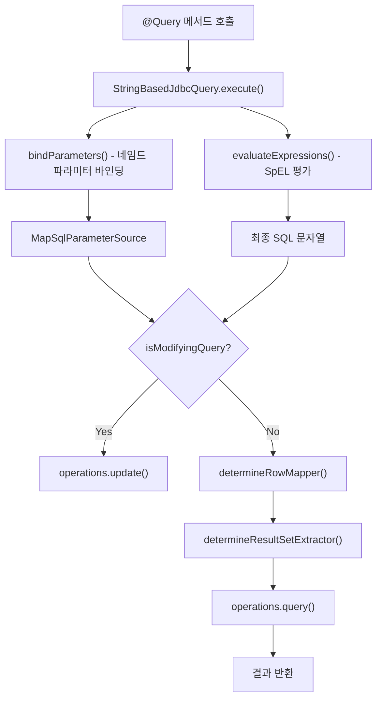

# @Query 어노테이션과 커스텀 쿼리

Spring Data JDBC의 `@Query` 어노테이션을 사용한 커스텀 SQL 쿼리 작성법과 `StringBasedJdbcQuery`의 내부 동작을 분석한다.

## 목차
- [1. 핵심 개념 (What)](#1-핵심-개념-what)
- [2. 왜 알아야 하는가 (Why)](#2-왜-알아야-하는가-why)
- [3. 내부 구현 분석 (How)](#3-내부-구현-분석-how)
- [4. 실전 예제](#4-실전-예제)
- [5. 정리](#5-정리)

---

## 1. 핵심 개념 (What)

`@Query` 어노테이션은 파생 쿼리로 표현할 수 없는 복잡한 SQL을 Repository 메서드에 직접 작성할 수 있게 한다. Spring Data JDBC의 `@Query`는 **네이티브 SQL**을 사용하며, JPQL이 아닌 실제 데이터베이스에 직접 실행되는 SQL을 작성한다.

### 핵심 클래스

| 클래스 | 역할 |
|--------|------|
| `@Query` | SQL 쿼리를 선언하는 어노테이션 |
| `@Modifying` | INSERT/UPDATE/DELETE 쿼리를 표시 |
| `StringBasedJdbcQuery` | `@Query` 기반 쿼리의 실행 담당 |
| `ValueExpressionQueryRewriter` | SpEL 표현식 파싱/치환 |
| `RowMapperFactory` | 결과 매핑 전략 결정 |

---

## 2. 왜 알아야 하는가 (Why)

- **파생 쿼리의 한계 극복**: JOIN, 서브쿼리, 집계 함수, 윈도우 함수 등 파생 쿼리로 불가능한 복잡한 SQL을 작성해야 한다.
- **성능 최적화**: 특정 컬럼만 조회하거나, 데이터베이스 고유 기능(힌트, 인덱스 등)을 활용한 쿼리 튜닝이 필요하다.
- **기존 SQL 자산 활용**: DBA가 작성한 검증된 SQL을 그대로 활용할 수 있다.
- **제약 사항 파악**: `@Query`는 Page/Slice 반환을 지원하지 않으므로, 이를 알고 대안을 준비해야 한다.

---

## 3. 내부 구현 분석 (How)

### 3.1 전체 처리 흐름



### 3.2 @Query 어노테이션 상세

```java
// Query.java
@Retention(RetentionPolicy.RUNTIME)
@Target(ElementType.METHOD)
@QueryAnnotation
@Documented
public @interface Query {

    String value() default "";                    // SQL 문
    String name() default "";                     // Named Query 이름
    Class<? extends RowMapper> rowMapperClass()
        default RowMapper.class;                  // 커스텀 RowMapper 클래스
    String rowMapperRef() default "";             // RowMapper 빈 참조
    Class<? extends ResultSetExtractor>
        resultSetExtractorClass()
        default ResultSetExtractor.class;         // 커스텀 ResultSetExtractor
    String resultSetExtractorRef() default "";    // ResultSetExtractor 빈 참조
}
```

결과 추출 우선순위:
1. `resultSetExtractorRef` (빈 참조)
2. `resultSetExtractorClass` (클래스)
3. `rowMapperRef` (빈 참조)
4. `rowMapperClass` (클래스)

### 3.3 StringBasedJdbcQuery 생성

생성자에서 여러 검증과 초기화가 이루어진다:

```java
// StringBasedJdbcQuery 생성자
public StringBasedJdbcQuery(String query, JdbcQueryMethod queryMethod,
        NamedParameterJdbcOperations operations,
        RowMapperFactory rowMapperFactory,
        JdbcConverter converter,
        ValueExpressionDelegate delegate) {

    super(queryMethod, operations);

    // Slice/Page/Limit/Lock 미지원 검증
    if (queryMethod.isSliceQuery()) {
        throw new UnsupportedOperationException(
            "Slice queries are not supported using string-based queries");
    }
    if (queryMethod.isPageQuery()) {
        throw new UnsupportedOperationException(
            "Page queries are not supported using string-based queries");
    }
    if (queryMethod.getParameters().hasLimitParameter()) {
        throw new UnsupportedOperationException(
            "Queries with Limit are not supported using string-based queries");
    }
    if (queryMethod.hasLockMode()) {
        throw new UnsupportedOperationException(
            "@Lock is supported only on derived queries");
    }

    // SpEL 표현식 파서 초기화
    ValueExpressionQueryRewriter rewriter =
        ValueExpressionQueryRewriter.of(delegate,
            (counter, expression) ->
                String.format("__$synthetic$__%d", counter + 1),
            String::concat);

    this.parsedQuery = rewriter.parse(this.query);
}
```

### 3.4 파라미터 바인딩

네임드 파라미터(`:paramName`)를 메서드 파라미터와 바인딩한다:

```java
// StringBasedJdbcQuery.bindParameters()
private MapSqlParameterSource bindParameters(
        RelationalParameterAccessor accessor) {

    Parameters<?, ?> bindableParameters =
        accessor.getBindableParameters();
    MapSqlParameterSource parameters = new MapSqlParameterSource();

    for (Parameter bindableParameter : bindableParameters) {
        Object value = accessor.getBindableValue(
            bindableParameter.getIndex());

        // @Param 또는 -parameters 컴파일 옵션 필수
        String parameterName = bindableParameter.getName()
            .orElseThrow(() -> new IllegalStateException(
                "For queries with named parameters you need to " +
                "provide names for method parameters; " +
                "Use @Param for query method parameters"));

        // JDBC 타입 변환
        JdbcValue jdbcValue = JdbcValueBindUtil.getBindValue(
            converter, value, parameter);
        SQLType jdbcType = jdbcValue.getJdbcType();

        if (jdbcType == JDBCType.OTHER) {
            parameters.addValue(parameterName, jdbcValue.getValue());
        } else {
            parameters.addValue(parameterName,
                jdbcValue.getValue(),
                jdbcType.getVendorTypeNumber());
        }
    }
    return parameters;
}
```

### 3.5 SpEL 표현식 처리

`#{...}` 형태의 SpEL 표현식은 `ValueExpressionQueryRewriter`가 처리한다:

```java
// StringBasedJdbcQuery.evaluateExpressions()
private String evaluateExpressions(Object[] objects,
        Parameters<?, ?> bindableParameters,
        MapSqlParameterSource parameterMap) {

    if (parsedQuery.hasParameterBindings()) {
        ValueEvaluationContext evaluationContext =
            delegate.createValueContextProvider(bindableParameters)
                    .getEvaluationContext(objects);

        parsedQuery.getParameterMap().forEach(
            (paramName, valueExpression) -> {
                addEvaluatedParameterToParameterSource(
                    parameterMap, paramName,
                    valueExpression, evaluationContext);
            });

        return parsedQuery.getQueryString();
    }

    return this.query;
}
```

SpEL 표현식은 `__$synthetic$__N` 형태의 합성 파라미터 이름으로 치환된다.

### 3.6 @Modifying 처리

```java
// @Modifying - INSERT/UPDATE/DELETE 표시
@Retention(RetentionPolicy.RUNTIME)
@Target({ ElementType.METHOD, ElementType.ANNOTATION_TYPE })
@Documented
public @interface Modifying {}
```

`StringBasedJdbcQuery.createJdbcQueryExecution()`에서 분기:

```java
private JdbcQueryExecution<?> createJdbcQueryExecution(
        RelationalParameterAccessor accessor,
        ResultProcessor processor) {

    if (getQueryMethod().isModifyingQuery()) {
        return createModifyingQueryExecutor();
    }

    // SELECT 계열 처리
    Supplier<RowMapper<?>> rowMapper = () ->
        determineRowMapper(processor,
            accessor.findDynamicProjection() != null);
    ResultSetExtractor<Object> resultSetExtractor =
        determineResultSetExtractor(rowMapper);

    return createReadingQueryExecution(
        resultSetExtractor, rowMapper);
}
```

`AbstractJdbcQuery.createModifyingQueryExecutor()`의 실행:

```java
JdbcQueryExecution<Object> createModifyingQueryExecutor() {
    return (query, parameters) -> {
        int updatedCount = operations.update(query, parameters);
        Class<?> returnedObjectType =
            queryMethod.getReturnedObjectType();

        // boolean 반환이면 0이 아닌지 확인
        return (returnedObjectType == boolean.class
            || returnedObjectType == Boolean.class)
                ? updatedCount != 0
                : updatedCount;
    };
}
```

### 3.7 RowMapper 결정 로직

```java
// StringBasedJdbcQuery.determineRowMapper()
RowMapper<Object> determineRowMapper(
        ResultProcessor resultProcessor,
        boolean hasDynamicProjection) {

    // 1. @Query에 RowMapper가 설정되었으면 우선 사용
    if (cachedRowMapperFactory.isConfiguredRowMapper()) {
        return cachedRowMapperFactory.getRowMapper();
    }

    // 2. 동적 프로젝션이면 DtoInstantiatingConverter 조합
    if (hasDynamicProjection) {
        RowMapper<Object> rowMapper = rowMapperFactory.create(
            resultProcessor.getReturnedType().getDomainType());
        ResultProcessingConverter converter = ...;
        return new ConvertingRowMapper(rowMapper, converter);
    }

    // 3. 기본 RowMapper 사용
    return cachedRowMapperFactory.getRowMapper();
}
```

---

## 4. 실전 예제

### 4.1 기본 @Query 사용

```java
public interface ProductRepository extends CrudRepository<Product, Long> {

    // 네임드 파라미터 사용
    @Query("SELECT * FROM product WHERE category = :category AND price > :minPrice")
    List<Product> findExpensiveByCategory(
        @Param("category") String category,
        @Param("minPrice") BigDecimal minPrice);

    // 단일 결과 조회
    @Query("SELECT COUNT(*) FROM product WHERE category = :category")
    long countByCategory(@Param("category") String category);

    // Optional 반환
    @Query("SELECT * FROM product WHERE sku = :sku")
    Optional<Product> findBySku(@Param("sku") String sku);
}
```

### 4.2 @Modifying을 사용한 변경 쿼리

```java
public interface UserRepository extends CrudRepository<User, Long> {

    @Modifying
    @Query("UPDATE app_user SET status = :status WHERE last_login < :cutoff")
    int deactivateInactiveUsers(
        @Param("status") String status,
        @Param("cutoff") LocalDateTime cutoff);

    @Modifying
    @Query("DELETE FROM app_user WHERE status = 'DELETED' AND deleted_at < :before")
    int purgeDeletedUsers(@Param("before") LocalDateTime before);

    // boolean 반환 - 영향 받은 행이 0이 아니면 true
    @Modifying
    @Query("UPDATE app_user SET email = :email WHERE id = :id")
    boolean updateEmail(@Param("id") Long id, @Param("email") String email);
}
```

### 4.3 SpEL 표현식 활용

```java
public interface AuditRepository extends CrudRepository<AuditLog, Long> {

    // SpEL로 테이블명 동적 결정
    @Query("SELECT * FROM #{#tableName} WHERE created_at > :since")
    List<AuditLog> findRecentLogs(
        @Param("tableName") String tableName,
        @Param("since") LocalDateTime since);

    // Spring Security 연동
    @Query("SELECT * FROM document WHERE owner = :#{principal.username}")
    List<Document> findMyDocuments();
}
```

### 4.4 커스텀 RowMapper/ResultSetExtractor

```java
// 커스텀 RowMapper
public class ProductSummaryRowMapper implements RowMapper<ProductSummary> {
    @Override
    public ProductSummary mapRow(ResultSet rs, int rowNum)
            throws SQLException {
        return new ProductSummary(
            rs.getString("name"),
            rs.getBigDecimal("price"),
            rs.getInt("stock_count")
        );
    }
}

// rowMapperClass 사용
public interface ProductRepository extends CrudRepository<Product, Long> {

    @Query(value = """
        SELECT p.name, p.price, i.stock_count
        FROM product p
        JOIN inventory i ON p.id = i.product_id
        WHERE p.category = :category
        """,
        rowMapperClass = ProductSummaryRowMapper.class)
    List<ProductSummary> findSummaryByCategory(
        @Param("category") String category);
}
```

빈 참조 방식:

```java
// RowMapper를 빈으로 등록
@Configuration
public class MapperConfig {

    @Bean
    public RowMapper<ProductSummary> productSummaryMapper() {
        return (rs, rowNum) -> new ProductSummary(
            rs.getString("name"),
            rs.getBigDecimal("price"),
            rs.getInt("stock_count")
        );
    }
}

// rowMapperRef 사용
public interface ProductRepository extends CrudRepository<Product, Long> {

    @Query(value = "SELECT name, price, stock_count FROM product_view",
           rowMapperRef = "productSummaryMapper")
    List<ProductSummary> findAllSummaries();
}
```

### 4.5 ResultSetExtractor로 복합 결과 매핑

```java
// 1:N 결합 결과를 하나의 객체로 매핑
public class OrderWithItemsExtractor
        implements ResultSetExtractor<List<OrderWithItems>> {

    @Override
    public List<OrderWithItems> extractData(ResultSet rs)
            throws SQLException {
        Map<Long, OrderWithItems> orders = new LinkedHashMap<>();

        while (rs.next()) {
            Long orderId = rs.getLong("order_id");
            OrderWithItems order = orders.computeIfAbsent(orderId,
                id -> new OrderWithItems(
                    id,
                    rs.getString("customer_name"),
                    new ArrayList<>()
                ));
            order.getItems().add(new OrderItem(
                rs.getString("product_name"),
                rs.getInt("quantity")
            ));
        }

        return new ArrayList<>(orders.values());
    }
}

// Repository
public interface OrderRepository extends CrudRepository<Order, Long> {

    @Query(value = """
        SELECT o.id AS order_id, o.customer_name,
               oi.product_name, oi.quantity
        FROM orders o
        JOIN order_item oi ON o.id = oi.order_id
        WHERE o.status = :status
        ORDER BY o.id
        """,
        resultSetExtractorClass = OrderWithItemsExtractor.class)
    List<OrderWithItems> findOrdersWithItems(
        @Param("status") String status);
}
```

### 4.6 RowMapper를 받는 ResultSetExtractor

```java
// RowMapper를 생성자로 받는 ResultSetExtractor
public class StreamResultSetExtractor<T>
        implements ResultSetExtractor<List<T>> {

    private final RowMapper<T> rowMapper;

    // RowMapper를 받는 생성자가 있으면 자동 주입됨
    public StreamResultSetExtractor(RowMapper<T> rowMapper) {
        this.rowMapper = rowMapper;
    }

    @Override
    public List<T> extractData(ResultSet rs) throws SQLException {
        List<T> results = new ArrayList<>();
        int rowNum = 0;
        while (rs.next()) {
            results.add(rowMapper.mapRow(rs, rowNum++));
        }
        return results;
    }
}
```

---

## 5. 정리

| 항목 | 내용 |
|------|------|
| 핵심 클래스 | `StringBasedJdbcQuery` |
| SQL 종류 | 네이티브 SQL (JPQL 아님) |
| 파라미터 바인딩 | `:paramName` + `@Param` 또는 `-parameters` 컴파일 옵션 |
| SpEL 지원 | `#{...}` 형태, `ValueExpressionQueryRewriter`로 처리 |
| 변경 쿼리 | `@Modifying` 필수, `int` 또는 `boolean` 반환 |
| RowMapper | `rowMapperClass` 또는 `rowMapperRef` (둘 다 설정하면 예외) |
| ResultSetExtractor | `resultSetExtractorClass` 또는 `resultSetExtractorRef` |
| 미지원 기능 | `Page<T>`, `Slice<T>`, `Limit` 파라미터, `@Lock` |

**핵심 포인트:**
- `@Query`는 네이티브 SQL을 사용하므로, 데이터베이스 이식성이 필요하면 파생 쿼리를 우선 사용하라.
- `rowMapperRef`와 `rowMapperClass`를 동시에 설정하면 `IllegalArgumentException`이 발생한다.
- Page/Slice 쿼리가 필요하면 파생 쿼리를 사용하거나, `@Query`로 직접 count 쿼리를 작성해야 한다.
- SpEL 표현식은 보안에 주의해야 한다. 사용자 입력을 SpEL에 직접 전달하면 안 된다.

---
*참고: Spring Data JDBC 3.x / Spring Boot 3.x 기준*
