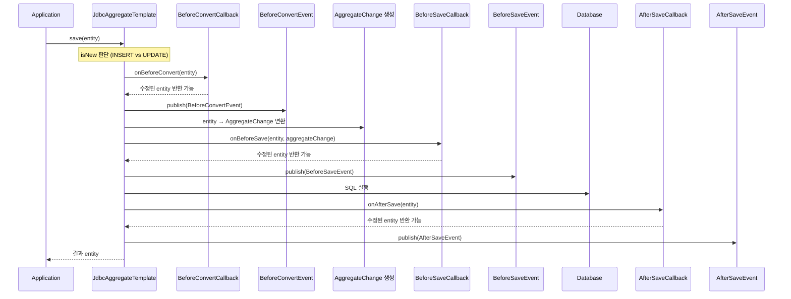
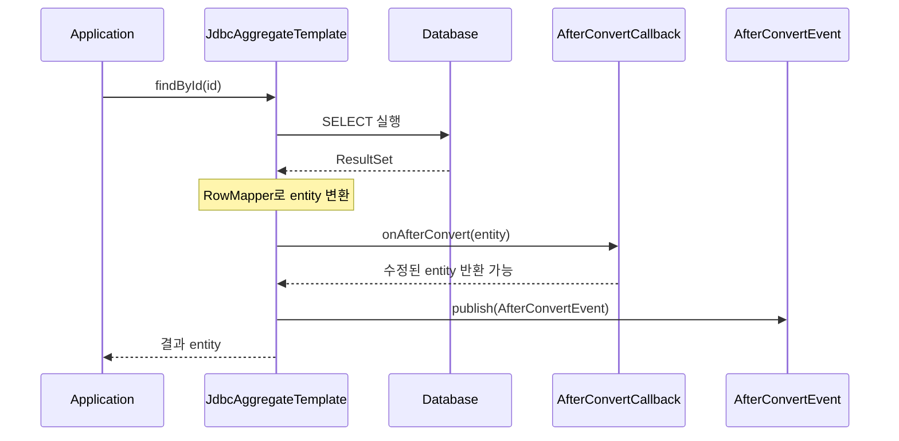
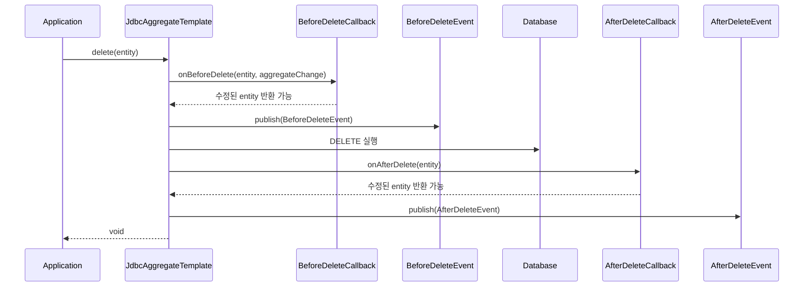

# 라이프사이클 이벤트와 콜백

Spring Data JDBC에서 엔티티의 저장/조회/삭제 과정에 개입할 수 있는 이벤트(Event)와 콜백(Callback) 메커니즘의 내부 동작과 차이점을 분석한다.

## 목차
- [1. 핵심 개념 (What)](#1-핵심-개념-what)
- [2. 왜 알아야 하는가 (Why)](#2-왜-알아야-하는가-why)
- [3. 내부 구현 분석 (How)](#3-내부-구현-분석-how)
- [4. 실전 예제](#4-실전-예제)
- [5. 정리](#5-정리)

---

## 1. 핵심 개념 (What)

Spring Data JDBC는 엔티티의 영속 과정에서 발생하는 라이프사이클 시점에 비즈니스 로직을 삽입할 수 있는 두 가지 메커니즘을 제공한다:

1. **콜백 (Callback)**: `EntityCallback<T>` 인터페이스 구현. 엔티티를 **변환(수정)하여 반환**할 수 있다.
2. **이벤트 (Event)**: `ApplicationEvent` 기반. 엔티티를 **관찰만** 할 수 있다 (read-only).

### 6종 콜백/이벤트 쌍

| 시점 | 콜백 인터페이스 | 이벤트 클래스 |
|------|---------------|-------------|
| 변환 전 (저장 시) | `BeforeConvertCallback<T>` | `BeforeConvertEvent<T>` |
| 저장 직전 | `BeforeSaveCallback<T>` | `BeforeSaveEvent<T>` |
| 저장 직후 | `AfterSaveCallback<T>` | `AfterSaveEvent<T>` |
| DB 조회 후 | `AfterConvertCallback<T>` | `AfterConvertEvent<T>` |
| 삭제 직전 | `BeforeDeleteCallback<T>` | `BeforeDeleteEvent<T>` |
| 삭제 직후 | `AfterDeleteCallback<T>` | `AfterDeleteEvent<T>` |

---

## 2. 왜 알아야 하는가 (Why)

- **감사(Auditing)**: createdAt, updatedAt, createdBy 등의 필드를 자동으로 설정해야 한다.
- **ID 생성**: DB 시퀀스가 아닌 UUID 등 애플리케이션 레벨에서 ID를 생성해야 한다.
- **유효성 검증**: 저장 전 비즈니스 규칙을 검증해야 한다.
- **암호화/복호화**: 저장 시 암호화, 조회 시 복호화 로직을 적용해야 한다.
- **이벤트 발행**: 도메인 이벤트를 외부 시스템(메시지 큐 등)으로 전파해야 한다.
- **콜백 vs 이벤트 선택**: 어떤 것을 써야 하는지 판단 기준을 알아야 한다.

---

## 3. 내부 구현 분석 (How)

### 3.1 저장 과정에서의 라이프사이클 흐름



### 3.2 조회 과정에서의 라이프사이클



### 3.3 삭제 과정에서의 라이프사이클



**주의**: `deleteById(id)`처럼 엔티티 인스턴스 없이 ID로 삭제하면, `BeforeDeleteCallback`/`AfterDeleteCallback`과 관련 이벤트가 **호출되지 않는다**.

### 3.4 콜백 인터페이스 분석

#### BeforeConvertCallback

엔티티가 `AggregateChange`로 변환되기 **전**에 호출된다. ID 생성에 가장 적합한 시점이다.

```java
// BeforeConvertCallback.java
@FunctionalInterface
public interface BeforeConvertCallback<T> extends EntityCallback<T> {
    T onBeforeConvert(T aggregate);
}
```

#### BeforeSaveCallback

`AggregateChange` 생성 **후**, SQL 실행 **전**에 호출된다. `MutableAggregateChange`에 접근하여 변경 내역을 조작할 수 있다.

```java
// BeforeSaveCallback.java
@FunctionalInterface
public interface BeforeSaveCallback<T> extends EntityCallback<T> {
    T onBeforeSave(T aggregate, MutableAggregateChange<T> aggregateChange);
}
```

#### AfterSaveCallback

SQL 실행 **후**에 호출된다. DB에서 생성된 ID나 타임스탬프 등이 반영된 상태이다.

```java
// AfterSaveCallback.java
@FunctionalInterface
public interface AfterSaveCallback<T> extends EntityCallback<T> {
    T onAfterSave(T aggregate);
}
```

#### AfterConvertCallback

DB에서 읽은 결과를 엔티티로 변환한 **후** 호출된다.

```java
// AfterConvertCallback.java
@FunctionalInterface
public interface AfterConvertCallback<T> extends EntityCallback<T> {
    T onAfterConvert(T aggregate);
}
```

#### BeforeDeleteCallback / AfterDeleteCallback

삭제 전/후에 호출된다. 엔티티 인스턴스가 있는 경우에만 동작한다.

```java
// BeforeDeleteCallback.java
@FunctionalInterface
public interface BeforeDeleteCallback<T> extends EntityCallback<T> {
    T onBeforeDelete(T aggregate, MutableAggregateChange<T> aggregateChange);
}

// AfterDeleteCallback.java
@FunctionalInterface
public interface AfterDeleteCallback<T> extends EntityCallback<T> {
    T onAfterDelete(T aggregate);
}
```

### 3.5 이벤트 클래스 분석

이벤트는 `AbstractRelationalEvent<E>`를 상속하며, Spring의 `ApplicationEvent` 체계를 따른다.

```
ApplicationEvent
  └─ AbstractRelationalEvent<E>
       ├─ RelationalEventWithEntity<E>  (엔티티 포함)
       │    ├─ BeforeConvertEvent<E>
       │    ├─ AfterConvertEvent<E>
       │    ├─ RelationalSaveEvent<E>  (AggregateChange 포함)
       │    │    ├─ BeforeSaveEvent<E>
       │    │    └─ AfterSaveEvent<E>
       │    └─ RelationalDeleteEvent<E>  (AggregateChange 포함)
       │         ├─ BeforeDeleteEvent<E>
       │         └─ AfterDeleteEvent<E>
```

### 3.6 AbstractRelationalEventListener

타입 안전한 이벤트 리스닝을 위한 기반 클래스:

```java
// AbstractRelationalEventListener.java
public class AbstractRelationalEventListener<E>
    implements ApplicationListener<AbstractRelationalEvent<?>> {

    private final Class<?> domainClass;

    public AbstractRelationalEventListener() {
        Class<?> typeArgument = GenericTypeResolver
            .resolveTypeArgument(
                this.getClass(),
                AbstractRelationalEventListener.class);
        this.domainClass = typeArgument == null
            ? Object.class : typeArgument;
    }

    @Override
    public void onApplicationEvent(AbstractRelationalEvent<?> event) {
        // 도메인 타입 필터링
        if (!domainClass.isAssignableFrom(event.getType())) {
            return;
        }

        if (event instanceof BeforeConvertEvent) {
            onBeforeConvert((BeforeConvertEvent<E>) event);
        } else if (event instanceof BeforeSaveEvent) {
            onBeforeSave((BeforeSaveEvent<E>) event);
        } else if (event instanceof AfterSaveEvent) {
            onAfterSave((AfterSaveEvent<E>) event);
        }
        // ... 나머지 이벤트 타입도 동일한 패턴
    }

    // 오버라이드 가능한 훅 메서드
    protected void onBeforeConvert(BeforeConvertEvent<E> event) { }
    protected void onBeforeSave(BeforeSaveEvent<E> event) { }
    protected void onAfterSave(AfterSaveEvent<E> event) { }
    protected void onAfterConvert(AfterConvertEvent<E> event) { }
    protected void onBeforeDelete(BeforeDeleteEvent<E> event) { }
    protected void onAfterDelete(AfterDeleteEvent<E> event) { }
}
```

### 3.7 콜백 vs 이벤트 비교

| 기준 | 콜백 (Callback) | 이벤트 (Event) |
|------|----------------|---------------|
| 기반 | `EntityCallback<T>` | `ApplicationEvent` |
| 엔티티 수정 | 가능 (반환값 사용) | 불가 (관찰만 가능) |
| 실행 순서 | 콜백이 먼저, 이벤트가 나중 | 콜백 이후 실행 |
| 등록 방법 | `@Bean`으로 등록 | `@Bean` 또는 `@EventListener` |
| 실행 순서 제어 | `@Order` 가능 | `@Order` 가능 |
| 타입 안전성 | 제네릭으로 타입 필터링 | `AbstractRelationalEventListener` 또는 `@EventListener` |
| 비동기 처리 | 불가 (동기적) | `@Async` 가능 (주의 필요) |
| 권장 사용처 | 엔티티 변환/수정 | 로깅, 알림, 사이드 이펙트 |

---

## 4. 실전 예제

### 4.1 콜백으로 UUID ID 생성

```java
@Component
public class UuidGeneratingCallback
        implements BeforeConvertCallback<BaseEntity> {

    @Override
    public BaseEntity onBeforeConvert(BaseEntity aggregate) {
        if (aggregate.getId() == null) {
            aggregate.setId(UUID.randomUUID().toString());
        }
        return aggregate;
    }
}
```

Spring Data JDBC 3.5부터는 `IdGeneratingEntityCallback`이 내장되어 있어, Dialect가 지원하는 경우 자동으로 ID가 생성된다.

### 4.2 콜백으로 감사(Auditing) 필드 설정

```java
@Component
public class AuditingCallback
        implements BeforeConvertCallback<Auditable> {

    @Override
    public Auditable onBeforeConvert(Auditable aggregate) {
        LocalDateTime now = LocalDateTime.now();

        if (aggregate.getCreatedAt() == null) {
            aggregate.setCreatedAt(now);
        }
        aggregate.setUpdatedAt(now);

        return aggregate;
    }
}

// 도메인 모델
public interface Auditable {
    LocalDateTime getCreatedAt();
    void setCreatedAt(LocalDateTime createdAt);
    LocalDateTime getUpdatedAt();
    void setUpdatedAt(LocalDateTime updatedAt);
}
```

### 4.3 콜백으로 암호화/복호화

```java
// 저장 전 암호화
@Component
@Order(10)
public class EncryptionBeforeSaveCallback
        implements BeforeConvertCallback<SensitiveEntity> {

    private final EncryptionService encryptionService;

    public EncryptionBeforeSaveCallback(
            EncryptionService encryptionService) {
        this.encryptionService = encryptionService;
    }

    @Override
    public SensitiveEntity onBeforeConvert(SensitiveEntity aggregate) {
        String encrypted = encryptionService.encrypt(
            aggregate.getSensitiveData());
        return aggregate.withSensitiveData(encrypted);
    }
}

// 조회 후 복호화
@Component
public class DecryptionAfterConvertCallback
        implements AfterConvertCallback<SensitiveEntity> {

    private final EncryptionService encryptionService;

    public DecryptionAfterConvertCallback(
            EncryptionService encryptionService) {
        this.encryptionService = encryptionService;
    }

    @Override
    public SensitiveEntity onAfterConvert(SensitiveEntity aggregate) {
        String decrypted = encryptionService.decrypt(
            aggregate.getSensitiveData());
        return aggregate.withSensitiveData(decrypted);
    }
}
```

### 4.4 @EventListener로 이벤트 처리

```java
@Component
public class OrderEventHandler {

    private final NotificationService notificationService;
    private final AuditLogRepository auditLogRepository;

    public OrderEventHandler(NotificationService notificationService,
            AuditLogRepository auditLogRepository) {
        this.notificationService = notificationService;
        this.auditLogRepository = auditLogRepository;
    }

    @EventListener
    public void onOrderCreated(AfterSaveEvent<Order> event) {
        Order order = event.getEntity();
        // 주문 생성 알림
        notificationService.sendOrderConfirmation(order);
    }

    @EventListener
    @Order(1)
    public void onOrderDeleted(BeforeDeleteEvent<Order> event) {
        Order order = event.getEntity();
        // 감사 로그 기록
        auditLogRepository.save(new AuditLog(
            "ORDER_DELETE",
            order.getId(),
            LocalDateTime.now()
        ));
    }
}
```

### 4.5 AbstractRelationalEventListener 활용

```java
@Component
public class ProductEventListener
        extends AbstractRelationalEventListener<Product> {

    private static final Logger log =
        LoggerFactory.getLogger(ProductEventListener.class);

    @Override
    protected void onBeforeConvert(BeforeConvertEvent<Product> event) {
        log.info("Product 변환 시작: {}", event.getEntity().getName());
    }

    @Override
    protected void onAfterSave(AfterSaveEvent<Product> event) {
        log.info("Product 저장 완료: id={}",
            event.getEntity().getId());
        // 캐시 무효화, 검색 인덱스 갱신 등
    }

    @Override
    protected void onAfterDelete(AfterDeleteEvent<Product> event) {
        log.info("Product 삭제 완료: id={}",
            event.getEntity().getId());
    }
}
```

### 4.6 @Order로 콜백 실행 순서 제어

```java
// 1순위: 유효성 검증
@Component
@Order(1)
public class ValidationCallback
        implements BeforeConvertCallback<Order> {

    @Override
    public Order onBeforeConvert(Order aggregate) {
        if (aggregate.getItems().isEmpty()) {
            throw new IllegalStateException(
                "주문에는 최소 1개의 상품이 필요합니다");
        }
        return aggregate;
    }
}

// 2순위: 가격 계산
@Component
@Order(2)
public class PriceCalculationCallback
        implements BeforeConvertCallback<Order> {

    @Override
    public Order onBeforeConvert(Order aggregate) {
        BigDecimal total = aggregate.getItems().stream()
            .map(item -> item.getPrice()
                .multiply(BigDecimal.valueOf(item.getQuantity())))
            .reduce(BigDecimal.ZERO, BigDecimal::add);

        return aggregate.withTotalAmount(total);
    }
}

// 3순위: 감사 필드 설정
@Component
@Order(3)
public class OrderAuditCallback
        implements BeforeConvertCallback<Order> {

    @Override
    public Order onBeforeConvert(Order aggregate) {
        return aggregate.withUpdatedAt(LocalDateTime.now());
    }
}
```

---

## 5. 정리

| 항목 | 콜백 (Callback) | 이벤트 (Event) |
|------|----------------|---------------|
| 용도 | 엔티티 수정/변환 | 사이드 이펙트 (로깅, 알림) |
| 반환값 | 수정된 엔티티 반환 | void (관찰만) |
| 실행 순서 | 이벤트보다 먼저 | 콜백 이후 |
| 등록 방법 | `@Bean` (EntityCallback 구현) | `@Bean` 또는 `@EventListener` |
| 순서 제어 | `@Order` | `@Order` |
| 추천 사용처 | ID 생성, 감사, 암호화, 검증 | 알림, 로깅, 캐시 무효화 |

### 라이프사이클 실행 순서 요약

```
저장 흐름:
  isNew 판단 → BeforeConvertCallback → BeforeConvertEvent
  → AggregateChange 생성
  → BeforeSaveCallback → BeforeSaveEvent
  → SQL 실행 (INSERT/UPDATE)
  → AfterSaveCallback → AfterSaveEvent

조회 흐름:
  SQL 실행 → RowMapper 변환
  → AfterConvertCallback → AfterConvertEvent

삭제 흐름 (엔티티 기반):
  AggregateChange 생성
  → BeforeDeleteCallback → BeforeDeleteEvent
  → SQL 실행 (DELETE)
  → AfterDeleteCallback → AfterDeleteEvent
```

**핵심 포인트:**
- 엔티티를 수정해야 하면 **콜백**, 관찰만 하면 **이벤트**를 사용한다.
- 콜백이 이벤트보다 먼저 실행되므로, 콜백에서 수정한 엔티티가 이벤트에 전달된다.
- `deleteById(id)`는 엔티티 인스턴스가 없으므로 콜백/이벤트가 호출되지 않는다.
- `@Order`로 여러 콜백의 실행 순서를 제어할 수 있다 (값이 작을수록 먼저 실행).
- 이벤트에 `@Async`를 사용하면 트랜잭션 컨텍스트를 벗어나므로, 트랜잭션 내에서 처리해야 하는 로직에는 적합하지 않다.

---
*참고: Spring Data JDBC 3.x / Spring Boot 3.x 기준*
