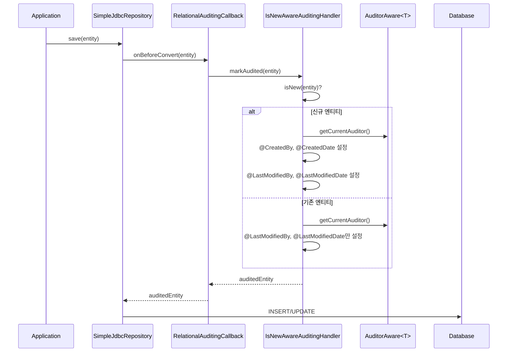

# Auditing (감사 추적)

Spring Data JDBC의 Auditing 기능은 엔티티의 생성/수정 시점과 주체를 자동으로 기록한다. `@EnableJdbcAuditing`과 함께 `@CreatedDate`, `@LastModifiedDate`, `@CreatedBy`, `@LastModifiedBy` 어노테이션을 사용하여 별도 코드 없이 감사 필드를 관리할 수 있다.

## 목차
- [1. 핵심 개념 (What)](#1-핵심-개념-what)
- [2. 왜 알아야 하는가 (Why)](#2-왜-알아야-하는가-why)
- [3. 내부 구현 분석 (How)](#3-내부-구현-분석-how)
- [4. 실전 예제](#4-실전-예제)
- [5. 정리](#5-정리)

---

## 1. 핵심 개념 (What)

### Auditing이란?

Auditing은 데이터의 생성 및 변경 이력을 자동으로 추적하는 메커니즘이다. Spring Data에서는 다음 네 가지 정보를 자동 관리한다:

| 어노테이션 | 역할 | 타입 예시 |
|---|---|---|
| `@CreatedDate` | 엔티티 최초 생성 시각 | `LocalDateTime`, `Instant`, `Long` |
| `@LastModifiedDate` | 엔티티 최종 수정 시각 | `LocalDateTime`, `Instant`, `Long` |
| `@CreatedBy` | 엔티티 최초 생성자 | `String`, `Long`, 커스텀 타입 |
| `@LastModifiedBy` | 엔티티 최종 수정자 | `String`, `Long`, 커스텀 타입 |

이 어노테이션들은 `org.springframework.data.annotation` 패키지에 속하며, Spring Data 공통 모듈에서 제공한다.

### 핵심 구성 요소

- **`@EnableJdbcAuditing`**: JDBC 환경에서 Auditing을 활성화하는 설정 어노테이션
- **`AuditorAware<T>`**: 현재 사용자(principal)를 제공하는 SPI 인터페이스
- **`RelationalAuditingCallback`**: `BeforeConvertCallback`을 구현하여 저장 직전에 감사 필드를 채우는 콜백
- **`IsNewAwareAuditingHandler`**: 엔티티가 신규인지 아닌지를 판별하여 적절한 감사 필드를 설정하는 핸들러

---

## 2. 왜 알아야 하는가 (Why)

### 실무에서의 필요성

1. **규정 준수**: 금융, 의료 등 규제 산업에서는 데이터 변경 이력 관리가 법적 요구사항이다
2. **디버깅과 추적**: 운영 환경에서 "이 데이터를 누가, 언제 변경했는가"를 빠르게 파악할 수 있다
3. **보일러플레이트 제거**: 매 `save()` 호출마다 수동으로 타임스탬프를 설정하는 반복 코드를 없앤다
4. **일관성 보장**: 프레임워크 차원에서 자동 처리하므로 개발자가 깜빡하고 빠뜨릴 가능성이 없다

### 수동 관리와의 비교

```java
// 수동 관리 -- 모든 서비스에서 반복
public Order createOrder(OrderRequest req) {
    Order order = new Order(req);
    order.setCreatedAt(LocalDateTime.now());    // 매번 직접 설정
    order.setCreatedBy(getCurrentUser());        // 매번 직접 설정
    return repository.save(order);
}

// Auditing 사용 -- 프레임워크가 자동 처리
public Order createOrder(OrderRequest req) {
    return repository.save(new Order(req));      // 감사 필드 자동 설정
}
```

---

## 3. 내부 구현 분석 (How)

### 아키텍처 다이어그램



### 1단계: @EnableJdbcAuditing 활성화

`@EnableJdbcAuditing` 어노테이션은 `@Import(JdbcAuditingRegistrar.class)`를 통해 `JdbcAuditingRegistrar`를 등록한다.

```java
// EnableJdbcAuditing.java
@Inherited
@Documented
@Target(ElementType.TYPE)
@Retention(RetentionPolicy.RUNTIME)
@Import(JdbcAuditingRegistrar.class)
public @interface EnableJdbcAuditing {
    String auditorAwareRef() default "";
    boolean setDates() default true;
    boolean modifyOnCreate() default true;
    String dateTimeProviderRef() default "";
}
```

주요 속성:
- `auditorAwareRef`: `AuditorAware` 빈의 이름을 지정 (기본값은 타입 기반 자동 탐색)
- `setDates`: 날짜 자동 설정 활성화 여부 (기본 `true`)
- `modifyOnCreate`: 신규 엔티티 생성 시 수정일도 함께 설정할지 여부 (기본 `true`)
- `dateTimeProviderRef`: 커스텀 `DateTimeProvider` 빈 이름

### 2단계: JdbcAuditingRegistrar가 빈을 등록

`JdbcAuditingRegistrar`는 `AuditingBeanDefinitionRegistrarSupport`를 상속하며, 두 가지 핵심 빈을 등록한다:

```java
// JdbcAuditingRegistrar.java (핵심 부분)
class JdbcAuditingRegistrar extends AuditingBeanDefinitionRegistrarSupport {

    private static final String AUDITING_HANDLER_BEAN_NAME = "jdbcAuditingHandler";

    @Override
    protected BeanDefinitionBuilder getAuditHandlerBeanDefinitionBuilder(
            AuditingConfiguration configuration) {
        return configureDefaultAuditHandlerAttributes(configuration,
            BeanDefinitionBuilder.rootBeanDefinition(IsNewAwareAuditingHandler.class));
    }

    @Override
    protected void registerAuditListenerBeanDefinition(
            BeanDefinition auditingHandlerDefinition, BeanDefinitionRegistry registry) {
        BeanDefinitionBuilder listenerBuilder = BeanDefinitionBuilder
            .rootBeanDefinition(RelationalAuditingCallback.class);
        listenerBuilder.addConstructorArgValue(
            ParsingUtils.getObjectFactoryBeanDefinition(AUDITING_HANDLER_BEAN_NAME, registry));
        registerInfrastructureBeanWithId(listenerBuilder.getBeanDefinition(),
            RelationalAuditingCallback.class.getName(), registry);
    }
}
```

등록되는 빈:
1. `IsNewAwareAuditingHandler` ("jdbcAuditingHandler") -- `jdbcMappingContext`로부터 생성
2. `RelationalAuditingCallback` -- `BeforeConvertCallback`으로 등록

### 3단계: RelationalAuditingCallback이 저장 전에 감사 정보를 주입

`RelationalAuditingCallback`은 `BeforeConvertCallback<Object>`을 구현한다. 엔티티가 DB에 변환되기 전, 즉 INSERT/UPDATE SQL이 생성되기 전에 호출된다.

```java
// RelationalAuditingCallback.java
public class RelationalAuditingCallback implements BeforeConvertCallback<Object>, Ordered {

    public static final int AUDITING_ORDER = 100;

    private final ObjectFactory<IsNewAwareAuditingHandler> auditingHandlerFactory;

    @Override
    public Object onBeforeConvert(Object entity) {
        return auditingHandlerFactory.getObject().markAudited(entity);
    }

    @Override
    public int getOrder() {
        return AUDITING_ORDER;
    }
}
```

핵심 포인트:
- `Ordered` 인터페이스를 구현하여 `AUDITING_ORDER = 100`으로 순서를 보장한다
- 다른 `BeforeConvertCallback`보다 먼저 실행되어 감사 필드가 채워진 상태로 후속 콜백에 전달된다
- `ObjectFactory`를 사용하여 `IsNewAwareAuditingHandler`의 지연 초기화(lazy initialization)를 지원한다

### 4단계: IsNewAwareAuditingHandler의 판별 로직

`IsNewAwareAuditingHandler`는 Spring Data Commons에 위치하며, 엔티티의 `isNew` 상태에 따라 다른 감사 전략을 적용한다:

- **신규 엔티티** (`isNew == true`): `@CreatedDate`, `@CreatedBy`, `@LastModifiedDate`, `@LastModifiedBy` 모두 설정
- **기존 엔티티** (`isNew == false`): `@LastModifiedDate`, `@LastModifiedBy`만 설정

```
엔티티 판별 흐름:
  isNew(entity) == true?
    ├── YES → markCreated() → @CreatedDate + @CreatedBy + (옵션: @LastModified*)
    └── NO  → markModified() → @LastModifiedDate + @LastModifiedBy
```

`isNew` 판별은 Spring Data의 기본 전략(`@Id` 필드가 `null`이면 신규)을 따르거나, `Persistable` 인터페이스 구현으로 커스터마이징할 수 있다.

---

## 4. 실전 예제

### 예제 1: 기본 Auditing 설정

```java
// 1. 엔티티 정의
import org.springframework.data.annotation.*;
import org.springframework.data.relational.core.mapping.Table;
import java.time.LocalDateTime;

@Table("orders")
public class Order {

    @Id
    private Long id;

    private String product;
    private int quantity;

    @CreatedDate
    private LocalDateTime createdAt;

    @LastModifiedDate
    private LocalDateTime updatedAt;

    @CreatedBy
    private String createdBy;

    @LastModifiedBy
    private String updatedBy;

    // 생성자, getter 생략
}
```

```java
// 2. AuditorAware 구현
import org.springframework.data.domain.AuditorAware;
import org.springframework.security.core.Authentication;
import org.springframework.security.core.context.SecurityContextHolder;
import java.util.Optional;

public class SpringSecurityAuditorAware implements AuditorAware<String> {

    @Override
    public Optional<String> getCurrentAuditor() {
        return Optional.ofNullable(SecurityContextHolder.getContext().getAuthentication())
                .filter(Authentication::isAuthenticated)
                .map(Authentication::getName);
    }
}
```

```java
// 3. 설정 클래스
import org.springframework.context.annotation.Bean;
import org.springframework.context.annotation.Configuration;
import org.springframework.data.domain.AuditorAware;
import org.springframework.data.jdbc.repository.config.EnableJdbcAuditing;

@Configuration
@EnableJdbcAuditing
public class AuditingConfig {

    @Bean
    public AuditorAware<String> auditorProvider() {
        return new SpringSecurityAuditorAware();
    }
}
```

```sql
-- 4. DDL
CREATE TABLE orders (
    id         BIGINT AUTO_INCREMENT PRIMARY KEY,
    product    VARCHAR(255),
    quantity   INT,
    created_at TIMESTAMP NOT NULL,
    updated_at TIMESTAMP NOT NULL,
    created_by VARCHAR(100),
    updated_by VARCHAR(100)
);
```

### 예제 2: 커스텀 DateTimeProvider 사용

테스트 환경이나 특수 시간대 요구사항이 있을 때 `DateTimeProvider`를 커스터마이징할 수 있다.

```java
import org.springframework.data.auditing.DateTimeProvider;
import java.time.LocalDateTime;
import java.time.ZoneId;
import java.time.temporal.TemporalAccessor;
import java.util.Optional;

public class UtcDateTimeProvider implements DateTimeProvider {

    @Override
    public Optional<TemporalAccessor> getNow() {
        return Optional.of(LocalDateTime.now(ZoneId.of("UTC")));
    }
}
```

```java
@Configuration
@EnableJdbcAuditing(dateTimeProviderRef = "utcDateTimeProvider")
public class AuditingConfig {

    @Bean
    public AuditorAware<String> auditorProvider() {
        return new SpringSecurityAuditorAware();
    }

    @Bean
    public DateTimeProvider utcDateTimeProvider() {
        return new UtcDateTimeProvider();
    }
}
```

### 예제 3: Aggregate Root 기반 감사 추적 (추상 클래스 활용)

```java
import org.springframework.data.annotation.*;
import java.time.Instant;

public abstract class AuditableEntity {

    @CreatedDate
    private Instant createdAt;

    @LastModifiedDate
    private Instant modifiedAt;

    @CreatedBy
    private String createdBy;

    @LastModifiedBy
    private String modifiedBy;

    // getter만 제공 (setter는 프레임워크가 리플렉션으로 설정)
    public Instant getCreatedAt() { return createdAt; }
    public Instant getModifiedAt() { return modifiedAt; }
    public String getCreatedBy() { return createdBy; }
    public String getModifiedBy() { return modifiedBy; }
}

@Table("products")
public class Product extends AuditableEntity {

    @Id
    private Long id;
    private String name;
    private int price;

    public Product(String name, int price) {
        this.name = name;
        this.price = price;
    }
}
```

### 예제 4: modifyOnCreate = false 설정

생성 시 `@LastModifiedDate`를 설정하지 않으려면:

```java
@Configuration
@EnableJdbcAuditing(modifyOnCreate = false)
public class AuditingConfig {

    @Bean
    public AuditorAware<String> auditorProvider() {
        return () -> Optional.of("system");
    }
}
```

이 경우 최초 INSERT 시 `@LastModifiedDate`는 `null`로 남고, 이후 UPDATE 시에만 값이 채워진다.

---

## 5. 정리

| 항목 | 설명 |
|---|---|
| 활성화 방법 | `@EnableJdbcAuditing`을 `@Configuration` 클래스에 부착 |
| 날짜 자동 기록 | `@CreatedDate`, `@LastModifiedDate` 사용. `DateTimeProvider`로 커스터마이징 가능 |
| 작성자 자동 기록 | `@CreatedBy`, `@LastModifiedBy` 사용. `AuditorAware<T>` 빈 등록 필수 |
| 내부 동작 | `RelationalAuditingCallback` (BeforeConvertCallback) -> `IsNewAwareAuditingHandler.markAudited()` |
| isNew 판별 | `@Id`가 `null`이면 신규. `Persistable` 구현으로 커스터마이징 가능 |
| 실행 순서 | `AUDITING_ORDER = 100`으로 다른 콜백보다 먼저 실행 |
| 주의사항 | `@CreatedBy`/`@LastModifiedBy` 사용 시 `AuditorAware` 빈이 반드시 필요 |

### 콜백 실행 순서 요약

```
save(entity)
  → BeforeConvertCallback (RelationalAuditingCallback, order=100)
    → IsNewAwareAuditingHandler.markAudited()
      → AuditorAware.getCurrentAuditor()
  → AggregateChange 생성 (INSERT/UPDATE SQL 결정)
  → BeforeSaveCallback
  → SQL 실행
  → AfterSaveCallback
```

---
*참고: Spring Data JDBC 3.x / Spring Boot 3.x 기준*
