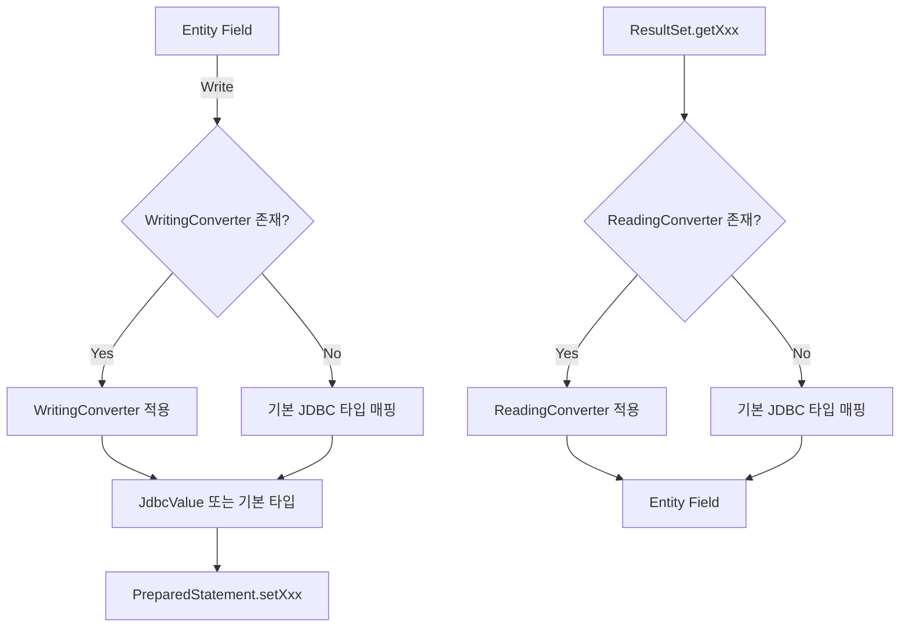

# 커스텀 컨버전 등록과 활용

Spring Data JDBC에서 Java 타입과 데이터베이스 컬럼 간의 변환은 `Converter<S,T>` 인터페이스로 제어한다. `JdbcCustomConversions`를 통해 사용자 정의 변환기를 등록하면, 프레임워크가 자동으로 읽기/쓰기 시 적절한 타입 변환을 수행한다.

## 목차
- [1. 핵심 개념 (What)](#1-핵심-개념-what)
- [2. 왜 알아야 하는가 (Why)](#2-왜-알아야-하는가-why)
- [3. 내부 구현 분석 (How)](#3-내부-구현-분석-how)
- [4. 실전 예제](#4-실전-예제)
- [5. 정리](#5-정리)

---

## 1. 핵심 개념 (What)

### 타입 변환 시스템의 구성

Spring Data JDBC의 변환 시스템은 세 계층으로 구성된다:

| 계층 | 설명 | 예시 |
|---|---|---|
| **기본 변환** | JDBC 드라이버가 자체 지원하는 타입 매핑 | `String` <-> `VARCHAR`, `Long` <-> `BIGINT` |
| **Store 변환** | 프레임워크가 제공하는 JSR-310 등 기본 변환기 | `Timestamp` <-> `LocalDateTime` |
| **사용자 변환** | 개발자가 직접 등록하는 커스텀 변환기 | `Money` <-> `BigDecimal`, `Email` -> `String` |

### 핵심 클래스

- **`JdbcCustomConversions`**: 커스텀 변환기를 등록하고 관리하는 중앙 클래스
- **`JdbcValue`**: JDBC 드라이버에 전달할 값과 `SQLType`을 함께 래핑하는 값 객체
- **`@ReadingConverter`**: DB -> Java 방향 변환에 사용
- **`@WritingConverter`**: Java -> DB 방향 변환에 사용
- **`Dialect.getConverters()`**: 데이터베이스별 기본 변환기 제공

---

## 2. 왜 알아야 하는가 (Why)

### 실무에서의 필요성

1. **Value Object 매핑**: DDD 스타일의 `Email`, `Money`, `PhoneNumber` 같은 값 객체를 DB 컬럼에 직접 매핑
2. **JSON 컬럼 지원**: PostgreSQL의 `jsonb`, MySQL의 `JSON` 컬럼을 Java 객체로 변환
3. **배열 타입 처리**: PostgreSQL의 배열 컬럼(`text[]`, `integer[]`)을 Java 컬렉션으로 매핑
4. **레거시 데이터 호환**: 기존 DB의 특이한 저장 형식(예: 콤마 구분 문자열)을 Java 타입에 매핑
5. **암호화/복호화**: 저장 시 암호화, 읽기 시 복호화가 필요한 민감 데이터 처리

### 기본 변환만으로 부족한 경우

```java
// 이런 Value Object를 DB에 어떻게 저장할 것인가?
public record Email(String value) {
    public Email {
        if (!value.contains("@")) throw new IllegalArgumentException("Invalid email");
    }
}

// 컨버터 없이는 Spring Data JDBC가 Email을 어떤 컬럼 타입에 매핑할지 알 수 없다
```

---

## 3. 내부 구현 분석 (How)

### 아키텍처 다이어그램



### JdbcCustomConversions 클래스 구조

`JdbcCustomConversions`는 `CustomConversions`를 상속하며, JDBC에 특화된 기본 변환기를 포함한다.

```java
// JdbcCustomConversions.java (핵심 구조)
public class JdbcCustomConversions extends CustomConversions {

    // JSR-310 기본 변환기 (Timestamp <-> LocalDateTime 등)
    private static final Collection<Object> STORE_CONVERTERS =
        Collections.unmodifiableCollection(
            Jsr310TimestampBasedConverters.getConvertersToRegister());

    // 빈 생성자 -- 기본 변환기만 등록
    public JdbcCustomConversions() {
        this(Collections.emptyList());
    }

    // 사용자 변환기 추가 등록
    public JdbcCustomConversions(List<?> userConverters) {
        this(StoreConversions.of(JdbcSimpleTypes.HOLDER, STORE_CONVERTERS),
             userConverters);
    }

    // Dialect 기반 팩토리 메서드 (권장 방식)
    public static JdbcCustomConversions of(Dialect dialect, Collection<?> converters) {
        return create(dialect, configurer -> configurer.registerConverters(converters));
    }
}
```

### Dialect별 기본 컨버터

각 DB Dialect는 `getConverters()` 메서드를 통해 자체 변환기를 제공한다:

```java
// Dialect 인터페이스
public interface Dialect {
    // 각 Dialect 구현체가 DB별 변환기를 반환
    default Collection<Object> getConverters() {
        return Collections.emptySet();
    }

    // Dialect별 네이티브 타입 정의
    default Set<Class<?>> simpleTypes() {
        return Collections.emptySet();
    }
}
```

`JdbcCustomConversions.of(dialect, converters)` 팩토리 메서드는 내부적으로 `JdbcConverterConfigurer`를 사용하여 Dialect 변환기와 사용자 변환기를 통합한다:

```java
// JdbcConverterConfigurer (JdbcCustomConversions 내부 클래스)
public static class JdbcConverterConfigurer {

    static JdbcConverterConfigurer from(Dialect dialect) {
        List<Object> converters = new ArrayList<>();
        converters.addAll(dialect.getConverters());    // Dialect 기본 변환기
        converters.addAll(JdbcCustomConversions.storeConverters()); // JSR-310 변환기

        SimpleTypeHolder simpleTypeHolder =
            new SimpleTypeHolder(dialect.simpleTypes(), JdbcSimpleTypes.HOLDER);
        return new JdbcConverterConfigurer(
            StoreConversions.of(simpleTypeHolder, converters));
    }

    // 사용자 변환기 등록
    public JdbcConverterConfigurer registerConverter(Converter<?, ?> converter) {
        customConverters.add(converter);
        return this;
    }

    // ConverterFactory 등록 (계층적 변환 지원)
    public JdbcConverterConfigurer registerConverterFactory(
            ConverterFactory<?, ?> converterFactory) {
        customConverters.add(converterFactory);
        return this;
    }
}
```

### JdbcValue -- JDBC 타입 힌트 래퍼

`JdbcValue`는 JDBC 드라이버에 값과 `SQLType`을 함께 전달해야 할 때 사용한다. 특히 `NULL` 값의 타입 지정이나 `JDBCType.OTHER`(JSON 등)를 명시할 때 필수적이다.

```java
// JdbcValue.java
public class JdbcValue {
    private final @Nullable Object value;
    private final SQLType jdbcType;

    public static JdbcValue of(@Nullable Object value, @Nullable SQLType jdbcType) {
        if (jdbcType == null) {
            jdbcType = value == null ? JDBCType.NULL : JDBCType.OTHER;
        }
        return new JdbcValue(value, jdbcType);
    }
}
```

`WritingConverter`가 `JdbcValue`를 반환하면, 프레임워크는 `PreparedStatement.setObject(value, sqlType)`을 호출하여 드라이버에 타입 힌트를 제공한다.

### 기본 제공 JSR-310 변환기

`Jsr310TimestampBasedConverters`가 제공하는 변환기 목록:

```
TimestampToLocalDateTimeConverter   (Timestamp -> LocalDateTime) @ReadingConverter
TimestampToLocalDateConverter       (Timestamp -> LocalDate)     @ReadingConverter
LocalDateToTimestampConverter       (LocalDate -> Timestamp)     @WritingConverter
TimestampToLocalTimeConverter       (Timestamp -> LocalTime)     @ReadingConverter
LocalTimeToTimestampConverter       (LocalTime -> Timestamp)     @WritingConverter
TimestampToInstantConverter         (Timestamp -> Instant)       @ReadingConverter
InstantToTimestampConverter         (Instant -> Timestamp)       @WritingConverter
```

이 변환기들은 `java.sql.Timestamp` 기반이므로 나노초 정밀도를 보존한다.

---

## 4. 실전 예제

### 예제 1: Value Object 변환기

```java
// Value Object 정의
public record Email(String value) {
    public Email {
        if (value == null || !value.contains("@")) {
            throw new IllegalArgumentException("Invalid email: " + value);
        }
    }
}
```

```java
// Writing Converter: Email -> String
@WritingConverter
public class EmailToStringConverter implements Converter<Email, String> {
    @Override
    public String convert(Email source) {
        return source.value();
    }
}

// Reading Converter: String -> Email
@ReadingConverter
public class StringToEmailConverter implements Converter<String, Email> {
    @Override
    public Email convert(String source) {
        return new Email(source);
    }
}
```

```java
// 설정 등록
@Configuration
public class ConversionConfig extends AbstractJdbcConfiguration {

    @Override
    public JdbcCustomConversions jdbcCustomConversions() {
        return new JdbcCustomConversions(List.of(
            new EmailToStringConverter(),
            new StringToEmailConverter()
        ));
    }
}
```

```java
// 엔티티에서 사용
@Table("users")
public class User {
    @Id
    private Long id;
    private String name;
    private Email email;  // VARCHAR 컬럼에 자동 변환
}
```

### 예제 2: JSON 컬럼 변환 (PostgreSQL jsonb)

```java
// Writing Converter: Map -> JdbcValue (jsonb)
@WritingConverter
public class MapToJsonConverter implements Converter<Map<String, Object>, JdbcValue> {

    private final ObjectMapper objectMapper = new ObjectMapper();

    @Override
    public JdbcValue convert(Map<String, Object> source) {
        try {
            String json = objectMapper.writeValueAsString(source);
            return JdbcValue.of(json, JDBCType.OTHER);
        } catch (JsonProcessingException e) {
            throw new IllegalStateException("Failed to serialize to JSON", e);
        }
    }
}
```

```java
// Reading Converter: PGobject -> Map
@ReadingConverter
public class JsonToMapConverter implements Converter<org.postgresql.util.PGobject, Map<String, Object>> {

    private final ObjectMapper objectMapper = new ObjectMapper();

    @Override
    @SuppressWarnings("unchecked")
    public Map<String, Object> convert(PGobject source) {
        try {
            return objectMapper.readValue(source.getValue(),
                new TypeReference<Map<String, Object>>() {});
        } catch (JsonProcessingException e) {
            throw new IllegalStateException("Failed to deserialize JSON", e);
        }
    }
}
```

```java
@Table("products")
public class Product {
    @Id
    private Long id;
    private String name;
    private Map<String, Object> metadata;  // jsonb 컬럼
}
```

### 예제 3: Dialect 기반 등록 (권장)

```java
@Configuration
public class ConversionConfig extends AbstractJdbcConfiguration {

    @Bean
    @Override
    public JdbcCustomConversions jdbcCustomConversions() {
        // Dialect의 기본 변환기를 포함하여 등록
        return JdbcCustomConversions.of(
            PostgresDialect.INSTANCE,
            List.of(
                new EmailToStringConverter(),
                new StringToEmailConverter(),
                new MapToJsonConverter(),
                new JsonToMapConverter()
            )
        );
    }
}
```

### 예제 4: Enum 커스텀 변환

```java
public enum OrderStatus {
    PENDING("P"), CONFIRMED("C"), SHIPPED("S"), DELIVERED("D");

    private final String code;
    OrderStatus(String code) { this.code = code; }
    public String getCode() { return code; }

    public static OrderStatus fromCode(String code) {
        return Arrays.stream(values())
            .filter(s -> s.code.equals(code))
            .findFirst()
            .orElseThrow(() -> new IllegalArgumentException("Unknown code: " + code));
    }
}

@WritingConverter
public class OrderStatusToStringConverter implements Converter<OrderStatus, String> {
    @Override
    public String convert(OrderStatus source) {
        return source.getCode();  // PENDING -> "P"
    }
}

@ReadingConverter
public class StringToOrderStatusConverter implements Converter<String, OrderStatus> {
    @Override
    public OrderStatus convert(String source) {
        return OrderStatus.fromCode(source);  // "P" -> PENDING
    }
}
```

### 예제 5: 암호화 변환기

```java
@WritingConverter
public class EncryptingConverter implements Converter<SensitiveData, String> {

    private final EncryptionService encryptionService;

    public EncryptingConverter(EncryptionService encryptionService) {
        this.encryptionService = encryptionService;
    }

    @Override
    public String convert(SensitiveData source) {
        return encryptionService.encrypt(source.getValue());
    }
}

@ReadingConverter
public class DecryptingConverter implements Converter<String, SensitiveData> {

    private final EncryptionService encryptionService;

    public DecryptingConverter(EncryptionService encryptionService) {
        this.encryptionService = encryptionService;
    }

    @Override
    public SensitiveData convert(String source) {
        return new SensitiveData(encryptionService.decrypt(source));
    }
}
```

---

## 5. 정리

| 항목 | 설명 |
|---|---|
| 변환기 인터페이스 | `Converter<S,T>`, `ConverterFactory<S,T>`, `GenericConverter` |
| 방향 어노테이션 | `@ReadingConverter` (DB->Java), `@WritingConverter` (Java->DB) |
| 등록 클래스 | `JdbcCustomConversions` -- 생성자 또는 `of(Dialect, converters)` 팩토리 |
| 타입 힌트 | `JdbcValue.of(value, JDBCType)` -- NULL 타입이나 jsonb 등에 필수 |
| Dialect 통합 | `JdbcCustomConversions.of(dialect, converters)` 사용 시 Dialect 기본 변환기 자동 포함 |
| 기본 변환기 | `Jsr310TimestampBasedConverters` -- Timestamp <-> JSR-310 타입 7개 제공 |
| 주의사항 | `@ReadingConverter`/`@WritingConverter` 미지정 시 양방향 등록됨 -- 명시적 지정 권장 |
| 변환 우선순위 | 사용자 변환기 > Store 변환기 > Dialect 변환기 > 기본 JDBC 매핑 |

### 변환기 등록 방식 비교

```
방식 1: 리스트 직접 전달 (간단)
  new JdbcCustomConversions(List.of(converter1, converter2))
  → Dialect 변환기 미포함, JSR-310 변환기만 포함

방식 2: Dialect 기반 팩토리 (권장)
  JdbcCustomConversions.of(PostgresDialect.INSTANCE, List.of(...))
  → Dialect 변환기 + JSR-310 변환기 + 사용자 변환기 모두 포함

방식 3: JdbcConverterConfigurer (세밀한 제어)
  JdbcCustomConversions.create(dialect, configurer -> {
      configurer.registerConverter(converter1);
      configurer.registerConverterFactory(factory1);
  })
  → 가장 유연한 방식
```

---
*참고: Spring Data JDBC 3.x / Spring Boot 3.x 기준*
