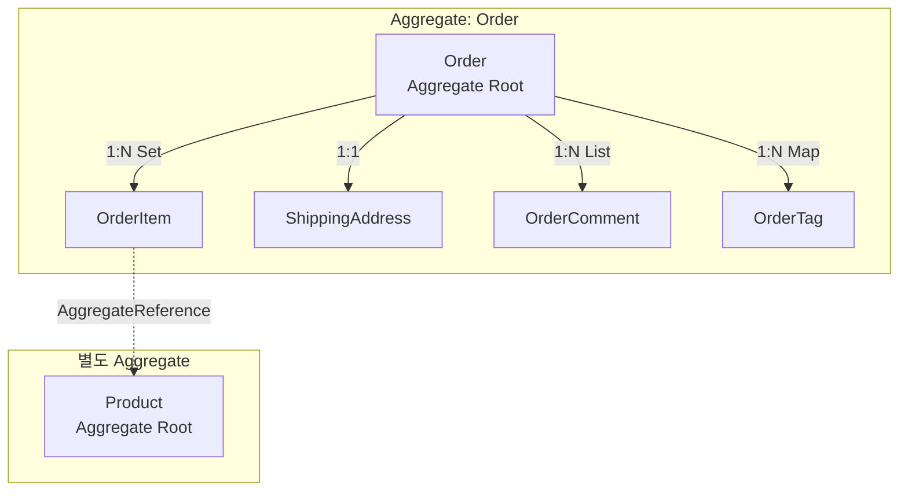

# 컬렉션 매핑과 참조 관계

Spring Data JDBC에서 Aggregate 내부의 1:1, 1:N 관계는 `@MappedCollection`으로 매핑하고, Aggregate 경계를 넘는 참조는 `AggregateReference`를 사용한다. 이 문서에서는 List, Set, Map 각각의 테이블 구조, FK/키 컬럼 규칙, 그리고 Aggregate 간 참조 패턴을 분석한다.

## 목차
- [1. 핵심 개념 (What)](#1-핵심-개념-what)
- [2. 왜 알아야 하는가 (Why)](#2-왜-알아야-하는가-why)
- [3. 내부 구현 분석 (How)](#3-내부-구현-분석-how)
- [4. 실전 예제](#4-실전-예제)
- [5. 정리](#5-정리)

---

## 1. 핵심 개념 (What)

### Aggregate 내 관계 vs Aggregate 간 참조

Spring Data JDBC는 DDD의 Aggregate 패턴을 엄격하게 따른다:

| 관계 유형 | 설명 | 매핑 방법 |
|---|---|---|
| **Aggregate 내부** (소유 관계) | 부모 엔티티가 자식을 직접 소유 | 자식 엔티티를 필드로 직접 참조 |
| **Aggregate 간** (참조 관계) | 다른 Aggregate Root의 ID만 참조 | `AggregateReference<T, ID>` 사용 |

### @MappedCollection 어노테이션

```java
// MappedCollection.java
@Retention(RetentionPolicy.RUNTIME)
@Target({ ElementType.FIELD, ElementType.METHOD, ElementType.ANNOTATION_TYPE })
@Documented
public @interface MappedCollection {
    String idColumn() default "";   // 역방향 FK 컬럼명
    String keyColumn() default "";  // List/Map의 순서/키 컬럼명
}
```

- `idColumn`: 자식 테이블에서 부모를 가리키는 FK 컬럼명. 기본값은 `NamingStrategy.getReverseColumnName()`이 결정
- `keyColumn`: `List`의 인덱스 또는 `Map`의 키를 저장하는 컬럼명. 기본값은 `NamingStrategy.getKeyColumn()`이 결정

### AggregateReference

```java
// AggregateReference.java
public interface AggregateReference<T, ID> {
    static <T, ID> AggregateReference<T, ID> to(ID id) {
        return new IdOnlyAggregateReference<>(id);
    }
    ID getId();
}
```

`AggregateReference<T, ID>`는 다른 Aggregate의 ID만 보유하는 경량 참조로, 실제 엔티티를 로드하지 않는다.

---

## 2. 왜 알아야 하는가 (Why)

### DDD Aggregate 설계의 핵심

1. **Aggregate 경계 명확화**: 어떤 엔티티가 함께 저장/삭제되는지 코드로 표현
2. **일관성 경계**: Aggregate Root를 통해서만 내부 엔티티에 접근 -- 트랜잭션 일관성 보장
3. **Cascade 동작**: Aggregate 내부 컬렉션은 부모와 함께 자동으로 INSERT/UPDATE/DELETE
4. **N+1 문제 회피**: Spring Data JDBC는 Aggregate 전체를 한 번에 로드하므로, 관계 구조를 잘 설계해야 성능이 보장됨

### JPA와의 차이점

| 항목 | JPA | Spring Data JDBC |
|---|---|---|
| 양방향 관계 | 지원 (`@ManyToOne` + `@OneToMany`) | 미지원 (단방향만) |
| Lazy Loading | 기본 지원 | 미지원 (항상 Eager) |
| 관계 어노테이션 | `@OneToMany`, `@ManyToMany` 등 | `@MappedCollection`, 직접 참조 |
| Cascade | 별도 설정 필요 | 항상 전체 Cascade (Aggregate 단위) |
| 외부 참조 | 엔티티 직접 참조 | `AggregateReference<T, ID>` |

---

## 3. 내부 구현 분석 (How)

### Aggregate 구조와 테이블 매핑



### 1:1 관계 (단일 자식 엔티티)

자식 엔티티를 직접 필드로 선언하면 1:1 관계가 된다.

```java
@Table("orders")
public class Order {
    @Id
    private Long id;
    private ShippingAddress shippingAddress;  // 1:1 관계
}

@Table("shipping_address")
public class ShippingAddress {
    // @Id 없음 -- Aggregate Root가 아닌 내부 엔티티
    private String street;
    private String city;
    private String zipCode;
}
```

테이블 구조:
```sql
CREATE TABLE orders (
    id BIGINT AUTO_INCREMENT PRIMARY KEY
);

CREATE TABLE shipping_address (
    street    VARCHAR(255),
    city      VARCHAR(100),
    zip_code  VARCHAR(20),
    "orders"  BIGINT REFERENCES orders(id)  -- 역방향 FK (NamingStrategy 기본값)
);
```

### 1:N 관계 -- Set

`Set`은 순서가 없으므로 `keyColumn`이 필요 없다. FK 컬럼만 존재한다.

```java
@Table("orders")
public class Order {
    @Id
    private Long id;

    @MappedCollection(idColumn = "ORDER_ID")
    private Set<OrderItem> items = new HashSet<>();
}
```

테이블 구조:
```sql
CREATE TABLE order_item (
    id        BIGINT AUTO_INCREMENT PRIMARY KEY,
    product   VARCHAR(255),
    quantity  INT,
    order_id  BIGINT REFERENCES orders(id)  -- idColumn
);
```

### 1:N 관계 -- List

`List`는 순서를 보존해야 하므로 `keyColumn`(인덱스 저장)이 추가로 필요하다.

```java
@Table("orders")
public class Order {
    @Id
    private Long id;

    @MappedCollection(idColumn = "ORDER_ID", keyColumn = "ORDER_IDX")
    private List<OrderComment> comments = new ArrayList<>();
}
```

테이블 구조:
```sql
CREATE TABLE order_comment (
    content    TEXT,
    order_id   BIGINT REFERENCES orders(id),  -- idColumn (FK)
    order_idx  INT                              -- keyColumn (List 인덱스)
);
```

### 1:N 관계 -- Map

`Map`은 키 값을 `keyColumn`에 저장한다.

```java
@Table("orders")
public class Order {
    @Id
    private Long id;

    @MappedCollection(idColumn = "ORDER_ID", keyColumn = "TAG_KEY")
    private Map<String, OrderTag> tags = new HashMap<>();
}
```

테이블 구조:
```sql
CREATE TABLE order_tag (
    tag_value  VARCHAR(255),
    order_id   BIGINT REFERENCES orders(id),  -- idColumn (FK)
    tag_key    VARCHAR(100)                     -- keyColumn (Map 키)
);
```

### NamingStrategy 기본 규칙

`@MappedCollection`에서 `idColumn`과 `keyColumn`을 생략하면 `NamingStrategy`의 기본 규칙이 적용된다:

```java
// NamingStrategy.java (기본 구현)
public interface NamingStrategy {

    // 역방향 FK 컬럼명: 부모 테이블명을 반환
    default String getReverseColumnName(RelationalPersistentProperty property) {
        return property.getOwner().getTableName().getReference();
    }

    // Map/List의 키 컬럼명: "부모테이블명_key"
    default String getKeyColumn(RelationalPersistentProperty property) {
        return getReverseColumnName(property) + "_key";
    }
}
```

예시: `Order` -> `OrderItem`의 경우
- FK 컬럼: `order` (Order 테이블명)
- 키 컬럼: `order_key`

### AggregateReference의 DB 저장 방식

`AggregateReference`는 내부적으로 ID 값만 저장한다. DB에서는 단순 FK 컬럼으로 매핑된다.

```java
// IdOnlyAggregateReference.java
record IdOnlyAggregateReference<T, ID>(ID id) implements AggregateReference<T, ID> {
    IdOnlyAggregateReference {
        Assert.notNull(id, "Id must not be null");
    }

    @Override
    public ID getId() {
        return id();
    }
}
```

DB 저장 시 `AggregateReference<Product, Long>`은 자동으로 `Long` 타입의 FK 컬럼으로 변환된다.

### Cascade 동작 (Aggregate 내부)

```
save(order)
  → INSERT INTO orders (...)
  → DELETE FROM order_item WHERE order_id = ?     -- 기존 자식 모두 삭제
  → INSERT INTO order_item (...) VALUES (...)     -- 새 자식 전체 삽입
  → DELETE FROM shipping_address WHERE orders = ? -- 기존 1:1 삭제
  → INSERT INTO shipping_address (...) VALUES (...) -- 새 1:1 삽입

delete(order)
  → DELETE FROM order_item WHERE order_id = ?     -- 자식 먼저 삭제
  → DELETE FROM shipping_address WHERE orders = ?
  → DELETE FROM orders WHERE id = ?               -- 부모 삭제
```

이것이 "항상 전체 Cascade"의 의미이다. UPDATE 시에도 자식을 전부 DELETE 후 다시 INSERT하는 전략을 사용한다.

---

## 4. 실전 예제

### 예제 1: 주문 Aggregate (Set + 1:1 + AggregateReference)

```java
@Table("orders")
public class Order {

    @Id
    private Long id;
    private String orderNumber;
    private LocalDateTime orderedAt;

    // 1:1 관계 -- Aggregate 내부
    private ShippingAddress shippingAddress;

    // 1:N 관계 (Set) -- Aggregate 내부
    @MappedCollection(idColumn = "ORDER_ID")
    private Set<OrderLine> lines = new HashSet<>();

    public void addLine(Long productId, int quantity, BigDecimal price) {
        lines.add(new OrderLine(productId, quantity, price));
    }
}

public class ShippingAddress {
    private String street;
    private String city;
    private String zipCode;

    public ShippingAddress(String street, String city, String zipCode) {
        this.street = street;
        this.city = city;
        this.zipCode = zipCode;
    }
}

@Table("order_lines")
public class OrderLine {
    @Id
    private Long id;

    // 외부 Aggregate 참조 -- AggregateReference
    private AggregateReference<Product, Long> product;

    private int quantity;
    private BigDecimal unitPrice;

    public OrderLine(Long productId, int quantity, BigDecimal unitPrice) {
        this.product = AggregateReference.to(productId);
        this.quantity = quantity;
        this.unitPrice = unitPrice;
    }
}

// 별도 Aggregate
@Table("products")
public class Product {
    @Id
    private Long id;
    private String name;
    private BigDecimal price;
}
```

```sql
CREATE TABLE orders (
    id           BIGINT AUTO_INCREMENT PRIMARY KEY,
    order_number VARCHAR(50) UNIQUE,
    ordered_at   TIMESTAMP
);

CREATE TABLE shipping_address (
    street    VARCHAR(255),
    city      VARCHAR(100),
    zip_code  VARCHAR(20),
    "orders"  BIGINT REFERENCES orders(id) ON DELETE CASCADE
);

CREATE TABLE order_lines (
    id         BIGINT AUTO_INCREMENT PRIMARY KEY,
    product    BIGINT,   -- AggregateReference -> FK 컬럼
    quantity   INT,
    unit_price DECIMAL(10,2),
    order_id   BIGINT REFERENCES orders(id) ON DELETE CASCADE
);

CREATE TABLE products (
    id    BIGINT AUTO_INCREMENT PRIMARY KEY,
    name  VARCHAR(255),
    price DECIMAL(10,2)
);
```

### 예제 2: List를 사용한 순서 보존

```java
@Table("articles")
public class Article {

    @Id
    private Long id;
    private String title;

    // 순서가 중요한 컬렉션
    @MappedCollection(idColumn = "ARTICLE_ID", keyColumn = "SECTION_ORDER")
    private List<Section> sections = new ArrayList<>();

    public void addSection(String heading, String content) {
        sections.add(new Section(heading, content));
    }

    public void reorderSection(int fromIdx, int toIdx) {
        Section section = sections.remove(fromIdx);
        sections.add(toIdx, section);
    }
}

@Table("sections")
public class Section {
    private String heading;
    private String content;

    public Section(String heading, String content) {
        this.heading = heading;
        this.content = content;
    }
}
```

```sql
CREATE TABLE articles (
    id    BIGINT AUTO_INCREMENT PRIMARY KEY,
    title VARCHAR(255)
);

CREATE TABLE sections (
    heading       VARCHAR(255),
    content       TEXT,
    article_id    BIGINT REFERENCES articles(id) ON DELETE CASCADE,
    section_order INT  -- List 인덱스 (0, 1, 2, ...)
);
```

### 예제 3: Map을 사용한 키-값 저장

```java
@Table("configurations")
public class AppConfig {

    @Id
    private Long id;
    private String appName;

    @MappedCollection(idColumn = "CONFIG_ID", keyColumn = "PROP_KEY")
    private Map<String, ConfigProperty> properties = new HashMap<>();

    public void setProperty(String key, String value) {
        properties.put(key, new ConfigProperty(value));
    }
}

@Table("config_properties")
public class ConfigProperty {
    private String propValue;

    public ConfigProperty(String propValue) {
        this.propValue = propValue;
    }
}
```

```sql
CREATE TABLE configurations (
    id       BIGINT AUTO_INCREMENT PRIMARY KEY,
    app_name VARCHAR(100)
);

CREATE TABLE config_properties (
    prop_value VARCHAR(1000),
    config_id  BIGINT REFERENCES configurations(id) ON DELETE CASCADE,
    prop_key   VARCHAR(200)  -- Map의 키
);
```

### 예제 4: AggregateReference 조회 패턴

```java
// OrderLine에서 Product 정보가 필요할 때
@Service
@RequiredArgsConstructor
public class OrderService {

    private final OrderRepository orderRepository;
    private final ProductRepository productRepository;

    public OrderDetailDto getOrderDetail(Long orderId) {
        Order order = orderRepository.findById(orderId)
            .orElseThrow(() -> new NotFoundException("Order not found"));

        // AggregateReference에서 ID를 추출하여 별도 조회
        Set<Long> productIds = order.getLines().stream()
            .map(line -> line.getProduct().getId())
            .collect(Collectors.toSet());

        Map<Long, Product> productMap = productRepository.findAllById(productIds)
            .stream()
            .collect(Collectors.toMap(Product::getId, Function.identity()));

        return OrderDetailDto.from(order, productMap);
    }
}
```

---

## 5. 정리

| 항목 | 설명 |
|---|---|
| 1:1 관계 | 자식 엔티티를 직접 필드로 선언. 자식 테이블에 부모 FK 컬럼 필요 |
| 1:N Set | `Set<Child>` + `@MappedCollection(idColumn)`. 순서 없음 |
| 1:N List | `List<Child>` + `@MappedCollection(idColumn, keyColumn)`. keyColumn에 인덱스 저장 |
| 1:N Map | `Map<K,V>` + `@MappedCollection(idColumn, keyColumn)`. keyColumn에 Map 키 저장 |
| FK 기본값 | `NamingStrategy.getReverseColumnName()` -- 부모 테이블명 |
| 키 기본값 | `NamingStrategy.getKeyColumn()` -- "부모테이블명_key" |
| 외부 참조 | `AggregateReference<T, ID>` -- ID만 저장, 엔티티 로드 안 함 |
| Cascade | Aggregate 내부는 항상 전체 Cascade (INSERT/DELETE) |
| 제약사항 | 양방향 관계 미지원, Lazy Loading 미지원, 자식은 반드시 하나의 부모에만 속함 |

### 컬렉션 타입별 테이블 구조 비교

```
Set<Child>:
  ┌─────────────┐     ┌──────────────────┐
  │ parent (PK)  │────→│ child            │
  │ id           │     │ ...fields        │
  └─────────────┘     │ parent_id (FK)   │
                       └──────────────────┘

List<Child>:
  ┌─────────────┐     ┌──────────────────┐
  │ parent (PK)  │────→│ child            │
  │ id           │     │ ...fields        │
  └─────────────┘     │ parent_id (FK)   │
                       │ parent_key (IDX) │  ← 순서 인덱스
                       └──────────────────┘

Map<K, Child>:
  ┌─────────────┐     ┌──────────────────┐
  │ parent (PK)  │────→│ child            │
  │ id           │     │ ...fields        │
  └─────────────┘     │ parent_id (FK)   │
                       │ parent_key (KEY) │  ← Map 키 값
                       └──────────────────┘
```

---
*참고: Spring Data JDBC 3.x / Spring Boot 3.x 기준*
