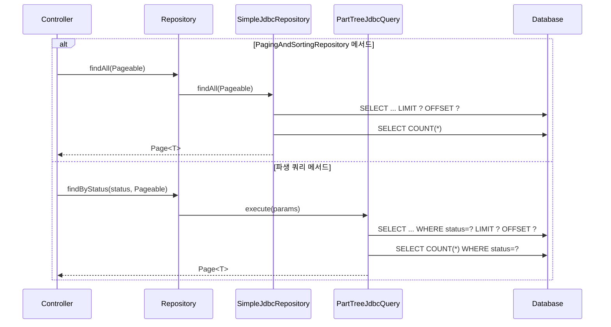

# 페이지네이션, 정렬, 프로젝션

Spring Data JDBC에서 `Pageable`/`Page`/`Slice`, `Sort` 동적 정렬, 인터페이스 기반 프로젝션 및 DTO 프로젝션을 활용하는 방법을 분석한다. `SimpleJdbcRepository`와 `PartTreeJdbcQuery`의 내부 구현을 통해 이 기능들이 어떻게 SQL로 변환되는지 살펴본다.

## 목차
- [1. 핵심 개념 (What)](#1-핵심-개념-what)
- [2. 왜 알아야 하는가 (Why)](#2-왜-알아야-하는가-why)
- [3. 내부 구현 분석 (How)](#3-내부-구현-분석-how)
- [4. 실전 예제](#4-실전-예제)
- [5. 정리](#5-정리)

---

## 1. 핵심 개념 (What)

### 페이지네이션 관련 타입

| 타입 | 역할 | 핵심 특성 |
|---|---|---|
| `Pageable` | 페이지 요청 정보를 담는 인터페이스 | page, size, sort 정보 |
| `Page<T>` | 페이지 결과 + 전체 개수 | `getTotalElements()`, `getTotalPages()` 포함 |
| `Slice<T>` | 페이지 결과 + 다음 페이지 존재 여부 | `hasNext()`만 제공, COUNT 쿼리 없음 |
| `Window<T>` | 스크롤 기반 결과 | Offset/Keyset 스크롤 지원 |

### 정렬 관련 타입

| 타입 | 역할 |
|---|---|
| `Sort` | 정렬 조건을 표현하는 값 객체 |
| `Sort.Order` | 개별 정렬 규칙 (필드명 + 방향) |
| `Sort.Direction` | `ASC` 또는 `DESC` |

### 프로젝션 유형

| 유형 | 설명 | 반환 형식 |
|---|---|---|
| **인터페이스 프로젝션** | getter 메서드로 필드를 선택적 노출 | 프록시 객체 |
| **클래스(DTO) 프로젝션** | 생성자로 필드를 매핑 | DTO 인스턴스 |
| **동적 프로젝션** | 메서드 호출 시 타입을 결정 | 제네릭으로 결정 |

---

## 2. 왜 알아야 하는가 (Why)

### 페이지네이션의 실무적 필요성

1. **대량 데이터 처리**: 수백만 건의 데이터를 한 번에 로드하면 메모리 부족과 응답 지연 발생
2. **UI/API 요구사항**: 거의 모든 목록 API는 페이지네이션을 요구
3. **COUNT 쿼리 최적화**: `Page`와 `Slice`의 차이를 이해해야 적절한 성능 최적화 가능

### 프로젝션의 실무적 필요성

1. **네트워크 비용 절감**: 필요한 필드만 조회하여 전송량 감소
2. **보안**: 민감 정보가 포함된 엔티티에서 공개 가능한 필드만 노출
3. **유연한 API 설계**: 동일 엔티티에 대해 용도별 다른 뷰를 제공

### Page vs Slice 선택 기준

```
Page<T>:
  - SELECT ... LIMIT ? OFFSET ?     (데이터 쿼리)
  - SELECT COUNT(*) FROM ...         (전체 개수 쿼리)
  → 전체 페이지 수를 표시해야 할 때 (전통적인 페이지 네비게이션)
  → COUNT 쿼리 비용이 작을 때

Slice<T>:
  - SELECT ... LIMIT ? OFFSET ?     (데이터 쿼리만, +1개 추가 조회)
  → "더보기" 버튼이나 무한 스크롤 UI에 적합
  → COUNT 쿼리를 생략하여 성능 향상
```

---

## 3. 내부 구현 분석 (How)

### 아키텍처 다이어그램



### SimpleJdbcRepository.findAll(Pageable) 구현

```java
// SimpleJdbcRepository.java
@Override
public Page<T> findAll(Pageable pageable) {
    Assert.notNull(pageable, "Pageable must not be null");

    // Query 객체에 Pageable 적용
    Query query = Query.query(CriteriaDefinition.empty()).with(pageable);
    List<T> content = entityOperations.findAll(query, entity.getType());

    // PageableExecutionUtils로 Page 생성 (COUNT 지연 실행)
    return PageableExecutionUtils.getPage(
        content, pageable,
        () -> entityOperations.count(entity.getType())
    );
}
```

핵심 포인트:
- `Query.with(pageable)`: `LIMIT`, `OFFSET`, `ORDER BY`를 SQL에 추가
- `PageableExecutionUtils.getPage()`: COUNT 쿼리를 `LongSupplier`로 지연 실행하여, 결과가 비어있거나 마지막 페이지일 때 불필요한 COUNT를 생략할 수 있음

### SimpleJdbcRepository.findAll(Sort) 구현

```java
// SimpleJdbcRepository.java
@Override
public List<T> findAll(Sort sort) {
    return entityOperations.findAll(entity.getType(), sort);
}
```

`Sort` 객체는 내부적으로 `ORDER BY` 절로 변환된다.

### PartTreeJdbcQuery의 Page/Slice 처리

파생 쿼리 메서드(`findByXxx(Pageable)`)는 `PartTreeJdbcQuery`가 처리한다:

```java
// PartTreeJdbcQuery.java (핵심 발췌)
private JdbcQueryExecution<?> getQueryExecution(
        ResultProcessor processor,
        RelationalParametersParameterAccessor accessor) {

    if (getQueryMethod().isSliceQuery()) {
        // Slice: N+1개를 조회하여 hasNext 판별
        return new SliceQueryExecution<>(
            (JdbcQueryExecution<Collection<Object>>) queryExecution,
            accessor.getPageable()
        );
    }

    if (getQueryMethod().isPageQuery()) {
        // Page: 데이터 쿼리 + COUNT 쿼리
        return new PageQueryExecution<>(
            (JdbcQueryExecution<Collection<Object>>) queryExecution,
            accessor.getPageable(),
            () -> {
                // COUNT 쿼리 생성 및 실행
                JdbcCountQueryCreator queryCreator = new JdbcCountQueryCreator(
                    context, tree, converter, dialect,
                    entityMetadata, accessor, false,
                    processor.getReturnedType(),
                    getQueryMethod().lookupLockAnnotation());
                ParametrizedQuery countQuery = queryCreator.createQuery(Sort.unsorted());
                // ... COUNT 실행
            }
        );
    }

    return queryExecution;
}
```

### SliceQueryExecution의 "N+1" 전략

```java
// PartTreeJdbcQuery.SliceQueryExecution
static class SliceQueryExecution<T> implements JdbcQueryExecution<Slice<T>> {

    @Override
    public Slice<T> execute(String query, SqlParameterSource parameter) {
        Collection<T> result = delegate.execute(query, parameter);

        int pageSize = pageable.isPaged() ? pageable.getPageSize() : 0;
        List<T> resultList = result instanceof List
            ? (List<T>) result
            : new ArrayList<>(result);

        // pageSize + 1개를 조회했으므로, 결과가 pageSize보다 많으면 다음 페이지 존재
        boolean hasNext = pageable.isPaged() && resultList.size() > pageSize;

        return new SliceImpl<>(
            hasNext ? resultList.subList(0, pageSize) : resultList,
            pageable, hasNext
        );
    }
}
```

`Slice`는 요청된 `pageSize + 1`개를 조회하여, 실제로 그만큼 결과가 나오면 `hasNext = true`로 판별한다. COUNT 쿼리가 필요 없다.

### 프로젝션 처리: SpelAwareProxyProjectionFactory

`SimpleJdbcRepository`는 내부에 `SpelAwareProxyProjectionFactory`를 보유하고 있다:

```java
// SimpleJdbcRepository.java
public class SimpleJdbcRepository<T, ID>
        implements CrudRepository<T, ID>, PagingAndSortingRepository<T, ID>,
                   QueryByExampleExecutor<T> {

    private final SpelAwareProxyProjectionFactory projectionFactory =
        new SpelAwareProxyProjectionFactory();

    @Override
    public <S extends T, R> R findBy(Example<S> example,
            Function<FluentQuery.FetchableFluentQuery<S>, R> queryFunction) {
        FluentQuery.FetchableFluentQuery<S> fluentQuery =
            new FetchableFluentQueryByExample<>(
                example, example.getProbeType(),
                this.exampleMapper, this.entityOperations,
                this.projectionFactory   // 프로젝션 팩토리 전달
            );
        return queryFunction.apply(fluentQuery);
    }
}
```

`SpelAwareProxyProjectionFactory`는 인터페이스 기반 프로젝션을 위한 JDK 동적 프록시를 생성하며, SpEL 표현식도 지원한다.

### 파생 쿼리의 동적 프로젝션 처리

```java
// PartTreeJdbcQuery.execute() 내부
ResultProcessor processor = getQueryMethod()
    .getResultProcessor()
    .withDynamicProjection(accessor);  // 동적 프로젝션 타입 결정

ParametrizedQuery query = createQuery(accessor, processor.getReturnedType());
```

`withDynamicProjection(accessor)`는 메서드 파라미터로 전달된 `Class<T>` 타입을 기반으로 `ReturnedType`을 동적으로 결정한다.

---

## 4. 실전 예제

### 예제 1: 기본 페이지네이션

```java
// Repository
public interface OrderRepository extends PagingAndSortingRepository<Order, Long> {

    Page<Order> findByStatus(OrderStatus status, Pageable pageable);

    Slice<Order> findByCustomerId(Long customerId, Pageable pageable);
}
```

```java
// Service
@Service
@RequiredArgsConstructor
public class OrderService {

    private final OrderRepository orderRepository;

    // Page -- 전체 개수 포함
    public Page<Order> getOrders(int page, int size) {
        Pageable pageable = PageRequest.of(page, size, Sort.by("orderedAt").descending());
        return orderRepository.findAll(pageable);
    }

    // Slice -- 무한 스크롤용 (COUNT 쿼리 없음)
    public Slice<Order> getCustomerOrders(Long customerId, int page, int size) {
        Pageable pageable = PageRequest.of(page, size);
        return orderRepository.findByCustomerId(customerId, pageable);
    }
}
```

```java
// Controller
@RestController
@RequestMapping("/api/orders")
@RequiredArgsConstructor
public class OrderController {

    private final OrderService orderService;

    @GetMapping
    public ResponseEntity<PageResponse<OrderDto>> getOrders(
            @RequestParam(defaultValue = "0") int page,
            @RequestParam(defaultValue = "20") int size,
            @RequestParam(defaultValue = "orderedAt,desc") String sort) {

        String[] parts = sort.split(",");
        Sort sortObj = Sort.by(
            parts.length > 1 && parts[1].equalsIgnoreCase("asc")
                ? Sort.Direction.ASC : Sort.Direction.DESC,
            parts[0]
        );

        Page<Order> result = orderService.getOrders(
            PageRequest.of(page, size, sortObj));

        return ResponseEntity.ok(new PageResponse<>(
            result.getContent().stream().map(OrderDto::from).toList(),
            result.getNumber(),
            result.getSize(),
            result.getTotalElements(),
            result.getTotalPages()
        ));
    }
}

// 응답 DTO
public record PageResponse<T>(
    List<T> content,
    int page,
    int size,
    long totalElements,
    int totalPages
) {}
```

### 예제 2: 동적 정렬

```java
public interface ProductRepository extends CrudRepository<Product, Long>,
                                            PagingAndSortingRepository<Product, Long> {

    List<Product> findByCategory(String category, Sort sort);
}
```

```java
// 다양한 Sort 생성 방식
@Service
public class ProductService {

    // 단일 필드 정렬
    public List<Product> byPrice() {
        return productRepository.findByCategory("electronics",
            Sort.by(Sort.Direction.ASC, "price"));
    }

    // 다중 필드 정렬
    public List<Product> byPriceAndName() {
        return productRepository.findByCategory("electronics",
            Sort.by(
                Sort.Order.desc("price"),
                Sort.Order.asc("name")
            ));
    }

    // 타입 안전 정렬 (JdbcSort 없이 문자열 기반)
    public List<Product> dynamicSort(String sortField, String direction) {
        Sort sort = Sort.by(
            Sort.Direction.fromString(direction), sortField
        );
        return productRepository.findAll(sort);
    }
}
```

### 예제 3: 인터페이스 기반 프로젝션

```java
// 엔티티
@Table("members")
public class Member {
    @Id
    private Long id;
    private String username;
    private String email;
    private String passwordHash;
    private LocalDateTime createdAt;
    private String role;
}

// Closed 프로젝션 -- 필요한 필드만 노출
public interface MemberSummary {
    String getUsername();
    String getEmail();
}

// Open 프로젝션 -- SpEL 표현식 사용
public interface MemberInfo {
    String getUsername();
    String getEmail();

    @Value("#{target.username + ' (' + target.role + ')'}")
    String getDisplayName();
}

// Repository
public interface MemberRepository extends CrudRepository<Member, Long> {

    List<MemberSummary> findByRole(String role);

    @Query("SELECT username, email, role FROM members WHERE id = :id")
    MemberInfo findMemberInfoById(@Param("id") Long id);
}
```

### 예제 4: 클래스(DTO) 기반 프로젝션

```java
// DTO 프로젝션 -- 생성자 매핑
public record MemberDto(String username, String email) {
    // record의 canonical constructor가 자동으로 매핑에 사용됨
}

// Repository
public interface MemberRepository extends CrudRepository<Member, Long> {

    @Query("SELECT username, email FROM members WHERE role = :role")
    List<MemberDto> findMemberDtosByRole(@Param("role") String role);
}
```

### 예제 5: 동적 프로젝션

```java
// 동일한 쿼리에서 다른 프로젝션 타입을 동적으로 선택
public interface MemberRepository extends CrudRepository<Member, Long> {

    <T> List<T> findByRole(String role, Class<T> type);

    <T> T findByUsername(String username, Class<T> type);
}

// 사용 예
@Service
public class MemberService {

    private final MemberRepository memberRepository;

    // 목록 API -- 요약 정보만
    public List<MemberSummary> getMemberList(String role) {
        return memberRepository.findByRole(role, MemberSummary.class);
    }

    // 상세 API -- 전체 엔티티
    public Member getMemberDetail(String username) {
        return memberRepository.findByUsername(username, Member.class);
    }

    // 관리자 API -- 확장 정보
    public MemberInfo getMemberInfo(String username) {
        return memberRepository.findByUsername(username, MemberInfo.class);
    }
}
```

### 예제 6: @Query + Page 조합

```java
public interface OrderRepository extends CrudRepository<Order, Long>,
                                          PagingAndSortingRepository<Order, Long> {

    @Query("SELECT * FROM orders WHERE status = :status")
    Page<Order> findPageByStatus(@Param("status") String status, Pageable pageable);

    @Query("SELECT * FROM orders WHERE customer_id = :customerId")
    Slice<Order> findSliceByCustomer(
        @Param("customerId") Long customerId, Pageable pageable);
}
```

### 예제 7: FluentQuery API와 프로젝션

```java
@Service
public class MemberSearchService {

    private final MemberRepository memberRepository;

    public Page<MemberSummary> searchMembers(String role, Pageable pageable) {
        Example<Member> example = Example.of(new Member(role));

        return memberRepository.findBy(example, query ->
            query.as(MemberSummary.class)   // 프로젝션 적용
                 .sortBy(Sort.by("username"))
                 .page(pageable)
        );
    }
}
```

---

## 5. 정리

| 항목 | 설명 |
|---|---|
| `Page<T>` | 데이터 + 전체 개수. `PageRequest.of(page, size, sort)`로 요청 |
| `Slice<T>` | 데이터 + hasNext. COUNT 쿼리 없음. N+1개 조회로 다음 페이지 판별 |
| `Sort` | `Sort.by("field")`, `Sort.by(Direction.DESC, "field")` 등으로 생성 |
| 동적 정렬 | 메서드 파라미터에 `Sort` 추가 |
| 인터페이스 프로젝션 | getter 인터페이스 정의. `SpelAwareProxyProjectionFactory`가 프록시 생성 |
| DTO 프로젝션 | `record` 또는 클래스의 생성자를 통해 매핑 |
| 동적 프로젝션 | `<T> List<T> findByXxx(args, Class<T> type)` 시그니처 사용 |
| Open 프로젝션 | `@Value("#{target.field}")` SpEL로 계산 필드 지원 |
| COUNT 최적화 | `PageableExecutionUtils`가 불필요한 경우 COUNT 쿼리 생략 |

### Page vs Slice 선택 가이드

```
┌─────────────────┬─────────────────────┬───────────────────────┐
│ 기준             │ Page<T>             │ Slice<T>              │
├─────────────────┼─────────────────────┼───────────────────────┤
│ COUNT 쿼리       │ 실행 (조건부 생략)   │ 실행하지 않음          │
│ 전체 개수        │ getTotalElements()  │ 제공하지 않음          │
│ 전체 페이지 수   │ getTotalPages()     │ 제공하지 않음          │
│ 다음 페이지 여부 │ hasNext()           │ hasNext()             │
│ 조회 건수        │ pageSize            │ pageSize + 1          │
│ UI 적합          │ 페이지 번호 네비게이션│ 무한 스크롤, "더보기"  │
│ 성능             │ 대용량 테이블에서 느림│ COUNT 없어 빠름       │
└─────────────────┴─────────────────────┴───────────────────────┘
```

### 프로젝션 타입 선택 가이드

```
┌──────────────────────┬──────────────────────┬──────────────────────┐
│ 인터페이스 프로젝션    │ DTO (클래스) 프로젝션  │ 동적 프로젝션          │
├──────────────────────┼──────────────────────┼──────────────────────┤
│ 간단한 필드 노출      │ 불변 객체 필요         │ 하나의 메서드로        │
│ SpEL 계산 필드 지원   │ Jackson 직렬화 용이    │ 여러 프로젝션 대응     │
│ 프록시 기반 (느림)    │ 생성자 기반 (빠름)     │ Class<T> 파라미터 사용 │
│ 인터페이스만 정의     │ record/class 정의     │ 유연한 API 설계       │
└──────────────────────┴──────────────────────┴──────────────────────┘
```

---
*참고: Spring Data JDBC 3.x / Spring Boot 3.x 기준*
