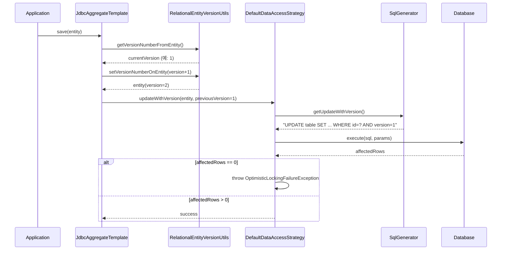

# 낙관적 잠금 (Optimistic Locking)

Spring Data JDBC에서 `@Version`을 활용한 낙관적 잠금 메커니즘과, `@Lock`을 통한 비관적 잠금까지 동시성 제어 전략을 분석한다.

## 목차
- [1. 핵심 개념 (What)](#1-핵심-개념-what)
- [2. 왜 알아야 하는가 (Why)](#2-왜-알아야-하는가-why)
- [3. 내부 구현 분석 (How)](#3-내부-구현-분석-how)
- [4. 실전 예제](#4-실전-예제)
- [5. 정리](#5-정리)

---

## 1. 핵심 개념 (What)

### 낙관적 잠금(Optimistic Locking)이란?

낙관적 잠금은 데이터 충돌이 드물다고 **낙관적으로 가정**하고, 실제 충돌이 발생했을 때에만 이를 감지하는 동시성 제어 기법이다. 데이터베이스 레벨의 락을 걸지 않으므로 처리량(throughput)이 높다.

Spring Data JDBC는 Spring Data Commons의 `@Version` 어노테이션을 사용해 엔티티에 버전 필드를 선언한다. 이 필드는 저장 시 자동으로 증가하며, UPDATE/DELETE 시 WHERE 절에 버전 조건이 추가되어 충돌을 감지한다.

### 비관적 잠금(Pessimistic Locking)이란?

비관적 잠금은 충돌이 자주 발생한다고 **비관적으로 가정**하고, 데이터에 접근할 때 미리 락을 건다. Spring Data JDBC는 `@Lock` 어노테이션으로 `SELECT ... FOR UPDATE` 또는 `SELECT ... FOR SHARE` 구문을 지원한다.

### 관련 핵심 클래스

| 클래스/어노테이션 | 역할 |
|---|---|
| `@Version` | 엔티티의 버전 필드 선언 |
| `RelationalEntityVersionUtils` | 버전 값 get/set 유틸리티 |
| `OptimisticLockingUtils` | 예외 생성 유틸리티 |
| `SqlGenerator` | `UPDATE ... WHERE version = ?` SQL 생성 |
| `DefaultDataAccessStrategy` | 버전 기반 UPDATE/DELETE 실행 |
| `@Lock` | 비관적 잠금 모드 지정 |
| `LockMode` | `PESSIMISTIC_READ`, `PESSIMISTIC_WRITE` 열거형 |
| `LockClause` | Dialect별 LOCK 구문 렌더링 |

---

## 2. 왜 알아야 하는가 (Why)

### 동시성 문제의 현실

멀티 유저 환경에서 동일한 데이터를 동시에 수정하면 **Lost Update** 문제가 발생한다:

```
시점 1: 사용자 A가 주문(version=1) 조회
시점 2: 사용자 B가 주문(version=1) 조회
시점 3: 사용자 A가 주문 수정 → version=2로 저장 (성공)
시점 4: 사용자 B가 주문 수정 → version=1 기준으로 저장 시도 (충돌!)
```

낙관적 잠금 없이는 사용자 B의 변경이 사용자 A의 변경을 **조용히 덮어쓴다.** 이는 데이터 무결성을 심각하게 훼손한다.

### 낙관적 vs 비관적 선택 기준

| 기준 | 낙관적 잠금 | 비관적 잠금 |
|---|---|---|
| 충돌 빈도 | 낮을 때 적합 | 높을 때 적합 |
| 성능 | 락 없이 높은 처리량 | 락 대기로 인한 성능 저하 |
| 트랜잭션 길이 | 긴 트랜잭션 가능 | 짧은 트랜잭션 권장 |
| 실패 처리 | 예외 발생 후 재시도 필요 | 대기 후 자동 진행 |
| 사용 사례 | 일반 CRUD, 웹 폼 편집 | 재고 차감, 결제 처리 |

---

## 3. 내부 구현 분석 (How)

### 3.1 낙관적 잠금 아키텍처



### 3.2 `@Version` 처리 흐름

`@Version` 필드가 선언된 엔티티를 저장할 때, Spring Data JDBC는 다음 순서로 동작한다:

**1단계: 버전 읽기 - `RelationalEntityVersionUtils.getVersionNumberFromEntity()`**

```java
// RelationalEntityVersionUtils.java
public static <S> Number getVersionNumberFromEntity(
        S instance,
        RelationalPersistentEntity<S> persistentEntity,
        RelationalConverter converter) {

    if (!persistentEntity.hasVersionProperty()) {
        throw new IllegalArgumentException(
            "The entity does not have a version property.");
    }

    ConvertingPropertyAccessor<S> convertingPropertyAccessor =
        new ConvertingPropertyAccessor<>(
            persistentEntity.getPropertyAccessor(instance),
            converter.getConversionService());

    return convertingPropertyAccessor.getProperty(
        persistentEntity.getRequiredVersionProperty(), Number.class);
}
```

`PersistentPropertyAccessor`를 통해 `@Version`이 부여된 프로퍼티의 현재 값을 `Number`로 읽어온다.

**2단계: 버전 증가 - `RelationalEntityVersionUtils.setVersionNumberOnEntity()`**

```java
// RelationalEntityVersionUtils.java
public static <S> S setVersionNumberOnEntity(
        S instance,
        @Nullable Number version,
        RelationalPersistentEntity<S> persistentEntity,
        RelationalConverter converter) {

    PersistentPropertyAccessor<S> propertyAccessor =
        converter.getPropertyAccessor(persistentEntity, instance);
    RelationalPersistentProperty versionProperty =
        persistentEntity.getRequiredVersionProperty();
    propertyAccessor.setProperty(versionProperty, version);

    return propertyAccessor.getBean();
}
```

immutable 엔티티(예: Java record)도 올바르게 처리한다. `propertyAccessor.getBean()`이 새 인스턴스를 반환하기 때문이다.

**3단계: SQL 생성 - `SqlGenerator.createUpdateWithVersionSql()`**

```java
// SqlGenerator.java
static final SqlIdentifier VERSION_SQL_PARAMETER =
    SqlIdentifier.unquoted("___oldOptimisticLockingVersion");

private String createUpdateWithVersionSql() {
    Update update = createBaseUpdate()
        .and(getVersionColumn()
            .isEqualTo(getBindMarker(VERSION_SQL_PARAMETER)))
        .build();
    return render(update);
}
```

생성되는 SQL:
```sql
UPDATE order_table
SET name = :name, amount = :amount, version = :version
WHERE id = :id AND version = :___oldOptimisticLockingVersion
```

`WHERE` 절에 `version = :이전버전` 조건이 추가되어, 다른 트랜잭션이 먼저 버전을 변경했다면 `affectedRows`가 0이 된다.

**4단계: 실행 및 충돌 감지 - `DefaultDataAccessStrategy.updateWithVersion()`**

```java
// DefaultDataAccessStrategy.java
public <S> boolean updateWithVersion(S instance, Class<S> domainType,
        Number previousVersion) {

    SqlIdentifierParameterSource parameterSource =
        sqlParametersFactory.forUpdate(instance, domainType);
    parameterSource.addValue(VERSION_SQL_PARAMETER, previousVersion);

    int affectedRows = operations.update(
        sql(domainType).getUpdateWithVersion(), parameterSource);

    if (affectedRows == 0) {
        RelationalPersistentEntity<S> persistentEntity =
            getRequiredPersistentEntity(domainType);
        throw OptimisticLockingUtils.updateFailed(
            instance, previousVersion, persistentEntity);
    }
    return true;
}
```

### 3.3 DELETE 시 버전 검증

삭제 작업에서도 동일한 패턴으로 버전을 검증한다:

```java
// SqlGenerator.java
private String createDeleteByIdAndVersionSql() {
    Delete delete = createBaseDeleteById(getTable())
        .and(getVersionColumn()
            .isEqualTo(getBindMarker(VERSION_SQL_PARAMETER)))
        .build();
    return render(delete);
}
```

생성 SQL:
```sql
DELETE FROM order_table
WHERE id = :id AND version = :___oldOptimisticLockingVersion
```

```java
// DefaultDataAccessStrategy.java
public <T> void deleteWithVersion(Object id, Class<T> domainType,
        Number previousVersion) {

    SqlIdentifierParameterSource parameterSource =
        sqlParametersFactory.forQueryById(id, domainType);
    parameterSource.addValue(VERSION_SQL_PARAMETER, previousVersion);
    int affectedRows = operations.update(
        sql(domainType).getDeleteByIdAndVersion(), parameterSource);

    if (affectedRows == 0) {
        throw OptimisticLockingUtils.deleteFailed(
            id, previousVersion, persistentEntity);
    }
}
```

### 3.4 `OptimisticLockingUtils` 예외 메시지

```java
// OptimisticLockingUtils.java
public static OptimisticLockingFailureException updateFailed(
        Object entity, @Nullable Object version,
        RelationalPersistentEntity<?> persistentEntity) {

    IdentifierAccessor identifierAccessor =
        persistentEntity.getIdentifierAccessor(entity);
    Object id = identifierAccessor.getRequiredIdentifier();

    return new OptimisticLockingFailureException(String.format(
        "Failed to update versioned entity with id '%s' (version '%s') "
        + "in table [%s]; Was the entity updated or deleted concurrently?",
        id, version, persistentEntity.getTableName()));
}
```

예외 메시지에 id, version, 테이블명이 포함되어 디버깅이 용이하다.

### 3.5 비관적 잠금 (`@Lock`)

```java
// Lock.java
@Retention(RetentionPolicy.RUNTIME)
@Target(ElementType.METHOD)
@QueryAnnotation
public @interface Lock {
    LockMode value();
}

// LockMode.java
public enum LockMode {
    PESSIMISTIC_READ,    // SELECT ... FOR SHARE
    PESSIMISTIC_WRITE    // SELECT ... FOR UPDATE
}
```

`LockClause` 인터페이스가 Dialect별로 LOCK 구문을 렌더링한다:

```java
// LockClause.java
public interface LockClause {
    String getLock(LockOptions lockOptions);
    Position getClausePosition();

    enum Position {
        AFTER_FROM_TABLE,  // SQL Server 스타일
        AFTER_ORDER_BY     // MySQL/PostgreSQL 스타일
    }
}
```

---

## 4. 실전 예제

### 예제 1: 기본 낙관적 잠금

```java
import org.springframework.data.annotation.Id;
import org.springframework.data.annotation.Version;
import org.springframework.data.relational.core.mapping.Table;

@Table("orders")
public class Order {

    @Id
    private Long id;

    @Version
    private Long version;

    private String customerName;
    private int totalAmount;

    // 생성자, getter, setter
    public Order(String customerName, int totalAmount) {
        this.customerName = customerName;
        this.totalAmount = totalAmount;
    }
}
```

```java
public interface OrderRepository extends CrudRepository<Order, Long> {
}
```

```java
@Service
@RequiredArgsConstructor
public class OrderService {

    private final OrderRepository orderRepository;

    @Transactional
    public Order updateOrder(Long orderId, String newName, int newAmount) {
        Order order = orderRepository.findById(orderId)
            .orElseThrow(() -> new EntityNotFoundException("Order not found"));

        order.setCustomerName(newName);
        order.setTotalAmount(newAmount);

        // save() 호출 시:
        // 1. version을 현재값+1로 설정
        // 2. UPDATE orders SET ..., version=2 WHERE id=? AND version=1
        // 3. 다른 트랜잭션이 먼저 수정했으면
        //    OptimisticLockingFailureException 발생
        return orderRepository.save(order);
    }
}
```

### 예제 2: 충돌 시 재시도 패턴

```java
@Service
@RequiredArgsConstructor
public class ResilientOrderService {

    private final OrderRepository orderRepository;

    private static final int MAX_RETRIES = 3;

    @Transactional
    public Order updateOrderWithRetry(Long orderId,
            String newName, int newAmount) {

        for (int attempt = 0; attempt < MAX_RETRIES; attempt++) {
            try {
                Order order = orderRepository.findById(orderId)
                    .orElseThrow();

                order.setCustomerName(newName);
                order.setTotalAmount(newAmount);

                return orderRepository.save(order);

            } catch (OptimisticLockingFailureException e) {
                if (attempt == MAX_RETRIES - 1) {
                    throw new ConcurrencyConflictException(
                        "주문 수정 충돌이 반복되었습니다. "
                        + "잠시 후 다시 시도해 주세요.", e);
                }
                // 재시도: 최신 데이터를 다시 읽어서 시도
            }
        }
        throw new IllegalStateException("Unreachable");
    }
}
```

### 예제 3: Immutable 엔티티와 낙관적 잠금

```java
@Table("products")
public record Product(
    @Id Long id,
    @Version Long version,
    String name,
    int price
) {
    // record는 immutable이지만
    // RelationalEntityVersionUtils.setVersionNumberOnEntity()가
    // 새 인스턴스를 생성하여 버전을 갱신한다.
    public Product withPrice(int newPrice) {
        return new Product(id, version, name, newPrice);
    }
}
```

### 예제 4: `@Lock`을 사용한 비관적 잠금

```java
import org.springframework.data.relational.core.sql.LockMode;
import org.springframework.data.relational.repository.Lock;

public interface InventoryRepository extends CrudRepository<Inventory, Long> {

    // SELECT ... FROM inventory WHERE id = ? FOR UPDATE
    @Lock(LockMode.PESSIMISTIC_WRITE)
    Optional<Inventory> findById(Long id);

    // SELECT ... FROM inventory WHERE warehouse = ? FOR SHARE
    @Lock(LockMode.PESSIMISTIC_READ)
    List<Inventory> findByWarehouse(String warehouse);
}
```

```java
@Service
@RequiredArgsConstructor
public class InventoryService {

    private final InventoryRepository inventoryRepository;

    @Transactional
    public void decreaseStock(Long inventoryId, int quantity) {
        // FOR UPDATE 잠금으로 다른 트랜잭션의 동시 수정을 차단
        Inventory inventory = inventoryRepository.findById(inventoryId)
            .orElseThrow();

        if (inventory.getStock() < quantity) {
            throw new InsufficientStockException("재고 부족");
        }

        inventory.setStock(inventory.getStock() - quantity);
        inventoryRepository.save(inventory);
    }
}
```

---

## 5. 정리

| 구분 | 낙관적 잠금 (`@Version`) | 비관적 잠금 (`@Lock`) |
|---|---|---|
| 메커니즘 | `WHERE version = ?` 조건 | `SELECT ... FOR UPDATE/SHARE` |
| 충돌 감지 시점 | UPDATE/DELETE 실행 시 | SELECT 시 락 획득 |
| 실패 시 | `OptimisticLockingFailureException` | 락 대기 또는 타임아웃 |
| 지원 타입 | `Long`, `Integer` 등 Number 계열 | `PESSIMISTIC_READ`, `PESSIMISTIC_WRITE` |
| SQL 생성 | `SqlGenerator.createUpdateWithVersionSql()` | `LockClause.getLock()` (Dialect별) |
| 버전 관리 | `RelationalEntityVersionUtils` | 해당 없음 |
| 예외 생성 | `OptimisticLockingUtils` | DB 레벨 타임아웃/데드락 |
| 적합한 상황 | 읽기 위주, 충돌 드문 경우 | 쓰기 집중, 충돌 빈번한 경우 |

### 핵심 포인트

1. `@Version` 필드는 INSERT 시 0으로 초기화, UPDATE 시 자동 +1 증가
2. 생성되는 SQL: `UPDATE ... SET version = :newVersion WHERE id = :id AND version = :oldVersion`
3. `affectedRows == 0`이면 `OptimisticLockingFailureException` 발생
4. immutable 엔티티(record)도 `PropertyAccessor`를 통해 정상 지원
5. `@Lock`은 Repository 메서드 레벨에서 비관적 잠금 선언 가능
6. Dialect별 `LockClause`로 DB에 맞는 FOR UPDATE/FOR SHARE 구문 생성

---
*참고: Spring Data JDBC 3.x / Spring Boot 3.x 기준*
