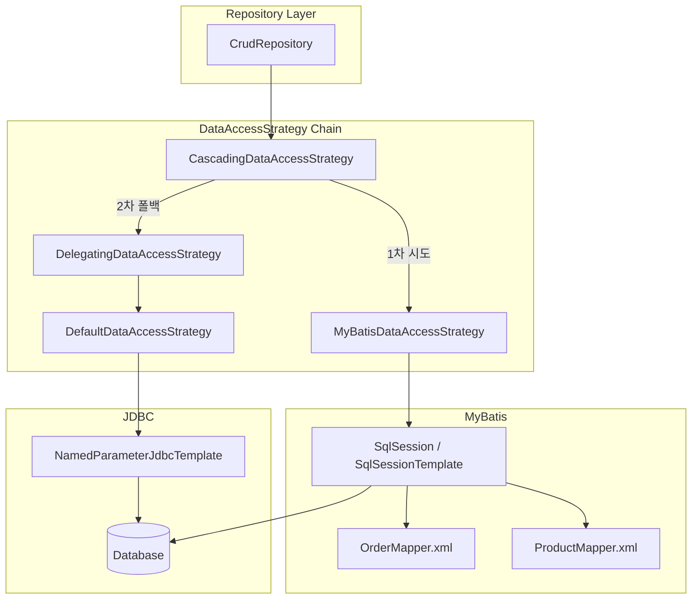

# MyBatis 통합

Spring Data JDBC에서 MyBatis를 데이터 접근 전략으로 통합하는 방법과, `CascadingDataAccessStrategy`를 통한 폴백 메커니즘을 분석한다.

## 목차
- [1. 핵심 개념 (What)](#1-핵심-개념-what)
- [2. 왜 알아야 하는가 (Why)](#2-왜-알아야-하는가-why)
- [3. 내부 구현 분석 (How)](#3-내부-구현-분석-how)
- [4. 실전 예제](#4-실전-예제)
- [5. 정리](#5-정리)

---

## 1. 핵심 개념 (What)

### MyBatis 통합이란?

Spring Data JDBC는 기본적으로 `DefaultDataAccessStrategy`가 SQL을 자동 생성한다. 하지만 복잡한 쿼리가 필요하거나, 기존 MyBatis 매퍼를 활용하고 싶을 때 **MyBatis를 데이터 접근 계층의 구현체로 교체**할 수 있다.

핵심 아이디어는 `DataAccessStrategy` 인터페이스의 각 메서드(`insert`, `update`, `findById` 등)를 MyBatis의 statement ID로 매핑하는 것이다.

### 핵심 클래스

| 클래스 | 역할 |
|---|---|
| `MyBatisDataAccessStrategy` | `DataAccessStrategy`의 MyBatis 구현체 |
| `NamespaceStrategy` | 도메인 타입 → MyBatis 네임스페이스 매핑 |
| `MyBatisContext` | MyBatis statement에 전달되는 파라미터 객체 |
| `CascadingDataAccessStrategy` | 여러 전략을 순서대로 시도하는 폴백 체인 |
| `DelegatingDataAccessStrategy` | 다른 전략에 위임하는 래퍼 |

---

## 2. 왜 알아야 하는가 (Why)

### 자동 생성 SQL의 한계

Spring Data JDBC의 SQL 자동 생성은 대부분의 CRUD 시나리오를 커버하지만, 다음 상황에서는 한계가 있다:

- **복잡한 JOIN 쿼리**: 집계(aggregate) 경계를 넘는 복잡한 조회
- **데이터베이스 특화 기능**: Window Function, CTE, Hint 등 특정 DB 문법
- **성능 최적화**: 특정 쿼리의 실행 계획을 직접 제어해야 할 때
- **기존 MyBatis 자산 활용**: 이미 MyBatis 매퍼가 있는 프로젝트에서 Spring Data JDBC 도입

### 통합의 장점

MyBatis 통합을 사용하면 **Spring Data JDBC의 Repository 추상화와 Aggregate 관리**를 유지하면서, 특정 쿼리만 MyBatis로 커스터마이징할 수 있다. `CascadingDataAccessStrategy`가 MyBatis에 정의되지 않은 쿼리는 자동으로 `DefaultDataAccessStrategy`로 폴백하므로, 모든 쿼리를 MyBatis로 작성할 필요가 없다.

---

## 3. 내부 구현 분석 (How)

### 3.1 전체 아키텍처



### 3.2 `MyBatisDataAccessStrategy` 핵심 동작

이 클래스는 `DataAccessStrategy`의 모든 메서드를 MyBatis statement 호출로 변환한다. Statement ID는 **네임스페이스 + 메서드명**으로 구성된다.

```java
// MyBatisDataAccessStrategy.java
public class MyBatisDataAccessStrategy implements DataAccessStrategy {

    private final SqlSession sqlSession;
    private NamespaceStrategy namespaceStrategy =
        NamespaceStrategy.DEFAULT_INSTANCE;

    // INSERT 예시
    @Override
    public <T> Object insert(T instance, Class<T> domainType,
            Identifier identifier, IdValueSource idValueSource) {

        MyBatisContext myBatisContext =
            new MyBatisContext(identifier, instance, domainType);
        // "com.example.OrderMapper.insert" 형태의 statement 호출
        sqlSession().insert(
            namespace(domainType) + ".insert", myBatisContext);
        return myBatisContext.getId();
    }

    // UPDATE 예시
    @Override
    public <S> boolean update(S instance, Class<S> domainType) {
        return sqlSession().update(
            namespace(domainType) + ".update",
            new MyBatisContext(null, instance, domainType,
                Collections.emptyMap())
        ) != 0;
    }

    // 낙관적 잠금 UPDATE
    @Override
    public <S> boolean updateWithVersion(S instance,
            Class<S> domainType, Number previousVersion) {

        String statement = namespace(domainType) + ".updateWithVersion";
        MyBatisContext parameter = new MyBatisContext(null, instance,
            domainType,
            Collections.singletonMap(
                "___oldOptimisticLockingVersion", previousVersion));
        return sqlSession().update(statement, parameter) != 0;
    }

    private String namespace(Class<?> domainType) {
        return this.namespaceStrategy.getNamespace(domainType);
    }
}
```

**Statement ID 매핑 규칙:**

| Repository 연산 | Statement ID | 비고 |
|---|---|---|
| `save()` (insert) | `{namespace}.insert` | |
| `save()` (update) | `{namespace}.update` | |
| `save()` (versioned) | `{namespace}.updateWithVersion` | 낙관적 잠금 |
| `deleteById()` | `{namespace}.delete` | |
| `deleteById()` (versioned) | `{namespace}.deleteWithVersion` | |
| `findById()` | `{namespace}.findById` | |
| `findAll()` | `{namespace}.findAll` | |
| `findAll(Sort)` | `{namespace}.findAllSorted` | |
| `findAll(Pageable)` | `{namespace}.findAllPaged` | |
| `existsById()` | `{namespace}.existsById` | |
| `count()` | `{namespace}.count` | |

### 3.3 `NamespaceStrategy` - 네임스페이스 결정

```java
// NamespaceStrategy.java
public interface NamespaceStrategy {

    NamespaceStrategy DEFAULT_INSTANCE = new NamespaceStrategy() {};

    default String getNamespace(Class<?> domainType) {
        return domainType.getName() + "Mapper";
    }
}
```

기본 전략은 **엔티티의 FQCN + "Mapper"** 접미사를 사용한다. 예를 들어 `com.example.Order` 엔티티의 네임스페이스는 `com.example.OrderMapper`가 된다.

커스텀 네임스페이스 전략 예시:
```java
NamespaceStrategy custom = domainType ->
    "mapper." + domainType.getSimpleName() + "Mapper";
// com.example.Order → "mapper.OrderMapper"
```

### 3.4 `MyBatisContext` - 파라미터 전달

```java
// MyBatisContext.java
public class MyBatisContext {

    private final @Nullable Object id;
    private final @Nullable Object instance;
    private final @Nullable Identifier identifier;
    private final @Nullable Class domainType;
    private final Map<String, Object> additionalValues;

    // getId(): 엔티티의 ID 값
    // getInstance(): 엔티티 인스턴스
    // getDomainType(): 엔티티 클래스
    // get(key): 추가 값 (예: 부모 엔티티 ID, 페이지 정보 등)
}
```

MyBatis 매퍼에서 `MyBatisContext`의 프로퍼티에 접근하는 방법:
- `#{instance.name}` - 엔티티의 name 필드
- `#{id}` - 전달된 ID 값
- `#{domainType}` - 엔티티 클래스

### 3.5 `CascadingDataAccessStrategy` - 폴백 체인

```java
// MyBatisDataAccessStrategy.createCombinedAccessStrategy()
public static DataAccessStrategy createCombinedAccessStrategy(
        RelationalMappingContext context,
        JdbcConverter converter,
        NamedParameterJdbcOperations operations,
        SqlSession sqlSession,
        NamespaceStrategy namespaceStrategy,
        Dialect dialect,
        QueryMappingConfiguration queryMappingConfiguration) {

    DataAccessStrategy defaultDataAccessStrategy =
        new DataAccessStrategyFactory(
            converter, operations, dialect,
            queryMappingConfiguration).create();

    MyBatisDataAccessStrategy myBatisDataAccessStrategy =
        new MyBatisDataAccessStrategy(operations, dialect, sqlSession);
    myBatisDataAccessStrategy.setNamespaceStrategy(namespaceStrategy);

    // MyBatis 먼저 시도 → 실패 시 Default로 폴백
    return new CascadingDataAccessStrategy(
        asList(myBatisDataAccessStrategy,
               new DelegatingDataAccessStrategy(
                   defaultDataAccessStrategy)));
}
```

`CascadingDataAccessStrategy`는 등록된 전략을 **순서대로** 실행한다. 첫 번째 전략(MyBatis)에서 예외가 발생하면 두 번째 전략(Default)으로 자동 폴백한다. 따라서 MyBatis 매퍼에 정의된 쿼리만 MyBatis가 처리하고, 나머지는 기본 SQL 생성기가 담당한다.

```
findById("Order") 호출
  ├─ MyBatisDataAccessStrategy: "OrderMapper.findById" 존재? → 실행
  └─ 없으면 → DefaultDataAccessStrategy: 자동 생성 SQL 실행
```

---

## 4. 실전 예제

### 예제 1: 기본 MyBatis 통합 설정

**엔티티 정의:**
```java
@Table("orders")
public class Order {
    @Id
    private Long id;
    private String customerName;
    private int totalAmount;
    private LocalDateTime createdAt;

    // 생성자, getter, setter
}
```

**MyBatis XML 매퍼:**
```xml
<?xml version="1.0" encoding="UTF-8" ?>
<!DOCTYPE mapper
    PUBLIC "-//mybatis.org//DTD Mapper 3.0//EN"
    "http://mybatis.org/dtd/mybatis-3-mapper.dtd">

<mapper namespace="com.example.domain.OrderMapper">

    <!-- findById: MyBatisContext에서 id를 사용 -->
    <select id="findById" resultType="com.example.domain.Order">
        SELECT id, customer_name, total_amount, created_at
        FROM orders
        WHERE id = #{id}
    </select>

    <!-- insert: MyBatisContext에서 instance를 사용 -->
    <insert id="insert" useGeneratedKeys="true" keyProperty="instance.id">
        INSERT INTO orders (customer_name, total_amount, created_at)
        VALUES (
            #{instance.customerName},
            #{instance.totalAmount},
            #{instance.createdAt}
        )
    </insert>

    <!-- update: 전체 업데이트 -->
    <update id="update">
        UPDATE orders
        SET customer_name = #{instance.customerName},
            total_amount = #{instance.totalAmount}
        WHERE id = #{instance.id}
    </update>

    <!-- delete: ID로 삭제 -->
    <delete id="delete">
        DELETE FROM orders WHERE id = #{id}
    </delete>

    <!-- count -->
    <select id="count" resultType="long">
        SELECT COUNT(*) FROM orders
    </select>

    <!-- findAll -->
    <select id="findAll" resultType="com.example.domain.Order">
        SELECT id, customer_name, total_amount, created_at
        FROM orders
        ORDER BY created_at DESC
    </select>

</mapper>
```

**Spring Boot 설정:**
```java
@Configuration
public class MyBatisJdbcConfig extends AbstractJdbcConfiguration {

    @Bean
    public DataAccessStrategy dataAccessStrategy(
            NamedParameterJdbcOperations operations,
            JdbcConverter converter,
            RelationalMappingContext context,
            SqlSession sqlSession,
            Dialect dialect) {

        return MyBatisDataAccessStrategy.createCombinedAccessStrategy(
            context, converter, operations, sqlSession, dialect,
            QueryMappingConfiguration.EMPTY);
    }
}
```

**application.yml:**
```yaml
mybatis:
  mapper-locations: classpath:mapper/**/*.xml
  configuration:
    map-underscore-to-camel-case: true
```

### 예제 2: 커스텀 NamespaceStrategy

```java
@Bean
public DataAccessStrategy dataAccessStrategy(
        NamedParameterJdbcOperations operations,
        JdbcConverter converter,
        RelationalMappingContext context,
        SqlSession sqlSession,
        Dialect dialect) {

    // 네임스페이스를 "mapper.OrderMapper" 형태로 변경
    NamespaceStrategy namespaceStrategy = domainType ->
        "mapper." + domainType.getSimpleName() + "Mapper";

    return MyBatisDataAccessStrategy.createCombinedAccessStrategy(
        context, converter, operations, sqlSession,
        namespaceStrategy, dialect,
        QueryMappingConfiguration.EMPTY);
}
```

이 경우 XML 매퍼의 namespace가 `mapper.OrderMapper`가 되어야 한다:
```xml
<mapper namespace="mapper.OrderMapper">
```

### 예제 3: 낙관적 잠금과 MyBatis

`@Version`이 있는 엔티티의 경우 `updateWithVersion` statement가 필요하다:

```xml
<mapper namespace="com.example.domain.OrderMapper">

    <update id="updateWithVersion">
        UPDATE orders
        SET customer_name = #{instance.customerName},
            total_amount = #{instance.totalAmount},
            version = #{instance.version}
        WHERE id = #{instance.id}
          AND version = #{___oldOptimisticLockingVersion}
    </update>

    <delete id="deleteWithVersion">
        DELETE FROM orders
        WHERE id = #{id}
          AND version = #{___oldOptimisticLockingVersion}
    </delete>

</mapper>
```

`additionalValues`에 `___oldOptimisticLockingVersion`라는 키로 이전 버전 값이 전달된다. `MyBatisContext.get(key)` 메서드로 접근할 수 있다.

### 예제 4: 부분 MyBatis (폴백 활용)

MyBatis 매퍼에 `findById`만 정의하고 나머지는 자동 생성에 맡기는 전략:

```xml
<mapper namespace="com.example.domain.OrderMapper">

    <!-- 복잡한 조회만 MyBatis로 직접 작성 -->
    <select id="findById" resultType="com.example.domain.Order">
        SELECT o.id, o.customer_name, o.total_amount,
               o.created_at, o.status,
               COALESCE(SUM(oi.quantity * oi.price), 0) as calculated_total
        FROM orders o
        LEFT JOIN order_items oi ON o.id = oi.order_id
        WHERE o.id = #{id}
        GROUP BY o.id
    </select>

    <!-- insert, update, delete 등은 미정의
         → CascadingDataAccessStrategy가
           DefaultDataAccessStrategy로 폴백 -->

</mapper>
```

---

## 5. 정리

| 항목 | 설명 |
|---|---|
| 핵심 클래스 | `MyBatisDataAccessStrategy` - MyBatis 기반 DataAccessStrategy 구현 |
| 네임스페이스 규칙 | 기본: `{엔티티 FQCN}Mapper` (예: `com.example.OrderMapper`) |
| Statement ID | `{namespace}.{operation}` (예: `OrderMapper.findById`) |
| 파라미터 객체 | `MyBatisContext` - `id`, `instance`, `domainType`, `additionalValues` 제공 |
| 폴백 메커니즘 | `CascadingDataAccessStrategy`: MyBatis 실패 시 Default로 자동 폴백 |
| 낙관적 잠금 연동 | `updateWithVersion`/`deleteWithVersion` statement + `___oldOptimisticLockingVersion` 파라미터 |
| 통합 생성 메서드 | `MyBatisDataAccessStrategy.createCombinedAccessStrategy()` |
| 최소 설정 원칙 | 필요한 쿼리만 MyBatis 매퍼에 정의, 나머지는 자동 생성 SQL 사용 |

### 주의사항

1. `MyBatisDataAccessStrategy`는 `findOne(Query)`, `findAll(Query)`, `exists(Query)`, `count(Query)` 등 Query 기반 메서드를 지원하지 않는다 (`UnsupportedOperationException`).
2. 폴백 체인에서 MyBatis가 우선순위를 갖기 때문에, 의도치 않은 statement가 있으면 기본 전략을 가리게 된다.
3. `SqlSessionTemplate`을 사용해야 트랜잭션이 Spring의 트랜잭션 관리와 올바르게 통합된다.

---
*참고: Spring Data JDBC 3.x / Spring Boot 3.x 기준*
