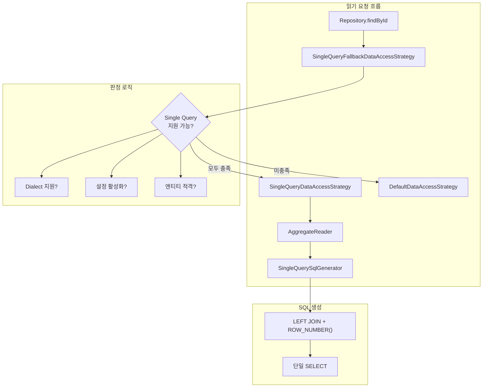

# Single Query Loading과 성능 최적화

Spring Data JDBC 3.2에서 도입된 Single Query Loading의 내부 구현과, BatchInsertStrategy, CachingNamingStrategy를 활용한 성능 최적화 전략을 분석한다.

## 목차
- [1. 핵심 개념 (What)](#1-핵심-개념-what)
- [2. 왜 알아야 하는가 (Why)](#2-왜-알아야-하는가-why)
- [3. 내부 구현 분석 (How)](#3-내부-구현-분석-how)
- [4. 실전 예제](#4-실전-예제)
- [5. 정리](#5-정리)

---

## 1. 핵심 개념 (What)

### Single Query Loading이란?

Spring Data JDBC의 기본 동작은 Aggregate Root를 로드할 때 **루트 엔티티와 각 하위 엔티티를 별도의 쿼리**로 조회한다. 이로 인해 N+1 문제가 발생한다.

**Single Query Loading**(v3.2+)은 **하나의 SQL JOIN 쿼리**로 Aggregate 전체를 한 번에 로드하는 전략이다. `SingleQueryDataAccessStrategy`와 `SingleQuerySqlGenerator`가 핵심 구현체이며, LEFT JOIN과 ROW_NUMBER()를 사용하여 복잡한 Aggregate 구조를 단일 쿼리로 조회한다.

### 관련 핵심 클래스

| 클래스 | 역할 | 도입 버전 |
|---|---|---|
| `SingleQueryDataAccessStrategy` | Single Query 기반 읽기 전략 | 3.2 |
| `SingleQueryFallbackDataAccessStrategy` | Single Query + Default 폴백 조합 | 3.2 |
| `SingleQuerySqlGenerator` | JOIN 기반 SQL 생성기 | 3.2 |
| `AggregateReader` | Single Query 결과를 Aggregate로 조립 | 3.2 |
| `BatchInsertStrategy` | 배치 INSERT 전략 인터페이스 | 2.4 |
| `IdGeneratingBatchInsertStrategy` | ID 생성 지원 배치 INSERT | 2.4 |
| `CachingNamingStrategy` | NamingStrategy 결과 캐싱 | 1.1 |

---

## 2. 왜 알아야 하는가 (Why)

### N+1 문제의 실체

기본 로딩 방식으로 `Order` (1개) → `OrderItem` (N개) 구조를 로드하면:

```
쿼리 1: SELECT * FROM orders WHERE id = 1          -- Root
쿼리 2: SELECT * FROM order_items WHERE order_id = 1 -- Children
```

이것이 단순히 1+1처럼 보이지만, Aggregate가 중첩되면 문제가 커진다:

```
Order (10건) → OrderItem (50건) → ItemOption (200건)

쿼리 1: SELECT * FROM orders                          -- 1회
쿼리 2: SELECT * FROM order_items WHERE order_id = ?   -- 10회
쿼리 3: SELECT * FROM item_options WHERE item_id = ?   -- 50회
총 61회 쿼리 실행!
```

Single Query Loading을 사용하면 **1회의 JOIN 쿼리**로 해결할 수 있다.

### 성능 최적화의 3가지 축

| 축 | 문제 | 해결책 |
|---|---|---|
| 읽기 성능 | N+1 쿼리 문제 | `SingleQueryDataAccessStrategy` |
| 쓰기 성능 | 단건 INSERT 반복 | `IdGeneratingBatchInsertStrategy` |
| 메타데이터 성능 | NamingStrategy 반복 호출 | `CachingNamingStrategy` |

---

## 3. 내부 구현 분석 (How)

### 3.1 Single Query Loading 아키텍처



### 3.2 `SingleQueryFallbackDataAccessStrategy` - 판정과 폴백

이 클래스가 Single Query Loading의 진입점이다. 조건을 검사하고, 지원 가능하면 `SingleQueryDataAccessStrategy`를, 아니면 기본 전략으로 폴백한다.

```java
// SingleQueryFallbackDataAccessStrategy.java
class SingleQueryFallbackDataAccessStrategy
        extends DelegatingDataAccessStrategy {

    private final SqlGeneratorSource sqlGeneratorSource;
    private final SingleQueryDataAccessStrategy singleSelectDelegate;
    private final JdbcConverter converter;

    @Override
    public <T> T findById(Object id, Class<T> domainType) {
        if (isSingleSelectQuerySupported(domainType)) {
            return singleSelectDelegate.findById(id, domainType);
        }
        return super.findById(id, domainType);  // 폴백
    }

    @Override
    public <T> Optional<T> findOne(Query query, Class<T> domainType) {
        if (isSingleSelectQuerySupported(domainType)
                && isSingleSelectQuerySupported(query)) {
            return singleSelectDelegate.findOne(query, domainType);
        }
        return super.findOne(query, domainType);
    }
}
```

**지원 가능 판정 로직:**

```java
// SingleQueryFallbackDataAccessStrategy.java
private boolean isSingleSelectQuerySupported(Class<?> entityType) {
    return converter.getMappingContext()
            .isSingleQueryLoadingEnabled()      // 1. 설정 활성화
        && sqlGeneratorSource.getDialect()
            .supportsSingleQueryLoading()        // 2. Dialect 지원
        && entityQualifiesForSingleQueryLoading(
            entityType);                         // 3. 엔티티 적격
}

private boolean entityQualifiesForSingleQueryLoading(
        Class<?> entityType) {

    for (PersistentPropertyPath<RelationalPersistentProperty> path :
            converter.getMappingContext()
                .findPersistentPropertyPaths(entityType, __ -> true)) {

        RelationalPersistentProperty property = path.getLeafProperty();
        if (property.isEntity()) {
            // 단일 참조(1:1)는 미지원
            if (!(property.isMap() || property.isCollectionLike())) {
                return false;
            }
            // 임베디드 엔티티 미지원
            if (property.isEmbedded()) {
                return false;
            }
            // 중첩 참조(depth > 1) 미지원
            if (path.getLength() > 1) {
                return false;
            }
        }
    }
    return true;
}

// Query 레벨 제약
private static boolean isSingleSelectQuerySupported(Query query) {
    return !query.isSorted() && !query.isLimited();
}
```

**Single Query Loading이 지원되지 않는 경우:**
- 단일 참조(1:1 관계, Collection/Map이 아닌 엔티티 프로퍼티)
- 임베디드 엔티티
- 2단계 이상 중첩된 엔티티 관계
- Sort 또는 Limit가 포함된 Query
- Dialect가 `supportsSingleQueryLoading()`을 지원하지 않는 경우

### 3.3 `SingleQueryDataAccessStrategy` - 핵심 읽기 전략

```java
// SingleQueryDataAccessStrategy.java
class SingleQueryDataAccessStrategy implements ReadingDataAccessStrategy {

    private final RelationalMappingContext mappingContext;
    private final AggregateReader aggregateReader;

    public SingleQueryDataAccessStrategy(Dialect dialect,
            JdbcConverter converter,
            NamedParameterJdbcOperations jdbcTemplate) {

        this.mappingContext = converter.getMappingContext();
        this.aggregateReader = new AggregateReader(
            dialect, converter, jdbcTemplate);
    }

    @Override
    public <T> T findById(Object id, Class<T> domainType) {
        return aggregateReader.findById(
            id, getPersistentEntity(domainType));
    }

    @Override
    public <T> List<T> findAll(Class<T> domainType) {
        return aggregateReader.findAll(
            getPersistentEntity(domainType));
    }

    @Override
    public <T> List<T> findAllById(Iterable<?> ids,
            Class<T> domainType) {
        return aggregateReader.findAllById(
            ids, getPersistentEntity(domainType));
    }

    @Override
    public <T> Optional<T> findOne(Query query, Class<T> domainType) {
        return Optional.ofNullable(
            aggregateReader.findOne(
                query, getPersistentEntity(domainType)));
    }
}
```

`AggregateReader`가 `SingleQuerySqlGenerator`로 SQL을 생성하고, 결과 ResultSet을 Aggregate 객체 트리로 조립한다.

### 3.4 `SingleQuerySqlGenerator` - JOIN SQL 생성

```java
// SingleQuerySqlGenerator.java
public class SingleQuerySqlGenerator implements SqlGenerator {

    private final RelationalMappingContext context;
    private final Dialect dialect;
    private final AliasFactory aliases;

    @Override
    public String findAll(RelationalPersistentEntity<?> aggregate,
            @Nullable Condition condition) {
        return createSelect(aggregate, condition);
    }

    String createSelect(RelationalPersistentEntity<?> aggregate,
            @Nullable Condition condition) {

        AggregatePath rootPath =
            context.getAggregatePath(aggregate);
        QueryMeta queryMeta =
            createInlineQuery(rootPath, condition);
        // ...
        // LEFT JOIN으로 하위 엔티티 조인
        // ROW_NUMBER()로 중복 행 구분
    }
}
```

생성되는 SQL 구조:
```sql
SELECT
    root.id, root.name, root.version,
    items.id AS items_id, items.name AS items_name,
    items.quantity AS items_quantity,
    GREATEST(root_rn, items_rn) AS rn
FROM (
    SELECT *, ROW_NUMBER() OVER () AS root_rn
    FROM orders
    WHERE id = :id
) root
LEFT JOIN (
    SELECT *, ROW_NUMBER() OVER (PARTITION BY order_id) AS items_rn
    FROM order_items
) items ON root.id = items.order_id
ORDER BY rn
```

`ROW_NUMBER()`와 `GREATEST()`를 사용하여 1:N 관계에서 중복되는 루트 행을 올바르게 구분한다.

### 3.5 `IdGeneratingBatchInsertStrategy` - 배치 INSERT

대량의 엔티티를 저장할 때 단건 INSERT를 반복하면 성능이 급격히 저하된다. `IdGeneratingBatchInsertStrategy`는 JDBC의 `batchUpdate`를 활용하여 배치 INSERT를 수행한다.

```java
// IdGeneratingBatchInsertStrategy.java
class IdGeneratingBatchInsertStrategy implements BatchInsertStrategy {

    private final InsertStrategy insertStrategy;
    private final Dialect dialect;
    private final NamedParameterJdbcOperations jdbcOperations;
    private final @Nullable SqlIdentifier idColumn;

    @Override
    public Object[] execute(String sql,
            SqlParameterSource[] sqlParameterSources) {

        // Dialect가 배치에서 ID 생성을 지원하지 않으면 순차 실행
        if (!dialect.getIdGeneration()
                .supportedForBatchOperations()) {

            return Arrays.stream(sqlParameterSources)
                .map(src -> insertStrategy.execute(sql, src))
                .toArray();
        }

        // 배치 INSERT 실행
        GeneratedKeyHolder holder = new GeneratedKeyHolder();
        IdGeneration idGeneration = dialect.getIdGeneration();

        if (idGeneration.driverRequiresKeyColumnNames()) {
            String[] keyColumnNames = getKeyColumnNames(idGeneration);
            if (keyColumnNames.length == 0) {
                jdbcOperations.batchUpdate(
                    sql, sqlParameterSources, holder);
            } else {
                jdbcOperations.batchUpdate(
                    sql, sqlParameterSources, holder,
                    keyColumnNames);
            }
        } else {
            jdbcOperations.batchUpdate(
                sql, sqlParameterSources, holder);
        }

        // 생성된 키 추출
        Object[] ids = new Object[sqlParameterSources.length];
        List<Map<String, Object>> keyList = holder.getKeyList();
        for (int i = 0; i < keyList.size(); i++) {
            Map<String, Object> keys = keyList.get(i);
            if (keys.size() > 1) {
                if (idColumn != null) {
                    ids[i] = keys.get(idColumn.getReference());
                }
            } else {
                ids[i] = keys.entrySet().stream().findFirst()
                    .map(Map.Entry::getValue)
                    .orElseThrow();
            }
        }
        return ids;
    }
}
```

**핵심 포인트:**
- Dialect가 배치 ID 생성을 지원하지 않으면 자동으로 순차 실행으로 폴백
- `GeneratedKeyHolder`로 자동 생성된 ID를 배치 단위로 수집
- 복합 키인 경우 `idColumn`으로 올바른 키 컬럼을 식별

### 3.6 `CachingNamingStrategy` - 네이밍 캐시

```java
// CachingNamingStrategy.java
class CachingNamingStrategy implements NamingStrategy {

    private final NamingStrategy delegate;

    private final Map<RelationalPersistentProperty, String>
        columnNames = new ConcurrentHashMap<>();
    private final Map<RelationalPersistentProperty, String>
        keyColumns = new ConcurrentHashMap<>();
    private final Map<Class<?>, String>
        tableNames = new ConcurrentReferenceHashMap<>();

    private final Lazy<String> schema;

    CachingNamingStrategy(NamingStrategy delegate) {
        this.delegate = delegate;
        this.schema = Lazy.of(delegate::getSchema);
    }

    @Override
    public String getColumnName(
            RelationalPersistentProperty property) {
        return columnNames.computeIfAbsent(
            property, delegate::getColumnName);
    }

    @Override
    public String getTableName(Class<?> type) {
        return tableNames.computeIfAbsent(
            type, delegate::getTableName);
    }

    @Override
    public String getKeyColumn(
            RelationalPersistentProperty property) {
        return keyColumns.computeIfAbsent(
            property, delegate::getKeyColumn);
    }
}
```

**캐시 전략:**
- `columnNames`, `keyColumns`: `ConcurrentHashMap` - 강한 참조, 프로퍼티 수만큼 유지
- `tableNames`: `ConcurrentReferenceHashMap` - 약한 참조, 클래스 언로드 시 자동 정리
- `schema`: `Lazy` - 최초 1회만 계산

NamingStrategy의 메서드는 SQL 생성 시마다 반복 호출되므로, 캐싱 없이는 매 쿼리 실행마다 불필요한 문자열 변환이 발생한다. `CachingNamingStrategy`는 이를 `ConcurrentHashMap`으로 캐싱하여 성능을 개선한다.

---

## 4. 실전 예제

### 예제 1: Single Query Loading 활성화

```java
@Configuration
public class JdbcConfig extends AbstractJdbcConfiguration {

    @Override
    @Bean
    public RelationalMappingContext jdbcMappingContext(
            Optional<NamingStrategy> namingStrategy,
            CustomConversions conversions) {

        JdbcMappingContext mappingContext = new JdbcMappingContext(
            namingStrategy.orElse(NamingStrategy.INSTANCE));
        mappingContext.setSimpleTypeHolder(
            conversions.getSimpleTypeHolder());

        // Single Query Loading 활성화
        mappingContext.setSingleQueryLoadingEnabled(true);

        return mappingContext;
    }
}
```

혹은 Spring Boot에서 프로퍼티로 설정:
```yaml
spring:
  data:
    jdbc:
      dialect: postgresql  # Single Query를 지원하는 Dialect
```

### 예제 2: N+1 해결 비교

**엔티티 구조:**
```java
@Table("orders")
public class Order {
    @Id private Long id;
    private String customerName;

    @MappedCollection(idColumn = "ORDER_ID")
    private List<OrderItem> items = new ArrayList<>();
}

@Table("order_items")
public class OrderItem {
    @Id private Long id;
    private String productName;
    private int quantity;
    private int price;
}
```

**기본 로딩 (N+1):**
```sql
-- findAll() 호출 시
SELECT * FROM orders;                        -- 1회
SELECT * FROM order_items WHERE order_id = 1; -- N회 반복
SELECT * FROM order_items WHERE order_id = 2;
SELECT * FROM order_items WHERE order_id = 3;
-- ... 주문 건수만큼 반복
```

**Single Query Loading:**
```sql
-- findAll() 호출 시 - 단 1회!
SELECT
    root.id, root.customer_name,
    items.id AS items_id, items.product_name,
    items.quantity, items.price,
    GREATEST(root_rn, items_rn) AS rn
FROM (
    SELECT *, ROW_NUMBER() OVER () AS root_rn
    FROM orders
) root
LEFT JOIN (
    SELECT *, ROW_NUMBER() OVER (PARTITION BY order_id) AS items_rn
    FROM order_items
) items ON root.id = items.order_id
ORDER BY rn
```

### 예제 3: 배치 INSERT 활용

```java
@Service
@RequiredArgsConstructor
public class BulkOrderService {

    private final JdbcAggregateTemplate template;

    @Transactional
    public List<Order> createBulkOrders(List<OrderRequest> requests) {
        List<Order> orders = requests.stream()
            .map(req -> {
                Order order = new Order(req.getCustomerName());
                req.getItems().forEach(item ->
                    order.addItem(new OrderItem(
                        item.getProductName(),
                        item.getQuantity(),
                        item.getPrice()
                    ))
                );
                return order;
            })
            .toList();

        // saveAll() 내부에서 IdGeneratingBatchInsertStrategy가
        // 배치 INSERT를 수행
        return template.insertAll(orders);
    }
}
```

배치 INSERT 시 내부적으로 실행되는 SQL:
```sql
-- 1회의 배치 INSERT (JDBC batchUpdate)
INSERT INTO orders (customer_name) VALUES (?), (?), (?), ...
-- GeneratedKeyHolder로 생성된 ID 일괄 수집
```

### 예제 4: 커스텀 NamingStrategy와 캐싱

```java
@Configuration
public class NamingConfig {

    @Bean
    public NamingStrategy namingStrategy() {
        // 커스텀 네이밍 전략
        // CachingNamingStrategy로 자동 래핑됨 (프레임워크 내부)
        return new NamingStrategy() {
            @Override
            public String getTableName(Class<?> type) {
                // 클래스명을 snake_case로 변환 후 "tbl_" 접두사
                return "tbl_" + toSnakeCase(type.getSimpleName());
            }

            @Override
            public String getColumnName(
                    RelationalPersistentProperty property) {
                return toSnakeCase(property.getName());
            }

            private String toSnakeCase(String name) {
                return name.replaceAll("([a-z])([A-Z])",
                    "$1_$2").toLowerCase();
            }
        };
    }
}
```

`CachingNamingStrategy`가 내부적으로 적용되어 `toSnakeCase()` 변환 결과가 캐싱된다. 동일 프로퍼티에 대한 이름 변환은 최초 1회만 실행된다.

---

## 5. 정리

| 항목 | 설명 |
|---|---|
| Single Query Loading | JOIN + ROW_NUMBER()로 Aggregate를 단일 쿼리 로드 (v3.2+) |
| 활성화 방법 | `mappingContext.setSingleQueryLoadingEnabled(true)` |
| 지원 조건 | Collection/Map 관계, 1단계 중첩, Embedded 미포함, Sort/Limit 미포함 |
| 미지원 시 동작 | `SingleQueryFallbackDataAccessStrategy`가 Default로 자동 폴백 |
| 생성 SQL 패턴 | `SELECT ... FROM (subquery) root LEFT JOIN (subquery) child ON ...` |
| 배치 INSERT | `IdGeneratingBatchInsertStrategy` - `batchUpdate()` + `GeneratedKeyHolder` |
| 배치 폴백 | Dialect 미지원 시 순차 INSERT로 자동 폴백 |
| NamingStrategy 캐싱 | `CachingNamingStrategy` - `ConcurrentHashMap` 기반 결과 캐싱 |
| 성능 향상 핵심 | 읽기: N+1 → 1회 / 쓰기: N회 → 1회 배치 / 메타데이터: 캐싱 |

### Single Query Loading 제약 요약

| 제약 | 이유 |
|---|---|
| 단일 참조(1:1) 미지원 | JOIN 결과 중복 처리 로직이 Collection 기반 |
| 임베디드 엔티티 미지원 | 별도 테이블이 아닌 인라인 매핑 |
| 2단계+ 중첩 미지원 | 다중 JOIN의 ROW_NUMBER 조합 복잡도 |
| Sort/Limit 미지원 | 서브쿼리 내부 정렬/제한이 JOIN 결과에 영향 |

---
*참고: Spring Data JDBC 3.x / Spring Boot 3.x 기준*
