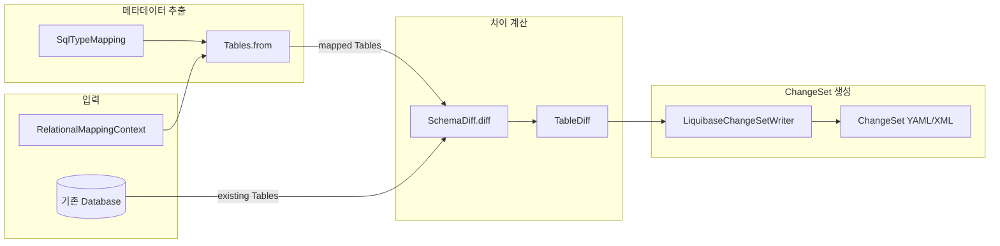

# 스키마 생성과 Liquibase 통합

Spring Data JDBC의 스키마 메타데이터 모델(Tables, Column, ForeignKey)과, SchemaDiff 기반 변경 감지, LiquibaseChangeSetWriter를 통한 마이그레이션 자동화 워크플로우를 분석한다.

## 목차
- [1. 핵심 개념 (What)](#1-핵심-개념-what)
- [2. 왜 알아야 하는가 (Why)](#2-왜-알아야-하는가-why)
- [3. 내부 구현 분석 (How)](#3-내부-구현-분석-how)
- [4. 실전 예제](#4-실전-예제)
- [5. 정리](#5-정리)

---

## 1. 핵심 개념 (What)

### 스키마 생성이란?

Spring Data JDBC 3.2부터 엔티티 매핑 정보(`RelationalMappingContext`)를 기반으로 **데이터베이스 스키마 메타데이터를 추출**하고, 이를 Liquibase ChangeSet으로 변환하는 기능을 제공한다. 이는 JPA의 `hibernate.ddl-auto`와 유사하지만, **Liquibase ChangeSet 파일을 생성**하여 버전 관리가 가능하다는 점에서 차별화된다.

### 핵심 구성 요소

| 클래스 | 역할 | 도입 버전 |
|---|---|---|
| `Tables` | 엔티티 → 테이블 메타데이터 변환 | 3.2 |
| `Table` | 개별 테이블 모델 (스키마, 이름, 컬럼, FK) | 3.2 |
| `Column` | 컬럼 모델 (이름, 타입, nullable, identity) | 3.2 |
| `ForeignKey` | 외래키 모델 | 3.3 |
| `SchemaDiff` | 기존 스키마와 매핑 엔티티의 차이 계산 | 3.2 |
| `TableDiff` | 테이블 단위 변경 사항 (컬럼/FK 추가/삭제) | 3.2 |
| `LiquibaseChangeSetWriter` | SchemaDiff → Liquibase ChangeSet 변환 | 3.2 |
| `DefaultSqlTypeMapping` | Java 타입 → SQL 타입 매핑 | 3.2 |
| `SqlTypeMapping` | 타입 매핑 전략 인터페이스 | 3.2 |

---

## 2. 왜 알아야 하는가 (Why)

### 수동 마이그레이션의 문제점

엔티티 클래스를 변경할 때마다 수동으로 SQL 마이그레이션 스크립트를 작성하면:
- 엔티티와 스키마 간 **불일치**가 발생하기 쉬움
- 필드 추가/삭제 시 **마이그레이션 누락** 위험
- 팀 내 **일관성 없는 마이그레이션 스크립트** 작성

### 자동 스키마 생성의 이점

```
엔티티 변경 → Tables.from() → SchemaDiff.diff() → LiquibaseChangeSetWriter
         ↓                ↓                  ↓
   메타데이터 추출     차이 계산         ChangeSet 파일 생성
```

- 엔티티 클래스가 **Single Source of Truth**
- 차이 기반 마이그레이션으로 **누락 없는 변경 감지**
- Liquibase ChangeSet으로 **버전 관리 및 롤백 가능**
- 개발 초기 프로토타이핑 및 CI/CD 파이프라인에서 스키마 검증에 활용

---

## 3. 내부 구현 분석 (How)

### 3.1 전체 아키텍처



### 3.2 `Tables` - 엔티티 → 테이블 메타데이터 변환

`Tables.from()`은 `RelationalMappingContext`에서 엔티티 정보를 읽어 `Table`, `Column`, `ForeignKey` 모델로 변환한다.

```java
// Tables.java
record Tables(List<Table> tables) {

    public static Tables from(RelationalMappingContext context) {
        return from(
            context.getPersistentEntities().stream(),
            new DefaultSqlTypeMapping(),
            null,
            context);
    }

    public static Tables from(
            Stream<? extends RelationalPersistentEntity<?>> entities,
            SqlTypeMapping sqlTypeMapping,
            @Nullable String defaultSchema,
            MappingContext<...> context) {

        List<ForeignKeyMetadata> foreignKeyMetadataList =
            new ArrayList<>();

        List<Table> tables = entities
            .filter(it -> it.isAnnotationPresent(
                org.springframework.data.relational.core.mapping
                    .Table.class))
            .map(entity -> {
                Table table = new Table(
                    defaultSchema,
                    entity.getTableName().getReference());

                Set<RelationalPersistentProperty> identifierColumns
                    = new LinkedHashSet<>();
                entity.getPersistentProperties(Id.class)
                    .forEach(identifierColumns::add);

                for (RelationalPersistentProperty property : entity) {

                    // 관계(1:N) 프로퍼티는 FK로 처리
                    if (RelationalPredicates.isRelation(property)) {
                        foreignKeyMetadataList.add(
                            createForeignKeyMetadata(
                                entity, property, context,
                                sqlTypeMapping));
                        continue;
                    }

                    String columnType =
                        sqlTypeMapping.getColumnType(property);
                    Column column = new Column(
                        property.getColumnName().getReference(),
                        columnType,
                        sqlTypeMapping.isNullable(property),
                        identifierColumns.contains(property));
                    table.columns().add(column);
                }
                return table;
            })
            .collect(Collectors.toList());

        // FK 메타데이터를 테이블에 적용
        applyForeignKeyMetadata(tables, foreignKeyMetadataList);
        return new Tables(tables);
    }
}
```

**중요 처리 사항:**
- `@Table` 어노테이션이 있는 엔티티만 처리
- `@Id` 프로퍼티는 `identity=true`로 설정
- 관계 프로퍼티(`@MappedCollection`)는 `ForeignKey`로 변환
- `SqlTypeMapping`으로 Java 타입 → SQL 타입 변환

### 3.3 메타데이터 모델 클래스

```java
// Table.java - 테이블 모델
record Table(@Nullable String schema, String name,
             List<Column> columns, List<ForeignKey> foreignKeys) {

    public List<Column> getIdColumns() {
        return columns().stream()
            .filter(Column::identity)
            .collect(Collectors.toList());
    }
}

// Column.java - 컬럼 모델
record Column(String name, String type,
              boolean nullable, boolean identity) {
    // equals()는 name만 비교 (타입 변경 감지는 미지원)
}

// ForeignKey.java - 외래키 모델
record ForeignKey(String name, String tableName,
                  List<String> columnNames,
                  String referencedTableName,
                  List<String> referencedColumnNames) {
}
```

### 3.4 `DefaultSqlTypeMapping` - Java → SQL 타입 매핑

```java
// DefaultSqlTypeMapping.java
public class DefaultSqlTypeMapping implements SqlTypeMapping {

    private final HashMap<Class<?>, String> typeMap = new HashMap<>();

    public DefaultSqlTypeMapping() {
        typeMap.put(String.class,        "VARCHAR(255 BYTE)");
        typeMap.put(Boolean.class,       "TINYINT");
        typeMap.put(Double.class,        "DOUBLE");
        typeMap.put(Float.class,         "FLOAT");
        typeMap.put(Integer.class,       "INT");
        typeMap.put(Long.class,          "BIGINT");
        typeMap.put(BigInteger.class,    "BIGINT");
        typeMap.put(BigDecimal.class,    "NUMERIC");
        typeMap.put(UUID.class,          "UUID");
        typeMap.put(LocalDate.class,     "DATE");
        typeMap.put(LocalTime.class,     "TIME");
        typeMap.put(LocalDateTime.class, "TIMESTAMP");
        typeMap.put(ZonedDateTime.class, "TIMESTAMPTZ");
    }

    @Override
    public @Nullable String getColumnType(
            RelationalPersistentProperty property) {
        return getColumnType(property.getActualType());
    }

    @Override
    public @Nullable String getColumnType(Class<?> type) {
        // primitive → wrapper 변환 후 매핑
        return typeMap.get(
            ClassUtils.resolvePrimitiveIfNecessary(type));
    }
}
```

`SqlTypeMapping` 인터페이스는 `and()` 메서드로 체이닝을 지원한다:
```java
// 커스텀 매핑을 먼저 적용하고, 없으면 기본 매핑으로 폴백
SqlTypeMapping combined = customMapping.and(new DefaultSqlTypeMapping());
```

### 3.5 `SchemaDiff` - 스키마 차이 계산

```java
// SchemaDiff.java
record SchemaDiff(List<Table> tableAdditions,
                  List<Table> tableDeletions,
                  List<TableDiff> tableDiffs) {

    public static SchemaDiff diff(Tables mappedEntities,
            Tables existingTables,
            Comparator<String> nameComparator) {

        Map<String, Table> existingIndex =
            createMapping(existingTables.tables(),
                SchemaDiff::getKey, nameComparator);
        Map<String, Table> mappedIndex =
            createMapping(mappedEntities.tables(),
                SchemaDiff::getKey, nameComparator);

        // 새로 추가할 테이블 (매핑에 있지만 DB에 없음)
        List<Table> toCreate = getTablesToCreate(
            mappedEntities,
            withTableKey(existingIndex::containsKey));

        // 삭제할 테이블 (DB에 있지만 매핑에 없음)
        List<Table> toDrop = getTablesToDrop(
            existingTables,
            withTableKey(mappedIndex::containsKey));

        // 변경된 테이블 (양쪽 모두 존재하지만 컬럼/FK 차이)
        List<TableDiff> tableDiffs = diffTable(
            mappedEntities, existingIndex,
            withTableKey(existingIndex::containsKey),
            nameComparator);

        return new SchemaDiff(toCreate, toDrop, tableDiffs);
    }
}

// TableDiff.java - 테이블 변경 사항
record TableDiff(Table table,
                 List<Column> columnsToAdd,
                 List<Column> columnsToDrop,
                 List<ForeignKey> fkToAdd,
                 List<ForeignKey> fkToDrop) {
}
```

`SchemaDiff`는 **테이블 이름의 대소문자를 무시**하는 `Collator.PRIMARY` 기반 비교기를 사용한다. 이를 통해 DB가 테이블명을 대문자로 저장하는 경우(Oracle 등)에도 올바르게 매칭된다.

### 3.6 `LiquibaseChangeSetWriter` - ChangeSet 생성

```java
// LiquibaseChangeSetWriter.java
public class LiquibaseChangeSetWriter {

    public static final String DEFAULT_AUTHOR =
        "Spring Data Relational";

    private SqlTypeMapping sqlTypeMapping =
        new DefaultSqlTypeMapping();
    private ChangeLogSerializer changeLogSerializer =
        new YamlChangeLogSerializer();   // 기본: YAML 출력
    private ChangeLogParser changeLogParser =
        new YamlChangeLogParser();

    // 필터: 어떤 엔티티를 스키마에 포함할지
    private Predicate<RelationalPersistentEntity<?>> schemaFilter =
        Predicates.isTrue();

    // 필터: 기존 테이블 삭제 여부 (기본: 삭제 안함)
    private Predicate<String> dropTableFilter =
        Predicates.isFalse();

    // 필터: 기존 컬럼 삭제 여부 (기본: 삭제 안함)
    private BiPredicate<String, String> dropColumnFilter =
        (table, column) -> false;
}
```

**두 가지 동작 모드:**

**모드 1: 초기 스키마 생성** - DB 없이 엔티티만으로 전체 CREATE TABLE 생성

```java
// 초기 모드
public void writeChangeSet(Resource changeLogResource)
        throws IOException {

    DatabaseChangeLog databaseChangeLog =
        getDatabaseChangeLog(changeLogResource.getFile(), null);
    ChangeSet changeSet = createChangeSet(
        metadata, databaseChangeLog);
    writeChangeSet(databaseChangeLog, changeSet,
        changeLogResource.getFile());
}

private SchemaDiff initial() {
    Stream<? extends RelationalPersistentEntity<?>> entities =
        mappingContext.getPersistentEntities().stream()
            .filter(schemaFilter);
    Tables mappedEntities =
        Tables.from(entities, sqlTypeMapping, null, mappingContext);
    // 빈 테이블과 비교 → 모든 테이블이 "추가"로 판정
    return SchemaDiff.diff(
        mappedEntities, Tables.empty(), nameComparator);
}
```

**모드 2: 차이 기반 마이그레이션** - 기존 DB와 비교하여 변경분만 생성

```java
// 차이 모드
public void writeChangeSet(Resource changeLogResource,
        Database database) throws IOException, LiquibaseException {

    DatabaseChangeLog databaseChangeLog =
        getDatabaseChangeLog(changeLogResource.getFile(), database);
    ChangeSet changeSet = createChangeSet(
        metadata, database, databaseChangeLog);
    writeChangeSet(databaseChangeLog, changeSet,
        changeLogResource.getFile());
}

private SchemaDiff differenceOf(Database database)
        throws LiquibaseException {

    // Liquibase DatabaseSnapshot으로 기존 스키마 추출
    Tables existingTables = getLiquibaseModel(database);
    Stream<? extends RelationalPersistentEntity<?>> entities =
        mappingContext.getPersistentEntities().stream()
            .filter(schemaFilter);
    Tables mappedEntities = Tables.from(
        entities, sqlTypeMapping,
        database.getDefaultSchemaName(), mappingContext);

    return SchemaDiff.diff(
        mappedEntities, existingTables, nameComparator);
}
```

**ChangeSet 생성 - SQL 변환 과정:**

```java
private void generateTableAdditionsDeletions(
        ChangeSet changeSet, SchemaDiff difference) {

    // 삭제할 테이블의 FK 먼저 제거
    for (Table table : difference.tableDeletions()) {
        for (ForeignKey fk : table.foreignKeys()) {
            changeSet.addChange(dropForeignKey(fk));
        }
    }

    // 새 테이블 생성
    for (Table table : difference.tableAdditions()) {
        changeSet.addChange(changeTable(table));
    }

    // 테이블 삭제 (dropTableFilter 통과 시에만)
    for (Table table : difference.tableDeletions()) {
        if (dropTableFilter.test(table.name())) {
            changeSet.addChange(dropTable(table));
        }
    }

    // 새 테이블의 FK 추가
    for (Table table : difference.tableAdditions()) {
        for (ForeignKey fk : table.foreignKeys()) {
            changeSet.addChange(addForeignKey(fk));
        }
    }
}
```

---

## 4. 실전 예제

### 예제 1: 초기 스키마 ChangeSet 생성

```java
@Component
@RequiredArgsConstructor
public class SchemaInitializer implements CommandLineRunner {

    private final RelationalMappingContext mappingContext;

    @Override
    public void run(String... args) throws Exception {

        LiquibaseChangeSetWriter writer =
            new LiquibaseChangeSetWriter(mappingContext);

        // 커스텀 타입 매핑 설정
        writer.setSqlTypeMapping(new DefaultSqlTypeMapping());

        // ChangeSet 파일 출력
        Resource resource = new FileSystemResource(
            "src/main/resources/db/changelog/initial-schema.yaml");
        writer.writeChangeSet(resource);
    }
}
```

**생성되는 YAML:**
```yaml
databaseChangeLog:
  - changeSet:
      id: "1708617600000"
      author: "Spring Data Relational"
      changes:
        - createTable:
            tableName: orders
            columns:
              - column:
                  name: id
                  type: BIGINT
                  autoIncrement: true
                  constraints:
                    primaryKey: true
                    nullable: false
              - column:
                  name: customer_name
                  type: "VARCHAR(255 BYTE)"
                  constraints:
                    nullable: true
              - column:
                  name: total_amount
                  type: INT
                  constraints:
                    nullable: false
        - createTable:
            tableName: order_items
            columns:
              - column:
                  name: id
                  type: BIGINT
                  autoIncrement: true
                  constraints:
                    primaryKey: true
                    nullable: false
              - column:
                  name: product_name
                  type: "VARCHAR(255 BYTE)"
              - column:
                  name: order_id
                  type: BIGINT
                  constraints:
                    nullable: false
        - addForeignKeyConstraint:
            constraintName: orders_id_fk
            baseTableName: order_items
            baseColumnNames: order_id
            referencedTableName: orders
            referencedColumnNames: id
```

### 예제 2: 차이 기반 마이그레이션

```java
@Component
@RequiredArgsConstructor
public class SchemaMigrationGenerator {

    private final RelationalMappingContext mappingContext;
    private final DataSource dataSource;

    public void generateMigration() throws Exception {

        LiquibaseChangeSetWriter writer =
            new LiquibaseChangeSetWriter(mappingContext);

        // 안전 설정: 테이블/컬럼 삭제는 기본적으로 비활성
        // 필요한 경우만 명시적으로 허용
        writer.setDropTableFilter(tableName ->
            tableName.startsWith("temp_"));
        writer.setDropColumnFilter((table, column) ->
            column.startsWith("deprecated_"));

        // 특정 엔티티만 대상으로 필터링
        writer.setSchemaFilter(entity ->
            entity.getType().getPackageName()
                .startsWith("com.example.domain"));

        // Liquibase Database 객체 생성
        Database database = DatabaseFactory.getInstance()
            .findCorrectDatabaseImplementation(
                new JdbcConnection(dataSource.getConnection()));

        Resource resource = new FileSystemResource(
            "src/main/resources/db/changelog/"
            + "migration-" + System.currentTimeMillis() + ".yaml");

        writer.writeChangeSet(resource, database);
    }
}
```

### 예제 3: 커스텀 SqlTypeMapping

```java
public class PostgreSqlTypeMapping implements SqlTypeMapping {

    private final Map<Class<?>, String> typeMap = new HashMap<>();

    public PostgreSqlTypeMapping() {
        typeMap.put(String.class,        "TEXT");
        typeMap.put(Boolean.class,       "BOOLEAN");
        typeMap.put(Integer.class,       "INTEGER");
        typeMap.put(Long.class,          "BIGINT");
        typeMap.put(Double.class,        "DOUBLE PRECISION");
        typeMap.put(BigDecimal.class,    "DECIMAL(19,2)");
        typeMap.put(UUID.class,          "UUID");
        typeMap.put(LocalDate.class,     "DATE");
        typeMap.put(LocalDateTime.class, "TIMESTAMP");
        typeMap.put(ZonedDateTime.class, "TIMESTAMPTZ");
        // JSON 지원
        typeMap.put(JsonNode.class,      "JSONB");
    }

    @Override
    public @Nullable String getColumnType(
            RelationalPersistentProperty property) {
        return typeMap.get(
            ClassUtils.resolvePrimitiveIfNecessary(
                property.getActualType()));
    }
}
```

사용:
```java
LiquibaseChangeSetWriter writer =
    new LiquibaseChangeSetWriter(mappingContext);
writer.setSqlTypeMapping(
    new PostgreSqlTypeMapping()
        .and(new DefaultSqlTypeMapping()));  // 폴백 체이닝
```

### 예제 4: CI/CD 스키마 검증

```java
@SpringBootTest
class SchemaValidationTest {

    @Autowired
    private RelationalMappingContext mappingContext;

    @Autowired
    private DataSource dataSource;

    @Test
    void entityAndSchemaAreInSync() throws Exception {

        Database database = DatabaseFactory.getInstance()
            .findCorrectDatabaseImplementation(
                new JdbcConnection(dataSource.getConnection()));

        // 엔티티 → 테이블 메타데이터
        Tables mapped = Tables.from(mappingContext);

        // DB → 테이블 메타데이터 (LiquibaseChangeSetWriter 내부 로직)
        // 여기서는 SchemaDiff를 직접 사용하여 검증

        LiquibaseChangeSetWriter writer =
            new LiquibaseChangeSetWriter(mappingContext);

        // 임시 파일에 ChangeSet 생성
        Path tempFile = Files.createTempFile("schema-check", ".yaml");
        Resource resource = new FileSystemResource(tempFile.toFile());
        writer.writeChangeSet(resource, database);

        // ChangeSet 파일이 비어있으면 동기화된 상태
        String content = Files.readString(tempFile);

        // 변경 사항이 있으면 테스트 실패
        assertThat(content)
            .as("엔티티와 DB 스키마가 동기화되어야 합니다. "
                + "마이그레이션 스크립트를 생성하세요.")
            .doesNotContain("createTable")
            .doesNotContain("addColumn")
            .doesNotContain("dropColumn");

        Files.deleteIfExists(tempFile);
    }
}
```

---

## 5. 정리

| 항목 | 설명 |
|---|---|
| 메타데이터 추출 | `Tables.from()` - `RelationalMappingContext` → `Table`/`Column`/`ForeignKey` 모델 |
| 타입 매핑 | `DefaultSqlTypeMapping` - Java 타입 → SQL 타입 (13가지 기본 매핑) |
| 커스텀 타입 | `SqlTypeMapping` 인터페이스 구현 + `and()` 체이닝으로 폴백 |
| 차이 계산 | `SchemaDiff.diff()` - 추가/삭제/변경 테이블 식별 |
| 이름 비교 | `Collator.PRIMARY` - 대소문자 무시 비교 |
| ChangeSet 생성 | `LiquibaseChangeSetWriter` - 초기 모드 / 차이 모드 |
| 기본 출력 형식 | YAML (`YamlChangeLogSerializer`) |
| 안전 장치 | `dropTableFilter`/`dropColumnFilter` 기본값 `false` - 삭제 비활성 |
| 기존 파일 | 기존 ChangeLog에 **append** (덮어쓰기 아님) |
| 대상 엔티티 | `@Table` 어노테이션이 있는 엔티티만 처리 |

### LiquibaseChangeSetWriter가 생성하는 변경 유형

| SchemaDiff 결과 | Liquibase Change | 조건 |
|---|---|---|
| `tableAdditions` | `CreateTableChange` | 항상 |
| `tableAdditions` FK | `AddForeignKeyConstraintChange` | FK가 있을 때 |
| `tableDeletions` FK | `DropForeignKeyConstraintChange` | 삭제 전 FK 먼저 제거 |
| `tableDeletions` | `DropTableChange` | `dropTableFilter` 통과 시만 |
| `tableDiffs.columnsToAdd` | `AddColumnChange` | 항상 |
| `tableDiffs.columnsToDrop` | `DropColumnChange` | `dropColumnFilter` 통과 시만 |
| `tableDiffs.fkToAdd` | `AddForeignKeyConstraintChange` | 항상 |
| `tableDiffs.fkToDrop` | `DropForeignKeyConstraintChange` | 항상 |

---
*참고: Spring Data JDBC 3.x / Spring Boot 3.x 기준*
