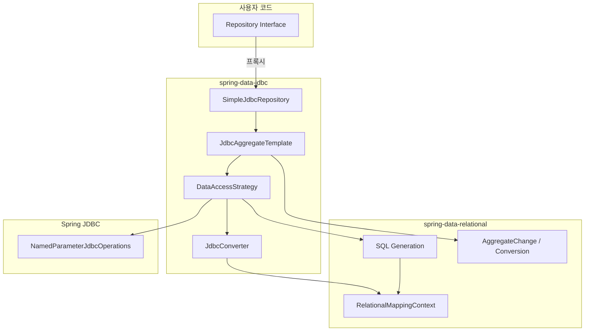
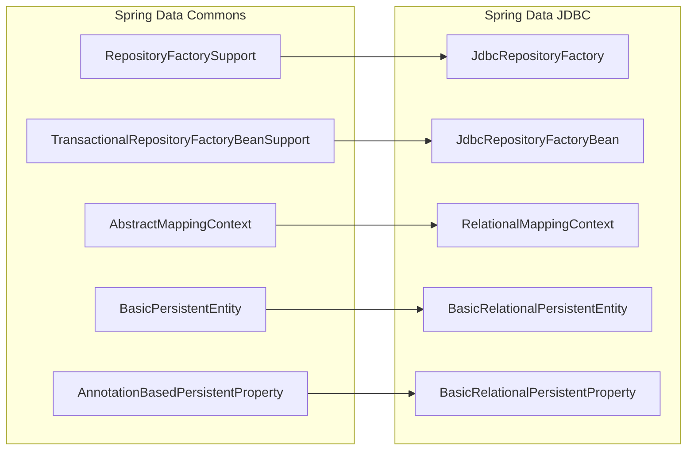

# Spring Data JDBC 아키텍처 개요

Spring Data JDBC의 모듈 구조, 계층별 책임, Spring Data Commons 통합 방식, 그리고 JPA와의 핵심 차이점을 분석한다.

## 목차
- [1. 핵심 개념 (What)](#1-핵심-개념-what)
- [2. 왜 알아야 하는가 (Why)](#2-왜-알아야-하는가-why)
- [3. 내부 구현 분석 (How)](#3-내부-구현-분석-how)
- [4. 실전 예제](#4-실전-예제)
- [5. 정리](#5-정리)

---

## 1. 핵심 개념 (What)

Spring Data JDBC는 DDD(Domain-Driven Design)의 Aggregate 개념에 충실한 데이터 접근 기술이다. JPA와 달리 Lazy Loading, 세션/캐시, 더티 체킹이 없으며, SQL을 직접 제어할 수 있는 "투명한" ORM을 지향한다.

프로젝트는 두 개의 핵심 모듈로 구성된다:

| 모듈 | 역할 |
|------|------|
| `spring-data-relational` | RDBMS 공통 추상화 (매핑, 변환, SQL 생성 등) |
| `spring-data-jdbc` | JDBC 전용 구현 (Repository, Template, DataAccessStrategy) |

`spring-data-relational`은 JDBC뿐 아니라 R2DBC에서도 공유하는 기반 모듈이다. 매핑 메타데이터(`RelationalMappingContext`), 엔티티 변환, SQL 생성 등 RDBMS 계열이 공통으로 필요로 하는 기능을 제공한다.

## 2. 왜 알아야 하는가 (Why)

- **디버깅 효율**: 문제가 발생했을 때 어느 계층에서 원인을 찾아야 하는지 알 수 있다 (SQL 생성 문제인지, 변환 문제인지, Repository 프록시 문제인지)
- **커스터마이징 포인트 파악**: NamingStrategy, DataAccessStrategy, Converter 등 어떤 확장점이 어느 계층에 있는지 이해해야 정확한 위치에서 커스터마이징할 수 있다
- **JPA 마이그레이션 시 오해 방지**: Lazy Loading 부재, Aggregate 단위 CRUD 등 JPA와의 근본적 차이를 이해하지 못하면 설계 실수로 이어진다

## 3. 내부 구현 분석 (How)

### 3.1 전체 아키텍처 다이어그램



### 3.2 모듈 구조 상세

**`spring-data-relational` 핵심 패키지:**

| 패키지 | 핵심 클래스 | 책임 |
|--------|------------|------|
| `core.mapping` | `RelationalMappingContext`, `BasicRelationalPersistentEntity`, `NamingStrategy` | 엔티티-테이블 매핑 메타데이터 |
| `core.conversion` | `RelationalEntityInsertWriter`, `RelationalEntityUpdateWriter`, `AggregateChange` | Aggregate 변경 사항을 SQL 작업으로 변환 |
| `core.sql` | `SqlIdentifier`, `Table`, `Column`, `Select` | SQL AST 추상화 |
| `core.sqlgeneration` | SQL 생성기 | 매핑 메타데이터 기반 SQL 문 생성 |
| `core.dialect` | `Dialect` | DB별 방언 처리 |

**`spring-data-jdbc` 핵심 패키지:**

| 패키지 | 핵심 클래스 | 책임 |
|--------|------------|------|
| `repository.support` | `JdbcRepositoryFactory`, `SimpleJdbcRepository`, `JdbcRepositoryFactoryBean` | Repository 프록시 생성 및 기본 구현 |
| `core` | `JdbcAggregateTemplate`, `JdbcAggregateOperations` | Aggregate 단위 CRUD 오퍼레이션 |
| `core.convert` | `DataAccessStrategy`, `JdbcConverter`, `EntityRowMapper` | DB 접근 전략 및 타입 변환 |
| `core.mapping` | `JdbcMappingContext`, `AggregateReference` | JDBC 전용 매핑 확장 |

### 3.3 계층별 책임과 흐름

`save(entity)` 호출 시 처리 흐름을 통해 각 계층의 역할을 살펴본다.

```
SimpleJdbcRepository.save(entity)
  └─ JdbcAggregateTemplate.save(entity)
       ├─ EntityLifecycleEventDelegate: BeforeSaveEvent 발행
       ├─ RelationalEntityInsertWriter / UpdateWriter: AggregateChange 생성
       ├─ AggregateChangeExecutor.execute(change)
       │    └─ DataAccessStrategy.insert() / update()
       │         ├─ JdbcConverter: 엔티티 → SQL 파라미터 변환
       │         ├─ SQL Generation: 매핑 메타데이터 기반 INSERT/UPDATE SQL 생성
       │         └─ NamedParameterJdbcOperations: 실제 SQL 실행
       └─ EntityLifecycleEventDelegate: AfterSaveEvent 발행
```

**JdbcAggregateTemplate** (`JdbcAggregateTemplate.java`)은 핵심 오케스트레이터다. 생성자에서 주입받는 의존성을 보면 각 계층의 연결 구조가 드러난다:

```java
// JdbcAggregateTemplate 핵심 필드
public class JdbcAggregateTemplate implements JdbcAggregateOperations {
    private final EntityLifecycleEventDelegate eventDelegate;
    private final RelationalMappingContext context;         // 매핑 메타데이터
    private final RelationalEntityDeleteWriter jdbcEntityDeleteWriter;
    private final DataAccessStrategy accessStrategy;        // DB 접근 전략
    private final AggregateChangeExecutor executor;         // 변경 실행기
    private final JdbcConverter converter;                  // 타입 변환기
}
```

**DataAccessStrategy** (`DataAccessStrategy.java`)는 단일 SQL 문 수준의 DB 접근을 추상화한다:

```java
public interface DataAccessStrategy extends ReadingDataAccessStrategy, RelationResolver {
    Dialect getDialect();
    NamedParameterJdbcOperations getJdbcOperations();
    // insert, update, delete, findById, findAll 등
}
```

### 3.4 Spring Data Commons 통합

Spring Data JDBC는 Spring Data Commons의 Repository 인프라를 재사용한다. 핵심 통합 지점은 다음과 같다:



`JdbcRepositoryFactory`는 `RepositoryFactorySupport`를 상속하여 `getTargetRepository()`에서 `SimpleJdbcRepository`를 반환하고, `getRepositoryBaseClass()`에서 기본 구현체 클래스를 지정한다:

```java
// JdbcRepositoryFactory.java
@Override
protected Object getTargetRepository(RepositoryInformation repositoryInformation) {
    RelationalPersistentEntity<?> persistentEntity = getMappingContext()
        .getRequiredPersistentEntity(repositoryInformation.getDomainType());
    return getTargetRepositoryViaReflection(repositoryInformation, operations,
        persistentEntity, operations.getConverter());
}

@Override
protected Class<?> getRepositoryBaseClass(RepositoryMetadata repositoryMetadata) {
    return SimpleJdbcRepository.class;
}
```

### 3.5 JPA와의 핵심 차이점

| 특성 | Spring Data JPA | Spring Data JDBC |
|------|----------------|-----------------|
| **Lazy Loading** | 프록시 기반 지연 로딩 | 없음 -- 즉시 로딩 또는 미로딩 |
| **세션/캐시** | 1차 캐시 (PersistenceContext) | 없음 -- 매 조회가 새 SQL |
| **Dirty Checking** | 영속성 컨텍스트에서 자동 감지 | 없음 -- `save()` 호출 필수 |
| **변경 단위** | 엔티티 단위 | Aggregate 단위 |
| **ID 기반 신규/수정 판단** | `@GeneratedValue` + persist/merge | `isNew()` -- ID가 null이면 INSERT, 아니면 UPDATE |
| **관계 매핑** | `@OneToMany`, `@ManyToOne` 등 | Aggregate 내부 1:1, 1:N만 지원 (Aggregate 간은 ID 참조) |
| **SQL 생성** | JPQL -> SQL | 직접 SQL 생성 (또는 `@Query` 네이티브 SQL) |

Spring Data JDBC의 Aggregate 중심 설계에서 가장 중요한 원칙:

> **Aggregate 경계 밖의 엔티티는 ID로만 참조한다.** `AggregateReference<T, ID>`를 사용하여 다른 Aggregate Root를 가리키되, 객체 그래프로 탐색하지 않는다.

## 4. 실전 예제

### 4.1 기본 Aggregate 구성

```java
import org.springframework.data.annotation.Id;
import org.springframework.data.relational.core.mapping.Table;
import org.springframework.data.relational.core.mapping.MappedCollection;

@Table("orders")
public class Order {

    @Id
    private Long id;
    private String customerName;

    @MappedCollection(idColumn = "order_id")
    private Set<OrderItem> items = new HashSet<>();

    // Aggregate 경계 밖 참조는 ID로만
    private Long productCatalogId;

    // 생성자, getter 등
}

@Table("order_items")
public class OrderItem {
    @Id
    private Long id;
    private String productName;
    private int quantity;
    private BigDecimal price;
}
```

### 4.2 Repository 선언과 사용

```java
public interface OrderRepository extends CrudRepository<Order, Long> {
    List<Order> findByCustomerName(String customerName);
}

@Service
@RequiredArgsConstructor
public class OrderService {

    private final OrderRepository orderRepository;

    @Transactional
    public Order createOrder(String customer, List<OrderItem> items) {
        Order order = new Order();
        order.setCustomerName(customer);
        items.forEach(order::addItem);
        // save() 한 번으로 Order + 모든 OrderItem이 함께 INSERT됨
        return orderRepository.save(order);
    }

    @Transactional
    public Order updateOrder(Long orderId, OrderItem newItem) {
        Order order = orderRepository.findById(orderId)
            .orElseThrow(() -> new IllegalArgumentException("Order not found"));
        order.addItem(newItem);
        // 기존 items는 전부 DELETE 후 다시 INSERT (Aggregate 단위 저장)
        return orderRepository.save(order);
    }
}
```

### 4.3 커스텀 DataAccessStrategy 적용

```java
@Configuration
public class JdbcConfig extends AbstractJdbcConfiguration {

    @Bean
    public NamingStrategy namingStrategy() {
        return new NamingStrategy() {
            @Override
            public String getTableName(Class<?> type) {
                return "tbl_" + NamingStrategy.super.getTableName(type);
            }
        };
    }
}
```

## 5. 정리

| 항목 | 핵심 내용 |
|------|----------|
| **모듈 구조** | `spring-data-relational` (공통 추상화) + `spring-data-jdbc` (JDBC 구현). R2DBC도 relational 모듈을 공유 |
| **계층 흐름** | Repository -> JdbcAggregateTemplate -> DataAccessStrategy -> JdbcConverter -> NamedParameterJdbcOperations |
| **Commons 통합** | RepositoryFactorySupport, AbstractMappingContext, BasicPersistentEntity 등을 상속하여 Spring Data 공통 인프라 활용 |
| **JPA 대비 특징** | No Lazy Loading, No Session/Cache, No Dirty Checking. Aggregate 단위 CRUD. 투명한 SQL 제어 |
| **설계 원칙** | Aggregate Root를 통해서만 내부 엔티티에 접근. Aggregate 간은 ID 참조 (`AggregateReference`) |

---
*참고: Spring Data JDBC 3.x / Spring Boot 3.x 기준*
