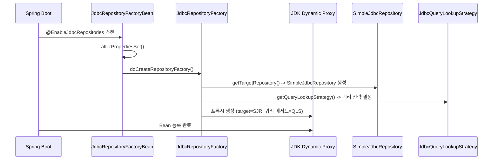

# Repository 추상화와 프록시 패턴

Spring Data JDBC가 인터페이스만으로 Repository 구현체를 자동 생성하는 메커니즘을 JdbcRepositoryFactory, SimpleJdbcRepository, JdbcRepositoryFactoryBean, JdbcQueryLookupStrategy를 중심으로 분석한다.

## 목차
- [1. 핵심 개념 (What)](#1-핵심-개념-what)
- [2. 왜 알아야 하는가 (Why)](#2-왜-알아야-하는가-why)
- [3. 내부 구현 분석 (How)](#3-내부-구현-분석-how)
- [4. 실전 예제](#4-실전-예제)
- [5. 정리](#5-정리)

---

## 1. 핵심 개념 (What)

Spring Data의 가장 강력한 기능 중 하나는 **Repository 추상화**다. 개발자가 인터페이스만 선언하면 Spring이 런타임에 프록시 기반 구현체를 자동 생성한다.

Spring Data JDBC에서 이 메커니즘을 담당하는 핵심 클래스는 4개다:

| 클래스 | 역할 |
|--------|------|
| `JdbcRepositoryFactoryBean` | Spring Bean으로 등록되어 FactoryBean 역할 수행. Repository 프록시 생성의 진입점 |
| `JdbcRepositoryFactory` | 실제 프록시 인스턴스를 생성하는 팩토리. `RepositoryFactorySupport` 상속 |
| `SimpleJdbcRepository` | `CrudRepository`의 기본 구현체. 프록시의 target으로 사용 |
| `JdbcQueryLookupStrategy` | 커스텀 쿼리 메서드를 적절한 `RepositoryQuery` 구현체로 라우팅 |

## 2. 왜 알아야 하는가 (Why)

- **커스텀 Repository 구현**: 기본 구현체를 확장하거나 교체하려면 팩토리 구조를 이해해야 한다
- **쿼리 메서드 동작 원리**: `findByXxx` 같은 파생 쿼리와 `@Query` 어노테이션 쿼리가 내부적으로 어떻게 분기되는지 알아야 디버깅할 수 있다
- **성능 최적화**: Repository 메서드 호출이 어떤 경로로 SQL까지 도달하는지 파악하면 불필요한 호출을 줄일 수 있다
- **FactoryBean 패턴 이해**: Spring Data 전반에 적용되는 공통 패턴이므로 한 번 이해하면 JPA, MongoDB 등 다른 모듈에도 적용 가능

## 3. 내부 구현 분석 (How)

### 3.1 Repository 프록시 생성 전체 흐름



### 3.2 JdbcRepositoryFactoryBean 상세

`JdbcRepositoryFactoryBean`은 `TransactionalRepositoryFactoryBeanSupport`를 상속하며, Spring의 `FactoryBean` 패턴을 사용하여 Repository 프록시를 Bean으로 등록한다.

```java
// JdbcRepositoryFactoryBean.java 핵심 구조
public class JdbcRepositoryFactoryBean<T extends Repository<S, ID>, S, ID extends Serializable>
        extends TransactionalRepositoryFactoryBeanSupport<T, S, ID> {

    private @Nullable JdbcAggregateOperations aggregateOperations;
    private @Nullable DataAccessStrategy dataAccessStrategy;
    private @Nullable JdbcConverter converter;
    private @Nullable Dialect dialect;
    // ...
}
```

`afterPropertiesSet()` 메서드에서 의존성 해석이 이루어진다. 이 과정은 여러 fallback 경로를 갖는다:

```
afterPropertiesSet() 의존성 해석 순서:
1. aggregateOperations가 직접 설정되었는가?
   └─ Yes → 그대로 사용
   └─ No → BeanFactory에서 JdbcAggregateOperations 조회
        └─ 없으면 → DataAccessStrategy + JdbcConverter로 직접 생성

2. dataAccessStrategy가 없으면?
   └─ BeanFactory에서 조회
   └─ 없으면 → Dialect + Converter로 DataAccessStrategyFactory를 통해 생성

3. QueryMappingConfiguration이 없으면?
   └─ BeanFactory에서 조회 → 없으면 QueryMappingConfiguration.EMPTY 사용
```

`doCreateRepositoryFactory()`는 실제로 `JdbcRepositoryFactory`를 생성한다:

```java
// JdbcRepositoryFactoryBean.doCreateRepositoryFactory()
@Override
protected RepositoryFactorySupport doCreateRepositoryFactory() {
    JdbcRepositoryFactory repositoryFactory;

    if (this.aggregateOperations != null) {
        repositoryFactory = new JdbcRepositoryFactory(this.aggregateOperations);
    } else {
        JdbcAggregateOperations operations =
            new JdbcAggregateTemplate(converter, dataAccessStrategy);
        repositoryFactory = new JdbcRepositoryFactory(operations);
    }

    repositoryFactory.setQueryMappingConfiguration(queryMappingConfiguration);
    repositoryFactory.setBeanFactory(beanFactory);
    return repositoryFactory;
}
```

### 3.3 JdbcRepositoryFactory 상세

`JdbcRepositoryFactory`는 `RepositoryFactorySupport`를 상속하며, 3가지 핵심 메서드를 오버라이드한다:

**1) `getTargetRepository()` -- 기본 구현체 생성**

```java
@Override
protected Object getTargetRepository(RepositoryInformation repositoryInformation) {
    RelationalPersistentEntity<?> persistentEntity = getMappingContext()
        .getRequiredPersistentEntity(repositoryInformation.getDomainType());
    return getTargetRepositoryViaReflection(repositoryInformation, operations,
        persistentEntity, operations.getConverter());
}
```

`getTargetRepositoryViaReflection()`은 리플렉션으로 `SimpleJdbcRepository(JdbcAggregateOperations, PersistentEntity, JdbcConverter)` 생성자를 호출한다.

**2) `getRepositoryBaseClass()` -- 기본 구현체 클래스 지정**

```java
@Override
protected Class<?> getRepositoryBaseClass(RepositoryMetadata repositoryMetadata) {
    return SimpleJdbcRepository.class;
}
```

**3) `getQueryLookupStrategy()` -- 쿼리 메서드 전략 결정**

```java
@Override
protected Optional<QueryLookupStrategy> getQueryLookupStrategy(
        QueryLookupStrategy.@Nullable Key key,
        ValueExpressionDelegate valueExpressionDelegate) {

    RowMapperFactory rowMapperFactory = beanFactory != null
        ? new BeanFactoryAwareRowMapperFactory(beanFactory, operations, queryMappingConfiguration)
        : new DefaultRowMapperFactory(operations, queryMappingConfiguration);

    return Optional.of(JdbcQueryLookupStrategy.create(key, operations,
        rowMapperFactory, new CachingValueExpressionDelegate(valueExpressionDelegate)));
}
```

### 3.4 SimpleJdbcRepository 상세

`SimpleJdbcRepository`는 `CrudRepository`와 `PagingAndSortingRepository`, `QueryByExampleExecutor`를 구현하는 기본 구현체다. 모든 작업을 `JdbcAggregateOperations`에 위임한다:

```java
@Transactional(readOnly = true)
public class SimpleJdbcRepository<T, ID>
        implements CrudRepository<T, ID>, PagingAndSortingRepository<T, ID>,
                   QueryByExampleExecutor<T> {

    private final JdbcAggregateOperations entityOperations;
    private final PersistentEntity<T, ?> entity;
    private final RelationalExampleMapper exampleMapper;

    @Transactional
    @Override
    public <S extends T> S save(S instance) {
        return entityOperations.save(instance);
    }

    @Override
    public Optional<T> findById(ID id) {
        return Optional.ofNullable(
            entityOperations.findById(id, entity.getType()));
    }

    @Transactional
    @Override
    public void deleteById(ID id) {
        entityOperations.deleteById(id, entity.getType());
    }

    // findAll, count, existsById 등도 동일하게 entityOperations에 위임
}
```

주요 특징:
- 클래스 레벨 `@Transactional(readOnly = true)` -- 읽기 메서드는 기본적으로 readOnly 트랜잭션
- 쓰기 메서드(`save`, `delete` 등)는 개별적으로 `@Transactional`을 적용하여 readOnly를 오버라이드
- `entity.getType()`을 통해 도메인 타입 정보를 `JdbcAggregateOperations`에 전달

### 3.5 JdbcQueryLookupStrategy 상세

`JdbcQueryLookupStrategy`는 커스텀 쿼리 메서드(예: `findByName`, `@Query` 어노테이션)를 적절한 `RepositoryQuery` 구현체로 라우팅한다.

```mermaid
graph TB
    QLS[JdbcQueryLookupStrategy.create]

    QLS -->|Key.CREATE| CQ[CreateQueryLookupStrategy]
    QLS -->|Key.USE_DECLARED_QUERY| DQ[DeclaredQueryLookupStrategy]
    QLS -->|Key.CREATE_IF_NOT_FOUND 기본값| CINF[CreateIfNotFoundQueryLookupStrategy]

    CQ --> PTJQ[PartTreeJdbcQuery]
    DQ --> SBJQ[StringBasedJdbcQuery]
    CINF -->|@Query 있으면| SBJQ
    CINF -->|없으면| PTJQ
```

3가지 전략이 내부 클래스로 구현되어 있다:

**CreateQueryLookupStrategy** -- 메서드 이름으로부터 쿼리 파생:
```java
static class CreateQueryLookupStrategy extends JdbcQueryLookupStrategy {
    @Override
    public RepositoryQuery resolveQuery(Method method, ...) {
        JdbcQueryMethod queryMethod = getJdbcQueryMethod(method, ...);
        return new PartTreeJdbcQuery(queryMethod, operations, rowMapperFactory);
    }
}
```

**DeclaredQueryLookupStrategy** -- `@Query` 어노테이션 또는 Named Query 사용:
```java
static class DeclaredQueryLookupStrategy extends JdbcQueryLookupStrategy {
    @Override
    public RepositoryQuery resolveQuery(Method method, ...) {
        JdbcQueryMethod queryMethod = getJdbcQueryMethod(method, ...);
        if (namedQueries.hasQuery(queryMethod.getNamedQueryName())
                || queryMethod.hasAnnotatedQuery()) {
            String queryString = evaluateTableExpressions(
                repositoryMetadata, queryMethod.getRequiredQuery());
            return new StringBasedJdbcQuery(queryString, queryMethod,
                operations, rowMapperFactory, delegate);
        }
        throw new IllegalStateException("No query found for method " + method);
    }
}
```

**CreateIfNotFoundQueryLookupStrategy** -- 기본 전략. 선언된 쿼리를 먼저 시도하고, 없으면 메서드 이름에서 파생:
```java
static class CreateIfNotFoundQueryLookupStrategy extends JdbcQueryLookupStrategy {
    @Override
    public RepositoryQuery resolveQuery(Method method, ...) {
        try {
            return lookupStrategy.resolveQuery(method, ...);   // @Query 시도
        } catch (IllegalStateException e) {
            return createStrategy.resolveQuery(method, ...);   // 메서드 이름 파생
        }
    }
}
```

팩토리 메서드 `create()`에서 Key 값에 따라 전략을 선택한다:

```java
public static QueryLookupStrategy create(@Nullable Key key, ...) {
    Key keyToUse = key != null ? key : Key.CREATE_IF_NOT_FOUND;
    return switch (keyToUse) {
        case CREATE -> createQueryLookupStrategy;
        case USE_DECLARED_QUERY -> declaredQueryLookupStrategy;
        case CREATE_IF_NOT_FOUND -> new CreateIfNotFoundQueryLookupStrategy(...);
    };
}
```

### 3.6 프록시 구조 내부

실제 생성되는 프록시의 메서드 호출 분기 구조:

```
OrderRepository.save(order)
  └─ JDK Proxy
       └─ RepositoryComposition
            └─ SimpleJdbcRepository.save(order)    [CrudRepository 메서드]

OrderRepository.findByCustomerName("홍길동")
  └─ JDK Proxy
       └─ QueryExecutorMethodInterceptor
            └─ PartTreeJdbcQuery.execute()         [파생 쿼리]

OrderRepository.findActiveOrders()   // @Query 사용 시
  └─ JDK Proxy
       └─ QueryExecutorMethodInterceptor
            └─ StringBasedJdbcQuery.execute()      [선언된 쿼리]
```

## 4. 실전 예제

### 4.1 기본 Repository 사용

```java
import org.springframework.data.repository.CrudRepository;

public interface ProductRepository extends CrudRepository<Product, Long> {

    // 메서드 이름에서 쿼리 파생 (PartTreeJdbcQuery)
    List<Product> findByNameContaining(String keyword);

    // 정렬 지원
    List<Product> findByCategoryOrderByPriceDesc(String category);

    // 페이징 지원
    Page<Product> findByCategory(String category, Pageable pageable);

    // 카운트 쿼리 파생
    long countByCategory(String category);

    // 존재 여부 확인
    boolean existsByName(String name);
}
```

### 4.2 @Query를 사용한 커스텀 쿼리

```java
import org.springframework.data.jdbc.repository.query.Query;
import org.springframework.data.repository.query.Param;

public interface OrderRepository extends CrudRepository<Order, Long> {

    @Query("SELECT * FROM orders WHERE customer_name = :name AND status = 'ACTIVE'")
    List<Order> findActiveOrdersByCustomer(@Param("name") String customerName);

    @Query("SELECT COUNT(*) FROM orders WHERE created_at >= :since")
    long countOrdersSince(@Param("since") LocalDateTime since);

    @Query("UPDATE orders SET status = :status WHERE id = :id")
    @Modifying
    boolean updateStatus(@Param("id") Long id, @Param("status") String status);
}
```

### 4.3 커스텀 Repository 구현체 확장

```java
// 커스텀 인터페이스 정의
public interface OrderRepositoryCustom {
    List<Order> findOrdersWithComplexCriteria(OrderSearchCriteria criteria);
}

// 커스텀 구현체 (접미사 "Impl"이 기본)
@RequiredArgsConstructor
public class OrderRepositoryCustomImpl implements OrderRepositoryCustom {

    private final NamedParameterJdbcOperations jdbcOperations;
    private final JdbcConverter converter;

    @Override
    public List<Order> findOrdersWithComplexCriteria(OrderSearchCriteria criteria) {
        StringBuilder sql = new StringBuilder("SELECT * FROM orders WHERE 1=1");
        MapSqlParameterSource params = new MapSqlParameterSource();

        if (criteria.getCustomerName() != null) {
            sql.append(" AND customer_name = :customerName");
            params.addValue("customerName", criteria.getCustomerName());
        }
        if (criteria.getMinAmount() != null) {
            sql.append(" AND total_amount >= :minAmount");
            params.addValue("minAmount", criteria.getMinAmount());
        }

        return jdbcOperations.query(sql.toString(), params,
            (rs, rowNum) -> {
                // 수동 매핑 또는 EntityRowMapper 활용
                Order order = new Order();
                order.setId(rs.getLong("id"));
                order.setCustomerName(rs.getString("customer_name"));
                return order;
            });
    }
}

// Repository 인터페이스에서 결합
public interface OrderRepository
        extends CrudRepository<Order, Long>, OrderRepositoryCustom {
    // CrudRepository 기본 메서드 + 커스텀 메서드 모두 사용 가능
}
```

## 5. 정리

| 클래스 | 역할 | 핵심 메서드 |
|--------|------|------------|
| `JdbcRepositoryFactoryBean` | Spring FactoryBean. Bean 생명주기에서 의존성 해석 후 Factory 생성 | `afterPropertiesSet()`, `doCreateRepositoryFactory()` |
| `JdbcRepositoryFactory` | 프록시 인스턴스 생성. 기본 구현체와 쿼리 전략 결정 | `getTargetRepository()`, `getQueryLookupStrategy()` |
| `SimpleJdbcRepository` | `CrudRepository` 기본 구현. 모든 작업을 `JdbcAggregateOperations`에 위임 | `save()`, `findById()`, `deleteById()` |
| `JdbcQueryLookupStrategy` | 쿼리 메서드 라우팅. 3가지 전략(Create, Declared, CreateIfNotFound) | `resolveQuery()`, `create()` |

**쿼리 메서드 라우팅 규칙 (기본: CREATE_IF_NOT_FOUND):**
1. `@Query` 어노테이션이 있으면 -> `StringBasedJdbcQuery` (직접 SQL 실행)
2. Named Query가 있으면 -> `StringBasedJdbcQuery`
3. 둘 다 없으면 -> `PartTreeJdbcQuery` (메서드 이름에서 SQL 파생)

---
*참고: Spring Data JDBC 3.x / Spring Boot 3.x 기준*
