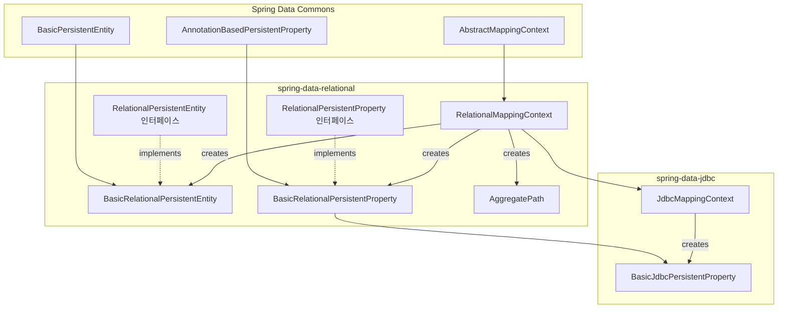
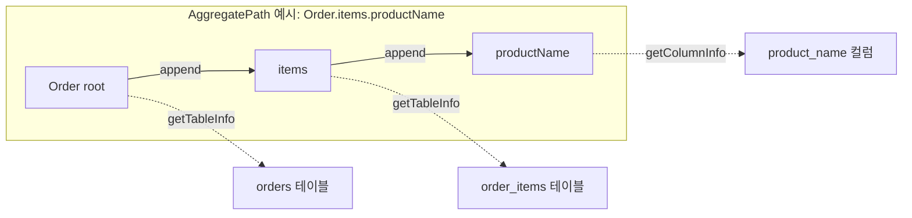

# 매핑 컨텍스트와 엔티티 메타데이터

Spring Data JDBC가 Java 클래스 구조를 DB 스키마로 매핑하기 위해 사용하는 메타데이터 시스템을 RelationalMappingContext, PersistentEntity/Property, AggregatePath를 중심으로 분석한다.

## 목차
- [1. 핵심 개념 (What)](#1-핵심-개념-what)
- [2. 왜 알아야 하는가 (Why)](#2-왜-알아야-하는가-why)
- [3. 내부 구현 분석 (How)](#3-내부-구현-분석-how)
- [4. 실전 예제](#4-실전-예제)
- [5. 정리](#5-정리)

---

## 1. 핵심 개념 (What)

매핑 컨텍스트(Mapping Context)는 Java 도메인 모델과 관계형 데이터베이스 스키마 사이의 **메타데이터 레지스트리**다. 엔티티 클래스의 필드, 타입, 어노테이션 정보를 분석하여 "이 클래스의 이 필드는 어느 테이블의 어느 컬럼에 매핑되는가"를 결정한다.

핵심 구성 요소:

| 클래스 | 역할 |
|--------|------|
| `RelationalMappingContext` | 매핑 메타데이터의 중앙 레지스트리. PersistentEntity를 생성하고 캐싱 |
| `JdbcMappingContext` | JDBC 전용 확장. JDBC 단순 타입(JdbcSimpleTypes)과 AggregateReference 처리 |
| `BasicRelationalPersistentEntity` | 하나의 엔티티 클래스에 대한 메타데이터 (테이블명, ID 프로퍼티 등) |
| `BasicRelationalPersistentProperty` | 하나의 프로퍼티에 대한 메타데이터 (컬럼명, embedded 여부 등) |
| `AggregatePath` | Aggregate 내에서 root부터 특정 프로퍼티까지의 경로 표현 |

## 2. 왜 알아야 하는가 (Why)

- **매핑 오류 해결**: "이 필드가 왜 이 컬럼으로 매핑되는가?"를 이해하려면 메타데이터 생성 과정을 알아야 한다
- **NamingStrategy 커스터마이징**: 테이블/컬럼 명명 규칙을 바꾸려면 메타데이터가 어디서 NamingStrategy를 호출하는지 알아야 한다
- **Embedded, 복합 ID 등 고급 매핑**: 이런 기능들이 메타데이터 레벨에서 어떻게 표현되는지 이해해야 올바르게 사용할 수 있다
- **SQL 생성 원리 이해**: SQL 생성기는 매핑 메타데이터를 입력으로 받으므로, 메타데이터 구조가 곧 SQL 구조를 결정한다

## 3. 내부 구현 분석 (How)

### 3.1 클래스 계층 구조



### 3.2 RelationalMappingContext 상세

`RelationalMappingContext`는 `AbstractMappingContext`를 상속하여 엔티티와 프로퍼티 메타데이터를 생성한다.

```java
public class RelationalMappingContext
        extends AbstractMappingContext<RelationalPersistentEntity<?>,
                                       RelationalPersistentProperty> {

    private final NamingStrategy namingStrategy;
    private final Map<AggregatePathCacheKey, AggregatePath> aggregatePathCache;
    private boolean forceQuote = true;
    private boolean singleQueryLoadingEnabled = false;
}
```

**핵심 팩토리 메서드:**

`createPersistentEntity()` -- 엔티티 클래스를 처음 만날 때 호출:
```java
@Override
protected <T> RelationalPersistentEntity<T> createPersistentEntity(
        TypeInformation<T> typeInformation) {

    BasicRelationalPersistentEntity<T> entity =
        new BasicRelationalPersistentEntity<>(typeInformation,
            this.namingStrategy, this.sqlIdentifierExpressionEvaluator);
    entity.setForceQuote(isForceQuote());
    return entity;
}
```

`createPersistentProperty()` -- 엔티티의 각 필드를 분석할 때 호출:
```java
@Override
protected RelationalPersistentProperty createPersistentProperty(
        Property property, RelationalPersistentEntity<?> owner,
        SimpleTypeHolder simpleTypeHolder) {

    BasicRelationalPersistentProperty persistentProperty =
        new BasicRelationalPersistentProperty(property, owner,
            simpleTypeHolder, this.namingStrategy);
    applyDefaults(persistentProperty);
    return persistentProperty;
}
```

**Embedded 엔티티 처리:**

`getPersistentEntity()`가 오버라이드되어, `@Embedded` 프로퍼티를 만나면 `EmbeddedRelationalPersistentEntity`로 래핑한다:

```java
@Override
public RelationalPersistentEntity<?> getPersistentEntity(
        RelationalPersistentProperty persistentProperty) {

    RelationalPersistentEntity<?> entity = super.getPersistentEntity(persistentProperty);

    if (entity != null && (persistentProperty.isEmbedded() || embeddedDelegation)) {
        return new EmbeddedRelationalPersistentEntity<>(entity,
            new EmbeddedContext(persistentProperty));
    }
    return entity;
}
```

### 3.3 JdbcMappingContext -- JDBC 전용 확장

`JdbcMappingContext`는 `RelationalMappingContext`를 상속하며 두 가지를 추가한다:

1. **JDBC 단순 타입 등록**: `JdbcSimpleTypes.HOLDER`를 통해 JDBC가 직접 처리할 수 있는 타입(String, Integer, BigDecimal 등)을 등록
2. **AggregateReference 필터링**: `shouldCreatePersistentEntityFor()`를 오버라이드하여 `AggregateReference`에 대해서는 PersistentEntity를 생성하지 않음

```java
public class JdbcMappingContext extends RelationalMappingContext {

    public JdbcMappingContext() {
        super();
        setSimpleTypeHolder(JdbcSimpleTypes.HOLDER);
    }

    @Override
    protected boolean shouldCreatePersistentEntityFor(TypeInformation<?> type) {
        return super.shouldCreatePersistentEntityFor(type)
            && !AggregateReference.class.isAssignableFrom(type.getType())
            && !type.isCollectionLike();
    }

    @Override
    protected RelationalPersistentProperty createPersistentProperty(...) {
        BasicJdbcPersistentProperty persistentProperty =
            new BasicJdbcPersistentProperty(property, owner,
                simpleTypeHolder, this.getNamingStrategy());
        applyDefaults(persistentProperty);
        return persistentProperty;
    }
}
```

또한 `JdbcMappingContext`는 식별자 인용(quoting) 방식을 선택하는 팩토리 메서드를 제공한다:

```java
// 대소문자 구분 없는 식별자 (기본 SQL 동작)
JdbcMappingContext.forPlainIdentifiers();

// 대소문자 구분하는 인용된 식별자 (기본값)
JdbcMappingContext.forQuotedIdentifiers();
```

### 3.4 BasicRelationalPersistentEntity 상세

하나의 엔티티 클래스에 대한 메타데이터를 보유한다. 테이블명 결정 로직이 핵심이다:

```java
class BasicRelationalPersistentEntity<T>
        extends BasicPersistentEntity<T, RelationalPersistentProperty>
        implements RelationalPersistentEntity<T> {

    private final Lazy<SqlIdentifier> tableName;
    private final @Nullable ValueExpression tableNameExpression;
    private final Lazy<Optional<SqlIdentifier>> schemaName;
}
```

**테이블명 결정 순서:**

```
@Table 어노테이션이 있는가?
├── Yes: @Table("custom_name") → "custom_name" 사용
│   └── @Table("") (빈 값) → NamingStrategy.getTableName() 사용
└── No: NamingStrategy.getTableName() 사용

NamingStrategy.getTableName(Class<?> type):
  type.getSimpleName() → CamelCase를 SNAKE_CASE로 변환
  예: OrderItem → "order_item"
```

코드에서 이 로직:

```java
// BasicRelationalPersistentEntity 생성자 내부
if (isAnnotationPresent(Table.class)) {
    Table table = getRequiredAnnotation(Table.class);
    this.tableName = Lazy.of(() ->
        StringUtils.hasText(table.value())
            ? createSqlIdentifier(table.value())
            : createDerivedSqlIdentifier(namingStrategy.getTableName(getType())));
    this.tableNameExpression = detectExpression(table.value());
} else {
    this.tableName = Lazy.of(() ->
        createDerivedSqlIdentifier(namingStrategy.getTableName(getType())));
    this.tableNameExpression = null;
}
```

`getTableName()`에서는 SpEL/Value Expression이 감지되면 동적으로 평가한다:

```java
@Override
public SqlIdentifier getTableName() {
    if (tableNameExpression == null) {
        return tableName.get();  // 정적 이름
    }
    return sqlIdentifierExpressionEvaluator.evaluate(
        tableNameExpression, isForceQuote());  // 동적 이름
}
```

### 3.5 BasicRelationalPersistentProperty 상세

하나의 프로퍼티(필드)에 대한 메타데이터를 보유한다. 컬럼명, embedded 여부, 컬렉션 매핑 정보 등을 관리한다.

```java
public class BasicRelationalPersistentProperty
        extends AnnotationBasedPersistentProperty<RelationalPersistentProperty>
        implements RelationalPersistentProperty {

    private final Lazy<SqlIdentifier> columnName;
    private final boolean hasExplicitColumnName;
    private final boolean isEmbedded;
    private final String embeddedPrefix;
    private final NamingStrategy namingStrategy;
}
```

**컬럼명 결정 순서:**

```
@Column 어노테이션이 있는가?
├── Yes: @Column("custom_col") → "custom_col" 사용
│   └── @Column("") (빈 값) → NamingStrategy.getColumnName() 사용
└── No: NamingStrategy.getColumnName() 사용

NamingStrategy.getColumnName(property):
  property.getName() → CamelCase를 SNAKE_CASE로 변환
  예: firstName → "first_name"
```

**Embedded 프로퍼티 판단:**

```java
@Override
public boolean isEmbedded() {
    return isEmbedded || (isIdProperty() && isEntity());
}
```

`@Embedded` 어노테이션이 있거나, ID 프로퍼티이면서 동시에 엔티티 타입인 경우(복합 키) embedded로 간주한다.

**MappedCollection 처리:**

`@MappedCollection` 어노테이션이 있으면 역참조 컬럼(`idColumn`)과 키 컬럼(`keyColumn`)을 설정한다:

```java
if (isAnnotationPresent(MappedCollection.class)) {
    MappedCollection mappedCollection = getRequiredAnnotation(MappedCollection.class);

    if (StringUtils.hasText(mappedCollection.idColumn())) {
        collectionIdColumnName = Lazy.of(() ->
            Optional.of(createSqlIdentifier(mappedCollection.idColumn())));
    }

    collectionKeyColumnName = Lazy.of(() ->
        StringUtils.hasText(mappedCollection.keyColumn())
            ? createSqlIdentifier(mappedCollection.keyColumn())
            : createDerivedSqlIdentifier(namingStrategy.getKeyColumn(this)));
}
```

### 3.6 AggregatePath 상세

`AggregatePath`는 Aggregate Root에서 특정 프로퍼티까지의 **탐색 경로**를 표현하는 인터페이스다. SQL 생성 시 테이블 조인, 컬럼 별칭, 역참조 컬럼 등을 결정하는 데 핵심적으로 사용된다.



주요 메서드:

| 메서드 | 설명 |
|--------|------|
| `isRoot()` | Aggregate Root 경로인지 여부 |
| `isEntity()` | 경로가 엔티티를 참조하는지 |
| `isEmbedded()` | embedded 프로퍼티인지 |
| `isMultiValued()` | 컬렉션/맵 값인지 |
| `getTableInfo()` | 해당 경로의 테이블 정보 (이름, alias, 역참조 컬럼 등) |
| `getColumnInfo()` | 해당 경로의 컬럼 정보 (이름, alias) |
| `getParentPath()` | 한 세그먼트 짧은 부모 경로 |
| `append(property)` | 경로를 한 단계 확장 |
| `getIdDefiningParentPath()` | ID를 가진 가장 가까운 조상 경로 |

`RelationalMappingContext.getAggregatePath()`를 통해 생성되며, 내부적으로 `ConcurrentHashMap`으로 캐싱된다:

```java
public AggregatePath getAggregatePath(
        PersistentPropertyPath<? extends RelationalPersistentProperty> path) {

    AggregatePathCacheKey cacheKey = AggregatePathCacheKey.of(path);
    AggregatePath aggregatePath = aggregatePathCache.get(cacheKey);
    if (aggregatePath == null) {
        aggregatePath = new DefaultAggregatePath(this, path);
        aggregatePathCache.put(cacheKey, aggregatePath);
    }
    return aggregatePath;
}
```

### 3.7 메타데이터 초기화 타이밍

```
Application 기동
  └─ AbstractMappingContext.afterPropertiesSet()
       └─ 초기 엔티티가 등록된 경우 즉시 스캔
       └─ 그 외에는 지연 초기화 (최초 접근 시)
            └─ getPersistentEntity(Class) 호출 시
                 ├─ createPersistentEntity(typeInfo)  → 엔티티 메타데이터 생성
                 └─ 각 프로퍼티에 대해 createPersistentProperty() 호출
```

## 4. 실전 예제

### 4.1 메타데이터를 활용한 동적 테이블명 조회

```java
@Service
@RequiredArgsConstructor
public class MetadataInspectionService {

    private final RelationalMappingContext mappingContext;

    public String getTableName(Class<?> entityClass) {
        RelationalPersistentEntity<?> entity =
            mappingContext.getRequiredPersistentEntity(entityClass);
        return entity.getTableName().getReference();
    }

    public List<String> getColumnNames(Class<?> entityClass) {
        RelationalPersistentEntity<?> entity =
            mappingContext.getRequiredPersistentEntity(entityClass);

        List<String> columns = new ArrayList<>();
        entity.doWithProperties(
            (RelationalPersistentProperty prop) -> {
                if (!prop.isEntity()) {
                    columns.add(prop.getColumnName().getReference());
                }
            });
        return columns;
    }
}
```

### 4.2 SpEL을 사용한 동적 테이블명

```java
@Table("#{@tenantProvider.getSchema()}.orders")
public class Order {
    @Id
    private Long id;
    private String customerName;
}

@Component("tenantProvider")
public class TenantProvider {
    public String getSchema() {
        // ThreadLocal이나 SecurityContext에서 tenant 정보 추출
        return TenantContext.getCurrentTenant();
    }
}
```

### 4.3 AggregatePath를 통한 복잡한 매핑 탐색

```java
@Service
@RequiredArgsConstructor
public class AggregatePathExplorer {

    private final RelationalMappingContext mappingContext;

    public void inspectAggregate(Class<?> rootType) {
        RelationalPersistentEntity<?> rootEntity =
            mappingContext.getRequiredPersistentEntity(rootType);

        // Root의 AggregatePath
        AggregatePath rootPath = mappingContext.getAggregatePath(rootEntity);
        System.out.println("Root table: " +
            rootPath.getTableInfo().qualifiedTableName().getReference());

        // 각 프로퍼티의 AggregatePath 탐색
        rootEntity.doWithProperties(
            (RelationalPersistentProperty prop) -> {
                PersistentPropertyPath<RelationalPersistentProperty> propertyPath =
                    mappingContext.getPersistentPropertyPath(
                        prop.getName(), rootType);
                AggregatePath path = mappingContext.getAggregatePath(propertyPath);

                if (path.isEntity()) {
                    System.out.println(prop.getName() + " -> table: " +
                        path.getTableInfo().qualifiedTableName().getReference());
                } else if (!path.isEmbedded()) {
                    System.out.println(prop.getName() + " -> column: " +
                        path.getColumnInfo().name().getReference());
                }
            });
    }
}
```

## 5. 정리

| 클래스 | 역할 | 핵심 동작 |
|--------|------|----------|
| `RelationalMappingContext` | 메타데이터 중앙 레지스트리 | `createPersistentEntity()`, `createPersistentProperty()`, `getAggregatePath()` |
| `JdbcMappingContext` | JDBC 전용 확장 | JDBC 단순 타입 등록, AggregateReference 필터링, Identifier quoting 정책 |
| `BasicRelationalPersistentEntity` | 엔티티 메타데이터 | `@Table` 처리, NamingStrategy로 테이블명 결정, SpEL 동적 테이블명 지원 |
| `BasicRelationalPersistentProperty` | 프로퍼티 메타데이터 | `@Column` 처리, NamingStrategy로 컬럼명 결정, `@Embedded`/`@MappedCollection` 처리 |
| `AggregatePath` | Aggregate 내 경로 표현 | 테이블/컬럼 정보 제공, 역참조 컬럼 계산, SQL 생성의 핵심 입력 |

**메타데이터 결정 우선순위:**
1. 어노테이션에 명시적 값이 있으면 사용 (`@Table("my_table")`, `@Column("my_col")`)
2. 어노테이션에 SpEL/Value Expression이 있으면 동적 평가
3. 어노테이션이 없거나 값이 비어 있으면 `NamingStrategy`로 파생

---
*참고: Spring Data JDBC 3.x / Spring Boot 3.x 기준*
