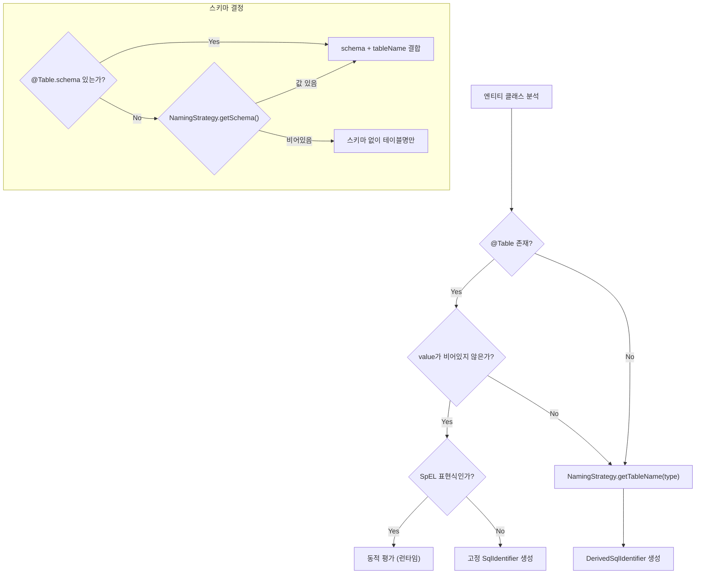
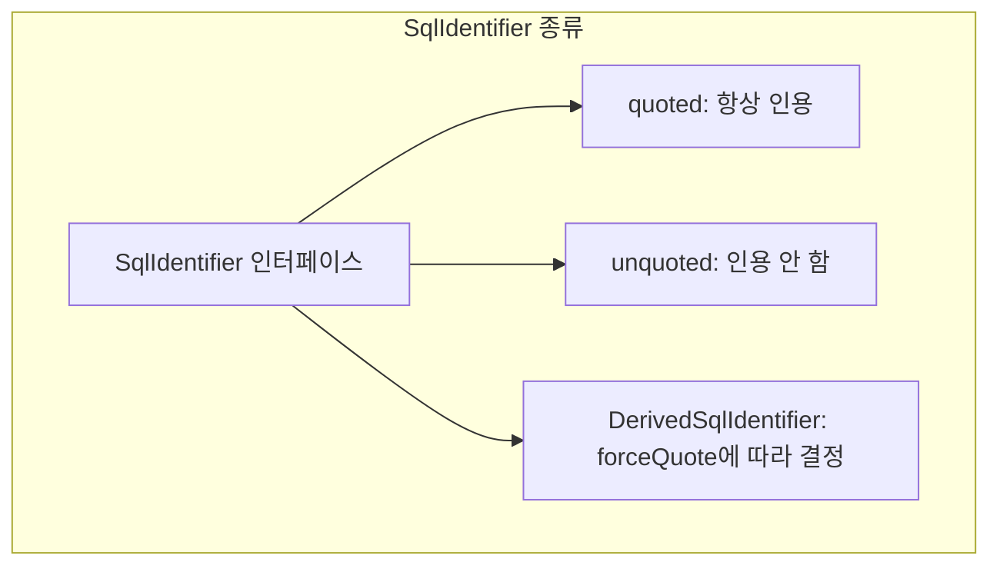

# 엔티티-테이블 매핑 시스템

@Table, @Column 어노테이션 처리, NamingStrategy 인터페이스와 기본 구현, @Embedded 동작 원리, SqlIdentifier 해석 과정을 분석한다.

## 목차
- [1. 핵심 개념 (What)](#1-핵심-개념-what)
- [2. 왜 알아야 하는가 (Why)](#2-왜-알아야-하는가-why)
- [3. 내부 구현 분석 (How)](#3-내부-구현-분석-how)
- [4. 실전 예제](#4-실전-예제)
- [5. 정리](#5-정리)

---

## 1. 핵심 개념 (What)

엔티티-테이블 매핑 시스템은 Java 도메인 객체와 관계형 DB 테이블 사이의 이름 변환 규칙을 정의한다. Spring Data JDBC는 JPA 대비 매우 단순한 매핑 모델을 제공하며, 다음 4가지 요소가 핵심이다:

| 요소 | 역할 |
|------|------|
| `@Table` / `@Column` | 명시적 테이블/컬럼 이름 지정 |
| `NamingStrategy` | 어노테이션이 없을 때 Java 이름 -> DB 이름 변환 규칙 |
| `@Embedded` | 값 객체를 별도 테이블 없이 부모 테이블 컬럼으로 풀어서 저장 |
| `SqlIdentifier` | 테이블/컬럼 이름의 내부 표현. 인용(quoting), 스키마 접두사 등 처리 |

## 2. 왜 알아야 하는가 (Why)

- **기존 스키마와 통합**: 레거시 DB의 명명 규칙(예: `TBL_` 접두사, 대문자 컬럼)에 맞추려면 NamingStrategy를 커스터마이징해야 한다
- **대소문자 민감성 이슈**: PostgreSQL은 인용된 식별자가 대소문자를 구분하고, MySQL은 OS에 따라 달라진다. `forceQuote` 설정을 이해해야 호환성 문제를 피할 수 있다
- **Embedded 값 객체 설계**: Address, Money 같은 값 객체를 별도 테이블 없이 매핑하는 패턴은 DDD 설계에서 필수적이다
- **다중 테넌트/동적 스키마**: SpEL을 사용한 동적 테이블명 지원을 이해하면 멀티테넌시 아키텍처를 구현할 수 있다

## 3. 내부 구현 분석 (How)

### 3.1 @Table 어노테이션 상세

`@Table`은 클래스를 특정 DB 테이블에 매핑한다.

```java
// Table.java
@Retention(RetentionPolicy.RUNTIME)
@Target(ElementType.TYPE)
@Documented
@Inherited
public @interface Table {

    @AliasFor("name")
    String value() default "";   // 테이블명

    @AliasFor("value")
    String name() default "";    // value의 별칭

    String schema() default "";  // 스키마명
}
```

**처리 흐름 (BasicRelationalPersistentEntity 생성자):**



### 3.2 @Column 어노테이션 상세

`@Column`은 필드를 특정 DB 컬럼에 매핑한다.

```java
// Column.java
@Retention(RetentionPolicy.RUNTIME)
@Target({ ElementType.FIELD, ElementType.METHOD, ElementType.ANNOTATION_TYPE })
@Documented
public @interface Column {
    String value() default "";  // 컬럼명, Value Expression 지원
}
```

**처리 흐름 (BasicRelationalPersistentProperty 생성자):**

```java
if (isAnnotationPresent(Column.class)) {
    Column column = getRequiredAnnotation(Column.class);
    this.hasExplicitColumnName = StringUtils.hasText(column.value());

    this.columnName = Lazy.of(() ->
        StringUtils.hasText(column.value())
            ? createSqlIdentifier(column.value())       // 명시적 이름
            : createDerivedSqlIdentifier(
                namingStrategy.getColumnName(this)));    // NamingStrategy 파생
    this.columnNameExpression = detectExpression(column.value());
} else {
    this.hasExplicitColumnName = false;
    this.columnName = Lazy.of(() ->
        createDerivedSqlIdentifier(
            namingStrategy.getColumnName(this)));        // NamingStrategy 파생
    this.columnNameExpression = null;
}
```

런타임에 `getColumnName()`이 호출되면:

```java
@Override
public SqlIdentifier getColumnName() {
    if (columnNameExpression == null) {
        return columnName.get();     // 정적 이름 (Lazy로 한 번만 계산)
    }
    return sqlIdentifierExpressionEvaluator.evaluate(
        columnNameExpression, isForceQuote());  // 매 호출마다 동적 평가
}
```

### 3.3 NamingStrategy 인터페이스

`NamingStrategy`는 어노테이션이 없을 때 Java 이름을 DB 이름으로 변환하는 규칙을 정의한다.

```java
public interface NamingStrategy {

    // 스키마명 (기본: 빈 문자열 = 스키마 없음)
    default String getSchema() { return ""; }

    // 클래스명 -> 테이블명 (기본: CamelCase -> snake_case)
    default String getTableName(Class<?> type) {
        return ParsingUtils.reconcatenateCamelCase(
            type.getSimpleName(), "_");
    }

    // 프로퍼티명 -> 컬럼명 (기본: CamelCase -> snake_case)
    default String getColumnName(RelationalPersistentProperty property) {
        return ParsingUtils.reconcatenateCamelCase(
            property.getName(), "_");
    }

    // 외래키 컬럼명 (자식 테이블에서 부모를 참조하는 컬럼)
    default String getReverseColumnName(RelationalPersistentEntity<?> owner) {
        return getTableName(owner.getType());
    }

    // Map/List 키 컬럼명
    default String getKeyColumn(RelationalPersistentProperty property) {
        return getReverseColumnName(property) + "_key";
    }
}
```

**변환 예시:**

| Java 이름 | 변환 결과 |
|-----------|----------|
| `OrderItem` (클래스) | `order_item` (테이블) |
| `firstName` (필드) | `first_name` (컬럼) |
| `createdAt` (필드) | `created_at` (컬럼) |
| `HTMLParser` (클래스) | `h_t_m_l_parser` (테이블) |

**DefaultNamingStrategy:**

```java
public class DefaultNamingStrategy implements NamingStrategy {

    public static NamingStrategy INSTANCE = new DefaultNamingStrategy() { ... };

    private ForeignKeyNaming foreignKeyNaming = ForeignKeyNaming.APPLY_RENAMING;

    @Override
    public String getReverseColumnName(RelationalPersistentEntity<?> parent) {
        return getColumnNameReferencing(parent);
    }

    private String getColumnNameReferencing(RelationalPersistentEntity<?> entity) {
        if (foreignKeyNaming == ForeignKeyNaming.IGNORE_RENAMING) {
            return getTableName(entity.getType());
        }
        return entity.getTableName().getReference();
    }
}
```

`ForeignKeyNaming` 옵션으로 외래키 컬럼명이 `@Table`에 의해 변경된 이름을 따를지, 원래 클래스명 기반 이름을 사용할지 선택할 수 있다.

**CachingNamingStrategy:**

`RelationalMappingContext`는 NamingStrategy를 `CachingNamingStrategy`로 래핑하여 반복 호출 시 성능을 보장한다:

```java
// RelationalMappingContext 생성자
public RelationalMappingContext(NamingStrategy namingStrategy) {
    this.namingStrategy = new CachingNamingStrategy(namingStrategy);
    setSimpleTypeHolder(SimpleTypeHolder.DEFAULT);
}
```

### 3.4 @Embedded 동작 원리

`@Embedded`는 값 객체의 프로퍼티들을 부모 엔티티의 테이블 컬럼으로 "펼쳐서" 저장한다. 별도 테이블이 생성되지 않는다.

```mermaid
graph LR
    subgraph "Java 도메인 모델"
        Customer["Customer"]
        Address["Address (값 객체)"]
        Customer -->|@Embedded| Address
    end

    subgraph "DB 테이블: customer"
        id["id"]
        name["name"]
        street["street"]
        city["city"]
        zip_code["zip_code"]
    end

    Customer -.-> id
    Customer -.-> name
    Address -.-> street
    Address -.-> city
    Address -.-> zip_code
```

**@Embedded 어노테이션:**

```java
@Retention(RetentionPolicy.RUNTIME)
@Target({ ElementType.FIELD, ElementType.METHOD, ElementType.ANNOTATION_TYPE })
public @interface Embedded {

    OnEmpty onEmpty();        // 모든 값이 null일 때 동작
    String prefix() default "";  // 컬럼 접두사

    enum OnEmpty {
        USE_NULL,   // null로 설정
        USE_EMPTY   // 빈 객체 생성
    }

    // 축약 어노테이션
    @Embedded(onEmpty = OnEmpty.USE_NULL)
    @interface Nullable { String prefix() default ""; }

    @Embedded(onEmpty = OnEmpty.USE_EMPTY)
    @interface Empty { String prefix() default ""; }
}
```

**BasicRelationalPersistentProperty에서의 Embedded 판단:**

```java
@Override
public boolean isEmbedded() {
    return isEmbedded || (isIdProperty() && isEntity());
}

@Override
public String getEmbeddedPrefix() {
    return isEmbedded() ? embeddedPrefix : "";
}

@Override
public boolean shouldCreateEmptyEmbedded() {
    Embedded findAnnotation = findAnnotation(Embedded.class);
    return (findAnnotation != null
            && OnEmpty.USE_EMPTY.equals(findAnnotation.onEmpty()))
        || (isIdProperty() && isEntity());
}
```

**RelationalMappingContext에서의 Embedded 엔티티 래핑:**

`@Embedded` 프로퍼티의 타입에 대해 `EmbeddedRelationalPersistentEntity`가 생성되는데, 이것은 원래 엔티티를 래핑하여 prefix를 적용한다:

```java
// RelationalMappingContext.getPersistentEntity()
if (entity != null && persistentProperty.isEmbedded()) {
    return new EmbeddedRelationalPersistentEntity<>(entity,
        new EmbeddedContext(persistentProperty));
}
```

### 3.5 SqlIdentifier 해석 과정

`SqlIdentifier`는 테이블명과 컬럼명의 내부 표현이다. 인용(quoting) 여부에 따라 SQL 렌더링 결과가 달라진다.



**DerivedSqlIdentifier:**

NamingStrategy를 통해 파생된 이름은 `DerivedSqlIdentifier`로 생성된다. `forceQuote` 설정에 따라 인용 여부가 결정된다:

```java
// BasicRelationalPersistentEntity에서의 생성
private SqlIdentifier createSqlIdentifier(String name) {
    return isForceQuote()
        ? SqlIdentifier.quoted(name)      // @Table("name") 명시 + forceQuote
        : SqlIdentifier.unquoted(name);   // @Table("name") 명시 + !forceQuote
}

private SqlIdentifier createDerivedSqlIdentifier(String name) {
    return new DerivedSqlIdentifier(name, isForceQuote());
    // NamingStrategy에서 파생된 이름
}
```

**forceQuote의 영향:**

| forceQuote | SqlIdentifier | 렌더링 결과 (PostgreSQL) | 대소문자 |
|------------|--------------|------------------------|---------|
| `true` (기본) | quoted | `"order_item"` | 구분함 |
| `false` | unquoted | `order_item` | DB 기본 동작 (보통 구분 안함) |

**스키마 + 테이블명 결합:**

```java
// BasicRelationalPersistentEntity.getQualifiedTableName()
@Override
public SqlIdentifier getQualifiedTableName() {
    SqlIdentifier schema = schemaName.get().orElse(null);
    if (schema == null) {
        return getTableName();        // 예: "orders"
    }
    return SqlIdentifier.from(schema, getTableName());
    // 예: "my_schema"."orders"
}
```

### 3.6 Value Expression 지원

`@Table`과 `@Column`의 값에 SpEL 표현식이나 Property Placeholder를 사용할 수 있다:

```java
// 테이블명에서 Expression 감지
private static @Nullable ValueExpression detectExpression(
        @Nullable String potentialExpression) {
    if (!StringUtils.hasText(potentialExpression)) {
        return null;
    }
    ValueExpression expression = PARSER.parse(potentialExpression);
    return expression.isLiteral() ? null : expression;
    // 리터럴이면 null 반환 (정적 처리)
    // 표현식이면 Expression 반환 (동적 처리)
}
```

Expression이 감지되면 `SqlIdentifierExpressionEvaluator`가 매번 동적으로 평가한다. 반환된 문자열은 `SqlIdentifierSanitizer`를 통해 SQL 인젝션을 방지한다.

## 4. 실전 예제

### 4.1 기본 매핑

```java
// NamingStrategy 기본 동작:
// 클래스명 ProductCategory -> 테이블 "product_category"
// 필드명 displayName -> 컬럼 "display_name"
public class ProductCategory {

    @Id
    private Long id;

    private String displayName;
    private int sortOrder;
    private boolean active;
}
```

### 4.2 명시적 매핑

```java
@Table(value = "tbl_products", schema = "inventory")
public class Product {

    @Id
    private Long id;

    @Column("product_nm")
    private String name;

    @Column("unit_price")
    private BigDecimal price;

    private String description;  // -> "description" (NamingStrategy 파생)
}
```

### 4.3 커스텀 NamingStrategy

```java
@Configuration
public class JdbcConfig extends AbstractJdbcConfiguration {

    @Bean
    public NamingStrategy namingStrategy() {
        return new NamingStrategy() {

            @Override
            public String getSchema() {
                return "app";  // 모든 테이블에 기본 스키마 적용
            }

            @Override
            public String getTableName(Class<?> type) {
                // 모든 테이블명에 "tbl_" 접두사
                return "tbl_" + NamingStrategy.super.getTableName(type);
            }

            @Override
            public String getColumnName(RelationalPersistentProperty property) {
                // 모든 컬럼명 대문자
                return NamingStrategy.super.getColumnName(property).toUpperCase();
            }
        };
    }
}
```

결과 매핑:

| Java | 기본 NamingStrategy | 커스텀 NamingStrategy |
|------|--------------------|--------------------|
| `OrderItem` 클래스 | `order_item` | `app.tbl_order_item` |
| `productName` 필드 | `product_name` | `PRODUCT_NAME` |

### 4.4 @Embedded 값 객체

```java
// 값 객체 정의
public class Address {
    private String street;
    private String city;
    private String zipCode;

    // 기본 생성자 + getter 필수
}

public class Money {
    private BigDecimal amount;
    private String currency;
}

// 엔티티에서 사용
@Table("customers")
public class Customer {

    @Id
    private Long id;
    private String name;

    // 모든 값이 null이면 address도 null
    @Embedded.Nullable
    private Address homeAddress;

    // prefix로 컬럼명 충돌 방지
    @Embedded.Nullable(prefix = "billing_")
    private Address billingAddress;

    // 모든 값이 null이면 빈 Money 객체 생성
    @Embedded.Empty(prefix = "balance_")
    private Money balance;
}
```

결과 테이블 구조:

```sql
CREATE TABLE customers (
    id          BIGINT PRIMARY KEY,
    name        VARCHAR(255),

    -- homeAddress (@Embedded.Nullable, prefix 없음)
    street      VARCHAR(255),
    city        VARCHAR(255),
    zip_code    VARCHAR(255),

    -- billingAddress (@Embedded.Nullable, prefix = "billing_")
    billing_street    VARCHAR(255),
    billing_city      VARCHAR(255),
    billing_zip_code  VARCHAR(255),

    -- balance (@Embedded.Empty, prefix = "balance_")
    balance_amount    DECIMAL(19,2),
    balance_currency  VARCHAR(255)
);
```

### 4.5 forceQuote 설정

```java
@Configuration
public class JdbcConfig extends AbstractJdbcConfiguration {

    @Bean
    @Override
    public JdbcMappingContext jdbcMappingContext(
            Optional<NamingStrategy> namingStrategy,
            JdbcCustomConversions customConversions) {

        // 인용 없는 식별자 사용 (대소문자 무시)
        JdbcMappingContext context = JdbcMappingContext.forPlainIdentifiers();
        return context;
    }
}
```

또는 Spring Boot에서:

```yaml
# application.yml
spring:
  data:
    jdbc:
      mapping:
        force-quote: false
```

### 4.6 동적 테이블명 (멀티테넌시)

```java
@Table("#{@tenantResolver.tableName('orders')}")
public class Order {

    @Id
    private Long id;
    private String description;

    @Column("#{@columnResolver.resolve('status')}")
    private String status;
}

@Component("tenantResolver")
public class TenantResolver {
    public String tableName(String baseTable) {
        String tenant = TenantContext.getCurrent();
        return tenant + "_" + baseTable;
        // "tenant_a_orders", "tenant_b_orders" 등
    }
}
```

## 5. 정리

| 요소 | 역할 | 핵심 클래스/메서드 |
|------|------|-----------------|
| `@Table` | 클래스-테이블 명시적 매핑 | `BasicRelationalPersistentEntity` 생성자 |
| `@Column` | 필드-컬럼 명시적 매핑 | `BasicRelationalPersistentProperty` 생성자 |
| `NamingStrategy` | Java 이름 -> DB 이름 자동 변환 | `getTableName()`, `getColumnName()`, `getReverseColumnName()` |
| `DefaultNamingStrategy` | CamelCase -> snake_case 기본 변환 | `ParsingUtils.reconcatenateCamelCase()` |
| `@Embedded` | 값 객체를 부모 테이블 컬럼으로 평탄화 | `EmbeddedRelationalPersistentEntity`, prefix 지원 |
| `SqlIdentifier` | 식별자 내부 표현 (quoting, 스키마 처리) | `quoted()`, `unquoted()`, `DerivedSqlIdentifier` |
| `forceQuote` | 전역 인용 설정 (기본 true) | `RelationalMappingContext.setForceQuote()` |
| Value Expression | 동적 테이블/컬럼명 | `SqlIdentifierExpressionEvaluator.evaluate()` |

**매핑 우선순위 요약:**
1. `@Table("name")` / `@Column("name")` -- 명시적 이름 최우선
2. SpEL 표현식 -- 런타임 동적 평가
3. `NamingStrategy` -- 어노테이션 없을 때 CamelCase -> snake_case 자동 변환

---
*참고: Spring Data JDBC 3.x / Spring Boot 3.x 기준*
