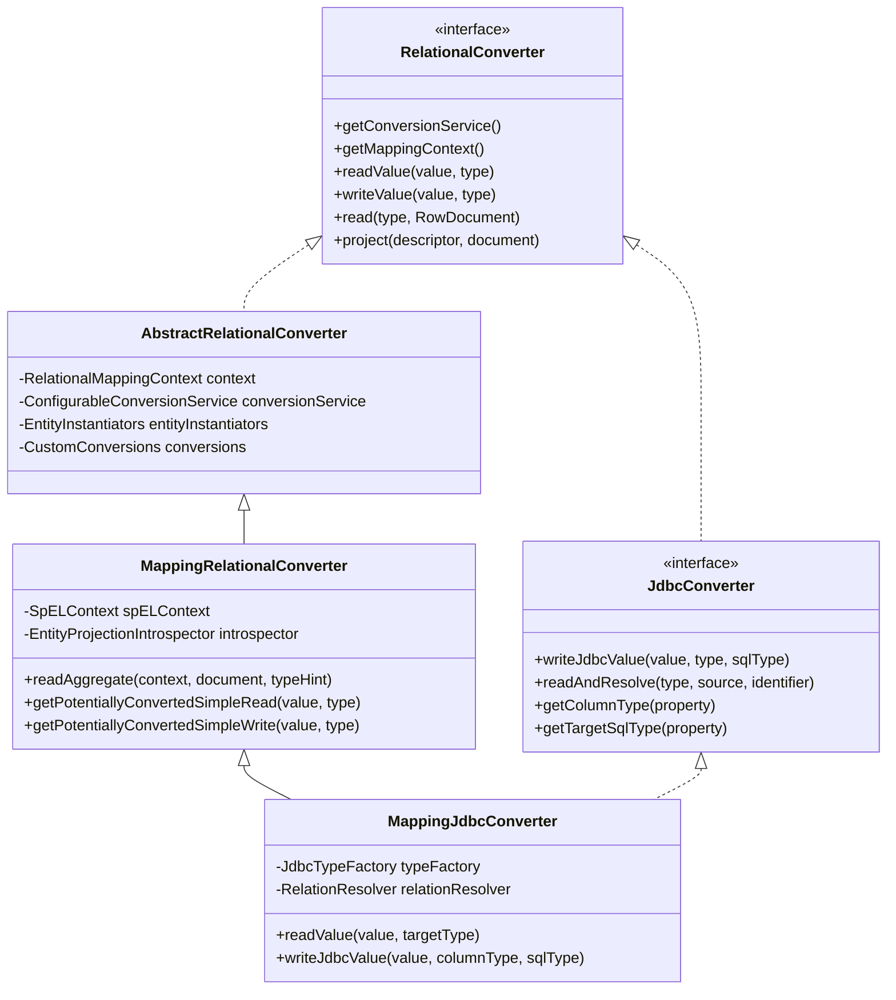

# 컨버터와 타입 변환 시스템

Spring Data JDBC의 컨버터 계층은 Java 도메인 객체와 JDBC ResultSet 사이의 양방향 변환을 담당한다. `RelationalConverter` 인터페이스부터 `MappingJdbcConverter`까지의 상속 구조와, 커스텀 컨버전 등록 메커니즘을 분석한다.

## 목차
- [1. 핵심 개념 (What)](#1-핵심-개념-what)
- [2. 왜 알아야 하는가 (Why)](#2-왜-알아야-하는가-why)
- [3. 내부 구현 분석 (How)](#3-내부-구현-분석-how)
- [4. 실전 예제](#4-실전-예제)
- [5. 정리](#5-정리)

---

## 1. 핵심 개념 (What)

Spring Data JDBC의 타입 변환 시스템은 데이터베이스의 원시 값(컬럼 값, ResultSet)과 Java 도메인 객체 사이의 **양방향 변환**을 담당하는 계층이다.

핵심 구성 요소:

| 구성 요소 | 역할 |
|-----------|------|
| `RelationalConverter` | 최상위 인터페이스. `readValue()`, `writeValue()`, `read()` 등 정의 |
| `AbstractRelationalConverter` | `ConversionService`, `EntityInstantiators`, `CustomConversions` 초기화 |
| `MappingRelationalConverter` | `RowDocument` 기반 객체 매핑, SpEL/Projection 지원 |
| `JdbcConverter` | JDBC 전용 확장. `writeJdbcValue()`, `readAndResolve()`, SQL 타입 매핑 |
| `MappingJdbcConverter` | 최종 구현체. `AggregateReference` 처리, relation resolving |
| `EntityRowMapper` | Spring JDBC `RowMapper` 구현. ResultSet -> 엔티티 변환 |
| `JdbcCustomConversions` | 커스텀 컨버터 등록 + JSR-310 기본 컨버터 관리 |
| `Jsr310TimestampBasedConverters` | `java.sql.Timestamp` <-> JSR-310 타입 간 변환기 |

## 2. 왜 알아야 하는가 (Why)

1. **커스텀 타입 매핑**: `Money`, `Email` 같은 Value Object를 DB 컬럼에 매핑하려면 컨버터 등록 방법을 알아야 한다.
2. **날짜/시간 처리**: JDBC 드라이버가 반환하는 `Timestamp`를 `LocalDateTime` 등으로 자동 변환하는 메커니즘을 이해해야 예상치 못한 타입 변환 오류를 방지할 수 있다.
3. **디버깅 능력**: "DB 컬럼 값이 왜 다른 타입으로 매핑되는가?"라는 문제를 추적하려면 컨버터 탐색 경로를 알아야 한다.
4. **AggregateReference 처리**: 다른 Aggregate를 참조할 때 ID 변환이 어떻게 이루어지는지 파악해야 한다.

## 3. 내부 구현 분석 (How)

### 3.1 컨버터 상속 계층



### 3.2 AbstractRelationalConverter - 기반 인프라 초기화

`AbstractRelationalConverter`는 생성 시 `DefaultConversionService`를 만들고, `CustomConversions`에 등록된 모든 컨버터를 여기에 등록한다.

```java
// AbstractRelationalConverter 생성자 (핵심 발췌)
private AbstractRelationalConverter(RelationalMappingContext context,
        CustomConversions conversions,
        ConfigurableConversionService conversionService,
        EntityInstantiators entityInstantiators) {

    this.context = context;
    this.conversionService = conversionService;
    this.entityInstantiators = entityInstantiators;
    this.conversions = conversions;

    // 커스텀 컨버터를 ConversionService에 등록
    conversions.registerConvertersIn(this.conversionService);
}
```

### 3.3 MappingRelationalConverter - RowDocument 기반 매핑

이 클래스가 `RowDocument`(DB 조회 결과를 담는 `Map` 형태)를 도메인 객체로 변환하는 핵심 로직을 담당한다.

**읽기 흐름 (`readValue`):**

```
readValue(value, targetType)
  -> null 체크
  -> getPotentiallyConvertedSimpleRead(value, type)
       -> hasCustomReadTarget? -> ConversionService.convert()
       -> ClassUtils.isAssignableValue? -> 그대로 반환
       -> Enum? -> Enum.valueOf()
       -> 그 외 -> ConversionService.convert()
```

**쓰기 흐름 (`writeValue`):**

```
writeValue(value, type)
  -> null 체크
  -> determineCustomWriteTarget(value, type)
       -> 커스텀 대상이 있으면 ConversionService.convert()
  -> getPotentiallyConvertedSimpleWrite(value, type)
       -> Enum -> name() 반환
       -> Array -> writeArray()
       -> Collection -> writeCollection()
       -> PersistentEntity -> ID 추출 후 재귀
       -> 그 외 -> ConversionService.convert()
```

### 3.4 MappingJdbcConverter - JDBC 전용 확장

`MappingJdbcConverter`는 두 가지 핵심 기능을 추가한다:

**1) AggregateReference 처리**

`readValue()`를 오버라이드하여 `AggregateReference` 타입을 자동 처리한다:

```java
// MappingJdbcConverter.readValue() (핵심 발췌)
@Override
public Object readValue(Object value, TypeInformation<?> targetType) {
    if (null == value) return null;

    value = potentiallyUnwrapArray(value);  // java.sql.Array 언래핑

    if (AggregateReference.class.isAssignableFrom(targetType.getType())) {
        // 제네릭 타입에서 ID 타입 추출 후 변환
        TypeInformation<?> idType = targetType.getTypeArguments().get(1);
        Object referencedId = readValue(value, idType);
        return AggregateReference.to(referencedId);
    }

    return getPotentiallyConvertedSimpleRead(value, targetType);
}
```

**2) JdbcValue 래핑**

`writeJdbcValue()`는 값을 변환한 후 `JdbcValue`로 래핑하여 SQL 타입 정보와 함께 반환한다:

```java
// MappingJdbcConverter.writeJdbcValue() (핵심 발췌)
public JdbcValue writeJdbcValue(Object value, TypeInformation<?> columnType, SQLType sqlType) {

    Object convertedValue = writeValue(value, targetType);

    if (convertedValue == null) {
        return JdbcValue.of(null, sqlType);
    }
    if (convertedValue.getClass().isArray()) {
        // 배열은 typeFactory.createArray()로 java.sql.Array 생성
        Object[] objectArray = requireObjectArray(convertedValue);
        return JdbcValue.of(typeFactory.createArray(objectArray), JDBCType.ARRAY);
    }
    return JdbcValue.of(convertedValue, sqlType);
}
```

### 3.5 EntityRowMapper - ResultSet에서 엔티티로

`EntityRowMapper`는 Spring JDBC의 `RowMapper<T>` 인터페이스를 구현한다. 내부적으로 `JdbcConverter.readAndResolve()`를 호출하여 1:N 관계까지 해결한다.

```java
// EntityRowMapper.mapRow()
public T mapRow(ResultSet resultSet, int rowNumber) throws SQLException {
    RowDocument document = RowDocumentResultSetExtractor.toRowDocument(resultSet);
    return converter.readAndResolve(typeInformation, document, identifier);
}
```

변환 경로:

```
ResultSet
  -> RowDocumentResultSetExtractor.toRowDocument()  // ResultSet -> RowDocument
  -> JdbcConverter.readAndResolve()                 // RowDocument -> Entity
       -> ResolvingRelationalPropertyValueProvider   // 1:N 관계 lazy resolve
```

### 3.6 JdbcCustomConversions - 컨버터 등록소

`JdbcCustomConversions`는 `CustomConversions`를 상속하며, 기본적으로 `Jsr310TimestampBasedConverters`를 내장한다.

```java
// JdbcCustomConversions (핵심 구조)
public class JdbcCustomConversions extends CustomConversions {

    private static final Collection<Object> STORE_CONVERTERS =
        Collections.unmodifiableCollection(
            Jsr310TimestampBasedConverters.getConvertersToRegister()
        );

    public JdbcCustomConversions(List<?> userConverters) {
        this(StoreConversions.of(JdbcSimpleTypes.HOLDER, STORE_CONVERTERS),
             userConverters);
    }
}
```

`Dialect` 기반 생성도 지원한다:

```java
JdbcCustomConversions.of(dialect, List.of(myConverter1, myConverter2));
```

### 3.7 Jsr310TimestampBasedConverters - 날짜/시간 변환

`java.sql.Timestamp`와 JSR-310 타입 간 7개 기본 컨버터를 제공한다:

| 방향 | 소스 | 대상 | 컨버터 |
|------|------|------|--------|
| Read | `Timestamp` | `LocalDateTime` | `TimestampToLocalDateTimeConverter` |
| Read | `Timestamp` | `LocalDate` | `TimestampToLocalDateConverter` |
| Write | `LocalDate` | `Timestamp` | `LocalDateToTimestampConverter` |
| Read | `Timestamp` | `LocalTime` | `TimestampToLocalTimeConverter` |
| Write | `LocalTime` | `Timestamp` | `LocalTimeToTimestampConverter` |
| Read | `Timestamp` | `Instant` | `TimestampToInstantConverter` |
| Write | `Instant` | `Timestamp` | `InstantToTimestampConverter` |

`LocalDateTimeToTimestampConverter`는 기본 등록에서 제외된다. 이 변환이 필요한 DB는 해당 Dialect에서 별도로 등록한다.

## 4. 실전 예제

### 4.1 커스텀 Value Object 컨버터 등록

```java
// Email Value Object
public record Email(String value) {
    public Email {
        if (!value.contains("@")) throw new IllegalArgumentException("Invalid email");
    }
}

// Writing Converter: Email -> String
@WritingConverter
public enum EmailToStringConverter implements Converter<Email, String> {
    INSTANCE;

    @Override
    public String convert(Email source) {
        return source.value();
    }
}

// Reading Converter: String -> Email
@ReadingConverter
public enum StringToEmailConverter implements Converter<String, Email> {
    INSTANCE;

    @Override
    public Email convert(String source) {
        return new Email(source);
    }
}

// 설정
@Configuration
public class JdbcConfig extends AbstractJdbcConfiguration {

    @Override
    public JdbcCustomConversions jdbcCustomConversions() {
        return new JdbcCustomConversions(
            List.of(EmailToStringConverter.INSTANCE, StringToEmailConverter.INSTANCE)
        );
    }
}

// 엔티티에서 사용
public record Member(
    @Id Long id,
    String name,
    Email email  // 자동으로 String <-> Email 변환
) {}
```

### 4.2 Dialect 기반 컨버터 등록 (4.0+)

```java
@Configuration
public class JdbcConfig extends AbstractJdbcConfiguration {

    @Bean
    public JdbcCustomConversions jdbcCustomConversions(Dialect dialect) {
        return JdbcCustomConversions.create(dialect, configurer -> {
            configurer.registerConverter(EmailToStringConverter.INSTANCE);
            configurer.registerConverter(StringToEmailConverter.INSTANCE);
            configurer.registerConverter(new MoneyToLongConverter());
            configurer.registerConverterFactory(new EnumToCodeConverterFactory());
        });
    }
}
```

### 4.3 AggregateReference와 컨버터의 관계

```java
public record Order(
    @Id Long id,
    String description,
    AggregateReference<Customer, Long> customerId  // FK만 저장
) {}

public record Customer(
    @Id Long id,
    String name
) {}
```

`AggregateReference<Customer, Long>` 필드는 `MappingJdbcConverter.readValue()` 내부에서 다음과 같이 처리된다:

1. DB에서 `Long` 값(예: 42)을 읽는다
2. `targetType`이 `AggregateReference.class`인지 확인한다
3. 제네릭 두 번째 타입 `Long`을 추출한다
4. `readValue(42, Long)` 재귀 호출로 ID 변환
5. `AggregateReference.to(42L)` 반환

## 5. 정리

| 계층 | 클래스 | 핵심 역할 |
|------|--------|-----------|
| 인터페이스 | `RelationalConverter` | `readValue`, `writeValue`, `read`, `project` 정의 |
| 기반 구현 | `AbstractRelationalConverter` | `ConversionService` 초기화, `CustomConversions` 등록 |
| 매핑 구현 | `MappingRelationalConverter` | `RowDocument` -> 도메인 객체, SpEL/Projection 지원 |
| JDBC 인터페이스 | `JdbcConverter` | `writeJdbcValue`, `readAndResolve`, SQL 타입 매핑 |
| JDBC 구현 | `MappingJdbcConverter` | `AggregateReference` 처리, relation resolving, 배열 언래핑 |
| RowMapper | `EntityRowMapper` | `ResultSet` -> `RowDocument` -> 엔티티 변환 파이프라인 |
| 컨버전 등록 | `JdbcCustomConversions` | 스토어/사용자 컨버터 관리, Dialect 통합 |
| 날짜 변환 | `Jsr310TimestampBasedConverters` | `Timestamp` <-> JSR-310 기본 7개 컨버터 |

핵심 설계 원칙:
- **읽기**: `hasCustomReadTarget` -> `isAssignable` -> `Enum` -> `ConversionService` 순서로 탐색
- **쓰기**: `customWriteTarget` -> `Enum.name()` -> `Array/Collection` -> `Entity(ID 추출)` 순서로 탐색
- **JDBC 확장**: `AggregateReference` 자동 해결, `java.sql.Array` 언래핑, `JdbcValue` 래핑

---
*참고: Spring Data JDBC 3.x / Spring Boot 3.x 기준*
