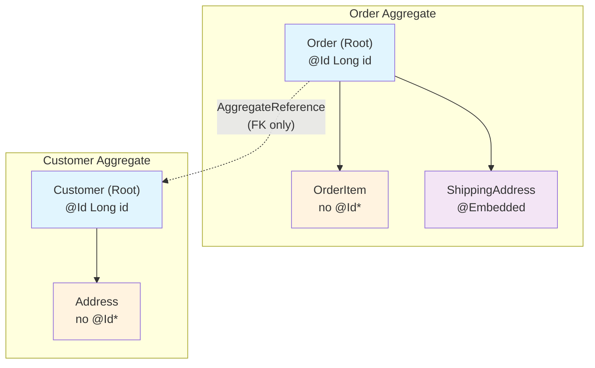
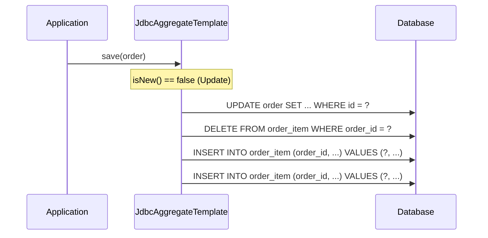

# Aggregate 패턴과 DDD 개념

Spring Data JDBC는 DDD(Domain-Driven Design)의 Aggregate 패턴을 프레임워크 수준에서 강제하는 유일한 Spring Data 모듈이다. Aggregate Root 경계 설계, `AggregateReference`를 통한 참조, 그리고 "삭제 후 재삽입" 전략의 설계 철학을 분석한다.

## 목차
- [1. 핵심 개념 (What)](#1-핵심-개념-what)
- [2. 왜 알아야 하는가 (Why)](#2-왜-알아야-하는가-why)
- [3. 내부 구현 분석 (How)](#3-내부-구현-분석-how)
- [4. 실전 예제](#4-실전-예제)
- [5. 정리](#5-정리)

---

## 1. 핵심 개념 (What)

### DDD Aggregate란?

Eric Evans의 DDD에서 **Aggregate**는 다음과 같이 정의된다:

- 데이터 변경의 단위로 취급되는 연관 객체들의 묶음
- 하나의 **Aggregate Root**를 통해서만 외부에서 접근 가능
- Aggregate 경계 안의 **일관성(consistency)**은 트랜잭션으로 보장
- Aggregate 간 참조는 **ID(식별자)**로만 수행

### Spring Data JDBC의 DDD 구현

Spring Data JDBC는 이 원칙을 코드 레벨에서 **강제**한다:

| DDD 원칙 | Spring Data JDBC 구현 |
|-----------|----------------------|
| Aggregate Root가 진입점 | `@Id`가 있는 엔티티만 Repository 생성 가능 |
| Aggregate 내부 일관성 | Root를 저장하면 자식 엔티티도 함께 저장 |
| Aggregate 간 ID 참조 | `AggregateReference<T, ID>` 인터페이스 |
| 변경 단위 = Aggregate 전체 | Update 시 자식 전체 삭제 후 재삽입 |
| Lazy Loading 없음 | Aggregate는 항상 완전 로딩 |

JPA와의 결정적 차이: **JPA는 객체 그래프를 자유롭게 탐색할 수 있지만, Spring Data JDBC는 Aggregate 경계를 넘는 탐색을 허용하지 않는다.**

## 2. 왜 알아야 하는가 (Why)

1. **Aggregate 경계 설계**: 올바른 경계를 설정하지 않으면 불필요한 데이터 삭제/재삽입이 발생하여 성능 문제가 생긴다.
2. **일관성 보장 이해**: Spring Data JDBC가 왜 Update 시 자식을 전부 삭제하고 다시 삽입하는지 알아야 프레임워크를 효과적으로 사용할 수 있다.
3. **JPA와의 차이 인식**: JPA의 관계 매핑(@ManyToOne, @ManyToMany)과 완전히 다른 사고방식이 필요하다.
4. **AggregateReference 활용**: Aggregate 간 참조를 올바르게 모델링해야 FK 관계를 유지하면서도 DDD 원칙을 따를 수 있다.

## 3. 내부 구현 분석 (How)

### 3.1 Aggregate 경계와 엔티티 소유권

Spring Data JDBC에서 Aggregate 경계는 **`@Id` 어노테이션의 존재 여부**와 **Repository 인터페이스**로 결정된다.



*\* 자식 엔티티도 테이블 매핑을 위해 `@Id`를 가질 수 있지만, Repository는 Root에만 생성한다.*

핵심 규칙:
- **Repository가 있는 엔티티** = Aggregate Root
- **Repository가 없는 엔티티** = Aggregate 내부 엔티티 (Root가 소유)
- Root를 저장/삭제하면 소유한 모든 엔티티가 함께 저장/삭제됨

### 3.2 AggregateReference - Aggregate 간 참조

`AggregateReference<T, ID>`는 다른 Aggregate의 Root를 **ID로만 참조**하는 인터페이스이다.

```java
// AggregateReference 인터페이스 (소스코드)
public interface AggregateReference<T, ID> {

    static <T, ID> AggregateReference<T, ID> to(ID id) {
        return new IdOnlyAggregateReference<>(id);
    }

    ID getId();
}
```

DB 테이블에는 FK 컬럼만 생성되고, 참조 대상 엔티티 자체는 로딩하지 않는다:

```
ORDER 테이블
+----+-------------+-------------+
| ID | DESCRIPTION | CUSTOMER_ID |  <-- AggregateReference의 ID가 FK로 매핑
+----+-------------+-------------+
| 1  | "주문 A"     | 42          |
+----+-------------+-------------+
```

### 3.3 "삭제 후 재삽입" 전략의 설계 근거

Spring Data JDBC가 Update 시 자식 엔티티를 **전부 삭제하고 다시 삽입**하는 이유:



**왜 이렇게 설계했는가?**

1. **변경 추적 없음**: JPA와 달리 dirty checking이 없으므로, 어떤 자식이 추가/수정/삭제되었는지 알 수 없다.
2. **단순성**: 변경 추적 없이도 항상 올바른 상태를 보장하는 가장 단순한 전략이다.
3. **DDD 철학**: Aggregate는 변경의 단위이므로, 전체를 한 번에 저장하는 것이 개념적으로 올바르다.
4. **일관성 보장**: 부분 업데이트로 인한 불일치 상태를 원천적으로 방지한다.

이 전략은 `WritingContext.update()` 메서드에서 확인할 수 있다:

```java
// WritingContext.update()
void update() {
    setRootAction(new DbAction.UpdateRoot<>(root, previousVersion));
    deleteReferenced().forEach(aggregateChange::addAction);   // 자식 전부 삭제
    insertReferenced().forEach(aggregateChange::addAction);   // 자식 전부 재삽입
}
```

반면 `insert()`는 삭제 없이 삽입만 수행한다:

```java
// WritingContext.insert()
void insert() {
    setRootAction(new DbAction.InsertRoot<>(root, rootIdValueSource));
    insertReferenced().forEach(aggregateChange::addAction);   // 자식 삽입만
}
```

### 3.4 JPA와의 핵심 차이점

```
+----------------------------+----------------------------+----------------------------+
|         관점               |          JPA               |    Spring Data JDBC         |
+----------------------------+----------------------------+----------------------------+
| 객체 그래프 탐색            | 자유롭게 탐색 가능          | Aggregate 경계 내로 제한     |
| Lazy Loading              | 기본 지원                   | 지원 안 함                  |
| 관계 매핑                  | @ManyToOne, @ManyToMany    | Aggregate 내: 직접 참조     |
|                            |                            | Aggregate 간: AggregateRef  |
| 변경 감지                  | Dirty Checking             | 없음 (삭제 후 재삽입)        |
| 캐시                       | 1차/2차 캐시                | 없음                       |
| N+1 문제                   | 빈번하게 발생               | Aggregate 단위 로딩         |
| 트랜잭션 일관성             | EntityManager flush        | Aggregate 단위 save         |
+----------------------------+----------------------------+----------------------------+
```

### 3.5 Aggregate Root의 isNew() 판별

Root가 새로운 엔티티인지 여부는 `save()` 시 Insert/Update를 결정하는 핵심 분기이다:

```java
// WritingContext.save()
void save() {
    if (isNew(root)) {
        setRootAction(new DbAction.InsertRoot<>(root, rootIdValueSource));
        insertReferenced().forEach(aggregateChange::addAction);
    } else {
        setRootAction(new DbAction.UpdateRoot<>(root, previousVersion));
        deleteReferenced().forEach(aggregateChange::addAction);
        insertReferenced().forEach(aggregateChange::addAction);
    }
}

private boolean isNew(Object o) {
    return context.getRequiredPersistentEntity(o.getClass()).isNew(o);
}
```

`isNew()` 판별 기준:
- `@Id` 프로퍼티가 `null`이면 새 엔티티 (insert)
- `@Id` 프로퍼티가 `0`이고 원시 타입(`long`, `int`)이면 새 엔티티
- 그 외는 기존 엔티티 (update)

## 4. 실전 예제

### 4.1 올바른 Aggregate 경계 설계

```java
// [Good] Order Aggregate - OrderItem은 Order에 종속
public record Order(
    @Id Long id,
    LocalDateTime orderedAt,
    AggregateReference<Customer, Long> customerId,  // Aggregate 간 ID 참조
    List<OrderItem> items                            // Aggregate 내부 소유
) {
    public Order addItem(String product, int quantity, long price) {
        var newItems = new ArrayList<>(items);
        newItems.add(new OrderItem(null, product, quantity, price));
        return new Order(id, orderedAt, customerId, newItems);
    }
}

public record OrderItem(
    @Id Long id,
    String product,
    int quantity,
    long unitPrice
) {}

// [Good] Customer Aggregate - 별도 Aggregate
public record Customer(
    @Id Long id,
    String name,
    String email
) {}

// Repository는 Aggregate Root에만
interface OrderRepository extends CrudRepository<Order, Long> {}
interface CustomerRepository extends CrudRepository<Customer, Long> {}
```

### 4.2 AggregateReference 활용

```java
// 주문 생성 시 고객 참조
Customer customer = customerRepository.findById(1L).orElseThrow();

Order order = new Order(
    null,
    LocalDateTime.now(),
    AggregateReference.to(customer.id()),  // ID만 참조
    List.of(
        new OrderItem(null, "Spring in Action", 1, 35000),
        new OrderItem(null, "Clean Code", 2, 30000)
    )
);

orderRepository.save(order);

// 주문에서 고객 조회 시 - 별도 Repository 사용
Order savedOrder = orderRepository.findById(1L).orElseThrow();
Long customerId = savedOrder.customerId().getId();
Customer orderCustomer = customerRepository.findById(customerId).orElseThrow();
```

### 4.3 잘못된 Aggregate 설계 예시

```java
// [Bad] Product를 Order Aggregate 안에 포함
// -> Order를 update할 때마다 Product가 삭제/재삽입됨
public record Order(
    @Id Long id,
    List<Product> products  // Product는 독립 Aggregate여야 함!
) {}

// [Good] AggregateReference 사용
public record OrderItem(
    @Id Long id,
    AggregateReference<Product, Long> productId,  // ID 참조
    int quantity
) {}
```

### 4.4 1:1 관계 (Aggregate 내부)

```java
// Address는 Customer Aggregate의 일부
public record Customer(
    @Id Long id,
    String name,
    Address address  // 1:1 Aggregate 내부 엔티티
) {}

public record Address(
    @Id Long id,
    String street,
    String city,
    String zipCode
) {}

// DDL
// CREATE TABLE customer (id BIGINT AUTO_INCREMENT PRIMARY KEY, name VARCHAR(255));
// CREATE TABLE address (id BIGINT AUTO_INCREMENT PRIMARY KEY,
//                       customer BIGINT REFERENCES customer(id),
//                       street VARCHAR(255), city VARCHAR(255), zip_code VARCHAR(10));
```

## 5. 정리

| 개념 | 설명 |
|------|------|
| Aggregate Root | `@Id` + Repository를 가진 엔티티. 외부 접근의 유일한 진입점 |
| Aggregate 내부 엔티티 | Root에 종속된 엔티티. Root와 함께 저장/삭제 |
| `AggregateReference<T, ID>` | Aggregate 간 참조. FK 컬럼만 매핑, 대상 엔티티 미로딩 |
| 삭제 후 재삽입 | Update 시 자식 전체 삭제 후 재삽입. 변경 추적 없이 일관성 보장 |
| isNew() 판별 | ID가 null(또는 원시 0)이면 Insert, 아니면 Update |
| No Lazy Loading | Aggregate는 항상 완전 로딩. 경계 밖은 접근 불가 |

설계 가이드라인:
1. **Aggregate를 작게 유지**: 자식 엔티티가 많으면 Update 시 삭제/재삽입 비용 증가
2. **독립적인 엔티티는 별도 Aggregate**: 다른 곳에서도 참조되는 엔티티는 자체 Repository를 가져야 함
3. **AggregateReference로 Aggregate 간 참조**: 직접 엔티티를 포함하지 않고 ID로만 참조
4. **불변 객체 권장**: record 타입 사용으로 Aggregate 상태 변경을 명시적으로 관리

---
*참고: Spring Data JDBC 3.x / Spring Boot 3.x 기준*
