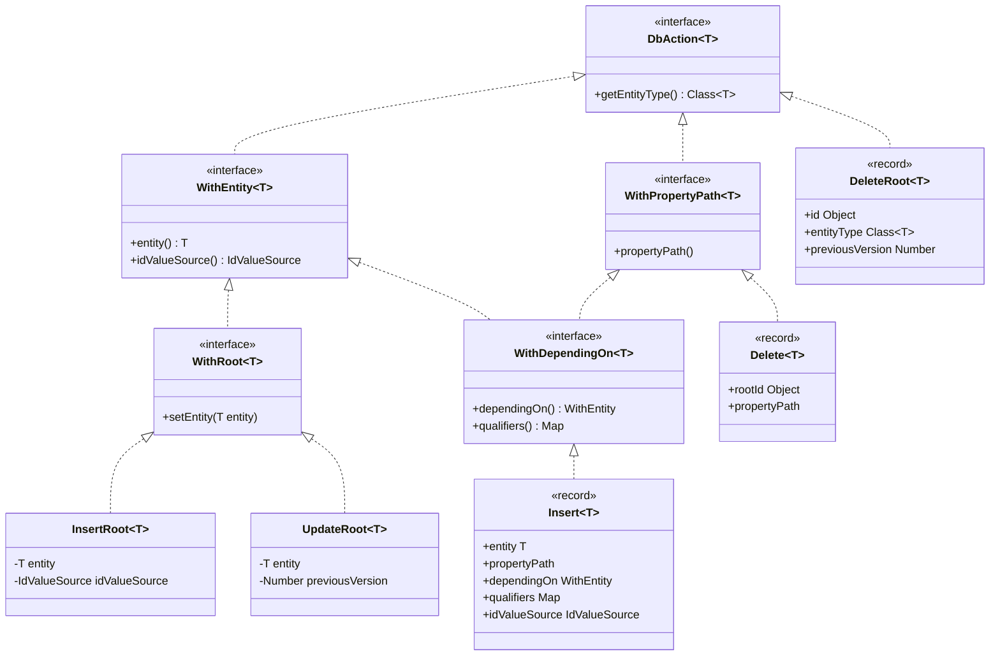
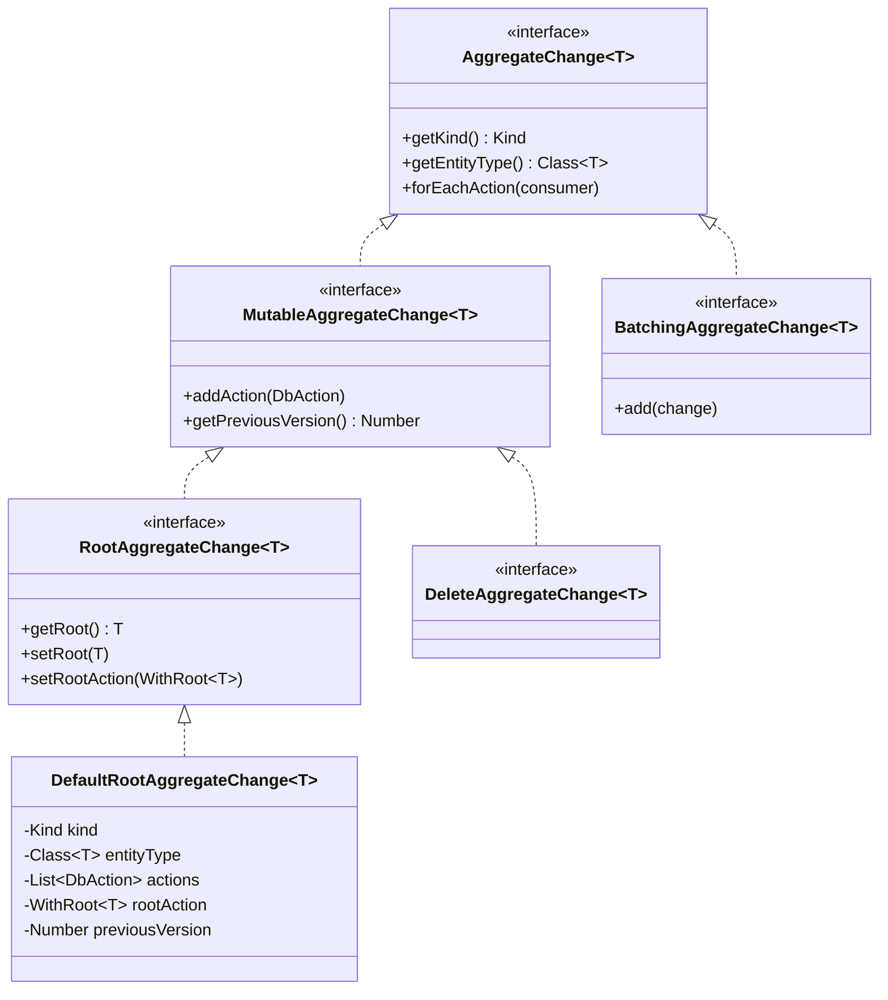

# Aggregate Change 추적과 DbAction

Spring Data JDBC는 Aggregate의 상태 변경을 `DbAction` 객체의 리스트로 변환한다. `WritingContext`가 Aggregate 트리를 순회하며 `DbAction` 계층 구조를 생성하고, `AggregateChange`가 이를 묶어서 실행 엔진에 전달하는 과정을 분석한다.

## 목차
- [1. 핵심 개념 (What)](#1-핵심-개념-what)
- [2. 왜 알아야 하는가 (Why)](#2-왜-알아야-하는가-why)
- [3. 내부 구현 분석 (How)](#3-내부-구현-분석-how)
- [4. 실전 예제](#4-실전-예제)
- [5. 정리](#5-정리)

---

## 1. 핵심 개념 (What)

Spring Data JDBC에서 `save()`, `delete()` 호출 시 내부적으로 일어나는 일:

1. **도메인 객체 분석**: `WritingContext`가 Aggregate Root와 자식 엔티티를 순회
2. **DbAction 생성**: 각 엔티티에 대해 INSERT, UPDATE, DELETE 등의 `DbAction` 생성
3. **AggregateChange 조립**: 생성된 `DbAction`들을 `AggregateChange`에 순서대로 추가
4. **실행**: `AggregateChangeExecutor`가 `DbAction`들을 순서대로 실행

| 구성 요소 | 패키지 | 역할 |
|-----------|--------|------|
| `DbAction` | `relational.core.conversion` | 단일 DB 작업 표현 (Insert, Update, Delete 등) |
| `WritingContext` | `relational.core.conversion` | Aggregate 트리 순회 + DbAction 생성 |
| `AggregateChange` | `relational.core.conversion` | DbAction들의 컨테이너 (실행 단위) |
| `RootAggregateChange` | `relational.core.conversion` | Root 엔티티를 포함하는 AggregateChange |
| `RelationalEntityInsertWriter` | `relational.core.conversion` | Insert용 WritingContext 호출 |
| `RelationalEntityUpdateWriter` | `relational.core.conversion` | Update용 WritingContext 호출 |
| `RelationalEntityDeleteWriter` | `relational.core.conversion` | Delete용 DbAction 생성 |

## 2. 왜 알아야 하는가 (Why)

1. **성능 튜닝**: Aggregate가 크면 Update 시 생성되는 `DbAction` 수가 급증한다. 어떤 액션이 생성되는지 알아야 최적화 방향을 잡을 수 있다.
2. **디버깅**: "왜 이 DELETE가 실행되었지?"라는 질문에 답하려면 `WritingContext`의 동작을 이해해야 한다.
3. **이벤트/콜백 활용**: `BeforeSaveEvent`, `AfterSaveEvent`에서 전달되는 `AggregateChange`의 구조를 이해해야 의미 있는 이벤트 처리가 가능하다.
4. **배치 최적화**: `BatchInsert`, `BatchDelete` 같은 배치 액션이 어떻게 생성되는지 알아야 한다.

## 3. 내부 구현 분석 (How)

### 3.1 DbAction 계층 구조



### 3.2 DbAction 유형 상세

| DbAction 타입 | 대상 | 설명 |
|---------------|------|------|
| `InsertRoot<T>` | Aggregate Root | Root INSERT. ID 자동 생성 지원 |
| `UpdateRoot<T>` | Aggregate Root | Root UPDATE. Optimistic Locking 지원 |
| `Insert<T>` | 자식 엔티티 | 자식 INSERT. `dependingOn`으로 부모 참조 |
| `Delete<T>` | 자식 엔티티 | 자식 DELETE. Root ID + property path로 식별 |
| `DeleteRoot<T>` | Aggregate Root | Root DELETE. 버전 체크 가능 |
| `DeleteAll<T>` | 자식 엔티티 전체 | 특정 경로의 모든 자식 삭제 |
| `DeleteAllRoot<T>` | Root 전체 | 해당 타입의 모든 Root 삭제 |
| `BatchInsert<T>` | 자식 엔티티 배치 | 여러 Insert를 하나로 묶음 |
| `BatchInsertRoot<T>` | Root 배치 | 여러 InsertRoot를 하나로 묶음 |
| `BatchDelete<T>` | 자식 삭제 배치 | 여러 Delete를 하나로 묶음 |
| `BatchDeleteRoot<T>` | Root 삭제 배치 | 여러 DeleteRoot를 하나로 묶음 |
| `AcquireLockRoot<T>` | Root 단건 락 | Pessimistic Write Lock 획득 |
| `AcquireLockAllRoot<T>` | Root 전체 락 | 전체 Row Lock 획득 |

### 3.3 IdValueSource - ID 값의 출처

`IdValueSource`는 ID가 어디서 오는지 나타내는 열거형이다:

```java
public enum IdValueSource {
    PROVIDED,   // 애플리케이션이 ID를 제공
    GENERATED,  // DB가 ID를 자동 생성 (AUTO_INCREMENT)
    NONE;       // ID 프로퍼티가 없음

    public static <T> IdValueSource forInstance(Object instance,
            RelationalPersistentEntity<T> persistentEntity) {

        RelationalPersistentProperty idProperty = persistentEntity.getIdProperty();

        // @Sequence가 있으면 PROVIDED
        if (idProperty != null && idProperty.hasSequence()) {
            return IdValueSource.PROVIDED;
        }

        Object idValue = persistentEntity.getIdentifierAccessor(instance)
            .getIdentifier();

        if (idProperty == null) return IdValueSource.NONE;

        // ID 값이 설정되어 있으면 PROVIDED, 아니면 GENERATED
        boolean idPropertyValueIsSet = idValue != null
            && (idProperty.getType() != int.class || !idValue.equals(0))
            && (idProperty.getType() != long.class || !idValue.equals(0L));

        return idPropertyValueIsSet ? PROVIDED : GENERATED;
    }
}
```

### 3.4 WritingContext - Aggregate 분석 엔진

`WritingContext`는 Aggregate 트리를 순회하며 `DbAction`을 생성하는 핵심 클래스이다.

```java
class WritingContext<T> {
    private final RelationalMappingContext context;
    private final T root;
    private final List<PersistentPropertyPath<RelationalPersistentProperty>> paths;
    private final Map<PathNode, DbAction<?>> previousActions;
    private final IdValueSource rootIdValueSource;
    private final RootAggregateChange<T> aggregateChange;
}
```

**핵심 필드 설명:**
- `paths`: Root에서 모든 관계(relation) 프로퍼티까지의 경로 목록
- `previousActions`: 이미 생성된 DbAction을 PathNode로 매핑 (부모 참조용)
- `rootIdValueSource`: Root의 ID가 PROVIDED인지 GENERATED인지

#### save() 분기 로직

```
WritingContext.save()
  |
  +-- isNew(root)?
  |     |
  |     +-- YES: insert()
  |     |     +-- setRootAction(InsertRoot)
  |     |     +-- insertReferenced()  // 자식들 insert
  |     |
  |     +-- NO: update()
  |           +-- setRootAction(UpdateRoot)
  |           +-- deleteReferenced()  // 자식들 먼저 삭제
  |           +-- insertReferenced()  // 자식들 재삽입
```

#### insertReferenced() 상세

```java
// WritingContext.insertAll() - 특정 경로의 모든 엔티티에 대해 Insert 생성
private List<? extends DbAction<?>> insertAll(
        PersistentPropertyPath<RelationalPersistentProperty> path) {

    List<DbAction.Insert<Object>> inserts = new ArrayList<>();

    from(path).forEach(node -> {
        DbAction.WithEntity<?> parentAction = getAction(node.parent());

        Map<...> qualifiers = new HashMap<>();
        Object instance;

        if (node.path().getLeafProperty().isQualified()) {
            // Map이나 List인 경우 qualifier(키/인덱스) 추출
            Pair<Object, Object> value = (Pair) node.value();
            qualifiers.put(node.path(), value.getFirst());
            instance = value.getSecond();
        } else {
            instance = node.value();
        }

        IdValueSource idValueSource = IdValueSource.forInstance(instance,
            persistentEntity);
        DbAction.Insert<Object> insert = new DbAction.Insert<>(
            instance, path, parentAction, qualifiers, idValueSource);
        inserts.add(insert);
        previousActions.put(node, insert);  // 자식의 자식이 부모를 찾을 수 있도록
    });

    return inserts;
}
```

#### PathNode와 트리 순회

`WritingContext`는 `PathNode`를 사용하여 Aggregate 트리를 표현한다:

```java
// from() - 특정 경로에 대한 PathNode 목록 생성
private List<PathNode> from(PersistentPropertyPath path) {
    List<PathNode> nodes = new ArrayList<>();

    if (isDirectlyReferencedByRootIgnoringEmbeddables(path)) {
        // Root 직접 참조: Root에서 값 추출
        Object value = getFromRootValue(path);
        nodes.addAll(createNodes(path, null, value));
    } else {
        // 간접 참조: 부모 PathNode에서 값 추출
        List<PathNode> pathNodes = nodesCache.get(path.getParentPath());
        pathNodes.forEach(parentNode -> {
            Object value = path.getLeafProperty().getOwner()
                .getPropertyAccessor(parentNode.getActualValue())
                .getProperty(path.getLeafProperty());
            nodes.addAll(createNodes(path, parentNode, value));
        });
    }

    nodesCache.put(path, nodes);  // 캐싱
    return nodes;
}
```

`createNodes()`는 프로퍼티 타입에 따라 PathNode를 생성한다:
- **Map**: 각 엔트리에 대해 `Pair.of(key, value)` 형태의 PathNode
- **List**: 각 요소에 대해 `Pair.of(index, element)` 형태의 PathNode
- **Set/Collection**: 각 요소에 대해 단순 PathNode
- **단일 엔티티**: 하나의 PathNode

### 3.5 AggregateChange 계층



`DefaultRootAggregateChange`는 `rootAction`을 별도로 관리하며, `forEachAction()`에서 rootAction을 먼저 소비한 후 나머지 actions를 순서대로 소비한다:

```java
// DefaultRootAggregateChange.forEachAction()
public void forEachAction(Consumer<? super DbAction<?>> consumer) {
    consumer.accept(rootAction);  // Root 액션 먼저
    actions.forEach(consumer);    // 자식 액션들 순서대로
}
```

### 3.6 RelationalEntityInsertWriter / UpdateWriter / DeleteWriter

이 Writer 클래스들은 `WritingContext`의 진입점 역할을 한다:

```java
// RelationalEntityInsertWriter
public void write(T root, RootAggregateChange<T> aggregateChange) {
    new WritingContext<>(context, root, aggregateChange).insert();
}

// RelationalEntityUpdateWriter
public void write(T root, RootAggregateChange<T> aggregateChange) {
    new WritingContext<>(context, root, aggregateChange).update();
}
```

`RelationalEntityDeleteWriter`는 `WritingContext`를 사용하지 않고, 직접 경로를 순회하며 `Delete` 액션을 생성한다:

```java
// RelationalEntityDeleteWriter.write()
public void write(Object id, MutableAggregateChange<?> aggregateChange) {
    if (id == null) {
        deleteAll(aggregateChange.getEntityType()).forEach(aggregateChange::addAction);
    } else {
        deleteRoot(id, aggregateChange).forEach(aggregateChange::addAction);
    }
}
```

Delete 시 Lock 획득 순서:
1. `AcquireLockRoot` (참조 엔티티가 있을 때만)
2. `Delete` (자식 엔티티들, 역순으로)
3. `DeleteRoot` (Root 마지막에 삭제)

## 4. 실전 예제

### 4.1 Insert 시 생성되는 DbAction 추적

```java
public record Order(
    @Id Long id,
    String description,
    List<OrderItem> items
) {}

public record OrderItem(@Id Long id, String product, int quantity) {}

// 새 주문 저장
Order order = new Order(null, "신규 주문", List.of(
    new OrderItem(null, "상품A", 2),
    new OrderItem(null, "상품B", 1)
));
orderRepository.save(order);
```

생성되는 DbAction 순서:

```
1. InsertRoot<Order>(entity=Order{id=null, ...}, idValueSource=GENERATED)
2. Insert<OrderItem>(entity=OrderItem{product=상품A}, dependingOn=InsertRoot,
                     qualifiers={items -> 0}, idValueSource=GENERATED)
3. Insert<OrderItem>(entity=OrderItem{product=상품B}, dependingOn=InsertRoot,
                     qualifiers={items -> 1}, idValueSource=GENERATED)
```

### 4.2 Update 시 생성되는 DbAction 추적

```java
// 기존 주문 수정
Order existing = orderRepository.findById(1L).orElseThrow();
Order updated = new Order(existing.id(), "수정된 주문",
    List.of(new OrderItem(null, "상품C", 3)));  // items 변경
orderRepository.save(updated);
```

생성되는 DbAction 순서:

```
1. UpdateRoot<Order>(entity=Order{id=1, ...})
2. Delete<OrderItem>(rootId=1, propertyPath=items)     // 기존 items 삭제
3. Insert<OrderItem>(entity=OrderItem{product=상품C},   // 새 items 삽입
                     dependingOn=UpdateRoot,
                     qualifiers={items -> 0}, idValueSource=GENERATED)
```

### 4.3 이벤트 리스너에서 AggregateChange 활용

```java
@Component
public class OrderAuditListener {

    @EventListener
    public void onBeforeSave(BeforeSaveEvent<Order> event) {
        AggregateChange<Order> change = event.getAggregateChange();

        change.forEachAction(action -> {
            if (action instanceof DbAction.InsertRoot<?> insert) {
                log.info("Root INSERT: {}", insert.entity());
            } else if (action instanceof DbAction.UpdateRoot<?> update) {
                log.info("Root UPDATE: {}", update.entity());
            } else if (action instanceof DbAction.Delete<?> delete) {
                log.info("Child DELETE: rootId={}, path={}",
                    delete.rootId(), delete.propertyPath());
            } else if (action instanceof DbAction.Insert<?> insert) {
                log.info("Child INSERT: entity={}, idSource={}",
                    insert.entity(), insert.idValueSource());
            }
        });
    }
}
```

## 5. 정리

| 구성 요소 | 역할 | 핵심 메서드 |
|-----------|------|------------|
| `WritingContext` | Aggregate 트리 분석 + DbAction 생성 | `save()`, `insert()`, `update()` |
| `DbAction` | 단일 DB 작업의 추상화 | `InsertRoot`, `UpdateRoot`, `Insert`, `Delete`, `DeleteRoot` |
| `IdValueSource` | ID 생성 전략 판별 | `forInstance()` -> `PROVIDED` / `GENERATED` / `NONE` |
| `AggregateChange` | DbAction 컨테이너 | `forEachAction()`, `addAction()` |
| `RootAggregateChange` | Root 포함 AggregateChange | `getRoot()`, `setRootAction()` |
| `RelationalEntityInsertWriter` | Insert WritingContext 실행 | `write()` -> `WritingContext.insert()` |
| `RelationalEntityUpdateWriter` | Update WritingContext 실행 | `write()` -> `WritingContext.update()` |
| `RelationalEntityDeleteWriter` | Delete DbAction 직접 생성 | `write()` -> `AcquireLock` + `Delete` + `DeleteRoot` |

핵심 실행 순서:
- **Insert**: `InsertRoot` -> `Insert` (깊이 우선, 자식 순서대로)
- **Update**: `UpdateRoot` -> `Delete` (자식 전부) -> `Insert` (자식 전부)
- **Delete**: `AcquireLockRoot` -> `Delete` (자식 역순) -> `DeleteRoot`

---
*참고: Spring Data JDBC 3.x / Spring Boot 3.x 기준*
