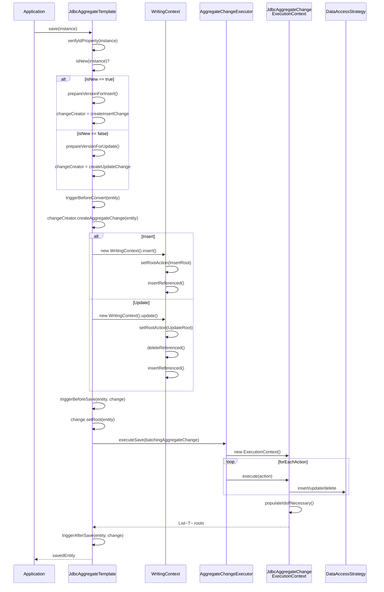
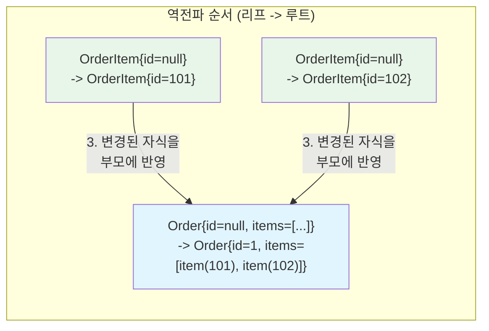

# Save 플로우 내부 구현

`JdbcAggregateTemplate.save()`를 호출하면 내부에서 isNew 판별, 이벤트/콜백 발행, AggregateChange 생성, DbAction 실행, ID 역전파까지의 전체 파이프라인이 동작한다. 이 문서에서는 save 한 건의 전체 흐름을 소스코드 레벨에서 추적한다.

## 목차
- [1. 핵심 개념 (What)](#1-핵심-개념-what)
- [2. 왜 알아야 하는가 (Why)](#2-왜-알아야-하는가-why)
- [3. 내부 구현 분석 (How)](#3-내부-구현-분석-how)
- [4. 실전 예제](#4-실전-예제)
- [5. 정리](#5-정리)

---

## 1. 핵심 개념 (What)

`JdbcAggregateTemplate.save(instance)` 한 번의 호출로 다음이 모두 처리된다:

1. **isNew() 판별** -> Insert 또는 Update 결정
2. **Version 준비** -> Optimistic Locking 지원
3. **BeforeConvert 이벤트/콜백** 발행
4. **AggregateChange 생성** -> `WritingContext`가 DbAction 리스트 생성
5. **BeforeSave 이벤트/콜백** 발행
6. **DbAction 실행** -> `AggregateChangeExecutor` -> `DataAccessStrategy`
7. **ID 역전파** -> DB 생성 ID를 엔티티 트리에 전파
8. **AfterSave 이벤트/콜백** 발행

| 핵심 클래스 | 패키지 | 역할 |
|------------|--------|------|
| `JdbcAggregateTemplate` | `jdbc.core` | save 진입점, 이벤트/콜백 관리 |
| `AggregateChangeExecutor` | `jdbc.core` | AggregateChange -> DataAccessStrategy 실행 |
| `JdbcAggregateChangeExecutionContext` | `jdbc.core` | 실행 결과 보관 + ID 역전파 |
| `DataAccessStrategy` | `jdbc.core.convert` | 실제 SQL 실행 인터페이스 |
| `InsertStrategyFactory` | `jdbc.core.convert` | ID 생성 여부에 따른 Insert 전략 선택 |

## 2. 왜 알아야 하는가 (Why)

1. **트러블슈팅**: "ID가 왜 null이지?", "왜 Update 대신 Insert가 실행되지?"를 추적하려면 전체 플로우를 알아야 한다.
2. **콜백 타이밍**: `BeforeConvertCallback`에서 값을 설정하면 AggregateChange에 반영되고, `BeforeSaveCallback`에서 설정하면 `setRoot()`로 반영된다.
3. **ID 역전파 이해**: DB 자동 생성 ID가 Root -> 자식 -> 손자 엔티티로 어떻게 전파되는지 알아야 불변 객체에서의 동작을 예측할 수 있다.
4. **배치 처리**: `saveAll()`이 내부적으로 `BatchingAggregateChange`를 사용하여 배치 INSERT를 수행하는 방식을 이해할 수 있다.

## 3. 내부 구현 분석 (How)

### 3.1 전체 Save 흐름 시퀀스



### 3.2 JdbcAggregateTemplate.save() 진입점

```java
// JdbcAggregateTemplate.save()
public <T> T save(T instance) {
    Assert.notNull(instance, "Aggregate instance must not be null");
    verifyIdProperty(instance);
    return performSave(new EntityAndChangeCreator<>(instance,
        changeCreatorSelectorForSave(instance)));
}
```

#### isNew 판별과 Change Creator 선택

```java
// changeCreatorSelectorForSave - isNew에 따라 Insert/Update 분기
private <T> AggregateChangeCreator<T> changeCreatorSelectorForSave(T instance) {
    return context.getRequiredPersistentEntity(instance.getClass()).isNew(instance)
        ? entity -> createInsertChange(prepareVersionForInsert(entity))
        : entity -> createUpdateChange(prepareVersionForUpdate(entity));
}
```

isNew 판별은 `RelationalPersistentEntity.isNew()` 내부에서 `@Id` 프로퍼티 값으로 결정한다:
- `@Id Long id` -> `id == null`이면 새 엔티티
- `@Id long id` -> `id == 0L`이면 새 엔티티

#### Version 준비

```java
// Insert: 초기 버전 설정
private <T> T prepareVersionForInsert(T instance) {
    if (persistentEntity.hasVersionProperty()) {
        RelationalPersistentProperty versionProperty =
            persistentEntity.getRequiredVersionProperty();
        // 원시 타입이면 1, 래퍼 타입이면 0으로 시작
        long initialVersion = versionProperty.getActualType().isPrimitive() ? 1L : 0;
        return RelationalEntityVersionUtils.setVersionNumberOnEntity(
            instance, initialVersion, persistentEntity, converter);
    }
    return instance;
}

// Update: 버전 증가
private <T> EntityAndPreviousVersion<T> prepareVersionForUpdate(T instance) {
    if (persistentEntity.hasVersionProperty()) {
        Number previousVersion = RelationalEntityVersionUtils
            .getVersionNumberFromEntity(instance, persistentEntity, converter);
        long newVersion = (previousVersion == null ? 0 : previousVersion.longValue()) + 1;
        T prepared = RelationalEntityVersionUtils.setVersionNumberOnEntity(
            instance, newVersion, persistentEntity, converter);
        return new EntityAndPreviousVersion<>(prepared, previousVersion);
    }
    return new EntityAndPreviousVersion<>(instance, null);
}
```

### 3.3 performSave - 이벤트/콜백과 실행

```java
private <T> T performSave(EntityAndChangeCreator<T> instance) {

    BatchingAggregateChange<T, RootAggregateChange<T>> batchingAggregateChange =
        BatchingAggregateChange.forSave(ClassUtils.getUserClass(instance.entity));

    // 1. beforeExecute: BeforeConvert -> AggregateChange 생성 -> BeforeSave
    batchingAggregateChange.add(beforeExecute(instance));

    // 2. executeSave: DbAction 실행 + ID 역전파
    Iterator<T> afterExecutionIterator =
        executor.executeSave(batchingAggregateChange).iterator();

    // 3. afterExecute: AfterSave 이벤트/콜백
    return afterExecute(batchingAggregateChange, afterExecutionIterator.next());
}
```

#### beforeExecute 상세

```java
private <T> RootAggregateChange<T> beforeExecute(EntityAndChangeCreator<T> instance) {
    // (1) BeforeConvert 이벤트 + 콜백
    T aggregateRoot = triggerBeforeConvert(instance.entity);

    // (2) AggregateChange 생성 (WritingContext 동작)
    RootAggregateChange<T> change =
        instance.changeCreator.createAggregateChange(aggregateRoot);

    // (3) BeforeSave 이벤트 + 콜백 (여기서 엔티티 수정 가능)
    aggregateRoot = triggerBeforeSave(change.getRoot(), change);

    // (4) 수정된 엔티티를 change에 반영
    change.setRoot(aggregateRoot);

    return change;
}
```

### 3.4 AggregateChangeExecutor - 실행 엔진

```java
// AggregateChangeExecutor.executeSave()
<T> List<T> executeSave(AggregateChange<T> aggregateChange) {
    JdbcAggregateChangeExecutionContext executionContext =
        new JdbcAggregateChangeExecutionContext(converter, accessStrategy);

    // 모든 DbAction을 순서대로 실행
    aggregateChange.forEachAction(action -> execute(action, executionContext));

    // ID 역전파 수행
    return executionContext.populateIdsIfNecessary();
}
```

`execute()`는 DbAction 타입에 따라 분기한다:

```java
private void execute(DbAction<?> action,
        JdbcAggregateChangeExecutionContext executionContext) {

    if (action instanceof DbAction.InsertRoot<?> insertRoot) {
        executionContext.executeInsertRoot(insertRoot);
    } else if (action instanceof DbAction.Insert<?> insert) {
        executionContext.executeInsert(insert);
    } else if (action instanceof DbAction.UpdateRoot<?> updateRoot) {
        executionContext.executeUpdateRoot(updateRoot);
    } else if (action instanceof DbAction.Delete<?> delete) {
        executionContext.executeDelete(delete);
    } else if (action instanceof DbAction.DeleteRoot<?> deleteRoot) {
        executionContext.executeDeleteRoot(deleteRoot);
    }
    // ... BatchInsert, BatchDelete 등
}
```

### 3.5 JdbcAggregateChangeExecutionContext - 실행과 ID 관리

#### InsertRoot 실행

```java
<T> void executeInsertRoot(DbAction.InsertRoot<T> insert) {
    // DataAccessStrategy에 INSERT 위임, 생성된 ID 반환
    Object id = accessStrategy.insert(
        insert.entity(),
        insert.getEntityType(),
        Identifier.empty(),
        insert.idValueSource()
    );
    // 결과 저장 (나중에 ID 역전파에 사용)
    add(new DbActionExecutionResult(insert, id));
}
```

#### 자식 Insert 실행 - FK 설정

```java
<T> void executeInsert(DbAction.Insert<T> insert) {
    // 부모 키를 Identifier에 포함
    Identifier parentKeys = getParentKeys(insert, converter);

    Object id = accessStrategy.insert(
        insert.entity(),
        insert.getEntityType(),
        parentKeys,        // FK 값이 여기에 포함됨
        insert.idValueSource()
    );
    add(new DbActionExecutionResult(insert, id));
}
```

`getParentKeys()`는 부모 엔티티의 ID(생성된 ID 포함)를 FK로 변환한다:

```java
private Identifier getParentKeys(DbAction.WithDependingOn<?> action,
        JdbcConverter converter) {

    Object id = getParentId(action);  // 부모의 생성된 ID 조회

    AggregatePath aggregatePath = context.getAggregatePath(action.propertyPath());
    JdbcIdentifierBuilder identifier = JdbcIdentifierBuilder
        .forBackReferences(converter, aggregatePath, getIdMapper(id, ...));

    // qualifier(List index, Map key) 추가
    for (var qualifier : action.qualifiers().entrySet()) {
        identifier = identifier.withQualifier(
            context.getAggregatePath(qualifier.getKey()), qualifier.getValue());
    }

    return identifier.build();
}
```

#### 부모 ID 조회 - 생성된 ID 우선

```java
private Object getPotentiallyGeneratedIdFrom(DbAction.WithEntity<?> idOwningAction) {
    if (IdValueSource.GENERATED.equals(idOwningAction.idValueSource())) {
        // DB가 생성한 ID를 results에서 조회
        DbActionExecutionResult result = results.get(idOwningAction);
        Object generatedId = result.getGeneratedId();
        if (generatedId != null) {
            return generatedId;  // 생성된 ID 사용
        }
    }
    // 생성된 ID가 없으면 엔티티에서 직접 추출
    return getIdFrom(idOwningAction);
}
```

### 3.6 ID 역전파 - populateIdsIfNecessary()

DB 자동 생성 ID를 엔티티 트리에 역방향으로 전파하는 과정이다. 불변 객체(record)의 경우 새 인스턴스를 생성해야 하므로 **리프부터 루트 방향**으로 처리한다.



```java
// JdbcAggregateChangeExecutionContext.populateIdsIfNecessary()
<T> List<T> populateIdsIfNecessary() {
    // 결과를 역순으로 (리프 먼저)
    List<DbActionExecutionResult> reverseResults = new ArrayList<>(results.values());
    Collections.reverse(reverseResults);

    StagedValues cascadingValues = new StagedValues();
    List<T> roots = new ArrayList<>();

    for (DbActionExecutionResult result : reverseResults) {
        DbAction.WithEntity<?> action = result.getAction();

        // (1) ID 설정 + cascading 프로퍼티 업데이트
        Object newEntity = setIdAndCascadingProperties(
            action, result.getGeneratedId(), cascadingValues);

        // (2) Root이면 결과 리스트에 추가
        if (action instanceof DbAction.InsertRoot
                || action instanceof DbAction.UpdateRoot) {
            roots.add((T) newEntity);
        }

        // (3) 불변 객체가 변경되었으면 부모에 전파
        if (action instanceof DbAction.Insert<?> insert) {
            if (newEntity != action.entity()) {
                // 새 인스턴스가 생성됨 -> 부모가 알아야 함
                cascadingValues.stage(insert.dependingOn(),
                    insert.propertyPath(), qualifierValue, newEntity);
            }
        }
    }
    return roots;
}
```

#### setIdAndCascadingProperties - ID 설정 + 자식 변경 반영

```java
private Object setIdAndCascadingProperties(DbAction.WithEntity<S> action,
        Object generatedId, StagedValues cascadingValues) {

    S originalEntity = action.entity();
    RelationalPersistentEntity<S> persistentEntity = ...;
    PersistentPropertyPathAccessor<S> propertyAccessor =
        converter.getPropertyAccessor(persistentEntity, originalEntity);

    // (1) DB 생성 ID 설정
    if (IdValueSource.GENERATED.equals(action.idValueSource())) {
        propertyAccessor.setProperty(
            persistentEntity.getRequiredIdProperty(), generatedId);
    }

    // (2) 변경된 자식 엔티티 반영 (불변 객체 지원)
    cascadingValues.forEachPath(action,
        (path, value) -> propertyAccessor.setProperty(
            getRelativePath(action, path), value));

    return propertyAccessor.getBean();  // 새 인스턴스 반환 (record인 경우)
}
```

### 3.7 InsertStrategyFactory - Insert 전략 선택

`DataAccessStrategy` 내부에서 `InsertStrategyFactory`가 ID 생성 여부에 따라 다른 전략을 선택한다:

```java
// InsertStrategyFactory
InsertStrategy insertStrategy(IdValueSource idValueSource, SqlIdentifier idColumn) {
    if (IdValueSource.GENERATED.equals(idValueSource)) {
        return new IdGeneratingInsertStrategy(dialect, jdbcOperations, idColumn);
    }
    return new DefaultInsertStrategy(jdbcOperations);
}
```

| 전략 | IdValueSource | 동작 |
|------|--------------|------|
| `DefaultInsertStrategy` | `PROVIDED` | 단순 `jdbcOperations.update(sql, params)`. ID 미반환 |
| `IdGeneratingInsertStrategy` | `GENERATED` | `KeyHolder` 사용. DB 생성 ID 반환 |
| `DefaultBatchInsertStrategy` | `PROVIDED` (배치) | `jdbcOperations.batchUpdate()` |
| `IdGeneratingBatchInsertStrategy` | `GENERATED` (배치) | 개별 insert + ID 수집 또는 batch + generated keys |

## 4. 실전 예제

### 4.1 Insert 전체 흐름 추적

```java
// 도메인 모델
public record Order(
    @Id Long id,
    String description,
    @Version Long version,
    List<OrderItem> items
) {}

public record OrderItem(@Id Long id, String product, int qty) {}

// 실행
Order order = new Order(null, "테스트", null,
    List.of(new OrderItem(null, "A", 1), new OrderItem(null, "B", 2)));
Order saved = orderRepository.save(order);
```

내부 실행 단계:

```
1. isNew(order) == true  (id == null)
2. prepareVersionForInsert -> Order{id=null, version=0, ...}
3. triggerBeforeConvert -> BeforeConvertEvent 발행
4. createInsertChange:
   - WritingContext.insert()
   - DbAction: InsertRoot(Order, GENERATED)
              Insert(OrderItem-A, dependsOn=InsertRoot, qualifiers={items->0})
              Insert(OrderItem-B, dependsOn=InsertRoot, qualifiers={items->1})
5. triggerBeforeSave -> BeforeSaveEvent 발행
6. executeSave:
   - executeInsertRoot(Order) -> SQL: INSERT INTO order (...) -> id=1
   - executeInsert(OrderItem-A) -> parentKeys={order=1, order_key=0}
                                -> SQL: INSERT INTO order_item (...) -> id=101
   - executeInsert(OrderItem-B) -> parentKeys={order=1, order_key=1}
                                -> SQL: INSERT INTO order_item (...) -> id=102
7. populateIdsIfNecessary:
   - OrderItem-B: setId(102) -> new OrderItem(102, "B", 2)
   - OrderItem-A: setId(101) -> new OrderItem(101, "A", 1)
   - Order: setId(1) + items=[item(101), item(102)]
          -> new Order(1, "테스트", 0, [item(101), item(102)])
8. triggerAfterSave -> AfterSaveEvent 발행
9. return Order{id=1, version=0, items=[OrderItem{id=101}, OrderItem{id=102}]}
```

### 4.2 BeforeConvertCallback으로 생성 시간 설정

```java
@Component
public class AuditingCallback implements BeforeConvertCallback<Order> {

    @Override
    public Order onBeforeConvert(Order aggregate) {
        if (aggregate.id() == null) {
            // Insert 시에만 생성 시간 설정
            return new Order(null, aggregate.description(),
                aggregate.version(), aggregate.items(),
                LocalDateTime.now());  // createdAt 설정
        }
        return aggregate;
    }
}
```

이 콜백은 `triggerBeforeConvert()` 단계에서 호출되므로, 이후 `createInsertChange()`에서 수정된 엔티티가 사용된다.

### 4.3 Optimistic Locking 실패 처리

```java
@Version Long version;

// 동시 수정 시나리오
Order order1 = orderRepository.findById(1L).orElseThrow(); // version=0
Order order2 = orderRepository.findById(1L).orElseThrow(); // version=0

orderRepository.save(order1); // version 0->1 성공
orderRepository.save(order2); // version 0->1 실패!
// -> OptimisticLockingFailureException

// 내부 동작:
// prepareVersionForUpdate: previousVersion=0, newVersion=1
// executeUpdateRoot:
//   -> accessStrategy.updateWithVersion(entity, type, previousVersion=0)
//   -> SQL: UPDATE order SET ... WHERE id=? AND version=0
//   -> 영향받은 행 = 0 (이미 version=1)
//   -> OptimisticLockingFailureException 발생
```

## 5. 정리

| 단계 | 클래스/메서드 | 동작 |
|------|-------------|------|
| 1. 진입 | `JdbcAggregateTemplate.save()` | ID 프로퍼티 확인, isNew 판별 |
| 2. 버전 준비 | `prepareVersionForInsert/Update()` | @Version 초기화 또는 증가 |
| 3. BeforeConvert | `triggerBeforeConvert()` | 이벤트 발행 + 콜백 실행 |
| 4. Change 생성 | `WritingContext.insert/update()` | DbAction 리스트 생성 |
| 5. BeforeSave | `triggerBeforeSave()` | 이벤트 발행 + 콜백 실행, `setRoot()` |
| 6. 실행 | `AggregateChangeExecutor.executeSave()` | forEachAction으로 순서대로 실행 |
| 7. ID 역전파 | `populateIdsIfNecessary()` | 리프->루트 방향 ID 전파 (불변 지원) |
| 8. AfterSave | `triggerAfterSave()` | 이벤트 발행 + 콜백 실행 |

핵심 설계 포인트:
- **isNew() 기준**: `@Id` == null (또는 원시 타입 0)이면 Insert, 아니면 Update
- **FK 처리**: 자식 Insert 시 `getParentKeys()`로 부모 생성 ID를 FK에 포함
- **ID 역전파**: 결과를 역순으로 처리하여 리프 -> 루트 방향으로 불변 객체 재생성
- **Insert 전략**: `GENERATED`면 `KeyHolder` 사용, `PROVIDED`면 단순 update
- **Optimistic Locking**: `@Version` + `updateWithVersion()` + 행 수 체크

---
*참고: Spring Data JDBC 3.x / Spring Boot 3.x 기준*
