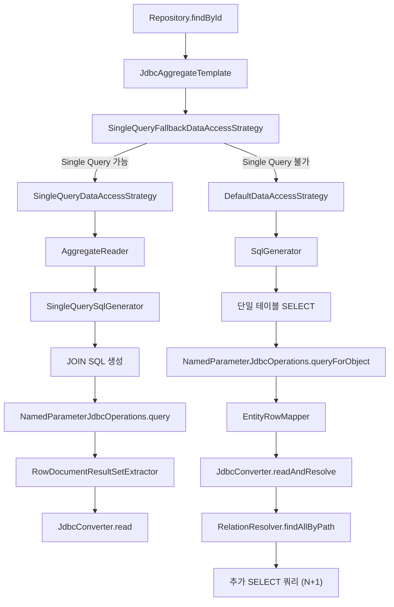
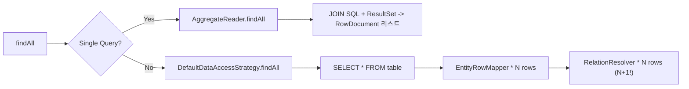

# Find/Query 플로우 내부 구현

Spring Data JDBC에서 엔티티를 조회할 때 내부적으로 SQL 생성, 쿼리 실행, ResultSet 매핑, 연관 엔티티 해석이 어떤 순서로 일어나는지 소스코드 수준에서 분석한다.

## 목차
- [1. 핵심 개념 (What)](#1-핵심-개념-what)
- [2. 왜 알아야 하는가 (Why)](#2-왜-알아야-하는가-why)
- [3. 내부 구현 분석 (How)](#3-내부-구현-분석-how)
- [4. 실전 예제](#4-실전-예제)
- [5. 정리](#5-정리)

---

## 1. 핵심 개념 (What)

Spring Data JDBC의 조회 플로우는 크게 두 가지 전략으로 나뉜다.

- **DefaultDataAccessStrategy**: 루트 엔티티를 먼저 조회한 뒤, 연관 엔티티를 별도 쿼리로 조회하는 N+1 방식
- **SingleQueryDataAccessStrategy**: JOIN을 사용하여 하나의 SQL로 Aggregate 전체를 로드하는 Single Query Loading 방식

두 전략은 `ReadingDataAccessStrategy` 인터페이스를 공유하며, `SingleQueryFallbackDataAccessStrategy`가 조건에 따라 적절한 전략을 자동 선택한다.

### 핵심 클래스

| 클래스 | 역할 |
|--------|------|
| `DataAccessStrategy` | 읽기/쓰기 통합 인터페이스 |
| `DefaultDataAccessStrategy` | N+1 기반 기본 구현 |
| `SingleQueryDataAccessStrategy` | Single Query Loading 구현 |
| `SingleQueryFallbackDataAccessStrategy` | 전략 자동 선택 |
| `EntityRowMapper` | ResultSet -> 엔티티 변환 |
| `AggregateReader` | Single Query에서 Aggregate 재구성 |
| `RelationResolver` | 연관 엔티티 지연 로딩 |
| `MappingJdbcConverter` | 타입 변환 및 엔티티 매핑 |

## 2. 왜 알아야 하는가 (Why)

- **N+1 문제 인식**: 기본 전략이 연관 엔티티마다 추가 쿼리를 실행하므로, 성능 병목의 원인을 이해해야 한다
- **Single Query Loading 활성화 조건**: 어떤 경우에 자동 최적화가 적용되는지 알아야 올바른 도메인 설계를 할 수 있다
- **커스텀 RowMapper**: `QueryMappingConfiguration`을 통해 특정 도메인 타입에 커스텀 매핑을 적용하려면 내부 플로우를 이해해야 한다
- **디버깅**: 조회 결과가 예상과 다를 때, SQL 생성 -> 실행 -> 매핑 중 어느 단계에서 문제가 발생하는지 추적할 수 있다

## 3. 내부 구현 분석 (How)

### 3.1 전체 조회 아키텍처



### 3.2 DefaultDataAccessStrategy의 findById

`DefaultDataAccessStrategy.findById()` 메서드가 동작하는 순서:

```java
// DefaultDataAccessStrategy.findById() - 284행
public <T> T findById(Object id, Class<T> domainType) {
    String findOneSql = sql(domainType).getFindOne();           // 1. SQL 생성
    SqlIdentifierParameterSource parameter =
        sqlParametersFactory.forQueryById(id, domainType);      // 2. 파라미터 바인딩
    try {
        return operations.queryForObject(
            findOneSql, parameter, getRowMapper(domainType));   // 3. 실행 + 매핑
    } catch (EmptyResultDataAccessException e) {
        return null;                                            // 4. 결과 없으면 null
    }
}
```

**SQL 생성 과정**: `sql(domainType)`은 `SqlGeneratorSource.getSqlGenerator(domainType)`를 호출하여 캐싱된 `SqlGenerator` 인스턴스를 반환한다. `SqlGenerator`는 SQL AST를 구성하고 `SqlRenderer`로 렌더링한다.

**RowMapper 선택 과정**:

```java
// DefaultDataAccessStrategy.getRowMapper() - 467행
private <T> RowMapper<? extends T> getRowMapper(Class<T> domainType) {
    RowMapper<? extends T> targetRowMapper;
    // 1. QueryMappingConfiguration에서 커스텀 RowMapper 확인
    if ((targetRowMapper = queryMappingConfiguration.getRowMapper(domainType)) != null) {
        return targetRowMapper;
    }
    // 2. 기본 EntityRowMapper 사용
    return new EntityRowMapper<>(getRequiredPersistentEntity(domainType), converter);
}
```

### 3.3 EntityRowMapper와 변환 과정

`EntityRowMapper`는 Spring의 `RowMapper<T>` 인터페이스를 구현하며, ResultSet의 각 행을 엔티티로 변환한다.

```java
// EntityRowMapper.mapRow() - 61행
public T mapRow(ResultSet resultSet, int rowNumber) throws SQLException {
    // 1. ResultSet -> RowDocument로 변환 (컬럼명:값 맵)
    RowDocument document = RowDocumentResultSetExtractor.toRowDocument(resultSet);
    // 2. RowDocument -> 엔티티로 변환 (연관 엔티티도 해석)
    return converter.readAndResolve(typeInformation, document, identifier);
}
```

`readAndResolve`는 `MappingJdbcConverter`에서 구현되며, 연관 엔티티를 만나면 `RelationResolver`를 통해 추가 쿼리를 실행한다. 이것이 N+1 문제의 원인이다.

### 3.4 RelationResolver와 N+1 문제

`RelationResolver`는 함수형 인터페이스로, 부모 식별자와 경로를 기반으로 연관 엔티티를 조회한다.

```java
// RelationResolver 인터페이스
public interface RelationResolver {
    Iterable<Object> findAllByPath(
        Identifier identifier,
        PersistentPropertyPath<? extends RelationalPersistentProperty> path);
}
```

`DefaultDataAccessStrategy`가 이 인터페이스를 구현하므로, `DataAccessStrategy` 자체가 `RelationResolver` 역할을 겸한다:

```
DataAccessStrategy extends ReadingDataAccessStrategy, RelationResolver
```

**N+1 발생 시나리오**:
```
Order (1건 조회)          -> SELECT * FROM orders WHERE id = ?
  ├── OrderItem (3건)     -> SELECT * FROM order_item WHERE order_id = ?
  └── ShippingAddress (1건) -> SELECT * FROM shipping_address WHERE order_id = ?
```

총 3개의 SQL이 실행된다 (1 + 자식 테이블 수).

### 3.5 SingleQueryDataAccessStrategy

3.2 버전부터 도입된 이 전략은 `AggregateReader`를 사용하여 하나의 JOIN 쿼리로 전체 Aggregate를 로드한다.

```java
// SingleQueryDataAccessStrategy.findById() - 54행
public <T> T findById(Object id, Class<T> domainType) {
    return aggregateReader.findById(id, getPersistentEntity(domainType));
}
```

`AggregateReader`는 `SingleQuerySqlGenerator`로 JOIN SQL을 생성하고, `RowDocumentResultSetExtractor`로 복합 ResultSet을 트리 구조의 `RowDocument`로 재조립한다.

```java
// AggregateReader.findById() - 97행
public <T> T findById(Object id, RelationalPersistentEntity<T> entity) {
    Query query = Query.query(
        Criteria.where(entity.getRequiredIdProperty().getName()).is(id)
    ).limit(1);
    return findOne(query, entity);
}
```

### 3.6 SingleQueryFallbackDataAccessStrategy의 전략 선택

이 클래스는 조건을 평가하여 Single Query Loading 가능 여부를 판단한다.

```java
// SingleQueryFallbackDataAccessStrategy.isSingleSelectQuerySupported() - 116행
private boolean isSingleSelectQuerySupported(Class<?> entityType) {
    return converter.getMappingContext().isSingleQueryLoadingEnabled()  // 전역 설정
        && sqlGeneratorSource.getDialect().supportsSingleQueryLoading() // DB 지원
        && entityQualifiesForSingleQueryLoading(entityType);           // 엔티티 구조
}
```

**엔티티 자격 조건** (`entityQualifiesForSingleQueryLoading`):
- 단일 참조(1:1)는 미지원 -> `false`
- Embedded 엔티티는 미지원 -> `false`
- 중첩 참조(깊이 > 1)는 미지원 -> `false`
- Collection/Map 타입의 1레벨 참조만 지원 -> `true`

**Query 조건** (`isSingleSelectQuerySupported(Query)`):
- Sort가 없어야 함
- Limit가 없어야 함

### 3.7 findAll 계열 메서드의 동작



## 4. 실전 예제

### 4.1 기본 조회 (N+1 방식)

```java
@Table("orders")
public class Order {
    @Id
    private Long id;
    private String status;

    @MappedCollection(idColumn = "ORDER_ID")
    private Set<OrderItem> items = new HashSet<>();
}

@Table("order_item")
public class OrderItem {
    private String productName;
    private int quantity;
}

// 조회 시 실행되는 SQL:
// 1) SELECT * FROM orders WHERE id = ?
// 2) SELECT * FROM order_item WHERE ORDER_ID = ?
Order order = repository.findById(1L).orElseThrow();
```

### 4.2 Single Query Loading 활성화

```java
@Configuration
public class JdbcConfig extends AbstractJdbcConfiguration {

    @Override
    protected Optional<Boolean> singleQueryLoadingEnabled() {
        return Optional.of(true);  // Single Query Loading 전역 활성화
    }
}

// 활성화 후 실행되는 SQL (하나의 쿼리):
// SELECT o.id, o.status, oi.product_name, oi.quantity, ...
// FROM orders o
// LEFT OUTER JOIN order_item oi ON o.id = oi.ORDER_ID
// WHERE o.id = ?
```

### 4.3 QueryMappingConfiguration으로 커스텀 RowMapper 적용

```java
@Configuration
public class JdbcConfig extends AbstractJdbcConfiguration {

    @Bean
    public QueryMappingConfiguration queryMappingConfiguration() {
        return new DefaultQueryMappingConfiguration()
            .registerRowMapper(OrderSummary.class, (rs, rowNum) -> {
                return new OrderSummary(
                    rs.getLong("id"),
                    rs.getString("status"),
                    rs.getInt("item_count")
                );
            });
    }
}

// OrderSummary 조회 시 커스텀 RowMapper가 EntityRowMapper 대신 사용됨
```

### 4.4 Query 객체를 사용한 조건부 조회

```java
// JdbcAggregateTemplate을 직접 사용하는 경우
@Service
public class OrderService {

    private final JdbcAggregateOperations operations;

    public List<Order> findPendingOrders() {
        Query query = Query.query(
            Criteria.where("status").is("PENDING")
        ).sort(Sort.by("id").descending());

        // Sort가 있으므로 Single Query Loading 대신
        // DefaultDataAccessStrategy로 폴백됨
        return operations.findAll(query, Order.class);
    }
}
```

## 5. 정리

| 항목 | DefaultDataAccessStrategy | SingleQueryDataAccessStrategy |
|------|---------------------------|-------------------------------|
| SQL 전략 | 루트 + 연관 엔티티 별도 쿼리 | JOIN으로 단일 쿼리 |
| 성능 | N+1 문제 발생 가능 | 쿼리 1회로 완료 |
| ResultSet 처리 | EntityRowMapper | RowDocumentResultSetExtractor |
| 연관 해석 | RelationResolver (추가 쿼리) | RowDocument 트리 재조립 |
| 제약 사항 | 없음 | 1레벨 Collection/Map만, Sort/Limit 미지원 |
| 도입 버전 | 1.1 | 3.2 |

**핵심 흐름 요약**:

```
findById()
  -> SingleQueryFallbackDataAccessStrategy (전략 판단)
    -> [Single Query 가능] AggregateReader -> JOIN SQL -> RowDocument -> converter.read()
    -> [Single Query 불가] DefaultDataAccessStrategy -> SELECT SQL -> EntityRowMapper
       -> converter.readAndResolve() -> RelationResolver.findAllByPath() (N+1 추가 쿼리)
```

---
*참고: Spring Data JDBC 3.x / Spring Boot 3.x 기준*
