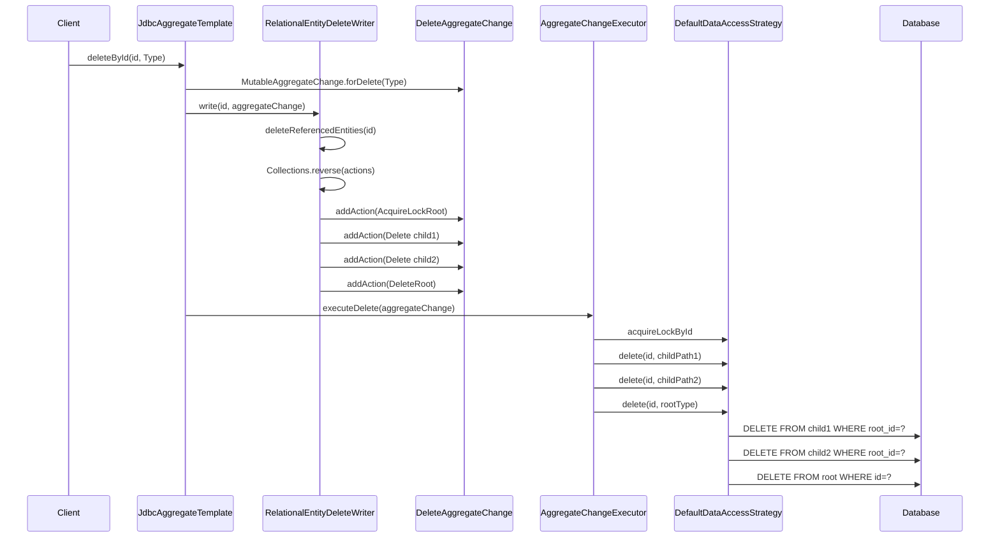
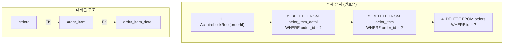

# Delete 플로우와 참조 관리

Spring Data JDBC에서 Aggregate를 삭제할 때 자식 엔티티부터 부모까지의 삭제 순서, 캐스케이딩 삭제 메커니즘, 참조 무결성 보장 방법을 소스코드 기반으로 분석한다.

## 목차
- [1. 핵심 개념 (What)](#1-핵심-개념-what)
- [2. 왜 알아야 하는가 (Why)](#2-왜-알아야-하는가-why)
- [3. 내부 구현 분석 (How)](#3-내부-구현-분석-how)
- [4. 실전 예제](#4-실전-예제)
- [5. 정리](#5-정리)

---

## 1. 핵심 개념 (What)

Spring Data JDBC는 JPA와 달리 ORM의 캐스케이드 설정 없이도 **Aggregate 경계 내의 모든 엔티티를 자동으로 삭제**한다. 이는 DDD의 Aggregate 개념을 충실히 따르는 설계로, Aggregate Root가 삭제되면 소속된 모든 자식 엔티티가 함께 삭제된다.

### 핵심 클래스

| 클래스 | 역할 |
|--------|------|
| `RelationalEntityDeleteWriter` | 삭제 대상을 `DbAction` 리스트로 변환 |
| `DeleteAggregateChange` | 삭제에 대한 변경 사항을 담는 컨테이너 |
| `DbAction.Delete` | 자식 엔티티 삭제 액션 |
| `DbAction.DeleteRoot` | 루트 엔티티 삭제 액션 |
| `DbAction.DeleteAll` | 특정 경로의 전체 자식 삭제 |
| `DbAction.DeleteAllRoot` | 루트 타입 전체 삭제 |
| `DbAction.AcquireLockRoot` | 삭제 전 락 획득 |
| `AggregateChangeExecutor` | `DbAction`을 실제 SQL로 실행 |
| `DefaultDataAccessStrategy` | SQL 생성 및 실행 담당 |

## 2. 왜 알아야 하는가 (Why)

- **참조 무결성 보장**: 외래 키 제약조건이 있는 테이블에서 삭제 순서가 잘못되면 `DataIntegrityViolationException`이 발생한다. Spring Data JDBC가 이를 어떻게 방지하는지 알아야 한다.
- **성능 이해**: `deleteAll()`이 왜 모든 자식 테이블에 대해 별도 DELETE를 실행하는지 이해하면 대량 삭제 시 성능 전략을 세울 수 있다.
- **Optimistic Locking**: `@Version` 필드가 삭제 시에도 적용되는 메커니즘을 파악할 수 있다.
- **디버깅**: 삭제가 실패하거나 예상치 못한 데이터가 남을 때 내부 플로우를 추적할 수 있다.

## 3. 내부 구현 분석 (How)

### 3.1 삭제 플로우 전체 아키텍처



### 3.2 RelationalEntityDeleteWriter의 동작

`RelationalEntityDeleteWriter`는 엔티티의 매핑 메타데이터를 탐색하여 삭제해야 할 모든 경로를 수집하고, 적절한 순서의 `DbAction` 리스트를 생성한다.

**단일 엔티티 삭제** (`deleteRoot`):

```java
// RelationalEntityDeleteWriter.deleteRoot() - 93행
private <T> List<DbAction<?>> deleteRoot(Object id, MutableAggregateChange<T> aggregateChange) {
    // 1. 자식 엔티티 삭제 액션 수집
    List<DbAction<?>> deleteReferencedActions = deleteReferencedEntities(id, aggregateChange);

    List<DbAction<?>> actions = new ArrayList<>();
    // 2. 자식이 있으면 먼저 락 획득
    if (!deleteReferencedActions.isEmpty()) {
        actions.add(new DbAction.AcquireLockRoot<>(id, aggregateChange.getEntityType()));
    }
    // 3. 자식 삭제 액션 추가
    actions.addAll(deleteReferencedActions);
    // 4. 루트 삭제 (버전 정보 포함)
    actions.add(new DbAction.DeleteRoot<>(id,
        aggregateChange.getEntityType(),
        aggregateChange.getPreviousVersion()));

    return actions;
}
```

**자식 엔티티 탐색 및 역순 정렬**:

```java
// RelationalEntityDeleteWriter.deleteReferencedEntities() - 114행
private List<DbAction<?>> deleteReferencedEntities(Object id, AggregateChange<?> aggregateChange) {
    List<DbAction<?>> actions = new ArrayList<>();

    // 모든 관계 경로를 탐색
    forAllTableRepresentingPaths(
        aggregateChange.getEntityType(),
        p -> actions.add(new DbAction.Delete<>(id, p))
    );

    // 역순 정렬: 가장 깊은 자식부터 삭제
    Collections.reverse(actions);

    return actions;
}
```

`forAllTableRepresentingPaths`는 `RelationalMappingContext.findPersistentPropertyPaths()`를 사용하여 `isRelation()` 조건에 맞는 모든 속성 경로를 찾는다. 이 경로들은 기본적으로 얕은 순서(부모 -> 자식)로 반환되므로, `Collections.reverse()`를 통해 깊은 순서(자식 -> 부모)로 뒤집는다.

### 3.3 deleteAll 플로우

전체 삭제는 개별 삭제와 구조가 유사하지만, `DeleteAll`과 `DeleteAllRoot`를 사용한다.

```java
// RelationalEntityDeleteWriter.deleteAll() - 73행
private List<DbAction<?>> deleteAll(Class<?> entityType) {
    List<DbAction<?>> deleteReferencedActions = new ArrayList<>();

    // 모든 관계 경로에 대해 DeleteAll 생성
    forAllTableRepresentingPaths(entityType,
        p -> deleteReferencedActions.add(new DbAction.DeleteAll<>(p)));

    // 역순 정렬
    Collections.reverse(deleteReferencedActions);

    List<DbAction<?>> actions = new ArrayList<>();
    if (!deleteReferencedActions.isEmpty()) {
        // 전체 락 획득
        actions.add(new DbAction.AcquireLockAllRoot<>(entityType));
    }
    actions.addAll(deleteReferencedActions);
    // 루트 전체 삭제
    actions.add(new DbAction.DeleteAllRoot<>(entityType));

    return actions;
}
```

### 3.4 DbAction의 실행

`AggregateChangeExecutor`는 `DbAction`의 타입에 따라 적절한 실행 메서드를 호출한다.

```java
// AggregateChangeExecutor.execute() - 80행
private void execute(DbAction<?> action, JdbcAggregateChangeExecutionContext ctx) {
    if (action instanceof DbAction.Delete<?> delete) {
        ctx.executeDelete(delete);          // 자식 삭제
    } else if (action instanceof DbAction.DeleteRoot<?> deleteRoot) {
        ctx.executeDeleteRoot(deleteRoot);  // 루트 삭제
    } else if (action instanceof DbAction.DeleteAll<?> deleteAll) {
        ctx.executeDeleteAll(deleteAll);    // 자식 전체 삭제
    } else if (action instanceof DbAction.DeleteAllRoot<?> deleteAllRoot) {
        ctx.executeDeleteAllRoot(deleteAllRoot); // 루트 전체 삭제
    } else if (action instanceof DbAction.AcquireLockRoot<?> acquireLockRoot) {
        ctx.executeAcquireLock(acquireLockRoot); // 락 획득
    }
    // ... 기타 액션
}
```

### 3.5 DefaultDataAccessStrategy의 삭제 SQL 실행

```java
// DefaultDataAccessStrategy.delete() (단일) - 183행
public void delete(Object id, Class<?> domainType) {
    String deleteByIdSql = sql(domainType).getDeleteById();
    SqlParameterSource parameter = sqlParametersFactory.forQueryById(id, domainType);
    operations.update(deleteByIdSql, parameter);
}

// DefaultDataAccessStrategy.delete() (경로 기반) - 217행
public void delete(Object rootId,
        PersistentPropertyPath<RelationalPersistentProperty> propertyPath) {
    String delete = sql(rootEntity.getType()).createDeleteByPath(propertyPath);
    SqlIdentifierParameterSource parameters =
        sqlParametersFactory.forQueryById(rootId, rootEntity.getType());
    operations.update(delete, parameters);
}
```

### 3.6 삭제 순서와 참조 무결성

3레벨 Aggregate 구조에서의 삭제 순서를 시각화하면:



이 순서가 보장되는 이유:
1. `findPersistentPropertyPaths()`가 `Order.items`, `Order.items.details` 순서로 경로를 반환
2. `Collections.reverse()`가 이를 `details`, `items` 순서로 뒤집음
3. 가장 깊은 자식(`details`)부터 삭제하므로 FK 제약조건 위반이 발생하지 않음

### 3.7 Optimistic Locking과 삭제

`@Version` 필드가 있는 엔티티의 삭제는 `deleteWithVersion()`을 통해 처리된다.

```java
// DefaultDataAccessStrategy.deleteWithVersion() - 201행
public <T> void deleteWithVersion(Object id, Class<T> domainType, Number previousVersion) {
    SqlIdentifierParameterSource parameterSource =
        sqlParametersFactory.forQueryById(id, domainType);
    parameterSource.addValue(VERSION_SQL_PARAMETER, previousVersion);

    int affectedRows = operations.update(
        sql(domainType).getDeleteByIdAndVersion(), parameterSource);

    if (affectedRows == 0) {
        throw OptimisticLockingUtils.deleteFailed(id, previousVersion, persistentEntity);
    }
}
```

생성되는 SQL: `DELETE FROM orders WHERE id = :id AND version = :___oldOptimisticLockingVersion`

## 4. 실전 예제

### 4.1 기본 Aggregate 삭제

```java
@Table("orders")
public class Order {
    @Id
    private Long id;
    private String status;

    @MappedCollection(idColumn = "ORDER_ID")
    private Set<OrderItem> items = new HashSet<>();
}

@Table("order_item")
public class OrderItem {
    private String productName;
    private int quantity;
}

// 삭제 시 실행되는 SQL 순서:
// 1) SELECT id FROM orders WHERE id = ? FOR UPDATE  (락 획득)
// 2) DELETE FROM order_item WHERE ORDER_ID = ?       (자식 먼저)
// 3) DELETE FROM orders WHERE id = ?                 (루트 나중에)
repository.deleteById(1L);
```

### 4.2 Optimistic Locking이 적용된 삭제

```java
@Table("orders")
public class Order {
    @Id
    private Long id;

    @Version
    private Long version;

    private String status;

    @MappedCollection(idColumn = "ORDER_ID")
    private Set<OrderItem> items = new HashSet<>();
}

// 삭제 시:
// 1) SELECT id FROM orders WHERE id = ? FOR UPDATE
// 2) DELETE FROM order_item WHERE ORDER_ID = ?
// 3) DELETE FROM orders WHERE id = ? AND version = ?  <-- 버전 체크
//    -> 0행 영향 시 OptimisticLockingFailureException 발생

Order order = repository.findById(1L).orElseThrow();
repository.delete(order);
```

### 4.3 전체 삭제 (deleteAll)

```java
// 실행되는 SQL 순서:
// 1) SELECT id FROM orders FOR UPDATE               (전체 락)
// 2) DELETE FROM order_item                          (자식 전체)
// 3) DELETE FROM orders                              (루트 전체)
repository.deleteAll();
```

### 4.4 다레벨 Aggregate 삭제

```java
@Table("orders")
public class Order {
    @Id private Long id;

    @MappedCollection(idColumn = "ORDER_ID")
    private List<OrderItem> items = new ArrayList<>();
}

@Table("order_item")
public class OrderItem {
    @Id private Long id;

    @MappedCollection(idColumn = "ORDER_ITEM_ID")
    private List<OrderItemDetail> details = new ArrayList<>();
}

@Table("order_item_detail")
public class OrderItemDetail {
    private String note;
}

// deleteById(1L) 실행 시:
// 1) SELECT id FROM orders WHERE id = 1 FOR UPDATE
// 2) DELETE FROM order_item_detail WHERE order_id = 1  (가장 깊은 자식)
// 3) DELETE FROM order_item WHERE ORDER_ID = 1          (중간 자식)
// 4) DELETE FROM orders WHERE id = 1                    (루트)
```

## 5. 정리

| 항목 | 설명 |
|------|------|
| 삭제 전략 | Aggregate 경계 내 전체 캐스케이딩 삭제 (자동) |
| 삭제 순서 | 가장 깊은 자식 -> 부모 -> 루트 (FK 안전 순서) |
| 락 전략 | 자식이 있으면 루트에 `FOR UPDATE` 락 획득 후 삭제 |
| Optimistic Locking | `@Version` 사용 시 `WHERE id=? AND version=?` 조건 추가 |
| deleteAll | 모든 자식 테이블을 순회하며 `DELETE FROM table` 실행 |
| 핵심 Writer | `RelationalEntityDeleteWriter` - 경로 탐색 및 액션 생성 |
| 핵심 Executor | `AggregateChangeExecutor` - `DbAction`별 SQL 실행 |
| DB 레벨 CASCADE 불필요 | Spring Data JDBC가 애플리케이션 레벨에서 순서를 관리 |

**핵심 포인트**: Spring Data JDBC는 데이터베이스의 `ON DELETE CASCADE`에 의존하지 않는다. 대신 `RelationalEntityDeleteWriter`가 매핑 메타데이터를 기반으로 삭제 순서를 결정하고, 가장 깊은 자식부터 역순으로 삭제하여 참조 무결성을 보장한다.

---
*참고: Spring Data JDBC 3.x / Spring Boot 3.x 기준*
